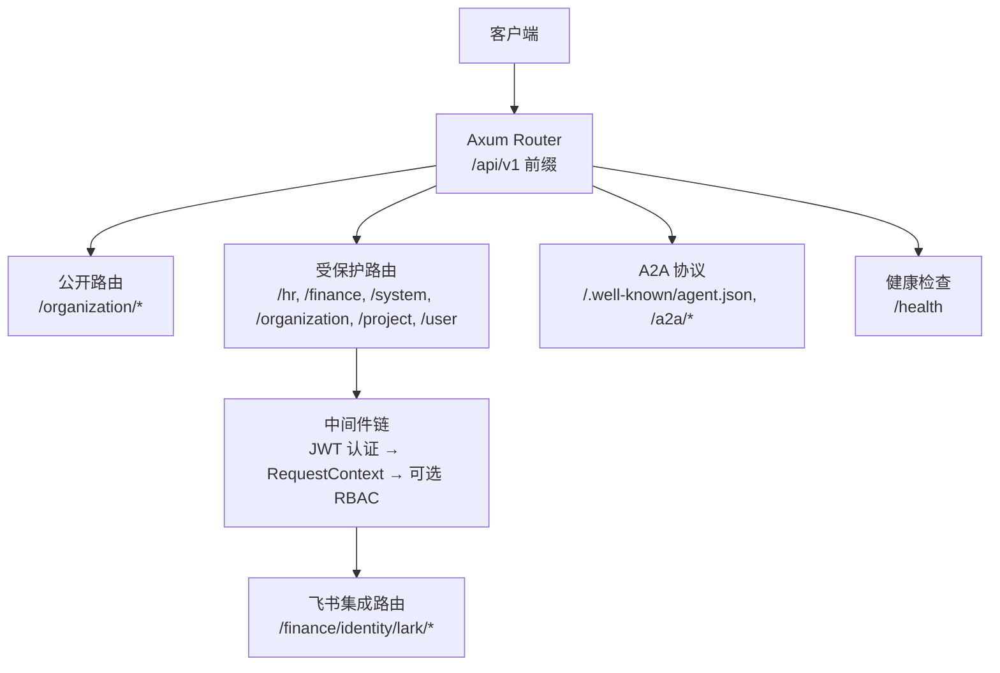
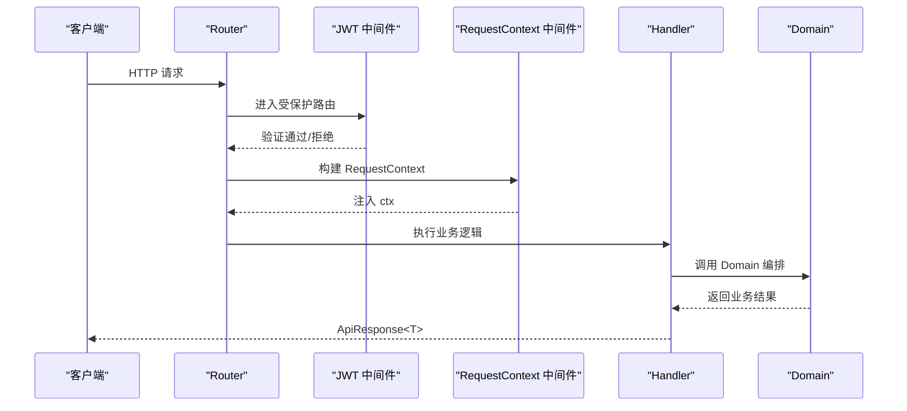
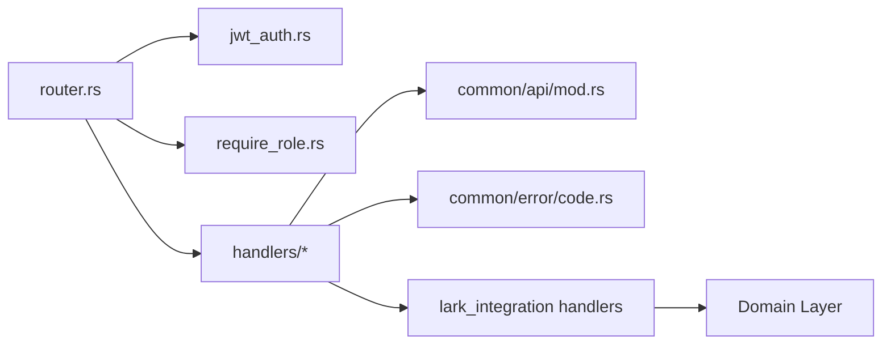

# RESTful API

<cite>
**本文引用的文件**
- [router.rs](file://src/router.rs)
- [jwt_auth.rs](file://src/middleware/jwt_auth.rs)
- [require_role.rs](file://src/middleware/require_role.rs)
- [auth.rs](file://common/src/api/auth.rs)
- [mod.rs（统一响应与分页）](file://common/src/api/mod.rs)
- [lark_integration.rs（飞书集成DTO）](file://common/src/api/lark_integration.rs)
- [code.rs（错误码定义）](file://common/src/error/code.rs)
- [login.rs（登录处理器）](file://src/handlers/organization/auth/login.rs)
- [subscribe_sse.rs（SSE 订阅）](file://src/handlers/finance/message/subscribe_sse.rs)
- [create_credential.rs（创建凭证处理器）](file://src/handlers/finance/lark_integration/create_credential.rs)
- [update_credential.rs（更新凭证处理器）](file://src/handlers/finance/lark_integration/update_credential.rs)
- [delete_credential.rs（删除凭证处理器）](file://src/handlers/finance/lark_integration/delete_credential.rs)
- [set_default_credential.rs（设置默认凭证处理器）](file://src/handlers/finance/lark_integration/set_default_credential.rs)
- [auth_start.rs（授权开始处理器）](file://src/handlers/finance/lark_integration/auth_start.rs)
- [auth_complete.rs（授权完成处理器）](file://src/handlers/finance/lark_integration/auth_complete.rs)
- [auth_status.rs（授权状态处理器）](file://src/handlers/finance/lark_integration/auth_status.rs)
- [auth_logout.rs（授权登出处理器）](file://src/handlers/finance/lark_integration/auth_logout.rs)
- [bind_start.rs（绑定开始处理器）](file://src/handlers/finance/lark_integration/bind_start.rs)
- [bind_status.rs（绑定状态处理器）](file://src/handlers/finance/lark_integration/bind_status.rs)
- [bind_cancel.rs（绑定取消处理器）](file://src/handlers/finance/lark_integration/bind_cancel.rs)
- [get_status.rs（绑定快照聚合处理器）](file://src/handlers/finance/lark_integration/get_status.rs)
</cite>

## 更新摘要
**变更内容**
- 新增飞书集成相关接口章节，包含12个新端点
- 新增凭证CRUD、认证流程、绑定管理等完整API文档
- 更新路由结构图以反映新的飞书集成路由
- 新增飞书集成的请求/响应示例和错误处理说明

## 目录
1. [简介](#简介)
2. [项目结构](#项目结构)
3. [核心组件](#核心组件)
4. [架构总览](#架构总览)
5. [详细接口文档](#详细接口文档)
6. [依赖关系分析](#依赖关系分析)
7. [性能与速率限制](#性能与速率限制)
8. [故障排查指南](#故障排查指南)
9. [结论](#结论)
10. [附录](#附录)

## 简介
本文件为 AI Orz 的 RESTful API 提供完整、可操作的接口说明。内容覆盖：
- 所有 HTTP 端点（GET/POST/PUT/DELETE），URL 模式、请求参数、响应格式、错误码
- 认证机制（JWT，Cookie/Bearer 双模式）、权限控制（RBAC）、请求上下文处理
- 分页、搜索、过滤等高级查询能力
- 文件上传、SSE 流式推送等特殊交互
- **新增**：飞书集成完整API，包括凭证管理、OAuth认证、绑定流程等
- 安全建议、最佳实践与常见问题排查

## 项目结构
API 路由集中在路由层，按"公开路由"和"受保护路由"分组；系统级路由整体要求管理员角色；A2A 协议相关端点独立挂载；健康检查与前端静态资源兜底也在此处配置。**新增飞书集成路由组**，位于 `/api/v1/finance/identity/lark/` 路径下。

**图表来源**
- [router.rs:12-136](file://src/router.rs#L12-L136)
- [router.rs:216-247](file://src/router.rs#L216-L247)

**章节来源**
- [router.rs:12-136](file://src/router.rs#L12-L136)
- [router.rs:216-247](file://src/router.rs#L216-L247)

## 核心组件
- 统一响应体 ApiResponse<T>：包含 code、message、data 字段，成功时 data 存在
- 分页参数 PaginationParams：limit、offset
- 分页结果 PagedResult<T>：items、total
- 错误码 ErrorCode：统一的业务错误分类与 HTTP 状态映射
- JWT 认证中间件：支持 Cookie 与 Authorization: Bearer 双模式，失败时浏览器重定向到登录页，API 返回 401 JSON
- 角色权限中间件：基于 UserRole 的最小权限校验，不满足返回 403
- 请求上下文 RequestContext：由中间件注入用户身份、组织、角色等信息，供后续 Handler 使用
- **新增**：飞书集成DTO类型，包含凭证CRUD、OAuth认证、绑定管理等完整数据结构

**章节来源**
- [mod.rs（统一响应与分页）:6-83](file://common/src/api/mod.rs#L6-L83)
- [lark_integration.rs:1-294](file://common/src/api/lark_integration.rs#L1-L294)
- [code.rs:5-142](file://common/src/error/code.rs#L5-L142)
- [jwt_auth.rs:25-87](file://src/middleware/jwt_auth.rs#L25-L87)
- [require_role.rs:16-38](file://src/middleware/require_role.rs#L16-L38)

## 架构总览
请求进入 Axum 路由器后，先匹配路径并选择对应中间件链：
- 公开路由：仅注入 RequestContext（用于日志 ID 等上下文）
- 受保护路由：外层 JWT 认证 → 内层 RequestContext 提取 → 可选 require_role 权限校验
- A2A 协议：部分端点无需 JWT（如 agent card、回调），JSON-RPC 与 subscribe 需要 JWT
- **新增**：飞书集成路由通过 finance domain 的 identity_credential_manage 进行业务编排

**图表来源**
- [router.rs:96-136](file://src/router.rs#L96-L136)
- [jwt_auth.rs:36-87](file://src/middleware/jwt_auth.rs#L36-L87)
- [require_role.rs:20-38](file://src/middleware/require_role.rs#L20-L38)

## 详细接口文档

### 通用约定
- 基础路径：/api/v1
- 统一响应体：ApiResponse<T>
  - code：0 表示成功，非 0 表示错误
  - message：错误信息或成功提示
  - data：成功时的数据体
- 分页参数：limit、offset（查询列表接口通常支持）
- 认证：
  - 浏览器：Cookie 自动携带 ai_orz_jwt
  - API 调用：Authorization: Bearer <token>
- 权限：
  - 系统管理路由整体要求 Admin（SuperAdmin 也可）
  - 个别高危操作在 Handler 内部二次校验 SuperAdmin

**章节来源**
- [mod.rs（统一响应与分页）:6-83](file://common/src/api/mod.rs#L6-L83)
- [router.rs:110-117](file://src/router.rs#L110-L117)

### 认证与会话
- 登录
  - POST /api/v1/organization/auth/login
  - 请求体：LoginRequest（username、password_hash、organization_id）
  - 响应：ApiResponse<LoginResponse>（user_id、username、organization_id、token）
  - 行为：验证成功后设置 Cookie（ai_orz_jwt），同时返回 token 便于 API 工具调用
- 登出
  - POST /api/v1/organization/auth/logout
  - 响应：ApiResponse<LogoutResponse>（success）
- 获取当前组织
  - GET /api/v1/organization/me
  - 需 JWT
- 更新当前组织
  - PUT /api/v1/organization/me
  - 需 JWT
- 列出组织
  - GET /api/v1/organization/list（公开）
- 删除组织
  - DELETE /api/v1/organization/{organization_id}
  - 需 JWT
- 获取/更新组织
  - GET/PUT /api/v1/organization/{organization_id}
  - 需 JWT
- 组织用户管理
  - POST /api/v1/organization/user（创建用户）
  - GET /api/v1/organization/user/me/list（当前组织用户列表）
  - GET /api/v1/organization/user/{org_id}/list（指定组织用户列表）
  - PUT /api/v1/organization/user/update（更新用户）
  - GET /api/v1/organization/user/username/{username}（按用户名查询）
  - DELETE /api/v1/organization/user/id/{user_id}（删除用户）

**章节来源**
- [router.rs:63-94](file://src/router.rs#L63-L94)
- [router.rs:242-290](file://src/router.rs#L242-L290)
- [auth.rs:5-38](file://common/src/api/auth.rs#L5-L38)
- [login.rs:18-69](file://src/handlers/organization/auth/login.rs#L18-L69)

### HR（智能体与技能）
- 智能体
  - POST /api/v1/hr/agents（创建）
  - GET /api/v1/hr/agents（列表）
  - POST /api/v1/hr/agents/query（分页查询）
  - POST /api/v1/hr/agents/search（全文检索）
  - GET /api/v1/hr/agents/reception（获取前台接待智能体）
  - POST /api/v1/hr/agents/external（创建外部智能体）
  - GET /api/v1/hr/agents/{id}（详情）
  - PUT /api/v1/hr/agents/{id}（更新）
  - PUT /api/v1/hr/agents/{id}/status（状态变更）
  - DELETE /api/v1/hr/agents/{id}（删除）
  - GET /api/v1/hr/agents/{agent_id}/tool-packs（已安装工具包）
  - POST /api/v1/hr/agents/{agent_id}/tool-packs/{tag}（安装工具包）
  - DELETE /api/v1/hr/agents/{agent_id}/tool-packs/{tag}（卸载工具包）
  - GET /api/v1/hr/agents/{agent_id}/skill-packs（已安装技能包）
  - POST /api/v1/hr/agents/{agent_id}/skill-packs/{tag}（安装技能包）
  - DELETE /api/v1/hr/agents/{agent_id}/skill-packs/{tag}（卸载技能包）
  - POST /api/v1/hr/agents/{agent_id}/tools/{tool_id}/bind（绑定工具）
  - DELETE /api/v1/hr/agents/{agent_id}/tools/{tool_id}/bind（解绑工具）
  - POST /api/v1/hr/agents/search_memory（记忆搜索）
  - POST /api/v1/hr/agents/query_memory（记忆查询）
  - POST /api/v1/hr/agents/recommend_seed_nodes（推荐种子节点）
- 技能
  - POST /api/v1/hr/skills（创建）
  - GET /api/v1/hr/skills（列表）
  - POST /api/v1/hr/skills/query（分页查询）
  - POST /api/v1/hr/skills/search（全文检索）
  - GET /api/v1/hr/skills/tags（标签列表）
  - GET /api/v1/hr/skills/{id}（详情）
  - PUT /api/v1/hr/skills/{id}（更新）
  - DELETE /api/v1/hr/skills/{id}（删除）
  - GET /api/v1/hr/agents/{agent_id}/skills（智能体已安装技能）
  - POST/DELETE /api/v1/hr/agents/{agent_id}/skills/{skill_id}（安装/卸载技能）
  - GET /api/v1/hr/skills/{skill_id}/files（技能文件列表）
  - GET/PUT /api/v1/hr/skills/{skill_id}/files/{*filename}（读取/更新文件内容）

**章节来源**
- [router.rs:292-413](file://src/router.rs#L292-L413)

### Finance（模型、消息、附件、MCP、工具）
- 附件
  - POST /api/v1/finance/attachments/upload（二进制上传）
  - POST /api/v1/finance/attachments/text（文本附件）
  - GET /api/v1/finance/attachments（列表）
  - GET /api/v1/finance/attachments/{id}/content（获取内容）
  - PUT /api/v1/finance/attachments/{id}/content（更新内容）
  - GET /api/v1/finance/attachments/{id}（元信息）
  - DELETE /api/v1/finance/attachments/{id}（删除）
- 模型提供者
  - POST /api/v1/finance/model-providers（创建）
  - GET /api/v1/finance/model-providers（列表）
  - GET /api/v1/finance/model-providers/{id}（详情）
  - PUT /api/v1/finance/model-providers/{id}（更新）
  - POST /api/v1/finance/model-providers/{id}/test（测试连接）
  - POST /api/v1/finance/model-providers/{id}/switch（切换嵌入提供者）
  - GET /api/v1/finance/model-providers/rebuild-progress（重建进度）
  - POST /api/v1/finance/model-providers/{id}/call（调用模型）
  - DELETE /api/v1/finance/model-providers/{id}（删除）
- 消息
  - POST /api/v1/finance/messages/agents（发送消息给智能体）
  - GET /api/v1/finance/messages（列表）
  - POST /api/v1/finance/messages/search（全文检索）
  - GET /api/v1/finance/messages/sse（SSE 实时推送订阅）
- 消息通道
  - POST /api/v1/finance/message-channels（创建）
  - GET /api/v1/finance/message-channels（列表）
  - GET /api/v1/finance/message-channels/{id}（详情）
  - PUT /api/v1/finance/message-channels/{id}（更新）
  - PUT /api/v1/finance/message-channels/{id}/status（状态更新）
  - POST /api/v1/finance/message-channels/{id}/test（测试连接）
  - DELETE /api/v1/finance/message-channels/{id}（删除）
- MCP 服务器与工具
  - POST /api/v1/finance/mcp-servers（创建）
  - GET /api/v1/finance/mcp-servers（列表）
  - GET /api/v1/finance/mcp-servers/{id}（详情）
  - PUT /api/v1/finance/mcp-servers/{id}（更新）
  - PUT /api/v1/finance/mcp-servers/{id}/status（状态更新）
  - DELETE /api/v1/finance/mcp-servers/{id}（删除）
  - POST /api/v1/finance/mcp-servers/{server_id}/tools/sync（同步工具）
  - GET /api/v1/finance/mcp-servers/{server_id}/tools（列出工具）
- 工具
  - POST /api/v1/finance/tools（创建）
  - GET /api/v1/finance/tools（列表）
  - POST /api/v1/finance/tools/query（分页查询）
  - POST /api/v1/finance/tools/search（全文检索）
  - GET /api/v1/finance/tools/tags（标签列表）
  - GET /api/v1/finance/tool-call-entries（调用记录列表）
  - GET /api/v1/finance/tool-call-entries/{call_id}（调用记录详情）
  - GET /api/v1/finance/tools/{id}（详情）
  - PUT /api/v1/finance/tools/{id}（更新）
  - PUT /api/v1/finance/tools/{id}/status（状态更新）
  - POST /api/v1/finance/tools/{id}/debug-call（调试调用，需 Admin）
  - POST/DELETE /api/v1/finance/agents/{agent_id}/tools/{tool_id}/bind（绑定/解绑）
  - DELETE /api/v1/finance/tools/{id}（删除）

**章节来源**
- [router.rs:415-601](file://src/router.rs#L415-L601)

### Project（项目、任务、产物）
- 项目
  - POST /api/v1/project/projects（创建）
  - GET /api/v1/project/projects（列表）
  - POST /api/v1/project/projects/query（分页查询）
  - POST /api/v1/project/projects/search（全文检索）
  - GET /api/v1/project/projects/{id}（详情）
  - PUT /api/v1/project/projects/{id}（更新）
  - PUT /api/v1/project/projects/{id}/status（状态更新）
- 任务
  - POST /api/v1/tasks（创建）
  - GET /api/v1/tasks（列表）
  - POST /api/v1/tasks/query（分页查询）
  - POST /api/v1/tasks/search（全文检索）
  - GET /api/v1/tasks/{id}（详情）
  - PUT /api/v1/tasks/{id}（更新）
  - PUT /api/v1/tasks/{id}/status（状态更新）
  - PUT /api/v1/tasks/{id}/progress（进度更新）
  - GET /api/v1/projects/{project_id}/tasks（项目下任务列表）
  - GET /api/v1/agents/{agent_id}/tasks（智能体关联任务列表）
- 产物（Artifact）
  - POST /api/v1/project/artifacts（创建）
  - GET /api/v1/project/artifacts（列表）
  - POST /api/v1/project/artifacts/text（文本产物）
  - POST /api/v1/project/artifacts/register-from-path（从路径注册）
  - GET /api/v1/project/artifacts/{id}（详情）
  - PUT /api/v1/project/artifacts/{id}（更新）
  - DELETE /api/v1/project/artifacts/{id}（删除）
  - GET /api/v1/project/artifacts/{id}/content（获取内容）

**章节来源**
- [router.rs:145-240](file://src/router.rs#L145-L240)
- [router.rs:177-213](file://src/router.rs#L177-L213)

### System（系统管理）
- 定时触发器
  - POST /api/v1/system/cron-triggers（创建）
  - GET /api/v1/system/cron-triggers（列表）
  - GET /api/v1/system/cron-triggers/{trigger_id}（详情）
  - PUT /api/v1/system/cron-triggers/{trigger_id}（更新）
  - DELETE /api/v1/system/cron-triggers/{trigger_id}（删除）
  - POST /api/v1/system/cron-triggers/{trigger_id}/pause（暂停）
  - POST /api/v1/system/cron-triggers/{trigger_id}/resume（恢复）
- 备份
  - POST /api/v1/system/backups（创建）
  - GET /api/v1/system/backups（列表）
  - DELETE /api/v1/system/backups/{version}（删除）
  - POST /api/v1/system/backups/{version}/restore（恢复）
- 日志
  - GET /api/v1/system/logs（查询日志）
  - GET /api/v1/system/logs/stats/level-distribution（级别分布统计）
  - GET /api/v1/system/logs/stats/time-series（时序统计）
- AOP 监控
  - GET /api/v1/system/aop/stats（队列总览）
  - GET /api/v1/system/aop/{consumer}/stats（消费者队列统计）
  - GET /api/v1/system/aop/{consumer}/events（事件列表）
  - GET /api/v1/system/aop/{consumer}/events/{event_id}（事件详情）
  - GET /api/v1/system/aop/stats/overview（实时概览）
  - GET /api/v1/system/aop/stats/time-series（实时时序）
  - GET /api/v1/system/aop/stats/distribution（实时分布）
- 健康指标
  - GET /api/v1/system/health/metrics（聚合指标）
- Seed（配置迁移）
  - GET /api/v1/system/seed/list（列出 seed）
  - GET /api/v1/system/seed/file/{name}（读取 seed 文件）
  - DELETE /api/v1/system/seed/file/{name}（删除 seed 文件）
  - POST /api/v1/system/seed/save（保存 seed）
  - POST /api/v1/system/seed/load/{name}（加载 seed）
  - POST /api/v1/system/seed/diff/{name}（差异对比）
  - POST /api/v1/system/seed/diff-files（文件差异对比）
  - GET /api/v1/system/seed/default（默认 seed）
  - POST /api/v1/system/seed/apply-default（应用默认）
- 后台任务
  - GET /api/v1/system/tasks/{task_id}/progress（进度查询）
  - GET /api/v1/system/tasks（任务列表）
  - POST /api/v1/system/tasks/cleanup（清理任务）

**章节来源**
- [router.rs:603-739](file://src/router.rs#L603-L739)

### A2A 协议
- Agent Card（公开发现）
  - GET /.well-known/agent.json
- JSON-RPC（需 JWT）
  - POST /api/v1/a2a
- SSE 订阅（需 JWT）
  - POST /api/v1/a2a/subscribe
- 回调（公开，外部 Agent 推送）
  - POST /api/v1/a2a/callback/{task_id}

**章节来源**
- [router.rs:19-58](file://src/router.rs#L19-L58)

### 飞书集成（Lark Integration）
**新增** 飞书集成API提供完整的凭证管理、OAuth认证和绑定功能，位于 `/api/v1/finance/identity/lark/` 路径下。

#### 凭证管理（Credentials）
- 创建凭证
  - POST /api/v1/finance/identity/lark/credentials
  - 请求体：CreateLarkCredentialRequest（name、app_id、app_secret、encrypt_key、verification_token）
  - 响应：CreateLarkCredentialResponse（credential_id）
  - 行为：手动录入飞书应用凭证，secret加密存储
- 更新凭证
  - PUT /api/v1/finance/identity/lark/credentials/{id}
  - 请求体：UpdateLarkCredentialRequest（id、name、app_id、app_secret、encrypt_key、verification_token）
  - 响应：UpdateLarkCredentialResponse（success）
  - 行为：更新凭证信息，变更时触发渠道重建联
- 删除凭证
  - DELETE /api/v1/finance/identity/lark/credentials/{id}
  - 请求体：DeleteLarkCredentialRequest（id）
  - 响应：DeleteLarkCredentialResponse（success）
  - 行为：删除凭证，如有渠道引用则返回冲突错误
- 设置默认凭证
  - POST /api/v1/finance/identity/lark/credentials/default
  - 请求体：SetDefaultLarkCredentialRequest（credential_id）
  - 响应：SetDefaultLarkCredentialResponse（success）
  - 行为：设置lark_cli工具身份优先使用的凭证

#### OAuth认证流程（Auth）
- 发起授权
  - POST /api/v1/finance/identity/lark/auth/start
  - 请求体：LarkAuthStartRequest（domains）
  - 响应：LarkAuthStartResponse（device_code、verification_url、expires_in）
  - 行为：启动device flow授权流程，返回设备码和验证URL
- 完成授权
  - POST /api/v1/finance/identity/lark/auth/complete
  - 请求体：LarkAuthCompleteRequest（device_code）
  - 响应：LarkAuthCompleteResponse（success、degraded、hint）
  - 行为：使用设备码完成授权，处理keychain降级场景
- 查询授权状态
  - GET /api/v1/finance/identity/lark/auth/status
  - 响应：LarkAuthStatusResponse（logged_in、user_name、degraded、hint）
  - 行为：查询当前用户授权状态，前置条件不满足时降级返回
- 登出授权
  - POST /api/v1/finance/identity/lark/auth/logout
  - 响应：LarkAuthLogoutResponse（success、degraded、hint）
  - 行为：取消用户授权，处理降级场景

#### 绑定管理（Bind）
- 发起绑定
  - POST /api/v1/finance/identity/lark/bind/start
  - 响应：LarkBindStartResponse（session_id、verification_url）
  - 行为：启动config init --new自动化绑定流程
- 查询绑定状态
  - GET /api/v1/finance/identity/lark/bind/status?session_id={id}
  - 响应：LarkBindStatusResponse（status、credential_id、channel_id、app_id、verification_url、error）
  - 行为：轮询绑定会话状态，支持分支A（成功）和分支B（需补填）
- 取消绑定
  - POST /api/v1/finance/identity/lark/bind/cancel
  - 请求体：LarkBindCancelRequest（session_id）
  - 响应：LarkBindCancelResponse（success）
  - 行为：取消正在进行的绑定会话

#### 绑定快照聚合（Status）
- 获取绑定快照
  - GET /api/v1/finance/identity/lark/status
  - 响应：LarkIntegrationStatusResponse（credentials、user_auth）
  - 行为：三源聚合查询（凭证库、引用渠道、用户授权状态）

**章节来源**
- [router.rs:216-247](file://src/router.rs#L216-L247)
- [lark_integration.rs:1-294](file://common/src/api/lark_integration.rs#L1-L294)
- [create_credential.rs:1-34](file://src/handlers/finance/lark_integration/create_credential.rs#L1-L34)
- [update_credential.rs:1-37](file://src/handlers/finance/lark_integration/update_credential.rs#L1-L37)
- [delete_credential.rs:1-28](file://src/handlers/finance/lark_integration/delete_credential.rs#L1-L28)
- [set_default_credential.rs:1-28](file://src/handlers/finance/lark_integration/set_default_credential.rs#L1-L28)
- [auth_start.rs:1-28](file://src/handlers/finance/lark_integration/auth_start.rs#L1-L28)
- [auth_complete.rs:1-30](file://src/handlers/finance/lark_integration/auth_complete.rs#L1-L30)
- [auth_status.rs:1-37](file://src/handlers/finance/lark_integration/auth_status.rs#L1-L37)
- [auth_logout.rs:1-36](file://src/handlers/finance/lark_integration/auth_logout.rs#L1-L36)
- [bind_start.rs:1-27](file://src/handlers/finance/lark_integration/bind_start.rs#L1-L27)
- [bind_status.rs:1-45](file://src/handlers/finance/lark_integration/bind_status.rs#L1-L45)
- [bind_cancel.rs:1-27](file://src/handlers/finance/lark_integration/bind_cancel.rs#L1-L27)
- [get_status.rs:1-102](file://src/handlers/finance/lark_integration/get_status.rs#L1-L102)

### 特殊交互

#### SSE 流式消息推送
- GET /api/v1/finance/messages/sse
- 用途：以 Server-Sent Events 方式向当前用户推送消息事件
- 认证：JWT（Cookie 或 Bearer）
- 行为：建立长连接，服务端周期性发送 keep-alive；客户端断开自动注销连接

**章节来源**
- [subscribe_sse.rs:1-92](file://src/handlers/finance/message/subscribe_sse.rs#L1-L92)

#### 文件上传与附件
- 二进制上传：POST /api/v1/finance/attachments/upload
- 文本附件：POST /api/v1/finance/attachments/text
- 获取内容：GET /api/v1/finance/attachments/{id}/content
- 更新内容：PUT /api/v1/finance/attachments/{id}/content
- 元信息：GET /api/v1/finance/attachments/{id}
- 删除：DELETE /api/v1/finance/attachments/{id}

**章节来源**
- [router.rs:415-444](file://src/router.rs#L415-L444)

### 分页、搜索与过滤
- 分页参数：limit、offset（适用于列表/查询接口）
- 搜索：多数实体提供 /search 端点（POST 请求体含搜索条件）
- 查询：多数实体提供 /query 端点（POST 请求体含过滤条件）
- 标签：部分实体提供 /tags 端点（GET 获取可用标签）

**章节来源**
- [mod.rs（统一响应与分页）:55-83](file://common/src/api/mod.rs#L55-L83)
- [router.rs:145-213](file://src/router.rs#L145-L213)
- [router.rs:292-413](file://src/router.rs#L292-L413)
- [router.rs:415-601](file://src/router.rs#L415-L601)

### 认证与权限流程

#### 登录与令牌
- 登录成功后设置 Cookie（ai_orz_jwt），同时返回 token
- 后续请求：
  - 浏览器：自动携带 Cookie
  - API 工具：在 Authorization 头添加 Bearer <token>

**章节来源**
- [auth.rs:5-38](file://common/src/api/auth.rs#L5-L38)
- [login.rs:18-69](file://src/handlers/organization/auth/login.rs#L18-L69)

#### JWT 中间件
- 认证顺序：优先 Cookie，其次 Authorization: Bearer
- 失败响应：
  - 浏览器：302 重定向到登录页
  - API：401 JSON（error_code 与 message）

**章节来源**
- [jwt_auth.rs:25-87](file://src/middleware/jwt_auth.rs#L25-L87)
- [jwt_auth.rs:139-156](file://src/middleware/jwt_auth.rs#L139-L156)

#### 角色权限（RBAC）
- 系统路由整体要求 Admin（SuperAdmin 也可）
- 个别高危操作在 Handler 内部二次校验 SuperAdmin
- 不满足权限返回 403 JSON

**章节来源**
- [router.rs:110-117](file://src/router.rs#L110-L117)
- [require_role.rs:16-38](file://src/middleware/require_role.rs#L16-L38)

## 依赖关系分析
- 路由层依赖中间件进行认证与上下文注入
- 统一响应与分页类型被各模块复用
- 错误码集中定义，便于前后端一致处理
- SSE 与附件等特性由具体 Handler 实现，遵循统一认证与上下文规范
- **新增**：飞书集成模块通过 Domain 层进行业务编排，Handler 仅负责参数验证和响应转换

**图表来源**
- [router.rs:12-136](file://src/router.rs#L12-L136)
- [mod.rs（统一响应与分页）:6-83](file://common/src/api/mod.rs#L6-L83)
- [code.rs:5-142](file://common/src/error/code.rs#L5-L142)

**章节来源**
- [router.rs:12-136](file://src/router.rs#L12-L136)
- [mod.rs（统一响应与分页）:6-83](file://common/src/api/mod.rs#L6-L83)
- [code.rs:5-142](file://common/src/error/code.rs#L5-L142)

## 性能与速率限制
- SSE 连接：
  - 使用 keep-alive 保活（间隔约 15 秒）
  - 客户端断开自动注销，避免内存泄漏
- 列表/查询：
  - 建议使用分页参数 limit/offset，避免一次性拉取大量数据
- 搜索/全文检索：
  - 合理使用搜索关键词与过滤条件，减少全表扫描
- 文件上传：
  - 注意文件大小限制与 MIME 类型校验
- 速率限制：
  - 当前代码未内置全局限流中间件；建议在网关或反向代理层实施限流策略
- **新增**：飞书集成API：
  - 绑定状态轮询建议合理间隔（如3-5秒）
  - 授权状态查询应缓存避免频繁调用
  - 凭证操作涉及敏感数据处理，注意日志脱敏

## 故障排查指南
- 401 未认证：
  - 检查 Cookie 是否设置且有效，或 Authorization 头是否正确
  - 浏览器场景会 302 重定向到登录页
- 403 权限不足：
  - 检查当前用户角色是否满足最小权限要求
- 404 资源不存在：
  - 检查路径参数是否正确
- 409 冲突：
  - 常见于重复创建或并发修改冲突
  - 飞书凭证删除时如有渠道引用会返回此错误
- 5xx 服务错误：
  - 查看后端日志与错误码，定位具体错误类型
- **新增**：飞书集成特定错误：
  - 无CLI配置时返回引导性4xx错误而非5xx
  - 授权状态查询失败时降级返回未授权+提示信息
  - 绑定会话过期返回NotFound错误

**章节来源**
- [code.rs:5-142](file://common/src/error/code.rs#L5-L142)
- [jwt_auth.rs:139-156](file://src/middleware/jwt_auth.rs#L139-L156)
- [require_role.rs:20-38](file://src/middleware/require_role.rs#L20-L38)

## 结论
AI Orz 的 RESTful API 采用清晰的分层与中间件机制，统一响应与错误码提升了一致性；JWT 双模式认证与 RBAC 权限控制保障了安全性；SSE 与附件上传等特性满足了实时与多媒体需求。**新增的飞书集成API**提供了完整的凭证管理、OAuth认证和绑定功能，通过Domain层编排实现了复杂的业务流程。建议在生产环境结合网关层实施速率限制与审计，确保稳定与安全。

## 附录

### 错误码速查
- invalid_request：400
- unauthorized：401
- forbidden：403
- resource_not_found/not_found：404
- resource_conflict/conflict：409
- payload_too_large：413
- invalid_token/jwt_invalid：401
- db_query_failed/db_migration_failed：500
- io_error：500
- third_party_unavailable：502
- third_party_error：500
- tool_*：400/500
- network_error：503
- runtime_awaken_failed/channel_push_failed/internal：500
- embedding_provider_switch_required/rebuild_in_progress：409
- unsupported_operation：400
- config_missing/config_invalid：500

**章节来源**
- [code.rs:5-142](file://common/src/error/code.rs#L5-L142)