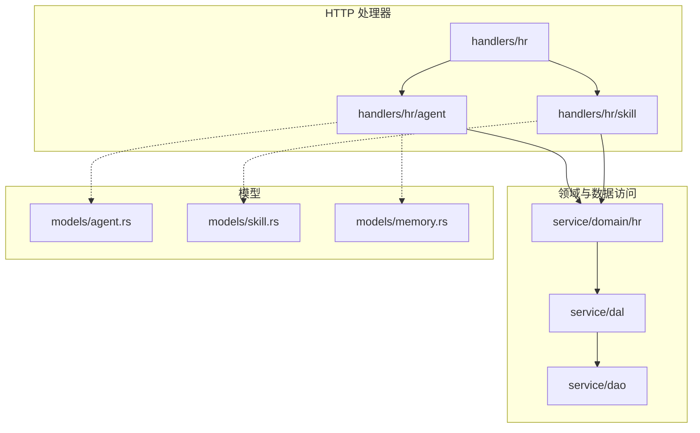
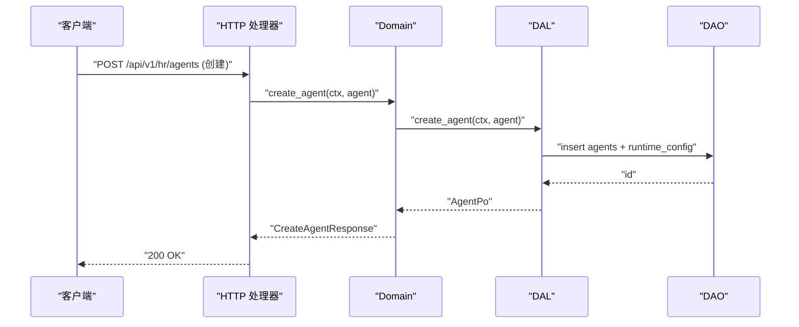
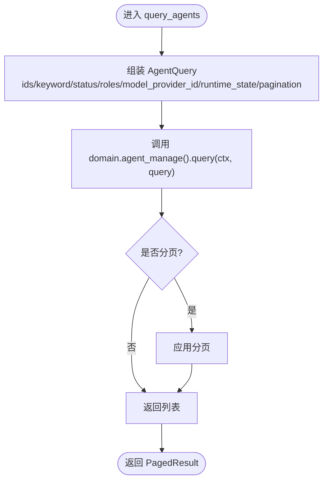
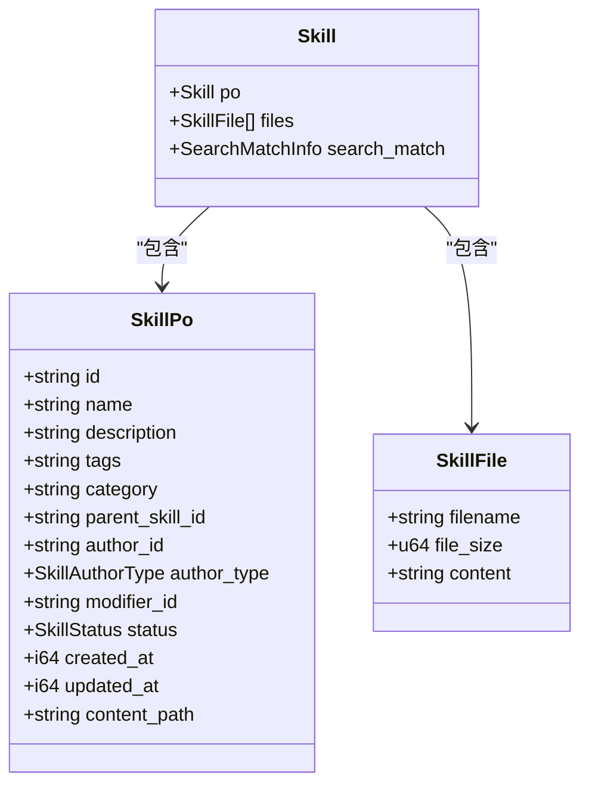
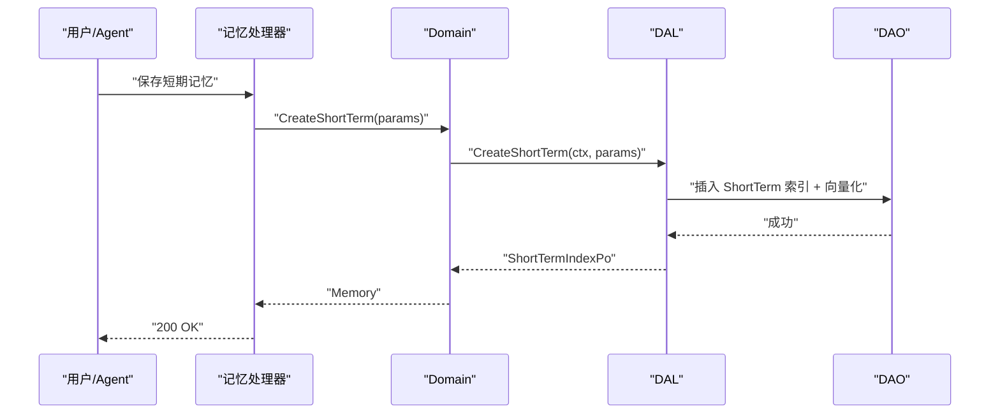
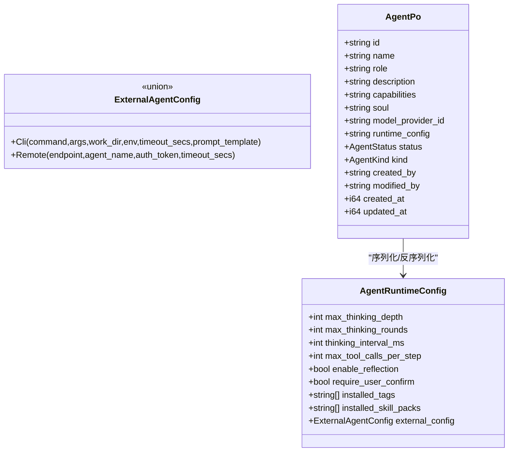
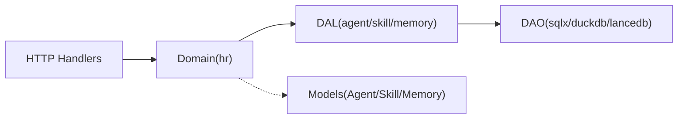

# 人力资源模块 API

<cite>
**本文引用的文件**
- [src/handlers/hr/mod.rs](file://src/handlers/hr/mod.rs)
- [src/handlers/hr/agent/mod.rs](file://src/handlers/hr/agent/mod.rs)
- [src/handlers/hr/skill/mod.rs](file://src/handlers/hr/skill/mod.rs)
- [src/handlers/hr/agent/create_agent.rs](file://src/handlers/hr/agent/create_agent.rs)
- [src/handlers/hr/agent/list_agents.rs](file://src/handlers/hr/agent/list_agents.rs)
- [src/handlers/hr/agent/query_agents.rs](file://src/handlers/hr/agent/query_agents.rs)
- [src/handlers/hr/agent/get_agent.rs](file://src/handlers/hr/agent/get_agent.rs)
- [src/handlers/hr/agent/update_agent.rs](file://src/handlers/hr/agent/update_agent.rs)
- [src/handlers/hr/agent/delete_agent.rs](file://src/handlers/hr/agent/delete_agent.rs)
- [src/handlers/hr/agent/install_skill_pack.rs](file://src/handlers/hr/agent/install_skill_pack.rs)
- [src/handlers/hr/agent/uninstall_skill_pack.rs](file://src/handlers/hr/agent/uninstall_skill_pack.rs)
- [src/handlers/hr/agent/install_tool_pack.rs](file://src/handlers/hr/agent/install_tool_pack.rs)
- [src/handlers/hr/agent/uninstall_tool_pack.rs](file://src/handlers/hr/agent/uninstall_tool_pack.rs)
- [src/handlers/hr/agent/create_memory.rs](file://src/handlers/hr/agent/create_memory.rs)
- [src/handlers/hr/agent/save_short_term_memory.rs](file://src/handlers/hr/agent/save_short_term_memory.rs)
- [src/handlers/hr/agent/save_long_term_memory.rs](file://src/handlers/hr/agent/save_long_term_memory.rs)
- [src/handlers/hr/agent/update_memory.rs](file://src/handlers/hr/agent/update_memory.rs)
- [src/handlers/hr/agent/delete_memory.rs](file://src/handlers/hr/agent/delete_memory.rs)
- [src/handlers/hr/agent/search_memory.rs](file://src/handlers/hr/agent/search_memory.rs)
- [src/handlers/hr/agent/query_memory.rs](file://src/handlers/hr/agent/query_memory.rs)
- [src/handlers/hr/agent/settle_memory.rs](file://src/handlers/hr/agent/settle_memory.rs)
- [src/handlers/hr/agent/recommend_seed_nodes.rs](file://src/handlers/hr/agent/recommend_seed_nodes.rs)
- [src/handlers/hr/skill/create_skill.rs](file://src/handlers/hr/skill/create_skill.rs)
- [src/handlers/hr/skill/list_skills.rs](file://src/handlers/hr/skill/list_skills.rs)
- [src/handlers/hr/skill/get_skill.rs](file://src/handlers/hr/skill/get_skill.rs)
- [src/handlers/hr/skill/update_skill.rs](file://src/handlers/hr/skill/update_skill.rs)
- [src/handlers/hr/skill/delete_skill.rs](file://src/handlers/hr/skill/delete_skill.rs)
- [src/handlers/hr/skill/install_skill_to_agent.rs](file://src/handlers/hr/skill/install_skill_to_agent.rs)
- [src/handlers/hr/skill/uninstall_skill_from_agent.rs](file://src/handlers/hr/skill/uninstall_skill_from_agent.rs)
- [src/handlers/hr/skill/search_skills.rs](file://src/handlers/hr/skill/search_skills.rs)
- [src/handlers/hr/skill/query_skills.rs](file://src/handlers/hr/skill/query_skills.rs)
- [src/models/agent.rs](file://src/models/agent.rs)
- [src/models/skill.rs](file://src/models/skill.rs)
- [src/models/memory.rs](file://src/models/memory.rs)
</cite>

## 目录
1. [简介](#简介)
2. [项目结构](#项目结构)
3. [核心组件](#核心组件)
4. [架构总览](#架构总览)
5. [详细组件分析](#详细组件分析)
6. [依赖关系分析](#依赖关系分析)
7. [性能考虑](#性能考虑)
8. [故障排查指南](#故障排查指南)
9. [结论](#结论)
10. [附录：API 参考与示例](#附录api-参考与示例)

## 简介
本文件为 AI Orz 人力资源模块的 API 文档，聚焦 Agent 管理、技能包管理与记忆管理三大能力。内容覆盖：
- Agent 生命周期管理（创建、查询、更新、删除、状态切换）
- 技能包安装/卸载、工具绑定/解绑
- 记忆沉淀（短期/长期）、检索与知识图谱推荐
- 复杂查询参数、分页过滤、批量操作等高级功能
- 完整的配置、技能包管理与记忆沉淀使用示例

## 项目结构
人力资源模块位于 handlers/hr 下，按 Agent 与 Skill 两个子域拆分；每个 Handler 方法独立成文件，便于路由注册与测试。模型定义集中在 models 层，分别描述 Agent、Skill、Memory 的业务实体与持久化对象。

图表来源
- [src/handlers/hr/mod.rs:1-11](file://src/handlers/hr/mod.rs#L1-L11)
- [src/handlers/hr/agent/mod.rs:1-55](file://src/handlers/hr/agent/mod.rs#L1-L55)
- [src/handlers/hr/skill/mod.rs:1-36](file://src/handlers/hr/skill/mod.rs#L1-L36)

章节来源
- [src/handlers/hr/mod.rs:1-11](file://src/handlers/hr/mod.rs#L1-L11)
- [src/handlers/hr/agent/mod.rs:1-55](file://src/handlers/hr/agent/mod.rs#L1-L55)
- [src/handlers/hr/skill/mod.rs:1-36](file://src/handlers/hr/skill/mod.rs#L1-L36)

## 核心组件
- Agent 管理：提供创建、列表、通用查询、详情获取、更新、删除、状态更新、外部 Agent 创建等接口；支持运行时状态、角色、模型提供商、标签等过滤与分页。
- 技能包管理：提供技能的增删改查、文件内容读写、标签列表、按 Agent 维度查看已安装技能、搜索与通用查询。
- 记忆管理：提供短期/长期记忆写入、更新、删除、检索、查询、归纳沉淀、知识图谱种子节点推荐等。

章节来源
- [src/handlers/hr/agent/mod.rs:1-55](file://src/handlers/hr/agent/mod.rs#L1-L55)
- [src/handlers/hr/skill/mod.rs:1-36](file://src/handlers/hr/skill/mod.rs#L1-L36)

## 架构总览
遵循四层单向调用：Adapter（HTTP Handler / 公开回调 / AOP Producer）→ Domain → DAL → DAO。Handler 仅做参数校验与上下文提取，业务逻辑在 Domain/DAL，数据访问在 DAO。所有公共方法首参为 RequestContext，跨层传递统一使用 ctx.clone()。

图表来源
- [src/handlers/hr/agent/create_agent.rs:1-60](file://src/handlers/hr/agent/create_agent.rs#L1-L60)

## 详细组件分析

### Agent 管理接口
- 创建 Agent：接收名称、角色、描述、能力、灵魂设定、模型提供商 ID，生成默认运行时配置并持久化。
- 列表 Agent：GET 列表，固定排除已删除状态，返回分页结果与运行时状态。
- 通用查询 Agent：POST body 支持 ids、keyword、status、roles、created_by、model_provider_id、runtime_state 等组合过滤与分页。
- 获取 Agent 详情：按 id 获取完整信息（含运行时注入）。
- 更新 Agent：修改元信息与运行时配置。
- 删除 Agent：软删除或硬删除（由实现决定）。
- 更新 Agent 状态：如启动/停止/下线等。
- 外部 Agent 创建：CLI/Remote 类型的外部执行器配置。

图表来源
- [src/handlers/hr/agent/query_agents.rs:1-69](file://src/handlers/hr/agent/query_agents.rs#L1-L69)
- [src/handlers/hr/agent/list_agents.rs:1-62](file://src/handlers/hr/agent/list_agents.rs#L1-L62)

章节来源
- [src/handlers/hr/agent/create_agent.rs:1-60](file://src/handlers/hr/agent/create_agent.rs#L1-L60)
- [src/handlers/hr/agent/list_agents.rs:1-62](file://src/handlers/hr/agent/list_agents.rs#L1-L62)
- [src/handlers/hr/agent/query_agents.rs:1-69](file://src/handlers/hr/agent/query_agents.rs#L1-L69)
- [src/handlers/hr/agent/get_agent.rs](file://src/handlers/hr/agent/get_agent.rs)
- [src/handlers/hr/agent/update_agent.rs](file://src/handlers/hr/agent/update_agent.rs)
- [src/handlers/hr/agent/delete_agent.rs](file://src/handlers/hr/agent/delete_agent.rs)
- [src/handlers/hr/agent/update_agent_status.rs](file://src/handlers/hr/agent/update_agent_status.rs)

### 技能包管理接口
- 创建技能：支持初始 skill.md 内容与多文件上传，自动分配目录与作者信息。
- 列出技能：支持状态、分类、作者、关键词过滤与分页。
- 获取技能详情：包含文件列表与可选内容。
- 更新技能：元数据与文件内容更新。
- 删除技能：移除技能及其关联文件。
- 安装到 Agent：将技能复制到 Agent 目录并记录 tag。
- 从 Agent 卸载：移除 tag 关联（保留副本）。
- 搜索与通用查询：支持向量/全文混合检索与复杂过滤。

图表来源
- [src/models/skill.rs:1-193](file://src/models/skill.rs#L1-L193)

章节来源
- [src/handlers/hr/skill/create_skill.rs:1-92](file://src/handlers/hr/skill/create_skill.rs#L1-L92)
- [src/handlers/hr/skill/list_skills.rs:1-41](file://src/handlers/hr/skill/list_skills.rs#L1-L41)
- [src/handlers/hr/skill/get_skill.rs](file://src/handlers/hr/skill/get_skill.rs)
- [src/handlers/hr/skill/update_skill.rs](file://src/handlers/hr/skill/update_skill.rs)
- [src/handlers/hr/skill/delete_skill.rs](file://src/handlers/hr/skill/delete_skill.rs)
- [src/handlers/hr/skill/install_skill_to_agent.rs](file://src/handlers/hr/skill/install_skill_to_agent.rs)
- [src/handlers/hr/skill/uninstall_skill_from_agent.rs](file://src/handlers/hr/skill/uninstall_skill_from_agent.rs)
- [src/handlers/hr/skill/search_skills.rs](file://src/handlers/hr/skill/search_skills.rs)
- [src/handlers/hr/skill/query_skills.rs](file://src/handlers/hr/skill/query_skills.rs)

### 记忆管理接口
- 创建记忆：写入原始 trace（阶段 1），不向量化。
- 保存短期记忆：基于 trace 聚合生成索引（阶段 2），自动向量化。
- 保存长期记忆：生成知识节点（可附带引用关系），自动向量化。
- 更新/删除记忆：对短期/长期索引进行维护。
- 搜索/查询记忆：支持向量检索、FTS5 全文检索、标签过滤与分页。
- 沉淀/总结：触发归纳流程，产出短期/长期记忆。
- 推荐种子节点：基于知识图谱度数统计返回候选起点。

图表来源
- [src/handlers/hr/agent/save_short_term_memory.rs](file://src/handlers/hr/agent/save_short_term_memory.rs)
- [src/handlers/hr/agent/save_long_term_memory.rs](file://src/handlers/hr/agent/save_long_term_memory.rs)
- [src/models/memory.rs:1-424](file://src/models/memory.rs#L1-L424)

章节来源
- [src/handlers/hr/agent/create_memory.rs](file://src/handlers/hr/agent/create_memory.rs)
- [src/handlers/hr/agent/save_short_term_memory.rs](file://src/handlers/hr/agent/save_short_term_memory.rs)
- [src/handlers/hr/agent/save_long_term_memory.rs](file://src/handlers/hr/agent/save_long_term_memory.rs)
- [src/handlers/hr/agent/update_memory.rs](file://src/handlers/hr/agent/update_memory.rs)
- [src/handlers/hr/agent/delete_memory.rs](file://src/handlers/hr/agent/delete_memory.rs)
- [src/handlers/hr/agent/search_memory.rs](file://src/handlers/hr/agent/search_memory.rs)
- [src/handlers/hr/agent/query_memory.rs](file://src/handlers/hr/agent/query_memory.rs)
- [src/handlers/hr/agent/settle_memory.rs](file://src/handlers/hr/agent/settle_memory.rs)
- [src/handlers/hr/agent/recommend_seed_nodes.rs](file://src/handlers/hr/agent/recommend_seed_nodes.rs)
- [src/models/memory.rs:1-424](file://src/models/memory.rs#L1-L424)

### Agent 生命周期与配置
- 生命周期状态：面试中、运行中、休眠、已禁用、已删除等（由枚举定义）。
- 运行时配置：最大思考深度、单次唤醒最大思考轮次、思考间隔、单步最大工具调用次数、反思模式、用户确认机制、已安装工具包/技能包 tag、外部执行器配置（CLI/Remote）。
- 工具绑定：通过工具包 tag 自动注入或显式绑定工具。
- 技能安装：安装时复制技能到 Agent 目录，卸载时仅移除 tag 关联。

图表来源
- [src/models/agent.rs:1-709](file://src/models/agent.rs#L1-L709)

章节来源
- [src/models/agent.rs:1-709](file://src/models/agent.rs#L1-L709)

## 依赖关系分析
- Handler 依赖 Domain 暴露的 hr::domain() 入口，再委托至 agent_manage/skill_manage/memory_manage 等子域服务。
- Domain/DAL 依赖 DAO 完成 SQL 与存储后端交互；DAL 对外统一使用业务实体，PO 仅在 DAO/DAL 内部使用。
- 模型层提供 Agent/Skill/Memory 的业务实体与 PO，供上层复用。

图表来源
- [src/handlers/hr/agent/mod.rs:1-55](file://src/handlers/hr/agent/mod.rs#L1-L55)
- [src/handlers/hr/skill/mod.rs:1-36](file://src/handlers/hr/skill/mod.rs#L1-L36)
- [src/models/agent.rs:1-709](file://src/models/agent.rs#L1-L709)
- [src/models/skill.rs:1-193](file://src/models/skill.rs#L1-L193)
- [src/models/memory.rs:1-424](file://src/models/memory.rs#L1-L424)

章节来源
- [src/handlers/hr/agent/mod.rs:1-55](file://src/handlers/hr/agent/mod.rs#L1-L55)
- [src/handlers/hr/skill/mod.rs:1-36](file://src/handlers/hr/skill/mod.rs#L1-L36)

## 性能考虑
- 列表与查询：优先使用分页与必要字段过滤，避免全表扫描；向量检索结合 FTS5 提升召回率与速度。
- 记忆写入：分阶段写入（trace 先入库，短期索引后向量化），减少同步开销。
- 技能文件：小文件预读，大文件按需加载，避免一次性内存膨胀。
- 运行时限制：通过 max_thinking_depth、max_thinking_rounds、thinking_interval_ms 控制 Agent 行为，防止无限循环与资源耗尽。

## 故障排查指南
- 缺少用户上下文：创建类接口会校验 uid，为空则返回无效请求错误。
- 未找到资源：get/update/delete 类接口若找不到对应实体，返回 NotFound。
- 技能导入路径安全：创建技能时对文件名进行合法性校验，防止路径遍历攻击。
- 向量检索失败：检查向量后端可用性与索引重建任务；必要时回退到 FTS5。

章节来源
- [src/handlers/hr/agent/create_agent.rs:1-60](file://src/handlers/hr/agent/create_agent.rs#L1-L60)
- [src/handlers/hr/skill/create_skill.rs:1-92](file://src/handlers/hr/skill/create_skill.rs#L1-L92)

## 结论
人力资源模块以清晰的四层架构组织，Handler 专注入参与上下文，Domain/DAL 承载业务编排，DAO 负责数据持久化。Agent 管理、技能包管理与记忆管理形成闭环：Agent 通过技能扩展能力，通过工具增强执行，通过记忆沉淀经验并支持检索与推理。配合分页、复杂查询、向量与全文检索，满足生产级需求。

## 附录：API 参考与示例

### Agent 管理
- 创建 Agent
  - 方法：POST /api/v1/hr/agents
  - 请求体：名称、角色数组、描述、能力数组、灵魂设定、模型提供商 ID
  - 响应：创建后的 id、name、description、created_at
  - 示例要点：确保 uid 存在；默认启用 require_user_confirm；可后续设置外部执行器配置
  - 参考实现
    - [src/handlers/hr/agent/create_agent.rs:1-60](file://src/handlers/hr/agent/create_agent.rs#L1-L60)
    - [src/models/agent.rs:1-709](file://src/models/agent.rs#L1-L709)

- 列表 Agent
  - 方法：GET /api/v1/hr/agents
  - 查询参数：pagination（page/page_size）
  - 行为：固定排除 Deleted 状态
  - 参考实现
    - [src/handlers/hr/agent/list_agents.rs:1-62](file://src/handlers/hr/agent/list_agents.rs#L1-L62)

- 通用查询 Agent
  - 方法：POST /api/v1/hr/agents/query
  - 请求体：ids、keyword、status、roles、created_by、model_provider_id、runtime_state、pagination
  - 行为：组合过滤 + 分页
  - 参考实现
    - [src/handlers/hr/agent/query_agents.rs:1-69](file://src/handlers/hr/agent/query_agents.rs#L1-L69)

- 获取/更新/删除/状态更新
  - 方法：GET/PUT/DELETE /api/v1/hr/agents/{id}；PATCH /api/v1/hr/agents/{id}/status
  - 参考实现
    - [src/handlers/hr/agent/get_agent.rs](file://src/handlers/hr/agent/get_agent.rs)
    - [src/handlers/hr/agent/update_agent.rs](file://src/handlers/hr/agent/update_agent.rs)
    - [src/handlers/hr/agent/delete_agent.rs](file://src/handlers/hr/agent/delete_agent.rs)
    - [src/handlers/hr/agent/update_agent_status.rs](file://src/handlers/hr/agent/update_agent_status.rs)

- 外部 Agent 创建
  - 方法：POST /api/v1/hr/agents/external
  - 请求体：executor=cli 或 remote，附带命令/端点/超时等
  - 参考实现
    - [src/handlers/hr/agent/create_external_agent.rs](file://src/handlers/hr/agent/create_external_agent.rs)

### 技能包管理
- 创建技能
  - 方法：POST /api/v1/skills
  - 请求体：name、description、tags、category、status、content（skill.md）、initial_files
  - 行为：校验 name 非空；校验文件名合法性；分配目录 skills/{id}
  - 参考实现
    - [src/handlers/hr/skill/create_skill.rs:1-92](file://src/handlers/hr/skill/create_skill.rs#L1-L92)

- 列出技能
  - 方法：GET /api/v1/skills
  - 查询参数：pagination、status、category、author、keyword
  - 行为：固定排除 Expired 状态
  - 参考实现
    - [src/handlers/hr/skill/list_skills.rs:1-41](file://src/handlers/hr/skill/list_skills.rs#L1-L41)

- 获取/更新/删除技能
  - 方法：GET/PUT/DELETE /api/v1/skills/{id}
  - 参考实现
    - [src/handlers/hr/skill/get_skill.rs](file://src/handlers/hr/skill/get_skill.rs)
    - [src/handlers/hr/skill/update_skill.rs](file://src/handlers/hr/skill/update_skill.rs)
    - [src/handlers/hr/skill/delete_skill.rs](file://src/handlers/hr/skill/delete_skill.rs)

- 安装/卸载技能到 Agent
  - 方法：POST /api/v1/hr/agents/{id}/skills/install；POST /api/v1/hr/agents/{id}/skills/uninstall
  - 行为：安装复制文件并记录 tag；卸载仅移除 tag 关联
  - 参考实现
    - [src/handlers/hr/agent/install_skill_pack.rs](file://src/handlers/hr/agent/install_skill_pack.rs)
    - [src/handlers/hr/agent/uninstall_skill_pack.rs](file://src/handlers/hr/agent/uninstall_skill_pack.rs)
    - [src/handlers/hr/skill/install_skill_to_agent.rs](file://src/handlers/hr/skill/install_skill_to_agent.rs)
    - [src/handlers/hr/skill/uninstall_skill_from_agent.rs](file://src/handlers/hr/skill/uninstall_skill_from_agent.rs)

- 搜索/通用查询技能
  - 方法：GET/POST /api/v1/skills/search；POST /api/v1/skills/query
  - 行为：向量+全文检索，支持标签、分类、作者过滤
  - 参考实现
    - [src/handlers/hr/skill/search_skills.rs](file://src/handlers/hr/skill/search_skills.rs)
    - [src/handlers/hr/skill/query_skills.rs](file://src/handlers/hr/skill/query_skills.rs)

### 记忆管理
- 创建/保存短期记忆
  - 方法：POST /api/v1/hr/agents/{id}/memory/traces；POST /api/v1/hr/agents/{id}/memory/short-term
  - 行为：阶段 1 写入 trace；阶段 2 聚合索引并自动向量化
  - 参考实现
    - [src/handlers/hr/agent/create_memory.rs](file://src/handlers/hr/agent/create_memory.rs)
    - [src/handlers/hr/agent/save_short_term_memory.rs](file://src/handlers/hr/agent/save_short_term_memory.rs)

- 保存长期记忆
  - 方法：POST /api/v1/hr/agents/{id}/memory/knowledge-node
  - 行为：生成知识节点（可附带引用关系），自动向量化
  - 参考实现
    - [src/handlers/hr/agent/save_long_term_memory.rs](file://src/handlers/hr/agent/save_long_term_memory.rs)

- 更新/删除记忆
  - 方法：PUT/DELETE /api/v1/hr/agents/{id}/memory/{mem_id}
  - 参考实现
    - [src/handlers/hr/agent/update_memory.rs](file://src/handlers/hr/agent/update_memory.rs)
    - [src/handlers/hr/agent/delete_memory.rs](file://src/handlers/hr/agent/delete_memory.rs)

- 搜索/查询记忆
  - 方法：GET/POST /api/v1/hr/agents/{id}/memory/search；POST /api/v1/hr/agents/{id}/memory/query
  - 行为：向量检索、FTS5 全文检索、标签过滤、分页
  - 参考实现
    - [src/handlers/hr/agent/search_memory.rs](file://src/handlers/hr/agent/search_memory.rs)
    - [src/handlers/hr/agent/query_memory.rs](file://src/handlers/hr/agent/query_memory.rs)

- 沉淀/总结与推荐种子节点
  - 方法：POST /api/v1/hr/agents/{id}/memory/settle；GET /api/v1/hr/agents/{id}/memory/seed-nodes
  - 行为：触发归纳流程；返回知识图谱度数统计的候选起点
  - 参考实现
    - [src/handlers/hr/agent/settle_memory.rs](file://src/handlers/hr/agent/settle_memory.rs)
    - [src/handlers/hr/agent/recommend_seed_nodes.rs](file://src/handlers/hr/agent/recommend_seed_nodes.rs)

### 工具绑定与技能包
- 安装/卸载工具包
  - 方法：POST /api/v1/hr/agents/{id}/tools/install；POST /api/v1/hr/agents/{id}/tools/uninstall
  - 行为：通过 tag 自动注入工具或移除绑定
  - 参考实现
    - [src/handlers/hr/agent/install_tool_pack.rs](file://src/handlers/hr/agent/install_tool_pack.rs)
    - [src/handlers/hr/agent/uninstall_tool_pack.rs](file://src/handlers/hr/agent/uninstall_tool_pack.rs)

### 复杂查询与分页
- Agent 通用查询支持多维过滤与分页，适合后台管理页与自动化脚本。
- 技能搜索/查询支持向量与全文混合检索，适合发现与复用技能。
- 记忆搜索/查询支持短/长期记忆的统一检索，适合回溯与分析。

[无具体代码片段展示，详见上述“参考实现”链接]