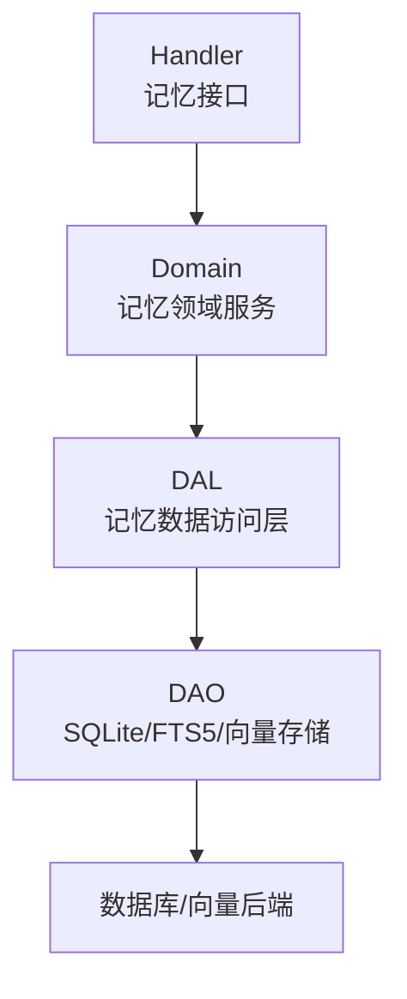
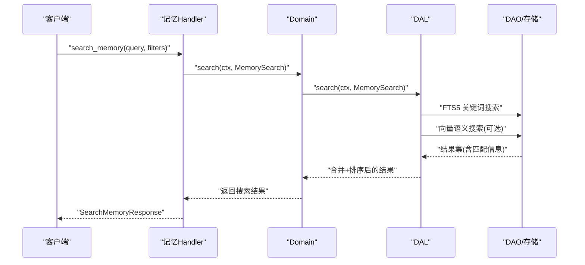
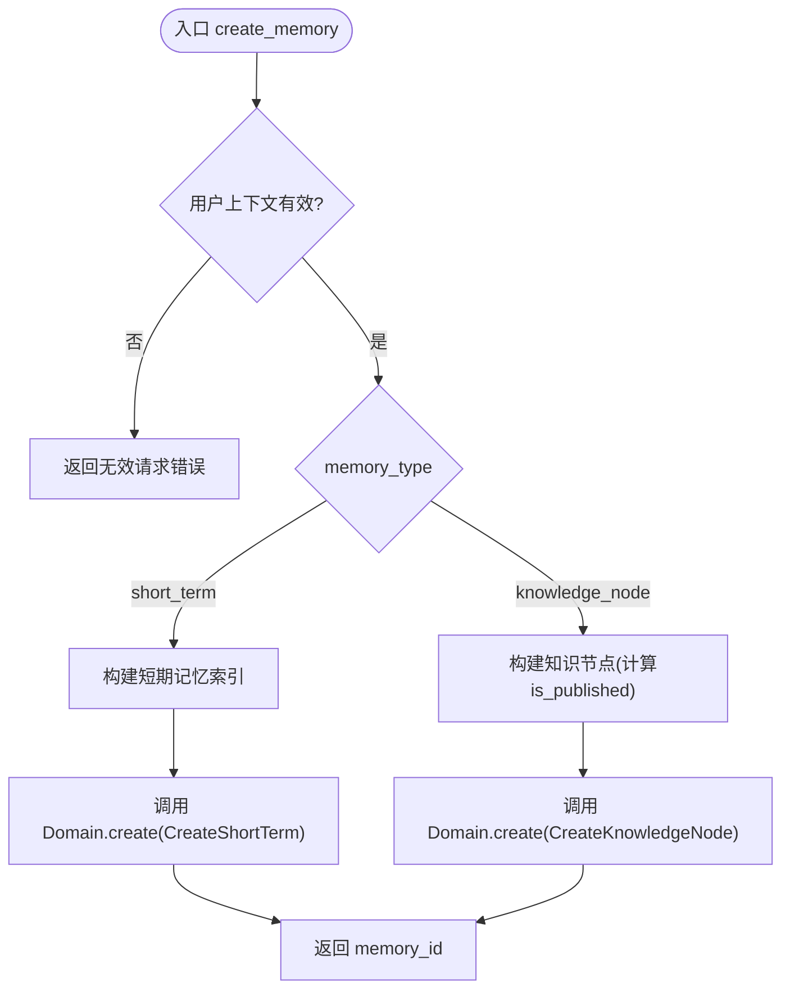
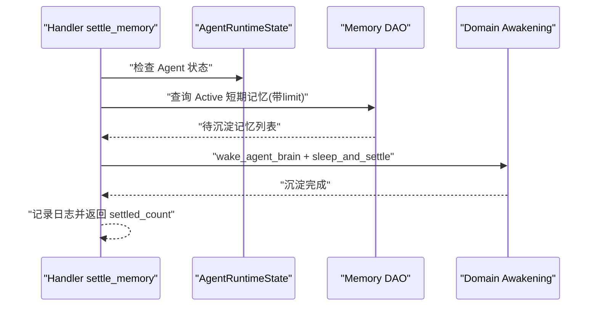
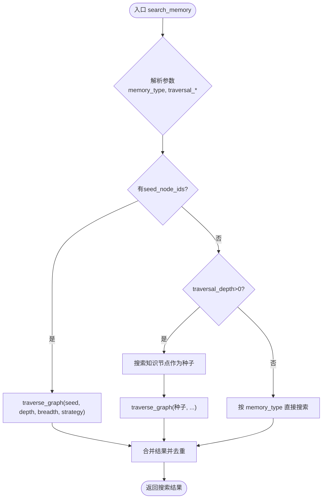
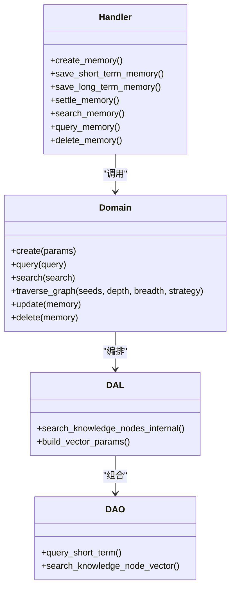

# 记忆管理 API

<cite>
**本文引用的文件**
- [create_memory.rs](file://src/handlers/hr/agent/create_memory.rs)
- [save_short_term_memory.rs](file://src/handlers/hr/agent/save_short_term_memory.rs)
- [save_long_term_memory.rs](file://src/handlers/hr/agent/save_long_term_memory.rs)
- [settle_memory.rs](file://src/handlers/hr/agent/settle_memory.rs)
- [search_memory.rs](file://src/handlers/hr/agent/search_memory.rs)
- [query_memory.rs](file://src/handlers/hr/agent/query_memory.rs)
- [delete_memory.rs](file://src/handlers/hr/agent/delete_memory.rs)
- [memory.rs（模型）](file://src/models/memory.rs)
- [memory.rs（枚举）](file://common/src/enums/memory.rs)
- [memory.rs（DAL）](file://src/service/dal/memory.rs)
- [mod.rs（DAO 接口）](file://src/service/dao/memory/mod.rs)
- [vector_search_architecture.md](file://docs/vector_search_architecture.md)
</cite>

## 目录
1. [简介](#简介)
2. [项目结构](#项目结构)
3. [核心组件](#核心组件)
4. [架构总览](#架构总览)
5. [详细组件分析](#详细组件分析)
6. [依赖关系分析](#依赖关系分析)
7. [性能与优化](#性能与优化)
8. [故障排查指南](#故障排查指南)
9. [结论](#结论)
10. [附录：配置与示例](#附录：配置与示例)

## 简介
本文件面向 Agent 记忆系统的完整生命周期管理，覆盖记忆的创建、短期/长期保存、沉淀、检索、查询与删除等能力，并说明向量搜索、语义检索、图谱遍历与聚合等高级特性。文档严格遵循四层单向调用规范：Adapter（HTTP Handler / 工具注册）→ Domain → DAL → DAO，所有公共方法首参为 RequestContext，跨层使用 ctx.clone()。

## 项目结构
记忆相关能力由 Handler 暴露 HTTP/工具接口，Domain/DAL 编排业务逻辑，DAO 负责持久化与 FTS5/向量索引维护。关键路径如下：
- Handler 层：统一接收请求、参数校验、构造 PO/Query、调用 Domain
- Domain 层：对外提供 create/query/search/traverse_graph/update/delete 等接口
- DAL 层：组合基础 DAO + 向量 DAO，实现混合搜索、图谱遍历、索引生命周期管理
- DAO 层：SQLite 主表 + FTS5 全文索引 + 向量存储（InMemory/LanceDB/HNSW 等）

图表来源
- [memory.rs（DAL）:1147-1188](file://src/service/dal/memory.rs#L1147-L1188)
- [mod.rs（DAO 接口）:45-60](file://src/service/dao/memory/mod.rs#L45-L60)

章节来源
- [memory.rs（DAL）:1147-1188](file://src/service/dal/memory.rs#L1147-L1188)
- [mod.rs（DAO 接口）:45-60](file://src/service/dao/memory/mod.rs#L45-L60)

## 核心组件
- 记忆类型与状态
  - 类型：Trace、ShortTerm、KnowledgeNode、Relation、All
  - 状态：Forgotten、Active、Settled
- 数据模型
  - MemoryPo：统一底层对象（Trace/ShortTerm/KnowledgeNode/Relation）
  - ShortTermMemoryIndexPo：短期记忆索引（summary/tags/trace_ids/status）
  - LongTermKnowledgeNodePo：长期知识节点（node_description/summary/tags/is_published）
  - KnowledgeNodeRelationPo：节点关系（source/target/type）
  - Memory：业务实体（PO + SearchMatchInfo）
- 搜索与遍历
  - MemorySearch：关键词 + 向量 + 过滤条件
  - TraversalStrategy：BreadthFirst/DepthFirst
  - 混合排序：Hybrid > Vector > Keyword，组内按 distance/rank 排序

章节来源
- [memory.rs（枚举）:1-212](file://common/src/enums/memory.rs#L1-L212)
- [memory.rs（模型）:1-424](file://src/models/memory.rs#L1-L424)
- [mod.rs（DAO 接口）:45-60](file://src/service/dao/memory/mod.rs#L45-L60)

## 架构总览
记忆系统采用“关系型数据 + FTS5 关键词 + 向量语义”的三位一体检索体系。Handler 仅做入参与鉴权，Domain/DAL 负责编排，DAO 专注持久化与索引维护。向量搜索支持多后端（InMemory/LanceDB/HNSW），FTS5 通过 SQLite 虚拟表与触发器自动同步。

图表来源
- [search_memory.rs:24-153](file://src/handlers/hr/agent/search_memory.rs#L24-L153)
- [memory.rs（DAL）:1147-1188](file://src/service/dal/memory.rs#L1147-L1188)
- [mod.rs（DAO 接口）:45-60](file://src/service/dao/memory/mod.rs#L45-L60)

## 详细组件分析

### 创建记忆（create_memory）
- 功能：根据 memory_type 创建短期记忆或知识节点；自动生成 ID、时间戳与必要字段
- 权限：要求用户上下文存在
- 流程要点：
  - short_term：构造 ShortTermMemoryIndexPo，调用 Domain.create(CreateShortTerm)
  - knowledge_node：构造 LongTermKnowledgeNodePo，设置 is_published（基于 tags 是否包含 published），调用 Domain.create(CreateKnowledgeNode)
- 输出：CreateMemoryResponse.memory_id

图表来源
- [create_memory.rs:21-126](file://src/handlers/hr/agent/create_memory.rs#L21-L126)

章节来源
- [create_memory.rs:21-126](file://src/handlers/hr/agent/create_memory.rs#L21-L126)

### 保存短期记忆（save_short_term_memory）
- 功能：以神经工具方式保存短期记忆，支持 tags 与 trace_ids
- 流程要点：生成 st_ 前缀 ID，构造 ShortTermMemoryIndexPo，调用 Domain.create(CreateShortTerm)
- 输出：SaveShortTermMemoryResponse.memory_id

章节来源
- [save_short_term_memory.rs:11-57](file://src/handlers/hr/agent/save_short_term_memory.rs#L11-L57)

### 保存长期记忆（save_long_term_memory）
- 功能：保存长期知识节点，并可附带关系列表
- 流程要点：
  - 构造 LongTermKnowledgeNodePo，设置 is_published（基于 tags）
  - 调用 Domain.create(CreateKnowledgeNode)
  - 若 relations 非空，批量构造 KnowledgeNodeRelationPo 并调用 Domain.create(CreateRelations)
- 输出：SaveLongTermMemoryResponse.node_id, relation_ids

章节来源
- [save_long_term_memory.rs:13-109](file://src/handlers/hr/agent/save_long_term_memory.rs#L13-L109)

### 记忆沉淀（settle_memory）
- 功能：触发 Agent 在 Resting 状态下对未沉淀短期记忆进行归纳总结，转化为长期知识节点并建立关系
- 流程要点：
  - 预检查 Agent 可用性
  - 查询 Active 状态的 ShortTerm 记忆，生成编号摘要
  - 加载 Agent（含 tools/skills），唤醒 Brain
  - 调用 sleep_and_settle，使用内置沉淀 Prompt 约束模板执行沉淀
- 输出：SettleMemoryResponse.settled_count

图表来源
- [settle_memory.rs:74-155](file://src/handlers/hr/agent/settle_memory.rs#L74-L155)

章节来源
- [settle_memory.rs:22-155](file://src/handlers/hr/agent/settle_memory.rs#L22-L155)

### 记忆检索（search_memory）
- 功能：支持关键词、向量语义、图谱遍历三种模式，返回去重后的结果
- 模式选择：
  - 纯语义：traversal_depth=0 或不传，返回短期记忆 + 节点（无关系）
  - 语义 + 遍历：traversal_depth>0，不传 seed_node_ids，先搜索再遍历
  - 纯图谱遍历：traversal_depth>0 + seed_node_ids，直接遍历
- 权限控制：短期记忆私有；KnowledgeNode/All 包含 published 共享节点
- 输出：SearchMemoryResponse.results（含 score 与 tags 解析）

图表来源
- [search_memory.rs:24-153](file://src/handlers/hr/agent/search_memory.rs#L24-L153)

章节来源
- [search_memory.rs:24-153](file://src/handlers/hr/agent/search_memory.rs#L24-L153)

### 记忆查询（query_memory）
- 功能：按 agent_id、memory_type、status、tags、task_id 等条件过滤查询
- 权限控制：查询他人记忆时强制只返回 published 节点（通过 tags 注入）
- 输出：QueryMemoryResponse.results

章节来源
- [query_memory.rs:12-75](file://src/handlers/hr/agent/query_memory.rs#L12-L75)

### 记忆删除（delete_memory）
- 功能：按 ID 删除记忆，限制 Trace/Relation 不可删
- 流程要点：先 query 定位记忆，校验类型后调用 Domain.delete
- 输出：DeleteMemoryResponse.memory_id

章节来源
- [delete_memory.rs:11-55](file://src/handlers/hr/agent/delete_memory.rs#L11-L55)

## 依赖关系分析
- Handler 依赖 Domain 暴露的统一接口（create/query/search/traverse_graph/update/delete）
- Domain 组合 DAL 实现混合搜索、图谱遍历与索引生命周期管理
- DAL 组合 DAO（基础数据 + 向量）与 Cortex（Embedding），实现 FTS5 + 向量混合检索
- 存储层抽象 VectorStore，支持 InMemory/LanceDB/HNSW 等多后端

图表来源
- [memory.rs（DAL）:1147-1188](file://src/service/dal/memory.rs#L1147-L1188)
- [mod.rs（DAO 接口）:45-60](file://src/service/dao/memory/mod.rs#L45-L60)

章节来源
- [memory.rs（DAL）:1147-1188](file://src/service/dal/memory.rs#L1147-L1188)
- [mod.rs（DAO 接口）:45-60](file://src/service/dao/memory/mod.rs#L45-L60)

## 性能与优化
- 混合搜索策略
  - 三态匹配：Hybrid（关键词+向量）> Vector（仅向量）> Keyword（仅关键词）
  - 组内排序：Hybrid/Vector 按 vector_distance 升序；Keyword 按 fts_rank（BM25）升序
- 向量距离阈值
  - 默认 0.8，可通过 MemorySearch.vector_distance_threshold 调整
- FTS5 全文检索
  - 使用 SQLite FTS5 + trigram 分词器，支持中文关键词搜索
  - 特殊字符转义避免 MATCH 语法错误
- 向量存储后端
  - InMemory：零依赖，适合开发测试
  - LanceDB：生产级高性能
  - HNSW：纯 Rust 实现，lazy rebuild 与持久化
- 降级策略
  - 向量写入失败仅 warn 降级，不影响主流程；FTS5 仍可用
- 建议
  - 合理设置 top_k 与 limit，避免过大结果集
  - 使用 tags 精准过滤，减少无关候选
  - 沉淀周期调优：结合 Agent 空闲时段批量处理，降低峰值压力

章节来源
- [vector_search_architecture.md:72-131](file://docs/vector_search_architecture.md#L72-L131)
- [memory.rs（DAL）:1147-1188](file://src/service/dal/memory.rs#L1147-L1188)

## 故障排查指南
- 缺少用户上下文
  - 现象：create/query/search/delete 返回 InvalidRequest
  - 处理：确保请求携带有效 user_id
- 记忆不存在
  - 现象：delete_memory 报 NotFound
  - 处理：确认 memory_id 是否存在且可删除（Trace/Relation 不可删）
- 向量搜索不可用
  - 现象：语义搜索结果为空或降级为关键词搜索
  - 处理：检查 Embedding Provider 是否启用、向量索引是否重建、后端是否可用
- 沉淀无效果
  - 现象：settle_memory 返回 0
  - 处理：确认存在 Active 状态的短期记忆；检查 Agent 状态是否为可用；查看沉淀日志

章节来源
- [create_memory.rs:21-41](file://src/handlers/hr/agent/create_memory.rs#L21-L41)
- [delete_memory.rs:20-55](file://src/handlers/hr/agent/delete_memory.rs#L20-L55)
- [search_memory.rs:24-153](file://src/handlers/hr/agent/search_memory.rs#L24-L153)
- [settle_memory.rs:74-155](file://src/handlers/hr/agent/settle_memory.rs#L74-L155)

## 结论
记忆管理 API 提供了从创建到沉淀、检索、查询、删除的完整生命周期管理能力，并通过 FTS5 与向量搜索实现高可用的混合检索。通过清晰的层次划分与统一的接口设计，系统在可扩展性、可维护性与性能方面具备良好基础。建议在生产环境结合业务规模选择合适的向量后端，并合理配置阈值与分页参数以获得最佳体验。

## 附录：配置与示例
- 搜索参数示例
  - 纯语义检索：query="深度学习", memory_type="short_term", max_results=20
  - 语义+遍历：query="神经网络", traversal_depth=2, traversal_breadth=5, traversal_strategy="breadth_first"
  - 纯图谱遍历：seed_node_ids=["kn_xxx"], traversal_depth=3, traversal_strategy="depth_first"
- 过滤与权限
  - 查询他人记忆时自动注入 tags=["published"]，仅返回共享节点
- 向量阈值
  - 通过 MemorySearch.vector_distance_threshold 调整相似度阈值（默认 0.8）
- 前端调用参考
  - search_memory、query_memory 等接口在前端 hr/api.rs 中封装，便于页面调用

章节来源
- [search_memory.rs:24-153](file://src/handlers/hr/agent/search_memory.rs#L24-L153)
- [query_memory.rs:21-75](file://src/handlers/hr/agent/query_memory.rs#L21-L75)
- [vector_search_architecture.md:72-131](file://docs/vector_search_architecture.md#L72-L131)