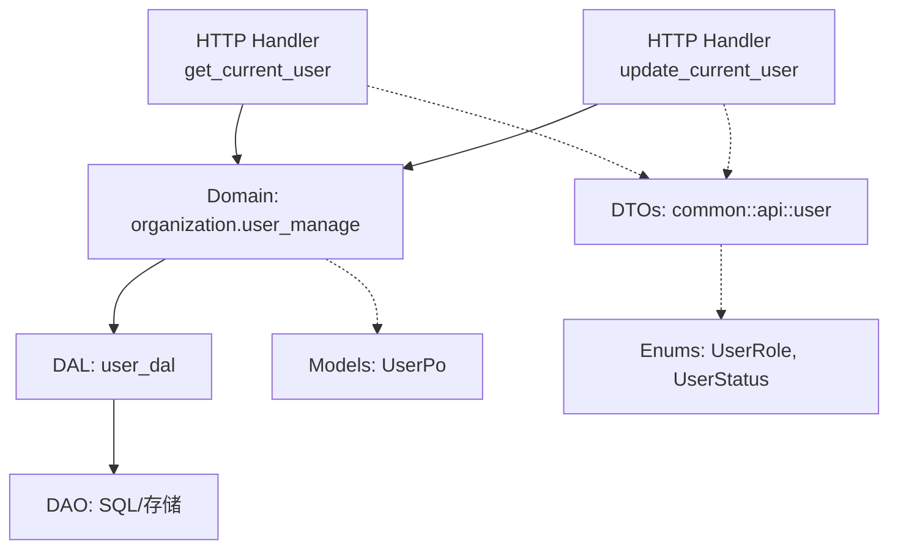
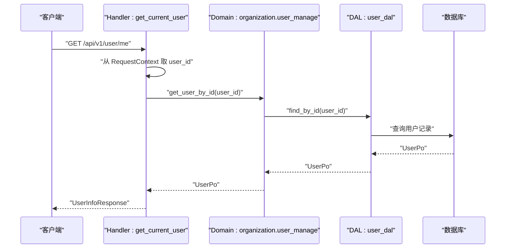
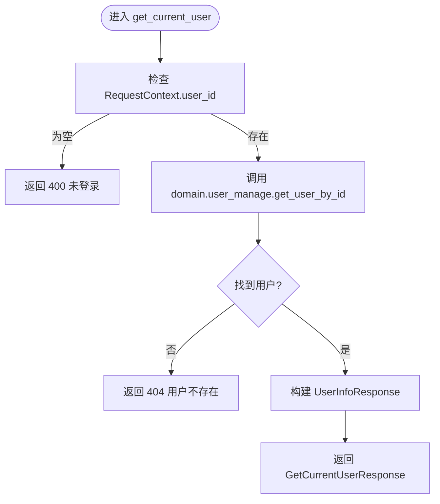
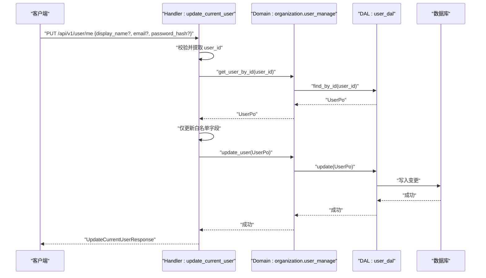
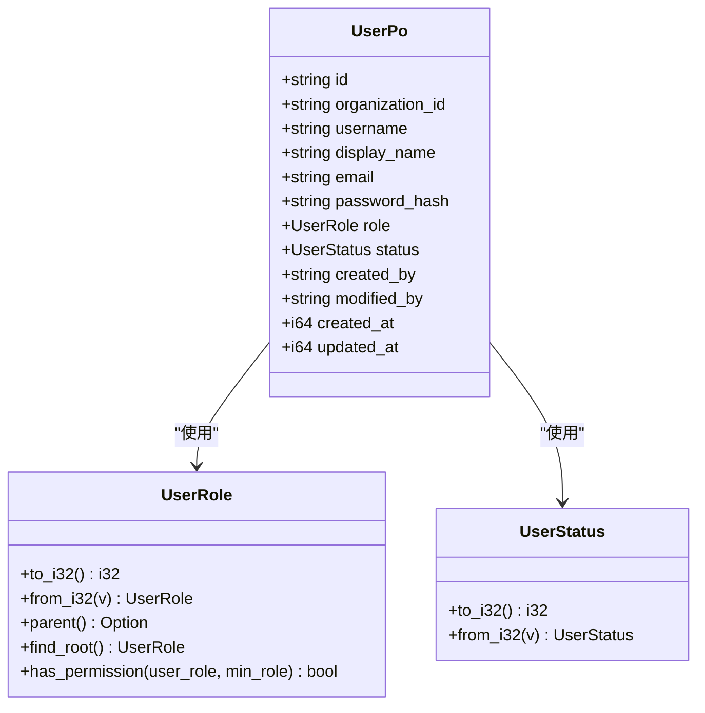
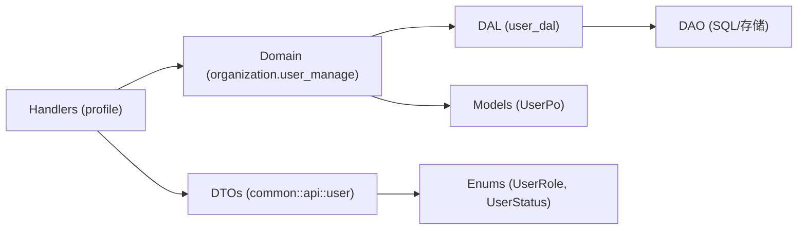
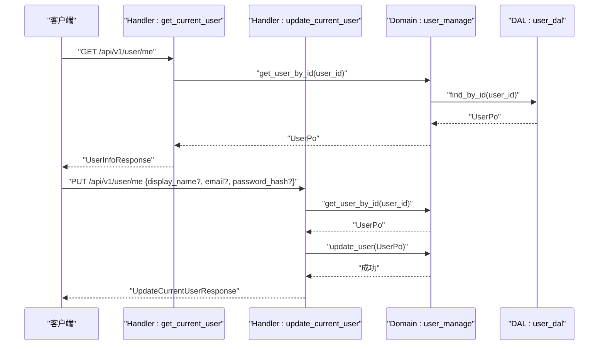

# 用户管理模块 API

<cite>
**本文引用的文件**
- [src/handlers/user/mod.rs](file://src/handlers/user/mod.rs)
- [src/handlers/user/profile/mod.rs](file://src/handlers/user/profile/mod.rs)
- [src/handlers/user/profile/get_current_user.rs](file://src/handlers/user/profile/get_current_user.rs)
- [src/handlers/user/profile/update_current_user.rs](file://src/handlers/user/profile/update_current_user.rs)
- [common/src/api/user.rs](file://common/src/api/user.rs)
- [src/models/user.rs](file://src/models/user.rs)
- [src/service/domain/organization/user.rs](file://src/service/domain/organization/user.rs)
- [common/src/enums/user.rs](file://common/src/enums/user.rs)
</cite>

## 目录
1. [简介](#简介)
2. [项目结构](#项目结构)
3. [核心组件](#核心组件)
4. [架构总览](#架构总览)
5. [详细组件分析](#详细组件分析)
6. [依赖关系分析](#依赖关系分析)
7. [性能考虑](#性能考虑)
8. [故障排查指南](#故障排查指南)
9. [结论](#结论)
10. [附录：完整示例与最佳实践](#附录：完整示例与最佳实践)

## 简介
本章节面向 AI Orz 的用户管理模块，聚焦“当前用户个人信息获取与更新”的 HTTP API。该模块遵循四层单向调用（Adapter → Domain → DAL → DAO），Handler 仅负责参数解析、鉴权上下文提取与响应封装；业务规则集中在 Domain 层，数据访问在 DAL/DAO 层完成。当前实现包含两个接口：
- 获取当前用户信息
- 更新当前用户信息（显示名称、邮箱、密码哈希）

说明：
- 头像上传不属于当前用户管理模块范围，属于附件/资源管理范畴，可参考附件相关接口。
- 偏好设置未在当前代码中暴露为独立字段，可通过扩展 UpdateCurrentUserRequest 增加可选字段来实现。

## 项目结构
用户管理模块位于 handlers/user 下，按功能子模块组织：
- profile：当前用户个人信息的读取与更新
- 公共 DTO 定义于 common/src/api/user.rs
- 领域能力通过 organization 域暴露（user_manage 等）
- 持久化对象 UserPo 位于 models/user.rs
- 角色与状态枚举位于 common/src/enums/user.rs

图表来源
- [src/handlers/user/profile/get_current_user.rs:1-66](file://src/handlers/user/profile/get_current_user.rs#L1-L66)
- [src/handlers/user/profile/update_current_user.rs:1-91](file://src/handlers/user/profile/update_current_user.rs#L1-L91)
- [common/src/api/user.rs:1-233](file://common/src/api/user.rs#L1-L233)
- [src/models/user.rs:1-98](file://src/models/user.rs#L1-L98)
- [src/service/domain/organization/user.rs:1-124](file://src/service/domain/organization/user.rs#L1-L124)
- [common/src/enums/user.rs:1-212](file://common/src/enums/user.rs#L1-L212)

章节来源
- [src/handlers/user/mod.rs:1-5](file://src/handlers/user/mod.rs#L1-L5)
- [src/handlers/user/profile/mod.rs:1-8](file://src/handlers/user/profile/mod.rs#L1-L8)

## 核心组件
- 请求/响应 DTO
  - GetCurrentUserRequest：无参，用于获取当前用户信息
  - GetCurrentUserResponse：包含 UserInfoResponse
  - UpdateCurrentUserRequest：可选字段 display_name、email、password_hash
  - UpdateCurrentUserResponse：返回更新后的 UserInfoResponse
  - UserInfoResponse：用户基本信息（id、username、display_name、email、organization_id、role、role_name、status）
- 领域服务
  - organization::domain().user_manage()：提供 get_user_by_id、update_user 等方法
- 模型与枚举
  - UserPo：持久化对象，包含角色、状态、创建/修改信息等
  - UserRole、UserStatus：角色与状态枚举，支持转换与权限判断

章节来源
- [common/src/api/user.rs:8-56](file://common/src/api/user.rs#L8-L56)
- [src/models/user.rs:10-37](file://src/models/user.rs#L10-L37)
- [src/service/domain/organization/user.rs:119-122](file://src/service/domain/organization/user.rs#L119-L122)
- [common/src/enums/user.rs:8-21](file://common/src/enums/user.rs#L8-L21)

## 架构总览
本模块严格遵循 Adapter → Domain → DAL → DAO 的单向调用链：
- Adapter（HTTP Handler）：从 RequestContext 提取当前用户 ID，调用 Domain
- Domain：组织域的用户管理能力，封装业务规则与校验
- DAL/DAO：数据访问与持久化

图表来源
- [src/handlers/user/profile/get_current_user.rs:18-65](file://src/handlers/user/profile/get_current_user.rs#L18-L65)
- [src/service/domain/organization/user.rs:119-122](file://src/service/domain/organization/user.rs#L119-L122)

章节来源
- [src/handlers/user/profile/get_current_user.rs:1-66](file://src/handlers/user/profile/get_current_user.rs#L1-L66)
- [src/service/domain/organization/user.rs:1-124](file://src/service/domain/organization/user.rs#L1-L124)

## 详细组件分析

### 获取当前用户信息（GET /api/v1/user/me）
- 功能：返回当前已认证用户的详细信息
- 输入：无请求体参数，身份由 JWT/中间件注入到 RequestContext
- 处理流程：
  - 从 RequestContext 获取 user_id，未登录则返回错误
  - 调用 Domain 层获取用户实体
  - 将内部实体转换为 UserInfoResponse（空字符串转为 None，角色转中文名称）
- 输出：GetCurrentUserResponse

图表来源
- [src/handlers/user/profile/get_current_user.rs:18-65](file://src/handlers/user/profile/get_current_user.rs#L18-L65)

章节来源
- [src/handlers/user/profile/get_current_user.rs:1-66](file://src/handlers/user/profile/get_current_user.rs#L1-L66)
- [common/src/api/user.rs:8-38](file://common/src/api/user.rs#L8-L38)

### 更新当前用户信息（PUT /api/v1/user/me）
- 功能：允许当前用户更新显示名称、邮箱、密码哈希
- 输入：UpdateCurrentUserRequest（可选字段）
- 处理流程：
  - 从 RequestContext 获取 user_id
  - 获取当前用户实体
  - 仅允许更新指定字段（禁止修改角色、状态、组织ID等敏感字段）
  - 更新 updated_at 与 modified_by
  - 调用 Domain 层 update_user 持久化
  - 返回更新后的 UserInfoResponse
- 安全要点：
  - 身份由 JWT 保证，无需额外权限校验
  - 只更新白名单字段，防止越权修改

图表来源
- [src/handlers/user/profile/update_current_user.rs:18-90](file://src/handlers/user/profile/update_current_user.rs#L18-L90)
- [src/service/domain/organization/user.rs:48-51](file://src/service/domain/organization/user.rs#L48-L51)

章节来源
- [src/handlers/user/profile/update_current_user.rs:1-91](file://src/handlers/user/profile/update_current_user.rs#L1-L91)
- [common/src/api/user.rs:40-56](file://common/src/api/user.rs#L40-L56)

### 数据模型与枚举
- UserPo：包含 id、organization_id、username、display_name、email、password_hash、role、status、created_by、modified_by、created_at、updated_at
- UserRole：SuperAdmin、Admin、Member，支持父角色查找与权限判断
- UserStatus：Active、Disabled，支持 i32 互转

图表来源
- [src/models/user.rs:10-37](file://src/models/user.rs#L10-L37)
- [common/src/enums/user.rs:8-21](file://common/src/enums/user.rs#L8-L21)
- [common/src/enums/user.rs:114-147](file://common/src/enums/user.rs#L114-L147)

章节来源
- [src/models/user.rs:1-98](file://src/models/user.rs#L1-L98)
- [common/src/enums/user.rs:1-212](file://common/src/enums/user.rs#L1-L212)

## 依赖关系分析
- Handler 依赖：
  - RequestContext（来自 pkg）
  - Domain（organization::domain().user_manage()）
  - DTO（common::api::user）
  - 错误类型（common::error）
- Domain 依赖：
  - DAL（user_dal）
  - Models（UserPo）
  - Enums（UserRole、UserStatus）
- 耦合与内聚：
  - Handler 与 Domain 解耦良好，职责清晰
  - Domain 对 DAL 的依赖通过 trait 抽象，便于替换实现
  - DTO 与 Models 分离，避免 PO 泄露到上层

图表来源
- [src/handlers/user/profile/get_current_user.rs:1-66](file://src/handlers/user/profile/get_current_user.rs#L1-L66)
- [src/handlers/user/profile/update_current_user.rs:1-91](file://src/handlers/user/profile/update_current_user.rs#L1-L91)
- [src/service/domain/organization/user.rs:1-124](file://src/service/domain/organization/user.rs#L1-L124)
- [common/src/api/user.rs:1-233](file://common/src/api/user.rs#L1-L233)
- [src/models/user.rs:1-98](file://src/models/user.rs#L1-L98)
- [common/src/enums/user.rs:1-212](file://common/src/enums/user.rs#L1-L212)

章节来源
- [src/handlers/user/profile/get_current_user.rs:1-66](file://src/handlers/user/profile/get_current_user.rs#L1-L66)
- [src/handlers/user/profile/update_current_user.rs:1-91](file://src/handlers/user/profile/update_current_user.rs#L1-L91)
- [src/service/domain/organization/user.rs:1-124](file://src/service/domain/organization/user.rs#L1-L124)

## 性能考虑
- 单次查询：获取与更新均基于用户 ID 精确查询，时间复杂度 O(1)
- 缓存建议：若高频读取当前用户信息，可在应用层引入短期缓存（如内存缓存），注意失效策略
- 批量操作：当前接口不涉及批量，如需列表或统计，建议在 Domain/DAL 层增加分页与索引优化
- 序列化开销：DTO 与 Model 映射简单，开销较低

[本节为通用指导，不直接分析具体文件]

## 故障排查指南
- 常见错误
  - 未登录：RequestContext 缺少 user_id，返回 400
  - 用户不存在：根据 user_id 查询不到记录，返回 404
  - 更新失败：Domain/DAL 层异常，需检查数据库连接与事务
- 排查步骤
  - 确认 JWT 是否正确注入 RequestContext
  - 检查 Domain 层是否抛出业务异常
  - 查看 DAL/DAO 层日志与 SQL 执行结果
  - 验证请求体字段是否符合 DTO 定义

章节来源
- [src/handlers/user/profile/get_current_user.rs:22-34](file://src/handlers/user/profile/get_current_user.rs#L22-L34)
- [src/handlers/user/profile/update_current_user.rs:23-35](file://src/handlers/user/profile/update_current_user.rs#L23-L35)

## 结论
当前用户管理模块提供了安全的个人信息获取与更新能力，遵循严格的分层架构与最小权限原则。后续可扩展头像上传与偏好设置等功能，保持与现有 DTO 和 Domain 的一致性。

[本节为总结性内容，不直接分析具体文件]

## 附录：完整示例与最佳实践

### API 端点与数据契约
- GET /api/v1/user/me
  - 请求：无请求体
  - 响应：GetCurrentUserResponse.data = UserInfoResponse
- PUT /api/v1/user/me
  - 请求：UpdateCurrentUserRequest（可选字段：display_name、email、password_hash）
  - 响应：UpdateCurrentUserResponse.data = UserInfoResponse

章节来源
- [common/src/api/user.rs:8-56](file://common/src/api/user.rs#L8-L56)

### 调用序列图（获取与更新）

图表来源
- [src/handlers/user/profile/get_current_user.rs:18-65](file://src/handlers/user/profile/get_current_user.rs#L18-L65)
- [src/handlers/user/profile/update_current_user.rs:18-90](file://src/handlers/user/profile/update_current_user.rs#L18-L90)
- [src/service/domain/organization/user.rs:119-122](file://src/service/domain/organization/user.rs#L119-L122)

### 安全与隐私保护
- 身份认证：JWT 中间件确保 RequestContext.user_id 有效
- 最小权限：仅允许更新白名单字段，禁止修改角色、状态、组织ID
- 敏感信息：密码以哈希形式存储，不在响应中暴露
- 审计追踪：updated_at 与 modified_by 记录更新时间与操作者

章节来源
- [src/handlers/user/profile/update_current_user.rs:40-56](file://src/handlers/user/profile/update_current_user.rs#L40-L56)
- [src/models/user.rs:23-36](file://src/models/user.rs#L23-L36)

### 扩展建议（头像上传与偏好设置）
- 头像上传：建议复用附件/资源管理模块，新增头像专用用途标识与访问控制
- 偏好设置：在 UpdateCurrentUserRequest 增加可选字段（如 theme、language），并在 Domain 层进行合法性校验后持久化

[本节为概念性扩展建议，不直接分析具体文件]