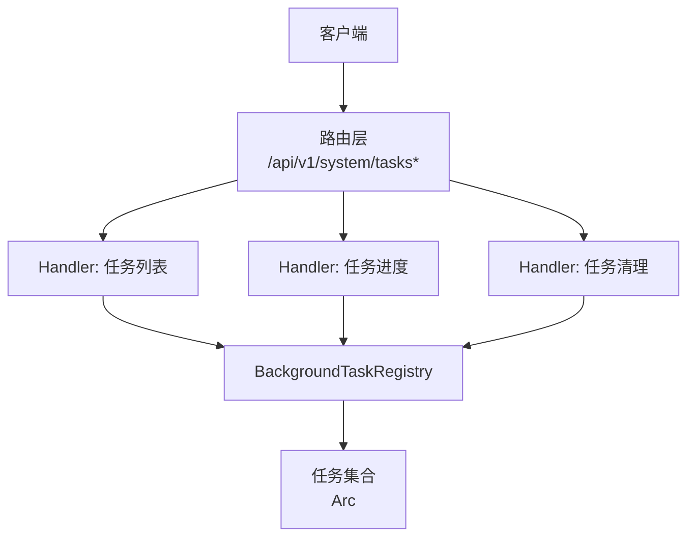
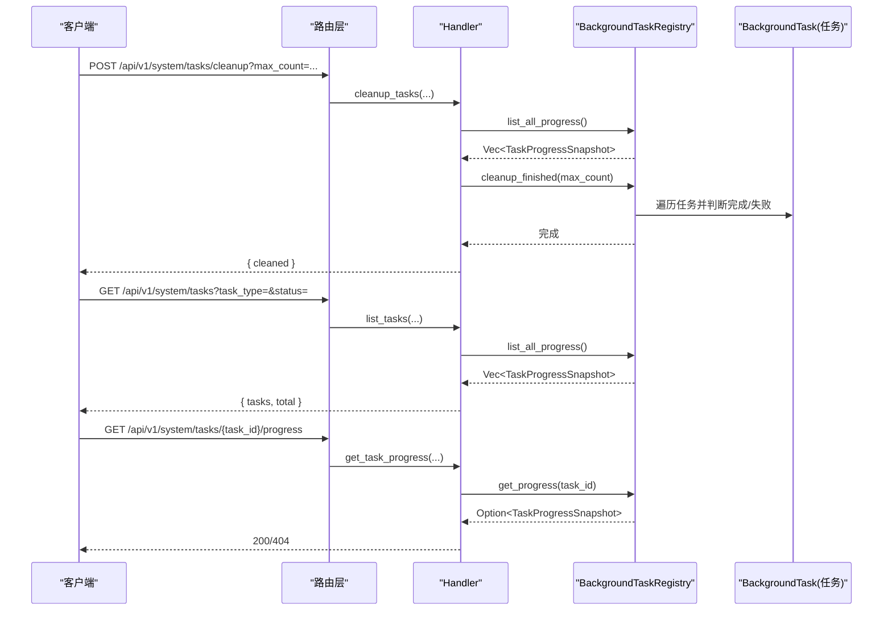
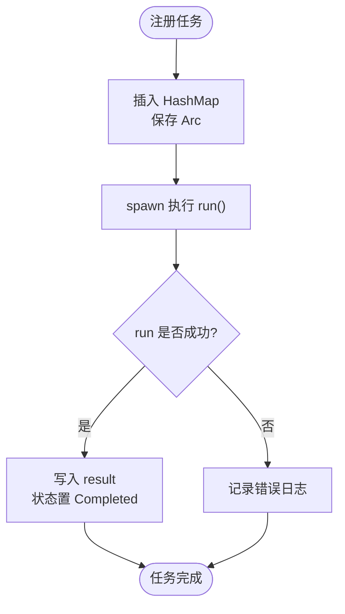
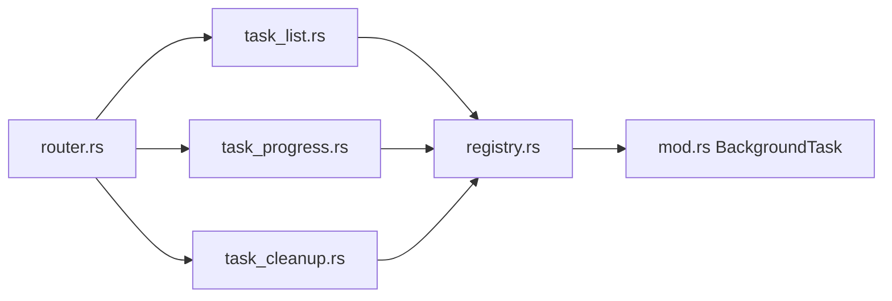

# 任务管理 API

<cite>
**本文引用的文件**
- [src/handlers/system/task_list.rs](file://src/handlers/system/task_list.rs)
- [src/handlers/system/task_cleanup.rs](file://src/handlers/system/task_cleanup.rs)
- [src/handlers/system/task_progress.rs](file://src/handlers/system/task_progress.rs)
- [common/src/api/background_task.rs](file://common/src/api/background_task.rs)
- [src/pkg/background_task/mod.rs](file://src/pkg/background_task/mod.rs)
- [src/pkg/background_task/registry.rs](file://src/pkg/background_task/registry.rs)
- [src/router.rs](file://src/router.rs)
- [common/src/error/types.rs](file://common/src/error/types.rs)
</cite>

## 目录
1. [简介](#简介)
2. [项目结构](#项目结构)
3. [核心组件](#核心组件)
4. [架构总览](#架构总览)
5. [详细组件分析](#详细组件分析)
6. [依赖关系分析](#依赖关系分析)
7. [性能与资源限制](#性能与资源限制)
8. [故障排查指南](#故障排查指南)
9. [结论](#结论)
10. [附录：API 规范与示例](#附录api-规范与示例)

## 简介
本文件为 AI Orz 的“后台任务管理”能力提供完整的 API 文档，覆盖以下接口：
- 任务列表查询：GET /api/v1/system/tasks
- 任务进度查询：GET /api/v1/system/tasks/{task_id}/progress
- 任务清理：POST /api/v1/system/tasks/cleanup

这些接口用于统一监控、管理与清理系统内所有后台异步任务（如初始化、向量重建、Seed 导入导出等）。后端通过统一的注册中心维护任务状态，前端可轮询或按需拉取进度。

## 项目结构
任务管理相关代码位于三层：
- Adapter（HTTP Handler）：负责解析请求参数、调用领域服务并返回响应
- Domain/Pkg：后台任务注册中心与生命周期契约
- Router：路由挂载与权限控制

图示来源
- [src/router.rs:603-739](file://src/router.rs#L603-L739)
- [src/handlers/system/task_list.rs:1-41](file://src/handlers/system/task_list.rs#L1-L41)
- [src/handlers/system/task_progress.rs:1-26](file://src/handlers/system/task_progress.rs#L1-L26)
- [src/handlers/system/task_cleanup.rs:1-48](file://src/handlers/system/task_cleanup.rs#L1-L48)
- [src/pkg/background_task/registry.rs:1-131](file://src/pkg/background_task/registry.rs#L1-L131)

章节来源
- [src/router.rs:603-739](file://src/router.rs#L603-L739)
- [src/handlers/system/task_list.rs:1-41](file://src/handlers/system/task_list.rs#L1-L41)
- [src/handlers/system/task_progress.rs:1-26](file://src/handlers/system/task_progress.rs#L1-L26)
- [src/handlers/system/task_cleanup.rs:1-48](file://src/handlers/system/task_cleanup.rs#L1-L48)
- [src/pkg/background_task/registry.rs:1-131](file://src/pkg/background_task/registry.rs#L1-L131)

## 核心组件
- 后台任务契约与注册中心
  - BackgroundTask trait：定义 task_id、task_type、progress、run 四个方法，任务对象自包含进度字段，外部通过 progress() 读取快照
  - BackgroundTaskRegistry：全局注册中心，提供 register/get/list/cleanup 等操作；内部使用 RwLock<HashMap<String, Arc<dyn BackgroundTask>>> 保证并发安全
- 通用 DTO
  - TaskStatus：Pending、Running、Completed、Failed
  - TaskType：initialize_system、rebuild_vectors、seed_save、seed_load、seed_apply_default
  - TaskProgressSnapshot：任务进度快照，包含 task_id、task_type、status、current_step、total_steps、step_message、started_at、finished_at、error、result
  - 请求/响应：GetTaskProgressRequest、ListBackgroundTasksRequest、ListBackgroundTasksResponse、CleanupTasksRequest、CleanupTasksResponse、TaskIdResponse

章节来源
- [src/pkg/background_task/mod.rs:1-80](file://src/pkg/background_task/mod.rs#L1-L80)
- [src/pkg/background_task/registry.rs:1-131](file://src/pkg/background_task/registry.rs#L1-L131)
- [common/src/api/background_task.rs:1-128](file://common/src/api/background_task.rs#L1-L128)

## 架构总览
任务从业务侧实现 BackgroundTask 并通过 registry.register 启动执行；Handler 通过 registry 暴露查询与清理能力。

图示来源
- [src/handlers/system/task_cleanup.rs:1-48](file://src/handlers/system/task_cleanup.rs#L1-L48)
- [src/handlers/system/task_list.rs:1-41](file://src/handlers/system/task_list.rs#L1-L41)
- [src/handlers/system/task_progress.rs:1-26](file://src/handlers/system/task_progress.rs#L1-L26)
- [src/pkg/background_task/registry.rs:25-92](file://src/pkg/background_task/registry.rs#L25-L92)

## 详细组件分析

### 任务列表查询接口
- 路径与方法：GET /api/v1/system/tasks
- 鉴权：受保护路由，需有效 JWT；system 模块整体要求 Admin 角色
- 查询参数
  - task_type: 可选，字符串匹配任务类型
  - status: 可选，枚举值 Pending/Running/Completed/Failed
- 行为
  - 获取全部任务进度快照
  - 按 task_type 与 status 过滤
  - 按 started_at 降序排序
  - 返回 tasks 列表与 total
- 典型用途
  - 后台任务监控面板
  - 按类型/状态筛选查看历史任务

章节来源
- [src/handlers/system/task_list.rs:1-41](file://src/handlers/system/task_list.rs#L1-L41)
- [src/router.rs:104-136](file://src/router.rs#L104-L136)
- [src/router.rs:603-739](file://src/router.rs#L603-L739)
- [common/src/api/background_task.rs:94-112](file://common/src/api/background_task.rs#L94-L112)

### 任务进度查询接口
- 路径与方法：GET /api/v1/system/tasks/{task_id}/progress
- 鉴权：受保护路由，需有效 JWT；system 模块整体要求 Admin 角色
- 路径参数
  - task_id: 必填
- 行为
  - 根据 task_id 查询任务进度快照
  - 不存在时返回 404 错误
- 典型用途
  - 前端轮询任务进度
  - 展示步骤消息、当前步骤、总步骤、开始/结束时间、错误信息、结果

章节来源
- [src/handlers/system/task_progress.rs:1-26](file://src/handlers/system/task_progress.rs#L1-L26)
- [src/router.rs:603-739](file://src/router.rs#L603-L739)
- [common/src/api/background_task.rs:86-92](file://common/src/api/background_task.rs#L86-L92)
- [common/src/error/types.rs:170-173](file://common/src/error/types.rs#L170-L173)

### 任务清理接口
- 路径与方法：POST /api/v1/system/tasks/cleanup
- 鉴权：受保护路由，需有效 JWT；system 模块整体要求 Admin 角色
- 查询参数
  - max_count: 可选，每个 task_type 保留最近完成的条数，默认 10
- 行为
  - 统计清理前已完成/失败的任务数量
  - 按 task_type 分组，每组按 finished_at 降序保留最多 max_count 条
  - 移除超出阈值的已完成/失败任务
  - 统计清理后数量并返回 cleaned
- 注意
  - 运行中或等待中的任务不受影响
  - 清理仅针对内存中的任务注册表

章节来源
- [src/handlers/system/task_cleanup.rs:1-48](file://src/handlers/system/task_cleanup.rs#L1-L48)
- [src/pkg/background_task/registry.rs:94-123](file://src/pkg/background_task/registry.rs#L94-L123)
- [common/src/api/background_task.rs:114-127](file://common/src/api/background_task.rs#L114-L127)

### 任务类型与状态
- 任务类型（TaskType）
  - initialize_system：系统初始化
  - rebuild_vectors：向量索引重建
  - seed_save：Seed 导出
  - seed_load：Seed 导入
  - seed_apply_default：应用默认 Seed
- 任务状态（TaskStatus）
  - pending：等待开始
  - running：运行中
  - completed：已完成
  - failed：已失败

章节来源
- [common/src/api/background_task.rs:9-50](file://common/src/api/background_task.rs#L9-L50)

### 任务执行队列与生命周期
- 任务以 Arc<dyn BackgroundTask> 形式注册到全局注册中心
- 注册后立即 spawn 执行 run()；run 内部更新进度字段，结束时写入 result 并置状态为 Completed
- 若 run 返回 Err，注册中心会记录错误日志；任务状态由任务自身在 run 中设置
- 进度快照通过 progress() 读取，支持列表与单条查询

图示来源
- [src/pkg/background_task/registry.rs:25-45](file://src/pkg/background_task/registry.rs#L25-L45)
- [src/pkg/background_task/mod.rs:46-72](file://src/pkg/background_task/mod.rs#L46-L72)

章节来源
- [src/pkg/background_task/registry.rs:25-45](file://src/pkg/background_task/registry.rs#L25-L45)
- [src/pkg/background_task/mod.rs:46-72](file://src/pkg/background_task/mod.rs#L46-L72)

## 依赖关系分析
- Handler 依赖 Registry：通过 system::domain().background_task_registry() 访问注册中心
- Registry 依赖 BackgroundTask trait：任务必须实现该契约
- Router 将三个 Handler 挂载到 /api/v1/system/tasks* 下，并施加 Admin 角色中间件
- 错误处理：未找到任务时返回 not_found 错误

图示来源
- [src/router.rs:603-739](file://src/router.rs#L603-L739)
- [src/handlers/system/task_list.rs:1-41](file://src/handlers/system/task_list.rs#L1-L41)
- [src/handlers/system/task_progress.rs:1-26](file://src/handlers/system/task_progress.rs#L1-L26)
- [src/handlers/system/task_cleanup.rs:1-48](file://src/handlers/system/task_cleanup.rs#L1-L48)
- [src/pkg/background_task/mod.rs:1-80](file://src/pkg/background_task/mod.rs#L1-L80)
- [src/pkg/background_task/registry.rs:1-131](file://src/pkg/background_task/registry.rs#L1-L131)

章节来源
- [src/router.rs:603-739](file://src/router.rs#L603-L739)
- [src/pkg/background_task/mod.rs:1-80](file://src/pkg/background_task/mod.rs#L1-L80)
- [src/pkg/background_task/registry.rs:1-131](file://src/pkg/background_task/registry.rs#L1-L131)

## 性能与资源限制
- 列表查询
  - 后端返回全部匹配任务，前端自行分页；适用于任务量不大的场景
  - 排序按 started_at 降序，便于最新任务优先显示
- 清理策略
  - 按 task_type 分组，每组保留最近 max_count 条已完成/失败任务
  - 清理过程对注册中心加写锁，避免并发修改
- 并发模型
  - 任务执行通过 tokio::spawn 异步运行，不阻塞请求线程
  - 注册中心使用 RwLock 读写分离，读多写少场景友好
- 资源建议
  - 合理设置 max_count，避免过多历史任务占用内存
  - 定期清理已完成任务，保持注册表规模可控

章节来源
- [src/handlers/system/task_list.rs:1-41](file://src/handlers/system/task_list.rs#L1-L41)
- [src/pkg/background_task/registry.rs:94-123](file://src/pkg/background_task/registry.rs#L94-L123)

## 故障排查指南
- 任务不存在
  - 现象：GET /api/v1/system/tasks/{task_id}/progress 返回 404
  - 原因：task_id 无效或任务已被清理
  - 处理：检查 task_id 是否正确；必要时重新触发任务
- 任务执行失败
  - 现象：任务状态为 Failed，error 字段包含错误信息
  - 原因：run 内部抛出异常或业务逻辑失败
  - 处理：查看错误信息；必要时重试或调整配置
- 清理未生效
  - 现象：清理后仍有大量已完成任务
  - 原因：max_count 设置过大或任务仍在运行中
  - 处理：调小 max_count；确认任务是否真正完成

章节来源
- [src/handlers/system/task_progress.rs:12-25](file://src/handlers/system/task_progress.rs#L12-L25)
- [common/src/error/types.rs:170-173](file://common/src/error/types.rs#L170-L173)
- [src/pkg/background_task/registry.rs:94-123](file://src/pkg/background_task/registry.rs#L94-L123)

## 结论
本 API 提供了统一的后台任务管理能力，涵盖任务列表、进度查询与清理。通过注册中心集中管理任务生命周期，配合清晰的 DTO 与错误处理，便于前端构建监控与管理界面。建议在生产环境中定期清理历史任务，并结合业务需求合理设置保留策略。

## 附录：API 规范与示例

### 公共数据模型
- TaskStatus
  - 取值：pending、running、completed、failed
- TaskType
  - 取值：initialize_system、rebuild_vectors、seed_save、seed_load、seed_apply_default
- TaskProgressSnapshot
  - 字段：task_id、task_type、status、current_step、total_steps、step_message、started_at、finished_at、error、result

章节来源
- [common/src/api/background_task.rs:9-77](file://common/src/api/background_task.rs#L9-L77)

### 接口清单

#### 任务列表查询
- 方法：GET
- 路径：/api/v1/system/tasks
- 鉴权：需要有效 JWT；system 模块要求 Admin 角色
- 查询参数
  - task_type: 可选，字符串
  - status: 可选，枚举
- 响应体
  - tasks: TaskProgressSnapshot[]
  - total: number
- 示例
  - 请求：GET /api/v1/system/tasks?task_type=rebuild_vectors&status=completed
  - 响应：{ "tasks": [...], "total": 12 }

章节来源
- [src/handlers/system/task_list.rs:1-41](file://src/handlers/system/task_list.rs#L1-L41)
- [src/router.rs:603-739](file://src/router.rs#L603-L739)
- [common/src/api/background_task.rs:94-112](file://common/src/api/background_task.rs#L94-L112)

#### 任务进度查询
- 方法：GET
- 路径：/api/v1/system/tasks/{task_id}/progress
- 鉴权：需要有效 JWT；system 模块要求 Admin 角色
- 路径参数
  - task_id: string
- 响应体
  - TaskProgressSnapshot
- 示例
  - 请求：GET /api/v1/system/tasks/abc123/progress
  - 响应：{ "task_id": "abc123", "task_type": "rebuild_vectors", "status": "running", "current_step": 3, "total_steps": 5, "step_message": "正在重建索引", "started_at": 1710000000000, "finished_at": null, "error": null, "result": null }

章节来源
- [src/handlers/system/task_progress.rs:1-26](file://src/handlers/system/task_progress.rs#L1-L26)
- [src/router.rs:603-739](file://src/router.rs#L603-L739)
- [common/src/api/background_task.rs:86-92](file://common/src/api/background_task.rs#L86-L92)

#### 任务清理
- 方法：POST
- 路径：/api/v1/system/tasks/cleanup
- 鉴权：需要有效 JWT；system 模块要求 Admin 角色
- 查询参数
  - max_count: 可选，number，默认 10
- 响应体
  - cleaned: number
- 示例
  - 请求：POST /api/v1/system/tasks/cleanup?max_count=5
  - 响应：{ "cleaned": 12 }

章节来源
- [src/handlers/system/task_cleanup.rs:1-48](file://src/handlers/system/task_cleanup.rs#L1-L48)
- [src/router.rs:603-739](file://src/router.rs#L603-L739)
- [common/src/api/background_task.rs:114-127](file://common/src/api/background_task.rs#L114-L127)

### 常见使用场景
- 后台任务监控
  - 定时轮询 GET /api/v1/system/tasks/{task_id}/progress 获取实时进度
  - 结合任务类型与状态进行过滤展示
- 资源清理
  - 定期调用 POST /api/v1/system/tasks/cleanup?max_count=10 清理历史任务
  - 观察 cleaned 字段评估清理效果
- 性能优化
  - 合理设置 max_count，避免内存增长
  - 前端分页加载任务列表，减少单次传输数据量

章节来源
- [src/handlers/system/task_list.rs:1-41](file://src/handlers/system/task_list.rs#L1-L41)
- [src/handlers/system/task_cleanup.rs:1-48](file://src/handlers/system/task_cleanup.rs#L1-L48)
- [src/pkg/background_task/registry.rs:94-123](file://src/pkg/background_task/registry.rs#L94-L123)