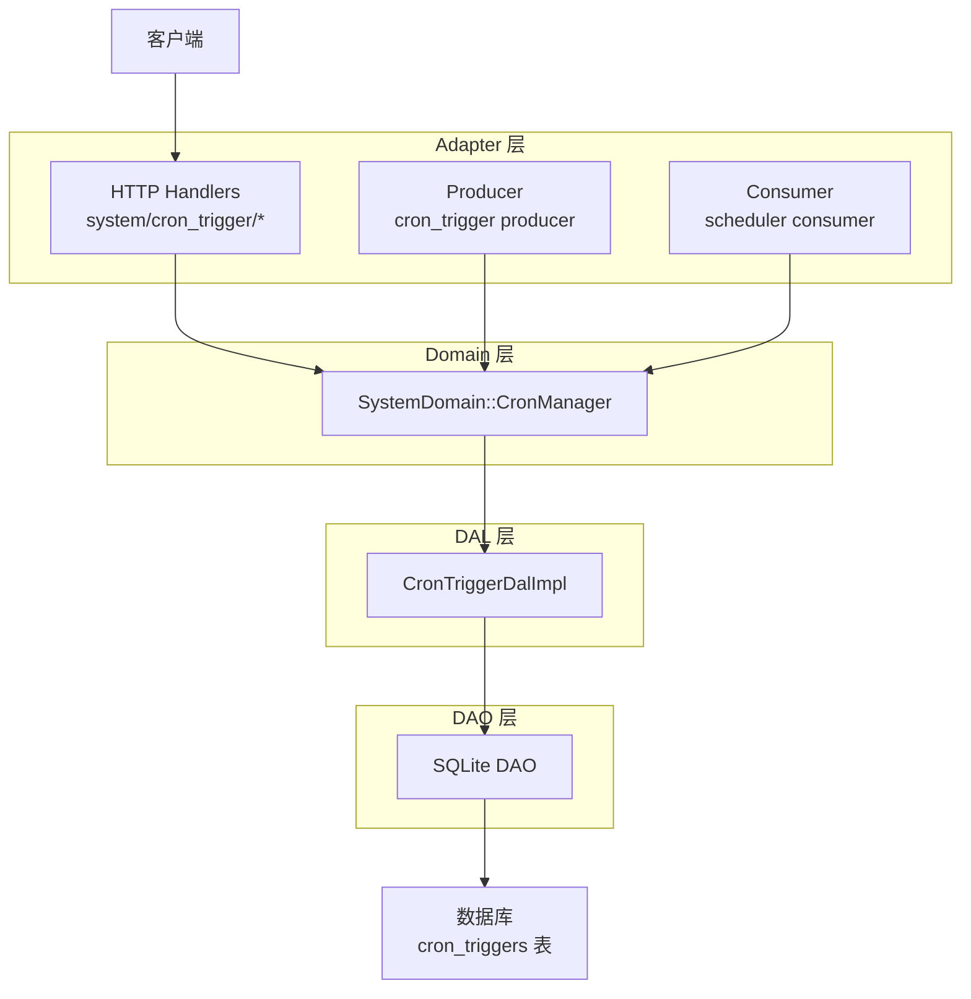
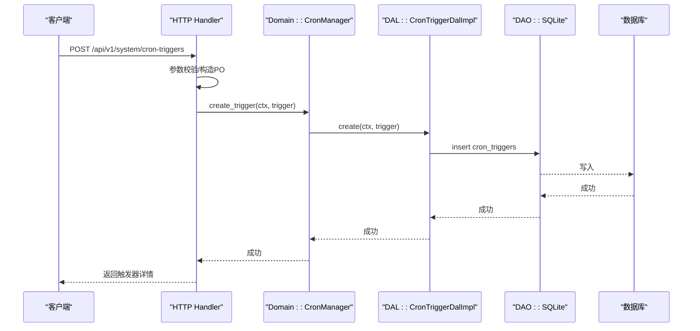
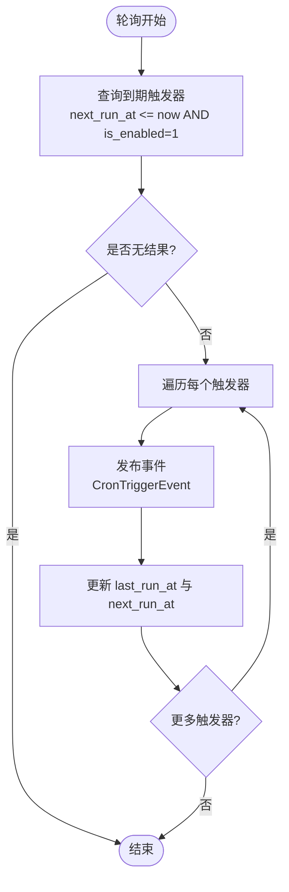
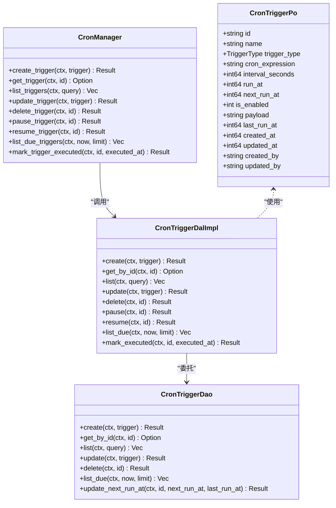
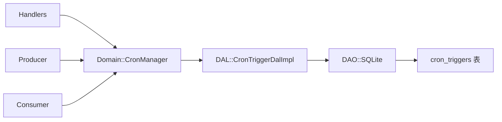

# 定时任务 API

<cite>
**本文引用的文件**
- [common/src/api/cron_trigger.rs](file://common/src/api/cron_trigger.rs)
- [common/src/enums/cron_trigger.rs](file://common/src/enums/cron_trigger.rs)
- [migrations/20260711000000_cron_triggers.sql](file://migrations/20260711000000_cron_triggers.sql)
- [src/models/cron_trigger.rs](file://src/models/cron_trigger.rs)
- [src/service/dao/cron_trigger/mod.rs](file://src/service/dao/cron_trigger/mod.rs)
- [src/service/dao/cron_trigger/sqlite.rs](file://src/service/dao/cron_trigger/sqlite.rs)
- [src/service/dal/cron_trigger.rs](file://src/service/dal/cron_trigger.rs)
- [src/service/domain/system/mod.rs](file://src/service/domain/system/mod.rs)
- [src/handlers/system/cron_trigger/mod.rs](file://src/handlers/system/cron_trigger/mod.rs)
- [src/handlers/system/cron_trigger/create_cron_trigger.rs](file://src/handlers/system/cron_trigger/create_cron_trigger.rs)
- [src/handlers/system/cron_trigger/get_cron_trigger.rs](file://src/handlers/system/cron_trigger/get_cron_trigger.rs)
- [src/handlers/system/cron_trigger/list_cron_triggers.rs](file://src/handlers/system/cron_trigger/list_cron_triggers.rs)
- [src/handlers/system/cron_trigger/update_cron_trigger.rs](file://src/handlers/system/cron_trigger/update_cron_trigger.rs)
- [src/handlers/system/cron_trigger/delete_cron_trigger.rs](file://src/handlers/system/cron_trigger/delete_cron_trigger.rs)
- [src/handlers/system/cron_trigger/pause_cron_trigger.rs](file://src/handlers/system/cron_trigger/pause_cron_trigger.rs)
- [src/handlers/system/cron_trigger/resume_cron_trigger.rs](file://src/handlers/system/cron_trigger/resume_cron_trigger.rs)
- [src/handlers/system/cron_trigger/response.rs](file://src/handlers/system/cron_trigger/response.rs)
- [src/producer/cron_trigger.rs](file://src/producer/cron_trigger.rs)
- [src/consumer/scheduler.rs](file://src/consumer/scheduler.rs)
- [tests/integration/system_cron_triggers_test.rs](file://tests/integration/system_cron_triggers_test.rs)
</cite>

## 目录
1. [简介](#简介)
2. [项目结构](#项目结构)
3. [核心组件](#核心组件)
4. [架构总览](#架构总览)
5. [详细组件分析](#详细组件分析)
6. [依赖关系分析](#依赖关系分析)
7. [性能与调度特性](#性能与调度特性)
8. [故障排查指南](#故障排查指南)
9. [结论](#结论)
10. [附录：API 规范与示例](#附录api-规范与示例)

## 简介
本文件为 AI Orz 的“定时任务（Cron Trigger）管理”功能的完整 API 文档。内容覆盖定时任务的创建、删除、查询、暂停、恢复、更新等接口，说明触发器类型、调度机制、执行状态管理、错误处理、配置参数、执行环境、日志与监控指标，并提供常见使用场景的请求与响应示例。当前实现支持一次性触发（Once）与固定间隔触发（Interval），Cron 表达式类型已预留但尚未启用。

## 项目结构
定时任务功能遵循四层单向调用：Adapter（HTTP Handler / AOP Producer / Consumer）→ Domain → DAL → DAO。数据模型与枚举在 common 层共享给前后端；持久化对象仅在 DAO/DAL 内部使用。

图表来源
- [src/handlers/system/cron_trigger/mod.rs:1-20](file://src/handlers/system/cron_trigger/mod.rs#L1-L20)
- [src/producer/cron_trigger.rs:26-87](file://src/producer/cron_trigger.rs#L26-L87)
- [src/consumer/scheduler.rs:49-95](file://src/consumer/scheduler.rs#L49-L95)
- [src/service/domain/system/mod.rs:116-141](file://src/service/domain/system/mod.rs#L116-L141)
- [src/service/dal/cron_trigger.rs:34-74](file://src/service/dal/cron_trigger.rs#L34-L74)
- [src/service/dao/cron_trigger/mod.rs:18-56](file://src/service/dao/cron_trigger/mod.rs#L18-L56)
- [migrations/20260711000000_cron_triggers.sql:1-25](file://migrations/20260711000000_cron_triggers.sql#L1-L25)

章节来源
- [src/handlers/system/cron_trigger/mod.rs:1-20](file://src/handlers/system/cron_trigger/mod.rs#L1-L20)
- [src/producer/cron_trigger.rs:26-87](file://src/producer/cron_trigger.rs#L26-L87)
- [src/consumer/scheduler.rs:49-95](file://src/consumer/scheduler.rs#L49-L95)
- [src/service/domain/system/mod.rs:116-141](file://src/service/domain/system/mod.rs#L116-L141)
- [src/service/dal/cron_trigger.rs:34-74](file://src/service/dal/cron_trigger.rs#L34-L74)
- [src/service/dao/cron_trigger/mod.rs:18-56](file://src/service/dao/cron_trigger/mod.rs#L18-L56)
- [migrations/20260711000000_cron_triggers.sql:1-25](file://migrations/20260711000000_cron_triggers.sql#L1-L25)

## 核心组件
- HTTP Handlers：提供 REST 接口，负责请求校验、上下文传递与结果序列化。
- Domain CronManager：领域能力入口，封装触发器的业务操作。
- DAL CronTriggerDalImpl：业务数据访问层，组合 DAO 并实现暂停/恢复、下次执行时间计算等逻辑。
- DAO SQLite：SQL 实现，负责持久化与到期扫描。
- Producer：定时轮询到期触发器并发布事件。
- Consumer：消费触发事件，根据 payload.action 路由到具体业务处理。

章节来源
- [src/handlers/system/cron_trigger/create_cron_trigger.rs:14-67](file://src/handlers/system/cron_trigger/create_cron_trigger.rs#L14-L67)
- [src/handlers/system/cron_trigger/list_cron_triggers.rs:12-29](file://src/handlers/system/cron_trigger/list_cron_triggers.rs#L12-L29)
- [src/handlers/system/cron_trigger/update_cron_trigger.rs:11-57](file://src/handlers/system/cron_trigger/update_cron_trigger.rs#L11-L57)
- [src/handlers/system/cron_trigger/delete_cron_trigger.rs:11-22](file://src/handlers/system/cron_trigger/delete_cron_trigger.rs#L11-L22)
- [src/handlers/system/cron_trigger/pause_cron_trigger.rs:11-22](file://src/handlers/system/cron_trigger/pause_cron_trigger.rs#L11-L22)
- [src/handlers/system/cron_trigger/resume_cron_trigger.rs:11-22](file://src/handlers/system/cron_trigger/resume_cron_trigger.rs#L11-L22)
- [src/service/domain/system/mod.rs:116-141](file://src/service/domain/system/mod.rs#L116-L141)
- [src/service/dal/cron_trigger.rs:34-177](file://src/service/dal/cron_trigger.rs#L34-L177)
- [src/service/dao/cron_trigger/sqlite.rs:166-213](file://src/service/dao/cron_trigger/sqlite.rs#L166-L213)
- [src/producer/cron_trigger.rs:26-87](file://src/producer/cron_trigger.rs#L26-L87)
- [src/consumer/scheduler.rs:49-95](file://src/consumer/scheduler.rs#L49-L95)

## 架构总览
下图展示一次“创建触发器”的端到端流程：Handler 校验参数并构造 PO，调用 Domain，再经 DAL 落库；随后通过列表或详情接口可验证结果。

图表来源
- [src/handlers/system/cron_trigger/create_cron_trigger.rs:14-67](file://src/handlers/system/cron_trigger/create_cron_trigger.rs#L14-L67)
- [src/service/domain/system/mod.rs:116-141](file://src/service/domain/system/mod.rs#L116-L141)
- [src/service/dal/cron_trigger.rs:83-87](file://src/service/dal/cron_trigger.rs#L83-L87)
- [src/service/dao/cron_trigger/sqlite.rs:166-213](file://src/service/dao/cron_trigger/sqlite.rs#L166-L213)

## 详细组件分析

### 触发器类型与数据模型
- 触发器类型：
  - Once：一次性触发，需指定 run_at（Unix 秒级时间戳）。
  - Interval：固定间隔触发，需指定 interval_seconds。
  - Cron：Cron 表达式触发，当前未启用。
- 数据模型关键字段：
  - id、name、trigger_type、next_run_at、is_enabled、payload、last_run_at、created_at、updated_at、created_by、updated_by。
  - payload 为 JSON 字符串，包含 action 与 extra 等业务负载。

章节来源
- [common/src/enums/cron_trigger.rs:9-22](file://common/src/enums/cron_trigger.rs#L9-L22)
- [src/models/cron_trigger.rs:10-27](file://src/models/cron_trigger.rs#L10-L27)
- [migrations/20260711000000_cron_triggers.sql:4-19](file://migrations/20260711000000_cron_triggers.sql#L4-L19)

### 调度与执行流程
- Producer 每 60 秒轮询，查询 next_run_at <= now 且 is_enabled=1 的触发器，发布 CronTriggerEvent，并立即更新 last_run_at 与下一次执行时间。
- Consumer 接收事件后解析 payload，根据 action 路由到具体处理（如 agent_rest、project_followup）。
- 一次性触发执行后自动禁用；间隔触发按 interval_seconds 推进 next_run_at；Cron 类型当前不支持。

图表来源
- [src/producer/cron_trigger.rs:38-87](file://src/producer/cron_trigger.rs#L38-L87)
- [src/consumer/scheduler.rs:53-95](file://src/consumer/scheduler.rs#L53-L95)
- [src/service/dal/cron_trigger.rs:140-175](file://src/service/dal/cron_trigger.rs#L140-L175)
- [src/service/dao/cron_trigger/sqlite.rs:166-213](file://src/service/dao/cron_trigger/sqlite.rs#L166-L213)

### 状态管理与错误处理
- 暂停/恢复：DAL 层读取记录，修改 is_enabled 并记录更新时间与操作人。
- 删除：DAO 层软删除（is_enabled=0）。
- 错误：
  - 参数缺失：InvalidRequest（如 Once 缺少 run_at，Interval 缺少 interval_seconds）。
  - 资源不存在：ResourceNotFound（获取/暂停/恢复时找不到触发器）。
  - 功能未实现：UnsupportedOperation（Cron 类型）。
  - 系统异常：Internal（如 registry 未注册）。

章节来源
- [src/handlers/system/cron_trigger/create_cron_trigger.rs:19-38](file://src/handlers/system/cron_trigger/create_cron_trigger.rs#L19-L38)
- [src/handlers/system/cron_trigger/get_cron_trigger.rs:16-24](file://src/handlers/system/cron_trigger/get_cron_trigger.rs#L16-L24)
- [src/handlers/system/cron_trigger/update_cron_trigger.rs:16-22](file://src/handlers/system/cron_trigger/update_cron_trigger.rs#L16-L22)
- [src/service/dal/cron_trigger.rs:109-129](file://src/service/dal/cron_trigger.rs#L109-L129)
- [src/service/dal/cron_trigger.rs:140-175](file://src/service/dal/cron_trigger.rs#L140-L175)
- [src/producer/cron_trigger.rs:48-50](file://src/producer/cron_trigger.rs#L48-L50)

### 类与模块关系图

图表来源
- [src/models/cron_trigger.rs:10-27](file://src/models/cron_trigger.rs#L10-L27)
- [src/service/dao/cron_trigger/mod.rs:18-56](file://src/service/dao/cron_trigger/mod.rs#L18-L56)
- [src/service/dal/cron_trigger.rs:34-74](file://src/service/dal/cron_trigger.rs#L34-L74)
- [src/service/domain/system/mod.rs:116-141](file://src/service/domain/system/mod.rs#L116-L141)

## 依赖关系分析
- Handler 依赖 Domain::CronManager，不直接访问 DAL/DAO。
- Domain 仅暴露统一接口，DAL 组合 DAO，DAO 实现 SQL。
- Producer/Consumer 通过 AOP Registry 解耦事件生产与消费。
- 数据库表 cron_triggers 提供索引优化到期查询与状态过滤。

图表来源
- [src/handlers/system/cron_trigger/mod.rs:1-20](file://src/handlers/system/cron_trigger/mod.rs#L1-L20)
- [src/service/domain/system/mod.rs:116-141](file://src/service/domain/system/mod.rs#L116-L141)
- [src/service/dal/cron_trigger.rs:34-74](file://src/service/dal/cron_trigger.rs#L34-L74)
- [src/service/dao/cron_trigger/mod.rs:18-56](file://src/service/dao/cron_trigger/mod.rs#L18-L56)
- [migrations/20260711000000_cron_triggers.sql:21-24](file://migrations/20260711000000_cron_triggers.sql#L21-L24)

章节来源
- [src/handlers/system/cron_trigger/mod.rs:1-20](file://src/handlers/system/cron_trigger/mod.rs#L1-L20)
- [src/service/domain/system/mod.rs:116-141](file://src/service/domain/system/mod.rs#L116-L141)
- [src/service/dal/cron_trigger.rs:34-74](file://src/service/dal/cron_trigger.rs#L34-L74)
- [src/service/dao/cron_trigger/mod.rs:18-56](file://src/service/dao/cron_trigger/mod.rs#L18-L56)
- [migrations/20260711000000_cron_triggers.sql:21-24](file://migrations/20260711000000_cron_triggers.sql#L21-L24)

## 性能与调度特性
- 轮询周期：Producer 默认每 60 秒轮询一次到期触发器。
- 批量拉取：每次最多拉取 100 条到期触发器，避免单次压力过大。
- 数据库索引：对 next_run_at、is_enabled、trigger_type、created_at 建立索引，加速到期扫描与列表查询。
- 并发控制：当前实现为顺序发布与标记执行；如需更高吞吐，可在消费者侧引入并发限制与重试队列（扩展点）。
- 失败重试：当前未内置指数退避重试；可通过上层消息队列或消费者重试策略扩展。

章节来源
- [src/producer/cron_trigger.rs:38-87](file://src/producer/cron_trigger.rs#L38-L87)
- [src/service/dao/cron_trigger/sqlite.rs:166-213](file://src/service/dao/cron_trigger/sqlite.rs#L166-L213)
- [migrations/20260711000000_cron_triggers.sql:21-24](file://migrations/20260711000000_cron_triggers.sql#L21-L24)

## 故障排查指南
- 创建失败（参数缺失）：检查 Once 是否提供 run_at，Interval 是否提供 interval_seconds。
- 创建失败（Cron 类型）：当前不支持 Cron 表达式，请使用 Once 或 Interval。
- 暂停/恢复失败：确认触发器存在且未被删除；检查 is_enabled 字段变化。
- 未触发：确认 next_run_at <= now 且 is_enabled=1；查看 Producer 日志是否发布事件；检查 Consumer 是否收到并解析 payload。
- 系统异常：若出现 Internal 错误，检查 AOP Registry 是否已注册。

章节来源
- [src/handlers/system/cron_trigger/create_cron_trigger.rs:19-38](file://src/handlers/system/cron_trigger/create_cron_trigger.rs#L19-L38)
- [src/service/dal/cron_trigger.rs:109-129](file://src/service/dal/cron_trigger.rs#L109-L129)
- [src/producer/cron_trigger.rs:48-87](file://src/producer/cron_trigger.rs#L48-L87)
- [src/consumer/scheduler.rs:53-95](file://src/consumer/scheduler.rs#L53-L95)

## 结论
AI Orz 的定时任务管理提供了完整的 CRUD 与启停控制能力，并通过 Producer/Consumer 模式实现解耦的事件驱动调度。当前版本稳定支持 Once 与 Interval 两种触发方式，Cron 表达式类型已预留。建议在生产环境中结合监控指标与日志进行运行态观测，并根据业务需求扩展并发与重试机制。

## 附录：API 规范与示例

### 公共数据类型
- 触发器类型：Once、Interval、Cron（当前不可用）。
- 触发器详情字段：id、name、trigger_type、cron_expression、interval_seconds、run_at、next_run_at、is_enabled、payload、last_run_at、created_at、updated_at、created_by、updated_by。

章节来源
- [common/src/enums/cron_trigger.rs:9-22](file://common/src/enums/cron_trigger.rs#L9-L22)
- [common/src/api/cron_trigger.rs:45-76](file://common/src/api/cron_trigger.rs#L45-L76)
- [src/handlers/system/cron_trigger/response.rs:64-80](file://src/handlers/system/cron_trigger/response.rs#L64-L80)

### 接口清单
- 创建触发器
  - 方法：POST
  - 路径：/api/v1/system/cron-triggers
  - 请求体：CreateCronTriggerRequest（name、trigger_type、可选 cron_expression/interval_seconds/run_at、payload）
  - 响应：CreateCronTriggerResponse（CronTriggerDetail）
  - 约束：Once 必须提供 run_at；Interval 必须提供 interval_seconds；Cron 类型当前返回 UnsupportedOperation。
- 查询触发器详情
  - 方法：GET
  - 路径：/api/v1/system/cron-triggers/{trigger_id}
  - 响应：GetCronTriggerResponse（CronTriggerDetail）
- 列出触发器
  - 方法：GET
  - 路径：/api/v1/system/cron-triggers
  - 查询参数：trigger_type、is_enabled、limit
  - 响应：ListCronTriggersResponse（triggers、total）
- 更新触发器
  - 方法：PUT
  - 路径：/api/v1/system/cron-triggers/{trigger_id}
  - 请求体：UpdateCronTriggerRequest（部分字段可选）
  - 响应：UpdateCronTriggerResponse（CronTriggerDetail）
- 删除触发器
  - 方法：DELETE
  - 路径：/api/v1/system/cron-triggers/{trigger_id}
  - 响应：DeleteCronTriggerResponse（success）
- 暂停触发器
  - 方法：POST
  - 路径：/api/v1/system/cron-triggers/{trigger_id}/pause
  - 响应：PauseCronTriggerResponse（success）
- 恢复触发器
  - 方法：POST
  - 路径：/api/v1/system/cron-triggers/{trigger_id}/resume
  - 响应：ResumeCronTriggerResponse（success）

章节来源
- [src/handlers/system/cron_trigger/create_cron_trigger.rs:14-67](file://src/handlers/system/cron_trigger/create_cron_trigger.rs#L14-L67)
- [src/handlers/system/cron_trigger/get_cron_trigger.rs:11-24](file://src/handlers/system/cron_trigger/get_cron_trigger.rs#L11-L24)
- [src/handlers/system/cron_trigger/list_cron_triggers.rs:12-29](file://src/handlers/system/cron_trigger/list_cron_triggers.rs#L12-L29)
- [src/handlers/system/cron_trigger/update_cron_trigger.rs:11-57](file://src/handlers/system/cron_trigger/update_cron_trigger.rs#L11-L57)
- [src/handlers/system/cron_trigger/delete_cron_trigger.rs:11-22](file://src/handlers/system/cron_trigger/delete_cron_trigger.rs#L11-L22)
- [src/handlers/system/cron_trigger/pause_cron_trigger.rs:11-22](file://src/handlers/system/cron_trigger/pause_cron_trigger.rs#L11-L22)
- [src/handlers/system/cron_trigger/resume_cron_trigger.rs:11-22](file://src/handlers/system/cron_trigger/resume_cron_trigger.rs#L11-L22)
- [src/handlers/system/cron_trigger/response.rs:8-62](file://src/handlers/system/cron_trigger/response.rs#L8-L62)

### 请求与响应示例
- 创建一次性触发器
  - 请求体示例：
    - name: "agent_rest"
    - trigger_type: "Once"
    - run_at: 1719900000
    - payload: "{\"action\":\"agent_rest\",\"extra\":{\"settle_limit\":10}}"
  - 响应：返回触发器详情，包含 next_run_at、is_enabled=true、payload 等。
- 创建间隔触发器
  - 请求体示例：
    - name: "project_followup"
    - trigger_type: "Interval"
    - interval_seconds: 3600
    - payload: "{\"action\":\"project_followup\"}"
  - 响应：返回触发器详情，next_run_at = 当前时间 + interval_seconds。
- 列出触发器
  - 查询参数示例：?trigger_type=Interval&is_enabled=true&limit=50
  - 响应：包含 triggers 数组与 total。
- 暂停/恢复
  - 路径：/api/v1/system/cron-triggers/{trigger_id}/pause 或 /resume
  - 响应：{ success: true }

章节来源
- [tests/integration/system_cron_triggers_test.rs:70-100](file://tests/integration/system_cron_triggers_test.rs#L70-L100)
- [src/handlers/system/cron_trigger/response.rs:82-105](file://src/handlers/system/cron_trigger/response.rs#L82-L105)

### Cron 表达式语法说明
- 当前版本未启用 Cron 表达式触发类型；创建或更新时使用 TriggerType::Cron 将返回 UnsupportedOperation。
- 未来启用后，建议采用标准 5 位或 6 位 Cron 表达式（分钟、小时、日、月、周几，可选年），并与 next_run_at 计算逻辑配合。

章节来源
- [src/handlers/system/cron_trigger/create_cron_trigger.rs:32-37](file://src/handlers/system/cron_trigger/create_cron_trigger.rs#L32-L37)
- [src/service/dal/cron_trigger.rs:168-173](file://src/service/dal/cron_trigger.rs#L168-L173)

### 执行环境与日志监控
- 执行环境：Producer 以系统上下文 RequestContext 发起查询与更新；Consumer 解析 payload 并调用相应业务域。
- 日志要点：
  - Producer：发现到期触发器数量、发布事件数量。
  - Consumer：收到事件、解析 payload、未知 action 警告。
- 监控指标建议：
  - 到期触发器数量、发布事件数、消费成功率、平均消费耗时、失败重试次数。

章节来源
- [src/producer/cron_trigger.rs:64-83](file://src/producer/cron_trigger.rs#L64-L83)
- [src/consumer/scheduler.rs:58-91](file://src/consumer/scheduler.rs#L58-L91)

### 常见使用场景
- 数据同步：创建 Interval 触发器，payload 中携带同步目标与批次大小，消费者执行增量同步。
- 清理任务：创建 Interval 触发器，payload 中指定清理策略（如过期数据保留天数），消费者定期清理。
- 报告生成：创建 Once 触发器，payload 中指定报告模板与输出路径，消费者生成并归档报告。

章节来源
- [src/consumer/scheduler.rs:78-91](file://src/consumer/scheduler.rs#L78-L91)
- [tests/integration/system_cron_triggers_test.rs:70-100](file://tests/integration/system_cron_triggers_test.rs#L70-L100)