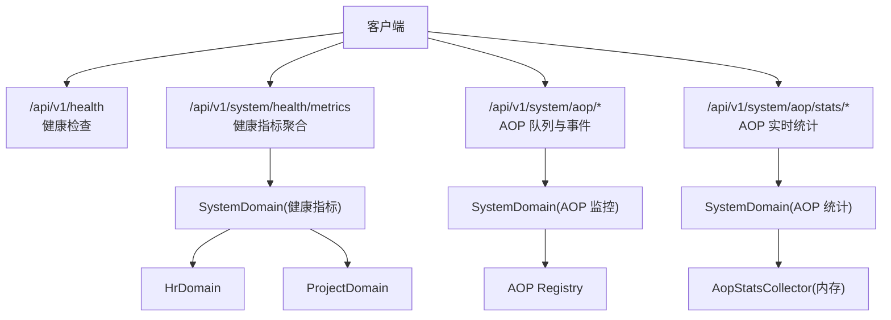
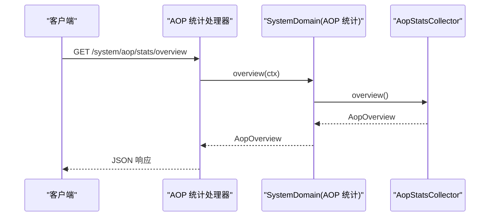
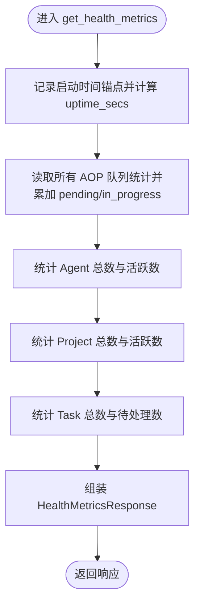
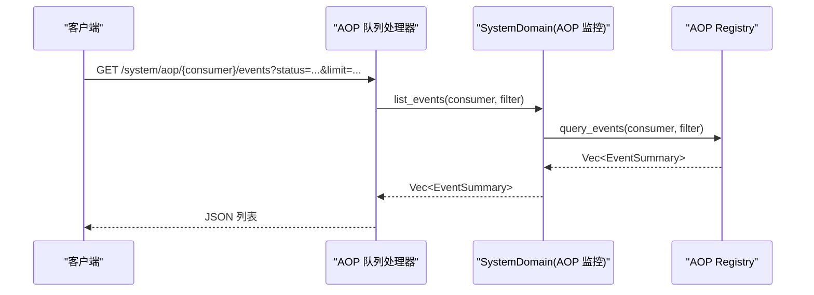
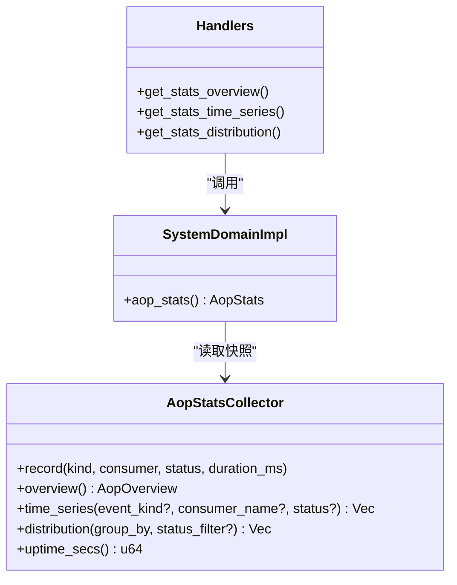
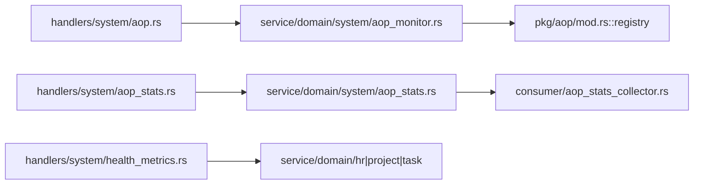

# 监控指标 API

<cite>
**本文引用的文件**
- [src/handlers/health.rs](file://src/handlers/health.rs)
- [src/handlers/system/health_metrics.rs](file://src/handlers/system/health_metrics.rs)
- [src/handlers/system/aop.rs](file://src/handlers/system/aop.rs)
- [src/handlers/system/aop_stats.rs](file://src/handlers/system/aop_stats.rs)
- [src/service/domain/system/aop_monitor.rs](file://src/service/domain/system/aop_monitor.rs)
- [src/service/domain/system/aop_stats.rs](file://src/service/domain/system/aop_stats.rs)
- [src/consumer/aop_stats_collector.rs](file://src/consumer/aop_stats_collector.rs)
- [src/pkg/aop/mod.rs](file://src/pkg/aop/mod.rs)
- [common/src/api/log_stats.rs](file://common/src/api/log_stats.rs)
- [common/src/models/stats.rs](file://common/src/models/stats.rs)
- [src/pkg/stats/mod.rs](file://src/pkg/stats/mod.rs)
</cite>

## 目录
1. [简介](#简介)
2. [项目结构](#项目结构)
3. [核心组件](#核心组件)
4. [架构总览](#架构总览)
5. [详细组件分析](#详细组件分析)
6. [依赖关系分析](#依赖关系分析)
7. [性能考量](#性能考量)
8. [故障排查指南](#故障排查指南)
9. [结论](#结论)
10. [附录：API 规范与示例](#附录api-规范与示例)

## 简介
本文件为 AI Orz 系统监控能力的 API 文档，覆盖 AOP 监控、性能指标与健康检查接口。内容包含：
- 监控指标类型、采集方式、聚合计算与可视化展示说明
- 健康检查端点、服务状态检测、依赖服务监控与告警建议
- 完整请求/响应示例与常见使用场景（系统监控、性能分析、故障诊断）
- 监控数据存储、历史查询与导出能力说明

## 项目结构
监控相关代码遵循四层单向调用：Adapter（HTTP Handler）→ Domain → DAL → DAO；通用基础设施工具位于 src/pkg/。AOP 事件中心在 pkg/aop 中提供注册、调度与队列能力；统计采集同时支持内存实时（pkg/stats/runtime）与持久化（DuckDB）。

图表来源
- [src/handlers/system/health_metrics.rs:33-134](file://src/handlers/system/health_metrics.rs#L33-L134)
- [src/handlers/system/aop.rs:14-145](file://src/handlers/system/aop.rs#L14-L145)
- [src/handlers/system/aop_stats.rs:16-72](file://src/handlers/system/aop_stats.rs#L16-L72)
- [src/service/domain/system/aop_monitor.rs:7-26](file://src/service/domain/system/aop_monitor.rs#L7-L26)
- [src/service/domain/system/aop_stats.rs:14-52](file://src/service/domain/system/aop_stats.rs#L14-L52)
- [src/pkg/aop/mod.rs:36-60](file://src/pkg/aop/mod.rs#L36-L60)

章节来源
- [src/handlers/system/health_metrics.rs:33-134](file://src/handlers/system/health_metrics.rs#L33-L134)
- [src/handlers/system/aop.rs:14-145](file://src/handlers/system/aop.rs#L14-L145)
- [src/handlers/system/aop_stats.rs:16-72](file://src/handlers/system/aop_stats.rs#L16-L72)
- [src/pkg/aop/mod.rs:36-60](file://src/pkg/aop/mod.rs#L36-L60)

## 核心组件
- 健康检查
  - GET /api/v1/health：返回进程版本与状态。
  - GET /api/v1/system/health/metrics：聚合后端在线、AOP 队列积压、运行时长、Agent/Project/Task 计数等。
- AOP 监控
  - GET /api/v1/system/aop/stats：所有消费者队列统计。
  - GET /api/v1/system/aop/{consumer}/stats：指定消费者队列统计。
  - GET /api/v1/system/aop/{consumer}/events：事件列表（支持分页、状态过滤）。
  - GET /api/v1/system/aop/{consumer}/events/{event_id}：事件详情。
- AOP 实时统计
  - GET /api/v1/system/aop/stats/overview：概览（发布/消费/成功/失败/平均耗时）。
  - GET /api/v1/system/aop/stats/time-series：时序数据（按分钟桶，可过滤 event_kind/consumer/status）。
  - GET /api/v1/system/aop/stats/distribution：分布（按 consumer/status/kind 分组）。
- 日志统计（辅助）
  - 日志级别分布与时序查询参数定义见 common/src/api/log_stats.rs。

章节来源
- [src/handlers/health.rs:4-15](file://src/handlers/health.rs#L4-L15)
- [src/handlers/system/health_metrics.rs:33-134](file://src/handlers/system/health_metrics.rs#L33-L134)
- [src/handlers/system/aop.rs:14-145](file://src/handlers/system/aop.rs#L14-L145)
- [src/handlers/system/aop_stats.rs:16-72](file://src/handlers/system/aop_stats.rs#L16-L72)
- [common/src/api/log_stats.rs:7-77](file://common/src/api/log_stats.rs#L7-L77)

## 架构总览
监控数据流分为两条路径：
- 队列与事件监控：Handler → SystemDomain.aop_monitor() → AOP Registry → 队列快照/事件查询。
- 实时统计：Handler → SystemDomain.aop_stats() → AopStatsCollector（内存快照）→ 聚合计算。

图表来源
- [src/handlers/system/aop_stats.rs:16-30](file://src/handlers/system/aop_stats.rs#L16-L30)
- [src/service/domain/system/aop_stats.rs:14-20](file://src/service/domain/system/aop_stats.rs#L14-L20)
- [src/consumer/aop_stats_collector.rs:74-111](file://src/consumer/aop_stats_collector.rs#L74-L111)

章节来源
- [src/handlers/system/aop_stats.rs:16-72](file://src/handlers/system/aop_stats.rs#L16-L72)
- [src/service/domain/system/aop_stats.rs:14-52](file://src/service/domain/system/aop_stats.rs#L14-L52)
- [src/consumer/aop_stats_collector.rs:74-195](file://src/consumer/aop_stats_collector.rs#L74-L195)

## 详细组件分析

### 健康检查与健康指标聚合
- GET /api/v1/health
  - 作用：快速探测服务是否存活并返回版本信息。
  - 响应字段：status、version。
- GET /api/v1/system/health/metrics
  - 作用：为前端 HUD 仪表盘墙提供单一聚合端点，避免并发多域请求。
  - 指标维度：
    - backend_online：能响应即 true。
    - aop_pending / aop_in_progress：来自 SystemDomain.aop_monitor().all_queue_stats() 的汇总。
    - uptime_secs：首次调用时初始化时间锚点的经过秒数。
    - active_agents / total_agents：通过 HrDomain.agent_manage() 统计。
    - active_projects / total_projects：通过 ProjectDomain.project_manage() 统计。
    - pending_tasks / total_tasks：通过 ProjectDomain.task_manage() 统计。

图表来源
- [src/handlers/system/health_metrics.rs:33-134](file://src/handlers/system/health_metrics.rs#L33-L134)

章节来源
- [src/handlers/health.rs:4-15](file://src/handlers/health.rs#L4-L15)
- [src/handlers/system/health_metrics.rs:33-134](file://src/handlers/system/health_metrics.rs#L33-L134)

### AOP 队列监控
- GET /api/v1/system/aop/stats
  - 返回所有消费者队列统计：pending_count、in_progress_count、order_keys、oldest_event_age_secs。
- GET /api/v1/system/aop/{consumer}/stats
  - 返回指定消费者队列统计；不存在则 404。
- GET /api/v1/system/aop/{consumer}/events
  - 事件列表：支持 status(pending/processing)、order_key、limit(≤1000)、offset。
- GET /api/v1/system/aop/{consumer}/events/{event_id}
  - 事件详情：包含摘要与 payload_preview；不存在则 404。

图表来源
- [src/handlers/system/aop.rs:73-117](file://src/handlers/system/aop.rs#L73-L117)
- [src/service/domain/system/aop_monitor.rs:16-22](file://src/service/domain/system/aop_monitor.rs#L16-L22)
- [src/pkg/aop/mod.rs:36-60](file://src/pkg/aop/mod.rs#L36-L60)

章节来源
- [src/handlers/system/aop.rs:14-145](file://src/handlers/system/aop.rs#L14-L145)
- [src/service/domain/system/aop_monitor.rs:7-26](file://src/service/domain/system/aop_monitor.rs#L7-L26)
- [src/pkg/aop/mod.rs:36-60](file://src/pkg/aop/mod.rs#L36-L60)

### AOP 实时统计
- GET /api/v1/system/aop/stats/overview
  - 返回 total_published、total_consumed、total_success、total_failed、avg_duration_ms。
- GET /api/v1/system/aop/stats/time-series
  - 返回按分钟桶的 call_count 序列，支持 event_kind/consumer_name/status 过滤。
- GET /api/v1/system/aop/stats/distribution
  - 返回按 consumer/status/kind 分组的 label/value 列表，支持 status 过滤。

图表来源
- [src/consumer/aop_stats_collector.rs:43-195](file://src/consumer/aop_stats_collector.rs#L43-L195)
- [src/service/domain/system/aop_stats.rs:14-52](file://src/service/domain/system/aop_stats.rs#L14-L52)
- [src/handlers/system/aop_stats.rs:16-72](file://src/handlers/system/aop_stats.rs#L16-L72)

章节来源
- [src/handlers/system/aop_stats.rs:16-72](file://src/handlers/system/aop_stats.rs#L16-L72)
- [src/service/domain/system/aop_stats.rs:14-52](file://src/service/domain/system/aop_stats.rs#L14-L52)
- [src/consumer/aop_stats_collector.rs:43-195](file://src/consumer/aop_stats_collector.rs#L43-L195)

### 监控数据采集与存储
- 内存实时采集
  - AopStatsCollector 基于 RuntimeStatsCollector 维护分钟级桶与总量，重启重置，适合运行时能力（AOP/SSE/Channel）的毫秒级查询。
- 持久化统计
  - pkg/stats 提供 DuckDB 持久化实现，跨重启保留，支持复杂 SQL 查询；业务事件可通过 record_event! 宏记录。
- 全局访问
  - 无 RequestContext 的场景（如 AOP 消费者）可通过全局 Stats 单例写入。

章节来源
- [src/consumer/aop_stats_collector.rs:1-52](file://src/consumer/aop_stats_collector.rs#L1-L52)
- [src/pkg/stats/mod.rs:1-57](file://src/pkg/stats/mod.rs#L1-L57)
- [src/pkg/stats/mod.rs:152-171](file://src/pkg/stats/mod.rs#L152-L171)

### 可视化展示
- 前端 HUD 仪表盘墙通过 /system/health/metrics 获取聚合指标，减少并发请求。
- AOP 队列与事件用于故障定位与容量观测。
- 实时统计用于趋势分析与分布观察（按 consumer/status/kind）。

[本节为概念性说明，不直接分析具体文件]

## 依赖关系分析
- Handler 层仅依赖 Domain 层暴露的接口，不直接访问 DAO/DAL。
- AOP 监控依赖 pkg/aop::registry 提供的队列快照与事件查询。
- 实时统计依赖 AopStatsCollector 的内存快照，零 DB 开销。
- 健康指标聚合依赖 HrDomain、ProjectDomain、TaskDomain 的计数接口。

图表来源
- [src/handlers/system/aop.rs:14-145](file://src/handlers/system/aop.rs#L14-L145)
- [src/handlers/system/aop_stats.rs:16-72](file://src/handlers/system/aop_stats.rs#L16-L72)
- [src/handlers/system/health_metrics.rs:33-134](file://src/handlers/system/health_metrics.rs#L33-L134)
- [src/service/domain/system/aop_monitor.rs:7-26](file://src/service/domain/system/aop_monitor.rs#L7-L26)
- [src/service/domain/system/aop_stats.rs:14-52](file://src/service/domain/system/aop_stats.rs#L14-L52)
- [src/pkg/aop/mod.rs:36-60](file://src/pkg/aop/mod.rs#L36-L60)
- [src/consumer/aop_stats_collector.rs:43-195](file://src/consumer/aop_stats_collector.rs#L43-L195)

章节来源
- [src/handlers/system/aop.rs:14-145](file://src/handlers/system/aop.rs#L14-L145)
- [src/handlers/system/aop_stats.rs:16-72](file://src/handlers/system/aop_stats.rs#L16-L72)
- [src/handlers/system/health_metrics.rs:33-134](file://src/handlers/system/health_metrics.rs#L33-L134)

## 性能考量
- 健康指标聚合端点将多个域查询合并为一次响应，降低前端并发压力。
- AOP 实时统计基于内存快照，无数据库 IO，响应延迟极低。
- AOP 事件列表 limit 上限为 1000，防止大结果集拖慢接口。
- 内存统计占用估算约数十 KB，适合常驻进程内高频读取。

[本节为通用性能建议，不直接分析具体文件]

## 故障排查指南
- 队列积压
  - 通过 /system/aop/stats 或 /system/aop/{consumer}/stats 查看 pending/in_progress 与 oldest_event_age_secs，定位慢消费者。
- 事件丢失或卡住
  - 通过 /system/aop/{consumer}/events 筛选 status=pending/processing，结合 event_id 查看详情。
- 统计异常
  - 通过 /system/aop/stats/overview 与 distribution 观察 success/failed 比例与分布，结合 time-series 定位时间段。
- 健康指标异常
  - 若 backend_online=true 但某项计数异常，检查对应 Domain 计数逻辑与 DAO 查询条件。

章节来源
- [src/handlers/system/aop.rs:43-145](file://src/handlers/system/aop.rs#L43-L145)
- [src/handlers/system/aop_stats.rs:16-72](file://src/handlers/system/aop_stats.rs#L16-L72)
- [src/handlers/system/health_metrics.rs:33-134](file://src/handlers/system/health_metrics.rs#L33-L134)

## 结论
AI Orz 的监控体系以 AOP 事件为中心，结合内存实时统计与持久化统计，提供从健康检查到队列监控、从概览到细粒度分布的全链路观测能力。通过统一的健康指标聚合端点，前端可高效构建仪表盘；通过 AOP 队列与事件接口，运维可快速定位瓶颈与异常。

[本节为总结性内容，不直接分析具体文件]

## 附录：API 规范与示例

### 健康检查
- GET /api/v1/health
  - 响应示例
    - code: 0
    - message: "success"
    - data: { status: "ok", version: "<版本号>" }

章节来源
- [src/handlers/health.rs:4-15](file://src/handlers/health.rs#L4-L15)

### 健康指标聚合
- GET /api/v1/system/health/metrics
  - 响应字段
    - backend_online: boolean
    - aop_pending: number
    - aop_in_progress: number
    - active_agents: number
    - total_agents: number
    - active_projects: number
    - total_projects: number
    - pending_tasks: number
    - total_tasks: number
    - uptime_secs: number

章节来源
- [src/handlers/system/health_metrics.rs:33-134](file://src/handlers/system/health_metrics.rs#L33-L134)

### AOP 队列监控
- GET /api/v1/system/aop/stats
  - 响应：数组，每项包含 consumer_name、pending_count、in_progress_count、order_keys、oldest_event_age_secs。
- GET /api/v1/system/aop/{consumer}/stats
  - 响应：同上的单条队列统计；不存在返回 404。
- GET /api/v1/system/aop/{consumer}/events
  - 查询参数
    - status: "pending" | "processing"
    - order_key: string
    - limit: number (≤1000)
    - offset: number
  - 响应：事件摘要数组（event_id、event_kind、order_key、priority、created_at、status）。
- GET /api/v1/system/aop/{consumer}/events/{event_id}
  - 响应：事件详情（含 payload_preview）；不存在返回 404。

章节来源
- [src/handlers/system/aop.rs:14-145](file://src/handlers/system/aop.rs#L14-L145)

### AOP 实时统计
- GET /api/v1/system/aop/stats/overview
  - 响应字段
    - total_published: number
    - total_consumed: number
    - total_success: number
    - total_failed: number
    - avg_duration_ms: number
- GET /api/v1/system/aop/stats/time-series
  - 查询参数
    - event_kind: string?
    - consumer_name: string?
    - status: string?
  - 响应：points 数组，每项 interval_start、call_count。
- GET /api/v1/system/aop/stats/distribution
  - 查询参数
    - group_by: "consumer" | "status" | "kind"
    - status: string?
  - 响应：items 数组，每项 label、value。

章节来源
- [src/handlers/system/aop_stats.rs:16-72](file://src/handlers/system/aop_stats.rs#L16-L72)
- [src/consumer/aop_stats_collector.rs:74-195](file://src/consumer/aop_stats_collector.rs#L74-L195)

### 日志统计（辅助）
- 查询参数与数据结构
  - LogStatsQueryParams：start_time、end_time（unix ms）
  - LogQueryRequest：keyword、log_id、level、start_time、end_time、page、page_size
  - LogLevelDistributionResponse：items(level, count)、total
  - LogTimeSeriesResponse：points(interval_start, count)

章节来源
- [common/src/api/log_stats.rs:7-77](file://common/src/api/log_stats.rs#L7-L77)

### 监控指标类型与聚合
- 通用统计模型
  - TimeSeriesPoint：interval_start、tokens_input、tokens_output、call_count
  - TokenSumResult：total_tokens_input、total_tokens_output、total_calls
  - CallSummary：total_calls、avg_qps、instant_qps
  - StatsFetchOptions：with_call_summary、with_token_summary、with_time_series、time_range、interval
- 领域统计
  - AgentStats、ProjectStats、TaskStats、ToolStats、ModelCallStats、ProjectProgressSummary

章节来源
- [common/src/models/stats.rs:8-172](file://common/src/models/stats.rs#L8-L172)

### 监控数据存储、历史查询与导出
- 内存实时：AopStatsCollector 提供概览、时序、分布查询，重启重置。
- 持久化：pkg/stats 基于 DuckDB，支持跨重启保留与复杂 SQL 查询；业务事件可通过 record_event! 宏记录。
- 导出建议：对长周期历史数据，建议通过持久化统计表的 SQL 导出至 CSV/Parquet 供离线分析。

章节来源
- [src/consumer/aop_stats_collector.rs:1-52](file://src/consumer/aop_stats_collector.rs#L1-L52)
- [src/pkg/stats/mod.rs:1-57](file://src/pkg/stats/mod.rs#L1-L57)