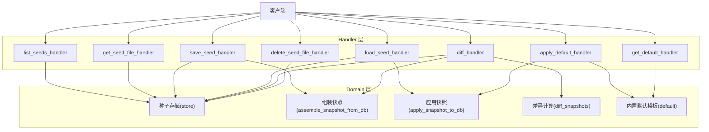
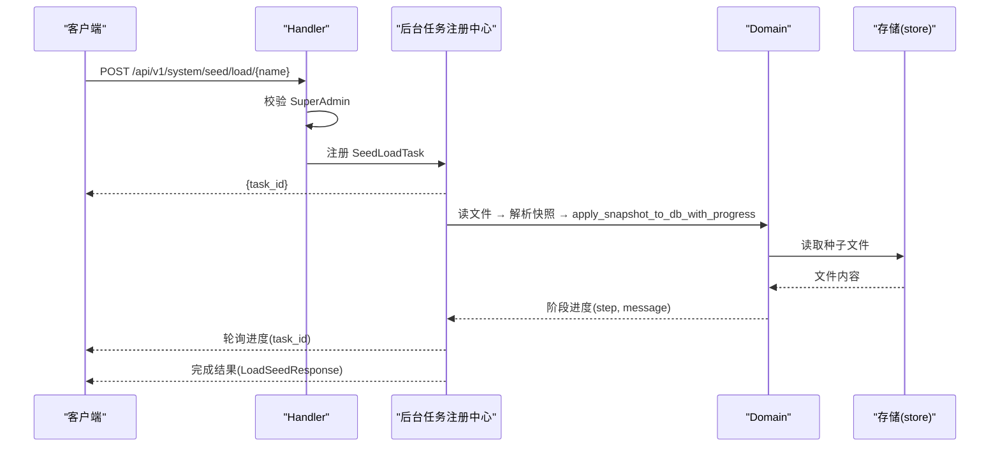
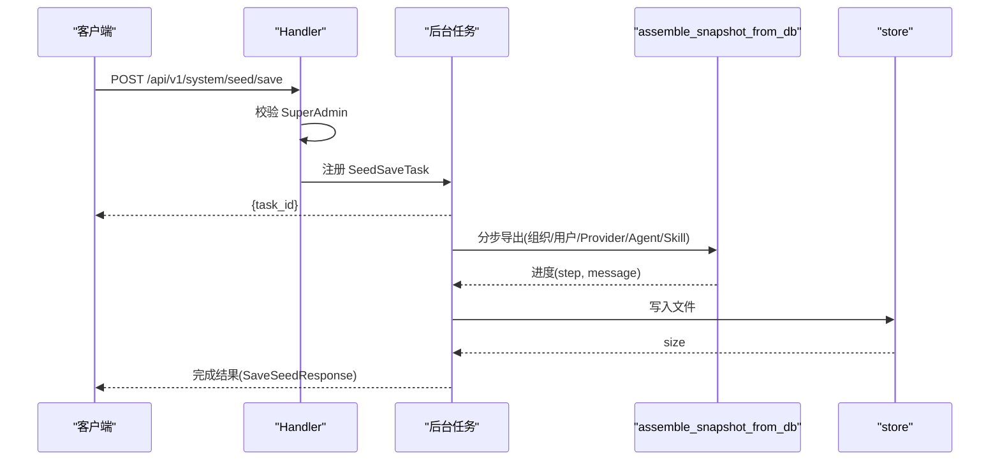
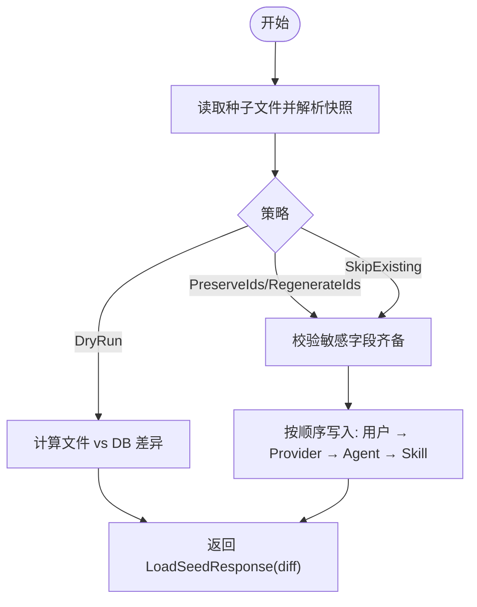
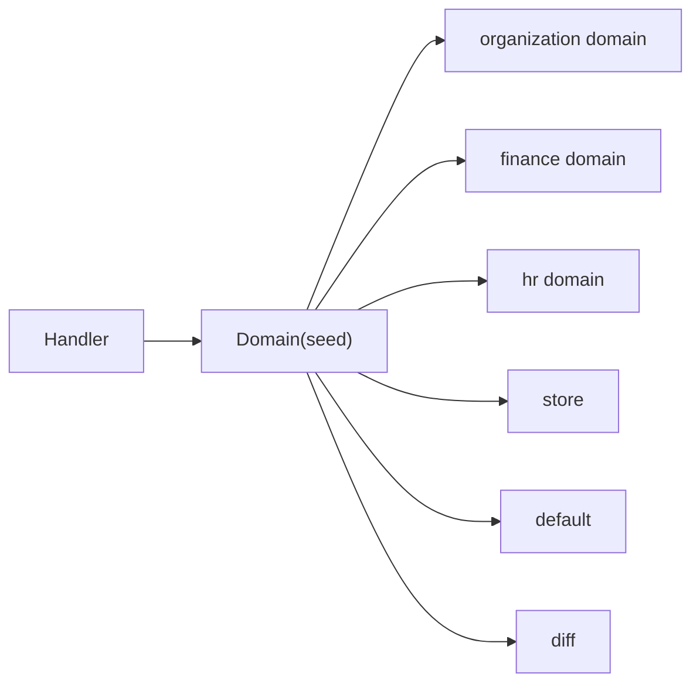

# 种子数据管理 API

<cite>
**本文引用的文件**
- [common/src/api/seed.rs](file://common/src/api/seed.rs)
- [src/handlers/system/seed/mod.rs](file://src/handlers/system/seed/mod.rs)
- [src/handlers/system/seed/list.rs](file://src/handlers/system/seed/list.rs)
- [src/handlers/system/seed/get_file.rs](file://src/handlers/system/seed/get_file.rs)
- [src/handlers/system/seed/save.rs](file://src/handlers/system/seed/save.rs)
- [src/handlers/system/seed/load.rs](file://src/handlers/system/seed/load.rs)
- [src/handlers/system/seed/diff.rs](file://src/handlers/system/seed/diff.rs)
- [src/handlers/system/seed/apply_default.rs](file://src/handlers/system/seed/apply_default.rs)
- [src/handlers/system/seed/get_default.rs](file://src/handlers/system/seed/get_default.rs)
- [src/handlers/system/seed/delete_file.rs](file://src/handlers/system/seed/delete_file.rs)
</cite>

## 目录
1. [简介](#简介)
2. [项目结构](#项目结构)
3. [核心组件](#核心组件)
4. [架构总览](#架构总览)
5. [详细组件分析](#详细组件分析)
6. [依赖关系分析](#依赖关系分析)
7. [性能考虑](#性能考虑)
8. [故障排查指南](#故障排查指南)
9. [结论](#结论)
10. [附录](#附录)

## 简介
本 API 文档面向 AI Orz 的种子数据管理能力，覆盖种子文件的列出、读取、保存（导出）、加载（导入）、差异对比、应用默认模板与删除等接口。内容包含：
- 种子文件格式与数据结构说明
- 版本控制与敏感字段处理机制
- 冲突解决策略（PreserveIds / RegenerateIds / DryRun / SkipExisting）
- 默认种子配置获取与应用流程
- 自定义种子创建、差异对比与应用流程
- 完整的请求与响应示例（基于 DTO 定义）
- 种子文件组织结构、依赖关系与回滚思路

该能力遵循四层单向调用原则：Adapter（HTTP Handler）→ Domain → DAL → DAO，Handler 仅负责编排与权限校验，Domain 层实现具体业务逻辑。

## 项目结构
种子数据管理相关代码主要分布在以下位置：
- common/src/api/seed.rs：统一的 API 数据传输对象（DTO），定义请求/响应结构与枚举
- src/handlers/system/seed/*：HTTP 处理器，暴露 RESTful 接口并编排 Domain 能力
- 后台任务：save/load/apply-default 均通过通用后台任务注册中心异步执行，支持进度轮询

图表来源
- [src/handlers/system/seed/list.rs:1-20](file://src/handlers/system/seed/list.rs#L1-L20)
- [src/handlers/system/seed/get_file.rs:1-18](file://src/handlers/system/seed/get_file.rs#L1-L18)
- [src/handlers/system/seed/save.rs:1-171](file://src/handlers/system/seed/save.rs#L1-L171)
- [src/handlers/system/seed/load.rs:1-162](file://src/handlers/system/seed/load.rs#L1-L162)
- [src/handlers/system/seed/diff.rs:1-31](file://src/handlers/system/seed/diff.rs#L1-L31)
- [src/handlers/system/seed/apply_default.rs:1-160](file://src/handlers/system/seed/apply_default.rs#L1-L160)
- [src/handlers/system/seed/get_default.rs:1-17](file://src/handlers/system/seed/get_default.rs#L1-L17)
- [src/handlers/system/seed/delete_file.rs:1-20](file://src/handlers/system/seed/delete_file.rs#L1-L20)

章节来源
- [src/handlers/system/seed/mod.rs:1-675](file://src/handlers/system/seed/mod.rs#L1-L675)

## 核心组件
- 统一 DTO 定义（common/src/api/seed.rs）
  - 列出种子文件：ListSeedsRequest/ListSeedsResponse
  - 读取种子文件：GetSeedFileRequest/GetSeedFileResponse
  - 保存种子文件：SaveSeedRequest/SaveSeedResponse
  - 加载种子文件：LoadSeedRequest/LoadSeedResponse（含 ImportStrategy）
  - 删除种子文件：DeleteSeedFileRequest/DeleteSeedFileResponse
  - 差异对比：DiffSeedRequest/DiffFilesRequest
  - 应用默认模板：ApplyDefaultSeedRequest
  - 获取默认模板：GetDefaultSeedRequest
- Handler 层（src/handlers/system/seed/*）
  - list.rs：列出 seeds/ 目录
  - get_file.rs：读取种子文件内容
  - save.rs：异步导出当前组织配置为种子文件
  - load.rs：异步从种子文件加载到数据库
  - diff.rs：对比种子文件与当前数据库的差异
  - apply_default.rs：异步应用内置默认模板
  - get_default.rs：获取内置默认模板
  - delete_file.rs：删除种子文件
- 领域能力（由 mod.rs 提供）
  - assemble_snapshot_from_db[_with_progress]：从 DB 组装 SeedSnapshot
  - apply_snapshot_to_db[_with_progress]：将 Snapshot 应用到 DB（含策略与敏感字段解析）
  - check_super_admin：SuperAdmin 权限校验

章节来源
- [common/src/api/seed.rs:1-163](file://common/src/api/seed.rs#L1-L163)
- [src/handlers/system/seed/mod.rs:1-675](file://src/handlers/system/seed/mod.rs#L1-L675)

## 架构总览
- 调用方向严格单向：Adapter（HTTP Handler）→ Domain → DAL → DAO
- 所有公共方法首参为 ctx: RequestContext，跨层传递使用 ctx.clone()
- 高危操作（load/apply-default/delete）在 Handler 内部二次校验 SuperAdmin
- 导出/导入/应用默认均为异步后台任务，返回 task_id，前端轮询进度

图表来源
- [src/handlers/system/seed/load.rs:1-162](file://src/handlers/system/seed/load.rs#L1-L162)
- [src/handlers/system/seed/mod.rs:420-671](file://src/handlers/system/seed/mod.rs#L420-L671)

## 详细组件分析

### 列出种子文件
- 路由：GET /api/v1/system/seed/list
- 功能：列出 seeds/ 目录下所有种子文件元信息（名称、大小、修改时间、是否系统默认）
- 权限：无需额外校验（路由级可能已有角色限制）
- 请求体：无
- 响应体：data[] + total

章节来源
- [src/handlers/system/seed/list.rs:1-20](file://src/handlers/system/seed/list.rs#L1-L20)
- [common/src/api/seed.rs:7-31](file://common/src/api/seed.rs#L7-L31)

### 读取种子文件
- 路由：GET /api/v1/system/seed/file/{name}
- 功能：读取指定种子文件的完整 JSON 内容
- 权限：同列表
- 请求参数：name（路径参数）
- 响应体：name、content（字符串）、size

章节来源
- [src/handlers/system/seed/get_file.rs:1-18](file://src/handlers/system/seed/get_file.rs#L1-L18)
- [common/src/api/seed.rs:33-50](file://common/src/api/seed.rs#L33-L50)

### 保存种子文件（导出）
- 路由：POST /api/v1/system/seed/save
- 功能：将当前组织配置导出为种子文件；异步任务，返回 task_id
- 权限：SuperAdmin
- 请求体：name、description（可选）
- 响应体：task_id
- 进度轮询：通过通用后台任务进度接口查询
- 步骤：
  1) 组装组织
  2) 组装用户
  3) 组装模型 Provider
  4) 组装 Agent
  5) 组装 Skill（含文件内容）
  6) 写入文件

图表来源
- [src/handlers/system/seed/save.rs:1-171](file://src/handlers/system/seed/save.rs#L1-L171)
- [src/handlers/system/seed/mod.rs:277-409](file://src/handlers/system/seed/mod.rs#L277-L409)

章节来源
- [src/handlers/system/seed/save.rs:1-171](file://src/handlers/system/seed/save.rs#L1-L171)
- [common/src/api/seed.rs:52-68](file://common/src/api/seed.rs#L52-L68)

### 加载种子文件（导入）
- 路由：POST /api/v1/system/seed/load/{name}
- 功能：从种子文件加载到数据库；异步任务，返回 task_id
- 权限：SuperAdmin
- 请求体：name、strategy、sensitive_values
- 响应体：task_id
- 导入策略：
  - PreserveIds：保留快照中的 ID（适合回滚/恢复）
  - RegenerateIds：生成新 ID（适合跨组织迁移）
  - DryRun：仅预演，不实际写入，返回 diff 报告
  - SkipExisting：仅新建不存在的，已存在跳过
- 敏感字段：key 格式 "{entity_type}:{entity_id}:{field}"，用于填充 PENDING_INPUT

图表来源
- [src/handlers/system/seed/load.rs:1-162](file://src/handlers/system/seed/load.rs#L1-L162)
- [src/handlers/system/seed/mod.rs:420-671](file://src/handlers/system/seed/mod.rs#L420-L671)
- [common/src/api/seed.rs:70-114](file://common/src/api/seed.rs#L70-L114)

章节来源
- [src/handlers/system/seed/load.rs:1-162](file://src/handlers/system/seed/load.rs#L1-L162)
- [common/src/api/seed.rs:70-114](file://common/src/api/seed.rs#L70-L114)

### 差异对比（文件 vs DB）
- 路由：POST /api/v1/system/seed/diff/{name}
- 功能：对比种子文件与当前数据库的差异，返回 SeedDiff
- 权限：同列表
- 请求参数：name
- 响应体：SeedDiff（包含 meta、users/model_providers/agents/skills 的条目差异）

章节来源
- [src/handlers/system/seed/diff.rs:1-31](file://src/handlers/system/seed/diff.rs#L1-L31)
- [common/src/api/seed.rs:131-148](file://common/src/api/seed.rs#L131-L148)

### 应用默认模板
- 路由：POST /api/v1/system/seed/apply-default
- 功能：应用内置默认模板到当前组织；异步任务，返回 task_id
- 权限：SuperAdmin
- 请求体：strategy、sensitive_values
- 响应体：task_id
- 流程：加载内置默认模板 → 调用 apply_snapshot_to_db_with_progress

章节来源
- [src/handlers/system/seed/apply_default.rs:1-160](file://src/handlers/system/seed/apply_default.rs#L1-L160)
- [common/src/api/seed.rs:150-158](file://common/src/api/seed.rs#L150-L158)

### 获取默认模板
- 路由：GET /api/v1/system/seed/default
- 功能：获取内置默认模板（SeedSnapshot）
- 权限：同列表
- 请求体：无
- 响应体：SeedSnapshot

章节来源
- [src/handlers/system/seed/get_default.rs:1-17](file://src/handlers/system/seed/get_default.rs#L1-L17)
- [common/src/api/seed.rs:160-163](file://common/src/api/seed.rs#L160-L163)

### 删除种子文件
- 路由：DELETE /api/v1/system/seed/file/{name}
- 功能：删除指定种子文件
- 权限：SuperAdmin
- 请求参数：name
- 响应体：success

章节来源
- [src/handlers/system/seed/delete_file.rs:1-20](file://src/handlers/system/seed/delete_file.rs#L1-L20)
- [common/src/api/seed.rs:116-129](file://common/src/api/seed.rs#L116-L129)

## 依赖关系分析
- Handler 依赖 Domain 提供的：
  - store：种子文件读写
  - assemble_snapshot_from_db[_with_progress]：从 DB 组装快照
  - apply_snapshot_to_db[_with_progress]：将快照应用到 DB
  - default：内置默认模板
  - diff：差异计算
- Domain 依赖各业务域（organization/finance/hr）进行实体拉取与 upsert
- 后台任务通过通用注册中心统一管理生命周期与进度

图表来源
- [src/handlers/system/seed/mod.rs:277-671](file://src/handlers/system/seed/mod.rs#L277-L671)

章节来源
- [src/handlers/system/seed/mod.rs:1-675](file://src/handlers/system/seed/mod.rs#L1-L675)

## 性能考虑
- 导出/导入/应用默认均为异步后台任务，避免阻塞 HTTP 线程
- 导出过程分阶段推进，便于前端展示进度条
- 技能文件导入支持 content/ref_path/url 三种来源，url 抓取有超时与大小限制（30s/1MB）
- 差异计算仅在 DryRun 或 diff 接口触发，避免不必要的写入开销

[本节为通用指导，不直接分析具体文件]

## 故障排查指南
- 权限不足：
  - 现象：load/apply-default/delete 返回禁止访问
  - 原因：非 SuperAdmin
  - 处理：提升用户角色或更换管理员账号
- 敏感字段缺失：
  - 现象：导入时报错提示缺少敏感字段
  - 原因：sensitive_values 未填写或未包含 PENDING_INPUT 占位项
  - 处理：根据 key 格式补充对应值
- URL 抓取失败：
  - 现象：技能文件 url 来源下载失败或超时
  - 原因：网络不可达、URL 无效、内容超过 1MB
  - 处理：检查网络与 URL，减小文件大小或使用 ref_path/content
- 任务状态异常：
  - 现象：进度长时间 Pending 或 Failed
  - 原因：任务未启动或执行出错
  - 处理：通过进度接口查看 error 字段，定位错误信息

章节来源
- [src/handlers/system/seed/mod.rs:36-46](file://src/handlers/system/seed/mod.rs#L36-L46)
- [src/handlers/system/seed/save.rs:64-77](file://src/handlers/system/seed/save.rs#L64-L77)
- [src/handlers/system/seed/load.rs:64-77](file://src/handlers/system/seed/load.rs#L64-L77)
- [src/handlers/system/seed/apply_default.rs:64-77](file://src/handlers/system/seed/apply_default.rs#L64-L77)

## 结论
种子数据管理 API 提供了完整的“导出—对比—导入—回滚”能力闭环，结合异步任务与进度反馈，适用于系统初始化、配置管理与环境部署等场景。通过明确的导入策略与敏感字段机制，既保证了可移植性，又兼顾了安全性与可控性。建议在生产环境中：
- 使用 DryRun 先验证差异，再执行真实导入
- 对跨组织迁移优先选择 RegenerateIds
- 定期导出种子文件作为备份，配合删除接口清理过期快照

[本节为总结性内容，不直接分析具体文件]

## 附录

### API 清单与示例

- 列出种子文件
  - 请求：GET /api/v1/system/seed/list
  - 响应：{ data: [{ name, size, modified_at, is_default }], total }
  - 参考：[ListSeedsResponse:24-31](file://common/src/api/seed.rs#L24-L31)

- 读取种子文件
  - 请求：GET /api/v1/system/seed/file/{name}
  - 响应：{ name, content, size }
  - 参考：[GetSeedFileResponse:41-50](file://common/src/api/seed.rs#L41-L50)

- 保存种子文件（导出）
  - 请求：POST /api/v1/system/seed/save
  - 请求体：{ name, description? }
  - 响应：{ task_id }
  - 参考：[SaveSeedRequest:52-59](file://common/src/api/seed.rs#L52-L59)、[TaskIdResponse:161-170](file://src/handlers/system/seed/save.rs#L161-L170)

- 加载种子文件（导入）
  - 请求：POST /api/v1/system/seed/load/{name}
  - 请求体：{ name, strategy, sensitive_values }
  - 响应：{ task_id }
  - 参考：[LoadSeedRequest:70-82](file://common/src/api/seed.rs#L70-L82)

- 差异对比（文件 vs DB）
  - 请求：POST /api/v1/system/seed/diff/{name}
  - 响应：SeedDiff
  - 参考：[DiffSeedRequest:131-137](file://common/src/api/seed.rs#L131-L137)

- 应用默认模板
  - 请求：POST /api/v1/system/seed/apply-default
  - 请求体：{ strategy, sensitive_values }
  - 响应：{ task_id }
  - 参考：[ApplyDefaultSeedRequest:150-158](file://common/src/api/seed.rs#L150-L158)

- 获取默认模板
  - 请求：GET /api/v1/system/seed/default
  - 响应：SeedSnapshot
  - 参考：[GetDefaultSeedRequest:160-163](file://common/src/api/seed.rs#L160-L163)

- 删除种子文件
  - 请求：DELETE /api/v1/system/seed/file/{name}
  - 响应：{ success }
  - 参考：[DeleteSeedFileResponse:124-129](file://common/src/api/seed.rs#L124-L129)

### 导入策略与敏感字段

- 导入策略
  - PreserveIds：保留快照中的 ID
  - RegenerateIds：生成新 ID
  - DryRun：仅预演，返回 diff
  - SkipExisting：跳过已存在
  - 参考：[ImportStrategy:84-96](file://common/src/api/seed.rs#L84-L96)

- 敏感字段
  - key 格式："{entity_type}:{entity_id}:{field}"
  - 用途：填充 PENDING_INPUT 占位符
  - 参考：[LoadSeedRequest.sensitive_values:70-82](file://common/src/api/seed.rs#L70-L82)

### 种子文件格式与数据结构

- 根对象：SeedSnapshot
  - version：种子版本
  - generated_at：生成时间戳
  - description：描述
  - source_organization_id：源组织 ID
  - organization：组织定义
  - users：用户列表
  - model_providers：模型 Provider 列表
  - agents：Agent 列表
  - skills：Skill 列表（含 files）
- 版本控制：CURRENT_VERSION 常量用于标识当前支持的种子版本
- 敏感字段：password_ref、api_key_ref 等以 PENDING_INPUT 占位，导入前需填充

章节来源
- [src/handlers/system/seed/mod.rs:277-409](file://src/handlers/system/seed/mod.rs#L277-L409)
- [src/handlers/system/seed/mod.rs:420-671](file://src/handlers/system/seed/mod.rs#L420-L671)
- [common/src/api/seed.rs:1-163](file://common/src/api/seed.rs#L1-L163)

### 常见使用场景

- 系统初始化
  - 步骤：获取默认模板 → 应用默认模板（strategy=PreserveIds/RegenerateIds）→ 校验结果
  - 参考：[get_default:1-17](file://src/handlers/system/seed/get_default.rs#L1-L17)、[apply_default:1-160](file://src/handlers/system/seed/apply_default.rs#L1-L160)

- 配置管理
  - 步骤：导出当前配置 → 保存种子文件 → 对比差异 → 按需导入
  - 参考：[save:1-171](file://src/handlers/system/seed/save.rs#L1-L171)、[diff:1-31](file://src/handlers/system/seed/diff.rs#L1-L31)、[load:1-162](file://src/handlers/system/seed/load.rs#L1-L162)

- 环境部署
  - 步骤：在新环境加载目标种子文件（strategy=RegenerateIds）→ 校验导入结果
  - 参考：[load:1-162](file://src/handlers/system/seed/load.rs#L1-L162)

### 回滚机制建议
- 使用 PreserveIds 策略进行回滚，确保 ID 一致
- 定期导出种子文件作为基线，必要时回滚至历史版本
- 通过 diff 确认回滚影响范围后再执行

[本节为概念性指导，不直接分析具体文件]