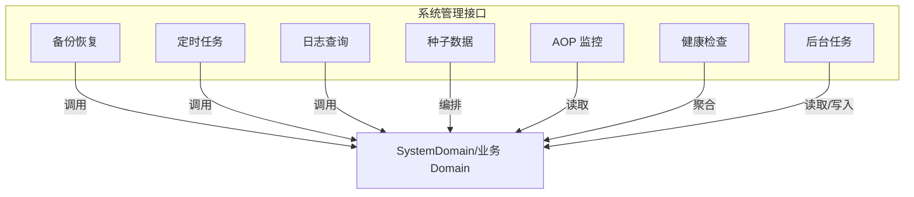
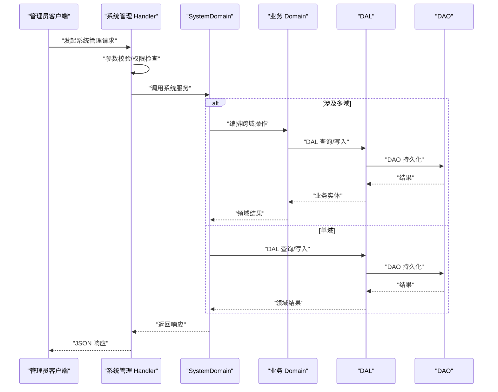
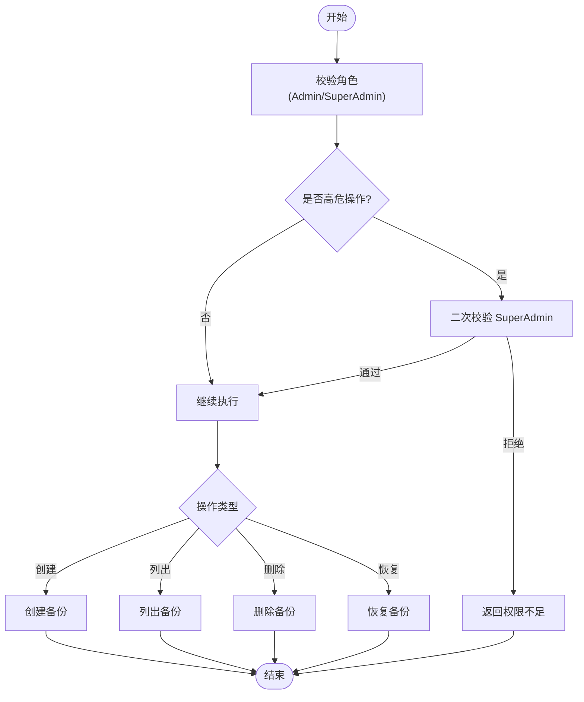
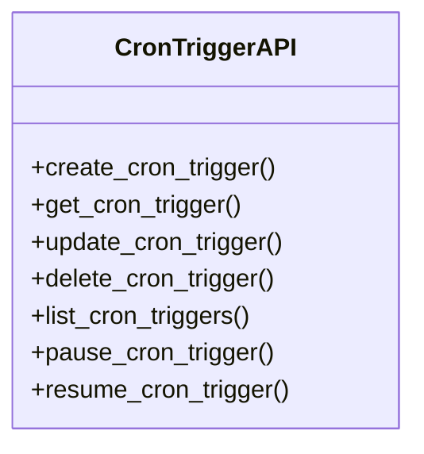
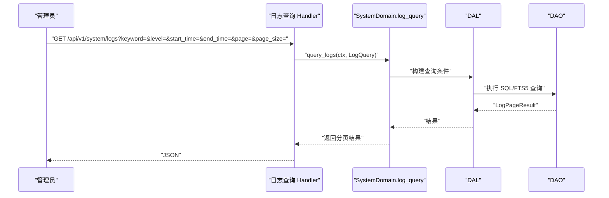
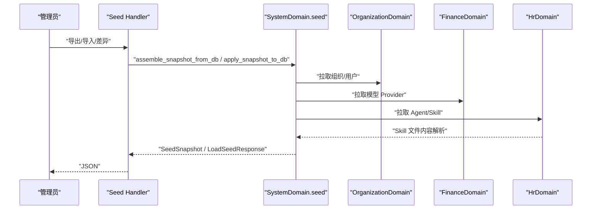
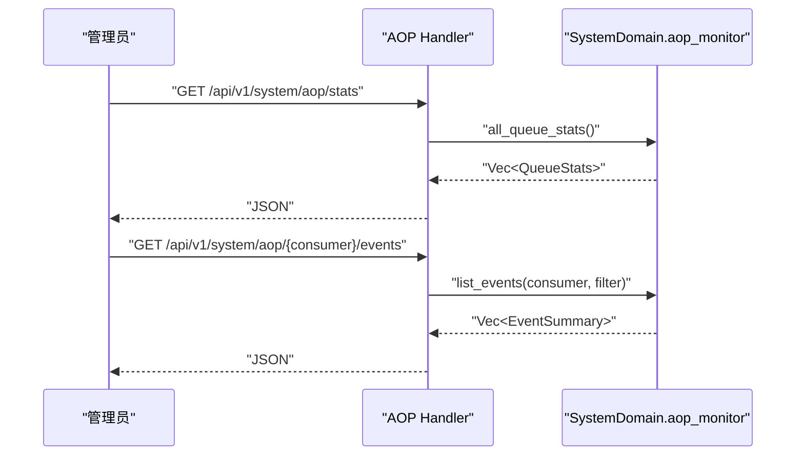
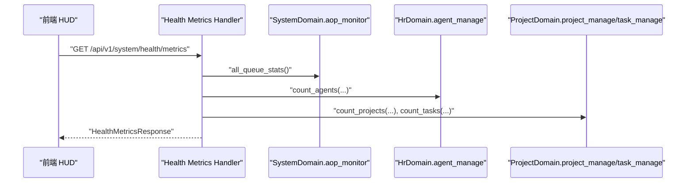
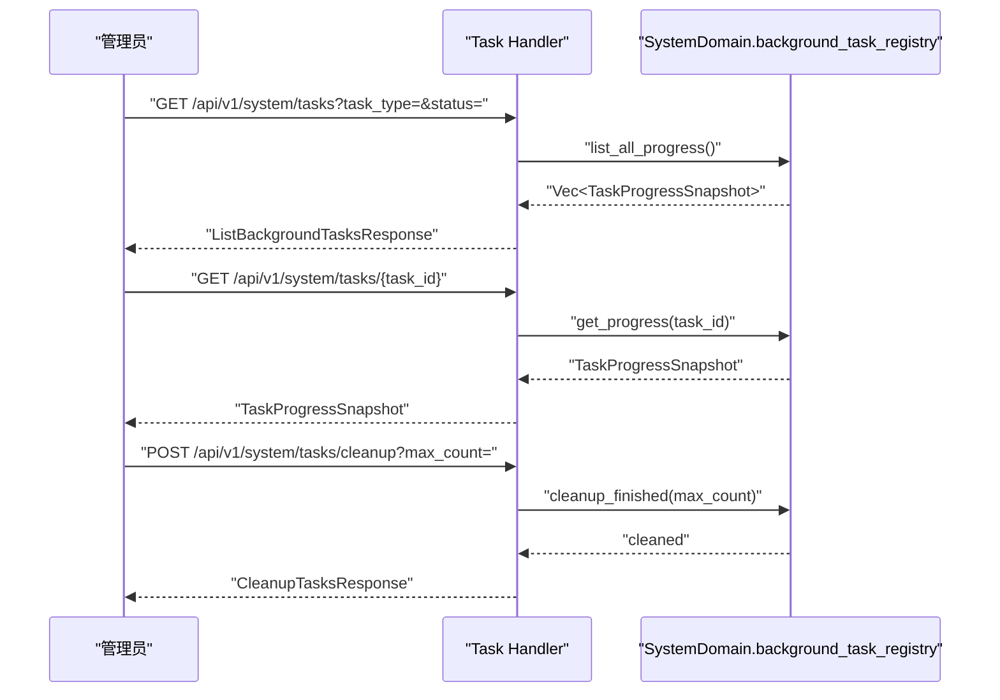
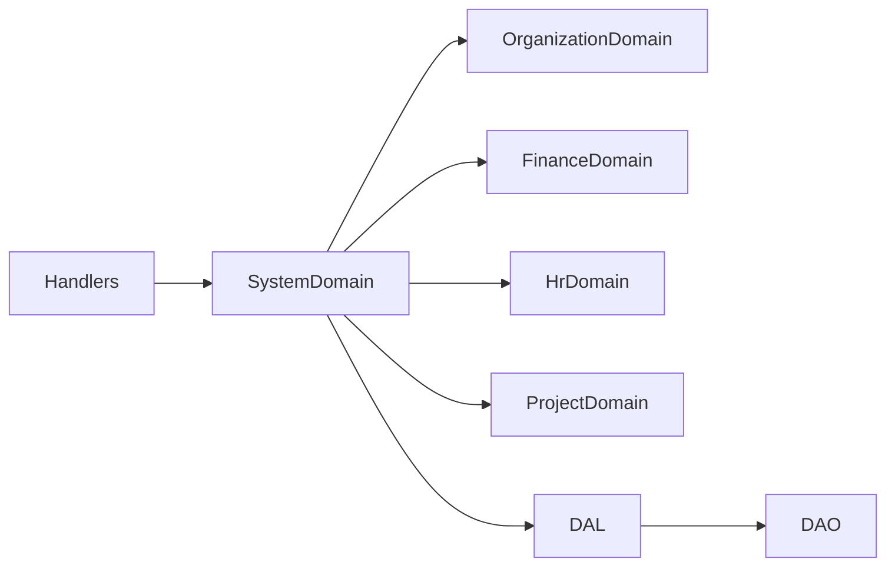

# 系统管理模块 API

<cite>
**本文引用的文件**
- [src/handlers/system/mod.rs](file://src/handlers/system/mod.rs)
- [src/handlers/system/backup/mod.rs](file://src/handlers/system/backup/mod.rs)
- [src/handlers/system/cron_trigger/mod.rs](file://src/handlers/system/cron_trigger/mod.rs)
- [src/handlers/system/logs/query_logs.rs](file://src/handlers/system/logs/query_logs.rs)
- [src/handlers/system/logs/log_stats.rs](file://src/handlers/system/logs/log_stats.rs)
- [src/handlers/system/seed/mod.rs](file://src/handlers/system/seed/mod.rs)
- [src/handlers/system/aop.rs](file://src/handlers/system/aop.rs)
- [src/handlers/system/health_metrics.rs](file://src/handlers/system/health_metrics.rs)
- [src/handlers/system/task_list.rs](file://src/handlers/system/task_list.rs)
- [src/handlers/system/task_cleanup.rs](file://src/handlers/system/task_cleanup.rs)
- [src/handlers/system/task_progress.rs](file://src/handlers/system/task_progress.rs)
- [common/src/api/system.rs](file://common/src/api/system.rs)
</cite>

## 目录
1. [简介](#简介)
2. [项目结构](#项目结构)
3. [核心组件](#核心组件)
4. [架构总览](#架构总览)
5. [详细组件分析](#详细组件分析)
6. [依赖关系分析](#依赖关系分析)
7. [性能考量](#性能考量)
8. [故障排查指南](#故障排查指南)
9. [结论](#结论)
10. [附录](#附录)

## 简介
本文件面向 AI Orz 的系统管理模块 API，覆盖备份恢复、定时任务、日志查询、种子数据管理、AOP 监控与健康检查等运维相关能力。文档从系统维护、监控指标、性能分析、管理员权限控制、系统配置与故障排查等维度进行系统化说明，并提供端到端示例路径，帮助管理员高效完成日常运维与排障。

## 项目结构
系统管理模块位于 handlers/system 下，按功能域拆分：
- 备份恢复：backup（创建、列出、删除、恢复）
- 定时任务：cron_trigger（CRUD、暂停/恢复）
- 日志查询：logs（日志检索、级别分布与时序统计）
- 种子数据：seed（导出/导入/差异对比/默认值应用）
- AOP 监控：aop（队列统计、事件列表与详情）
- 健康检查：health_metrics（聚合指标）
- 后台任务：task_list / task_progress / task_cleanup（任务列表、进度、清理）

**图示来源**
- [src/handlers/system/mod.rs:1-12](file://src/handlers/system/mod.rs#L1-L12)

**章节来源**
- [src/handlers/system/mod.rs:1-12](file://src/handlers/system/mod.rs#L1-L12)

## 核心组件
- 备份恢复：提供创建、列出、删除、恢复备份的接口；高危操作二次校验 SuperAdmin。
- 定时任务：对 Cron Trigger 进行增删改查、暂停/恢复，便于自动化调度管理。
- 日志查询：支持关键字、ID、级别、时间范围分页查询；提供级别分布与时序统计。
- 种子数据：支持从当前 DB 导出快照、加载并应用到目标环境，含差异对比与敏感字段处理。
- AOP 监控：查看各消费者队列积压、事件列表与详情，辅助定位消费瓶颈。
- 健康检查：聚合后端在线状态、AOP 队列、Agent/Project/Task 计数与运行时长。
- 后台任务：统一的任务进度查询、列表筛选与已完成任务清理。

**章节来源**
- [src/handlers/system/backup/mod.rs:19-32](file://src/handlers/system/backup/mod.rs#L19-L32)
- [src/handlers/system/cron_trigger/mod.rs:1-21](file://src/handlers/system/cron_trigger/mod.rs#L1-L21)
- [src/handlers/system/logs/query_logs.rs:1-29](file://src/handlers/system/logs/query_logs.rs#L1-L29)
- [src/handlers/system/logs/log_stats.rs:1-76](file://src/handlers/system/logs/log_stats.rs#L1-L76)
- [src/handlers/system/seed/mod.rs:1-675](file://src/handlers/system/seed/mod.rs#L1-L675)
- [src/handlers/system/aop.rs:1-145](file://src/handlers/system/aop.rs#L1-L145)
- [src/handlers/system/health_metrics.rs:1-135](file://src/handlers/system/health_metrics.rs#L1-L135)
- [src/handlers/system/task_list.rs:1-41](file://src/handlers/system/task_list.rs#L1-L41)
- [src/handlers/system/task_cleanup.rs:1-48](file://src/handlers/system/task_cleanup.rs#L1-L48)
- [src/handlers/system/task_progress.rs:1-26](file://src/handlers/system/task_progress.rs#L1-L26)

## 架构总览
系统管理模块遵循四层单向调用：Adapter（HTTP Handler）→ Domain → DAL → DAO。Handler 仅做参数解析、权限校验与结果组装；具体逻辑委托给 SystemDomain 与各业务 Domain（组织、财务、HR 等）。DAL/DAO 负责持久化与查询。

**图示来源**
- [src/handlers/system/seed/mod.rs:273-409](file://src/handlers/system/seed/mod.rs#L273-L409)
- [src/handlers/system/seed/mod.rs:420-671](file://src/handlers/system/seed/mod.rs#L420-L671)

## 详细组件分析

### 备份恢复
- 能力：创建备份、列出备份、删除备份、恢复备份。
- 权限：路由层确保 Admin/SuperAdmin 可访问；handler 内部对高危操作二次校验 SuperAdmin。
- 典型流程：创建备份触发快照生成；恢复时按版本回滚数据。

**图示来源**
- [src/handlers/system/backup/mod.rs:19-32](file://src/handlers/system/backup/mod.rs#L19-L32)

**章节来源**
- [src/handlers/system/backup/mod.rs:1-33](file://src/handlers/system/backup/mod.rs#L1-L33)

### 定时任务（Cron Trigger）
- 能力：创建、获取、更新、删除、暂停、恢复定时任务；返回列表与响应 DTO。
- 用途：管理系统级或业务级周期性任务（如数据同步、清理、提醒）。

**图示来源**
- [src/handlers/system/cron_trigger/mod.rs:1-21](file://src/handlers/system/cron_trigger/mod.rs#L1-L21)

**章节来源**
- [src/handlers/system/cron_trigger/mod.rs:1-21](file://src/handlers/system/cron_trigger/mod.rs#L1-L21)

### 日志查询
- 查询日志：支持关键字、log_id、级别、起止时间、分页。
- 统计接口：日志级别分布、时序统计（默认最近 24 小时）。
- 权限：路由层要求 Admin/SuperAdmin。

**图示来源**
- [src/handlers/system/logs/query_logs.rs:1-29](file://src/handlers/system/logs/query_logs.rs#L1-L29)

**章节来源**
- [src/handlers/system/logs/query_logs.rs:1-29](file://src/handlers/system/logs/query_logs.rs#L1-L29)
- [src/handlers/system/logs/log_stats.rs:1-76](file://src/handlers/system/logs/log_stats.rs#L1-L76)

### 种子数据管理
- 导出快照：从当前 DB 组装 SeedSnapshot（组织、用户、模型 Provider、Agent、Skill），敏感字段占位。
- 导入应用：根据策略（PreserveIds/RegenerateIds/DryRun/SkipExisting）写入目标环境，支持进度回调。
- 差异对比：DryRun 模式计算 diff，统计新增/更新数量。
- 技能导入：动态解析文件内容（content > ref_path > url），限制大小与超时。

**图示来源**
- [src/handlers/system/seed/mod.rs:273-409](file://src/handlers/system/seed/mod.rs#L273-L409)
- [src/handlers/system/seed/mod.rs:420-671](file://src/handlers/system/seed/mod.rs#L420-L671)

**章节来源**
- [src/handlers/system/seed/mod.rs:1-675](file://src/handlers/system/seed/mod.rs#L1-L675)

### AOP 监控
- 队列统计：所有消费者队列的待处理/处理中数、排序键信息、最老事件年龄。
- 事件列表：按消费者、状态、排序键、分页查询事件摘要。
- 事件详情：查看事件 payload 预览。

**图示来源**
- [src/handlers/system/aop.rs:14-145](file://src/handlers/system/aop.rs#L14-L145)

**章节来源**
- [src/handlers/system/aop.rs:1-145](file://src/handlers/system/aop.rs#L1-L145)
- [common/src/api/system.rs:55-145](file://common/src/api/system.rs#L55-L145)

### 健康检查
- 聚合指标：后端在线、AOP 队列积压、活跃/总数 Agent、项目、任务、进程运行时长。
- 降级策略：部分维度在跨域成本高时可降级为 0。

**图示来源**
- [src/handlers/system/health_metrics.rs:33-135](file://src/handlers/system/health_metrics.rs#L33-L135)

**章节来源**
- [src/handlers/system/health_metrics.rs:1-135](file://src/handlers/system/health_metrics.rs#L1-L135)
- [common/src/api/system.rs:7-33](file://common/src/api/system.rs#L7-L33)

### 后台任务
- 列表：支持按 task_type 与 status 筛选，按 started_at 降序。
- 进度：统一接口按 task_id 查询进度快照。
- 清理：保留每个 task_type 最近 N 个已完成/失败任务，其余移除。

**图示来源**
- [src/handlers/system/task_list.rs:12-41](file://src/handlers/system/task_list.rs#L12-L41)
- [src/handlers/system/task_progress.rs:12-26](file://src/handlers/system/task_progress.rs#L12-L26)
- [src/handlers/system/task_cleanup.rs:12-48](file://src/handlers/system/task_cleanup.rs#L12-L48)

**章节来源**
- [src/handlers/system/task_list.rs:1-41](file://src/handlers/system/task_list.rs#L1-L41)
- [src/handlers/system/task_progress.rs:1-26](file://src/handlers/system/task_progress.rs#L1-L26)
- [src/handlers/system/task_cleanup.rs:1-48](file://src/handlers/system/task_cleanup.rs#L1-L48)

## 依赖关系分析
- Handler 层依赖 SystemDomain 与各业务 Domain（organization、finance、hr、project）。
- Domain 层通过 DAL 抽象数据库访问，DAO 实现具体存储（SQLite、DuckDB、LanceDB 等）。
- 公共 DTO 定义于 common/src/api/system.rs，保证前后端契约一致。

**图示来源**
- [src/handlers/system/seed/mod.rs:273-409](file://src/handlers/system/seed/mod.rs#L273-L409)
- [common/src/api/system.rs:1-239](file://common/src/api/system.rs#L1-L239)

**章节来源**
- [common/src/api/system.rs:1-239](file://common/src/api/system.rs#L1-L239)

## 性能考量
- 健康指标聚合：避免前端并发多域请求，集中一次聚合，降低网络开销。
- 日志统计：默认最近 24 小时窗口，减少扫描范围；可按需调整起止时间。
- AOP 监控：限制事件列表 limit（最大 1000），防止大结果集拖慢响应。
- 种子导入：支持 DryRun 先计算差异，再决定是否写入；敏感字段按需注入，避免不必要 I/O。
- 后台任务清理：按 task_type 保留最近 N 条，控制内存与存储占用。

[本节为通用指导，不直接分析具体文件]

## 故障排查指南
- 权限问题：确认路由层 require_role_middleware 已启用；高危操作需 SuperAdmin 二次校验。
- 队列积压：通过 AOP 监控查看 pending/in_progress 与最老事件年龄，定位消费者瓶颈。
- 日志异常：使用日志级别分布与时序统计快速发现错误峰值；结合关键字过滤定位问题上下文。
- 种子导入失败：优先 DryRun 查看 diff；检查敏感字段是否补齐；注意 SkipExisting 策略下的跳过计数。
- 任务堆积：使用任务列表筛选未完成任务；必要时执行清理以释放资源。

**章节来源**
- [src/handlers/system/backup/mod.rs:19-32](file://src/handlers/system/backup/mod.rs#L19-L32)
- [src/handlers/system/aop.rs:73-145](file://src/handlers/system/aop.rs#L73-L145)
- [src/handlers/system/logs/log_stats.rs:25-76](file://src/handlers/system/logs/log_stats.rs#L25-L76)
- [src/handlers/system/seed/mod.rs:420-480](file://src/handlers/system/seed/mod.rs#L420-L480)
- [src/handlers/system/task_cleanup.rs:12-48](file://src/handlers/system/task_cleanup.rs#L12-L48)

## 结论
系统管理模块提供了完整的运维能力矩阵：备份恢复保障数据安全，定时任务支撑自动化，日志查询与 AOP 监控助力排障，种子数据管理简化环境迁移，健康检查与后台任务提升可观测性与稳定性。遵循四层单向调用与权限控制规范，可在复杂多 Agent 协作环境中保持高可用与易维护性。

[本节为总结，不直接分析具体文件]

## 附录
- 常用接口路径参考：
  - 健康检查：GET /api/v1/system/health/metrics
  - AOP 队列统计：GET /api/v1/system/aop/stats
  - AOP 事件列表：GET /api/v1/system/aop/{consumer}/events
  - 日志查询：GET /api/v1/system/logs
  - 日志统计：GET /api/v1/system/logs/stats/level-distribution | time-series
  - 种子数据：导出/导入/差异对比（见 seed handler）
  - 后台任务：列表/进度/清理（见 task handlers）

[本节为概览，不直接分析具体文件]