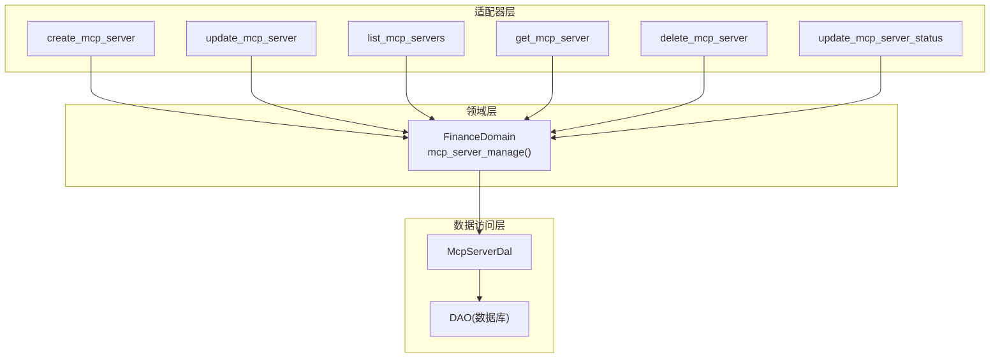
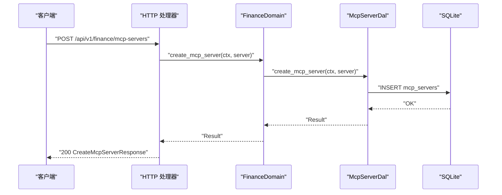
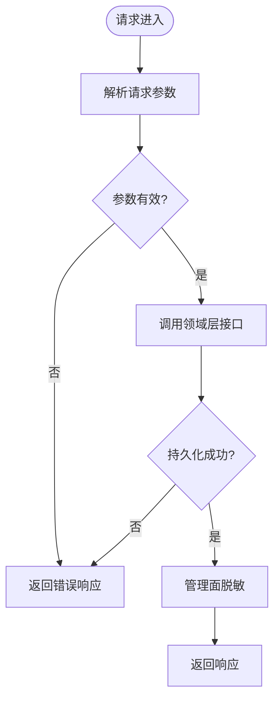
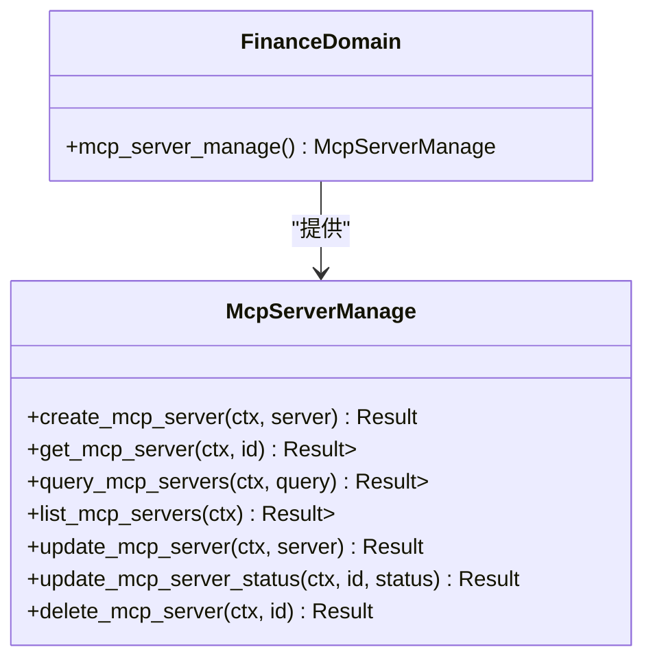
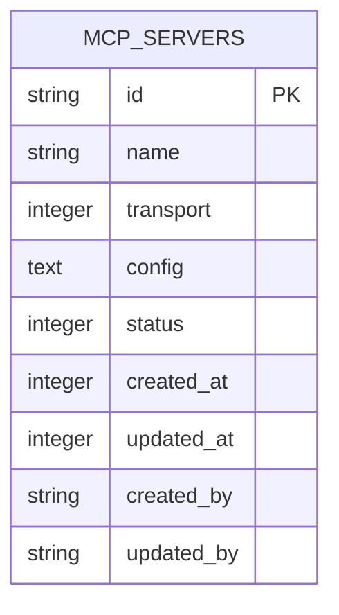
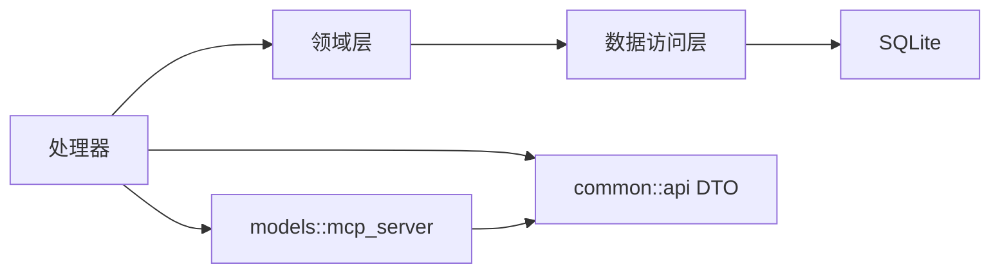

# MCP 服务器管理 API

<cite>
**本文引用的文件**
- [src/handlers/finance/mcp_server/mod.rs](file://src/handlers/finance/mcp_server/mod.rs)
- [src/handlers/finance/mcp_server/create_mcp_server.rs](file://src/handlers/finance/mcp_server/create_mcp_server.rs)
- [src/handlers/finance/mcp_server/update_mcp_server.rs](file://src/handlers/finance/mcp_server/update_mcp_server.rs)
- [src/handlers/finance/mcp_server/list_mcp_servers.rs](file://src/handlers/finance/mcp_server/list_mcp_servers.rs)
- [src/handlers/finance/mcp_server/get_mcp_server.rs](file://src/handlers/finance/mcp_server/get_mcp_server.rs)
- [src/handlers/finance/mcp_server/delete_mcp_server.rs](file://src/handlers/finance/mcp_server/delete_mcp_server.rs)
- [src/handlers/finance/mcp_server/update_mcp_server_status.rs](file://src/handlers/finance/mcp_server/update_mcp_server_status.rs)
- [src/handlers/finance/mcp_server/response.rs](file://src/handlers/finance/mcp_server/response.rs)
- [common/src/api/mcp_server.rs](file://common/src/api/mcp_server.rs)
- [src/models/mcp_server.rs](file://src/models/mcp_server.rs)
- [src/service/domain/finance/mod.rs](file://src/service/domain/finance/mod.rs)
- [migrations/20260623000000_mcp_servers.sql](file://migrations/20260623000000_mcp_servers.sql)
</cite>

## 目录
1. [简介](#简介)
2. [项目结构](#项目结构)
3. [核心组件](#核心组件)
4. [架构总览](#架构总览)
5. [详细组件分析](#详细组件分析)
6. [依赖关系分析](#依赖关系分析)
7. [性能与可用性](#性能与可用性)
8. [故障排查指南](#故障排查指南)
9. [结论](#结论)
10. [附录：API 参考与配置示例](#附录api-参考与配置示例)

## 简介
本文件为 MCP（Model Context Protocol）服务器管理 API 的完整技术文档，覆盖创建、配置、状态管理、连接测试、健康检查等能力，并给出配置示例与排障指南。系统遵循严格的四层单向调用：Adapter（HTTP Handler / 公开回调 Handler / AOP Producer）→ Domain → DAL → DAO，禁止跨层调用与同层互调；Domain 输入输出使用业务实体与内部事件；DAL/DAO 内部使用 PO 对象且不暴露到上层。

## 项目结构
MCP 服务器管理相关代码按“处理器（Handler）—领域（Domain）—数据访问（DAL/DAO）”分层组织，DTO 定义在 common 模块中供前后端共享。

图表来源
- [src/handlers/finance/mcp_server/mod.rs:1-24](file://src/handlers/finance/mcp_server/mod.rs#L1-L24)
- [src/service/domain/finance/mod.rs:92-115](file://src/service/domain/finance/mod.rs#L92-L115)

章节来源
- [src/handlers/finance/mcp_server/mod.rs:1-24](file://src/handlers/finance/mcp_server/mod.rs#L1-L24)
- [src/service/domain/finance/mod.rs:92-115](file://src/service/domain/finance/mod.rs#L92-L115)

## 核心组件
- HTTP 处理器（Adapter）：每个方法一个文件，负责参数校验、上下文提取、调用领域层、转换响应。
- 领域层（Domain）：聚合财务领域子能力，提供 McpServerManage 接口，封装业务规则与事务边界。
- 数据访问层（DAL/DAO）：持久化 MCP Server 配置与状态，使用 SQLx + SQLite，查询结果以业务实体返回。
- DTO 与模型：
  - common::api 中的请求/响应 DTO，用于 API 契约。
  - models::mcp_server 中的传输类型、状态枚举、配置结构与持久化对象。

章节来源
- [common/src/api/mcp_server.rs:10-179](file://common/src/api/mcp_server.rs#L10-L179)
- [src/models/mcp_server.rs:17-322](file://src/models/mcp_server.rs#L17-L322)
- [src/service/domain/finance/mod.rs:293-342](file://src/service/domain/finance/mod.rs#L293-L342)

## 架构总览
MCP 服务器管理采用标准 REST 风格接口，通过 Axum 路由注册处理器，处理器调用 FinanceDomain 的 mcp_server_manage 子域，再经由 DAL 完成持久化。所有敏感配置在管理面展示时进行脱敏处理。

图表来源
- [src/handlers/finance/mcp_server/create_mcp_server.rs:14-47](file://src/handlers/finance/mcp_server/create_mcp_server.rs#L14-L47)
- [src/service/domain/finance/mod.rs:293-342](file://src/service/domain/finance/mod.rs#L293-L342)

## 详细组件分析

### 处理器层：MCP 服务器 CRUD 与状态更新
- 创建服务器：POST /api/v1/finance/mcp-servers
  - 从请求体构造业务实体，调用领域层创建后读取详情并返回管理安全脱敏后的配置。
- 获取服务器：GET /api/v1/finance/mcp-servers/{id}
  - 根据 ID 获取并返回管理安全脱敏后的详情。
- 列表查询：GET /api/v1/finance/mcp-servers
  - 支持按 id、name、transport、status 过滤，统一分页参数。
- 更新服务器：PUT /api/v1/finance/mcp-servers/{id}
  - 支持部分更新 name、transport、config；config 中的敏感字段在管理面展示时脱敏。
- 删除服务器：DELETE /api/v1/finance/mcp-servers/{id}
  - 软删除，将状态置为 Deleted。
- 状态更新：PUT /api/v1/finance/mcp-servers/{id}/status
  - 仅允许启用/禁用；删除请使用 DELETE。

图表来源
- [src/handlers/finance/mcp_server/create_mcp_server.rs:14-47](file://src/handlers/finance/mcp_server/create_mcp_server.rs#L14-L47)
- [src/handlers/finance/mcp_server/update_mcp_server.rs:12-55](file://src/handlers/finance/mcp_server/update_mcp_server.rs#L12-L55)
- [src/handlers/finance/mcp_server/list_mcp_servers.rs:13-44](file://src/handlers/finance/mcp_server/list_mcp_servers.rs#L13-L44)
- [src/handlers/finance/mcp_server/get_mcp_server.rs:12-33](file://src/handlers/finance/mcp_server/get_mcp_server.rs#L12-L33)
- [src/handlers/finance/mcp_server/delete_mcp_server.rs:10-28](file://src/handlers/finance/mcp_server/delete_mcp_server.rs#L10-L28)
- [src/handlers/finance/mcp_server/update_mcp_server_status.rs:12-36](file://src/handlers/finance/mcp_server/update_mcp_server_status.rs#L12-L36)

章节来源
- [src/handlers/finance/mcp_server/create_mcp_server.rs:14-47](file://src/handlers/finance/mcp_server/create_mcp_server.rs#L14-L47)
- [src/handlers/finance/mcp_server/update_mcp_server.rs:12-55](file://src/handlers/finance/mcp_server/update_mcp_server.rs#L12-L55)
- [src/handlers/finance/mcp_server/list_mcp_servers.rs:13-44](file://src/handlers/finance/mcp_server/list_mcp_servers.rs#L13-L44)
- [src/handlers/finance/mcp_server/get_mcp_server.rs:12-33](file://src/handlers/finance/mcp_server/get_mcp_server.rs#L12-L33)
- [src/handlers/finance/mcp_server/delete_mcp_server.rs:10-28](file://src/handlers/finance/mcp_server/delete_mcp_server.rs#L10-L28)
- [src/handlers/finance/mcp_server/update_mcp_server_status.rs:12-36](file://src/handlers/finance/mcp_server/update_mcp_server_status.rs#L12-L36)

### 领域层：MCP 服务器管理能力
- 接口定义：McpServerManage 提供 create/get/query/list/update/status/delete 等方法。
- 单例模式：FinanceDomain 通过 OnceLock 维护全局实例，init() 时注入各 DAL。
- 职责边界：不直接操作数据库，仅协调 DAL 完成持久化与查询。

图表来源
- [src/service/domain/finance/mod.rs:92-115](file://src/service/domain/finance/mod.rs#L92-L115)
- [src/service/domain/finance/mod.rs:293-342](file://src/service/domain/finance/mod.rs#L293-L342)

章节来源
- [src/service/domain/finance/mod.rs:92-115](file://src/service/domain/finance/mod.rs#L92-L115)
- [src/service/domain/finance/mod.rs:293-342](file://src/service/domain/finance/mod.rs#L293-L342)

### 数据模型与配置
- 传输类型：stdio、streamable_http。
- 状态：Enabled、Disabled、Deleted（软删除）。
- 配置项：
  - stdio：command、args、env（显式环境变量，默认不继承进程环境）。
  - streamable_http：url、headers。
  - 通用：timeout_ms、connect_timeout_ms、response_max_bytes。
- 管理面脱敏：env、headers、url 在管理面展示时使用占位符替换，避免泄露敏感信息。

图表来源
- [migrations/20260623000000_mcp_servers.sql](file://migrations/20260623000000_mcp_servers.sql)
- [src/models/mcp_server.rs:17-322](file://src/models/mcp_server.rs#L17-L322)

章节来源
- [src/models/mcp_server.rs:17-322](file://src/models/mcp_server.rs#L17-L322)
- [common/src/api/mcp_server.rs:10-179](file://common/src/api/mcp_server.rs#L10-L179)

## 依赖关系分析
- 处理器依赖领域层：通过 domain().mcp_server_manage() 获取接口实现。
- 领域层依赖 DAL：DAL 封装具体数据库操作。
- DTO 与模型映射：response.rs 负责 API DTO 与模型之间的转换，包括传输类型与状态的映射。

图表来源
- [src/handlers/finance/mcp_server/response.rs:1-89](file://src/handlers/finance/mcp_server/response.rs#L1-L89)
- [src/service/domain/finance/mod.rs:293-342](file://src/service/domain/finance/mod.rs#L293-L342)

章节来源
- [src/handlers/finance/mcp_server/response.rs:1-89](file://src/handlers/finance/mcp_server/response.rs#L1-L89)
- [src/service/domain/finance/mod.rs:293-342](file://src/service/domain/finance/mod.rs#L293-L342)

## 性能与可用性
- 超时与大小限制：
  - timeout_ms：单次调用超时（毫秒），默认 30000。
  - connect_timeout_ms：连接建立超时（毫秒），默认 10000。
  - response_max_bytes：最大响应体大小（字节），默认 10MB。
- 连接池与并发：
  - 当前实现未内置连接池管理；若需高并发，建议在 DAL 层引入连接池或复用 HTTP 客户端连接。
- 健康检查：
  - 可通过 GET /api/v1/finance/mcp-servers/{id} 获取服务器详情，结合状态字段判断是否可用。
  - 对于 streamable_http，可结合外部探针验证 URL 可达性与鉴权头有效性。
- 负载均衡与故障转移：
  - 当前 API 未提供多实例负载均衡与自动故障转移；可在网关层或上游调度器实现。
- 认证方式：
  - 处理器通过 RequestContext 获取用户上下文；鉴权由中间件统一处理（如 JWT）。

[本节为通用指导，不直接分析具体文件]

## 故障排查指南
- 常见错误
  - 404 未找到：ID 不存在或已软删除。
  - 参数无效：transport、status、分页参数不符合约定。
  - 超时：timeout_ms/connect_timeout_ms 设置过小或远端服务不可达。
  - 响应过大：response_max_bytes 限制导致截断或拒绝。
- 排查步骤
  - 确认请求路径与方法正确。
  - 检查 transport 与 config 是否匹配（stdio 需要 command/args/env；streamable_http 需要 url/headers）。
  - 查看日志中的错误码与堆栈，定位 DAL/DAO 层异常。
  - 对 streamable_http，验证 URL 可达性与鉴权头是否正确。
- 恢复建议
  - 调整超时与大小限制以适应实际负载。
  - 对敏感配置使用环境变量注入，避免硬编码。
  - 定期备份数据库，防止误删。

章节来源
- [src/handlers/finance/mcp_server/get_mcp_server.rs:12-33](file://src/handlers/finance/mcp_server/get_mcp_server.rs#L12-L33)
- [src/handlers/finance/mcp_server/update_mcp_server.rs:12-55](file://src/handlers/finance/mcp_server/update_mcp_server.rs#L12-L55)
- [src/models/mcp_server.rs:125-167](file://src/models/mcp_server.rs#L125-L167)

## 结论
MCP 服务器管理 API 提供了完整的 CRUD 与状态管理能力，支持 stdio 与 streamable_http 两种传输方式，并在管理面进行敏感配置脱敏。系统遵循清晰的分层架构与单向依赖，便于扩展与维护。未来可在 DAL 层引入连接池、在网关层实现负载均衡与健康检查，以提升高可用性与可扩展性。

[本节为总结，不直接分析具体文件]

## 附录：API 参考与配置示例

### 接口清单
- 创建 MCP 服务器
  - 方法：POST
  - 路径：/api/v1/finance/mcp-servers
  - 请求体：CreateMcpServerRequest
  - 响应：CreateMcpServerResponse
- 获取 MCP 服务器
  - 方法：GET
  - 路径：/api/v1/finance/mcp-servers/{id}
  - 响应：GetMcpServerResponse
- 列表查询 MCP 服务器
  - 方法：GET
  - 路径：/api/v1/finance/mcp-servers
  - 查询参数：id、name、transport、status、分页参数
  - 响应：ListMcpServersResponse
- 更新 MCP 服务器
  - 方法：PUT
  - 路径：/api/v1/finance/mcp-servers/{id}
  - 请求体：UpdateMcpServerRequest
  - 响应：UpdateMcpServerResponse
- 删除 MCP 服务器
  - 方法：DELETE
  - 路径：/api/v1/finance/mcp-servers/{id}
  - 响应：DeleteMcpServerResponse
- 更新 MCP 服务器状态
  - 方法：PUT
  - 路径：/api/v1/finance/mcp-servers/{id}/status
  - 请求体：UpdateMcpServerStatusRequest
  - 响应：UpdateMcpServerStatusResponse

章节来源
- [common/src/api/mcp_server.rs:34-179](file://common/src/api/mcp_server.rs#L34-L179)
- [src/handlers/finance/mcp_server/mod.rs:1-24](file://src/handlers/finance/mcp_server/mod.rs#L1-L24)

### 配置项说明
- 传输类型
  - stdio：适用于本地进程调用，需提供 command、args、env。
  - streamable_http：适用于远程 HTTP 服务，需提供 url、headers。
- 通用配置
  - timeout_ms：调用超时（毫秒）。
  - connect_timeout_ms：连接超时（毫秒）。
  - response_max_bytes：最大响应体大小（字节）。
- 安全与脱敏
  - env、headers、url 在管理面展示时会被脱敏，避免泄露敏感信息。

章节来源
- [src/models/mcp_server.rs:97-167](file://src/models/mcp_server.rs#L97-L167)
- [src/handlers/finance/mcp_server/response.rs:34-58](file://src/handlers/finance/mcp_server/response.rs#L34-L58)

### 配置示例（文本描述）
- stdio 示例
  - name：本地工具服务器
  - transport：stdio
  - config：
    - command：/usr/local/bin/mcp-server
    - args：["--mode", "fast"]
    - env：{"API_KEY": "环境变量值"}
    - timeout_ms：30000
    - connect_timeout_ms：10000
    - response_max_bytes：10485760
- streamable_http 示例
  - name：远程 MCP 服务
  - transport：streamable_http
  - config：
    - url：https://mcp.example.com/api
    - headers：{"Authorization": "Bearer token"}
    - timeout_ms：30000
    - connect_timeout_ms：10000
    - response_max_bytes：10485760

[本节为概念性示例，不直接分析具体文件]