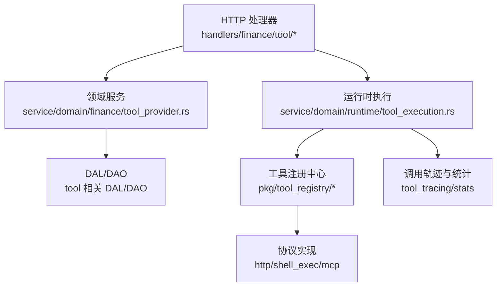
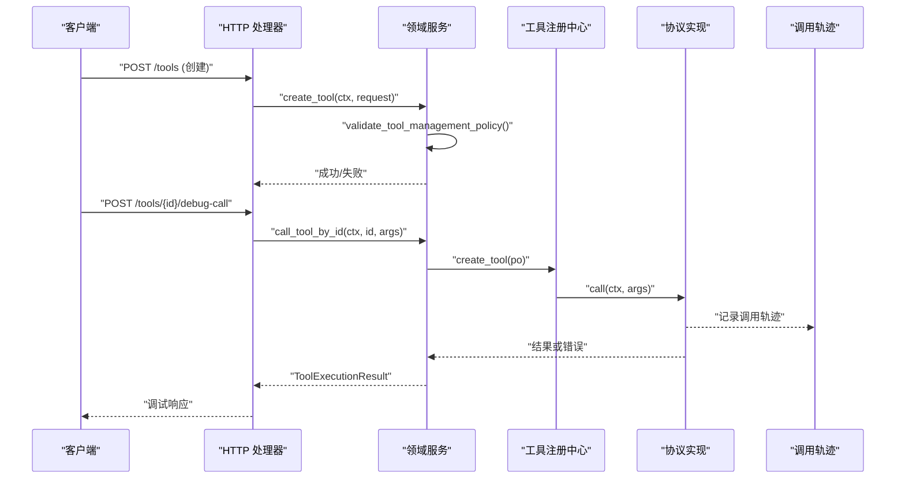
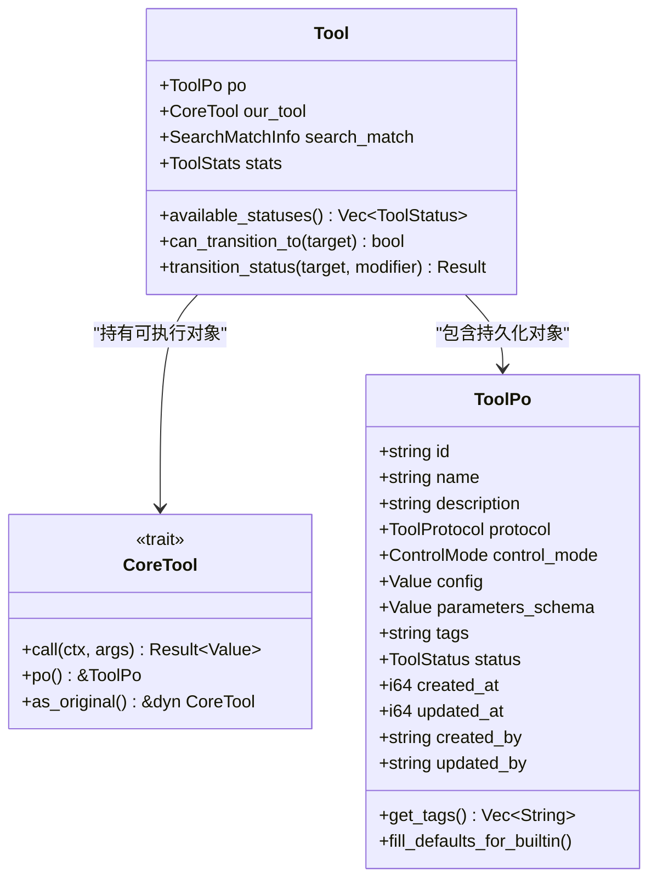
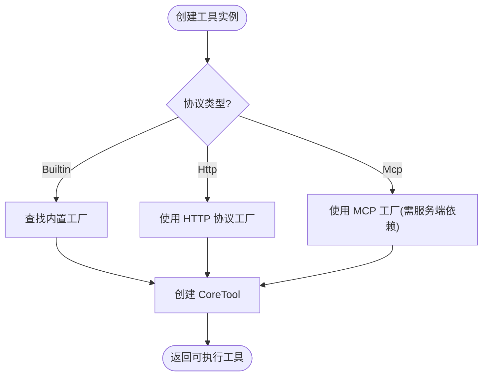
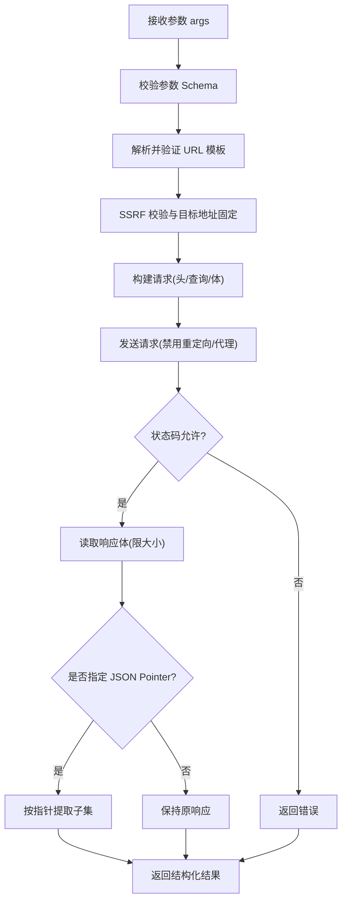
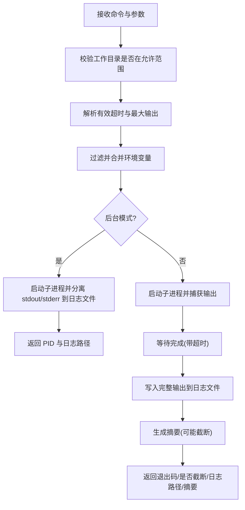
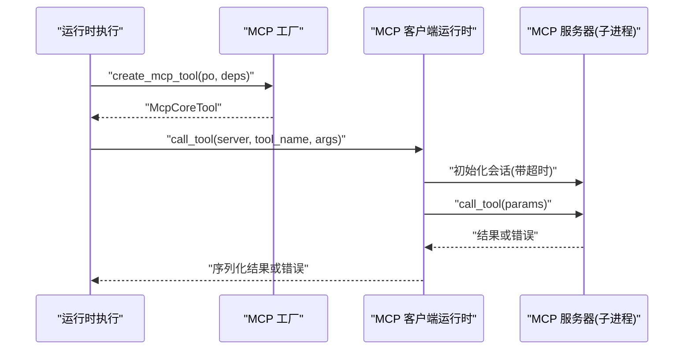
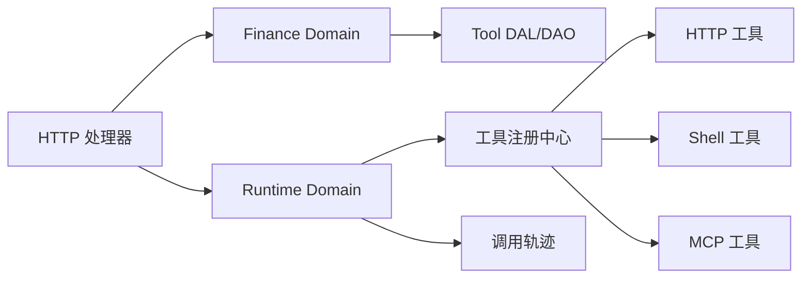

# 工具管理 API

<cite>
**本文引用的文件**
- [common/src/api/tool.rs](file://common/src/api/tool.rs)
- [src/handlers/finance/tool/mod.rs](file://src/handlers/finance/tool/mod.rs)
- [src/handlers/finance/tool/create_tool.rs](file://src/handlers/finance/tool/create_tool.rs)
- [src/handlers/finance/tool/debug_call_tool.rs](file://src/handlers/finance/tool/debug_call_tool.rs)
- [src/pkg/tool_registry/mod.rs](file://src/pkg/tool_registry/mod.rs)
- [src/pkg/tool_registry/builtin.rs](file://src/pkg/tool_registry/builtin.rs)
- [src/pkg/tool_registry/http.rs](file://src/pkg/tool_registry/http.rs)
- [src/pkg/tool_registry/shell_exec.rs](file://src/pkg/tool_registry/shell_exec.rs)
- [src/pkg/tool_registry/mcp.rs](file://src/pkg/tool_registry/mcp.rs)
- [src/service/domain/finance/tool_provider.rs](file://src/service/domain/finance/tool_provider.rs)
- [src/service/domain/runtime/tool_execution.rs](file://src/service/domain/runtime/tool_execution.rs)
- [src/models/tool.rs](file://src/models/tool.rs)
</cite>

## 目录
1. [简介](#简介)
2. [项目结构](#项目结构)
3. [核心组件](#核心组件)
4. [架构总览](#架构总览)
5. [详细组件分析](#详细组件分析)
6. [依赖关系分析](#依赖关系分析)
7. [性能与可靠性](#性能与可靠性)
8. [故障排查指南](#故障排查指南)
9. [结论](#结论)
10. [附录：API 参考](#附录api-参考)

## 简介
本文件面向“工具管理 API”，覆盖工具的创建、配置、绑定、执行、调试等接口，并说明工具注册发现、权限控制、执行上下文、结果缓存、错误重试、异步执行、性能分析与工具链编排等企业级能力。系统采用严格四层单向调用：Adapter（HTTP Handler / 公开回调）→ Domain → DAL → DAO；通用基础设施工具统一在 pkg 层实现，无业务感知。

## 项目结构
围绕工具管理的代码分布在以下层次：
- Adapter 层（HTTP Handler）：定义 REST 接口与请求/响应 DTO，负责鉴权、参数校验与路由到领域服务。
- Domain 层：封装工具提供与管理策略、运行时执行策略、授权与状态检查。
- DAL/DAO 层：持久化工具元数据、绑定关系、调用轨迹与统计。
- pkg 层：工具注册中心、协议实现（内置 HTTP/Shell/MCP）、安全校验、追踪与统计。

图表来源
- [src/handlers/finance/tool/mod.rs:1-46](file://src/handlers/finance/tool/mod.rs#L1-L46)
- [src/service/domain/finance/tool_provider.rs:1-166](file://src/service/domain/finance/tool_provider.rs#L1-L166)
- [src/service/domain/runtime/tool_execution.rs:1-219](file://src/service/domain/runtime/tool_execution.rs#L1-L219)
- [src/pkg/tool_registry/mod.rs:1-132](file://src/pkg/tool_registry/mod.rs#L1-L132)

章节来源
- [src/handlers/finance/tool/mod.rs:1-46](file://src/handlers/finance/tool/mod.rs#L1-L46)
- [src/service/domain/finance/tool_provider.rs:1-166](file://src/service/domain/finance/tool_provider.rs#L1-L166)
- [src/service/domain/runtime/tool_execution.rs:1-219](file://src/service/domain/runtime/tool_execution.rs#L1-L219)
- [src/pkg/tool_registry/mod.rs:1-132](file://src/pkg/tool_registry/mod.rs#L1-L132)

## 核心组件
- 工具模型与实体：ToolPo（持久化对象）、Tool（完整实体，含可执行对象与可选统计/匹配信息）。
- 工具注册中心：全局注册表，按协议分发工厂，支持内置、HTTP、MCP 三类工具实例化。
- 协议实现：
  - HTTP 工具：基于数据库配置的模板化 HTTP 调用，包含 SSRF 防护、超时与响应大小限制、JSON Pointer 提取等。
  - Shell 工具：沙箱化命令执行，支持同步/后台模式、输出截断与日志落盘、环境变量白名单。
  - MCP 工具：通过 stdio 子进程与远程 MCP 服务器交互，支持工具列表与调用，带会话超时与关闭保护。
- 领域服务：
  - 工具提供管理：创建/更新/删除/查询/搜索/标签聚合/内置工具同步/Agent 绑定解绑。
  - 运行时执行：按协议路由执行、启用状态检查、手动工具授权、错误映射与轨迹返回。
- 适配器（Handler）：创建工具、调试调用、查询/搜索工具、绑定/解绑 Agent、查询调用轨迹等。

章节来源
- [src/models/tool.rs:1-314](file://src/models/tool.rs#L1-L314)
- [src/pkg/tool_registry/mod.rs:1-132](file://src/pkg/tool_registry/mod.rs#L1-L132)
- [src/pkg/tool_registry/http.rs:1-599](file://src/pkg/tool_registry/http.rs#L1-L599)
- [src/pkg/tool_registry/shell_exec.rs:1-490](file://src/pkg/tool_registry/shell_exec.rs#L1-L490)
- [src/pkg/tool_registry/mcp.rs:1-399](file://src/pkg/tool_registry/mcp.rs#L1-L399)
- [src/service/domain/finance/tool_provider.rs:1-166](file://src/service/domain/finance/tool_provider.rs#L1-L166)
- [src/service/domain/runtime/tool_execution.rs:1-219](file://src/service/domain/runtime/tool_execution.rs#L1-L219)
- [src/handlers/finance/tool/mod.rs:1-46](file://src/handlers/finance/tool/mod.rs#L1-L46)

## 架构总览
工具管理遵循“配置即工具”的设计：数据库中的 ToolPo 描述工具元数据与协议配置，注册中心根据协议类型将 ToolPo 转换为可执行的 CoreTool 实例。运行时执行器负责授权、状态检查、协议路由与轨迹记录。

图表来源
- [src/handlers/finance/tool/create_tool.rs:1-72](file://src/handlers/finance/tool/create_tool.rs#L1-L72)
- [src/handlers/finance/tool/debug_call_tool.rs:1-35](file://src/handlers/finance/tool/debug_call_tool.rs#L1-L35)
- [src/service/domain/finance/tool_provider.rs:1-166](file://src/service/domain/finance/tool_provider.rs#L1-L166)
- [src/service/domain/runtime/tool_execution.rs:1-219](file://src/service/domain/runtime/tool_execution.rs#L1-L219)
- [src/pkg/tool_registry/mod.rs:1-132](file://src/pkg/tool_registry/mod.rs#L1-L132)

## 详细组件分析

### 工具模型与实体
- ToolPo：存储工具 ID、名称、描述、协议类型、控制模式、配置 JSON、参数 Schema、标签、状态、时间戳与操作者。
- Tool：包装 ToolPo 与可执行对象，并可携带向量搜索匹配信息与统计数据。
- 状态迁移：仅允许在 Enabled/Disabled/Stale 之间按规则切换，Stale 由同步流程维护。

图表来源
- [src/models/tool.rs:1-314](file://src/models/tool.rs#L1-L314)

章节来源
- [src/models/tool.rs:1-314](file://src/models/tool.rs#L1-L314)

### 工具注册与发现
- 全局注册表：维护内置工具工厂、HTTP 协议工厂与 MCP 工具工厂；按协议分派 create_tool。
- 内置工具：预编译工具（如 http_fetch、fs_read、fs_write、shell_exec），通过工厂生成默认 ToolPo 并注册。
- HTTP 工具：以数据库配置驱动，构造 HttpCoreTool，支持模板渲染与安全校验。
- MCP 工具：以 ToolPo.config 绑定 server_id 与 tool_name，运行时加载 McpServerPo 与客户端运行时后执行。

图表来源
- [src/pkg/tool_registry/mod.rs:1-132](file://src/pkg/tool_registry/mod.rs#L1-L132)
- [src/pkg/tool_registry/builtin.rs:1-44](file://src/pkg/tool_registry/builtin.rs#L1-L44)
- [src/pkg/tool_registry/http.rs:1-599](file://src/pkg/tool_registry/http.rs#L1-L599)
- [src/pkg/tool_registry/mcp.rs:1-399](file://src/pkg/tool_registry/mcp.rs#L1-L399)

章节来源
- [src/pkg/tool_registry/mod.rs:1-132](file://src/pkg/tool_registry/mod.rs#L1-L132)
- [src/pkg/tool_registry/builtin.rs:1-44](file://src/pkg/tool_registry/builtin.rs#L1-L44)

### HTTP 工具
- 配置项：方法、URL 模板、头/查询/体模板、超时、最大响应字节、允许状态码、JSON Pointer、域名白/黑名单、本地网络访问开关。
- 安全：禁止重定向、禁用代理、目标地址解析固定、SSRF 防护、模板占位符校验、响应体大小限制。
- 执行：参数按 Schema 校验，模板渲染后发起请求，读取并解析响应，必要时按 JSON Pointer 提取子集。

图表来源
- [src/pkg/tool_registry/http.rs:1-599](file://src/pkg/tool_registry/http.rs#L1-L599)

章节来源
- [src/pkg/tool_registry/http.rs:1-599](file://src/pkg/tool_registry/http.rs#L1-L599)

### Shell 工具
- 配置项：默认超时、默认最大输出、额外允许路径、环境变量白名单。
- 执行：工作目录必须在允许范围内；支持同步等待与后台运行；输出超过阈值时写入日志文件并返回摘要；环境变量经白名单过滤与敏感词屏蔽。
- 安全：工作目录校验、环境变量白名单、敏感变量过滤、日志落盘隔离。

图表来源
- [src/pkg/tool_registry/shell_exec.rs:1-490](file://src/pkg/tool_registry/shell_exec.rs#L1-L490)

章节来源
- [src/pkg/tool_registry/shell_exec.rs:1-490](file://src/pkg/tool_registry/shell_exec.rs#L1-L490)

### MCP 工具
- 配置项：server_id、tool_name；服务器连接细节与凭据位于 McpServerPo.config，不重复存放于工具配置。
- 执行：通过 stdio 子进程与 MCP 服务器通信，支持 tools/list 与 call_tool；会话建立与调用均带超时；失败时标记服务器失效以便后续重试清理。
- 限制：Streamable HTTP 传输尚未实现。

图表来源
- [src/pkg/tool_registry/mcp.rs:1-399](file://src/pkg/tool_registry/mcp.rs#L1-L399)
- [src/service/domain/runtime/tool_execution.rs:1-219](file://src/service/domain/runtime/tool_execution.rs#L1-L219)

章节来源
- [src/pkg/tool_registry/mcp.rs:1-399](file://src/pkg/tool_registry/mcp.rs#L1-L399)
- [src/service/domain/runtime/tool_execution.rs:1-219](file://src/service/domain/runtime/tool_execution.rs#L1-L219)

### 领域服务：工具提供管理
- 创建/更新/删除/查询/搜索工具：包含策略校验（如 MCP 仅 Manual、HTTP 配置合法性）。
- 内置工具同步：将注册中心的内置工具写入数据库。
- Agent 绑定/解绑：校验 internal 标签工具不可绑定；支持获取 Agent 已绑定工具集合。
- 标签聚合：列出所有启用工具的 distinct tags。

章节来源
- [src/service/domain/finance/tool_provider.rs:1-166](file://src/service/domain/finance/tool_provider.rs#L1-L166)

### 领域服务：运行时执行
- 按协议路由：MCP 走 mcp_tool_dal；Builtin/Http 走 tool_dal。
- 启用状态检查：未启用的工具拒绝执行。
- 手动工具授权：先查绑定工具，再查 neural 标签或已安装工具包；非 Manual 工具拒绝手动调用。
- 错误映射：对 MCP 错误进行规范化提示，避免泄露底层细节。
- 轨迹返回：返回 ToolExecutionResult，包含真实 call_id 与 trace_ref。

章节来源
- [src/service/domain/runtime/tool_execution.rs:1-219](file://src/service/domain/runtime/tool_execution.rs#L1-L219)

### 适配器（HTTP 处理器）
- 创建工具：禁止创建内置工具；校验用户上下文；构造 ToolPo 并交由领域服务创建。
- 调试调用：管理员专用，直接调用 runtime::tool_execution.call_tool_by_id，跳过 Agent 授权。
- 其他处理器：查询/搜索工具、绑定/解绑、调用轨迹查询等（见模块导出）。

章节来源
- [src/handlers/finance/tool/mod.rs:1-46](file://src/handlers/finance/tool/mod.rs#L1-L46)
- [src/handlers/finance/tool/create_tool.rs:1-72](file://src/handlers/finance/tool/create_tool.rs#L1-L72)
- [src/handlers/finance/tool/debug_call_tool.rs:1-35](file://src/handlers/finance/tool/debug_call_tool.rs#L1-L35)

## 依赖关系分析
- Handler 依赖领域服务，领域服务依赖 DAL/DAO，DAL/DAO 依赖模型与工具注册中心。
- 工具注册中心依赖各协议实现；HTTP/Shell/MCP 各自实现安全与执行逻辑。
- 运行时执行依赖工具注册中心与调用轨迹记录。

图表来源
- [src/handlers/finance/tool/mod.rs:1-46](file://src/handlers/finance/tool/mod.rs#L1-L46)
- [src/service/domain/finance/tool_provider.rs:1-166](file://src/service/domain/finance/tool_provider.rs#L1-L166)
- [src/service/domain/runtime/tool_execution.rs:1-219](file://src/service/domain/runtime/tool_execution.rs#L1-L219)
- [src/pkg/tool_registry/mod.rs:1-132](file://src/pkg/tool_registry/mod.rs#L1-L132)

章节来源
- [src/handlers/finance/tool/mod.rs:1-46](file://src/handlers/finance/tool/mod.rs#L1-L46)
- [src/service/domain/finance/tool_provider.rs:1-166](file://src/service/domain/finance/tool_provider.rs#L1-L166)
- [src/service/domain/runtime/tool_execution.rs:1-219](file://src/service/domain/runtime/tool_execution.rs#L1-L219)
- [src/pkg/tool_registry/mod.rs:1-132](file://src/pkg/tool_registry/mod.rs#L1-L132)

## 性能与可靠性
- 超时与限流：HTTP 工具支持 per-tool 超时与响应大小限制；MCP 工具会话建立与调用均有超时；Shell 工具支持超时与输出大小限制。
- 资源保护：HTTP 禁用重定向与代理，目标地址固定；Shell 工作目录限制与环境变量白名单；MCP 子进程隔离。
- 轨迹与统计：每次工具调用生成轨迹条目，便于审计与性能分析；支持按 agent/project/task/tool 维度查询。
- 异步执行：Shell 工具支持后台模式，立即返回 PID 与日志路径；MCP 调用通过子进程异步执行。
- 错误重试：MCP 客户端运行时在失败时标记服务器失效，可在上层实现重试与降级策略；HTTP/Shell 可通过上层编排实现重试。
- 性能分析：结合调用轨迹与统计消费者，可评估工具耗时、成功率与错误分布。

[本节为通用指导，不直接分析具体文件]

## 故障排查指南
- 工具未找到：确认 tool_id 存在且状态为 Enabled；检查绑定关系与标签授权。
- 配置非法：HTTP 工具需满足方法/URL/模板/域名策略；MCP 工具需正确绑定 server_id 与 tool_name。
- 执行失败：查看调用轨迹与日志（Shell 工具输出落盘）；关注超时、SSRF 拦截、状态码不允许等错误。
- MCP 问题：确认子进程命令可执行、PATH 设置正确；会话初始化与调用超时需调整；Streamable HTTP 尚未实现。
- 权限问题：Manual 工具需显式授权；internal 标签工具不可绑定给 Agent；Admin 调试接口需管理员角色。

章节来源
- [src/service/domain/runtime/tool_execution.rs:1-219](file://src/service/domain/runtime/tool_execution.rs#L1-L219)
- [src/pkg/tool_registry/http.rs:1-599](file://src/pkg/tool_registry/http.rs#L1-L599)
- [src/pkg/tool_registry/shell_exec.rs:1-490](file://src/pkg/tool_registry/shell_exec.rs#L1-L490)
- [src/pkg/tool_registry/mcp.rs:1-399](file://src/pkg/tool_registry/mcp.rs#L1-L399)

## 结论
工具管理 API 通过“配置即工具”的注册中心机制，统一了内置、HTTP、Shell、MCP 等多类工具的创建、配置、绑定与执行。系统在安全、性能与可观测性方面提供了企业级保障：SSRF 防护、超时与大小限制、沙箱化执行、调用轨迹与统计、异步执行与错误重试。建议在生产环境中结合调用轨迹与统计进行持续优化，并通过领域服务编排实现复杂工具链与重试策略。

[本节为总结，不直接分析具体文件]

## 附录：API 参考
以下为工具管理相关接口的请求/响应结构与用途概览（以 DTO 定义为准）：
- 创建工具：CreateToolRequest/CreateToolResponse
- 获取工具：GetToolRequest/GetToolResponse（支持 with_stats 与统计时间范围）
- 更新工具：UpdateToolRequest/UpdateToolResponse
- 更新状态：UpdateToolStatusRequest/UpdateToolStatusResponse
- 删除工具：DeleteToolRequest/DeleteToolResponse
- 列表/搜索：ListToolsRequest/ListToolsResponse、SearchToolsRequest/SearchToolsResponse
- 标签聚合：ListToolTagsRequest/ListToolTagsResponse
- 绑定/解绑：BindToolToAgentRequest/Response、UnbindToolFromAgentRequest/Response
- 调试调用：DebugCallToolRequest/DebugCallToolResponse
- 调用轨迹：QueryToolCallEntriesRequest/Response、GetToolCallEntryRequest/Response

章节来源
- [common/src/api/tool.rs:1-430](file://common/src/api/tool.rs#L1-L430)