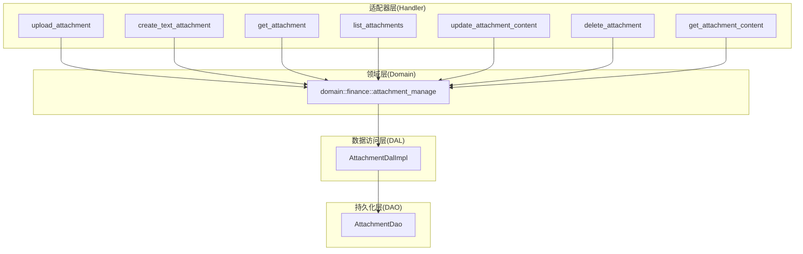
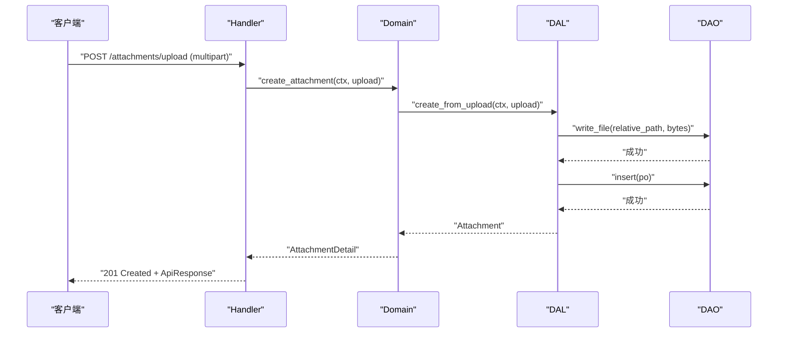
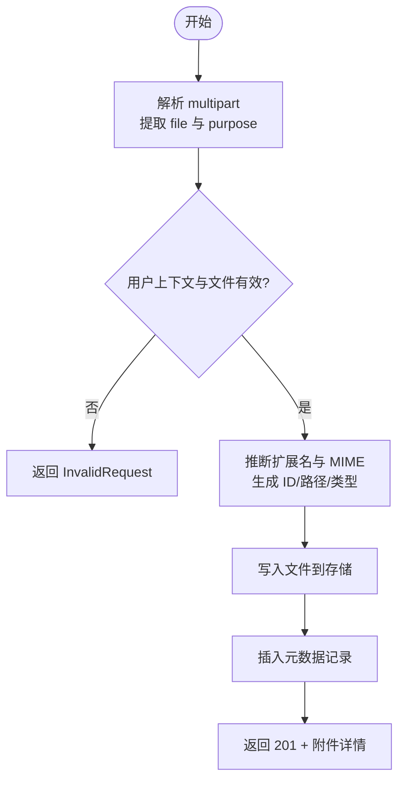
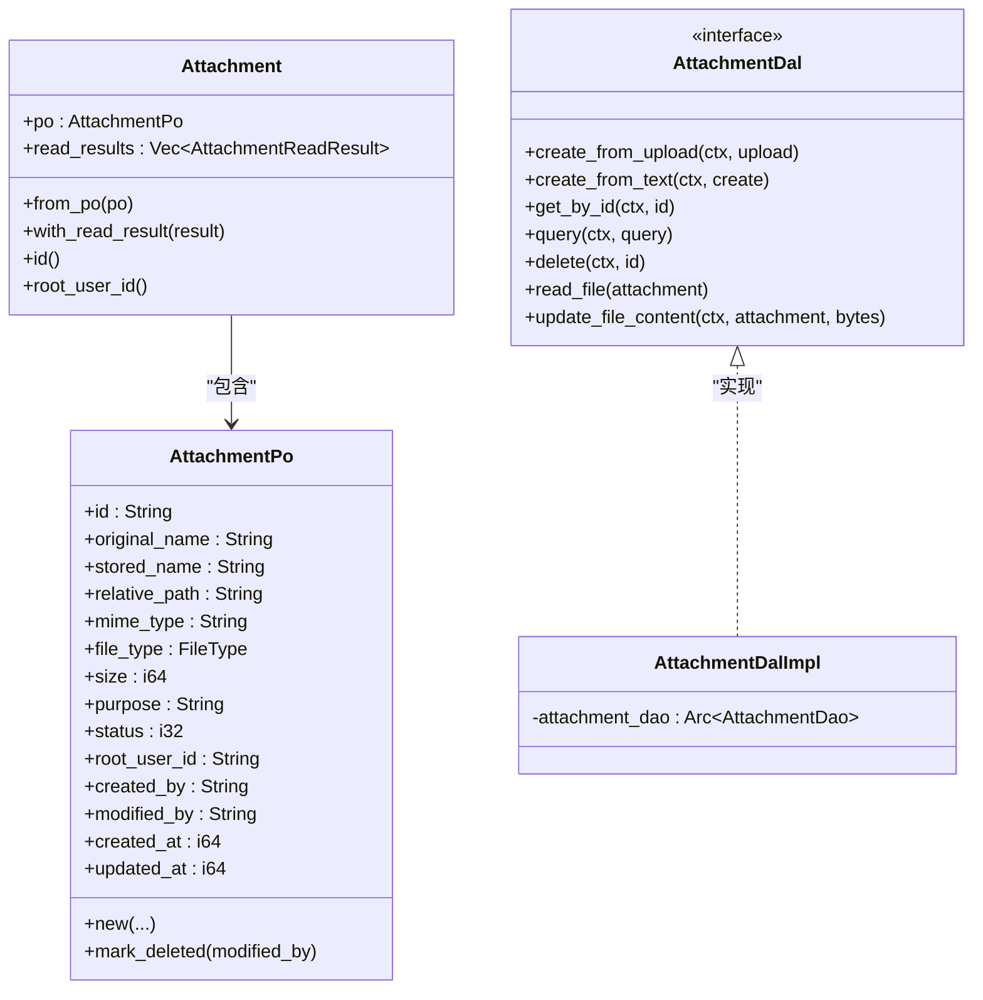

# 附件管理 API

<cite>
**本文引用的文件**
- [src/handlers/finance/attachment/mod.rs](file://src/handlers/finance/attachment/mod.rs)
- [src/handlers/finance/attachment/upload_attachment.rs](file://src/handlers/finance/attachment/upload_attachment.rs)
- [src/handlers/finance/attachment/get_attachment.rs](file://src/handlers/finance/attachment/get_attachment.rs)
- [src/handlers/finance/attachment/list_attachments.rs](file://src/handlers/finance/attachment/list_attachments.rs)
- [src/handlers/finance/attachment/create_text_attachment.rs](file://src/handlers/finance/attachment/create_text_attachment.rs)
- [src/handlers/finance/attachment/update_attachment_content.rs](file://src/handlers/finance/attachment/update_attachment_content.rs)
- [src/handlers/finance/attachment/delete_attachment.rs](file://src/handlers/finance/attachment/delete_attachment.rs)
- [src/handlers/finance/attachment/get_attachment_content.rs](file://src/handlers/finance/attachment/get_attachment_content.rs)
- [src/handlers/finance/attachment/response.rs](file://src/handlers/finance/attachment/response.rs)
- [src/models/attachment.rs](file://src/models/attachment.rs)
- [src/service/dal/attachment.rs](file://src/service/dal/attachment.rs)
- [common/src/enums/file.rs](file://common/src/enums/file.rs)
- [common/src/api/attachment.rs](file://common/src/api/attachment.rs)
</cite>

## 目录
1. [简介](#简介)
2. [项目结构](#项目结构)
3. [核心组件](#核心组件)
4. [架构总览](#架构总览)
5. [详细组件分析](#详细组件分析)
6. [依赖关系分析](#依赖关系分析)
7. [性能与容量建议](#性能与容量建议)
8. [故障排查指南](#故障排查指南)
9. [结论](#结论)
10. [附录：接口清单与示例](#附录接口清单与示例)

## 简介
本文件为“附件管理 API”的完整技术文档，覆盖文件上传、下载（文本内容读取）、列表查询、文本附件创建、内容更新与删除等能力。文档同时说明文件类型支持、大小限制、存储策略、MIME 类型处理、错误处理机制，并提供批量操作与异步进度跟踪的高级用法建议。

## 项目结构
附件管理采用四层单向调用：Adapter（HTTP Handler）→ Domain → DAL → DAO。Handler 负责解析请求、鉴权上下文与参数校验；Domain 编排业务规则；DAL 负责上传编排、文件名/路径生成、类型推断与元数据写入；DAO 负责持久化与文件系统读写。

图表来源
- [src/handlers/finance/attachment/upload_attachment.rs:17-82](file://src/handlers/finance/attachment/upload_attachment.rs#L17-L82)
- [src/handlers/finance/attachment/create_text_attachment.rs:13-45](file://src/handlers/finance/attachment/create_text_attachment.rs#L13-L45)
- [src/handlers/finance/attachment/get_attachment.rs:13-42](file://src/handlers/finance/attachment/get_attachment.rs#L13-L42)
- [src/handlers/finance/attachment/list_attachments.rs:13-45](file://src/handlers/finance/attachment/list_attachments.rs#L13-L45)
- [src/handlers/finance/attachment/update_attachment_content.rs:13-45](file://src/handlers/finance/attachment/update_attachment_content.rs#L13-L45)
- [src/handlers/finance/attachment/delete_attachment.rs:11-45](file://src/handlers/finance/attachment/delete_attachment.rs#L11-L45)
- [src/handlers/finance/attachment/get_attachment_content.rs:12-37](file://src/handlers/finance/attachment/get_attachment_content.rs#L12-L37)
- [src/service/dal/attachment.rs:45-85](file://src/service/dal/attachment.rs#L45-L85)

章节来源
- [src/handlers/finance/attachment/mod.rs:1-21](file://src/handlers/finance/attachment/mod.rs#L1-L21)

## 核心组件
- 模型与实体
  - AttachmentPo：持久化对象，包含 id、original_name、stored_name、relative_path、mime_type、file_type、size、purpose、status、root_user_id、created_by、modified_by、created_at、updated_at。
  - Attachment：业务实体，封装 PO 与可选的文件读取结果。
  - TextAttachmentCreate / TextContentUpdate：文本附件创建与内容更新的命令对象。
  - AttachmentReadResult：读取文件内容的结果载体。
- DAL 接口与实现
  - AttachmentDal：定义 create_from_upload、create_from_text、get_by_id、query、delete、read_file、update_file_content。
  - AttachmentDalImpl：实现上传编排、路径生成、类型推断、元数据写入与内容更新。
- Handler 集合
  - 上传、文本创建、详情获取、列表查询、内容更新、内容读取、删除。

章节来源
- [src/models/attachment.rs:9-117](file://src/models/attachment.rs#L9-L117)
- [src/service/dal/attachment.rs:45-85](file://src/service/dal/attachment.rs#L45-L85)

## 架构总览
附件管理遵循严格的分层与单向依赖：
- Adapter（Handler）：接收 HTTP 请求，提取 RequestContext，进行基础校验，调用 Domain。
- Domain：业务编排，持有 attachment_manage 入口，协调 DAL。
- DAL：统一上传流程、生成相对路径与扩展名、推断 MIME 与 FileType、写入文件与元数据。
- DAO：实际的文件系统读写与数据库操作。

图表来源
- [src/handlers/finance/attachment/upload_attachment.rs:17-82](file://src/handlers/finance/attachment/upload_attachment.rs#L17-L82)
- [src/service/dal/attachment.rs:96-134](file://src/service/dal/attachment.rs#L96-L134)

## 详细组件分析

### 上传附件（POST /attachments/upload）
- 功能：通过 multipart/form-data 上传二进制文件，可选 purpose 字段标记用途。
- 输入：
  - file：二进制文件流
  - purpose：字符串（可选）
- 输出：201 Created + ApiResponse<UploadAttachmentResponse>
- 行为要点：
  - 校验用户上下文与文件非空
  - 解析原始文件名与 MIME 类型
  - 生成 ID、扩展名、相对路径，推断 FileType
  - 写入文件并插入元数据
  - 返回附件详情

图表来源
- [src/handlers/finance/attachment/upload_attachment.rs:17-82](file://src/handlers/finance/attachment/upload_attachment.rs#L17-L82)
- [src/service/dal/attachment.rs:96-134](file://src/service/dal/attachment.rs#L96-L134)

章节来源
- [src/handlers/finance/attachment/upload_attachment.rs:17-82](file://src/handlers/finance/attachment/upload_attachment.rs#L17-L82)
- [src/service/dal/attachment.rs:96-134](file://src/service/dal/attachment.rs#L96-L134)

### 创建文本附件（POST /attachments/text）
- 功能：以 UTF-8 文本直接创建小型附件，自动推断或接受 MIME 类型。
- 输入：file_name、content、可选 mime_type、可选 purpose
- 输出：ApiResponse<CreateTextAttachmentResponse>
- 行为要点：
  - 若未提供 mime_type，则根据 file_name 后缀推断
  - 将文本转为字节后复用通用上传流程

章节来源
- [src/handlers/finance/attachment/create_text_attachment.rs:13-45](file://src/handlers/finance/attachment/create_text_attachment.rs#L13-L45)
- [src/service/dal/attachment.rs:136-151](file://src/service/dal/attachment.rs#L136-L151)

### 获取附件详情（GET /attachments/{id}）
- 功能：按 ID 获取附件元数据，仅允许所有者（root_user_id）访问。
- 输入：path 参数 id
- 输出：ApiResponse<GetAttachmentResponse>
- 行为要点：
  - 校验用户上下文
  - 查询并校验归属权限
  - 返回附件详情

章节来源
- [src/handlers/finance/attachment/get_attachment.rs:13-42](file://src/handlers/finance/attachment/get_attachment.rs#L13-L42)

### 列出附件（GET /attachments）
- 功能：分页列出当前用户的附件，支持按 purpose 与 file_type 过滤。
- 输入：purpose（可选）、file_type（可选）、pagination
- 输出：PagedResult<AttachmentDetail>
- 行为要点：
  - 基于当前用户 root_user_id 过滤
  - 透传分页参数至 DAL

章节来源
- [src/handlers/finance/attachment/list_attachments.rs:13-45](file://src/handlers/finance/attachment/list_attachments.rs#L13-L45)

### 读取文本内容（GET /attachments/{id}/content）
- 功能：读取附件的 UTF-8 文本内容与编码信息。
- 输入：path 参数 id
- 输出：ApiResponse<AttachmentContentResponse>
- 行为要点：
  - 校验用户上下文
  - 读取文本内容并返回元数据与内容

章节来源
- [src/handlers/finance/attachment/get_attachment_content.rs:12-37](file://src/handlers/finance/attachment/get_attachment_content.rs#L12-L37)

### 更新文本内容（PUT /attachments/{id}/content）
- 功能：全量替换附件的 UTF-8 文本内容，支持乐观锁（expected_updated_at）。
- 输入：id、content、可选 expected_updated_at
- 输出：ApiResponse<AttachmentContentResponse>
- 行为要点：
  - 校验用户上下文
  - 写入新内容并刷新元数据
  - 返回更新后的内容与时间戳

章节来源
- [src/handlers/finance/attachment/update_attachment_content.rs:13-45](file://src/handlers/finance/attachment/update_attachment_content.rs#L13-L45)
- [src/service/dal/attachment.rs:175-189](file://src/service/dal/attachment.rs#L175-L189)

### 删除附件（DELETE /attachments/{id}）
- 功能：软删除附件（仅修改状态），保留审计数据。
- 输入：path 参数 id
- 输出：EmptyResponse
- 行为要点：
  - 校验用户上下文与所有权
  - 执行软删除

章节来源
- [src/handlers/finance/attachment/delete_attachment.rs:11-45](file://src/handlers/finance/attachment/delete_attachment.rs#L11-L45)

## 依赖关系分析
- Handler 依赖 Domain 的 attachment_manage 入口，不直接访问 DAL/DAO。
- DAL 依赖 DAO 抽象，解耦具体存储实现。
- 模型层提供统一的业务实体与命令对象，避免 PO 泄露到上层。

图表来源
- [src/models/attachment.rs:9-117](file://src/models/attachment.rs#L9-L117)
- [src/service/dal/attachment.rs:45-92](file://src/service/dal/attachment.rs#L45-L92)

章节来源
- [src/models/attachment.rs:9-117](file://src/models/attachment.rs#L9-L117)
- [src/service/dal/attachment.rs:45-92](file://src/service/dal/attachment.rs#L45-L92)

## 性能与容量建议
- 文件大小限制
  - 建议在 Axum 层配置最大请求体大小，防止超大文件导致内存压力。
  - 对文本内容更新接口，可结合 expected_updated_at 做轻量级乐观锁，减少并发冲突。
- 存储策略
  - 相对路径按日期分片（YYYYMMDD/id.ext），有利于分布式存储与归档清理。
  - 建议配合对象存储（如 S3/OSS）与 CDN 加速静态资源访问。
- MIME 与类型推断
  - 上传时优先使用客户端提供的 MIME，服务端进行安全校验与规范化。
  - 文本附件默认推断为 text/plain，可通过 file_name 后缀提升准确性。
- 列表查询优化
  - 使用分页与索引字段（root_user_id、file_type、purpose）提升查询效率。
  - 前端按需加载，避免一次性拉取大量元数据。
- 批量操作
  - 当前接口为单条操作。批量上传可通过多次并行请求实现，注意限流与重试。
  - 批量删除建议使用事务或幂等接口，确保一致性。
- 异步与进度
  - 大文件上传建议拆分为分块上传，服务端维护任务 ID，前端轮询或 SSE 推送进度。
  - 可在 Domain/DAL 中引入后台任务队列，用于压缩、转码或索引构建。

[本节为通用指导，无需特定文件引用]

## 故障排查指南
- 常见错误
  - 缺少用户上下文：检查认证中间件是否正确注入 RequestContext。
  - 缺少 file 字段：确认 multipart 表单字段名为 file。
  - 解析失败：检查 Content-Type 与字段名称是否匹配。
  - 资源不存在：确认 ID 存在且属于当前用户。
- 定位方法
  - 查看 Handler 中的错误构造与返回码。
  - 检查 DAL 的 write_file/insert/update_file_metadata 调用链。
  - 核对相对路径与存储后端是否一致。
- 日志与监控
  - 在关键步骤记录用户 ID、文件尺寸、MIME、路径等信息。
  - 统计上传成功率、失败原因分布与平均耗时。

章节来源
- [src/handlers/finance/attachment/upload_attachment.rs:26-71](file://src/handlers/finance/attachment/upload_attachment.rs#L26-L71)
- [src/handlers/finance/attachment/get_attachment.rs:26-39](file://src/handlers/finance/attachment/get_attachment.rs#L26-L39)
- [src/handlers/finance/attachment/delete_attachment.rs:24-42](file://src/handlers/finance/attachment/delete_attachment.rs#L24-L42)

## 结论
附件管理 API 以清晰的分层与明确的职责边界实现了安全的文件上传、文本内容管理与查询能力。通过统一的 DAL 编排与稳健的错误处理，满足日常业务需求。建议在生产环境结合对象存储与 CDN 提升性能，并通过分块上传与任务队列支持大规模场景。

[本节为总结性内容，无需特定文件引用]

## 附录：接口清单与示例

### 接口清单
- POST /attachments/upload
  - 描述：上传二进制附件
  - 请求体：multipart/form-data，包含 file 与可选 purpose
  - 响应：201 Created + ApiResponse<UploadAttachmentResponse>
- POST /attachments/text
  - 描述：创建小型 UTF-8 文本附件
  - 请求体：JSON，包含 file_name、content、可选 mime_type、可选 purpose
  - 响应：ApiResponse<CreateTextAttachmentResponse>
- GET /attachments/{id}
  - 描述：获取附件详情（仅所有者）
  - 响应：ApiResponse<GetAttachmentResponse>
- GET /attachments
  - 描述：分页列出当前用户附件，支持 purpose、file_type 过滤
  - 响应：PagedResult<AttachmentDetail>
- GET /attachments/{id}/content
  - 描述：读取附件 UTF-8 文本内容
  - 响应：ApiResponse<AttachmentContentResponse>
- PUT /attachments/{id}/content
  - 描述：全量替换文本内容，支持 expected_updated_at 乐观锁
  - 响应：ApiResponse<AttachmentContentResponse>
- DELETE /attachments/{id}
  - 描述：软删除附件（仅所有者）
  - 响应：EmptyResponse

### 请求与响应示例（示意）
- 上传附件
  - 请求：multipart/form-data，file=...，purpose=report
  - 响应：{ code: 0, data: { id, original_name, stored_name, relative_path, mime_type, file_type, size, purpose, root_user_id, created_by, created_at, updated_at } }
- 创建文本附件
  - 请求：{ file_name: "notes.md", content: "# 笔记\n...", mime_type: "text/markdown", purpose: "doc" }
  - 响应：同上传附件详情
- 列表查询
  - 请求：?purpose=doc&file_type=document&page=1&per_page=20
  - 响应：{ total, page, per_page, items: [AttachmentDetail...] }
- 读取内容
  - 响应：{ attachment: AttachmentDetail, text: { content, encoding, size, updated_at } }
- 更新内容
  - 请求：{ id, content, expected_updated_at: 1710000000000 }
  - 响应：同读取内容
- 删除
  - 响应：{ code: 0 }

### 文件类型与 MIME 支持
- 支持的扩展名与 MIME 映射（推断）
  - 文本类：.md → text/markdown；.json → application/json；.yaml/.yml → application/yaml；.toml → application/toml；.csv → text/csv；其他 → text/plain
  - 图片类：image/png、image/jpeg、image/gif → .png/.jpg/.gif
  - 音频类：audio/mpeg、audio/wav → .mp3/.wav
  - 视频类：video/mp4 → .mp4
  - PDF：application/pdf → .pdf
- 文件类型枚举
  - Document、Image、Audio、Video、Binary（由 MIME 前缀或扩展名推断）

章节来源
- [src/service/dal/attachment.rs:198-277](file://src/service/dal/attachment.rs#L198-L277)
- [common/src/enums/file.rs:18-34](file://common/src/enums/file.rs#L18-L34)

### 高级用法示例
- 批量上传
  - 前端并行发起多个 POST /attachments/upload，控制并发度与重试策略。
  - 服务端可对每个请求独立处理，必要时加入限流与队列。
- 异步上传进度
  - 将大文件拆分为分块，每块上传后返回 chunkId 与进度。
  - 合并完成后返回最终附件 ID，前端通过轮询或 SSE 获取完成状态。
- 文本内容乐观锁
  - 更新时携带 expected_updated_at，避免并发覆盖。
  - 若冲突，返回相应错误码，提示前端重新拉取最新内容。

[本节为概念性示例，无需特定文件引用]