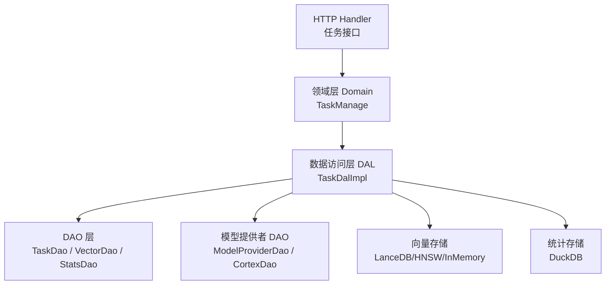
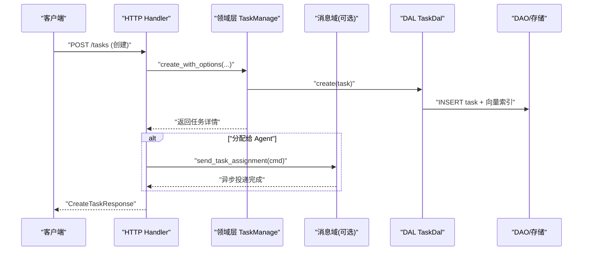
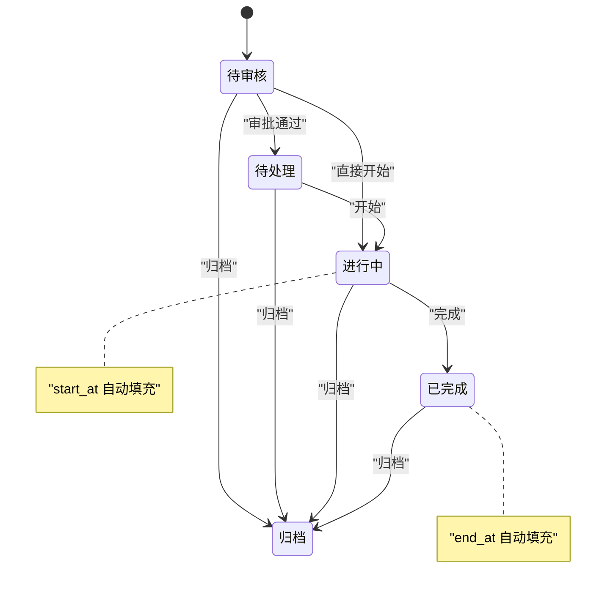
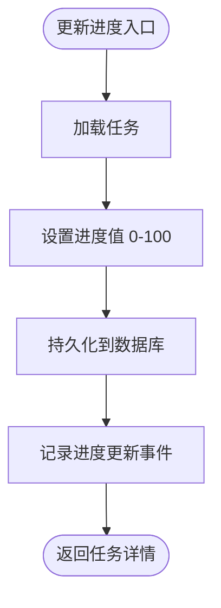
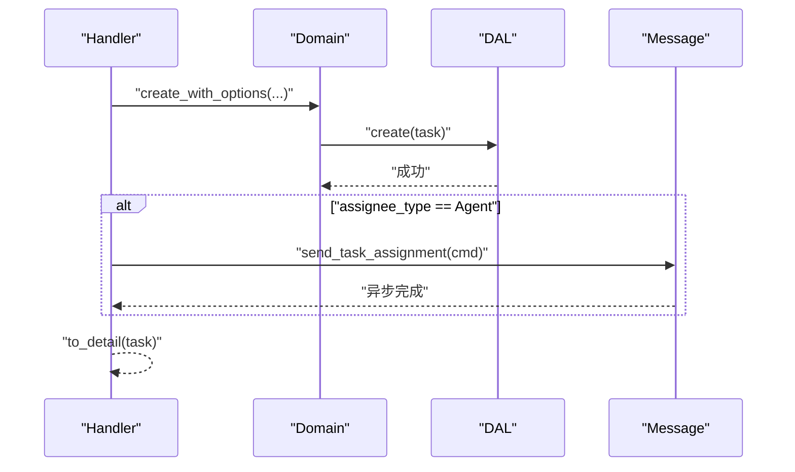
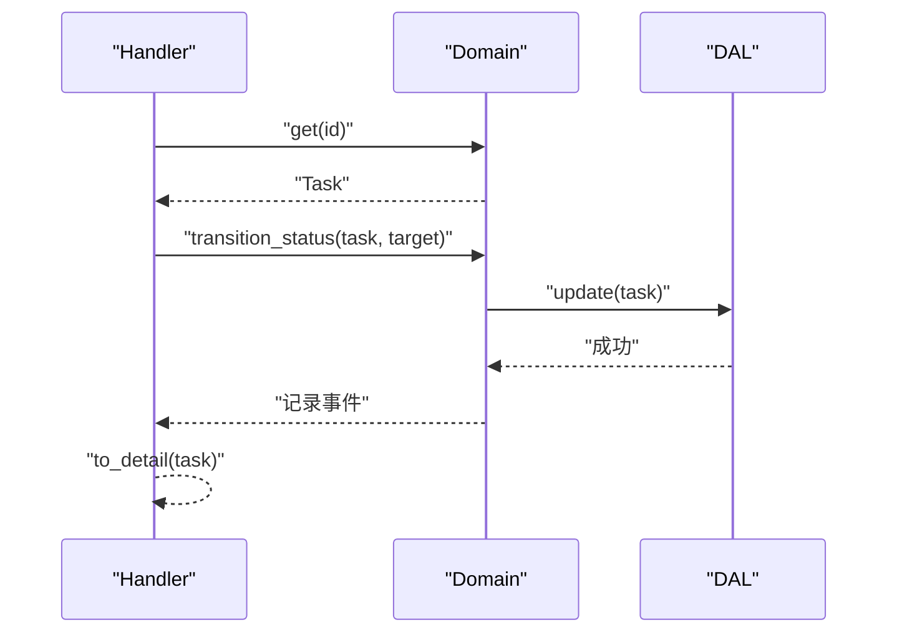
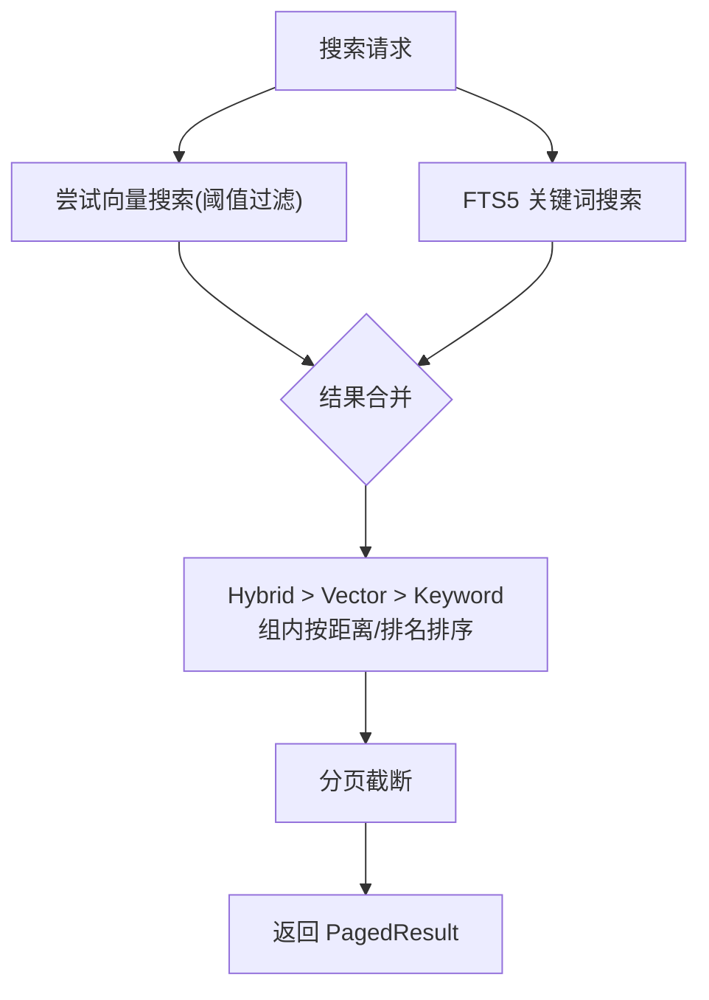
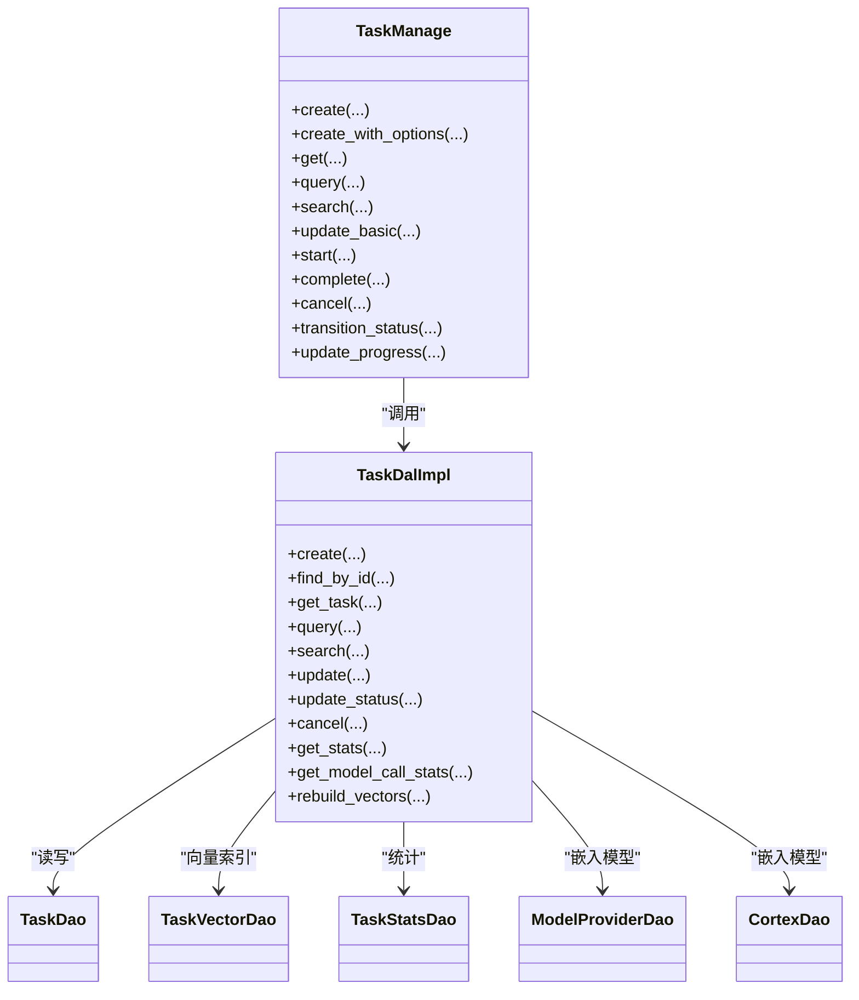

# 任务管理接口

<cite>
**本文引用的文件**
- [common/src/api/task.rs](file://common/src/api/task.rs)
- [common/src/enums/task.rs](file://common/src/enums/task.rs)
- [src/handlers/project/task/mod.rs](file://src/handlers/project/task/mod.rs)
- [src/handlers/project/task/create_task.rs](file://src/handlers/project/task/create_task.rs)
- [src/handlers/project/task/update_task_status.rs](file://src/handlers/project/task/update_task_status.rs)
- [src/handlers/project/task/update_task_progress.rs](file://src/handlers/project/task/update_task_progress.rs)
- [src/handlers/project/task/mark_done.rs](file://src/handlers/project/task/mark_done.rs)
- [src/service/domain/project/task.rs](file://src/service/domain/project/task.rs)
- [src/service/dal/task.rs](file://src/service/dal/task.rs)
- [migrations/20260712000002_task_progress.sql](file://migrations/20260712000002_task_progress.sql)
</cite>

## 目录
1. [简介](#简介)
2. [项目结构](#项目结构)
3. [核心组件](#核心组件)
4. [架构总览](#架构总览)
5. [详细组件分析](#详细组件分析)
6. [依赖关系分析](#依赖关系分析)
7. [性能与扩展性](#性能与扩展性)
8. [故障排查指南](#故障排查指南)
9. [结论](#结论)
10. [附录：完整示例](#附录完整示例)

## 简介
本文件为项目管理模块的“任务管理”接口提供完整技术文档，覆盖任务的创建、查询、更新、状态流转、进度跟踪、批量操作与复杂查询等全生命周期能力。文档同时说明任务实体结构、状态机设计、进度计算逻辑、搜索与统计集成点，并提供端到端使用示例（创建、流转、更新进度、完成标记）。

## 项目结构
任务管理采用严格四层单向调用：Adapter（HTTP Handler）→ Domain → DAL → DAO。Handler 负责参数校验与编排；Domain 实现业务规则（状态机、事件记录、聚合）；DAL 封装数据访问与混合搜索、统计、向量索引；DAO 负责具体存储（SQLite、DuckDB、向量库）。

图表来源
- [src/handlers/project/task/mod.rs:1-28](file://src/handlers/project/task/mod.rs#L1-L28)
- [src/service/domain/project/task.rs:18-526](file://src/service/domain/project/task.rs#L18-L526)
- [src/service/dal/task.rs:28-219](file://src/service/dal/task.rs#L28-L219)

章节来源
- [src/handlers/project/task/mod.rs:1-28](file://src/handlers/project/task/mod.rs#L1-L28)

## 核心组件
- API 请求/响应 DTO：定义在 common 层，供前后端共享。
- HTTP Handler：按方法粒度拆分，统一通过宏注册工具与路由。
- 领域层 TaskManage：实现任务创建、查询、更新、状态流转、进度更新、取消/完成等。
- 数据访问层 TaskDal：封装 SQLite CRUD、FTS5+向量混合搜索、统计获取、向量索引维护。
- 枚举与常量：任务状态、分配对象类型等。

章节来源
- [common/src/api/task.rs:1-299](file://common/src/api/task.rs#L1-L299)
- [common/src/enums/task.rs:1-100](file://common/src/enums/task.rs#L1-L100)
- [src/handlers/project/task/mod.rs:1-28](file://src/handlers/project/task/mod.rs#L1-L28)
- [src/service/domain/project/task.rs:18-526](file://src/service/domain/project/task.rs#L18-L526)
- [src/service/dal/task.rs:28-219](file://src/service/dal/task.rs#L28-L219)

## 架构总览
任务管理的典型调用链如下：
- 创建任务：Handler 校验参数 → Domain 创建并持久化 → 若分配给 Agent 则发送任务分配消息。
- 状态流转：Handler 读取任务 → Domain 校验状态机 → 持久化并记录事件。
- 进度更新：Handler 调用 Domain 更新进度 → 持久化并记录事件。
- 完成标记：Handler 调用 Domain 完成 → 持久化并记录事件。

图表来源
- [src/handlers/project/task/create_task.rs:1-86](file://src/handlers/project/task/create_task.rs#L1-L86)
- [src/service/domain/project/task.rs:51-109](file://src/service/domain/project/task.rs#L51-L109)
- [src/service/dal/task.rs:221-255](file://src/service/dal/task.rs#L221-L255)

## 详细组件分析

### 任务实体与数据结构
- 任务列表项 TaskListItem：包含 ID、标题、描述、状态、优先级、标签、根用户、分配对象、项目、思考深度、进度、时间戳、依赖等。
- 任务详情 GetTaskResponse：在基础字段上增加截止时间、开始/结束时间、依赖、创建/修改人、统计信息（TaskStats）、模型调用统计（ModelCallStats）、产物列表（ArtifactDetail）。
- 查询/搜索请求：支持按 ID 批量、关键词、项目、分配对象、状态列表、分页等条件；SearchTasksRequest 支持 FTS5+向量语义混合搜索。

章节来源
- [common/src/api/task.rs:100-299](file://common/src/api/task.rs#L100-L299)

### 状态机设计
- 状态枚举 TaskStatus：已取消、待审核、待处理、进行中、已完成、归档。
- 合法流转：
  - 待审核 → 待处理 / 进行中 / 归档
  - 待处理 → 进行中 / 归档
  - 进行中 → 已完成 / 归档
  - 已完成 → 归档
- 取消状态不允许通过通用状态接口设置，需走专用取消流程。
- 进入进行中时自动填充 start_at；进入已完成时自动填充 end_at。

图表来源
- [common/src/enums/task.rs:8-47](file://common/src/enums/task.rs#L8-L47)
- [src/service/domain/project/task.rs:394-482](file://src/service/domain/project/task.rs#L394-L482)

章节来源
- [common/src/enums/task.rs:8-47](file://common/src/enums/task.rs#L8-L47)
- [src/service/domain/project/task.rs:394-482](file://src/service/domain/project/task.rs#L394-L482)

### 进度计算与更新
- 进度字段 progress 范围 0-100，由 update_progress 接口更新。
- 更新后持久化并记录 progress_updated 事件。
- 进度与状态相互独立；完成标记会改变状态，但不强制同步进度为 100（由业务约定决定）。

图表来源
- [src/handlers/project/task/update_task_progress.rs:1-30](file://src/handlers/project/task/update_task_progress.rs#L1-L30)
- [src/service/domain/project/task.rs:484-524](file://src/service/domain/project/task.rs#L484-L524)

章节来源
- [src/handlers/project/task/update_task_progress.rs:1-30](file://src/handlers/project/task/update_task_progress.rs#L1-L30)
- [src/service/domain/project/task.rs:484-524](file://src/service/domain/project/task.rs#L484-L524)

### 任务创建与分配通知
- 创建任务时校验标题、分配对象等必填字段。
- 创建成功后，若分配给 Agent，则发送任务分配消息（由消息域负责投递）。
- 创建过程记录 created 事件。

图表来源
- [src/handlers/project/task/create_task.rs:1-86](file://src/handlers/project/task/create_task.rs#L1-L86)
- [src/service/domain/project/task.rs:51-109](file://src/service/domain/project/task.rs#L51-L109)

章节来源
- [src/handlers/project/task/create_task.rs:1-86](file://src/handlers/project/task/create_task.rs#L1-L86)
- [src/service/domain/project/task.rs:51-109](file://src/service/domain/project/task.rs#L51-L109)

### 状态流转接口
- 通过 update_task_status 进行状态变更，内部执行状态合法性校验。
- 禁止通过该接口设置为“已取消”，取消需走专用取消流程。
- 流转成功记录 status_changed 事件。

图表来源
- [src/handlers/project/task/update_task_status.rs:1-41](file://src/handlers/project/task/update_task_status.rs#L1-L41)
- [src/service/domain/project/task.rs:394-482](file://src/service/domain/project/task.rs#L394-L482)

章节来源
- [src/handlers/project/task/update_task_status.rs:1-41](file://src/handlers/project/task/update_task_status.rs#L1-L41)
- [src/service/domain/project/task.rs:394-482](file://src/service/domain/project/task.rs#L394-L482)

### 完成标记接口
- mark_done 将任务置为已完成，内部调用 complete 并记录 completed 事件。
- modified_by 由 RequestContext 提供或系统身份。

章节来源
- [src/handlers/project/task/mark_done.rs:1-40](file://src/handlers/project/task/mark_done.rs#L1-L40)
- [src/service/domain/project/task.rs:317-356](file://src/service/domain/project/task.rs#L317-L356)

### 查询与搜索
- 通用查询 query_tasks：支持按项目、分配对象、状态列表、分页等过滤。
- 搜索 search_tasks：FTS5 关键词 + 向量语义混合搜索，自动降级与去重排序。
- 列表接口：按 Agent/项目/全局列出任务，内置默认排序与排除策略。

图表来源
- [src/service/dal/task.rs:366-571](file://src/service/dal/task.rs#L366-L571)
- [common/src/api/task.rs:254-299](file://common/src/api/task.rs#L254-L299)

章节来源
- [src/service/dal/task.rs:366-571](file://src/service/dal/task.rs#L366-L571)
- [common/src/api/task.rs:254-299](file://common/src/api/task.rs#L254-L299)

### 批量操作
- 支持按 ids 批量查询（ids 字段），用于一次性拉取多个任务。
- 列表接口支持 limit 限制返回数量。
- 搜索接口返回分页结果，便于前端批量渲染。

章节来源
- [common/src/api/task.rs:254-299](file://common/src/api/task.rs#L254-L299)

## 依赖关系分析
- Handler 依赖 Domain 暴露的 TaskManage 接口。
- Domain 依赖 DAL（TaskDal）进行数据访问与聚合。
- DAL 组合多个 DAO：TaskDao（SQLite）、TaskVectorDao（向量库）、TaskStatsDao（DuckDB）、ModelProviderDao/CortexDao（嵌入模型）。
- 启动时初始化 DAL 单例，注册向量与统计子模块。

图表来源
- [src/service/domain/project/task.rs:18-526](file://src/service/domain/project/task.rs#L18-L526)
- [src/service/dal/task.rs:28-219](file://src/service/dal/task.rs#L28-L219)

章节来源
- [src/service/domain/project/task.rs:18-526](file://src/service/domain/project/task.rs#L18-L526)
- [src/service/dal/task.rs:28-219](file://src/service/dal/task.rs#L28-L219)

## 性能与扩展性
- 混合搜索：FTS5 关键词与向量语义合并，默认向量距离阈值 0.8，失败自动降级至纯关键词搜索。
- 向量索引：创建/更新任务时自动向量化，失败仅告警不阻塞主流程；取消任务时清理向量索引。
- 统计查询：通过 DuckDB 获取任务维度统计与模型调用统计，可按时间范围与粒度查询。
- 可扩展点：DAL 单例可替换不同 DAO 实现；向量后端支持 LanceDB/HNSW/InMemory 多后端；统计后端可替换。

章节来源
- [src/service/dal/task.rs:221-255](file://src/service/dal/task.rs#L221-L255)
- [src/service/dal/task.rs:366-571](file://src/service/dal/task.rs#L366-L571)
- [src/service/dal/task.rs:690-721](file://src/service/dal/task.rs#L690-L721)

## 故障排查指南
- 非法状态流转：当目标状态不符合状态机规则时会返回 InvalidRequest；请检查当前状态与目标状态是否允许。
- 取消状态限制：禁止通过状态接口设置为“已取消”，请使用专用取消流程。
- 向量搜索失败：日志中会出现“向量搜索失败，降级到关键词搜索”提示；不影响关键词搜索结果。
- 向量索引写入失败：创建/更新任务时若向量化失败，仅记录警告，主流程继续。
- 未找到任务：get/complete/start/cancel 等操作在未找到任务时返回 NotFound。

章节来源
- [src/service/domain/project/task.rs:394-482](file://src/service/domain/project/task.rs#L394-L482)
- [src/service/dal/task.rs:366-431](file://src/service/dal/task.rs#L366-L431)
- [src/service/dal/task.rs:221-255](file://src/service/dal/task.rs#L221-L255)

## 结论
任务管理接口围绕严格的分层架构与清晰的状态机设计，提供了完整的任务生命周期管理能力。通过混合搜索与统计集成，满足复杂查询与分析需求；通过向量索引与降级机制，保证高可用与鲁棒性。建议在实际使用中遵循状态机约束，合理使用批量与分页接口，并结合统计与产物信息提升可观测性与可维护性。

## 附录：完整示例
以下示例展示任务从创建到完成的完整流程，包括状态流转与进度更新。

- 创建任务
  - 请求体关键字段：title、description、priority、tags、root_user_id、assignee_type、assignee_id、project_id、due_at、dependencies。
  - 行为：创建任务并持久化；若分配给 Agent，发送任务分配消息。
  - 参考路径：[创建任务处理器:1-86](file://src/handlers/project/task/create_task.rs#L1-L86)、[领域创建:51-109](file://src/service/domain/project/task.rs#L51-L109)。

- 查询任务
  - 单个任务：GetTaskRequest 支持 with_stats、with_model_call_stats、stats_time_start/end、stats_interval、with_artifacts。
  - 列表/搜索：ListTasksRequest、SearchTasksRequest 支持 keyword、ids、project_id、assignee_type、assignee_id、status_in、分页。
  - 参考路径：[API 定义:38-299](file://common/src/api/task.rs#L38-L299)、[DAL 搜索:366-571](file://src/service/dal/task.rs#L366-L571)。

- 更新任务基本信息
  - 支持 title、description、priority、tags、due_at、dependencies、execution_plan、execution_result。
  - 参考路径：[领域更新:227-279](file://src/service/domain/project/task.rs#L227-L279)。

- 状态流转
  - 通过 UpdateTaskStatusRequest 指定目标状态；内部校验状态机并记录事件。
  - 参考路径：[状态更新处理器:1-41](file://src/handlers/project/task/update_task_status.rs#L1-L41)、[状态机实现:394-482](file://src/service/domain/project/task.rs#L394-L482)。

- 进度更新
  - 通过 UpdateTaskProgressRequest 设置 0-100 的进度；记录 progress_updated 事件。
  - 参考路径：[进度更新处理器:1-30](file://src/handlers/project/task/update_task_progress.rs#L1-L30)、[领域更新:484-524](file://src/service/domain/project/task.rs#L484-L524)。

- 完成标记
  - 通过 MarkDoneParams 指定 task_id；内部调用 complete 并记录 completed 事件。
  - 参考路径：[完成标记处理器:1-40](file://src/handlers/project/task/mark_done.rs#L1-L40)、[领域完成:317-356](file://src/service/domain/project/task.rs#L317-L356)。

- 状态机与进度字段
  - 状态枚举与转换：见 [任务状态枚举:8-47](file://common/src/enums/task.rs#L8-L47)。
  - 进度字段迁移：见 [任务进度迁移](file://migrations/20260712000002_task_progress.sql)。