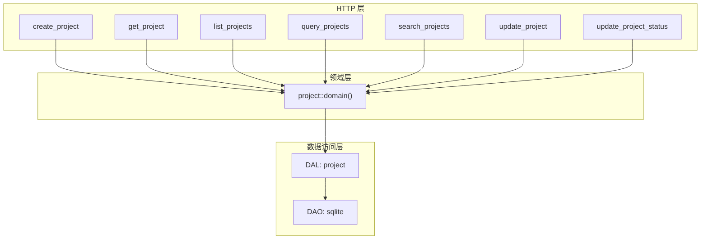
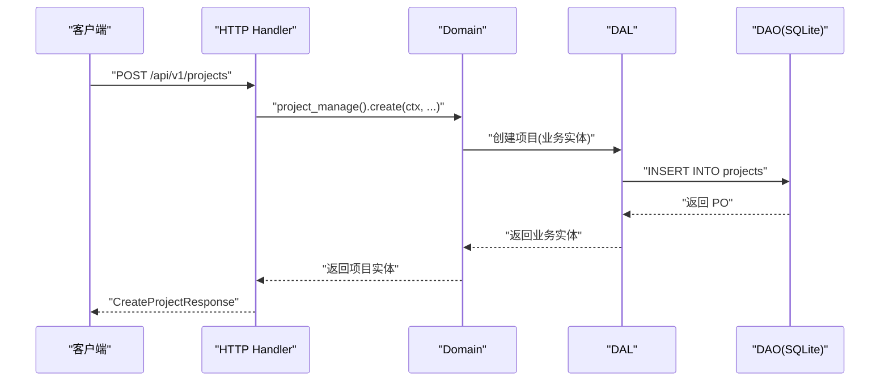
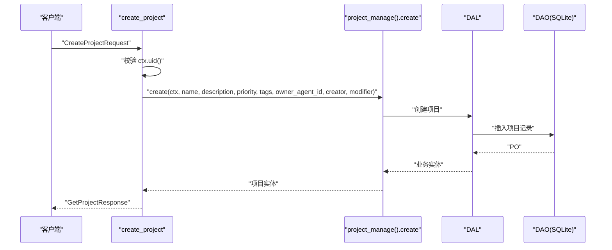
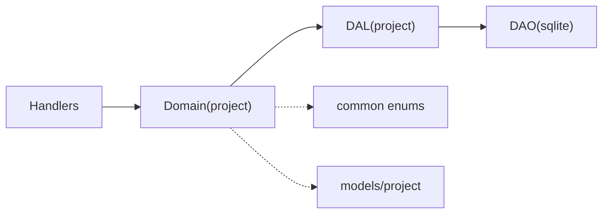

# 项目 CRUD 接口

<cite>
**本文引用的文件**
- [src/handlers/project/projects/mod.rs](file://src/handlers/project/projects/mod.rs)
- [src/handlers/project/projects/create_project.rs](file://src/handlers/project/projects/create_project.rs)
- [src/handlers/project/projects/get_project.rs](file://src/handlers/project/projects/get_project.rs)
- [src/handlers/project/projects/list_projects.rs](file://src/handlers/project/projects/list_projects.rs)
- [src/handlers/project/projects/query_projects.rs](file://src/handlers/project/projects/query_projects.rs)
- [src/handlers/project/projects/search_projects.rs](file://src/handlers/project/projects/search_projects.rs)
- [src/handlers/project/projects/update_project.rs](file://src/handlers/project/projects/update_project.rs)
- [src/handlers/project/projects/update_project_status.rs](file://src/handlers/project/projects/update_project_status.rs)
- [src/handlers/project/projects/response.rs](file://src/handlers/project/projects/response.rs)
- [common/src/api/project.rs](file://common/src/api/project.rs)
- [common/src/enums/project.rs](file://common/src/enums/project.rs)
- [src/models/project.rs](file://src/models/project.rs)
- [src/service/domain/project/service.rs](file://src/service/domain/project/service.rs)
- [src/service/dal/project.rs](file://src/service/dal/project.rs)
- [src/service/dao/project/sqlite.rs](file://src/service/dao/project/sqlite.rs)
</cite>

## 目录
1. [简介](#简介)
2. [项目结构](#项目结构)
3. [核心组件](#核心组件)
4. [架构总览](#架构总览)
5. [详细组件分析](#详细组件分析)
6. [依赖关系分析](#依赖关系分析)
7. [性能考虑](#性能考虑)
8. [故障排查指南](#故障排查指南)
9. [结论](#结论)
10. [附录](#附录)

## 简介
本章节面向项目管理模块的项目 CRUD 接口，覆盖项目的创建、获取详情、列表查询、通用查询、全文与语义搜索、基础信息更新以及状态流转等核心能力。文档同时说明项目实体结构、字段定义与校验规则，并给出完整示例（创建流程、权限控制、关联数据加载）与最佳实践。

## 项目结构
项目 HTTP 接口位于 handlers/project/projects 下，按方法粒度拆分；Domain/DAL/DAO 分层清晰，Handler 仅做参数透传与响应映射，业务逻辑在 Domain，数据访问在 DAL/DAO。

图表来源
- [src/handlers/project/projects/create_project.rs:1-47](file://src/handlers/project/projects/create_project.rs#L1-L47)
- [src/handlers/project/projects/get_project.rs:1-54](file://src/handlers/project/projects/get_project.rs#L1-L54)
- [src/handlers/project/projects/list_projects.rs:1-44](file://src/handlers/project/projects/list_projects.rs#L1-L44)
- [src/handlers/project/projects/query_projects.rs:1-44](file://src/handlers/project/projects/query_projects.rs#L1-L44)
- [src/handlers/project/projects/search_projects.rs:1-44](file://src/handlers/project/projects/search_projects.rs#L1-L44)
- [src/handlers/project/projects/update_project.rs:1-41](file://src/handlers/project/projects/update_project.rs#L1-L41)
- [src/handlers/project/projects/update_project_status.rs:1-43](file://src/handlers/project/projects/update_project_status.rs#L1-L43)
- [src/service/domain/project/service.rs](file://src/service/domain/project/service.rs)
- [src/service/dal/project.rs](file://src/service/dal/project.rs)
- [src/service/dao/project/sqlite.rs](file://src/service/dao/project/sqlite.rs)

章节来源
- [src/handlers/project/projects/mod.rs:1-20](file://src/handlers/project/projects/mod.rs#L1-L20)

## 核心组件
- HTTP Handler：负责鉴权上下文提取、参数校验、调用 Domain 并映射为 API 响应。
- Domain：封装项目生命周期与状态流转、统计与图聚合、任务与制品关联加载等。
- DAL：提供统一查询/搜索入口与选项配置（如是否带统计、任务图、制品）。
- DAO：SQLite 持久化实现，包含 FTS5 全文索引与向量检索集成。

章节来源
- [src/handlers/project/projects/create_project.rs:1-47](file://src/handlers/project/projects/create_project.rs#L1-L47)
- [src/handlers/project/projects/get_project.rs:1-54](file://src/handlers/project/projects/get_project.rs#L1-L54)
- [src/handlers/project/projects/list_projects.rs:1-44](file://src/handlers/project/projects/list_projects.rs#L1-L44)
- [src/handlers/project/projects/query_projects.rs:1-44](file://src/handlers/project/projects/query_projects.rs#L1-L44)
- [src/handlers/project/projects/search_projects.rs:1-44](file://src/handlers/project/projects/search_projects.rs#L1-L44)
- [src/handlers/project/projects/update_project.rs:1-41](file://src/handlers/project/projects/update_project.rs#L1-L41)
- [src/handlers/project/projects/update_project_status.rs:1-43](file://src/handlers/project/projects/update_project_status.rs#L1-L43)
- [src/service/domain/project/service.rs](file://src/service/domain/project/service.rs)
- [src/service/dal/project.rs](file://src/service/dal/project.rs)
- [src/service/dao/project/sqlite.rs](file://src/service/dao/project/sqlite.rs)

## 架构总览
遵循四层单向调用：Adapter（HTTP Handler）→ Domain → DAL → DAO。Handler 不直接访问数据库，也不跨层调用；所有公共方法首参为 RequestContext，跨层传递使用 ctx.clone()。

图表来源
- [src/handlers/project/projects/create_project.rs:1-47](file://src/handlers/project/projects/create_project.rs#L1-L47)
- [src/service/domain/project/service.rs](file://src/service/domain/project/service.rs)
- [src/service/dal/project.rs](file://src/service/dal/project.rs)
- [src/service/dao/project/sqlite.rs](file://src/service/dao/project/sqlite.rs)

## 详细组件分析

### 项目实体与字段定义
- 项目实体由 models/project 定义，内部持有持久化对象（PO），对外通过 Domain 暴露业务实体。
- 常用字段包括：id、name、description、workflow、guidance、status、priority、tags、root_user_id、owner_agent_id、start_at、due_at、end_at、created_at、updated_at。
- 列表项与详情响应分别映射到 common::api 的 ProjectListItem 与 GetProjectResponse。

章节来源
- [src/models/project.rs](file://src/models/project.rs)
- [common/src/api/project.rs](file://common/src/api/project.rs)
- [src/handlers/project/projects/response.rs:1-52](file://src/handlers/project/projects/response.rs#L1-L52)

### 创建项目
- 路由：POST /api/v1/projects
- 请求体：CreateProjectRequest（name、description、priority、tags、owner_agent_id）
- 行为：从 RequestContext 提取当前用户 ID，透传 owner_agent_id，调用 Domain 创建项目并返回详情。
- 校验：缺少用户上下文时返回 InvalidRequest。

图表来源
- [src/handlers/project/projects/create_project.rs:1-47](file://src/handlers/project/projects/create_project.rs#L1-L47)
- [src/service/domain/project/service.rs](file://src/service/domain/project/service.rs)
- [src/service/dal/project.rs](file://src/service/dal/project.rs)
- [src/service/dao/project/sqlite.rs](file://src/service/dao/project/sqlite.rs)

章节来源
- [src/handlers/project/projects/create_project.rs:1-47](file://src/handlers/project/projects/create_project.rs#L1-L47)

### 获取项目详情
- 路由：GET /api/v1/projects/{id}
- 请求参数：id、with_stats、with_model_call_stats、stats_time_start/end、stats_interval、with_task_graph、with_artifacts、with_progress_summary
- 行为：构造 ProjectFetchOptions，调用 Domain.get_project，不存在则返回 not_found。

章节来源
- [src/handlers/project/projects/get_project.rs:1-54](file://src/handlers/project/projects/get_project.rs#L1-L54)

### 列表查询
- 路由：GET /api/v1/projects
- 行为：list 是语法糖，固定 root_user_id=ctx.uid()，排除 status=0，支持分页。
- 返回：PagedResult<ProjectListItem>

章节来源
- [src/handlers/project/projects/list_projects.rs:1-44](file://src/handlers/project/projects/list_projects.rs#L1-L44)

### 通用查询
- 路由：POST /api/v1/projects/query
- 能力：ids、keyword、root_user_id、status_in、owner_agent_id、pagination
- 适用场景：复杂组合过滤与条件筛选。

章节来源
- [src/handlers/project/projects/query_projects.rs:1-44](file://src/handlers/project/projects/query_projects.rs#L1-L44)

### 搜索项目
- 路由：POST /api/v1/projects/search
- 能力：keyword + filters（同 query 的过滤条件）+ pagination
- 特性：FTS5 全文 + 向量语义混合搜索，适合“语义相关性”检索。

章节来源
- [src/handlers/project/projects/search_projects.rs:1-44](file://src/handlers/project/projects/search_projects.rs#L1-L44)

### 更新项目基本信息
- 路由：PUT /api/v1/projects/{id}
- 能力：name、description、priority、tags、execution_plan、execution_result
- 行为：以 modified_by=ctx.uid() 更新基础信息。

章节来源
- [src/handlers/project/projects/update_project.rs:1-41](file://src/handlers/project/projects/update_project.rs#L1-L41)

### 更新项目状态（状态流转）
- 路由：PUT /api/v1/projects/{id}/status
- 行为：先 get 项目，enrich_ctx 注入上下文，再调用 transition_status 进行状态转换。
- 注意：状态流转需符合领域约束，非法转换将报错。

章节来源
- [src/handlers/project/projects/update_project_status.rs:1-43](file://src/handlers/project/projects/update_project_status.rs#L1-L43)

### 响应映射
- to_list_item：映射项目列表项字段（id、name、description、status、priority、tags、root_user_id、owner_agent_id、时间戳）。
- to_detail：映射详情字段（含 workflow、guidance、起止时间、统计、任务图、制品、进度摘要）。

章节来源
- [src/handlers/project/projects/response.rs:1-52](file://src/handlers/project/projects/response.rs#L1-L52)

## 依赖关系分析
- Handler 依赖 Domain.project_manage()，不直接访问 DAL/DAO。
- Domain 依赖 DAL 提供的查询/搜索与聚合能力。
- DAL 依赖 DAO 的 SQLite 实现，包含 FTS5 与向量检索。
- 枚举与模型：项目状态、优先级等来自 common 枚举；项目实体来自 models/project。

图表来源
- [src/handlers/project/projects/mod.rs:1-20](file://src/handlers/project/projects/mod.rs#L1-L20)
- [src/service/domain/project/service.rs](file://src/service/domain/project/service.rs)
- [src/service/dal/project.rs](file://src/service/dal/project.rs)
- [src/service/dao/project/sqlite.rs](file://src/service/dao/project/sqlite.rs)
- [common/src/enums/project.rs](file://common/src/enums/project.rs)
- [src/models/project.rs](file://src/models/project.rs)

章节来源
- [src/handlers/project/projects/mod.rs:1-20](file://src/handlers/project/projects/mod.rs#L1-L20)
- [common/src/enums/project.rs](file://common/src/enums/project.rs)
- [src/models/project.rs](file://src/models/project.rs)

## 性能考虑
- 列表与查询：优先使用 list/query 的条件过滤减少不必要的数据加载。
- 搜索：search 启用 FTS5 + 向量语义混合检索，适合关键词与语义结合的场景；建议合理设置分页与过滤条件。
- 详情加载：get_project 支持按需加载 stats、model_call_stats、task_graph、artifacts、progress_summary，避免全量加载带来的开销。
- 分页：所有列表/查询/搜索均支持分页，建议前端合理设置 page_size。

## 故障排查指南
- 缺少用户上下文：创建与列表接口会校验 ctx.uid()，为空时返回 InvalidRequest。
- 项目不存在：get_project 与 update_project_status 在找不到项目时返回 not_found。
- 状态流转失败：transition_status 对非法状态转换会抛出错误，检查目标状态是否符合领域规则。
- 搜索无结果：确认 keyword 与 filters 是否正确，必要时先用 query 缩小范围再 search。

章节来源
- [src/handlers/project/projects/create_project.rs:1-47](file://src/handlers/project/projects/create_project.rs#L1-L47)
- [src/handlers/project/projects/list_projects.rs:1-44](file://src/handlers/project/projects/list_projects.rs#L1-L44)
- [src/handlers/project/projects/get_project.rs:1-54](file://src/handlers/project/projects/get_project.rs#L1-L54)
- [src/handlers/project/projects/update_project_status.rs:1-43](file://src/handlers/project/projects/update_project_status.rs#L1-L43)

## 结论
本项目管理模块严格遵循四层架构，Handler 只做透传与映射，Domain 承载业务规则与状态流转，DAL/DAO 负责数据访问与检索优化。通过 list/query/search 的组合，既能满足简单列表，也能支撑复杂过滤与语义搜索；get_project 的可选加载机制有效平衡了功能与性能。

## 附录

### API 参考（项目）
- 创建项目
  - 方法：POST
  - 路径：/api/v1/projects
  - 请求体：CreateProjectRequest
  - 响应：GetProjectResponse
  - 说明：需要有效的用户上下文；owner_agent_id 由上层传入。

- 获取项目详情
  - 方法：GET
  - 路径：/api/v1/projects/{id}
  - 查询参数：with_stats、with_model_call_stats、stats_time_start、stats_time_end、stats_interval、with_task_graph、with_artifacts、with_progress_summary
  - 响应：GetProjectResponse

- 列表查询
  - 方法：GET
  - 路径：/api/v1/projects
  - 查询参数：pagination（默认排除 status=0，root_user_id=ctx.uid()）
  - 响应：PagedResult<ProjectListItem>

- 通用查询
  - 方法：POST
  - 路径：/api/v1/projects/query
  - 请求体：ProjectQueryRequest（ids、keyword、root_user_id、status_in、owner_agent_id、pagination）
  - 响应：PagedResult<ProjectListItem>

- 搜索项目
  - 方法：POST
  - 路径：/api/v1/projects/search
  - 请求体：SearchProjectsRequest（keyword、filters、pagination）
  - 响应：PagedResult<ProjectListItem>

- 更新项目基本信息
  - 方法：PUT
  - 路径：/api/v1/projects/{id}
  - 请求体：UpdateProjectRequest（name、description、priority、tags、execution_plan、execution_result）
  - 响应：GetProjectResponse

- 更新项目状态
  - 方法：PUT
  - 路径：/api/v1/projects/{id}/status
  - 请求体：UpdateProjectStatusRequest（status）
  - 响应：GetProjectResponse

章节来源
- [src/handlers/project/projects/create_project.rs:1-47](file://src/handlers/project/projects/create_project.rs#L1-L47)
- [src/handlers/project/projects/get_project.rs:1-54](file://src/handlers/project/projects/get_project.rs#L1-L54)
- [src/handlers/project/projects/list_projects.rs:1-44](file://src/handlers/project/projects/list_projects.rs#L1-L44)
- [src/handlers/project/projects/query_projects.rs:1-44](file://src/handlers/project/projects/query_projects.rs#L1-L44)
- [src/handlers/project/projects/search_projects.rs:1-44](file://src/handlers/project/projects/search_projects.rs#L1-L44)
- [src/handlers/project/projects/update_project.rs:1-41](file://src/handlers/project/projects/update_project.rs#L1-L41)
- [src/handlers/project/projects/update_project_status.rs:1-43](file://src/handlers/project/projects/update_project_status.rs#L1-L43)
- [common/src/api/project.rs](file://common/src/api/project.rs)

### 项目状态与优先级（枚举）
- 项目状态：参见 common::enums::project
- 优先级：参见 common::enums::project

章节来源
- [common/src/enums/project.rs](file://common/src/enums/project.rs)

### 示例：项目创建流程
- 步骤：
  1) 准备 CreateProjectRequest（name、description、priority、tags、owner_agent_id）
  2) 调用 POST /api/v1/projects
  3) 校验用户上下文，确保 ctx.uid() 非空
  4) 等待 Domain 创建并返回 GetProjectResponse
- 注意事项：
  - owner_agent_id 由上层决定，Handler 不做解析
  - 若缺少用户上下文，将返回 InvalidRequest

章节来源
- [src/handlers/project/projects/create_project.rs:1-47](file://src/handlers/project/projects/create_project.rs#L1-L47)

### 示例：权限控制与关联数据加载
- 权限控制：
  - list 自动限定 root_user_id=ctx.uid()，避免越权
  - get 与 update/status 需确保项目存在且可操作
- 关联数据加载：
  - get_project 可通过 with_* 参数按需加载 stats、model_call_stats、task_graph、artifacts、progress_summary
  - 建议在详情页按需开启，避免不必要的性能开销

章节来源
- [src/handlers/project/projects/list_projects.rs:1-44](file://src/handlers/project/projects/list_projects.rs#L1-L44)
- [src/handlers/project/projects/get_project.rs:1-54](file://src/handlers/project/projects/get_project.rs#L1-L54)