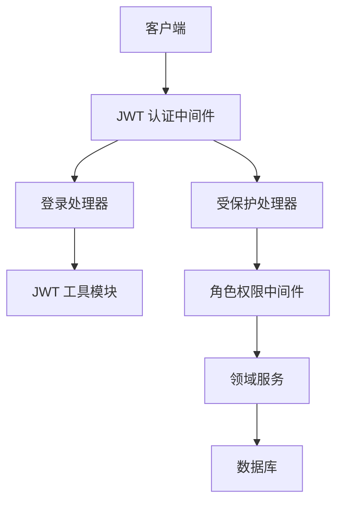
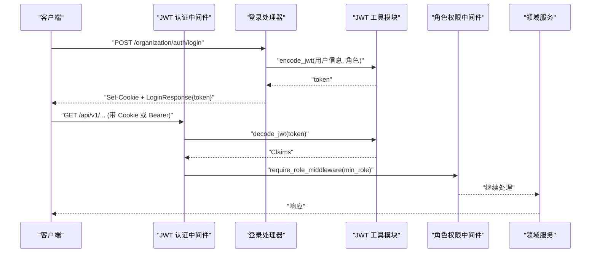
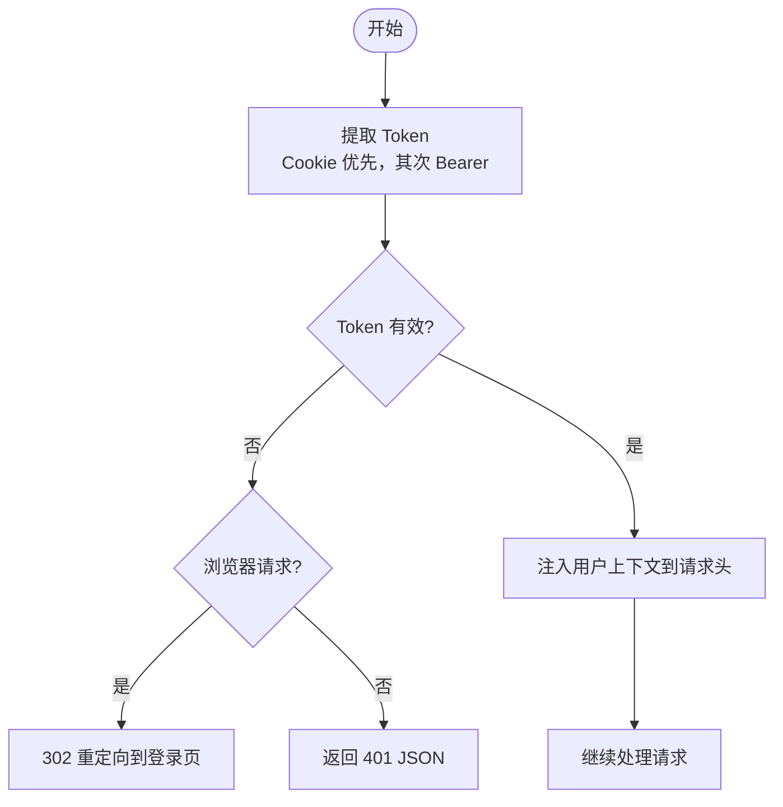
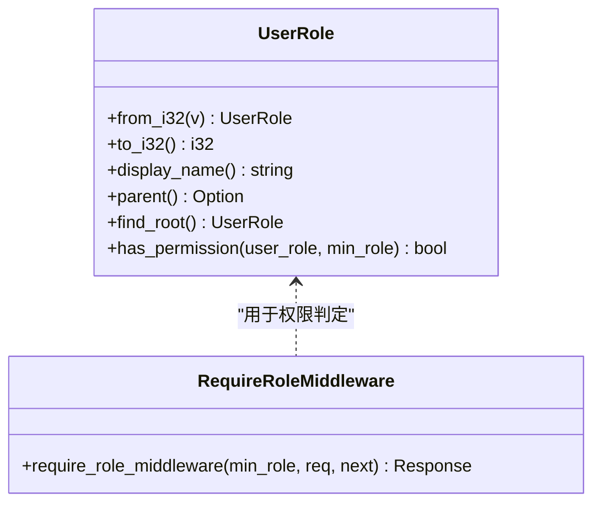
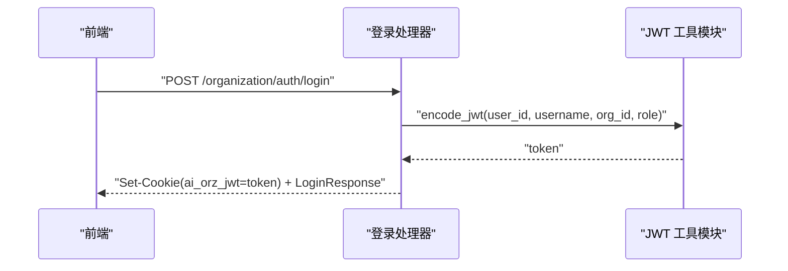
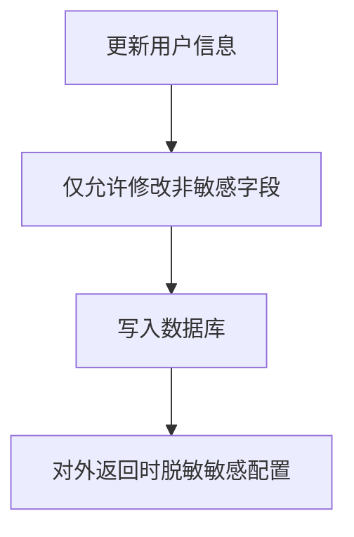
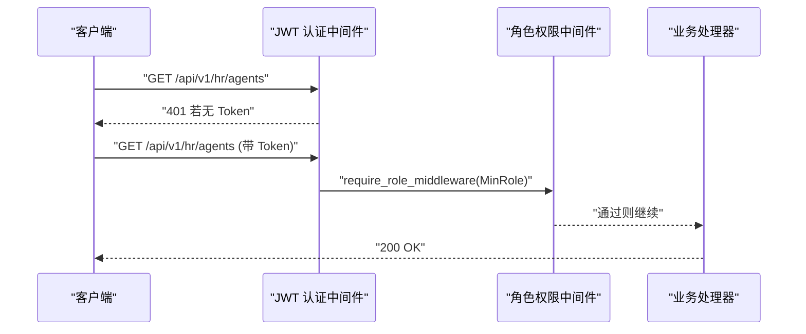
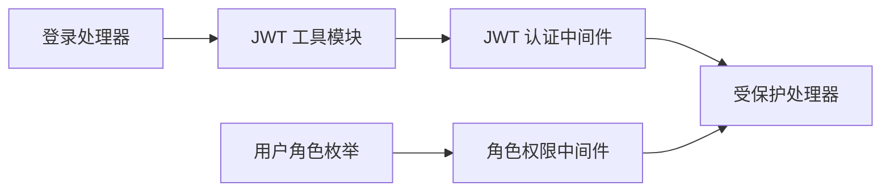

# 认证与授权

<cite>
**本文引用的文件**
- [jwt.rs](file://src/pkg/jwt.rs)
- [jwt_auth.rs](file://src/middleware/jwt_auth.rs)
- [require_role.rs](file://src/middleware/require_role.rs)
- [auth.rs](file://common/src/api/auth.rs)
- [login.rs](file://src/handlers/organization/auth/login.rs)
- [user.rs](file://common/src/enums/user.rs)
- [update_current_user.rs](file://src/handlers/user/profile/update_current_user.rs)
- [mcp_server.rs](file://src/models/mcp_server.rs)
- [subscribe_sse.rs](file://src/handlers/finance/message/subscribe_sse.rs)
- [auth_sysinit_test.rs](file://tests/integration/auth_sysinit_test.rs)
</cite>

## 目录
1. [简介](#简介)
2. [项目结构](#项目结构)
3. [核心组件](#核心组件)
4. [架构总览](#架构总览)
5. [详细组件分析](#详细组件分析)
6. [依赖关系分析](#依赖关系分析)
7. [性能与安全考量](#性能与安全考量)
8. [故障排查指南](#故障排查指南)
9. [结论](#结论)
10. [附录](#附录)

## 简介
本安全文档聚焦 AI Orz 的认证与授权体系，覆盖 JWT 令牌签发、验证与刷新策略；基于角色的访问控制（RBAC）模型（用户角色、组织权限、资源访问控制）；登录流程与会话管理；密码加密、防暴力破解、CSRF 防护等安全措施；API 认证示例、权限检查中间件使用与自定义权限规则配置；以及安全审计日志、异常检测与威胁防护策略。

## 项目结构
认证与授权相关代码主要分布在以下位置：
- 认证中间件：请求进入时从 Cookie 或 Authorization: Bearer 提取并校验 JWT，注入用户上下文
- JWT 工具：集中实现 Claims 结构与签名/验签逻辑
- 角色权限：基于 UserRole 的继承链进行最小权限校验
- 登录接口：验证凭据、签发 JWT、设置 Cookie
- 数据模型与枚举：用户角色、状态等
- 敏感信息脱敏：对外暴露的配置中隐藏敏感字段
- SSE 订阅：在浏览器场景下通过 Cookie 自动携带 Token 完成认证

**图示来源**
- [jwt_auth.rs:1-156](file://src/middleware/jwt_auth.rs#L1-L156)
- [jwt.rs:1-158](file://src/pkg/jwt.rs#L1-L158)
- [require_role.rs:1-39](file://src/middleware/require_role.rs#L1-L39)
- [login.rs:1-68](file://src/handlers/organization/auth/login.rs#L1-L68)

**章节来源**
- [jwt_auth.rs:1-156](file://src/middleware/jwt_auth.rs#L1-L156)
- [jwt.rs:1-158](file://src/pkg/jwt.rs#L1-L158)
- [require_role.rs:1-39](file://src/middleware/require_role.rs#L1-L39)
- [login.rs:1-68](file://src/handlers/organization/auth/login.rs#L1-L68)

## 核心组件
- JWT 工具模块：负责 Claims 定义、令牌签发与解码，统一过期时间策略
- JWT 认证中间件：双模式认证（Cookie/Bearer），失败时区分浏览器重定向与 API 401
- 角色权限中间件：基于 UserRole 的最小权限检查，支持继承链判定
- 登录处理器：验证凭据、签发 JWT、设置 HttpOnly Cookie
- 用户角色枚举：定义 SuperAdmin/Admin/Member 及权限判断方法
- 敏感信息脱敏：对外返回配置时对 URL、环境变量等做脱敏处理
- SSE 订阅：浏览器通过 Cookie 自动携带 Token，由中间件完成认证

**章节来源**
- [jwt.rs:1-158](file://src/pkg/jwt.rs#L1-L158)
- [jwt_auth.rs:1-156](file://src/middleware/jwt_auth.rs#L1-L156)
- [require_role.rs:1-39](file://src/middleware/require_role.rs#L1-L39)
- [login.rs:1-68](file://src/handlers/organization/auth/login.rs#L1-L68)
- [user.rs:1-212](file://common/src/enums/user.rs#L1-L212)
- [mcp_server.rs:125-222](file://src/models/mcp_server.rs#L125-L222)
- [subscribe_sse.rs:1-42](file://src/handlers/finance/message/subscribe_sse.rs#L1-L42)

## 架构总览
认证与授权的整体调用链如下：
- 登录：客户端提交用户名、密码哈希、组织 ID → 后端验证 → 签发 JWT → 设置 Cookie → 返回 token
- 受保护请求：中间件优先从 Cookie 取 Token，否则从 Authorization: Bearer 取 → 解码验证 → 注入用户上下文 → 可选的角色权限检查 → 业务处理

**图示来源**
- [login.rs:1-68](file://src/handlers/organization/auth/login.rs#L1-L68)
- [jwt.rs:1-158](file://src/pkg/jwt.rs#L1-L158)
- [jwt_auth.rs:1-156](file://src/middleware/jwt_auth.rs#L1-L156)
- [require_role.rs:1-39](file://src/middleware/require_role.rs#L1-L39)

## 详细组件分析

### JWT 令牌生成、验证与刷新机制
- 令牌结构：包含用户 ID、用户名、组织 ID、角色（可选）、签发时间与过期时间
- 算法与密钥：HS256 对称签名，全局配置单例管理密钥与默认过期时长
- 签发流程：登录成功后调用 encode_jwt，返回 token 并通过 Cookie 下发
- 验证流程：中间件 decode_jwt，失败则根据请求类型返回 302 或 401
- 刷新策略：当前未实现显式刷新端点；可通过重新登录获取新 Token，或在后续迭代中增加 refresh_token 机制

**图示来源**
- [jwt_auth.rs:1-156](file://src/middleware/jwt_auth.rs#L1-L156)
- [jwt.rs:1-158](file://src/pkg/jwt.rs#L1-L158)

**章节来源**
- [jwt.rs:1-158](file://src/pkg/jwt.rs#L1-L158)
- [jwt_auth.rs:1-156](file://src/middleware/jwt_auth.rs#L1-L156)

### 基于角色的访问控制（RBAC）模型
- 角色层级：SuperAdmin > Admin > Member，上级拥有下级所有权限
- 权限判定：从最低要求角色向上遍历祖先链，若路径包含当前用户角色则允许
- 中间件：require_role_middleware 读取 RequestContext 中的 user_role，按 min_role 校验
- 资源访问：结合领域层对组织、项目、任务等资源进行二次校验（如项目所有者校验）

**图示来源**
- [user.rs:1-212](file://common/src/enums/user.rs#L1-L212)
- [require_role.rs:1-39](file://src/middleware/require_role.rs#L1-L39)

**章节来源**
- [user.rs:1-212](file://common/src/enums/user.rs#L1-L212)
- [require_role.rs:1-39](file://src/middleware/require_role.rs#L1-L39)

### 登录流程与会话管理
- 登录接口：POST /organization/auth/login，接收 LoginRequest（username、password_hash、organization_id）
- 会话存储：服务端不维护会话状态；通过 HttpOnly Cookie 持久化 Token，浏览器自动携带
- 安全属性：Cookie 设置为 HttpOnly、SameSite=Lax，max_age 与 JWT 过期时间一致
- 登出：前端清除 Cookie 即可；后端未提供显式登出端点

**图示来源**
- [login.rs:1-68](file://src/handlers/organization/auth/login.rs#L1-L68)
- [auth.rs:1-39](file://common/src/api/auth.rs#L1-L39)
- [jwt.rs:1-158](file://src/pkg/jwt.rs#L1-L158)

**章节来源**
- [login.rs:1-68](file://src/handlers/organization/auth/login.rs#L1-L68)
- [auth.rs:1-39](file://common/src/api/auth.rs#L1-L39)

### 密码加密与敏感信息保护
- 密码加密：登录请求中的 password_hash 为前端已哈希值，后端直接比对，避免明文传输
- 敏感字段限制：更新当前用户时仅允许修改显示名称、邮箱、密码哈希，禁止修改角色、状态、组织 ID 等敏感字段
- 配置脱敏：对外暴露的配置（如 MCP Server 配置）对 URL、环境变量、头部等进行脱敏处理

**图示来源**
- [update_current_user.rs:37-90](file://src/handlers/user/profile/update_current_user.rs#L37-L90)
- [mcp_server.rs:125-222](file://src/models/mcp_server.rs#L125-L222)

**章节来源**
- [update_current_user.rs:37-90](file://src/handlers/user/profile/update_current_user.rs#L37-L90)
- [mcp_server.rs:125-222](file://src/models/mcp_server.rs#L125-L222)

### CSRF 防护与跨域安全
- Cookie 模式：使用 SameSite=Lax，降低跨站请求伪造风险
- Bearer 模式：API 调用通过 Authorization 头传递 Token，不受 Cookie 影响
- 建议：生产环境启用 HTTPS 并将 Cookie secure=true；对关键操作实施额外校验（如验证码、二次确认）

**章节来源**
- [login.rs:1-68](file://src/handlers/organization/auth/login.rs#L1-L68)
- [jwt_auth.rs:1-156](file://src/middleware/jwt_auth.rs#L1-L156)

### API 认证示例与权限检查中间件使用
- 无 Token 访问受保护路由：返回 401
- 有有效 Token：中间件注入用户上下文，可继续访问
- 角色权限：在需要管理员权限的路由上挂载 require_role_middleware，传入最小角色

**图示来源**
- [auth_sysinit_test.rs:28-101](file://tests/integration/auth_sysinit_test.rs#L28-L101)
- [require_role.rs:1-39](file://src/middleware/require_role.rs#L1-L39)

**章节来源**
- [auth_sysinit_test.rs:28-101](file://tests/integration/auth_sysinit_test.rs#L28-L101)
- [require_role.rs:1-39](file://src/middleware/require_role.rs#L1-L39)

### 自定义权限规则配置
- 最小角色：通过 require_role_middleware 的 min_role 参数配置
- 继承链：UserRole::has_permission 支持从 min_role 向上遍历祖先链，满足即放行
- 扩展点：可在中间件中结合 RequestContext 的组织 ID、用户角色进行更细粒度的资源级权限判断

**章节来源**
- [user.rs:1-212](file://common/src/enums/user.rs#L1-L212)
- [require_role.rs:1-39](file://src/middleware/require_role.rs#L1-L39)

### 安全审计日志、异常检测与威胁防护
- 审计日志：系统提供日志查询接口，可用于追踪认证失败、权限不足等事件
- 异常检测：JWT 验证失败会记录调试日志，便于定位问题
- 威胁防护：
  - 防暴力破解：建议在登录接口增加速率限制、验证码、账户锁定策略
  - SSRF 防护：工具调用链路中对 HTTP 工具进行域名、本地网络、DNS 白名单等限制
  - 敏感信息泄露：对外配置输出时进行脱敏

**章节来源**
- [jwt_auth.rs:1-156](file://src/middleware/jwt_auth.rs#L1-L156)
- [mcp_server.rs:125-222](file://src/models/mcp_server.rs#L125-L222)

## 依赖关系分析
- 中间件依赖：JWT 认证中间件依赖 JWT 工具模块；角色权限中间件依赖用户角色枚举
- 处理器依赖：登录处理器依赖 JWT 工具模块与领域服务；受保护处理器依赖中间件注入的上下文
- 数据模型依赖：用户角色枚举被多处引用，确保权限判定一致性

**图示来源**
- [jwt.rs:1-158](file://src/pkg/jwt.rs#L1-L158)
- [jwt_auth.rs:1-156](file://src/middleware/jwt_auth.rs#L1-L156)
- [require_role.rs:1-39](file://src/middleware/require_role.rs#L1-L39)
- [user.rs:1-212](file://common/src/enums/user.rs#L1-L212)
- [login.rs:1-68](file://src/handlers/organization/auth/login.rs#L1-L68)

**章节来源**
- [jwt.rs:1-158](file://src/pkg/jwt.rs#L1-L158)
- [jwt_auth.rs:1-156](file://src/middleware/jwt_auth.rs#L1-L156)
- [require_role.rs:1-39](file://src/middleware/require_role.rs#L1-L39)
- [user.rs:1-212](file://common/src/enums/user.rs#L1-L212)
- [login.rs:1-68](file://src/handlers/organization/auth/login.rs#L1-L68)

## 性能与安全考量
- 性能：JWT 验签为轻量操作，适合高并发；Cookie 模式减少 Header 开销
- 安全：
  - 密钥管理：生产环境应使用强随机密钥，定期轮换
  - 过期策略：合理设置 Token 过期时间，必要时引入 Refresh Token
  - 传输安全：启用 HTTPS，Cookie secure=true
  - 输入校验：严格校验登录参数，防止注入攻击
  - 限流与锁定：对登录接口实施速率限制与账户锁定

[本节为通用指导，无需特定文件来源]

## 故障排查指南
- 401 未认证：检查 Cookie 是否设置成功、Token 是否过期、Authorization 头格式是否正确
- 403 权限不足：确认用户角色是否满足最小角色要求，检查中间件挂载顺序
- 登录失败：验证用户名、密码哈希、组织 ID 是否正确，检查领域服务验证逻辑
- 敏感信息泄露：检查对外返回的配置是否已脱敏

**章节来源**
- [jwt_auth.rs:1-156](file://src/middleware/jwt_auth.rs#L1-L156)
- [require_role.rs:1-39](file://src/middleware/require_role.rs#L1-L39)
- [login.rs:1-68](file://src/handlers/organization/auth/login.rs#L1-L68)
- [mcp_server.rs:125-222](file://src/models/mcp_server.rs#L125-L222)

## 结论
AI Orz 的认证与授权体系以 JWT 为核心，结合 Cookie/Bearer 双模式认证与基于角色的访问控制，实现了简洁而安全的身份验证与权限管理。通过敏感信息脱敏、SSR 安全、审计日志等手段，提升了整体安全性。未来可进一步增强刷新机制、限流与账户锁定策略，以满足更高安全需求。

[本节为总结性内容，无需特定文件来源]

## 附录
- API 认证示例：
  - 登录：POST /organization/auth/login，返回 token 并设置 Cookie
  - 受保护接口：携带 Cookie 或 Authorization: Bearer 访问
- 权限检查中间件使用：在需要管理员权限的路由上挂载 require_role_middleware
- 自定义权限规则：通过 UserRole::has_permission 与 RequestContext 实现资源级权限控制

**章节来源**
- [auth.rs:1-39](file://common/src/api/auth.rs#L1-L39)
- [login.rs:1-68](file://src/handlers/organization/auth/login.rs#L1-L68)
- [require_role.rs:1-39](file://src/middleware/require_role.rs#L1-L39)
- [user.rs:1-212](file://common/src/enums/user.rs#L1-L212)