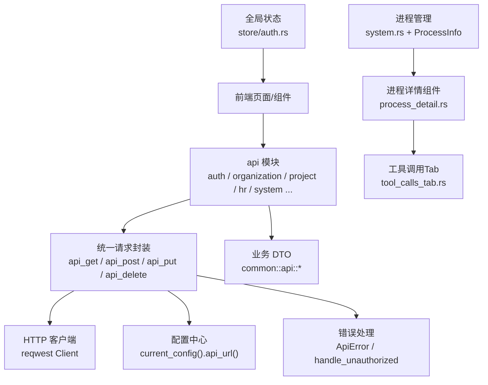
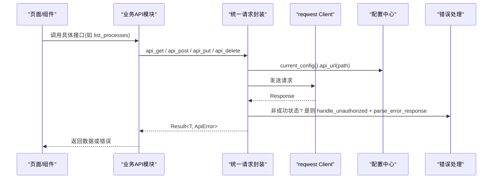
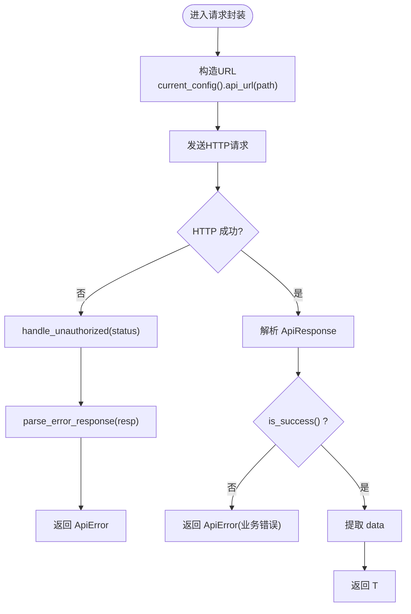
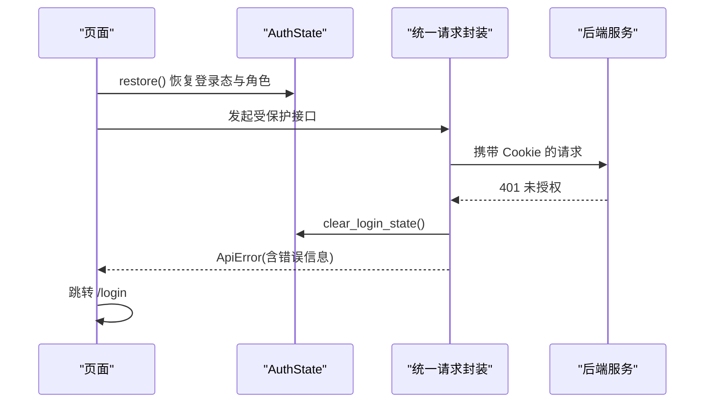
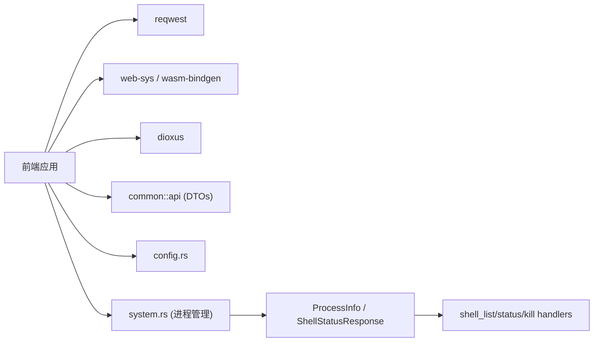

# API 客户端

<cite>
**本文引用的文件**
- [frontend/src/api/mod.rs](file://frontend/src/api/mod.rs)
- [frontend/src/api/auth.rs](file://frontend/src/api/auth.rs)
- [frontend/src/api/organization.rs](file://frontend/src/api/organization.rs)
- [frontend/src/api/project.rs](file://frontend/src/api/project.rs)
- [frontend/src/api/hr.rs](file://frontend/src/api/hr.rs)
- [frontend/src/api/system.rs](file://frontend/src/api/system.rs)
- [common/src/api/system.rs](file://common/src/api/system.rs)
- [src/handlers/system/process/shell_list.rs](file://src/handlers/system/process/shell_list.rs)
- [src/handlers/system/process/shell_status.rs](file://src/handlers/system/process/shell_status.rs)
- [src/handlers/system/process/shell_kill.rs](file://src/handlers/system/process/shell_kill.rs)
- [frontend/src/pages/system/processes.rs](file://frontend/src/pages/system/processes.rs)
- [frontend/src/components/process_detail.rs](file://frontend/src/components/process_detail.rs)
- [frontend/src/components/chat/tool_calls_tab.rs](file://frontend/src/components/chat/tool_calls_tab.rs)
- [src/router.rs](file://src/router.rs)
</cite>

## 更新摘要
**变更内容**
- 新增统一后台进程管理功能，包括进程列表查询、状态监控和进程终止
- 扩展系统模块 API，添加 `list_processes`、`get_process_status`、`kill_process` 等接口
- 实现前端进程管理页面和工具调用 Tab 的进程关联功能
- 新增进程详情共享组件，支持弹窗展示和实时刷新
- 完善后端进程管理处理器，提供 shell_list、shell_status、shell_kill 双露接口

## 目录
1. [简介](#简介)
2. [项目结构](#项目结构)
3. [核心组件](#核心组件)
4. [架构总览](#架构总览)
5. [详细组件分析](#详细组件分析)
6. [依赖关系分析](#依赖关系分析)
7. [性能考虑](#性能考虑)
8. [故障排查指南](#故障排查指南)
9. [结论](#结论)
10. [附录：接口清单与示例](#附录接口清单与示例)

## 简介
本文件面向 AI Orz 前端应用，系统化说明基于 Rust 的前端 HTTP 客户端实现与业务 API 调用方式。内容涵盖统一请求封装、认证令牌管理（基于 HttpOnly Cookie）、错误处理机制、响应拦截器、各业务模块的 API 接口定义（认证、用户、组织、项目、Agent、工具、进程管理等）、状态管理模式（全局状态存储、异步数据加载、缓存策略），以及调试与测试指南和性能优化建议。

## 项目结构
前端采用 Dioxus + reqwest 构建，API 客户端集中在 frontend/src/api 下，按业务域拆分模块；通用类型与统一响应格式在 common/src/api 中共享；配置与运行时 URL 拼接在 frontend/src/config.rs；全局状态（登录态、角色）在 frontend/src/store 中管理。



图表来源
- [frontend/src/api/mod.rs:28-35](file://frontend/src/api/mod.rs#L28-L35)
- [frontend/src/config.rs:76-79](file://frontend/src/config.rs#L76-L79)
- [common/src/api/mod.rs:6-49](file://common/src/api/mod.rs#L6-L49)
- [frontend/src/api/system.rs:332-356](file://frontend/src/api/system.rs#L332-L356)

章节来源
- [frontend/src/api/mod.rs:1-433](file://frontend/src/api/mod.rs#L1-L433)
- [frontend/src/config.rs:1-85](file://frontend/src/config.rs#L1-L85)
- [common/src/api/mod.rs:1-156](file://common/src/api/mod.rs#L1-L156)

## 核心组件
- 统一请求封装：提供 GET/POST/PUT/DELETE 及文本、Multipart 上传等能力，统一解析 ApiResponse<T>，并处理 401 重定向。
- 错误模型：统一的 ApiError，包含 http_status、error_code、message，便于上层统一处理。
- 配置与 URL 构造：通过 FrontendConfig 动态拼接后端 API Base URL，支持编译时默认值与 localStorage 覆盖。
- 认证状态：基于 HttpOnly Cookie 的 JWT，前端仅持久化登录标志与角色到 localStorage，并在 401 时自动清理并重定向。
- 分页与查询参数：提供 build_pagination_url 与 build_query_string 辅助函数，统一构造查询串。
- **进程管理**：新增统一后台进程管理功能，支持进程列表查询、状态监控、日志查看和进程终止操作。

章节来源
- [frontend/src/api/mod.rs:87-287](file://frontend/src/api/mod.rs#L87-L287)
- [frontend/src/api/mod.rs:289-318](file://frontend/src/api/mod.rs#L289-L318)
- [frontend/src/api/mod.rs:320-403](file://frontend/src/api/mod.rs#L320-L403)
- [frontend/src/api/mod.rs:405-432](file://frontend/src/api/mod.rs#L405-L432)
- [frontend/src/config.rs:12-85](file://frontend/src/config.rs#L12-L85)
- [frontend/src/store/auth.rs:13-57](file://frontend/src/store/auth.rs#L13-L57)
- [common/src/api/mod.rs:6-73](file://common/src/api/mod.rs#L6-L73)
- [frontend/src/api/system.rs:332-356](file://frontend/src/api/system.rs#L332-L356)

## 架构总览
前端通过业务 API 模块调用统一请求封装，统一封装负责：
- 组装 URL（基于当前配置）
- 发送 HTTP 请求
- 检查 HTTP 状态码，必要时触发 401 处理
- 解析 ApiResponse<T>，提取 data 或返回错误
- 将网络层错误与业务错误统一为 ApiError



图表来源
- [frontend/src/api/mod.rs:28-35](file://frontend/src/api/mod.rs#L28-L35)
- [frontend/src/api/mod.rs:87-114](file://frontend/src/api/mod.rs#L87-L114)
- [frontend/src/config.rs:76-79](file://frontend/src/config.rs#L76-L79)

## 详细组件分析

### 统一请求封装与错误处理
- 方法族：api_get、api_get_or_default、api_post、api_post_empty、api_put、api_put_empty、api_delete、api_get_text、api_post_multipart。
- 错误处理：
  - 网络错误：network_err 包装为 ApiError。
  - HTTP 错误：parse_error_response 读取 body，尝试解析 error_code 与 message。
  - 401 处理：handle_unauthorized 清除登录态并跳转至登录页。
- 响应体：统一解析 ApiResponse<T>，若 code != 0 则视为业务错误。



图表来源
- [frontend/src/api/mod.rs:87-114](file://frontend/src/api/mod.rs#L87-L114)
- [frontend/src/api/mod.rs:143-174](file://frontend/src/api/mod.rs#L143-L174)
- [frontend/src/api/mod.rs:203-234](file://frontend/src/api/mod.rs#L203-L234)
- [frontend/src/api/mod.rs:263-287](file://frontend/src/api/mod.rs#L263-L287)
- [frontend/src/api/mod.rs:38-45](file://frontend/src/api/mod.rs#L38-L45)
- [frontend/src/api/mod.rs:47-85](file://frontend/src/api/mod.rs#L47-L85)

章节来源
- [frontend/src/api/mod.rs:87-287](file://frontend/src/api/mod.rs#L87-L287)
- [frontend/src/api/mod.rs:289-318](file://frontend/src/api/mod.rs#L289-L318)

### 认证与令牌管理
- 认证方式：基于 HttpOnly Cookie 的 JWT，前端不直接持有 token。
- 本地持久化：localStorage 保存登录标志与角色，用于 UI 判断与刷新恢复。
- 登出流程：clear_login_state 清理本地标记；logout 同时重置内存中的 AuthState。
- 401 处理：统一在请求封装中触发，自动清理登录态并跳转登录页。



图表来源
- [frontend/src/store/auth.rs:13-43](file://frontend/src/store/auth.rs#L13-L43)
- [frontend/src/api/mod.rs:38-45](file://frontend/src/api/mod.rs#L38-L45)

章节来源
- [frontend/src/store/auth.rs:1-94](file://frontend/src/store/auth.rs#L1-L94)
- [frontend/src/api/mod.rs:38-45](file://frontend/src/api/mod.rs#L38-L45)

### 配置与 URL 构造
- 配置优先级：localStorage 覆盖 > 编译时默认值。
- 默认 Base URL：从编译时生成的 server.listen_addr 推导，自动处理 0.0.0.0 替换为 localhost。
- URL 拼接：api_path 通过 trim_end_matches('/') 后拼接，避免重复斜杠。

章节来源
- [frontend/src/config.rs:12-85](file://frontend/src/config.rs#L12-L85)

### 业务模块 API 概览
- 认证模块：系统初始化检查、异步初始化、登录、登出。
- 组织与用户：获取当前组织、更新组织、列出用户、创建/更新/删除用户、当前用户信息与更新。
- 项目与任务：项目列表/查询/搜索/详情/创建/更新/状态变更；任务列表/查询/搜索/详情/创建/更新/状态/进度；产物 CRUD 与内容获取。
- HR（Agent/技能/工具）：Agent 列表/查询/搜索/详情/创建/更新/状态/删除；外部 Agent；工具包/技能包安装卸载；单技能安装卸载；技能库 CRUD；Skill 文件管理；Agent 工具绑定/解绑；记忆搜索与推荐节点。
- **系统管理**：健康检查、定时触发器、备份管理、日志查询、AOP 监控、**统一后台进程管理**。

章节来源
- [frontend/src/api/auth.rs:10-40](file://frontend/src/api/auth.rs#L10-L40)
- [frontend/src/api/organization.rs:13-61](file://frontend/src/api/organization.rs#L13-L61)
- [frontend/src/api/project.rs:16-162](file://frontend/src/api/project.rs#L16-L162)
- [frontend/src/api/hr.rs:25-310](file://frontend/src/api/hr.rs#L25-L310)
- [frontend/src/api/system.rs:1-356](file://frontend/src/api/system.rs#L1-L356)

### 分页与查询参数构造
- 分页：build_pagination_url 将 PaginationParams(limit/offset) 转为 query string。
- 查询：build_query_string 过滤 None 项并拼接 key=value。

章节来源
- [frontend/src/api/mod.rs:405-432](file://frontend/src/api/mod.rs#L405-L432)
- [common/src/api/mod.rs:55-73](file://common/src/api/mod.rs#L55-L73)

### 多部分表单上传
- 使用 web-sys 原生 fetch 与 FormData，设置 SameOrigin 凭据，解析 ApiResponse<T>。
- 错误路径：构造 Request、fetch、Response 转换、JSON 解析均捕获并包装为 ApiError。

章节来源
- [frontend/src/api/mod.rs:320-403](file://frontend/src/api/mod.rs#L320-L403)

### 统一后台进程管理功能

**已更新** 新增统一后台进程管理功能，提供完整的进程生命周期管理能力。

#### 核心功能特性
- **进程列表查询**：`GET /api/v1/system/processes` - 列出所有后台进程，支持按调用方身份过滤可见范围
- **进程状态查询**：`GET /api/v1/system/processes/{pid}` - 查询单个进程状态，包含探活检查和日志尾部
- **进程终止控制**：`POST /api/v1/system/processes/{pid}/kill` - 终止指定进程（SIGKILL）
- **权限控制**：Agent 调用方仅可见自己启动的进程，普通用户可见全部进程

#### 数据结构定义
```rust
// 进程信息
pub struct ProcessInfo {
    pub pid: u32,                    // 进程ID
    pub call_id: String,             // 关联的工具调用ID
    pub tool_id: String,             // 启动该进程的工具ID
    pub agent_id: Option<String>,    // 启动方Agent ID
    pub command: String,             // 执行的命令
    pub working_dir: String,         // 工作目录
    pub background: bool,            // 是否后台启动
    pub started_at: u64,             // 启动时间戳
    pub alive: bool,                 // 是否存活
    pub exit_code: Option<i32>,      // 退出码
    pub log_path: String,            // 日志路径
}

// 进程状态响应
pub struct ShellStatusResponse {
    pub pid: u32,                    // 进程ID
    pub alive: bool,                 // 是否存活
    pub exit_code: Option<i32>,      // 退出码
    pub started_at: u64,             // 启动时间
    pub command: String,             // 执行命令
    pub log_path: String,            // 日志路径
    pub call_id: String,             // 关联调用ID
    pub log_tail: String,            // 日志尾部
}
```

#### 前端集成
- **进程管理页面**：独立的系统管理页面，支持自动刷新、手动刷新、进程详情弹窗
- **工具调用 Tab**：在聊天侧栏中显示工具调用记录，并与运行中的进程关联
- **进程详情组件**：共享组件，支持弹窗展示进程详细信息和操作按钮

章节来源
- [frontend/src/api/system.rs:332-356](file://frontend/src/api/system.rs#L332-L356)
- [common/src/api/system.rs:240-328](file://common/src/api/system.rs#L240-L328)
- [src/handlers/system/process/shell_list.rs:1-144](file://src/handlers/system/process/shell_list.rs#L1-L144)
- [src/handlers/system/process/shell_status.rs:1-39](file://src/handlers/system/process/shell_status.rs#L1-L39)
- [src/handlers/system/process/shell_kill.rs:1-31](file://src/handlers/system/process/shell_kill.rs#L1-L31)

### 项目详情接口增强 - with_progress_summary 支持

**已更新** 项目详情接口现已支持按需加载项目进度汇总数据，通过 `with_progress_summary` 查询参数控制。

#### 新增功能说明
- **查询参数**：`with_progress_summary: Option<bool>` - 控制是否返回项目进度汇总
- **响应字段**：`progress_summary: Option<ProjectProgressSummary>` - 当参数为 true 时填充
- **数据结构**：`ProjectProgressSummary` 包含任务统计和整体进度信息

#### 使用示例
```rust
// 获取项目详情并包含进度汇总
let req = GetProjectRequest {
    id: project_id.clone(),
    with_progress_summary: Some(true),
    with_task_graph: Some(true),
    with_artifacts: Some(true),
    ..Default::default()
};
let project = get_project(req).await?;

// 访问进度汇总数据
if let Some(summary) = &project.progress_summary {
    println!("总任务数: {}", summary.total_tasks);
    println!("完成数: {}", summary.completed);
    println!("进行中: {}", summary.in_progress);
    println!("待启动: {}", summary.pending);
    println!("已取消: {}", summary.cancelled);
    println!("整体进度: {}%", summary.overall_percent);
}
```

#### 进度汇总数据结构
```rust
pub struct ProjectProgressSummary {
    pub total_tasks: usize,        // 任务总数
    pub completed: usize,          // 已完成数
    pub in_progress: usize,        // 进行中数
    pub pending: usize,           // 待启动数（Pending + PendingReview）
    pub blocked: usize,           // 阻塞数（预留，目前固定为 0）
    pub cancelled: usize,         // 已取消数
    pub overall_percent: u32,     // 整体进度百分比（0-100，任务进度均值）
}
```

章节来源
- [frontend/src/api/project.rs:35-59](file://frontend/src/api/project.rs#L35-L59)
- [common/src/api/project.rs:33-63](file://common/src/api/project.rs#L33-L63)
- [common/src/models/stats.rs:150-172](file://common/src/models/stats.rs#L150-L172)

## 依赖关系分析
- 运行时依赖：Dioxus（UI框架）、reqwest（HTTP 客户端）、web-sys/wasm-bindgen（浏览器 API 桥接）。
- 共享类型：common::api 提供统一响应格式、分页结构与业务 DTO，前后端共用保证一致性。
- 配置注入：编译期生成配置，运行期通过 current_config() 获取。
- **进程管理依赖**：SystemDomain 提供进程管理能力，pkg/process 注册中心管理进程状态。



图表来源
- [frontend/Cargo.toml:11-25](file://frontend/Cargo.toml#L11-L25)
- [common/src/api/mod.rs:1-156](file://common/src/api/mod.rs#L1-L156)
- [frontend/src/api/system.rs:332-356](file://frontend/src/api/system.rs#L332-L356)

章节来源
- [frontend/Cargo.toml:1-26](file://frontend/Cargo.toml#L1-L26)
- [common/src/api/mod.rs:1-156](file://common/src/api/mod.rs#L1-L156)

## 性能考虑
- 连接复用：reqwest Client 使用 OnceLock 全局单例，减少握手开销。
- 默认响应：对可选列表接口优先使用 api_get_or_default，降低空响应分支复杂度。
- 查询裁剪：通过 build_query_string 精确传递 with_stats、with_artifacts、with_progress_summary 等开关，减少不必要的数据传输。
- 上传优化：multipart 上传使用原生 fetch，避免额外序列化开销。
- 缓存策略：建议在页面层结合 Signal/缓存层对高频只读数据进行短期缓存（例如组织信息、当前用户信息），以减少重复请求。
- **进度汇总按需加载**：`with_progress_summary` 参数允许按需获取项目进度汇总，避免不必要的计算开销。
- **进程管理优化**：进程列表查询支持自动刷新间隔控制，详情组件支持懒加载和防抖刷新。

[本节为通用指导，不直接分析具体文件]

## 故障排查指南
- 401 未授权：确认 Cookie 是否有效；检查 handle_unauthorized 是否触发；确认登出流程是否正确清理本地状态。
- JSON 解析失败：检查后端返回结构是否为 ApiResponse<T>；确认字段映射与类型一致。
- 网络错误：检查跨域与代理配置；确认 base URL 正确且可访问。
- 上传失败：确认 FormData 构造正确；检查浏览器环境 window/fetch 可用性。
- **进度汇总为空**：确认请求中设置了 `with_progress_summary=true`；检查后端是否正确实现了进度汇总计算逻辑。
- **进程管理问题**：
  - 进程列表为空：检查是否有 shell_exec 启动的后台进程
  - 进程状态异常：确认进程是否已退出或终止
  - 权限问题：Agent 只能看到自己启动的进程
  - 日志无法查看：检查日志文件路径和权限

章节来源
- [frontend/src/api/mod.rs:38-85](file://frontend/src/api/mod.rs#L38-L85)
- [frontend/src/api/mod.rs:320-403](file://frontend/src/api/mod.rs#L320-L403)
- [frontend/src/api/system.rs:332-356](file://frontend/src/api/system.rs#L332-L356)

## 结论
该 API 客户端以统一封装为核心，结合共享 DTO 与配置管理，实现了稳定、一致的 HTTP 交互体验。通过集中式错误处理与 401 拦截，提升了用户体验与安全性。各业务模块清晰分层，便于扩展与维护。建议在生产环境中结合缓存与重试策略进一步优化性能与鲁棒性。

**最新改进**：项目详情接口现已支持按需加载项目进度汇总数据，通过 `with_progress_summary` 参数实现更精细化的数据加载控制，有助于提升性能和用户体验。**新增的统一后台进程管理功能**提供了完整的进程生命周期管理能力，包括进程列表查询、状态监控、日志查看和进程终止操作，并通过前端进程管理页面和工具调用 Tab 实现了良好的用户体验。

[本节为总结，不直接分析具体文件]

## 附录：接口清单与示例

### 认证
- 检查系统初始化：GET /api/v1/organization/initialize/check
- 异步初始化系统：POST /api/v1/organization/initialize
- 登录：POST /api/v1/organization/auth/login
- 登出：POST /api/v1/organization/auth/logout

章节来源
- [frontend/src/api/auth.rs:10-40](file://frontend/src/api/auth.rs#L10-L40)

### 组织与用户
- 公开获取组织列表：GET /api/v1/organization/list
- 获取当前组织：GET /api/v1/organization/me
- 更新当前组织：PUT /api/v1/organization/me
- 获取当前用户信息：GET /api/v1/user/me
- 更新当前用户信息：PUT /api/v1/user/me
- 列出用户：GET /api/v1/organization/user/me/list
- 创建用户：POST /api/v1/organization/user/
- 更新用户：PUT /api/v1/organization/user/update
- 删除用户：DELETE /api/v1/organization/user/id/{user_id}

章节来源
- [frontend/src/api/organization.rs:13-61](file://frontend/src/api/organization.rs#L13-L61)

### 项目与任务
- 项目列表：GET /api/v1/projects?limit=&offset=
- 项目查询：POST /api/v1/projects/query
- 项目搜索：POST /api/v1/projects/search
- 项目详情：GET /api/v1/projects/{id}?with_stats=&with_model_call_stats=&stats_time_start=&stats_time_end=&stats_interval=&with_artifacts=&with_progress_summary=
- 创建项目：POST /api/v1/projects
- 更新项目：PUT /api/v1/projects/{id}
- 更新项目状态：PUT /api/v1/projects/{id}/status
- 任务列表（项目内）：GET /api/v1/projects/{project_id}/tasks
- 任务查询：POST /api/v1/tasks/query
- 任务搜索：POST /api/v1/tasks/search
- 任务详情：GET /api/v1/tasks/{id}?with_stats=&with_model_call_stats=&stats_time_start=&stats_time_end=&stats_interval=&with_artifacts=
- 创建任务：POST /api/v1/tasks
- 更新任务：PUT /api/v1/tasks/{id}
- 更新任务状态：PUT /api/v1/tasks/{id}/status
- 更新任务进度：PUT /api/v1/tasks/{id}/progress
- 产物列表：GET /api/v1/project/artifacts?project_id=
- 创建产物：POST /api/v1/project/artifacts
- 删除产物：DELETE /api/v1/project/artifacts/{id}
- 获取产物内容：GET /api/v1/project/artifacts/{id}/content
- 更新产物：PUT /api/v1/project/artifacts/{artifact_id}

**已更新** 项目详情接口现已支持 `with_progress_summary` 查询参数，用于获取项目进度汇总数据。

章节来源
- [frontend/src/api/project.rs:16-162](file://frontend/src/api/project.rs#L16-L162)

### HR（Agent/技能/工具）
- Agent 列表：GET /api/v1/hr/agents?limit=&offset=
- Agent 查询：POST /api/v1/hr/agents/query
- 前台可用 Agent：GET /api/v1/hr/agents/reception
- Agent 搜索：POST /api/v1/hr/agents/search
- Agent 详情：GET /api/v1/hr/agents/{id}?with_stats=&with_model_call_stats=&stats_time_start=&stats_time_end=&stats_interval=
- 创建 Agent：POST /api/v1/hr/agents
- 创建外部 Agent：POST /api/v1/hr/agents/external
- 更新 Agent：PUT /api/v1/hr/agents/{id}
- 更新 Agent 状态：PUT /api/v1/hr/agents/{id}/status
- 删除 Agent：DELETE /api/v1/hr/agents/{id}
- 工具包安装/卸载：POST/DELETE /api/v1/hr/agents/{agent_id}/tool-packs/{tag}
- 技能包安装/卸载：POST/DELETE /api/v1/hr/agents/{agent_id}/skill-packs/{tag}
- 单技能安装/卸载：POST/DELETE /api/v1/hr/agents/{agent_id}/skills/{skill_id}
- 技能库列表/查询/搜索：GET/POST /api/v1/hr/skills
- 技能详情：GET /api/v1/hr/skills/{id}
- 技能文件列表/内容/更新：GET/GET/PUT /api/v1/hr/skills/{skill_id}/files{...}
- 工具绑定/解绑：POST/DELETE /api/v1/hr/agents/{agent_id}/tools/{tool_id}/bind
- 记忆搜索/查询/遍历：POST /api/v1/hr/agents/search_memory, /query_memory, /search_memory
- 推荐种子节点：POST /api/v1/hr/agents/recommend_seed_nodes

章节来源
- [frontend/src/api/hr.rs:25-310](file://frontend/src/api/hr.rs#L25-L310)

### 系统管理
- 健康检查：GET /health
- 定时触发器列表：GET /api/v1/system/cron-triggers
- 创建定时触发器：POST /api/v1/system/cron-triggers
- 更新定时触发器：PUT /api/v1/system/cron-triggers/{id}
- 删除定时触发器：DELETE /api/v1/system/cron-triggers/{id}
- 暂停定时触发器：POST /api/v1/system/cron-triggers/{id}/pause
- 恢复定时触发器：POST /api/v1/system/cron-triggers/{id}/resume
- 备份列表：GET /api/v1/system/backups
- 创建备份：POST /api/v1/system/backups
- 删除备份：DELETE /api/v1/system/backups/{version}
- 获取恢复脚本：POST /api/v1/system/backups/{version}/restore
- 日志查询：GET /api/v1/system/logs
- AOP 队列统计：GET /api/v1/system/aop/stats
- 事件列表：GET /api/v1/system/aop/{consumer}/events
- 事件详情：GET /api/v1/system/aop/{consumer}/events/{event_id}
- AOP 统计概览：GET /api/v1/system/aop/stats/overview
- AOP 时序统计：GET /api/v1/system/aop/stats/time-series
- AOP 分布统计：GET /api/v1/system/aop/stats/distribution
- 健康指标：GET /api/v1/system/health/metrics
- **统一后台进程管理**：
  - 进程列表：GET /api/v1/system/processes
  - 进程状态：GET /api/v1/system/processes/{pid}
  - 终止进程：POST /api/v1/system/processes/{pid}/kill

章节来源
- [frontend/src/api/system.rs:1-356](file://frontend/src/api/system.rs#L1-L356)
- [src/router.rs:739-751](file://src/router.rs#L739-L751)

### 统一响应与分页
- 统一响应：ApiResponse<T> { code, message, data }
- 分页参数：PaginationParams { limit, offset }
- 分页结果：PagedResult<T> { items, total }

章节来源
- [common/src/api/mod.rs:6-73](file://common/src/api/mod.rs#L6-L73)

### 项目进度汇总数据结构
- **ProjectProgressSummary**：项目进度汇总数据结构，包含任务统计和整体进度信息
  - `total_tasks`: 任务总数
  - `completed`: 已完成数
  - `in_progress`: 进行中数
  - `pending`: 待启动数（Pending + PendingReview）
  - `blocked`: 阻塞数（预留，目前固定为 0）
  - `cancelled`: 已取消数
  - `overall_percent`: 整体进度百分比（0-100，任务进度均值）

章节来源
- [common/src/models/stats.rs:150-172](file://common/src/models/stats.rs#L150-L172)

### 进程管理数据结构
- **ProcessInfo**：进程信息数据结构
  - `pid`: 进程ID
  - `call_id`: 关联的工具调用ID
  - `tool_id`: 启动该进程的工具ID
  - `agent_id`: 启动方Agent ID
  - `command`: 执行的命令
  - `working_dir`: 工作目录
  - `background`: 是否后台启动
  - `started_at`: 启动时间戳
  - `alive`: 是否存活
  - `exit_code`: 退出码
  - `log_path`: 日志路径

- **ShellStatusResponse**：进程状态响应数据结构
  - `pid`: 进程ID
  - `alive`: 是否存活
  - `exit_code`: 退出码
  - `started_at`: 启动时间
  - `command`: 执行命令
  - `log_path`: 日志路径
  - `call_id`: 关联调用ID
  - `log_tail`: 日志尾部

章节来源
- [common/src/api/system.rs:240-328](file://common/src/api/system.rs#L240-L328)