# 前端应用

<cite>
**本文引用的文件**
- [frontend/Cargo.toml](file://frontend/Cargo.toml)
- [frontend/Dioxus.toml](file://frontend/Dioxus.toml)
- [frontend/package.json](file://frontend/package.json)
- [frontend/index.html](file://frontend/index.html)
- [frontend/src/main.rs](file://frontend/src/main.rs)
- [frontend/src/pages/mod.rs](file://frontend/src/pages/mod.rs)
- [frontend/src/components/mod.rs](file://frontend/src/components/mod.rs)
- [frontend/src/store/mod.rs](file://frontend/src/store/mod.rs)
- [frontend/src/store/auth.rs](file://frontend/src/store/auth.rs)
- [frontend/src/hooks/mod.rs](file://frontend/src/hooks/mod.rs)
- [frontend/src/api/mod.rs](file://frontend/src/api/mod.rs)
- [frontend/src/config.rs](file://frontend/src/config.rs)
- [frontend/build.rs](file://frontend/build.rs)
- [common/src/config.rs](file://common/src/config.rs)
- [common/config/ai_orz.toml](file://common/config/ai_orz.toml)
- [frontend/styles/input.css](file://frontend/styles/input.css)
- [frontend/src/pages/message/chat.rs](file://frontend/src/pages/message/chat.rs)
- [frontend/src/components/button.rs](file://frontend/src/components/button.rs)
- [src/router.rs](file://src/router.rs)
- [frontend/src/layouts/navbar.rs](file://frontend/src/layouts/navbar.rs)
- [frontend/src/layouts/app_layout.rs](file://frontend/src/layouts/app_layout.rs)
- [frontend/src/components/process_detail.rs](file://frontend/src/components/process_detail.rs)
- [frontend/src/pages/system/processes.rs](file://frontend/src/pages/system/processes.rs)
- [frontend/src/pages/settings.rs](file://frontend/src/pages/settings.rs)
- [frontend/src/pages/user/profile.rs](file://frontend/src/pages/user/profile.rs)
- [frontend/src/components/markdown.rs](file://frontend/src/components/markdown.rs)
- [frontend/src/api/organization.rs](file://frontend/src/api/organization.rs)
- [frontend/src/pages/finance/identity.rs](file://frontend/src/pages/finance/identity.rs)
- [frontend/src/api/lark_integration.rs](file://frontend/src/api/lark_integration.rs)
- [common/src/api/lark_integration.rs](file://common/src/api/lark_integration.rs)
</cite>

## 更新摘要
**变更内容**
- 新增 `/finance/identity` 路由用于飞书集成凭证管理，包含完整的凭证CRUD、自动绑定流程和用户认证功能
- 增强设置页面，移除飞书集成功能并专注于系统配置管理
- 实现完整的 Markdown 渲染能力，支持用户偏好编辑和安全渲染
- 前端路由从15个扩展到41个，涵盖更多业务模块和功能
- 新增飞书集成API客户端，提供类型安全的接口调用
- 完善移动端适配和响应式设计

## 目录
1. [简介](#简介)
2. [项目结构](#项目结构)
3. [核心组件](#核心组件)
4. [架构总览](#架构总览)
5. [详细组件分析](#详细组件分析)
6. [依赖关系分析](#依赖关系分析)
7. [性能考虑](#性能考虑)
8. [故障排查指南](#故障排查指南)
9. [结论](#结论)
10. [附录](#附录)

## 简介
本文件为 AI Orz 前端应用的完整开发文档，面向使用 Dioxus 构建的 Web 应用。内容涵盖：
- 基于 Dioxus 的组件架构、状态管理、路由导航与 API 客户端
- 核心页面组件、UI 组件库、主题系统与响应式设计
- SPA深链接处理机制，确保所有路由都能正确加载
- 前端构建配置、开发环境与部署流程
- 进程管理、工具调用监控等高级功能
- 用户偏好编辑功能，支持Markdown格式的个性化设置
- 前端配置格式改进，提供一致的代码风格和更好的可维护性
- **新增**：飞书集成管理页面，提供完整的凭证管理和用户认证功能
- **新增**：增强的Markdown渲染能力，支持安全的内容展示
- 组件使用示例、页面流程图与样式定制指南
目标是帮助前端开发者快速理解并扩展该前端工程。

## 项目结构
前端位于 frontend 目录，采用 Dioxus + Tailwind CSS + DaisyUI 的技术栈，按业务域组织页面与组件，统一通过 API 客户端访问后端服务。

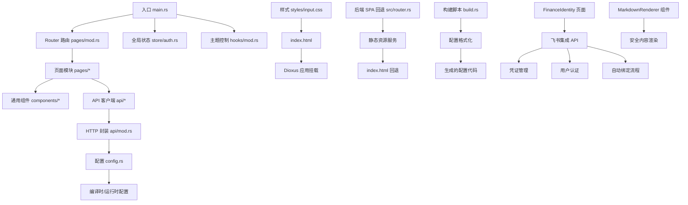

**图表来源**
- [frontend/src/main.rs:24-57](file://frontend/src/main.rs#L24-L57)
- [frontend/src/pages/mod.rs:56-164](file://frontend/src/pages/mod.rs#L56-L164)
- [src/router.rs:19-130](file://src/router.rs#L19-L130)
- [frontend/build.rs:30-48](file://frontend/build.rs#L30-L48)
- [frontend/src/pages/finance/identity.rs:25-579](file://frontend/src/pages/finance/identity.rs#L25-L579)
- [frontend/src/api/lark_integration.rs:1-173](file://frontend/src/api/lark_integration.rs#L1-L173)
- [frontend/src/components/markdown.rs:1-206](file://frontend/src/components/markdown.rs#L1-L206)

**章节来源**
- [frontend/Cargo.toml:1-26](file://frontend/Cargo.toml#L1-L26)
- [frontend/Dioxus.toml:1-18](file://frontend/Dioxus.toml#L1-L18)
- [frontend/package.json:1-14](file://frontend/package.json#L1-L14)
- [frontend/src/main.rs:1-58](file://frontend/src/main.rs#L1-L58)
- [frontend/src/pages/mod.rs:1-164](file://frontend/src/pages/mod.rs#L1-L164)
- [frontend/src/components/mod.rs:1-30](file://frontend/src/components/mod.rs#L1-L30)
- [frontend/src/store/mod.rs:1-5](file://frontend/src/store/mod.rs#L1-L5)
- [frontend/src/hooks/mod.rs:1-142](file://frontend/src/hooks/mod.rs#L1-L142)
- [frontend/src/api/mod.rs:1-433](file://frontend/src/api/mod.rs#L1-L433)
- [frontend/src/config.rs:1-94](file://frontend/src/config.rs#L1-L94)
- [frontend/build.rs:1-309](file://frontend/build.rs#L1-L309)
- [common/src/config.rs:1-549](file://common/src/config.rs#L1-L549)
- [common/config/ai_orz.toml:1-43](file://common/config/ai_orz.toml#L1-L43)
- [frontend/styles/input.css:1-202](file://frontend/styles/input.css#L1-L202)
- [frontend/index.html:1-423](file://frontend/index.html#L1-L423)
- [src/router.rs:1-824](file://src/router.rs#L1-L824)

## 核心组件
- 应用根组件 App：初始化认证上下文、Toast 容器、主题控制器、移动端断点信号，并挂载 Router。
- 路由系统：集中定义所有页面路由，覆盖登录、消息、组织、HR、财务、项目、系统、用户、工作台、设置等模块，支持SPA深链接。
- 状态管理：AuthState 负责登录态、角色、组织信息；提供持久化与恢复能力。
- 主题系统：ThemeController 提供当前主题读取与切换，持久化到 localStorage 并同步到 HTML data-theme。
- API 客户端：统一的 HTTP 封装，处理 401 重定向、错误解析、分页 URL 构造、表单上传等。
- 配置管理：FrontendConfig 支持从编译时默认值与 localStorage 中加载，提供 api_url 拼接，统一的配置格式化和序列化，确保跨应用代码风格一致性。
- 进程管理组件：ProcessDetailContent 提供进程详情展示和操作功能。
- 用户偏好编辑组件：UserProfile 支持 Markdown 格式的偏好书写和渲染。
- Markdown 渲染组件：MarkdownRenderer 提供安全的 Markdown 转 HTML 渲染，支持 Mermaid 图表。
- 移动端适配：use_breakpoint Hook 和响应式导航栏。
- **新增**：飞书集成管理组件：FinanceIdentity 提供完整的飞书凭证管理和用户认证功能。
- **新增**：增强的设置页面：专注于系统配置管理，移除了飞书集成功能。

**章节来源**
- [frontend/src/main.rs:24-57](file://frontend/src/main.rs#L24-L57)
- [frontend/src/pages/mod.rs:56-164](file://frontend/src/pages/mod.rs#L56-L164)
- [frontend/src/store/auth.rs:59-93](file://frontend/src/store/auth.rs#L59-L93)
- [frontend/src/hooks/mod.rs:56-142](file://frontend/src/hooks/mod.rs#L56-L142)
- [frontend/src/api/mod.rs:26-45](file://frontend/src/api/mod.rs#L26-L45)
- [frontend/src/config.rs:11-94](file://frontend/src/config.rs#L11-L94)
- [frontend/build.rs:30-48](file://frontend/build.rs#L30-L48)
- [frontend/src/components/process_detail.rs:1-170](file://frontend/src/components/process_detail.rs#L1-L170)
- [frontend/src/pages/user/profile.rs:1-148](file://frontend/src/pages/user/profile.rs#L1-L148)
- [frontend/src/components/markdown.rs:1-206](file://frontend/src/components/markdown.rs#L1-L206)
- [frontend/src/pages/finance/identity.rs:25-579](file://frontend/src/pages/finance/identity.rs#L25-L579)
- [frontend/src/pages/settings.rs:1-92](file://frontend/src/pages/settings.rs#L1-L92)

## 架构总览
前端以 Dioxus 为渲染引擎，通过 Router 驱动页面；页面组件调用 API 客户端进行数据交互；全局状态（认证、Toast、主题）通过 Context 共享；样式由 Tailwind + DaisyUI 提供，并通过自定义 CSS 增强视觉效果。后端提供SPA回退服务，确保所有路由都能正确加载index.html。构建时通过 build.rs 生成格式化的配置代码，确保前后端配置的一致性。用户偏好编辑功能通过 MarkdownRenderer 组件实现安全的 Markdown 渲染。**新增的飞书集成页面通过专门的 API 客户端处理凭证管理和用户认证流程**。

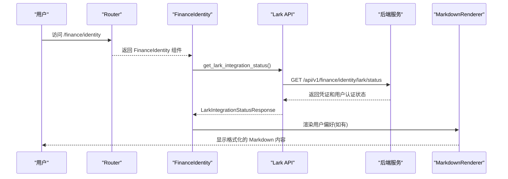

**图表来源**
- [frontend/src/pages/mod.rs:56-164](file://frontend/src/pages/mod.rs#L56-L164)
- [frontend/src/pages/finance/identity.rs:65-75](file://frontend/src/pages/finance/identity.rs#L65-L75)
- [frontend/src/api/lark_integration.rs:21-23](file://frontend/src/api/lark_integration.rs#L21-L23)
- [common/src/api/lark_integration.rs:183-190](file://common/src/api/lark_integration.rs#L183-L190)

**章节来源**
- [frontend/src/pages/mod.rs:1-164](file://frontend/src/pages/mod.rs#L1-L164)
- [frontend/src/api/mod.rs:1-433](file://frontend/src/api/mod.rs#L1-L433)
- [src/router.rs:1-824](file://src/router.rs#L1-L824)
- [frontend/build.rs:1-309](file://frontend/build.rs#L1-L309)
- [frontend/src/pages/user/profile.rs:1-148](file://frontend/src/pages/user/profile.rs#L1-L148)
- [frontend/src/components/markdown.rs:1-206](file://frontend/src/components/markdown.rs#L1-L206)
- [frontend/src/pages/finance/identity.rs:1-579](file://frontend/src/pages/finance/identity.rs#L1-L579)

## 详细组件分析

### 路由与页面组织
- 路由枚举 Route 集中声明所有页面路径与参数，便于类型安全导航。
- 页面按业务域分组：message、organization、hr、finance、project、system、user、workspace、settings、reception。
- SPA深链接支持：后端实现 SpaFallback 服务，对无文件扩展名的路径返回 200 + index.html，由前端路由接管。
- 用户资料页面：`/user/profile` 路由指向 UserProfile 组件，支持个人信息编辑和用户偏好管理。
- **新增**：身份凭证页面：`/finance/identity` 路由指向 FinanceIdentity 组件，提供飞书集成管理功能。
- **更新**：设置页面：`/settings` 路由现在专注于系统配置管理，移除了飞书集成功能。
- 典型页面如聊天页 MessageChat 包含消息列表、SSE 推送、附件上传、项目选择等复杂逻辑。

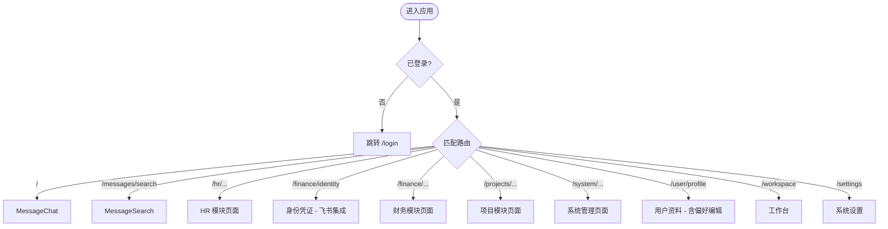

**图表来源**
- [frontend/src/pages/mod.rs:56-164](file://frontend/src/pages/mod.rs#L56-L164)
- [frontend/src/hooks/mod.rs:19-56](file://frontend/src/hooks/mod.rs#L19-L56)

**章节来源**
- [frontend/src/pages/mod.rs:1-164](file://frontend/src/pages/mod.rs#L1-L164)
- [frontend/src/pages/message/chat.rs:30-81](file://frontend/src/pages/message/chat.rs#L30-L81)
- [src/router.rs:19-130](file://src/router.rs#L19-L130)

### 状态管理（认证）
- AuthState 维护 logged_in、role、username、org_id 等字段，并提供 restore、is_admin 等方法。
- 登录态持久化到 localStorage，刷新后恢复；登出时清除本地存储与内存状态。
- use_require_auth 钩子在未登录时重定向至登录页，并在 role=0 时请求用户信息回填真实角色。

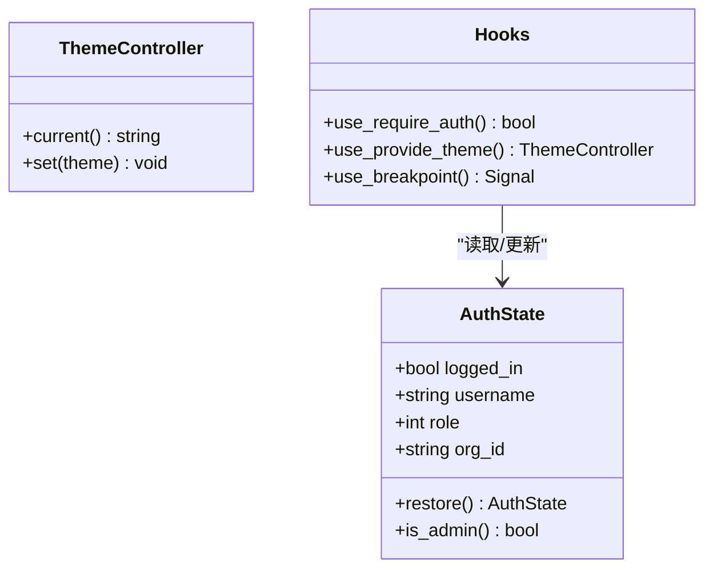

**图表来源**
- [frontend/src/store/auth.rs:59-93](file://frontend/src/store/auth.rs#L59-L93)
- [frontend/src/hooks/mod.rs:19-56](file://frontend/src/hooks/mod.rs#L19-L56)
- [frontend/src/hooks/mod.rs:104-142](file://frontend/src/hooks/mod.rs#L104-L142)

**章节来源**
- [frontend/src/store/auth.rs:1-94](file://frontend/src/store/auth.rs#L1-L94)
- [frontend/src/hooks/mod.rs:1-142](file://frontend/src/hooks/mod.rs#L1-L142)

### 主题系统与响应式
- 主题通过 ThemeController 在根组件提供，子组件通过 use_theme 获取；主题名持久化到 localStorage 并写入 HTML data-theme。
- 可用主题集合 AVAILABLE_THEMES 包含多种内置主题及自定义 orz-light。
- 响应式：App 中监听媒体查询变化，生成 is_mobile 信号供组件使用；CSS 中提供大量针对移动端的适配规则。
- use_breakpoint Hook：提供统一的移动端检测能力，支持768px断点判断。

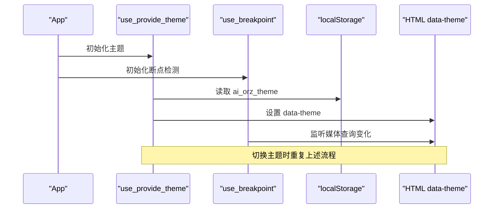

**图表来源**
- [frontend/src/hooks/mod.rs:89-142](file://frontend/src/hooks/mod.rs#L89-L142)
- [frontend/styles/input.css:42-72](file://frontend/styles/input.css#L42-L72)
- [frontend/index.html:1-8](file://frontend/index.html#L1-L8)

**章节来源**
- [frontend/src/hooks/mod.rs:56-142](file://frontend/src/hooks/mod.rs#L56-L142)
- [frontend/styles/input.css:1-202](file://frontend/styles/input.css#L1-L202)
- [frontend/index.html:1-423](file://frontend/index.html#L1-L423)

### API 客户端与错误处理
- 统一封装 GET/POST/PUT/DELETE、文本下载、Multipart 上传、分页 URL 构造。
- 自动处理 401：清除登录态并重定向到 /login。
- 错误解析：从响应体提取 error_code 与 message，网络错误转换为 ApiError。
- 配置注入：通过 current_config().api_url(path) 拼接最终请求地址，统一的配置格式化和序列化，确保URL构建的一致性。
- 用户信息API：get_current_user_info 和 update_current_user 支持用户偏好字段的读写。
- **新增**：飞书集成API：完整的凭证CRUD、用户认证、自动绑定等功能接口。

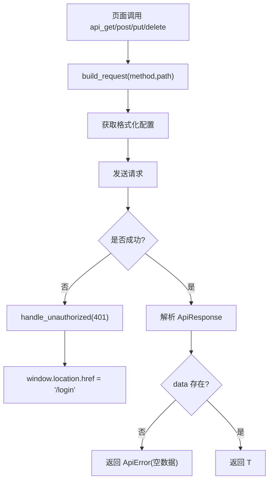

**图表来源**
- [frontend/src/api/mod.rs:26-45](file://frontend/src/api/mod.rs#L26-L45)
- [frontend/src/api/mod.rs:87-114](file://frontend/src/api/mod.rs#L87-L114)
- [frontend/src/api/mod.rs:289-303](file://frontend/src/api/mod.rs#L289-L303)
- [frontend/src/config.rs:85-89](file://frontend/src/config.rs#L85-L89)
- [frontend/src/api/organization.rs:51-61](file://frontend/src/api/organization.rs#L51-L61)

**章节来源**
- [frontend/src/api/mod.rs:1-433](file://frontend/src/api/mod.rs#L1-L433)
- [frontend/src/config.rs:1-94](file://frontend/src/config.rs#L1-L94)
- [frontend/src/api/organization.rs:1-62](file://frontend/src/api/organization.rs#L1-L62)

### 核心页面组件示例：聊天页
- 功能：消息列表、加载更多、SSE 实时推送、附件上传、项目选择、快捷指令菜单、移动端侧边栏抽屉。
- 状态：使用多个 Signal 管理消息、加载状态、选中项目、SSE 连接状态、工具卡片展开等。
- 权限：在所有 hooks 注册后执行 use_require_auth，避免 Dioxus hooks 槽位错乱。

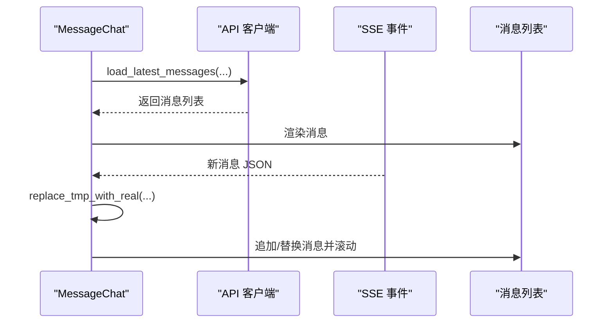

**图表来源**
- [frontend/src/pages/message/chat.rs:30-81](file://frontend/src/pages/message/chat.rs#L30-L81)
- [frontend/src/pages/message/chat.rs:114-200](file://frontend/src/pages/message/chat.rs#L114-L200)

**章节来源**
- [frontend/src/pages/message/chat.rs:1-200](file://frontend/src/pages/message/chat.rs#L1-L200)

### UI 组件库与按钮组件
- 组件库按功能划分：charts、chat、modal、graph、kanban、stats、toast 等。
- 按钮组件 Button 支持多种变体（Primary/Accent/Secondary/Danger/Ghost）、尺寸与禁用状态，内部使用 DaisyUI 类名。

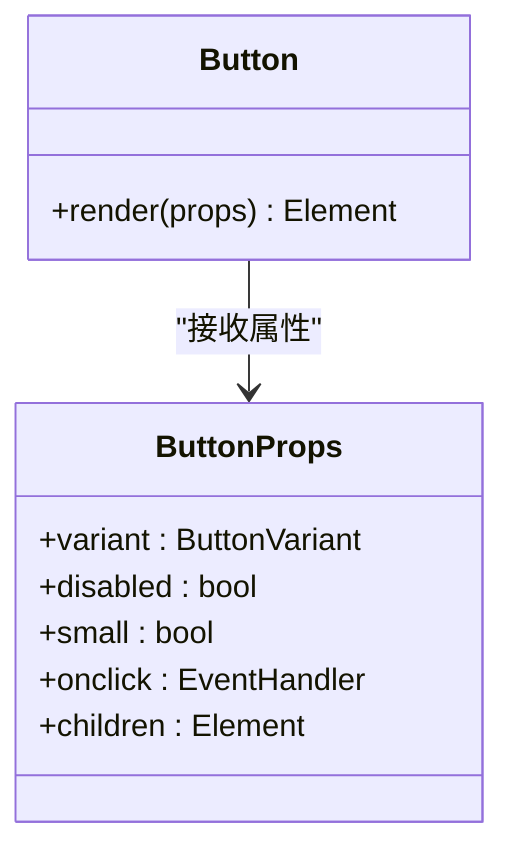

**图表来源**
- [frontend/src/components/button.rs:5-49](file://frontend/src/components/button.rs#L5-L49)

**章节来源**
- [frontend/src/components/mod.rs:1-30](file://frontend/src/components/mod.rs#L1-L30)
- [frontend/src/components/button.rs:1-50](file://frontend/src/components/button.rs#L1-L50)

### 新增：用户偏好编辑组件
- UserProfile：用户资料页面，支持基本信息编辑和用户偏好管理。
- 偏好编辑模式：切换 textarea 编辑模式和 Markdown 预览模式。
- Markdown 渲染：使用 MarkdownRenderer 组件安全地渲染用户偏好的 Markdown 内容。
- 状态管理：preferences 信号管理偏好内容，editing_prefs 信号控制编辑模式。
- API 集成：通过 get_current_user_info 获取用户信息，update_current_user 保存更改。

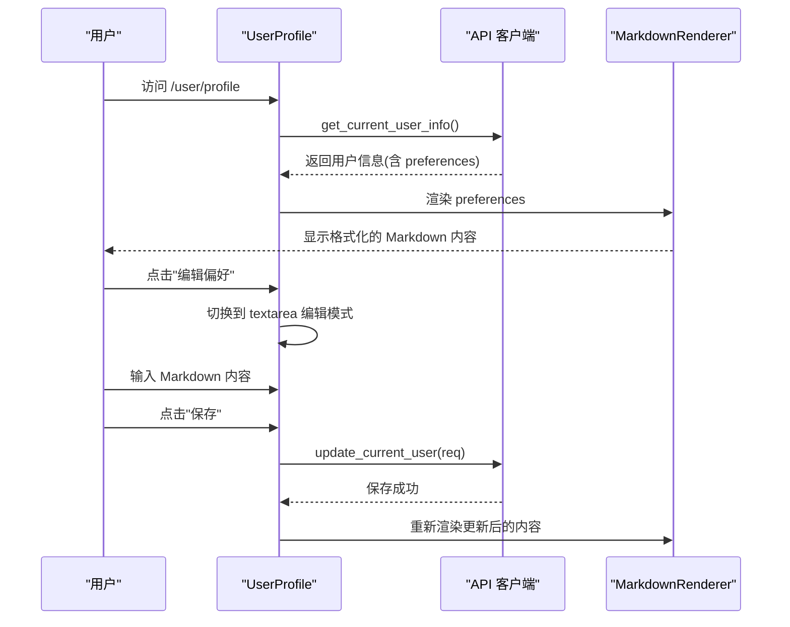

**图表来源**
- [frontend/src/pages/user/profile.rs:14-148](file://frontend/src/pages/user/profile.rs#L14-L148)
- [frontend/src/components/markdown.rs:62-87](file://frontend/src/components/markdown.rs#L62-L87)
- [frontend/src/api/organization.rs:51-61](file://frontend/src/api/organization.rs#L51-L61)

**章节来源**
- [frontend/src/pages/user/profile.rs:1-148](file://frontend/src/pages/user/profile.rs#L1-L148)
- [frontend/src/pages/user/mod.rs:1-2](file://frontend/src/pages/user/mod.rs#L1-L2)
- [frontend/src/components/markdown.rs:1-206](file://frontend/src/components/markdown.rs#L1-L206)
- [frontend/src/api/organization.rs:1-62](file://frontend/src/api/organization.rs#L1-L62)

### 新增：Markdown 渲染组件
- MarkdownRenderer：通用的 Markdown 渲染组件，使用 pulldown-cmark 将 Markdown 转换为 HTML。
- 安全处理：原始 HTML 事件被转义为纯文本，防止 XSS 攻击。
- Mermaid 支持：自动检测和渲染 ```mermaid
代码块为 SVG 图表。
- 紧凑模式：支持 compact 参数，用于小容器内的紧凑显示。
- 缓存优化：使用 use_memo 缓存渲染结果，避免重复计算。
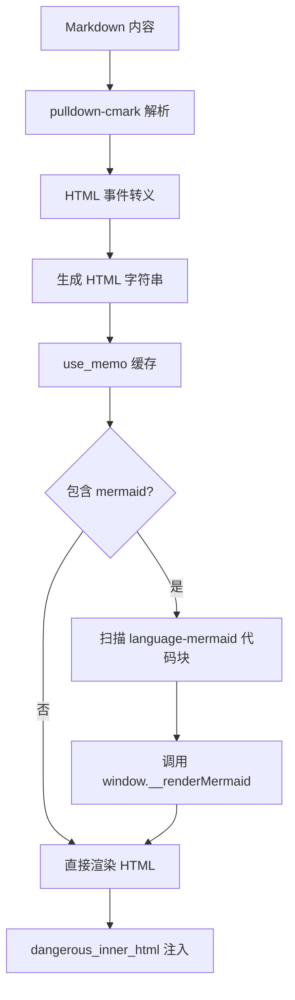

**图表来源**
- [frontend/src/components/markdown.rs:39-87](file://frontend/src/components/markdown.rs#L39-L87)
- [frontend/src/components/markdown.rs:115-141](file://frontend/src/components/markdown.rs#L115-L141)

**章节来源**
- [frontend/src/components/markdown.rs:1-206](file://frontend/src/components/markdown.rs#L1-L206)

### 新增：进程管理组件
- ProcessDetailContent：共享组件，提供进程详情展示、日志查看、终止操作等功能。
- SystemProcesses：进程管理页面，支持列表展示、自动刷新、详情弹窗、批量操作。
- 移动端适配：响应式表格设计，小屏幕下支持横向滚动。

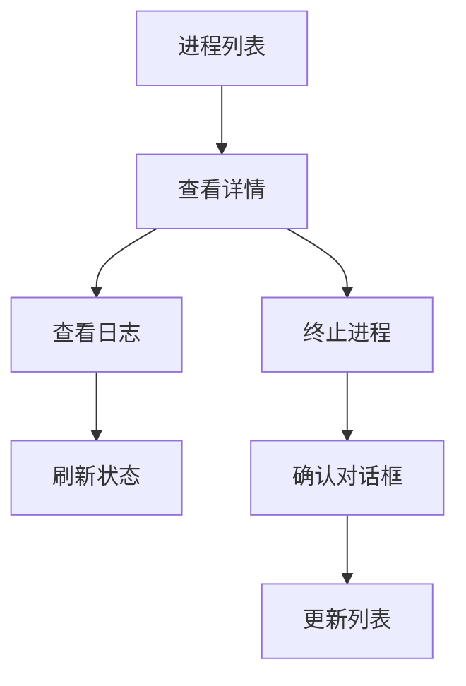

**图表来源**
- [frontend/src/components/process_detail.rs:28-156](file://frontend/src/components/process_detail.rs#L28-L156)
- [frontend/src/pages/system/processes.rs:33-204](file://frontend/src/pages/system/processes.rs#L33-L204)

**章节来源**
- [frontend/src/components/process_detail.rs:1-170](file://frontend/src/components/process_detail.rs#L1-L170)
- [frontend/src/pages/system/processes.rs:1-228](file://frontend/src/pages/system/processes.rs#L1-L228)

### 新增：移动端导航栏集成
- 响应式导航：桌面端显示水平菜单，移动端显示汉堡菜单和抽屉导航。
- 断点检测：使用 use_breakpoint Hook 检测768px断点，动态切换布局。
- 抽屉导航：移动端提供完整的导航抽屉，包含所有功能模块。

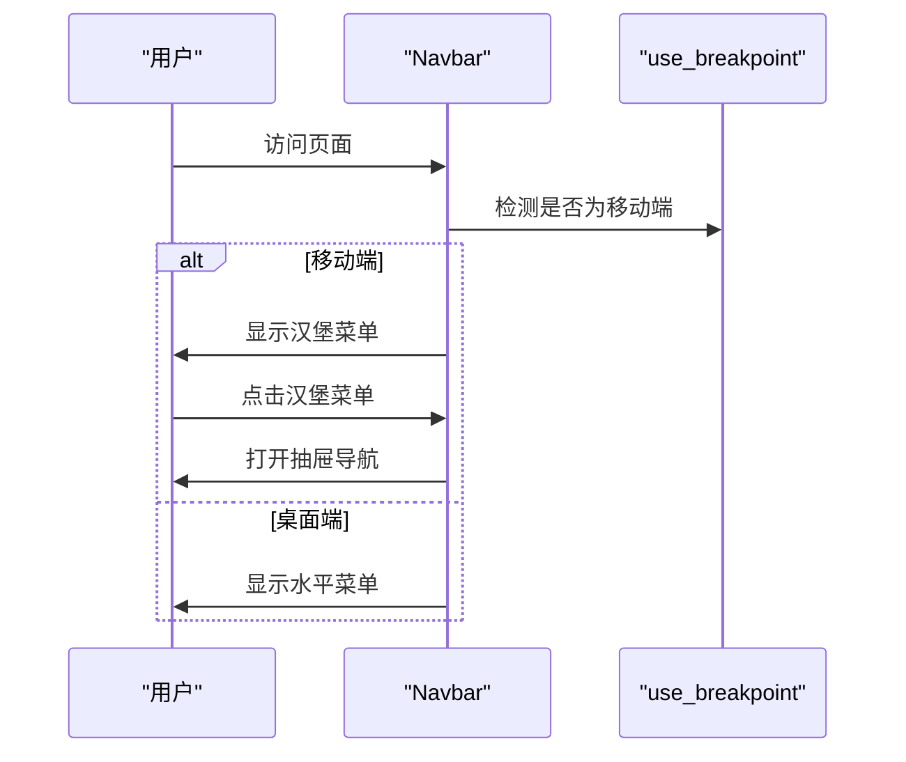

**图表来源**
- [frontend/src/layouts/navbar.rs:10-550](file://frontend/src/layouts/navbar.rs#L10-L550)
- [frontend/src/hooks/mod.rs:15-17](file://frontend/src/hooks/mod.rs#L15-L17)

**章节来源**
- [frontend/src/layouts/navbar.rs:1-1030](file://frontend/src/layouts/navbar.rs#L1-L1030)
- [frontend/src/layouts/app_layout.rs:1-28](file://frontend/src/layouts/app_layout.rs#L1-L28)
- [frontend/src/hooks/mod.rs:1-142](file://frontend/src/hooks/mod.rs#L1-L142)

### 新增：前端配置格式改进
- 统一配置格式：使用 `serde_json::to_string_pretty` 生成格式化的JSON配置，提高可读性和调试便利性。
- 编译时配置嵌入：构建时从后端配置文件读取并生成格式化的配置代码，确保前后端配置一致性。
- 配置优先级管理：支持从浏览器 origin、编译时配置、localStorage 等多级配置源。
- API URL 构建优化：提供统一的 `api_url()` 方法，自动处理协议前缀和路径拼接。

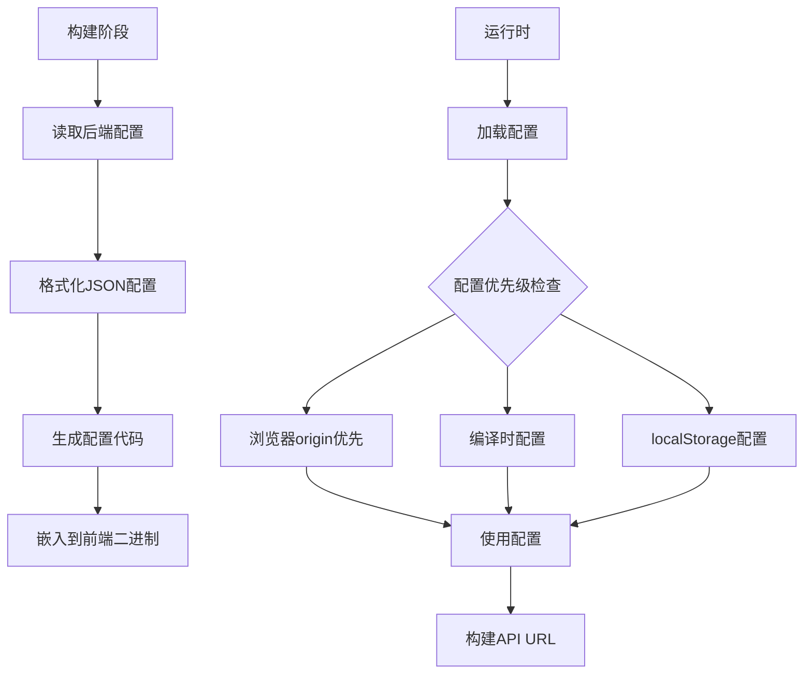

**图表来源**
- [frontend/build.rs:21-48](file://frontend/build.rs#L21-L48)
- [frontend/src/config.rs:19-49](file://frontend/src/config.rs#L19-L49)
- [frontend/src/config.rs:51-89](file://frontend/src/config.rs#L51-L89)

**章节来源**
- [frontend/build.rs:1-309](file://frontend/build.rs#L1-L309)
- [frontend/src/config.rs:1-94](file://frontend/src/config.rs#L1-L94)
- [common/src/config.rs:145-219](file://common/src/config.rs#L145-L219)
- [common/config/ai_orz.toml:1-43](file://common/config/ai_orz.toml#L1-L43)

### 新增：飞书集成管理页面
- **FinanceIdentity**：身份凭证管理页面，提供飞书集成的完整功能。
- **凭证管理**：支持凭证的创建、编辑、删除和设为默认操作。
- **自动绑定流程**：通过 `config init --new` 自动化建应用流程，支持轮询状态和错误处理。
- **用户认证**：完整的 OAuth device flow 授权流程，支持用户身份管理。
- **状态监控**：实时显示凭证状态、关联渠道信息和用户授权状态。
- **模态框交互**：提供创建凭证、编辑凭证、用户授权等多种模态框交互。

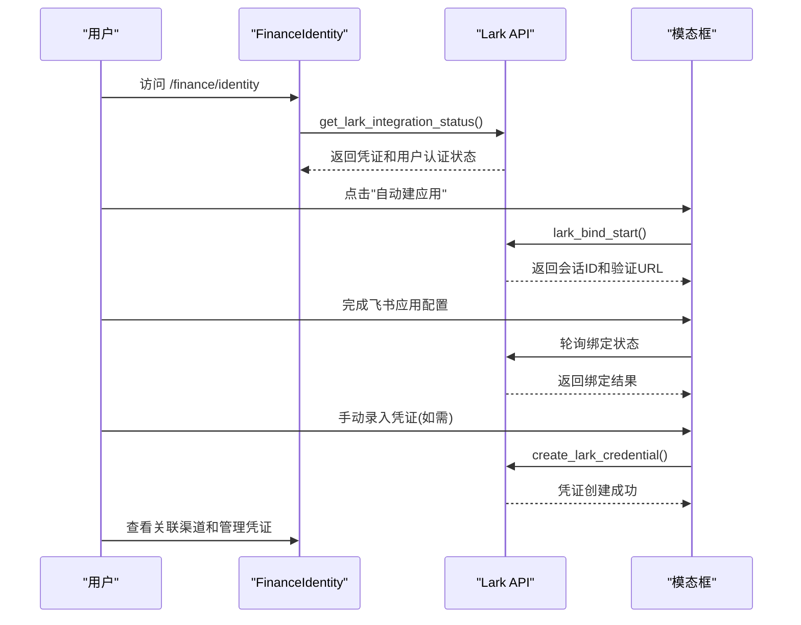

**图表来源**
- [frontend/src/pages/finance/identity.rs:175-236](file://frontend/src/pages/finance/identity.rs#L175-L236)
- [frontend/src/api/lark_integration.rs:86-103](file://frontend/src/api/lark_integration.rs#L86-L103)
- [common/src/api/lark_integration.rs:238-279](file://common/src/api/lark_integration.rs#L238-279)

**章节来源**
- [frontend/src/pages/finance/identity.rs:1-579](file://frontend/src/pages/finance/identity.rs#L1-L579)
- [frontend/src/api/lark_integration.rs:1-173](file://frontend/src/api/lark_integration.rs#L1-L173)
- [common/src/api/lark_integration.rs:1-294](file://common/src/api/lark_integration.rs#L1-L294)

### 新增：飞书集成API客户端
- **凭证CRUD**：create_lark_credential、update_lark_credential、delete_lark_credential 提供完整的凭证管理功能。
- **默认凭证设置**：set_default_lark_credential 支持设置默认凭证用于 lark_cli 工具身份。
- **用户认证**：lark_auth_start、lark_auth_complete、lark_auth_logout 实现完整的 OAuth device flow。
- **自动绑定**：lark_bind_start、lark_bind_status、lark_bind_cancel 支持自动化绑定流程。
- **状态聚合**：get_lark_integration_status 提供统一的绑定状态查询接口。
- **轮询判定**：judge_bind_status 纯函数处理绑定状态轮询逻辑。

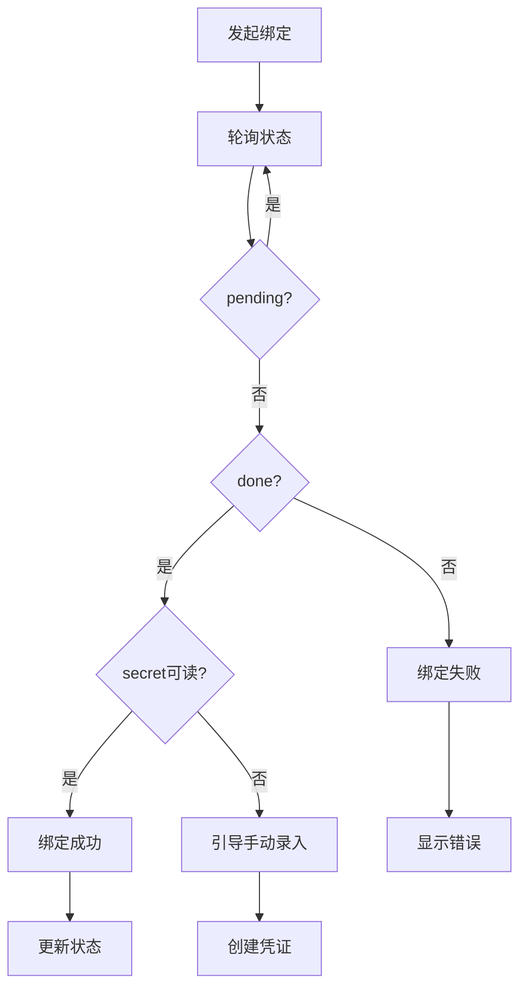

**图表来源**
- [frontend/src/api/lark_integration.rs:86-130](file://frontend/src/api/lark_integration.rs#L86-L130)
- [frontend/src/pages/finance/identity.rs:175-236](file://frontend/src/pages/finance/identity.rs#L175-L236)

**章节来源**
- [frontend/src/api/lark_integration.rs:1-173](file://frontend/src/api/lark_integration.rs#L1-L173)
- [common/src/api/lark_integration.rs:1-294](file://common/src/api/lark_integration.rs#L1-L294)

### 更新：增强的设置页面
- **简化功能**：移除了飞书集成功能，专注于系统配置管理。
- **主题管理**：提供丰富的主题选择和切换功能。
- **API配置**：支持后端API地址的配置和保存。
- **配置持久化**：所有设置自动保存到localStorage。

**章节来源**
- [frontend/src/pages/settings.rs:1-92](file://frontend/src/pages/settings.rs#L1-L92)

## 依赖关系分析
- 运行时依赖：dioxus（web、router）、reqwest（json）、web-sys（浏览器 API）、wasm-bindgen、tracing、common（共享 API 模型）。
- 构建依赖：tailwindcss、daisyui，用于样式生成与主题。
- 配置文件：Dioxus.toml 指定输出目录、资源目录、标题、观察者路径与打包标识；package.json 提供 CSS 构建脚本。
- 构建时依赖 toml 和 serde_json，用于配置文件的解析和格式化。
- Markdown 渲染依赖 pulldown-cmark，用于安全的 Markdown 转换。
- **新增**：飞书集成依赖 common::api::lark_integration 模块，提供类型安全的API接口。

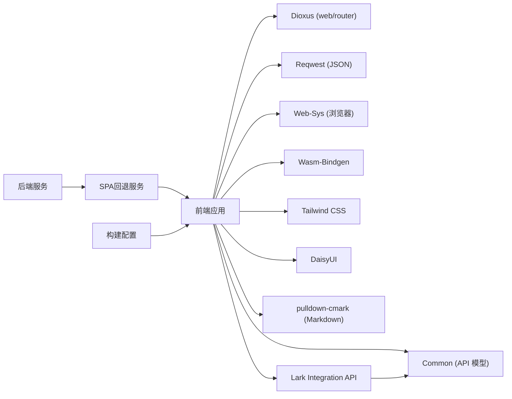

**图表来源**
- [frontend/Cargo.toml:11-25](file://frontend/Cargo.toml#L11-L25)
- [frontend/package.json:4-12](file://frontend/package.json#L4-L12)
- [frontend/Dioxus.toml:1-18](file://frontend/Dioxus.toml#L1-L18)
- [src/router.rs:19-130](file://src/router.rs#L19-L130)
- [frontend/build.rs:6-9](file://frontend/build.rs#L6-L9)
- [frontend/src/components/markdown.rs:23-25](file://frontend/src/components/markdown.rs#L23-L25)
- [frontend/src/api/lark_integration.rs:6-14](file://frontend/src/api/lark_integration.rs#L6-L14)

**章节来源**
- [frontend/Cargo.toml:1-26](file://frontend/Cargo.toml#L1-L26)
- [frontend/package.json:1-14](file://frontend/package.json#L1-L14)
- [frontend/Dioxus.toml:1-18](file://frontend/Dioxus.toml#L1-L18)
- [src/router.rs:1-824](file://src/router.rs#L1-L824)
- [frontend/build.rs:1-309](file://frontend/build.rs#L1-L309)
- [frontend/src/components/markdown.rs:1-206](file://frontend/src/components/markdown.rs#L1-L206)
- [frontend/src/api/lark_integration.rs:1-173](file://frontend/src/api/lark_integration.rs#L1-L173)

## 性能考虑
- 组件渲染：确保 hooks 顺序稳定，避免条件分支导致槽位错位（参考聊天页中的权限检查位置）。
- 数据加载：分页与"加载更多"减少首屏压力；SSE 增量更新避免全量拉取。
- 主题切换：仅修改 data-theme 与 Signal，避免大规模重绘。
- 网络请求：复用 reqwest Client 实例，减少握手开销；统一错误处理降低异常分支成本。
- SPA回退优化：后端直接返回 index.html，避免额外的路由解析开销。
- 移动端优化：响应式布局减少不必要的渲染，抽屉导航提升用户体验。
- 配置缓存：配置对象在内存中缓存，避免重复序列化/反序列化开销。
- Markdown 渲染优化：使用 use_memo 缓存渲染结果，避免重复解析；延迟扫描 Mermaid 代码块。
- **新增**：飞书集成优化：凭证状态轮询使用定时器控制频率，避免频繁API调用；模态框状态管理减少不必要的重渲染。
- **新增**：设置页面优化：简化功能后减少了组件复杂度，提升了加载速度。

## 故障排查指南
- 401 未授权：API 客户端会自动清除登录态并重定向到 /login；检查 Cookie 与后端鉴权中间件。
- 主题不生效：确认 HTML data-theme 是否正确设置；检查 localStorage 中 ai_orz_theme 的值。
- 路由跳转无效：确认 Route 枚举中是否存在对应路径；检查 use_require_auth 的重定向逻辑。
- 样式缺失：确认 Tailwind 构建产物 output.css 已生成并被 index.html 引用。
- SPA深链接404错误：检查后端 SpaFallback 服务是否正确配置，确认 index.html 文件存在且可读。
- 移动端导航异常：检查 use_breakpoint Hook 是否正确初始化，确认媒体查询监听器正常工作。
- 配置加载失败：检查浏览器 localStorage 中 ai_orz_config 的格式，确认编译时配置正确嵌入。
- Markdown 渲染异常：确认 pulldown-cmark 依赖正确安装，检查 Mermaid 渲染函数是否在 window 对象上可用。
- 用户偏好保存失败：检查 update_current_user API 调用是否正确，确认 preferences 字段格式有效。
- **新增**：飞书集成API错误：检查网络连接、凭证有效性、OAuth配置是否正确；查看具体的错误码和提示信息。
- **新增**：自动绑定流程异常：确认飞书应用配置权限是否正确，检查验证链接是否有效，查看轮询状态是否正常。
- **新增**：用户认证失败：检查device flow配置、回调URL设置、权限范围是否正确；确认用户已完成浏览器授权。
- **新增**：设置页面配置保存失败：检查localStorage权限和网络连接，确认API地址格式正确。

**章节来源**
- [frontend/src/api/mod.rs:37-45](file://frontend/src/api/mod.rs#L37-L45)
- [frontend/src/hooks/mod.rs:89-118](file://frontend/src/hooks/mod.rs#L89-L118)
- [frontend/index.html:1-8](file://frontend/index.html#L1-L8)
- [src/router.rs:19-130](file://src/router.rs#L19-L130)
- [frontend/src/config.rs:51-89](file://frontend/src/config.rs#L51-L89)
- [frontend/src/components/markdown.rs:149-161](file://frontend/src/components/markdown.rs#L149-L161)
- [frontend/src/pages/user/profile.rs:114-137](file://frontend/src/pages/user/profile.rs#L114-L137)
- [frontend/src/pages/finance/identity.rs:175-309](file://frontend/src/pages/finance/identity.rs#L175-L309)
- [frontend/src/pages/settings.rs:19-32](file://frontend/src/pages/settings.rs#L19-L32)

## 结论
AI Orz 前端采用 Dioxus 构建，具备清晰的分层结构与可维护的组件体系。通过统一的路由、状态管理与 API 客户端，实现了良好的可扩展性与一致性。SPA深链接处理机制确保了所有路由都能正确加载，完善的移动端适配提升了用户体验，前端配置格式改进提供了更一致的开发体验，用户偏好编辑功能丰富了用户的个性化设置能力。主题系统与响应式设计进一步增强了应用的可用性。**新增的飞书集成页面提供了完整的凭证管理和用户认证功能，支持自动化绑定流程和OAuth授权，为企业级集成提供了强大的基础设施**。同时，增强的Markdown渲染能力和简化的设置页面进一步提升了用户体验和可维护性。建议后续继续完善组件文档与测试覆盖，持续优化性能与可访问性。

## 附录

### 构建与运行
- 安装依赖：进入 frontend 目录，执行 npm install（如需 Tailwind/DaisyUI 相关工具）。
- 构建 CSS：npm run build:css 或 watch:css 进行热更新。
- 启动开发：使用 Dioxus 提供的 dev/watch 命令（见 Dioxus.toml 配置），观察 src、public、index.html 变更。
- 生产构建：根据 Dioxus.toml 输出到 dist 目录，确保 asset_dir 指向 public。
- 配置构建：构建时自动读取后端配置文件并生成格式化的前端配置代码。

**章节来源**
- [frontend/package.json:4-12](file://frontend/package.json#L4-L12)
- [frontend/Dioxus.toml:1-18](file://frontend/Dioxus.toml#L1-L18)
- [frontend/build.rs:11-50](file://frontend/build.rs#L11-L50)

### 样式定制指南
- 主题变量：在 input.css 中通过 @theme 与 data-theme 块自定义颜色、圆角、边框等。
- 自定义动画：typing、HUD 流光、知识图谱节点/边动画等已在 CSS 中定义，可直接复用。
- 响应式：利用 Tailwind 的断点与媒体查询，结合 index.html 中的移动端适配样式。
- 移动端适配：768px断点下的特殊样式，包括字体大小、触摸目标、导航布局等。
- Markdown 样式：`.markdown-body` 和 `.markdown-compact` 类提供统一的 Markdown 渲染样式。

**章节来源**
- [frontend/styles/input.css:42-72](file://frontend/styles/input.css#L42-L72)
- [frontend/styles/input.css:74-202](file://frontend/styles/input.css#L74-L202)
- [frontend/index.html:8-417](file://frontend/index.html#L8-L417)
- [frontend/styles/input.css:205-372](file://frontend/styles/input.css#L205-L372)

### 组件使用示例
- 按钮：使用 Button 组件并传入 variant、disabled、small、onclick 与 children。
- 主题切换：在根组件调用 use_provide_theme，子组件通过 use_theme 获取控制器并调用 set 切换主题。
- 认证守卫：在页面顶部调用 use_require_auth，未登录将自动跳转到登录页。
- 移动端检测：使用 use_breakpoint Hook 获取移动端状态，实现响应式逻辑。
- 进程详情：使用 ProcessDetailContent 组件展示进程信息和操作功能。
- 配置管理：使用 FrontendConfig 进行配置的加载、保存和重置操作。
- Markdown 渲染：使用 MarkdownRenderer 组件安全地渲染 Markdown 内容。
- 用户偏好编辑：在 UserProfile 组件中使用 preferences 信号管理偏好内容。
- **新增**：飞书集成：使用 FinanceIdentity 组件管理飞书凭证和用户认证。
- **新增**：设置管理：使用 Settings 组件进行系统配置管理。

**章节来源**
- [frontend/src/components/button.rs:15-49](file://frontend/src/components/button.rs#L15-L49)
- [frontend/src/hooks/mod.rs:104-142](file://frontend/src/hooks/mod.rs#L104-L142)
- [frontend/src/hooks/mod.rs:19-56](file://frontend/src/hooks/mod.rs#L19-L56)
- [frontend/src/components/process_detail.rs:28-156](file://frontend/src/components/process_detail.rs#L28-L156)
- [frontend/src/pages/settings.rs:11-89](file://frontend/src/pages/settings.rs#L11-L89)
- [frontend/src/components/markdown.rs:13-21](file://frontend/src/components/markdown.rs#L13-L21)
- [frontend/src/pages/user/profile.rs:21-25](file://frontend/src/pages/user/profile.rs#L21-L25)
- [frontend/src/pages/finance/identity.rs:25-579](file://frontend/src/pages/finance/identity.rs#L25-L579)

### SPA深链接处理机制
- 后端实现：SpaFallback 服务检测请求路径，对无文件扩展名的路径返回 200 + index.html。
- 前端路由：Dioxus Router 接管所有前端路由，确保单页应用体验。
- SEO友好：使用 200 状态码而非 404，有利于搜索引擎索引和健康探测。
- 部署配置：确保 index.html 文件存在于静态资源目录，后端能正确读取。

**章节来源**
- [src/router.rs:19-130](file://src/router.rs#L19-L130)

### 移动端适配特性
- 断点检测：768px 断点，支持窗口大小变化时的动态响应。
- 导航适配：桌面端水平菜单，移动端汉堡菜单和抽屉导航。
- 触摸优化：增大的触摸目标、优化的输入框字体、移除 hover 效果。
- 布局调整：单栏布局、侧边栏滑出、内容区域自适应。

**章节来源**
- [frontend/src/hooks/mod.rs:15-17](file://frontend/src/hooks/mod.rs#L15-L17)
- [frontend/src/layouts/navbar.rs:553-800](file://frontend/src/layouts/navbar.rs#L553-L800)
- [frontend/index.html:241-310](file://frontend/index.html#L241-L310)

### 前端配置格式改进特性
- 统一序列化格式：使用 `serde_json::to_string_pretty` 生成人类可读的JSON配置。
- 编译时配置生成：构建时从后端配置生成前端可用的配置代码。
- 多级配置优先级：浏览器 origin > 编译时配置 > localStorage 配置。
- API URL 构建工具：提供统一的 `api_url()` 方法处理协议和路径拼接。
- 配置持久化：支持将用户配置保存到 localStorage，下次启动时自动恢复。

**章节来源**
- [frontend/build.rs:30-48](file://frontend/build.rs#L30-L48)
- [frontend/src/config.rs:19-49](file://frontend/src/config.rs#L19-L49)
- [frontend/src/config.rs:51-89](file://frontend/src/config.rs#L51-L89)
- [frontend/src/pages/settings.rs:11-89](file://frontend/src/pages/settings.rs#L11-L89)

### 用户偏好编辑功能特性
- Markdown 支持：用户可以使用 Markdown 语法编写个人偏好，支持标题、列表、代码块等格式。
- 安全渲染：使用 MarkdownRenderer 组件进行安全的 Markdown 转 HTML 渲染，防止 XSS 攻击。
- 编辑模式切换：支持 textarea 编辑模式和 Markdown 预览模式的无缝切换。
- 状态管理：使用 Dioxus 的 Signal 管理偏好内容和编辑状态。
- API 集成：通过 update_current_user API 保存用户偏好到后端数据库。
- 样式适配：使用 markdown-compact 类实现紧凑的预览显示，适合在小容器中展示。

**章节来源**
- [frontend/src/pages/user/profile.rs:21-111](file://frontend/src/pages/user/profile.rs#L21-L111)
- [frontend/src/components/markdown.rs:62-87](file://frontend/src/components/markdown.rs#L62-L87)
- [frontend/src/api/organization.rs:56-61](file://frontend/src/api/organization.rs#L56-L61)
- [frontend/styles/input.css:337-372](file://frontend/styles/input.css#L337-L372)

### Markdown 渲染组件特性
- 安全处理：原始 HTML 事件被转义为纯文本，确保 dangerous_inner_html 注入的安全性。
- Mermaid 支持：自动检测和渲染 ```mermaid 代码块为交互式 SVG 图表。
- 性能优化：使用 use_memo 缓存渲染结果，避免重复解析。
- 紧凑模式：支持 compact 参数，用于小容器内的紧凑显示。
- 样式兼容：复用 input.css 中的 .markdown-body 样式，支持 30+ 种 DaisyUI 主题。
- 测试覆盖：包含完整的单元测试，验证各种 Markdown 语法的正确渲染。

**章节来源**
- [frontend/src/components/markdown.rs:1-206](file://frontend/src/components/markdown.rs#L1-L206)
- [frontend/styles/input.css:205-372](file://frontend/styles/input.css#L205-L372)

### 飞书集成页面特性
- 凭证管理：支持凭证的创建、编辑、删除和设为默认操作。
- 自动绑定：通过 `config init --new` 实现自动化建应用流程，支持轮询状态和错误处理。
- 用户认证：完整的 OAuth device flow 授权流程，支持用户身份管理。
- 状态监控：实时显示凭证状态、关联渠道信息和用户授权状态。
- 模态框交互：提供创建凭证、编辑凭证、用户授权等多种模态框交互。
- API集成：完整的飞书集成API客户端，提供类型安全的接口调用。
- 错误处理：完善的错误处理和用户友好的提示信息。

**章节来源**
- [frontend/src/pages/finance/identity.rs:1-579](file://frontend/src/pages/finance/identity.rs#L1-L579)
- [frontend/src/api/lark_integration.rs:1-173](file://frontend/src/api/lark_integration.rs#L1-L173)
- [common/src/api/lark_integration.rs:1-294](file://common/src/api/lark_integration.rs#L1-L294)

### 设置页面特性
- 主题管理：提供丰富的主题选择和切换功能。
- API配置：支持后端API地址的配置和保存。
- 配置持久化：所有设置自动保存到localStorage。
- 简化功能：移除了飞书集成功能，专注于系统配置管理。

**章节来源**
- [frontend/src/pages/settings.rs:1-92](file://frontend/src/pages/settings.rs#L1-L92)