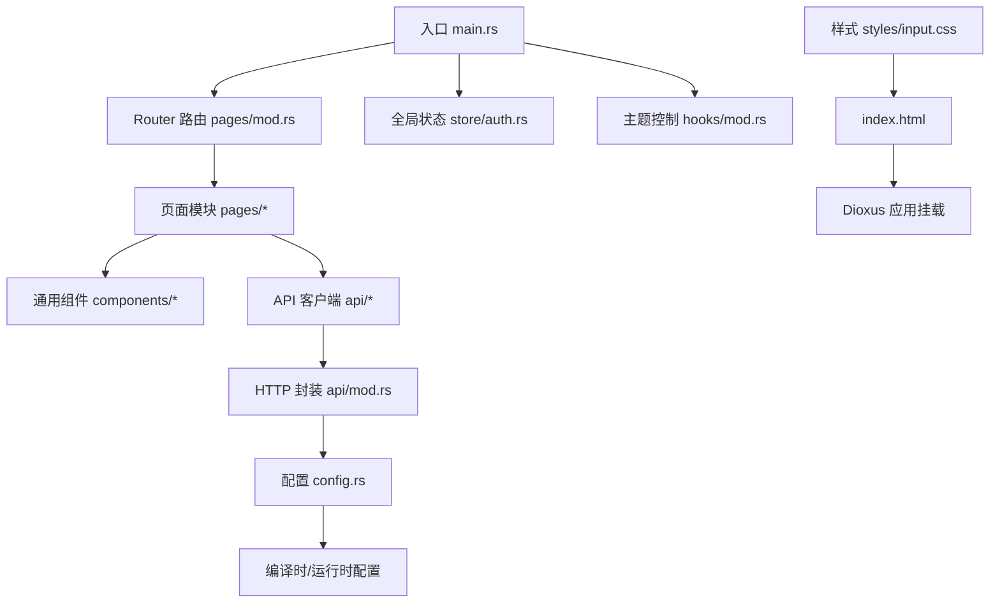
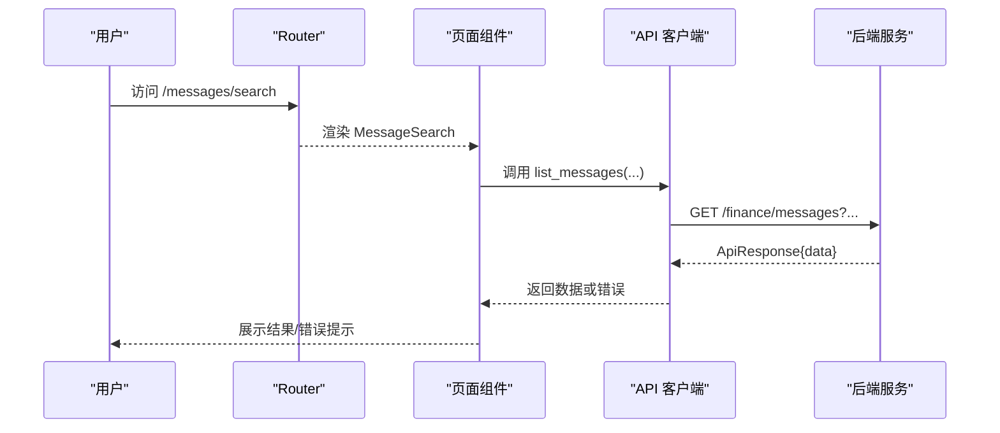
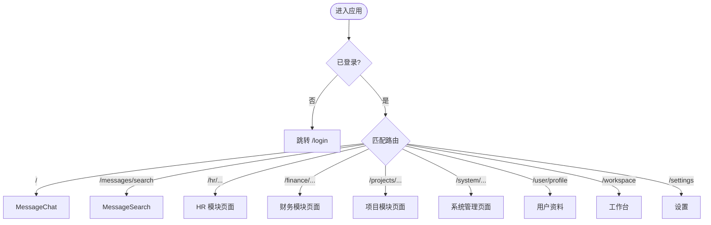
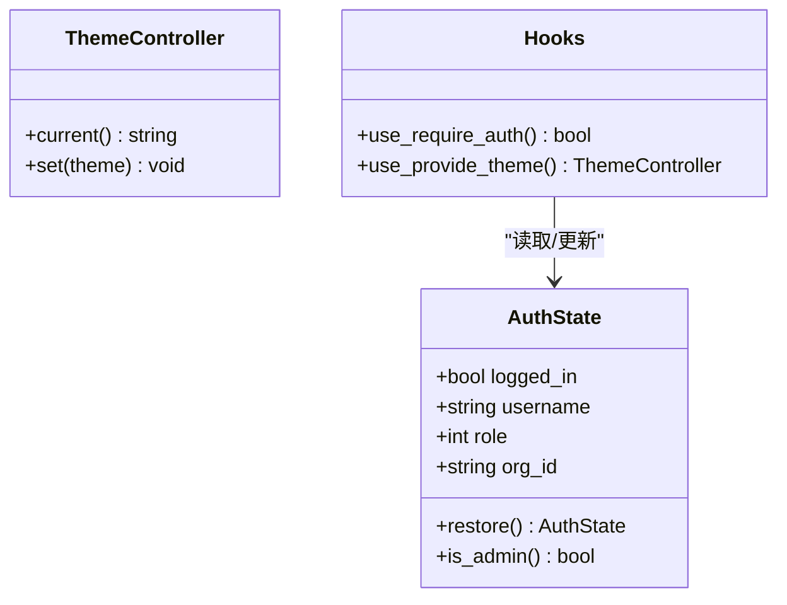
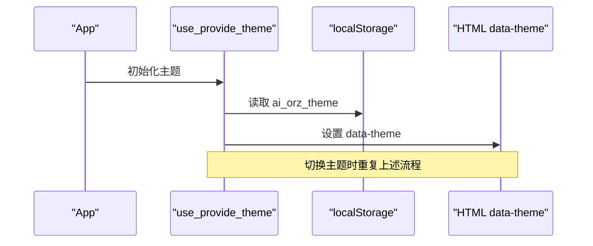
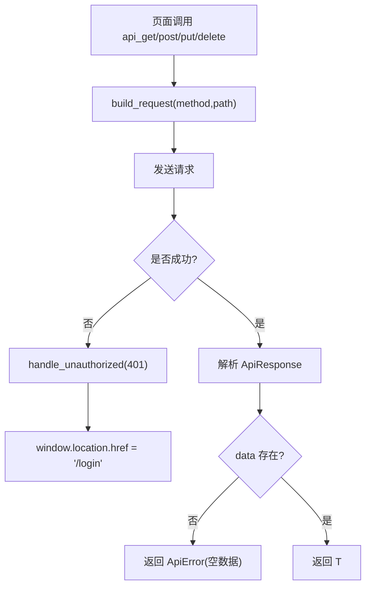
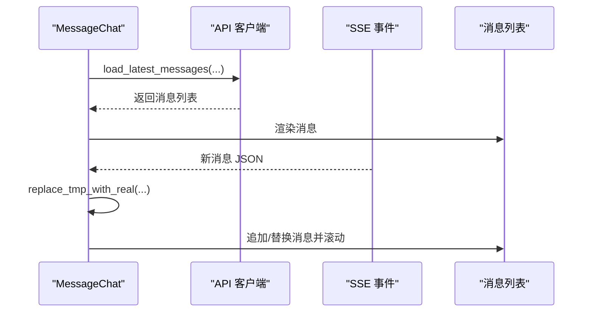
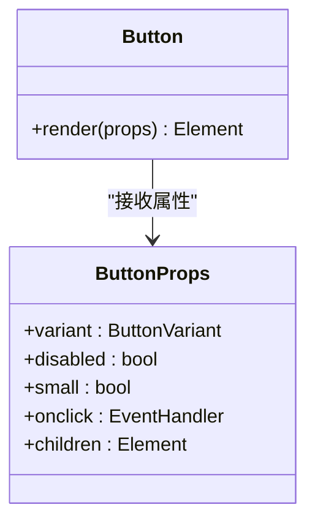
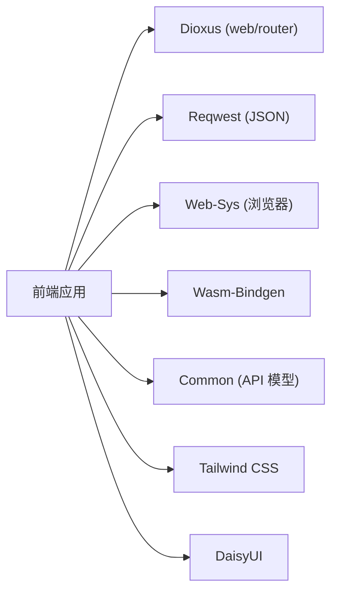

# 前端应用

<cite>
**本文引用的文件**
- [frontend/Cargo.toml](file://frontend/Cargo.toml)
- [frontend/Dioxus.toml](file://frontend/Dioxus.toml)
- [frontend/package.json](file://frontend/package.json)
- [frontend/index.html](file://frontend/index.html)
- [frontend/src/main.rs](file://frontend/src/main.rs)
- [frontend/src/pages/mod.rs](file://frontend/src/pages/mod.rs)
- [frontend/src/components/mod.rs](file://frontend/src/components/mod.rs)
- [frontend/src/store/mod.rs](file://frontend/src/store/mod.rs)
- [frontend/src/store/auth.rs](file://frontend/src/store/auth.rs)
- [frontend/src/hooks/mod.rs](file://frontend/src/hooks/mod.rs)
- [frontend/src/api/mod.rs](file://frontend/src/api/mod.rs)
- [frontend/src/config.rs](file://frontend/src/config.rs)
- [frontend/styles/input.css](file://frontend/styles/input.css)
- [frontend/src/pages/message/chat.rs](file://frontend/src/pages/message/chat.rs)
- [frontend/src/components/button.rs](file://frontend/src/components/button.rs)
</cite>

## 目录
1. [简介](#简介)
2. [项目结构](#项目结构)
3. [核心组件](#核心组件)
4. [架构总览](#架构总览)
5. [详细组件分析](#详细组件分析)
6. [依赖关系分析](#依赖关系分析)
7. [性能考虑](#性能考虑)
8. [故障排查指南](#故障排查指南)
9. [结论](#结论)
10. [附录](#附录)

## 简介
本文件为 AI Orz 前端应用的完整开发文档，面向使用 Dioxus 构建的 Web 应用。内容涵盖：
- 基于 Dioxus 的组件架构、状态管理、路由导航与 API 客户端
- 核心页面组件、UI 组件库、主题系统与响应式设计
- 前端构建配置、开发环境与部署流程
- 组件使用示例、页面流程图与样式定制指南
目标是帮助前端开发者快速理解并扩展该前端工程。

## 项目结构
前端位于 frontend 目录，采用 Dioxus + Tailwind CSS + DaisyUI 的技术栈，按业务域组织页面与组件，统一通过 API 客户端访问后端服务。

图表来源
- [frontend/src/main.rs:24-57](file://frontend/src/main.rs#L24-L57)
- [frontend/src/pages/mod.rs:56-154](file://frontend/src/pages/mod.rs#L56-L154)
- [frontend/src/api/mod.rs:26-45](file://frontend/src/api/mod.rs#L26-L45)
- [frontend/src/config.rs:19-40](file://frontend/src/config.rs#L19-L40)
- [frontend/styles/input.css:1-45](file://frontend/styles/input.css#L1-L45)
- [frontend/index.html:1-8](file://frontend/index.html#L1-L8)

章节来源
- [frontend/Cargo.toml:1-26](file://frontend/Cargo.toml#L1-L26)
- [frontend/Dioxus.toml:1-18](file://frontend/Dioxus.toml#L1-L18)
- [frontend/package.json:1-14](file://frontend/package.json#L1-L14)
- [frontend/src/main.rs:1-58](file://frontend/src/main.rs#L1-L58)
- [frontend/src/pages/mod.rs:1-155](file://frontend/src/pages/mod.rs#L1-L155)
- [frontend/src/components/mod.rs:1-30](file://frontend/src/components/mod.rs#L1-L30)
- [frontend/src/store/mod.rs:1-5](file://frontend/src/store/mod.rs#L1-L5)
- [frontend/src/hooks/mod.rs:1-140](file://frontend/src/hooks/mod.rs#L1-L140)
- [frontend/src/api/mod.rs:1-433](file://frontend/src/api/mod.rs#L1-L433)
- [frontend/src/config.rs:1-85](file://frontend/src/config.rs#L1-L85)
- [frontend/styles/input.css:1-202](file://frontend/styles/input.css#L1-L202)
- [frontend/index.html:1-423](file://frontend/index.html#L1-L423)

## 核心组件
- 应用根组件 App：初始化认证上下文、Toast 容器、主题控制器、移动端断点信号，并挂载 Router。
- 路由系统：集中定义所有页面路由，覆盖登录、消息、组织、HR、财务、项目、系统、用户、工作台、设置等模块。
- 状态管理：AuthState 负责登录态、角色、组织信息；提供持久化与恢复能力。
- 主题系统：ThemeController 提供当前主题读取与切换，持久化到 localStorage 并同步到 HTML data-theme。
- API 客户端：统一的 HTTP 封装，处理 401 重定向、错误解析、分页 URL 构造、表单上传等。
- 配置管理：FrontendConfig 支持从编译时默认值与 localStorage 中加载，提供 api_url 拼接。

章节来源
- [frontend/src/main.rs:24-57](file://frontend/src/main.rs#L24-L57)
- [frontend/src/pages/mod.rs:56-154](file://frontend/src/pages/mod.rs#L56-L154)
- [frontend/src/store/auth.rs:59-93](file://frontend/src/store/auth.rs#L59-L93)
- [frontend/src/hooks/mod.rs:56-139](file://frontend/src/hooks/mod.rs#L56-L139)
- [frontend/src/api/mod.rs:26-45](file://frontend/src/api/mod.rs#L26-L45)
- [frontend/src/config.rs:11-85](file://frontend/src/config.rs#L11-L85)

## 架构总览
前端以 Dioxus 为渲染引擎，通过 Router 驱动页面；页面组件调用 API 客户端进行数据交互；全局状态（认证、Toast、主题）通过 Context 共享；样式由 Tailwind + DaisyUI 提供，并通过自定义 CSS 增强视觉效果。

图表来源
- [frontend/src/pages/mod.rs:56-154](file://frontend/src/pages/mod.rs#L56-L154)
- [frontend/src/api/mod.rs:87-114](file://frontend/src/api/mod.rs#L87-L114)
- [frontend/src/api/mod.rs:289-303](file://frontend/src/api/mod.rs#L289-L303)

章节来源
- [frontend/src/pages/mod.rs:1-155](file://frontend/src/pages/mod.rs#L1-L155)
- [frontend/src/api/mod.rs:1-433](file://frontend/src/api/mod.rs#L1-L433)

## 详细组件分析

### 路由与页面组织
- 路由枚举 Route 集中声明所有页面路径与参数，便于类型安全导航。
- 页面按业务域分组：message、organization、hr、finance、project、system、user、workspace、settings、reception。
- 典型页面如聊天页 MessageChat 包含消息列表、SSE 推送、附件上传、项目选择等复杂逻辑。

图表来源
- [frontend/src/pages/mod.rs:56-154](file://frontend/src/pages/mod.rs#L56-L154)
- [frontend/src/hooks/mod.rs:19-54](file://frontend/src/hooks/mod.rs#L19-L54)

章节来源
- [frontend/src/pages/mod.rs:1-155](file://frontend/src/pages/mod.rs#L1-L155)
- [frontend/src/pages/message/chat.rs:30-81](file://frontend/src/pages/message/chat.rs#L30-L81)

### 状态管理（认证）
- AuthState 维护 logged_in、role、username、org_id 等字段，并提供 restore、is_admin 等方法。
- 登录态持久化到 localStorage，刷新后恢复；登出时清除本地存储与内存状态。
- use_require_auth 钩子在未登录时重定向至登录页，并在 role=0 时请求用户信息回填真实角色。

图表来源
- [frontend/src/store/auth.rs:59-93](file://frontend/src/store/auth.rs#L59-L93)
- [frontend/src/hooks/mod.rs:19-54](file://frontend/src/hooks/mod.rs#L19-L54)
- [frontend/src/hooks/mod.rs:102-139](file://frontend/src/hooks/mod.rs#L102-L139)

章节来源
- [frontend/src/store/auth.rs:1-94](file://frontend/src/store/auth.rs#L1-L94)
- [frontend/src/hooks/mod.rs:1-140](file://frontend/src/hooks/mod.rs#L1-L140)

### 主题系统与响应式
- 主题通过 ThemeController 在根组件提供，子组件通过 use_theme 获取；主题名持久化到 localStorage 并写入 HTML data-theme。
- 可用主题集合 AVAILABLE_THEMES 包含多种内置主题及自定义 orz-light。
- 响应式：App 中监听媒体查询变化，生成 is_mobile 信号供组件使用；CSS 中提供大量针对移动端的适配规则。

图表来源
- [frontend/src/hooks/mod.rs:87-139](file://frontend/src/hooks/mod.rs#L87-L139)
- [frontend/styles/input.css:42-72](file://frontend/styles/input.css#L42-L72)
- [frontend/index.html:1-8](file://frontend/index.html#L1-L8)

章节来源
- [frontend/src/hooks/mod.rs:56-139](file://frontend/src/hooks/mod.rs#L56-L139)
- [frontend/styles/input.css:1-202](file://frontend/styles/input.css#L1-L202)
- [frontend/index.html:1-423](file://frontend/index.html#L1-L423)

### API 客户端与错误处理
- 统一封装 GET/POST/PUT/DELETE、文本下载、Multipart 上传、分页 URL 构造。
- 自动处理 401：清除登录态并重定向到 /login。
- 错误解析：从响应体提取 error_code 与 message，网络错误转换为 ApiError。
- 配置注入：通过 current_config().api_url(path) 拼接最终请求地址。

图表来源
- [frontend/src/api/mod.rs:26-45](file://frontend/src/api/mod.rs#L26-L45)
- [frontend/src/api/mod.rs:87-114](file://frontend/src/api/mod.rs#L87-L114)
- [frontend/src/api/mod.rs:289-303](file://frontend/src/api/mod.rs#L289-L303)
- [frontend/src/config.rs:76-85](file://frontend/src/config.rs#L76-L85)

章节来源
- [frontend/src/api/mod.rs:1-433](file://frontend/src/api/mod.rs#L1-L433)
- [frontend/src/config.rs:1-85](file://frontend/src/config.rs#L1-L85)

### 核心页面组件示例：聊天页
- 功能：消息列表、加载更多、SSE 实时推送、附件上传、项目选择、快捷指令菜单、移动端侧边栏抽屉。
- 状态：使用多个 Signal 管理消息、加载状态、选中项目、SSE 连接状态、工具卡片展开等。
- 权限：在所有 hooks 注册后执行 use_require_auth，避免 Dioxus hooks 槽位错乱。

图表来源
- [frontend/src/pages/message/chat.rs:30-81](file://frontend/src/pages/message/chat.rs#L30-L81)
- [frontend/src/pages/message/chat.rs:114-200](file://frontend/src/pages/message/chat.rs#L114-L200)

章节来源
- [frontend/src/pages/message/chat.rs:1-200](file://frontend/src/pages/message/chat.rs#L1-L200)

### UI 组件库与按钮组件
- 组件库按功能划分：charts、chat、modal、graph、kanban、stats、toast 等。
- 按钮组件 Button 支持多种变体（Primary/Accent/Secondary/Danger/Ghost）、尺寸与禁用状态，内部使用 DaisyUI 类名。

图表来源
- [frontend/src/components/button.rs:5-49](file://frontend/src/components/button.rs#L5-L49)

章节来源
- [frontend/src/components/mod.rs:1-30](file://frontend/src/components/mod.rs#L1-L30)
- [frontend/src/components/button.rs:1-50](file://frontend/src/components/button.rs#L1-L50)

## 依赖关系分析
- 运行时依赖：dioxus（web、router）、reqwest（json）、web-sys（浏览器 API）、wasm-bindgen、tracing、common（共享 API 模型）。
- 构建依赖：tailwindcss、daisyui，用于样式生成与主题。
- 配置文件：Dioxus.toml 指定输出目录、资源目录、标题、观察者路径与打包标识；package.json 提供 CSS 构建脚本。

图表来源
- [frontend/Cargo.toml:11-25](file://frontend/Cargo.toml#L11-L25)
- [frontend/package.json:4-12](file://frontend/package.json#L4-L12)
- [frontend/Dioxus.toml:1-18](file://frontend/Dioxus.toml#L1-L18)

章节来源
- [frontend/Cargo.toml:1-26](file://frontend/Cargo.toml#L1-L26)
- [frontend/package.json:1-14](file://frontend/package.json#L1-L14)
- [frontend/Dioxus.toml:1-18](file://frontend/Dioxus.toml#L1-L18)

## 性能考虑
- 组件渲染：确保 hooks 顺序稳定，避免条件分支导致槽位错位（参考聊天页中的权限检查位置）。
- 数据加载：分页与“加载更多”减少首屏压力；SSE 增量更新避免全量拉取。
- 主题切换：仅修改 data-theme 与 Signal，避免大规模重绘。
- 网络请求：复用 reqwest Client 实例，减少握手开销；统一错误处理降低异常分支成本。

[本节为通用指导，不直接分析具体文件]

## 故障排查指南
- 401 未授权：API 客户端会自动清除登录态并重定向到 /login；检查 Cookie 与后端鉴权中间件。
- 主题不生效：确认 HTML data-theme 是否正确设置；检查 localStorage 中 ai_orz_theme 的值。
- 路由跳转无效：确认 Route 枚举中是否存在对应路径；检查 use_require_auth 的重定向逻辑。
- 样式缺失：确认 Tailwind 构建产物 output.css 已生成并被 index.html 引用。

章节来源
- [frontend/src/api/mod.rs:37-45](file://frontend/src/api/mod.rs#L37-L45)
- [frontend/src/hooks/mod.rs:87-118](file://frontend/src/hooks/mod.rs#L87-L118)
- [frontend/index.html:1-8](file://frontend/index.html#L1-L8)

## 结论
AI Orz 前端采用 Dioxus 构建，具备清晰的分层结构与可维护的组件体系。通过统一的路由、状态管理与 API 客户端，实现了良好的可扩展性与一致性。主题系统与响应式设计提升了用户体验。建议后续继续完善组件文档与测试覆盖，持续优化性能与可访问性。

[本节为总结，不直接分析具体文件]

## 附录

### 构建与运行
- 安装依赖：进入 frontend 目录，执行 npm install（如需 Tailwind/DaisyUI 相关工具）。
- 构建 CSS：npm run build:css 或 watch:css 进行热更新。
- 启动开发：使用 Dioxus 提供的 dev/watch 命令（见 Dioxus.toml 配置），观察 src、public、index.html 变更。
- 生产构建：根据 Dioxus.toml 输出到 dist 目录，确保 asset_dir 指向 public。

章节来源
- [frontend/package.json:4-12](file://frontend/package.json#L4-L12)
- [frontend/Dioxus.toml:1-18](file://frontend/Dioxus.toml#L1-L18)

### 样式定制指南
- 主题变量：在 input.css 中通过 @theme 与 data-theme 块自定义颜色、圆角、边框等。
- 自定义动画：typing、HUD 流光、知识图谱节点/边动画等已在 CSS 中定义，可直接复用。
- 响应式：利用 Tailwind 的断点与媒体查询，结合 index.html 中的移动端适配样式。

章节来源
- [frontend/styles/input.css:42-72](file://frontend/styles/input.css#L42-L72)
- [frontend/styles/input.css:74-202](file://frontend/styles/input.css#L74-L202)
- [frontend/index.html:8-417](file://frontend/index.html#L8-L417)

### 组件使用示例
- 按钮：使用 Button 组件并传入 variant、disabled、small、onclick 与 children。
- 主题切换：在根组件调用 use_provide_theme，子组件通过 use_theme 获取控制器并调用 set 切换主题。
- 认证守卫：在页面顶部调用 use_require_auth，未登录将自动跳转到登录页。

章节来源
- [frontend/src/components/button.rs:15-49](file://frontend/src/components/button.rs#L15-L49)
- [frontend/src/hooks/mod.rs:102-139](file://frontend/src/hooks/mod.rs#L102-L139)
- [frontend/src/hooks/mod.rs:19-54](file://frontend/src/hooks/mod.rs#L19-L54)