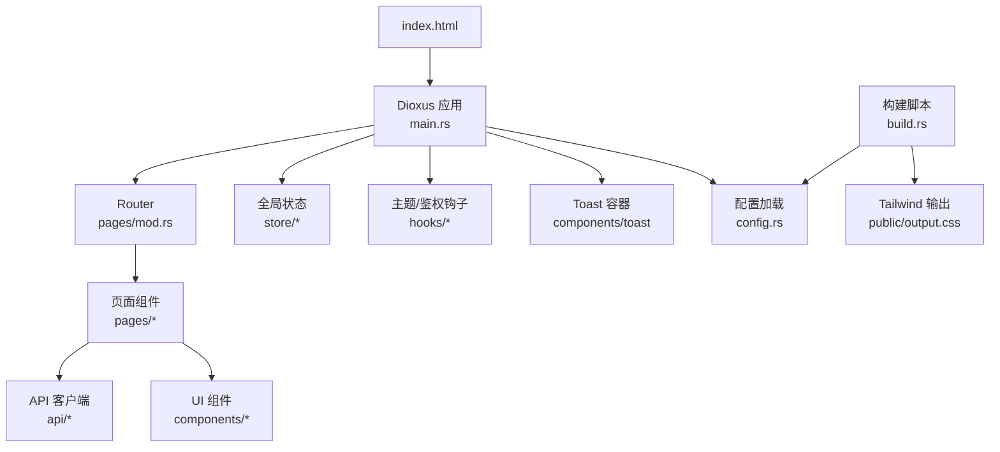
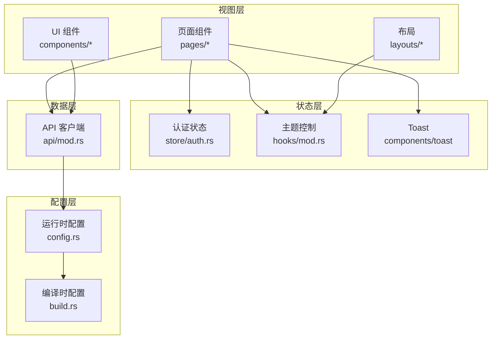
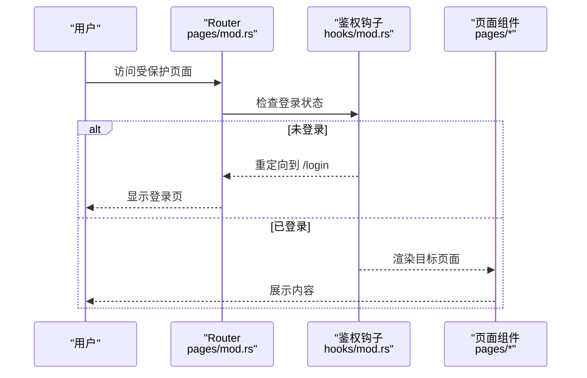
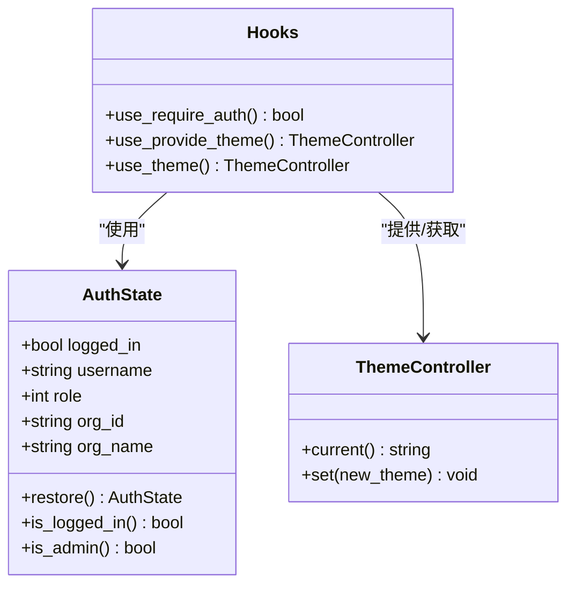
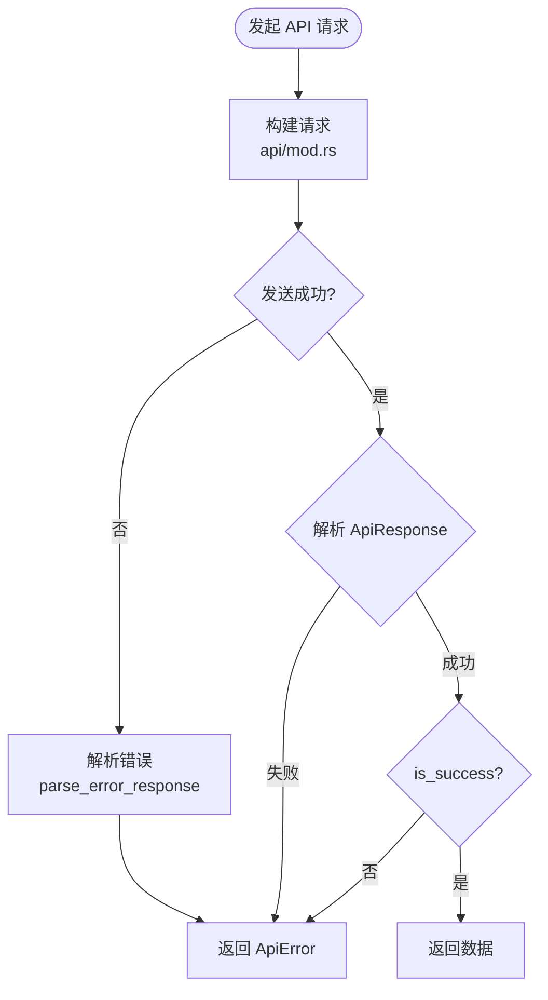
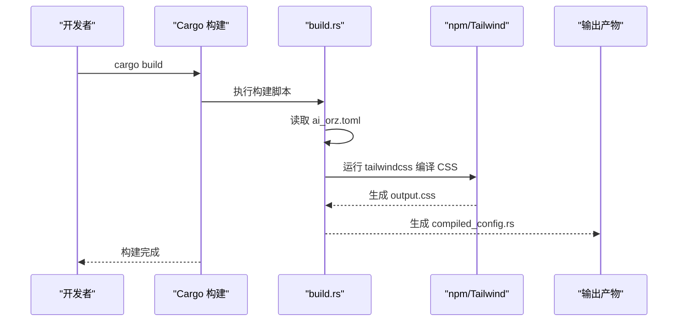
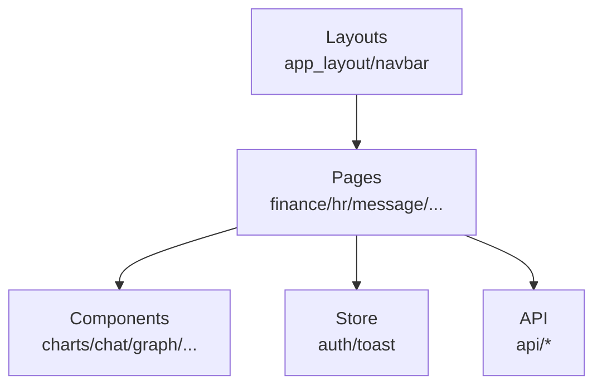
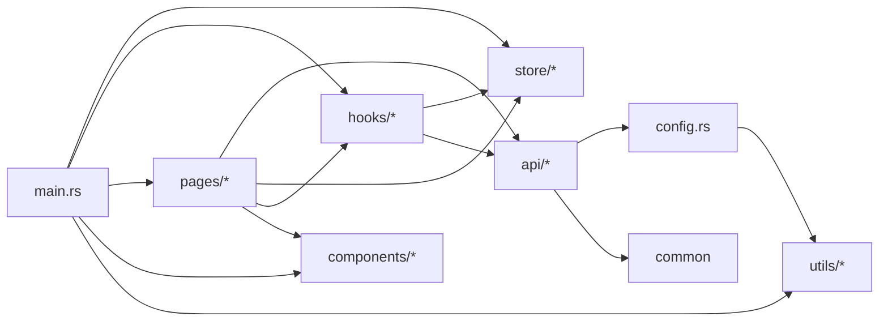

# 前端架构设计

<cite>
**本文引用的文件**
- [frontend/Cargo.toml](file://frontend/Cargo.toml)
- [frontend/Dioxus.toml](file://frontend/Dioxus.toml)
- [frontend/build.rs](file://frontend/build.rs)
- [frontend/package.json](file://frontend/package.json)
- [frontend/index.html](file://frontend/index.html)
- [frontend/src/main.rs](file://frontend/src/main.rs)
- [frontend/src/config.rs](file://frontend/src/config.rs)
- [frontend/src/pages/mod.rs](file://frontend/src/pages/mod.rs)
- [frontend/src/store/mod.rs](file://frontend/src/store/mod.rs)
- [frontend/src/store/auth.rs](file://frontend/src/store/auth.rs)
- [frontend/src/api/mod.rs](file://frontend/src/api/mod.rs)
- [frontend/src/hooks/mod.rs](file://frontend/src/hooks/mod.rs)
- [frontend/src/components/mod.rs](file://frontend/src/components/mod.rs)
- [frontend/src/layouts/mod.rs](file://frontend/src/layouts/mod.rs)
- [frontend/src/utils/mod.rs](file://frontend/src/utils/mod.rs)
</cite>

## 目录
1. [简介](#简介)
2. [项目结构](#项目结构)
3. [核心组件](#核心组件)
4. [架构总览](#架构总览)
5. [详细组件分析](#详细组件分析)
6. [依赖关系分析](#依赖关系分析)
7. [性能考虑](#性能考虑)
8. [故障排查指南](#故障排查指南)
9. [结论](#结论)
10. [附录](#附录)

## 简介
本文件面向 AI Orz 前端应用，基于 Dioxus 构建的 Web 应用，提供完整的架构设计说明。内容涵盖组件化设计模式、状态管理策略、路由导航机制、构建与部署配置、目录组织原则、模块划分方式与依赖管理策略，并辅以架构图表帮助开发者快速理解系统结构与交互流程。

## 项目结构
前端位于 frontend 目录，采用 Rust + Dioxus 技术栈，结合 Tailwind CSS 与 DaisyUI 进行样式构建。整体结构遵循“按功能域分层”的组织方式：
- 入口与启动：main.rs 负责应用初始化、全局上下文注入、路由挂载与 Toast 容器渲染。
- 页面与路由：pages 模块按业务域（finance/hr/message/organization/project/system/user/workspace）组织页面，并通过 Routable 宏集中声明路由。
- 组件库：components 提供可复用的 UI 与业务组件（图表、聊天、画布、模态等）。
- 布局：layouts 提供应用级布局与导航栏。
- 状态管理：store 提供认证状态与提示消息等全局状态；hooks 提供鉴权守卫、主题控制、断点检测等通用能力。
- API 层：api 统一封装 HTTP 请求、错误处理、401 处理、分页与查询串构造。
- 配置：config 管理前端运行时配置，优先级为 localStorage > 编译时嵌入默认值。
- 工具：utils 提供本地存储访问、时间/文件/消息/状态映射等工具函数。
- 构建：build.rs 在编译期读取后端配置并生成静态配置，同时调用 Tailwind CLI 生成输出样式。

**图示来源**
- [frontend/src/main.rs:24-57](file://frontend/src/main.rs#L24-L57)
- [frontend/src/pages/mod.rs:56-154](file://frontend/src/pages/mod.rs#L56-L154)
- [frontend/src/api/mod.rs:26-45](file://frontend/src/api/mod.rs#L26-L45)
- [frontend/src/config.rs:19-40](file://frontend/src/config.rs#L19-L40)
- [frontend/build.rs:11-49](file://frontend/build.rs#L11-L49)

**章节来源**
- [frontend/src/main.rs:24-57](file://frontend/src/main.rs#L24-L57)
- [frontend/src/pages/mod.rs:56-154](file://frontend/src/pages/mod.rs#L56-L154)
- [frontend/src/components/mod.rs:1-30](file://frontend/src/components/mod.rs#L1-L30)
- [frontend/src/layouts/mod.rs:1-5](file://frontend/src/layouts/mod.rs#L1-L5)
- [frontend/src/store/mod.rs:1-5](file://frontend/src/store/mod.rs#L1-L5)
- [frontend/src/hooks/mod.rs:15-54](file://frontend/src/hooks/mod.rs#L15-L54)
- [frontend/src/api/mod.rs:26-45](file://frontend/src/api/mod.rs#L26-L45)
- [frontend/src/config.rs:19-40](file://frontend/src/config.rs#L19-L40)
- [frontend/build.rs:11-49](file://frontend/build.rs#L11-L49)

## 核心组件
- 应用根组件 App：初始化认证状态、Toast、主题控制器、移动端断点信号，并挂载 Router 与 Toast 容器。
- 路由系统：使用 Dioxus Router 的 Routable 宏定义全局路由枚举，覆盖登录、对话、组织、HR、财务、项目、系统、用户、工作台、设置等页面。
- 状态管理：
  - 认证状态 AuthState：通过 Signal 提供登录标志、角色、用户名、组织信息等；持久化到 localStorage，支持恢复与登出。
  - Toast 状态：全局提示消息容器，由 hooks 提供。
- API 客户端：统一封装 GET/POST/PUT/DELETE、文本下载、Multipart 上传、错误解析、401 处理与分页 URL 构造。
- 配置管理：FrontendConfig 从编译时生成的配置与 localStorage 中合并，提供 api_base_url 与 api_url 拼接方法。
- 钩子与工具：
  - use_require_auth：未登录重定向到登录页，并在 role=0 时调用接口回填真实角色。
  - use_provide_theme/use_theme：主题切换与持久化。
  - local_storage：安全获取浏览器本地存储。

**章节来源**
- [frontend/src/main.rs:24-57](file://frontend/src/main.rs#L24-L57)
- [frontend/src/pages/mod.rs:56-154](file://frontend/src/pages/mod.rs#L56-L154)
- [frontend/src/store/auth.rs:59-93](file://frontend/src/store/auth.rs#L59-L93)
- [frontend/src/api/mod.rs:87-174](file://frontend/src/api/mod.rs#L87-L174)
- [frontend/src/config.rs:19-80](file://frontend/src/config.rs#L19-L80)
- [frontend/src/hooks/mod.rs:19-54](file://frontend/src/hooks/mod.rs#L19-L54)
- [frontend/src/utils/mod.rs:19-25](file://frontend/src/utils/mod.rs#L19-L25)

## 架构总览
前端采用“组件化 + 路由驱动 + 全局状态 + 统一 API 层”的分层架构：
- 视图层：页面与组件通过 Dioxus 组件模型组织，复用 UI 组件与布局。
- 状态层：使用 Signal 与 Context 实现跨组件共享状态（认证、主题、Toast、移动端断点）。
- 数据层：统一 API 客户端封装网络请求、错误处理与响应解析。
- 配置层：编译时嵌入后端配置，运行时优先使用 localStorage 覆盖。
- 构建层：Cargo build.rs 集成 Tailwind 编译与配置生成，确保前后端配置一致。

**图示来源**
- [frontend/src/pages/mod.rs:56-154](file://frontend/src/pages/mod.rs#L56-L154)
- [frontend/src/components/mod.rs:1-30](file://frontend/src/components/mod.rs#L1-L30)
- [frontend/src/layouts/mod.rs:1-5](file://frontend/src/layouts/mod.rs#L1-L5)
- [frontend/src/store/auth.rs:59-93](file://frontend/src/store/auth.rs#L59-L93)
- [frontend/src/hooks/mod.rs:102-139](file://frontend/src/hooks/mod.rs#L102-L139)
- [frontend/src/api/mod.rs:26-45](file://frontend/src/api/mod.rs#L26-L45)
- [frontend/build.rs:11-49](file://frontend/build.rs#L11-L49)
- [frontend/src/config.rs:19-80](file://frontend/src/config.rs#L19-L80)

## 详细组件分析

### 路由与导航机制
- 路由定义：通过 Routable 宏集中声明所有页面路由，包括参数化路由（如 /hr/agents/:id）。
- 导航守卫：use_require_auth 在未登录时重定向至登录页，并在刷新后尝试回填角色信息。
- 导航 API：通过 dioxus_router::use_navigator 进行页面跳转与替换。

**图示来源**
- [frontend/src/pages/mod.rs:56-154](file://frontend/src/pages/mod.rs#L56-L154)
- [frontend/src/hooks/mod.rs:19-54](file://frontend/src/hooks/mod.rs#L19-L54)

**章节来源**
- [frontend/src/pages/mod.rs:56-154](file://frontend/src/pages/mod.rs#L56-L154)
- [frontend/src/hooks/mod.rs:19-54](file://frontend/src/hooks/mod.rs#L19-L54)

### 状态管理策略
- 认证状态：AuthState 通过 Signal 管理登录标志、角色、用户名、组织信息；localStorage 持久化登录标志与角色；提供 restore/logout/is_admin 等方法。
- 主题状态：ThemeController 通过 Context 提供全局主题信号，持久化主题选择并应用到 HTML 元素。
- Toast 状态：全局提示消息容器，由 hooks 提供并提供容器组件。

**图示来源**
- [frontend/src/store/auth.rs:59-93](file://frontend/src/store/auth.rs#L59-L93)
- [frontend/src/hooks/mod.rs:102-139](file://frontend/src/hooks/mod.rs#L102-L139)

**章节来源**
- [frontend/src/store/auth.rs:59-93](file://frontend/src/store/auth.rs#L59-L93)
- [frontend/src/hooks/mod.rs:102-139](file://frontend/src/hooks/mod.rs#L102-L139)

### API 客户端与错误处理
- 统一请求封装：api_get/api_post/api_put/api_delete/api_get_text/api_post_multipart，统一处理成功/失败分支。
- 错误解析：parse_error_response 与 parse_api_error_from_body 提取 HTTP 状态码、error_code 与 message。
- 401 处理：handle_unauthorized 清除登录态并重定向到登录页。
- 分页与查询：build_pagination_url 与 build_query_string 辅助构造查询参数。

**图示来源**
- [frontend/src/api/mod.rs:72-174](file://frontend/src/api/mod.rs#L72-L174)
- [frontend/src/api/mod.rs:289-303](file://frontend/src/api/mod.rs#L289-L303)
- [frontend/src/api/mod.rs:405-432](file://frontend/src/api/mod.rs#L405-L432)

**章节来源**
- [frontend/src/api/mod.rs:26-45](file://frontend/src/api/mod.rs#L26-L45)
- [frontend/src/api/mod.rs:72-174](file://frontend/src/api/mod.rs#L72-L174)
- [frontend/src/api/mod.rs:289-303](file://frontend/src/api/mod.rs#L289-L303)
- [frontend/src/api/mod.rs:405-432](file://frontend/src/api/mod.rs#L405-L432)

### 构建与配置
- 编译时配置：build.rs 读取后端 ai_orz.toml（或默认配置），生成 compiled_config.rs，提供 get_config() 供运行时使用。
- 样式构建：build.rs 调用 Tailwind CLI 将 styles/input.css 编译为 public/output.css，并在缺失 node_modules 时自动执行 npm install。
- 应用元信息：Dioxus.toml 指定输出目录、资源目录、WASM 优化级别、应用标题、监听路径与打包标识。
- 包管理：package.json 提供 Tailwind CLI 与 DaisyUI 依赖及脚本命令。

**图示来源**
- [frontend/build.rs:11-49](file://frontend/build.rs#L11-L49)
- [frontend/build.rs:52-125](file://frontend/build.rs#L52-L125)
- [frontend/Dioxus.toml:1-18](file://frontend/Dioxus.toml#L1-L18)
- [frontend/package.json:1-14](file://frontend/package.json#L1-L14)

**章节来源**
- [frontend/build.rs:11-49](file://frontend/build.rs#L11-L49)
- [frontend/build.rs:52-125](file://frontend/build.rs#L52-L125)
- [frontend/Dioxus.toml:1-18](file://frontend/Dioxus.toml#L1-L18)
- [frontend/package.json:1-14](file://frontend/package.json#L1-L14)

### 组件化设计与布局
- 组件库：components 提供图表、聊天气泡、画布、力导向图、看板、搜索下拉、统计面板、任务进度、Toast、模态等组件。
- 布局：layouts 提供应用主布局与导航栏，配合 Router 与全局状态实现页面框架。
- 页面组织：pages 按业务域分组，每个域包含列表、详情、编辑等页面，便于扩展与维护。

**图示来源**
- [frontend/src/layouts/mod.rs:1-5](file://frontend/src/layouts/mod.rs#L1-L5)
- [frontend/src/pages/mod.rs:1-12](file://frontend/src/pages/mod.rs#L1-L12)
- [frontend/src/components/mod.rs:1-30](file://frontend/src/components/mod.rs#L1-L30)
- [frontend/src/store/mod.rs:1-5](file://frontend/src/store/mod.rs#L1-L5)
- [frontend/src/api/mod.rs:1-16](file://frontend/src/api/mod.rs#L1-L16)

**章节来源**
- [frontend/src/components/mod.rs:1-30](file://frontend/src/components/mod.rs#L1-L30)
- [frontend/src/layouts/mod.rs:1-5](file://frontend/src/layouts/mod.rs#L1-L5)
- [frontend/src/pages/mod.rs:1-12](file://frontend/src/pages/mod.rs#L1-L12)

## 依赖关系分析
- 运行时依赖：dioxus（web/router）、reqwest（json）、web-sys（浏览器 API）、wasm-bindgen/futures、tracing、common（共享类型与配置）。
- 构建依赖：common（AppConfig）、toml、serde_json；Tailwind CLI 与 DaisyUI 用于样式构建。
- 模块耦合：
  - main.rs 依赖 store、hooks、pages、components、utils。
  - pages 依赖 api、store、hooks、components。
  - api 依赖 config、common、web-sys。
  - hooks 依赖 store、api、pages。
  - config 依赖 utils 与编译时配置。

**图示来源**
- [frontend/src/main.rs:1-8](file://frontend/src/main.rs#L1-L8)
- [frontend/src/pages/mod.rs:1-12](file://frontend/src/pages/mod.rs#L1-L12)
- [frontend/src/api/mod.rs:1-16](file://frontend/src/api/mod.rs#L1-L16)
- [frontend/src/hooks/mod.rs:1-14](file://frontend/src/hooks/mod.rs#L1-L14)
- [frontend/src/config.rs:1-17](file://frontend/src/config.rs#L1-L17)
- [frontend/Cargo.toml:11-26](file://frontend/Cargo.toml#L11-L26)

**章节来源**
- [frontend/Cargo.toml:11-26](file://frontend/Cargo.toml#L11-L26)
- [frontend/src/main.rs:1-8](file://frontend/src/main.rs#L1-L8)
- [frontend/src/pages/mod.rs:1-12](file://frontend/src/pages/mod.rs#L1-L12)
- [frontend/src/api/mod.rs:1-16](file://frontend/src/api/mod.rs#L1-L16)
- [frontend/src/hooks/mod.rs:1-14](file://frontend/src/hooks/mod.rs#L1-L14)
- [frontend/src/config.rs:1-17](file://frontend/src/config.rs#L1-L17)

## 性能考虑
- WASM 优化：Dioxus.toml 中 web.wasm_opt.level=4，提升生成代码体积与执行效率。
- 样式构建：Tailwind 按需生成 CSS，减少冗余样式；构建脚本自动安装依赖并最小化输出。
- 请求优化：统一 API 客户端复用 reqwest Client，避免重复创建连接；401 快速失败并清理状态。
- 状态更新：使用 Signal 与 Context 精确更新，避免不必要的重渲染；移动端断点信号仅在必要时更新。
- 本地存储：仅持久化必要字段（登录标志、角色、主题），降低存储开销。

[本节为通用指导，不直接分析具体文件]

## 故障排查指南
- 401 未授权：
  - 现象：页面跳转到登录页，无法访问受保护资源。
  - 原因：Cookie 过期或无效；handle_unauthorized 会清除登录态并重定向。
  - 处理：检查后端 Cookie 签发与有效期；确认前端未保存过期 token。
  - 参考位置：[frontend/src/api/mod.rs:37-45](file://frontend/src/api/mod.rs#L37-L45)
- 配置不一致：
  - 现象：前端无法连接后端 API。
  - 原因：编译时配置未正确生成或 api_base_url 不正确。
  - 处理：检查 .ai_orz/ai_orz.toml 是否存在；确认 build.rs 成功生成 compiled_config.rs；验证 FrontendConfig 的默认值逻辑。
  - 参考位置：[frontend/build.rs:20-49](file://frontend/build.rs#L20-L49)、[frontend/src/config.rs:19-40](file://frontend/src/config.rs#L19-L40)
- 样式未生效：
  - 现象：页面样式缺失或主题不生效。
  - 原因：Tailwind 构建失败或未生成 output.css。
  - 处理：检查 node_modules/.bin/tailwindcss 是否存在；查看构建日志中的警告；手动运行 npm install 与构建脚本。
  - 参考位置：[frontend/build.rs:52-125](file://frontend/build.rs#L52-L125)
- 主题切换无效：
  - 现象：切换主题后未应用到页面。
  - 原因：HTML data-theme 属性未更新或本地存储读取失败。
  - 处理：确认 use_provide_theme 在根组件调用；检查 set_html_theme 是否成功设置属性；查看 localStorage 中 ai_orz_theme 值。
  - 参考位置：[frontend/src/hooks/mod.rs:94-118](file://frontend/src/hooks/mod.rs#L94-L118)

**章节来源**
- [frontend/src/api/mod.rs:37-45](file://frontend/src/api/mod.rs#L37-L45)
- [frontend/build.rs:20-49](file://frontend/build.rs#L20-L49)
- [frontend/build.rs:52-125](file://frontend/build.rs#L52-L125)
- [frontend/src/config.rs:19-40](file://frontend/src/config.rs#L19-L40)
- [frontend/src/hooks/mod.rs:94-118](file://frontend/src/hooks/mod.rs#L94-L118)

## 结论
AI Orz 前端基于 Dioxus 构建了清晰的分层架构：以组件化为核心，通过路由驱动页面导航，使用 Signal 与 Context 实现全局状态管理，统一 API 客户端保障网络交互的一致性与健壮性，构建脚本确保前后端配置一致与样式高效产出。该架构具备良好的可扩展性与可维护性，适合复杂业务场景下的持续迭代。

[本节为总结性内容，不直接分析具体文件]

## 附录
- 开发环境搭建：
  - 安装 Rust 工具链与 wasm32 目标。
  - 进入 frontend 目录，执行 cargo build 以触发 build.rs 与 Tailwind 构建。
  - 如需独立样式构建，可使用 package.json 提供的脚本命令。
- 构建流程：
  - Cargo 编译阶段执行 build.rs，生成 compiled_config.rs 并编译 CSS。
  - Dioxus 将应用打包为 WASM，输出到 dist 目录。
- 部署配置：
  - 将 dist 目录下的静态资源部署到 Web 服务器。
  - 确保 index.html 能加载 output.css 与 WASM 产物。
  - 根据后端配置调整 ai_orz.toml，重新构建前端以嵌入新配置。

[本节为补充说明，不直接分析具体文件]