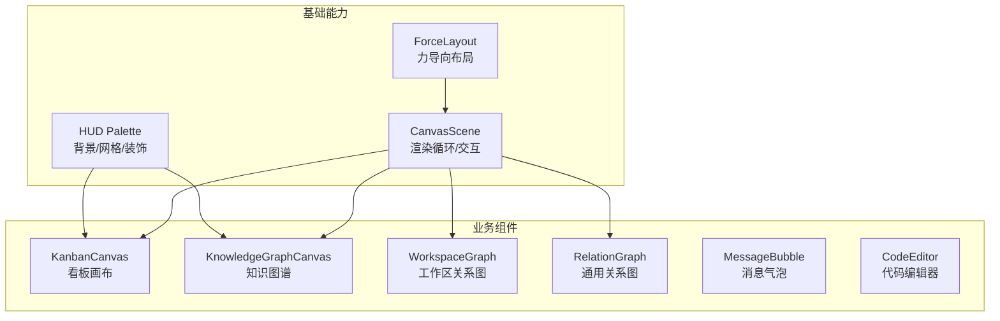
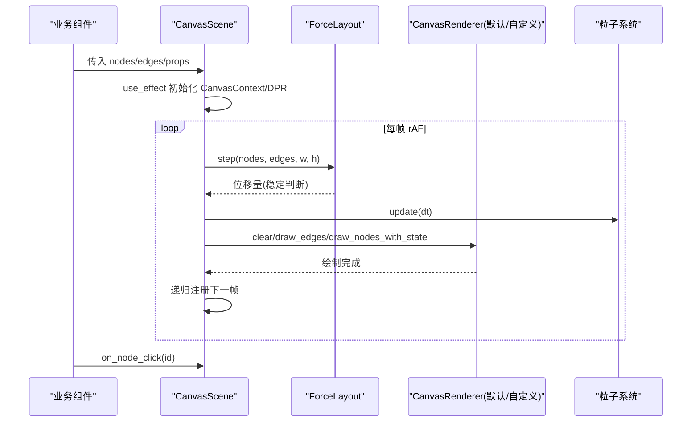
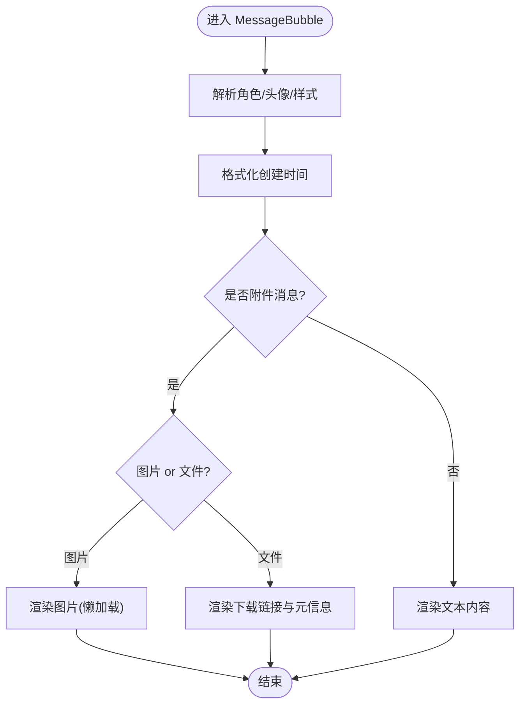
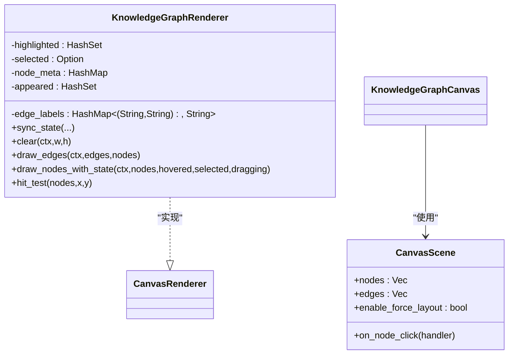
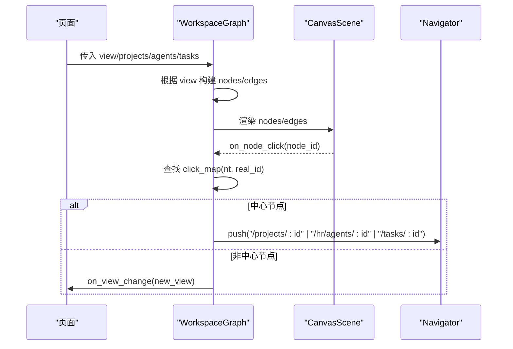
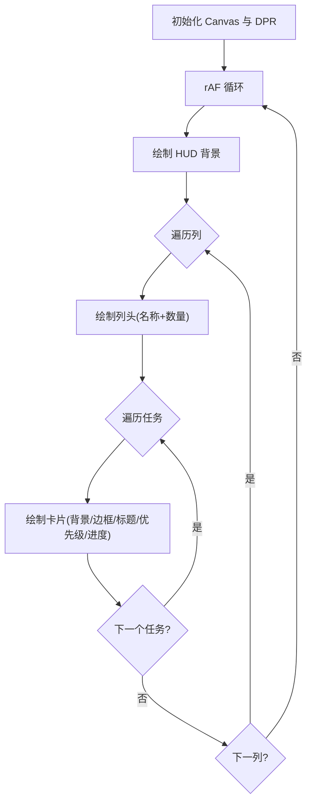
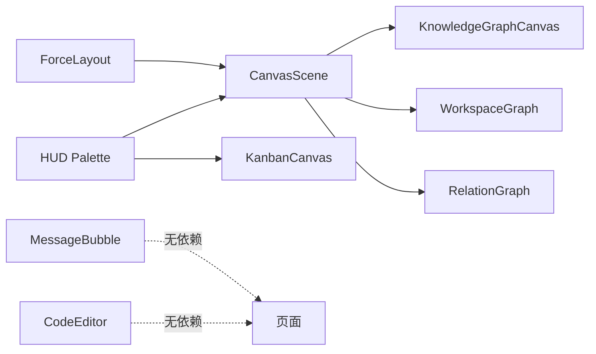

# 业务组件

<cite>
**本文引用的文件**
- [frontend/src/components/mod.rs](file://frontend/src/components/mod.rs)
- [frontend/src/components/chat/message_bubble.rs](file://frontend/src/components/chat/message_bubble.rs)
- [frontend/src/components/canvas_scene.rs](file://frontend/src/components/canvas_scene.rs)
- [frontend/src/components/graph_canvas.rs](file://frontend/src/components/graph_canvas.rs)
- [frontend/src/components/kanban_canvas.rs](file://frontend/src/components/kanban_canvas.rs)
- [frontend/src/components/code_editor.rs](file://frontend/src/components/code_editor.rs)
- [frontend/src/components/workspace_graph.rs](file://frontend/src/components/workspace_graph.rs)
- [frontend/src/components/relation_graph.rs](file://frontend/src/components/relation_graph.rs)
- [frontend/src/components/force_layout.rs](file://frontend/src/components/force_layout.rs)
- [frontend/src/components/hud_palette.rs](file://frontend/src/components/hud_palette.rs)
</cite>

## 目录
1. [简介](#简介)
2. [项目结构](#项目结构)
3. [核心组件](#核心组件)
4. [架构总览](#架构总览)
5. [详细组件分析](#详细组件分析)
6. [依赖关系分析](#依赖关系分析)
7. [性能考量](#性能考量)
8. [故障排查指南](#故障排查指南)
9. [结论](#结论)
10. [附录：配置与扩展点](#附录：配置与扩展点)

## 简介
本文件面向 AI Orz 前端应用的业务组件，聚焦以下核心能力：聊天消息气泡、知识图谱可视化、工作区画布、看板画布、代码编辑器。文档从实现原理、数据绑定、状态同步、事件传播、性能优化、组件通信与集成方式等维度进行系统化说明，并提供可操作的配置项与扩展点指引，帮助开发者快速理解并高效使用这些组件。

## 项目结构
前端业务组件集中在 frontend/src/components 下，采用“按功能域划分”的组织方式：
- chat：聊天相关（消息气泡、输入指示器）
- canvas_scene：Canvas 场景基础设施（节点/连线抽象、渲染循环、交互桥接）
- graph_canvas：基于 CanvasScene 的知识图谱 HUD 风格渲染器
- kanban_canvas：看板视图的 Canvas 渲染
- workspace_graph：工作区关系图（Project/Agent/Task 多视图）
- relation_graph：通用实体关系图（中心+关联）
- code_editor：轻量代码编辑器（textarea + 行号）
- force_layout：力导向布局算法
- hud_palette：HUD 驾驶舱风格背景工具

**图表来源**
- [frontend/src/components/canvas_scene.rs:211-256](file://frontend/src/components/canvas_scene.rs#L211-L256)
- [frontend/src/components/force_layout.rs:11-45](file://frontend/src/components/force_layout.rs#L11-L45)
- [frontend/src/components/hud_palette.rs:37-45](file://frontend/src/components/hud_palette.rs#L37-L45)
- [frontend/src/components/kanban_canvas.rs:38-52](file://frontend/src/components/kanban_canvas.rs#L38-L52)
- [frontend/src/components/graph_canvas.rs:428-441](file://frontend/src/components/graph_canvas.rs#L428-L441)
- [frontend/src/components/workspace_graph.rs:28-45](file://frontend/src/components/workspace_graph.rs#L28-L45)
- [frontend/src/components/relation_graph.rs:59-78](file://frontend/src/components/relation_graph.rs#L59-L78)
- [frontend/src/components/chat/message_bubble.rs:14-37](file://frontend/src/components/chat/message_bubble.rs#L14-L37)
- [frontend/src/components/code_editor.rs:8-23](file://frontend/src/components/code_editor.rs#L8-L23)

**章节来源**
- [frontend/src/components/mod.rs:1-30](file://frontend/src/components/mod.rs#L1-L30)

## 核心组件
- 聊天消息气泡：支持文本、图片附件、文件附件渲染；角色头像、时间、内容自适应展示。
- 知识图谱可视化：基于 CanvasScene 的 HUD 风格渲染，支持选中态扫描环、边流光、标签与 tag 边框等高级视觉。
- 工作区画布：根据 WorkspaceView 切换 Global/ProjectDetail/AgentDetail/TaskDetail 四种视图，自动构建节点与边，支持点击跳转与视图切换。
- 看板画布：多列泳道看板，HUD 深色背景，任务卡片含优先级、进度条与标题截断。
- 代码编辑器：轻量 textarea + 行号显示，适用于 Skill/Artifact 编辑场景。

**章节来源**
- [frontend/src/components/chat/message_bubble.rs:14-72](file://frontend/src/components/chat/message_bubble.rs#L14-L72)
- [frontend/src/components/graph_canvas.rs:443-526](file://frontend/src/components/graph_canvas.rs#L443-L526)
- [frontend/src/components/workspace_graph.rs:15-45](file://frontend/src/components/workspace_graph.rs#L15-L45)
- [frontend/src/components/kanban_canvas.rs:19-52](file://frontend/src/components/kanban_canvas.rs#L19-L52)
- [frontend/src/components/code_editor.rs:8-58](file://frontend/src/components/code_editor.rs#L8-L58)

## 架构总览
CanvasScene 作为统一的基础设施，封装了 <canvas> 生命周期、DPR 适配、requestAnimationFrame 渲染循环、力导向布局、拖拽/hover/选中交互以及粒子系统开关。业务组件通过两种方式使用它：
- 直接复用默认渲染器：如 KanbanCanvas 自定义绘制流程，但同样受益于 Canvas 生命周期管理。
- 实现 CanvasRenderer 接口：如 KnowledgeGraphRenderer，定制节点/边绘制与命中检测，获得一致的交互与动画框架。

**图表来源**
- [frontend/src/components/canvas_scene.rs:258-489](file://frontend/src/components/canvas_scene.rs#L258-L489)
- [frontend/src/components/force_layout.rs:75-177](file://frontend/src/components/force_layout.rs#L75-L177)
- [frontend/src/components/graph_canvas.rs:96-186](file://frontend/src/components/graph_canvas.rs#L96-L186)

## 详细组件分析

### 聊天消息气泡 MessageBubble
- 职责：渲染单条消息，包含头像、角色标识、时间与内容；自动识别附件类型并渲染图片或下载链接。
- 数据绑定：接收 MessageListItem，内部计算角色样式与时间格式化。
- 交互：无复杂交互，适合极简场景（Agent 详情页、Workspace 底部对话框）。
- 性能：纯函数式渲染，无额外状态，开销极低。

**图表来源**
- [frontend/src/components/chat/message_bubble.rs:14-72](file://frontend/src/components/chat/message_bubble.rs#L14-L72)

**章节来源**
- [frontend/src/components/chat/message_bubble.rs:14-72](file://frontend/src/components/chat/message_bubble.rs#L14-L72)

### 知识图谱可视化 KnowledgeGraphCanvas
- 职责：在 CanvasScene 之上提供 HUD 风格的节点/边绘制，支持高亮、选中、边流光、tag 边框与摘要展示。
- 数据绑定：将 GraphNode/GraphEdge 转换为 CanvasNode/CanvasEdge，并通过 sync_state 同步外部高亮/选中/边标签/节点元数据。
- 交互：点击节点回调由 CanvasScene 统一处理，返回节点 id；业务层决定后续逻辑。
- 性能：关闭 CanvasScene 自带粒子，避免视觉过载；自定义绘制路径减少重复计算。

**图表来源**
- [frontend/src/components/graph_canvas.rs:52-94](file://frontend/src/components/graph_canvas.rs#L52-L94)
- [frontend/src/components/graph_canvas.rs:96-186](file://frontend/src/components/graph_canvas.rs#L96-L186)
- [frontend/src/components/canvas_scene.rs:211-256](file://frontend/src/components/canvas_scene.rs#L211-L256)

**章节来源**
- [frontend/src/components/graph_canvas.rs:428-526](file://frontend/src/components/graph_canvas.rs#L428-L526)

### 工作区画布 WorkspaceGraph
- 职责：根据当前视图模式（Global/ProjectDetail/AgentDetail/TaskDetail）动态构建节点与边，支持点击中心节点跳转详情、点击非中心节点切换视图。
- 数据绑定：接收 projects/agents/tasks 列表，按视图过滤并生成 CanvasNode/CanvasEdge。
- 交互：通过 click_map 将节点 id 映射到真实 ID 与类型，结合路由导航实现页面跳转或视图切换。
- 性能：分层布局用于 ProjectDetail 的 Task DAG，提升可读性；仅当需要时启用力导向。

**图表来源**
- [frontend/src/components/workspace_graph.rs:483-592](file://frontend/src/components/workspace_graph.rs#L483-L592)
- [frontend/src/components/canvas_scene.rs:558-575](file://frontend/src/components/canvas_scene.rs#L558-L575)

**章节来源**
- [frontend/src/components/workspace_graph.rs:15-592](file://frontend/src/components/workspace_graph.rs#L15-L592)

### 看板画布 KanbanCanvas
- 职责：渲染多列泳道看板，列头显示状态名与数量，任务卡片包含优先级颜色编码、标题截断、进度条与百分比。
- 数据绑定：KanbanColumn/KanbanTask 结构体承载列与任务数据；Props 中 columns/width/height/on_task_click。
- 交互：当前简化为展示，未实现命中检测；可通过扩展 onclick 增加交互。
- 性能：使用 requestAnimationFrame 持续重绘；DPR 适配确保高清屏清晰度。

**图表来源**
- [frontend/src/components/kanban_canvas.rs:54-138](file://frontend/src/components/kanban_canvas.rs#L54-L138)
- [frontend/src/components/kanban_canvas.rs:140-244](file://frontend/src/components/kanban_canvas.rs#L140-L244)

**章节来源**
- [frontend/src/components/kanban_canvas.rs:19-286](file://frontend/src/components/kanban_canvas.rs#L19-L286)

### 代码编辑器 CodeEditor
- 职责：轻量代码编辑区域，textarea + 等宽字体 + 行号显示，适用于 Skill/Artifact 内容编辑。
- 数据绑定：value 与 on_input 双向联动；language 用于占位提示；read_only/min_lines 控制行为与高度。
- 交互：无语法高亮，专注简洁与低开销；禁用拼写检查与自动补全以提升体验。
- 性能：行号基于 lines().count() 计算，最小行数保证初始高度；纯 DOM 操作，无重型依赖。

**章节来源**
- [frontend/src/components/code_editor.rs:8-58](file://frontend/src/components/code_editor.rs#L8-L58)

### 通用关系图 RelationGraph
- 职责：通用“中心+关联”辐射图，不绑定具体业务概念；颜色、空状态文案、节点类型标识均由调用方控制。
- 数据绑定：RelationNodeInfo 携带 id/name/kind；RelationGraphProps 定义中心与关联列表及点击回调。
- 交互：点击事件通过 NodeClickEvent 回传 (kind, id, is_center)，由调用方决定跳转或处理逻辑。
- 性能：基于 CanvasScene 默认渲染器，简单高效。

**章节来源**
- [frontend/src/components/relation_graph.rs:24-170](file://frontend/src/components/relation_graph.rs#L24-L170)

## 依赖关系分析
- CanvasScene 依赖 ForceLayout 与 HUD Palette，提供统一的渲染循环与视觉效果。
- KnowledgeGraphCanvas 依赖 CanvasScene 与 graph 模块的颜色/半径计算，实现 HUD 风格渲染。
- WorkspaceGraph 依赖 layered_layout（用于 ProjectDetail 的分层布局）与 CanvasScene。
- KanbanCanvas 独立实现绘制流程，复用 HUD Palette 背景。
- MessageBubble 与 CodeEditor 为轻量 UI 组件，无复杂依赖。

**图表来源**
- [frontend/src/components/canvas_scene.rs:211-256](file://frontend/src/components/canvas_scene.rs#L211-L256)
- [frontend/src/components/graph_canvas.rs:428-526](file://frontend/src/components/graph_canvas.rs#L428-L526)
- [frontend/src/components/workspace_graph.rs:483-592](file://frontend/src/components/workspace_graph.rs#L483-L592)
- [frontend/src/components/kanban_canvas.rs:140-244](file://frontend/src/components/kanban_canvas.rs#L140-L244)

**章节来源**
- [frontend/src/components/canvas_scene.rs:211-579](file://frontend/src/components/canvas_scene.rs#L211-L579)
- [frontend/src/components/graph_canvas.rs:428-526](file://frontend/src/components/graph_canvas.rs#L428-L526)
- [frontend/src/components/workspace_graph.rs:483-592](file://frontend/src/components/workspace_graph.rs#L483-L592)
- [frontend/src/components/kanban_canvas.rs:140-244](file://frontend/src/components/kanban_canvas.rs#L140-L244)

## 性能考量
- 渲染循环与 DPR 适配：CanvasScene 在 effect 中设置物理像素尺寸并缩放上下文，确保高清屏清晰且性能可控。
- 力导向稳定检测：ForceLayout 返回总位移，当低于阈值时标记稳定，减少不必要的计算。
- 新增节点合并策略：CanvasScene 在 props 变化时保留已有节点位置，新增节点用圆形布局初始化，避免抖动。
- 粒子系统开关：按需启用背景/数据流/辉光/诞生消亡粒子，避免视觉过载与性能损耗。
- 知识图谱自定义渲染：关闭 CanvasScene 自带粒子，使用 HUD 效果替代，降低重复绘制成本。
- 看板渲染节流：rAF 循环内仅执行必要绘制，避免频繁 DOM 操作。

[本节为通用性能指导，无需特定文件引用]

## 故障排查指南
- Canvas 无法获取上下文：检查 onmounted 是否正确设置 canvas_ref，并确保 get_context("2d") 成功。
- 节点点击无效：确认 hit_test 逻辑与节点半径匹配；检查 on_node_click 是否传递正确 handler。
- 布局不稳定：调整 ForceLayoutConfig 的 repulsion/attraction/damping/max_step；必要时手动设置 layer 约束。
- 高清屏模糊：确认 DPR 设置与 scale(dpr, dpr) 调用；检查 CSS width/height 与 canvas 物理尺寸一致。
- 粒子闪烁或卡顿：关闭非必要粒子开关；减少节点数量或简化 draw_nodes_with_state。
- 看板点击无响应：当前为展示模式，如需交互需补充命中检测逻辑。

**章节来源**
- [frontend/src/components/canvas_scene.rs:494-575](file://frontend/src/components/canvas_scene.rs#L494-L575)
- [frontend/src/components/force_layout.rs:75-177](file://frontend/src/components/force_layout.rs#L75-L177)
- [frontend/src/components/kanban_canvas.rs:118-138](file://frontend/src/components/kanban_canvas.rs#L118-L138)

## 结论
AI Orz 前端的业务组件以 CanvasScene 为核心基础设施，向上提供知识图谱、工作区关系图、看板画布等高价值可视化能力，同时保持轻量化的聊天消息气泡与代码编辑器。通过清晰的 Props 接口、事件回调与状态同步机制，组件间解耦良好，易于扩展与集成。建议在实际项目中优先复用 CanvasScene 与 HUD Palette，按需开启粒子与力导向，以获得最佳性能与视觉体验。

[本节为总结性内容，无需特定文件引用]

## 附录：配置与扩展点
- CanvasScene 配置项
  - width/height：画布尺寸（CSS 像素）
  - nodes/edges：节点与连线数据
  - on_node_click：节点点击回调
  - enable_force_layout：是否启用力导向布局
  - enable_data_flow_particles/enble_glow_particles/enable_background_particles/enable_birth_death_particles：粒子系统开关
- KnowledgeGraphCanvas 配置项
  - nodes/edges：节点与边数据（Graph 结构）
  - selected_node_id/highlighted_node_ids：选中与高亮状态
  - on_node_click：节点点击回调
- WorkspaceGraph 配置项
  - view：当前视图模式（Global/ProjectDetail/AgentDetail/TaskDetail）
  - projects/agents/tasks：图数据
  - on_view_change：视图切换回调
- KanbanCanvas 配置项
  - columns：列定义（status/title/color/tasks）
  - width/height：画布尺寸
  - on_task_click：任务点击回调（可扩展命中检测）
- CodeEditor 配置项
  - value/on_input：内容与变更回调
  - language/read_only/min_lines：语言提示、只读模式、最小行数

**章节来源**
- [frontend/src/components/canvas_scene.rs:211-256](file://frontend/src/components/canvas_scene.rs#L211-L256)
- [frontend/src/components/graph_canvas.rs:428-441](file://frontend/src/components/graph_canvas.rs#L428-L441)
- [frontend/src/components/workspace_graph.rs:28-45](file://frontend/src/components/workspace_graph.rs#L28-L45)
- [frontend/src/components/kanban_canvas.rs:38-52](file://frontend/src/components/kanban_canvas.rs#L38-L52)
- [frontend/src/components/code_editor.rs:8-23](file://frontend/src/components/code_editor.rs#L8-L23)