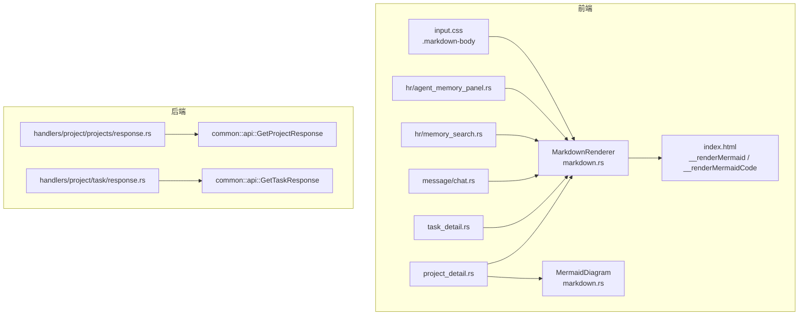
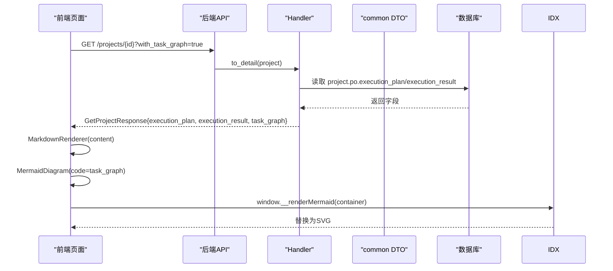
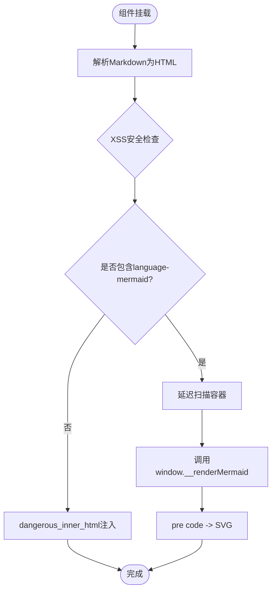
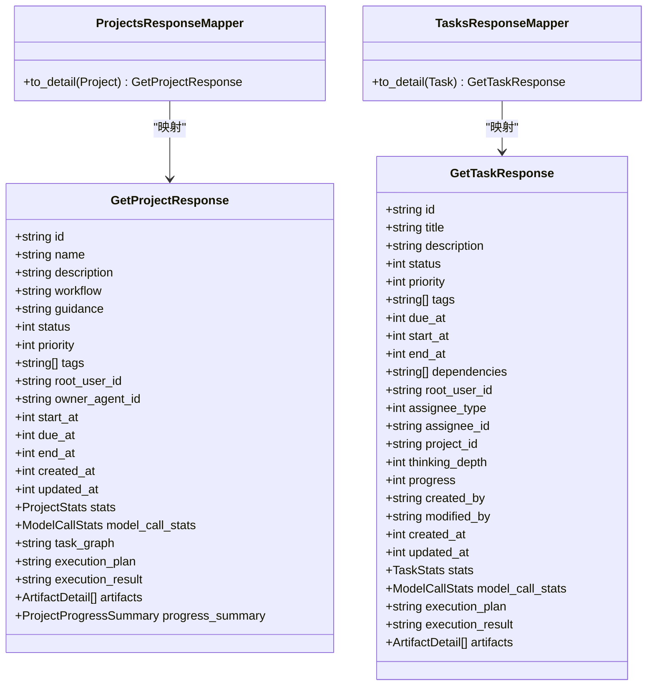
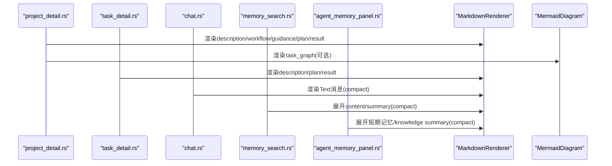
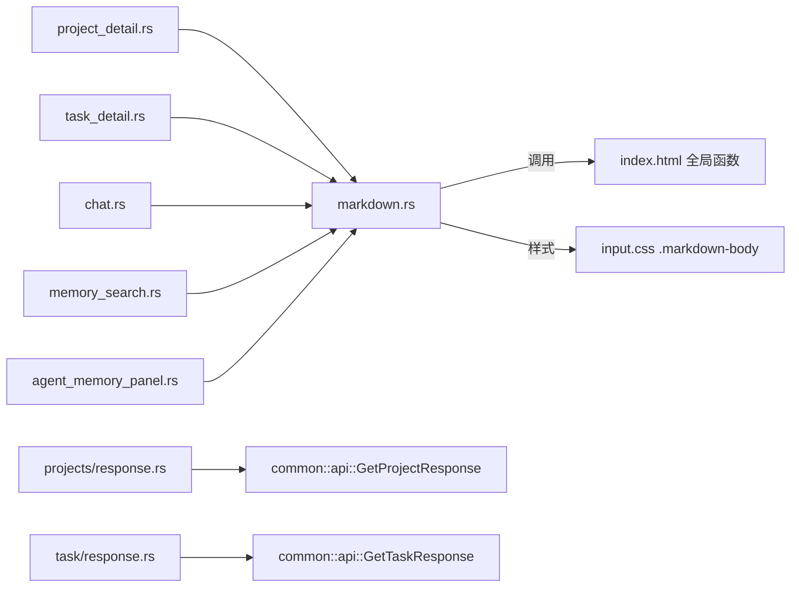

# Mermaid图表支持

<cite>
**本文引用的文件**
- [frontend/src/components/markdown.rs](file://frontend/src/components/markdown.rs)
- [frontend/index.html](file://frontend/index.html)
- [common/src/api/project.rs](file://common/src/api/project.rs)
- [common/src/api/task.rs](file://common/src/api/task.rs)
- [src/handlers/project/projects/response.rs](file://src/handlers/project/projects/response.rs)
- [src/handlers/project/task/response.rs](file://src/handlers/project/task/response.rs)
- [frontend/src/pages/project/project_detail.rs](file://frontend/src/pages/project/project_detail.rs)
- [frontend/src/pages/message/chat.rs](file://frontend/src/pages/message/chat.rs)
- [frontend/styles/input.css](file://frontend/styles/input.css)
</cite>

## 更新摘要
**变更内容**
- 更新了 Markdown 渲染组件的安全性和功能增强
- 完善了 Mermaid 图表的集成实现
- 扩展了 XSS 防护机制
- 增强了跨页面统一渲染能力

## 目录
1. [简介](#简介)
2. [项目结构](#项目结构)
3. [核心组件](#核心组件)
4. [架构总览](#架构总览)
5. [详细组件分析](#详细组件分析)
6. [依赖关系分析](#依赖关系分析)
7. [性能考虑](#性能考虑)
8. [故障排查指南](#故障排查指南)
9. [结论](#结论)
10. [附录](#附录)

## 简介
本项目实现了"Markdown + Mermaid"的端到端渲染能力：后端通过共享 DTO 暴露执行计划与结果等 Markdown 字段，前端以统一组件渲染详情、聊天消息与记忆内容；Mermaid 通过 vendor mermaid.js 与 JS interop 在 DOM 挂载后渲染为 SVG。该能力覆盖项目/任务详情页、聊天气泡、记忆面板，并支持按需加载任务依赖图（Mermaid）。

**更新** 本版本增强了 XSS 安全防护，通过 pulldown-cmark 将原始 HTML 事件降级为纯文本，确保 dangerous_inner_html 注入的安全性。同时优化了 Mermaid 图表的懒加载机制和主题自适应能力。

## 项目结构
- 前端渲染层
  - 通用 Markdown 组件与 Mermaid 桥接：`frontend/src/components/markdown.rs`
  - 全局 Mermaid 初始化与渲染函数：`frontend/index.html`
  - 样式主题与 Markdown 排版：`frontend/styles/input.css`
  - 页面消费方：项目/任务详情、聊天、记忆搜索与面板
- 后端数据层
  - 共享 DTO：`common/src/api/project.rs`、`common/src/api/task.rs`
  - Handler 映射：`src/handlers/project/projects/response.rs`、`src/handlers/project/task/response.rs`

**图示来源**
- [frontend/src/components/markdown.rs:1-206](file://frontend/src/components/markdown.rs#L1-L206)
- [frontend/index.html:421-477](file://frontend/index.html#L421-L477)
- [common/src/api/project.rs:99-153](file://common/src/api/project.rs#L99-L153)
- [common/src/api/task.rs:136-194](file://common/src/api/task.rs#L136-L194)
- [src/handlers/project/projects/response.rs:20-45](file://src/handlers/project/projects/response.rs#L20-L45)
- [src/handlers/project/task/response.rs:25-53](file://src/handlers/project/task/response.rs#L25-L53)

**章节来源**
- [frontend/src/components/markdown.rs:1-206](file://frontend/src/components/markdown.rs#L1-L206)
- [frontend/index.html:421-477](file://frontend/index.html#L421-L477)
- [common/src/api/project.rs:99-153](file://common/src/api/project.rs#L99-L153)
- [common/src/api/task.rs:136-194](file://common/src/api/task.rs#L136-L194)
- [src/handlers/project/projects/response.rs:20-45](file://src/handlers/project/projects/response.rs#L20-L45)
- [src/handlers/project/task/response.rs:25-53](file://src/handlers/project/task/response.rs#L25-L53)

## 核心组件
- **MarkdownRenderer**：基于 pulldown-cmark 将 Markdown 转为 HTML，启用表格、删除线、任务列表扩展；**新增安全特性**：原始 HTML 事件降级为文本，确保 dangerous_inner_html 注入安全；按 content 缓存 HTML；含 mermaid 代码块时延迟扫描并调用 window.__renderMermaid。
- **MermaidDiagram**：接收裸 Mermaid 字符串，DOM 挂载后调用 window.__renderMermaidCode 渲染为 SVG。
- **index.html 桥接**：懒加载 mermaid.esm.min.mjs，暴露 __renderMermaid（容器内代码块替换）与 __renderMermaidCode（裸字符串渲染），主题跟随 DaisyUI data-theme。
- **样式系统**：.markdown-body 复用 DaisyUI 主题变量，适配多主题；compact 模式用于紧凑场景。

**更新** 新增了完整的 XSS 防护机制，通过 pulldown-cmark 的事件映射将所有原始 HTML 转换为纯文本，防止潜在的脚本注入攻击。

**章节来源**
- [frontend/src/components/markdown.rs:35-206](file://frontend/src/components/markdown.rs#L35-L206)
- [frontend/index.html:421-477](file://frontend/index.html#L421-L477)
- [frontend/styles/input.css:203-372](file://frontend/styles/input.css#L203-L372)

## 架构总览
后端通过共享 DTO 暴露 execution_plan/execution_result 与 task_graph（Mermaid 字符串），Handler 将其映射到响应体；前端各页面使用 MarkdownRenderer/MermaidDiagram 进行渲染，Mermaid 由 index.html 提供的 JS 接口完成最终 SVG 生成。

**图示来源**
- [common/src/api/project.rs:99-153](file://common/src/api/project.rs#L99-L153)
- [src/handlers/project/projects/response.rs:20-45](file://src/handlers/project/projects/response.rs#L20-L45)
- [frontend/src/components/markdown.rs:61-115](file://frontend/src/components/markdown.rs#L61-L115)
- [frontend/index.html:421-477](file://frontend/index.html#L421-L477)

## 详细组件分析

### MarkdownRenderer 与 Mermaid 集成
- **解析策略**：启用 TABLES、STRIKETHROUGH、TASKLISTS；**安全增强**：原始 HTML 事件转 Text，避免 XSS。
- **缓存策略**：use_memo 按 content 缓存 HTML，避免长列表重复解析。
- **Mermaid 注入**：检测 language-mermaid 后延迟扫描，调用 window.__renderMermaid 替换为 SVG。
- **独立渲染**：MermaidDiagram 直接调用 window.__renderMermaidCode 渲染裸字符串。

**更新** 新增了 XSS 安全检查步骤，确保所有原始 HTML 都被正确转义。

**图示来源**
- [frontend/src/components/markdown.rs:35-115](file://frontend/src/components/markdown.rs#L35-L115)
- [frontend/index.html:421-477](file://frontend/index.html#L421-L477)

**章节来源**
- [frontend/src/components/markdown.rs:35-206](file://frontend/src/components/markdown.rs#L35-L206)

### 后端DTO与Handler映射
- Project 响应新增 execution_plan、execution_result、task_graph 字段，按需返回。
- Task 响应新增 execution_plan、execution_result 字段。
- Handler 的 to_detail 将 PO 字段映射到 DTO，保证前后端一致。

**图示来源**
- [common/src/api/project.rs:99-153](file://common/src/api/project.rs#L99-L153)
- [common/src/api/task.rs:136-194](file://common/src/api/task.rs#L136-L194)
- [src/handlers/project/projects/response.rs:20-45](file://src/handlers/project/projects/response.rs#L20-L45)
- [src/handlers/project/task/response.rs:25-53](file://src/handlers/project/task/response.rs#L25-L53)

**章节来源**
- [common/src/api/project.rs:99-153](file://common/src/api/project.rs#L99-L153)
- [common/src/api/task.rs:136-194](file://common/src/api/task.rs#L136-L194)
- [src/handlers/project/projects/response.rs:20-45](file://src/handlers/project/projects/response.rs#L20-L45)
- [src/handlers/project/task/response.rs:25-53](file://src/handlers/project/task/response.rs#L25-L53)

### 页面集成点
- 项目详情页：展示 description/workflow/guidance/execution_plan/execution_result 的 Markdown；当 with_task_graph=true 时渲染 Mermaid 依赖图。
- 任务详情页：展示 description/execution_plan/execution_result 的 Markdown。
- 聊天页：Text 类型消息使用 MarkdownRenderer compact 渲染；ToolCall/附件保持现状。
- 记忆搜索/面板：展开态使用 MarkdownRenderer compact 渲染 content/summary。

**图示来源**
- [frontend/src/pages/project/project_detail.rs:367-450](file://frontend/src/pages/project/project_detail.rs#L367-L450)
- [frontend/src/pages/message/chat.rs:1-800](file://frontend/src/pages/message/chat.rs#L1-L800)

**章节来源**
- [frontend/src/pages/project/project_detail.rs:367-450](file://frontend/src/pages/project/project_detail.rs#L367-L450)
- [frontend/src/pages/message/chat.rs:1-800](file://frontend/src/pages/message/chat.rs#L1-L800)

## 依赖关系分析
- 前端组件对 JS 全局函数的弱依赖：若 vendor 缺失或函数不存在，call_window_fn 静默跳过，不影响 Markdown 渲染。
- 主题依赖：Mermaid 主题读取 documentElement.data-theme，自动跟随 DaisyUI 主题切换。
- 后端 DTO 与 Handler 强耦合：新增字段需同步更新映射，否则前端无法获取。

**图示来源**
- [frontend/src/components/markdown.rs:125-165](file://frontend/src/components/markdown.rs#L125-L165)
- [frontend/index.html:421-477](file://frontend/index.html#L421-L477)
- [frontend/styles/input.css:203-372](file://frontend/styles/input.css#L203-L372)
- [src/handlers/project/projects/response.rs:20-45](file://src/handlers/project/projects/response.rs#L20-L45)
- [src/handlers/project/task/response.rs:25-53](file://src/handlers/project/task/response.rs#L25-L53)

**章节来源**
- [frontend/src/components/markdown.rs:125-165](file://frontend/src/components/markdown.rs#L125-L165)
- [frontend/index.html:421-477](file://frontend/index.html#L421-L477)
- [frontend/styles/input.css:203-372](file://frontend/styles/input.css#L203-L372)
- [src/handlers/project/projects/response.rs:20-45](file://src/handlers/project/projects/response.rs#L20-L45)
- [src/handlers/project/task/response.rs:25-53](file://src/handlers/project/task/response.rs#L25-L53)

## 性能考虑
- Markdown 解析缓存：use_memo 按 content 缓存 HTML，避免聊天等高频渲染场景重复解析。
- Mermaid 懒加载：mermaid.esm.min.mjs 仅在首次需要时 import，减少首屏体积。
- 主题切换开销：Mermaid 初始化时读取当前 data-theme，避免频繁重建实例。
- 按需返回：task_graph 通过 with_task_graph 控制，避免不必要的数据传输。
- **安全优化**：XSS 防护在解析阶段完成，避免后续处理开销。

## 故障排查指南
- Mermaid 未渲染
  - 检查 vendor 文件是否存在且可访问；确认 index.html 已暴露 __renderMermaid/__renderMermaidCode。
  - 查看控制台是否有 mermaid load/render 失败日志；语法错误会保留原代码块。
- Markdown 未生效
  - 确认使用了 MarkdownRenderer 而非纯文本插值；compact 模式仅影响样式。
  - 检查 input.css 中 .markdown-body 是否被引入。
- 字段为空
  - 确认后端 DTO 已包含 execution_plan/execution_result/task_graph，Handler 已映射。
  - 前端请求参数是否正确（如 with_task_graph=true）。
- **安全问题**
  - 如果看到原始 HTML 标签，说明 XSS 防护可能未正常工作。
  - 检查 markdown.rs 中的事件映射逻辑是否正确执行。

**章节来源**
- [frontend/src/components/markdown.rs:125-206](file://frontend/src/components/markdown.rs#L125-L206)
- [frontend/index.html:421-477](file://frontend/index.html#L421-L477)
- [common/src/api/project.rs:99-153](file://common/src/api/project.rs#L99-L153)
- [common/src/api/task.rs:136-194](file://common/src/api/task.rs#L136-L194)
- [src/handlers/project/projects/response.rs:20-45](file://src/handlers/project/projects/response.rs#L20-L45)
- [src/handlers/project/task/response.rs:25-53](file://src/handlers/project/task/response.rs#L25-L53)

## 结论
本项目通过统一的 MarkdownRenderer 与 MermaidDiagram 组件，结合后端共享 DTO 与 Handler 映射，实现了从数据到可视化的完整链路。**最新更新**增强了安全性，通过 pulldown-cmark 的 XSS 防护机制确保内容注入安全。Mermaid 采用 vendor JS 方案，具备离线可用、主题自适应、懒加载等优势，且可在必要时移除而不影响 Markdown 基础能力。整体设计兼顾安全性（XSS 防护）、性能（缓存与懒加载）与可扩展性（按需字段与组件化）。

## 附录
- 关键实现路径参考
  - Markdown 渲染与 Mermaid 桥接：`frontend/src/components/markdown.rs`
  - 全局 Mermaid 初始化与渲染函数：`frontend/index.html`
  - 项目/任务 DTO 定义：`common/src/api/project.rs`、`common/src/api/task.rs`
  - Handler 映射：`src/handlers/project/projects/response.rs`、`src/handlers/project/task/response.rs`
  - 页面集成：`frontend/src/pages/project/project_detail.rs`、`frontend/src/pages/message/chat.rs`
  - 样式主题：`frontend/styles/input.css`