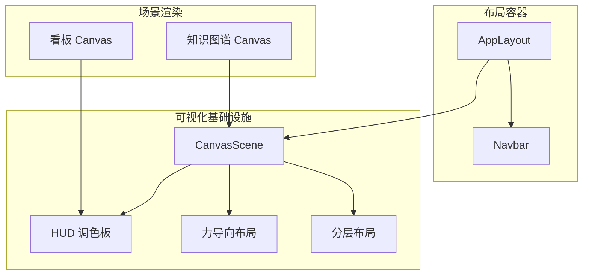
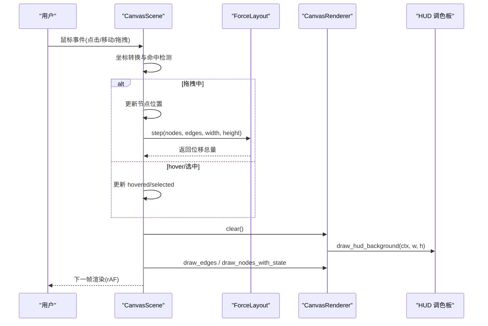
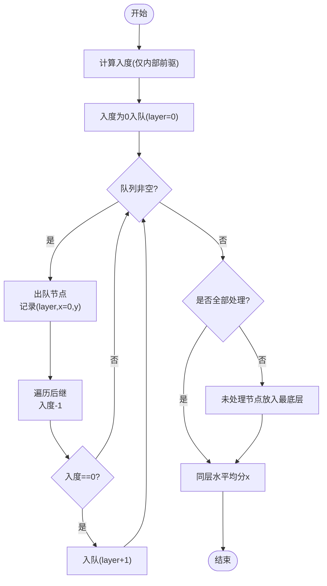
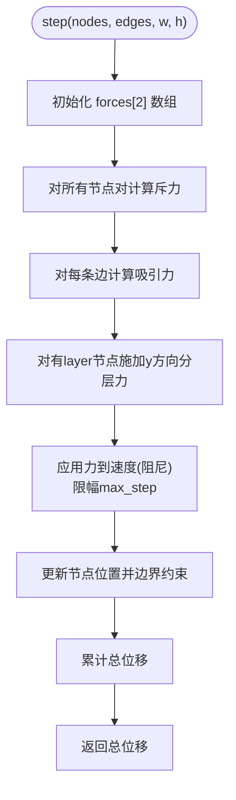
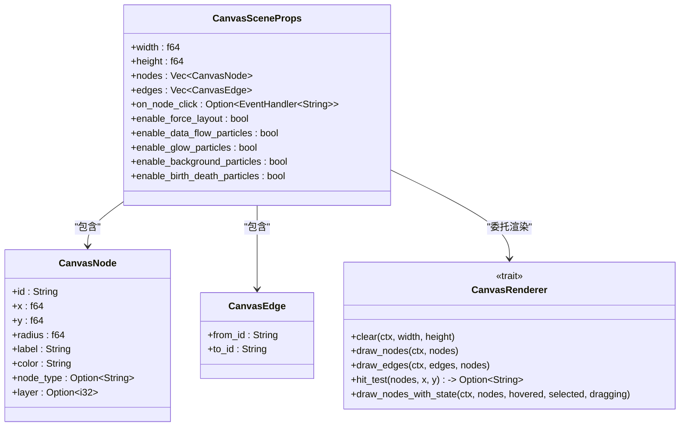
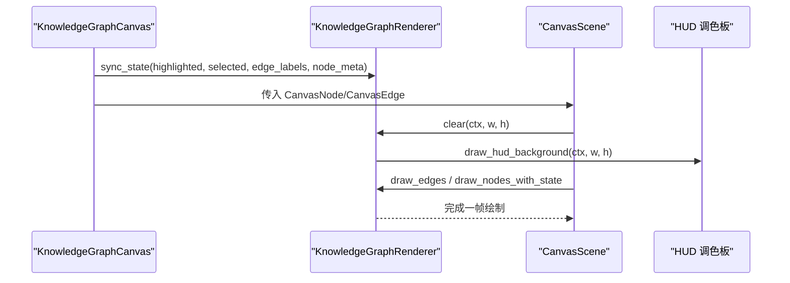
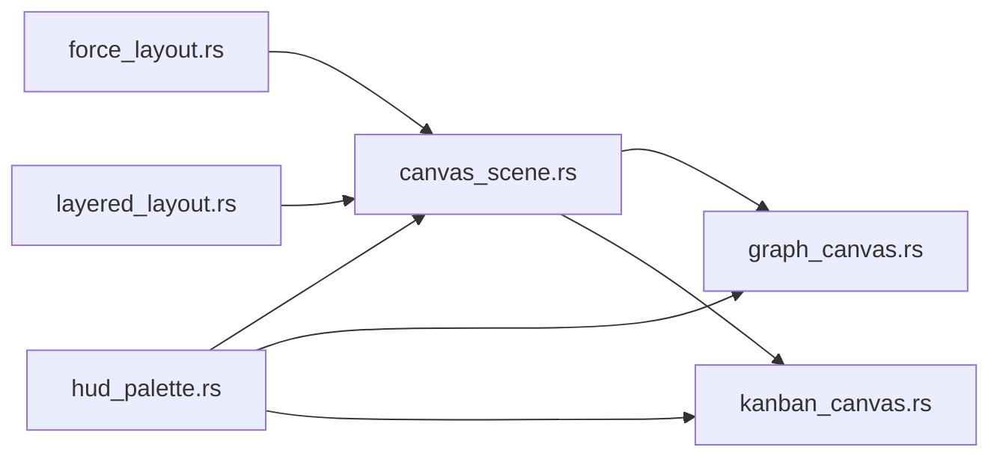

# 布局组件

<cite>
**本文引用的文件**
- [frontend/src/components/layered_layout.rs](file://frontend/src/components/layered_layout.rs)
- [frontend/src/components/force_layout.rs](file://frontend/src/components/force_layout.rs)
- [frontend/src/components/canvas_scene.rs](file://frontend/src/components/canvas_scene.rs)
- [frontend/src/components/hud_palette.rs](file://frontend/src/components/hud_palette.rs)
- [frontend/src/components/graph_canvas.rs](file://frontend/src/components/graph_canvas.rs)
- [frontend/src/components/kanban_canvas.rs](file://frontend/src/components/kanban_canvas.rs)
- [frontend/src/layouts/app_layout.rs](file://frontend/src/layouts/app_layout.rs)
- [frontend/src/layouts/navbar.rs](file://frontend/src/layouts/navbar.rs)
</cite>

## 目录
1. [简介](#简介)
2. [项目结构](#项目结构)
3. [核心组件](#核心组件)
4. [架构总览](#架构总览)
5. [详细组件分析](#详细组件分析)
6. [依赖关系分析](#依赖关系分析)
7. [性能考虑](#性能考虑)
8. [故障排查指南](#故障排查指南)
9. [结论](#结论)
10. [附录](#附录)

## 简介
本文件面向 AI Orz 前端应用的布局与可视化组件，重点覆盖：
- 分层布局（DAG 拓扑分层 + 同层水平均分）
- HUD 调色板（驾驶舱风格背景、网格、四角装饰）
- 力导向布局（斥力/引力/阻尼/边界/分层约束）
- Canvas 场景基础设施（渲染循环、事件桥、粒子系统开关）
- 知识图谱 Canvas 渲染器（HUD 风格节点/边动画）
- 看板 Canvas（多列泳道任务视图）
- 应用级布局（导航栏 + 内容区 + 权限守卫）

目标读者包括需要实现复杂界面布局、动态调整与自适应策略的前端开发者。

## 项目结构
前端布局相关代码主要位于 frontend/src/components 与 frontend/src/layouts：
- components：通用可视化与布局算法（分层、力导向）、Canvas 基础设施、HUD 视觉库、具体场景渲染（知识图谱、看板）。
- layouts：页面级布局容器（AppLayout、Navbar），负责整体结构与导航。

图表来源
- [frontend/src/layouts/app_layout.rs:1-28](file://frontend/src/layouts/app_layout.rs#L1-L28)
- [frontend/src/layouts/navbar.rs:1-800](file://frontend/src/layouts/navbar.rs#L1-L800)
- [frontend/src/components/canvas_scene.rs:1-579](file://frontend/src/components/canvas_scene.rs#L1-L579)
- [frontend/src/components/hud_palette.rs:1-123](file://frontend/src/components/hud_palette.rs#L1-L123)
- [frontend/src/components/force_layout.rs:1-324](file://frontend/src/components/force_layout.rs#L1-L324)
- [frontend/src/components/layered_layout.rs:1-269](file://frontend/src/components/layered_layout.rs#L1-L269)
- [frontend/src/components/graph_canvas.rs:1-526](file://frontend/src/components/graph_canvas.rs#L1-L526)
- [frontend/src/components/kanban_canvas.rs:1-286](file://frontend/src/components/kanban_canvas.rs#L1-L286)

章节来源
- [frontend/src/layouts/app_layout.rs:1-28](file://frontend/src/layouts/app_layout.rs#L1-L28)
- [frontend/src/layouts/navbar.rs:1-800](file://frontend/src/layouts/navbar.rs#L1-L800)

## 核心组件
- 分层布局：基于 Kahn 拓扑排序计算层级，处理环检测，同层节点水平均分。
- 力导向布局：斥力（库仑力）、吸引力（胡克定律）、阻尼、边界约束、可选分层约束。
- Canvas 场景：封装 <canvas>、渲染循环（requestAnimationFrame）、事件桥（命中检测、拖拽、hover/选中）、粒子系统开关。
- HUD 调色板：深色基底、径向光晕、网格线、四角刻度线，统一视觉锚点色。
- 知识图谱 Canvas：自定义 CanvasRenderer，HUD 风格节点/边动画，外部状态同步（高亮/选中/标签/元数据）。
- 看板 Canvas：多列泳道任务视图，HUD 背景，卡片优先级与进度条。
- 应用布局：AppLayout 提供导航 + 内容区，含权限守卫；Navbar 提供多级菜单与移动端抽屉。

章节来源
- [frontend/src/components/layered_layout.rs:1-269](file://frontend/src/components/layered_layout.rs#L1-L269)
- [frontend/src/components/force_layout.rs:1-324](file://frontend/src/components/force_layout.rs#L1-L324)
- [frontend/src/components/canvas_scene.rs:1-579](file://frontend/src/components/canvas_scene.rs#L1-L579)
- [frontend/src/components/hud_palette.rs:1-123](file://frontend/src/components/hud_palette.rs#L1-L123)
- [frontend/src/components/graph_canvas.rs:1-526](file://frontend/src/components/graph_canvas.rs#L1-L526)
- [frontend/src/components/kanban_canvas.rs:1-286](file://frontend/src/components/kanban_canvas.rs#L1-L286)
- [frontend/src/layouts/app_layout.rs:1-28](file://frontend/src/layouts/app_layout.rs#L1-L28)
- [frontend/src/layouts/navbar.rs:1-800](file://frontend/src/layouts/navbar.rs#L1-L800)

## 架构总览
Canvas 场景作为渲染中枢，组合多种布局与视觉效果：
- 数据输入：节点/边列表（CanvasNode/CanvasEdge）
- 布局引擎：力导向（可启用）、分层布局（由上层传入 layer）
- 渲染管线：清空 → 背景粒子 → 连线 → 数据流粒子 → 辉光粒子 → 节点 → 诞生/消亡粒子
- 交互：鼠标事件 → 坐标转换 → 命中检测 → 更新状态 → 触发回调

图表来源
- [frontend/src/components/canvas_scene.rs:258-579](file://frontend/src/components/canvas_scene.rs#L258-L579)
- [frontend/src/components/force_layout.rs:54-178](file://frontend/src/components/force_layout.rs#L54-L178)
- [frontend/src/components/hud_palette.rs:37-123](file://frontend/src/components/hud_palette.rs#L37-L123)
- [frontend/src/components/graph_canvas.rs:96-186](file://frontend/src/components/graph_canvas.rs#L96-L186)

## 详细组件分析

### 分层布局（DAG 拓扑分层 + 同层水平均分）
- 算法要点
  - 入度计算：仅统计在 node_ids 集合内的前驱，跨项目依赖忽略。
  - BFS 分层：Kahn 算法，入度为 0 的节点进入队列，后继入度归零后入队并提升一层。
  - 环检测：若处理后数量小于总数，剩余节点强制放入最底层。
  - 同层均分：按可用宽度等间距分配 x，单节点居中。
- 配置项
  - 画布宽高、顶部留白、层间距、两侧留白。
- 复杂度
  - 时间 O(V+E)，空间 O(V+E)。
- 适用场景
  - DAG 型流程图、任务依赖图、工作流编排。

图表来源
- [frontend/src/components/layered_layout.rs:40-150](file://frontend/src/components/layered_layout.rs#L40-L150)

章节来源
- [frontend/src/components/layered_layout.rs:1-269](file://frontend/src/components/layered_layout.rs#L1-L269)

### 力导向布局（斥力/引力/阻尼/边界/分层约束）
- 模型
  - 斥力：所有节点对互相排斥（反比于距离平方）。
  - 吸引力：有连线的节点对互相吸引（胡克定律，正比于距离差）。
  - 分层约束：对带 layer 字段的节点施加 y 方向拉力到目标层。
  - 阻尼与限幅：速度衰减，单帧最大位移限制，防止爆炸性跳动。
  - 边界约束：节点不超出画布范围。
- 稳定检测
  - 通过每帧总位移判断是否收敛。
- 初始布局
  - 圆形均匀分布，避免初始重叠。
- 复杂度
  - 每帧斥力 O(N^2)，吸引力 O(E)。

图表来源
- [frontend/src/components/force_layout.rs:75-178](file://frontend/src/components/force_layout.rs#L75-L178)

章节来源
- [frontend/src/components/force_layout.rs:1-324](file://frontend/src/components/force_layout.rs#L1-L324)

### Canvas 场景基础设施
- 职责
  - 管理 <canvas> 元素与 Context 初始化（高清屏适配）。
  - 维护节点实时位置、力导向模拟器、稳定标志、拖拽/hover/选中状态。
  - 渲染循环：requestAnimationFrame 递归调用，每帧步进力学 + 重绘。
  - 事件桥：鼠标事件 → 坐标转换 → 命中检测 → Dioxus 回调。
  - 粒子系统：数据流、辉光、背景、诞生/消亡粒子（可开关）。
- 关键流程
  - props 同步：保留已有节点位置，新增节点用圆形布局初始化。
  - 渲染顺序：背景粒子 → 连线 → 数据流粒子 → 辉光粒子 → 节点 → 诞生/消亡粒子。
  - 清理：组件卸载时停止 rAF 并释放 Closure 引用。

图表来源
- [frontend/src/components/canvas_scene.rs:21-74](file://frontend/src/components/canvas_scene.rs#L21-L74)
- [frontend/src/components/canvas_scene.rs:211-256](file://frontend/src/components/canvas_scene.rs#L211-L256)

章节来源
- [frontend/src/components/canvas_scene.rs:1-579](file://frontend/src/components/canvas_scene.rs#L1-L579)

### HUD 调色板
- 功能
  - 深色基底填充、径向渐变光晕、淡橙色网格线、四角刻度线。
  - 颜色工具：hex_to_rgba 将十六进制转为 rgba 字符串。
- 使用方式
  - 在 CanvasRenderer::clear 中调用 draw_hud_background 绘制完整 HUD 背景。
- 视觉锚点
  - 主色 #fa520f 贯穿背景、网格、四角，形成统一驾驶舱观感。

章节来源
- [frontend/src/components/hud_palette.rs:1-123](file://frontend/src/components/hud_palette.rs#L1-L123)

### 知识图谱 Canvas 渲染器
- 特点
  - 继承 CanvasRenderer，实现 HUD 风格节点/边渲染。
  - 支持外部状态同步（高亮、选中、边标签、节点元数据）。
  - 边流光动画（实线边 dashoffset 滚动，虚线边静态），选中关联边加速。
  - 节点态：选中态扫描环 + 旋转刻度环；未选中态呼吸光晕；多色 tag 边框弧段。
- 与 CanvasScene 集成
  - KnowledgeGraphCanvas 将 GraphNode/GraphEdge 转换为 CanvasNode/CanvasEdge。
  - 关闭 CanvasScene 自带粒子，避免视觉过载。

图表来源
- [frontend/src/components/graph_canvas.rs:96-186](file://frontend/src/components/graph_canvas.rs#L96-L186)
- [frontend/src/components/graph_canvas.rs:447-526](file://frontend/src/components/graph_canvas.rs#L447-L526)
- [frontend/src/components/hud_palette.rs:37-123](file://frontend/src/components/hud_palette.rs#L37-L123)

章节来源
- [frontend/src/components/graph_canvas.rs:1-526](file://frontend/src/components/graph_canvas.rs#L1-L526)

### 看板 Canvas
- 功能
  - 多列泳道展示任务，列头显示状态名与数量徽章。
  - 任务卡片：矩形背景、优先级颜色编码、标题、进度条与百分比。
  - HUD 深色背景 + 网格。
- 交互
  - 当前版本以展示为主，点击命中检测简化。

章节来源
- [frontend/src/components/kanban_canvas.rs:1-286](file://frontend/src/components/kanban_canvas.rs#L1-L286)

### 应用级布局（AppLayout + Navbar）
- AppLayout
  - 权限守卫：未登录显示加载态并重定向。
  - 结构：顶部导航 + 内容区（container + padding）。
- Navbar
  - 桌面端多级下拉菜单（人力资源、财务管理、项目管理、系统）。
  - 移动端抽屉菜单，用户信息头像与退出登录。
  - 登出流程：调用后端 logout 清除 cookie，同时清理前端状态。

章节来源
- [frontend/src/layouts/app_layout.rs:1-28](file://frontend/src/layouts/app_layout.rs#L1-L28)
- [frontend/src/layouts/navbar.rs:1-800](file://frontend/src/layouts/navbar.rs#L1-L800)

## 依赖关系分析
- 组件耦合
  - CanvasScene 依赖 ForceLayout、HUD 调色板、默认渲染器或业务自定义渲染器。
  - KnowledgeGraphRenderer 依赖 HUD 调色板与图形配色工具。
  - KanbanCanvas 直接依赖 HUD 调色板进行背景绘制。
- 外部依赖
  - Dioxus（信号、组件、事件）、web_sys（Canvas API）、wasm_bindgen（JS 互操作）。
- 潜在循环
  - 无直接循环依赖；渲染器通过 trait 解耦，CanvasScene 仅依赖抽象接口。

图表来源
- [frontend/src/components/force_layout.rs:1-324](file://frontend/src/components/force_layout.rs#L1-L324)
- [frontend/src/components/layered_layout.rs:1-269](file://frontend/src/components/layered_layout.rs#L1-L269)
- [frontend/src/components/hud_palette.rs:1-123](file://frontend/src/components/hud_palette.rs#L1-L123)
- [frontend/src/components/canvas_scene.rs:1-579](file://frontend/src/components/canvas_scene.rs#L1-L579)
- [frontend/src/components/graph_canvas.rs:1-526](file://frontend/src/components/graph_canvas.rs#L1-L526)
- [frontend/src/components/kanban_canvas.rs:1-286](file://frontend/src/components/kanban_canvas.rs#L1-L286)

章节来源
- [frontend/src/components/canvas_scene.rs:1-579](file://frontend/src/components/canvas_scene.rs#L1-L579)
- [frontend/src/components/graph_canvas.rs:1-526](file://frontend/src/components/graph_canvas.rs#L1-L526)
- [frontend/src/components/kanban_canvas.rs:1-286](file://frontend/src/components/kanban_canvas.rs#L1-L286)

## 性能考虑
- 渲染优化
  - 高清屏适配：根据 devicePixelRatio 设置 canvas 物理像素尺寸并缩放上下文。
  - 稳定检测：当力导向总位移低于阈值时停止步进，减少计算。
  - 粒子开关：按需启用/禁用粒子系统，降低开销。
  - 命中检测：逆序遍历节点，命中即返回，减少比较次数。
- 布局优化
  - 分层布局仅统计内部依赖，忽略跨项目依赖，减少无效计算。
  - 力导向步进的斥力 O(N^2)，节点数较大时可考虑分区或采样。
- 内存与生命周期
  - 组件卸载时停止 rAF 并释放 Closure，避免内存泄漏。
  - 新增节点保留已有位置，避免重置导致抖动。

## 故障排查指南
- 节点不响应点击/拖拽
  - 检查命中检测半径与节点半径是否匹配。
  - 确认 CanvasScene 已正确获取 canvas 元素与 context。
- 力导向不收敛或发散
  - 调整 repulsion/attraction/damping/max_step。
  - 检查是否存在自环边或重合节点（算法已做保护，但极端情况需观察）。
- HUD 背景异常
  - 确认 clear 中调用了 draw_hud_background。
  - 检查颜色常量与 alpha 值是否合理。
- 粒子闪烁或卡顿
  - 关闭不必要的粒子效果（enable_*_particles）。
  - 降低粒子数量或更新频率。

章节来源
- [frontend/src/components/canvas_scene.rs:491-579](file://frontend/src/components/canvas_scene.rs#L491-L579)
- [frontend/src/components/force_layout.rs:174-178](file://frontend/src/components/force_layout.rs#L174-L178)
- [frontend/src/components/hud_palette.rs:37-123](file://frontend/src/components/hud_palette.rs#L37-L123)

## 结论
AI Orz 前端布局体系以 CanvasScene 为核心，结合分层布局与力导向布局，配合 HUD 调色板与粒子系统，实现了高性能、可扩展且视觉统一的可视化能力。通过自定义 CanvasRenderer 可快速扩展新场景（如知识图谱、看板），并通过配置参数灵活调整布局与渲染行为。建议在大规模节点场景中谨慎使用力导向，并结合稳定检测与粒子开关优化性能。

## 附录
- 配置参数速查
  - 分层布局：LayeredLayoutConfig（width、height、top_margin、layer_height、side_margin）
  - 力导向布局：ForceLayoutConfig（repulsion、attraction、ideal_length、damping、max_step、layer_attraction、layer_height、layer_top_margin）
  - CanvasScene：CanvasSceneProps（width、height、nodes、edges、on_node_click、enable_*_particles）
- 扩展开发建议
  - 实现 CanvasRenderer trait 以定制节点/边绘制逻辑。
  - 复用 HUD 调色板保持视觉一致性。
  - 在 CanvasScene 中通过 props 控制布局与粒子开关，按需开启高级效果。