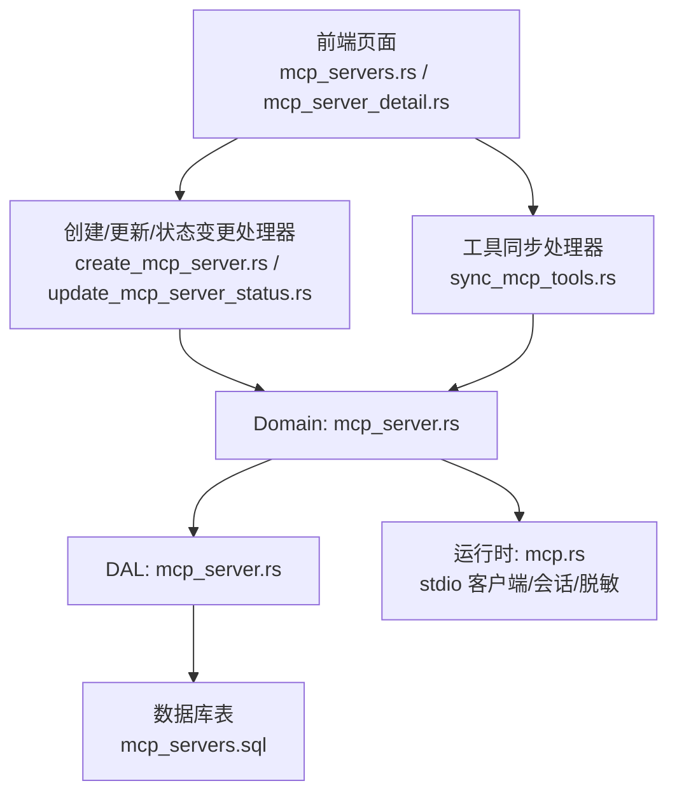
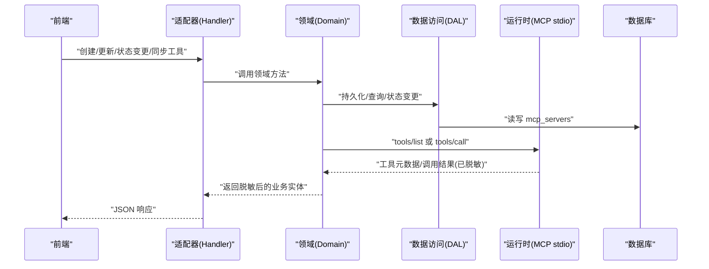
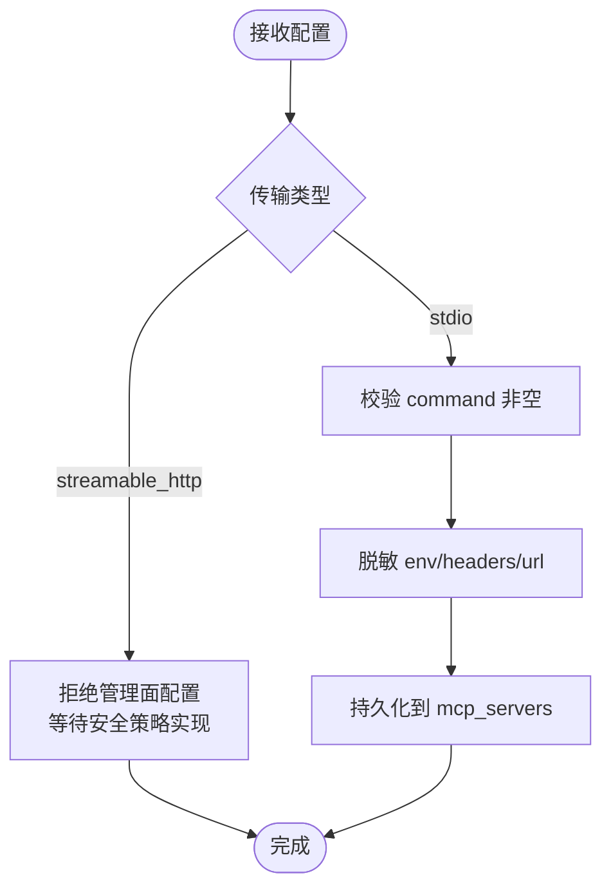
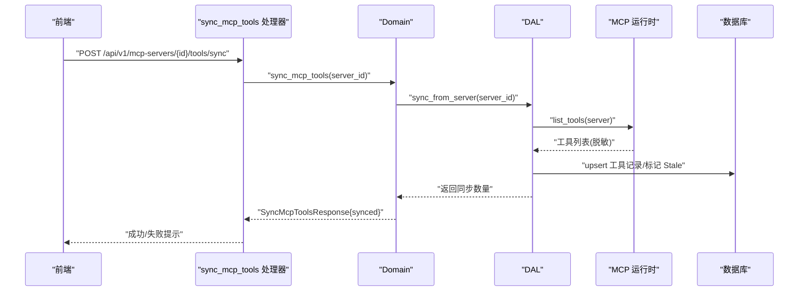
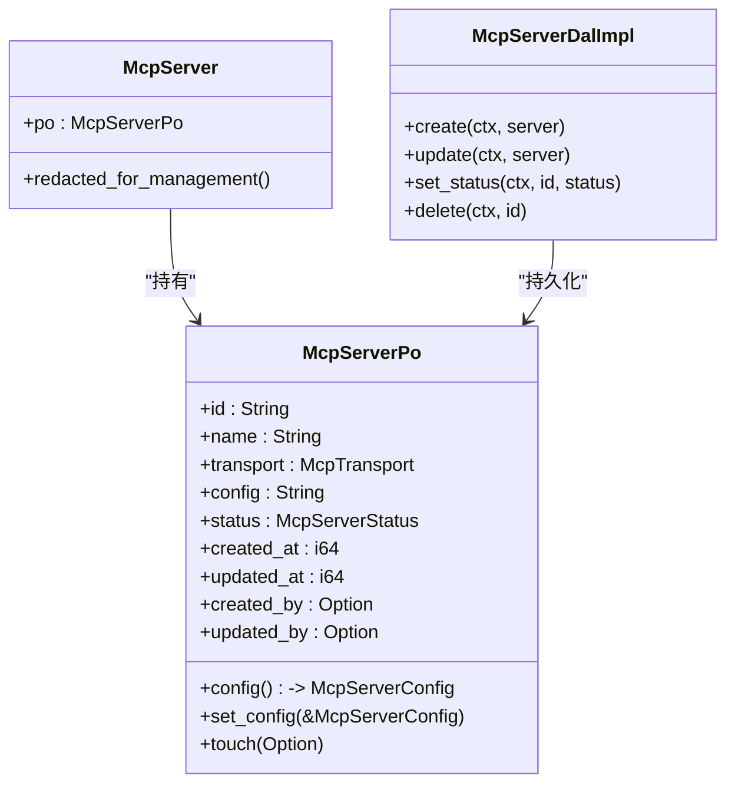
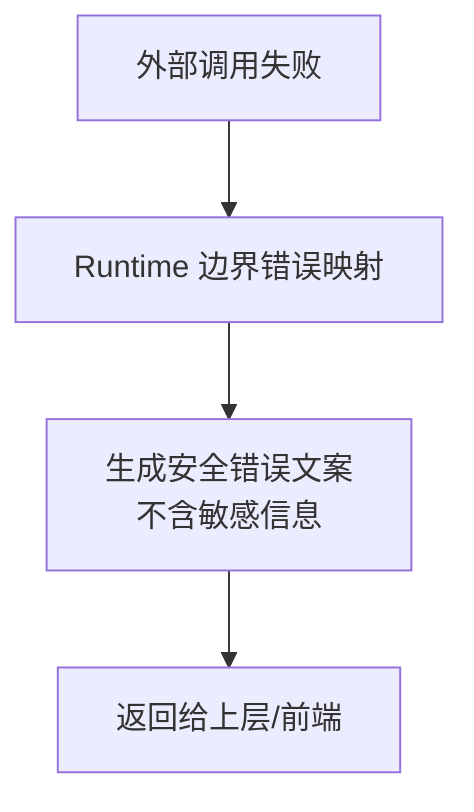
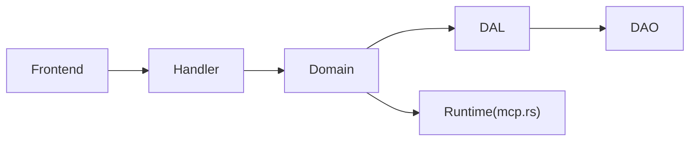

# MCP 服务器管理

<cite>
**本文引用的文件**
- [common/src/api/mcp_server.rs](file://common/src/api/mcp_server.rs)
- [common/src/enums/mcp_server.rs](file://common/src/enums/mcp_server.rs)
- [migrations/20260623000000_mcp_servers.sql](file://migrations/20260623000000_mcp_servers.sql)
- [src/models/mcp_server.rs](file://src/models/mcp_server.rs)
- [src/service/dal/mcp_server.rs](file://src/service/dal/mcp_server.rs)
- [src/service/domain/finance/mcp_server.rs](file://src/service/domain/finance/mcp_server.rs)
- [src/handlers/finance/mcp_server/mod.rs](file://src/handlers/finance/mcp_server/mod.rs)
- [src/handlers/finance/mcp_server/create_mcp_server.rs](file://src/handlers/finance/mcp_server/create_mcp_server.rs)
- [src/handlers/finance/mcp_server/update_mcp_server_status.rs](file://src/handlers/finance/mcp_server/update_mcp_server_status.rs)
- [src/handlers/finance/mcp_tool/sync_mcp_tools.rs](file://src/handlers/finance/mcp_tool/sync_mcp_tools.rs)
- [src/pkg/tool_registry/mcp.rs](file://src/pkg/tool_registry/mcp.rs)
- [frontend/src/pages/finance/mcp_servers.rs](file://frontend/src/pages/finance/mcp_servers.rs)
- [frontend/src/pages/finance/mcp_server_detail.rs](file://frontend/src/pages/finance/mcp_server_detail.rs)
- [docs/mcp_tool_design.md](file://docs/mcp_tool_design.md)
</cite>

## 目录
1. [简介](#简介)
2. [项目结构](#项目结构)
3. [核心组件](#核心组件)
4. [架构总览](#架构总览)
5. [详细组件分析](#详细组件分析)
6. [依赖关系分析](#依赖关系分析)
7. [性能与可靠性](#性能与可靠性)
8. [故障排查指南](#故障排查指南)
9. [结论](#结论)
10. [附录：配置与示例](#附录：配置与示例)

## 简介
本文件面向“MCP（Model Context Protocol）服务器管理”功能，覆盖后端 API、领域与数据层、前端界面以及工具同步机制。重点说明：
- 服务器连接配置、认证设置、超时与响应大小限制
- 工具同步流程、连接状态管理与失效策略
- 健康检查、错误恢复与可观测性
- 前端管理界面的操作路径与交互
- 常见问题定位与排障建议

本项目遵循严格四层单向调用：Adapter（HTTP Handler / 公开回调 / AOP Producer）→ Domain → DAL → DAO，禁止跨层调用与同层互调；Domain 输入为 Command/Query，输出业务实体与内部事件；DAL 对外使用业务实体；通用基础设施工具位于 src/pkg/。

## 项目结构
MCP 服务器管理涉及以下关键层次与文件：
- 公共 DTO 与枚举：common/src/api/mcp_server.rs、common/src/enums/mcp_server.rs
- 模型与持久化：src/models/mcp_server.rs、migrations/20260623000000_mcp_servers.sql
- 服务层：DAL（src/service/dal/mcp_server.rs）、Domain（src/service/domain/finance/mcp_server.rs）
- 处理器（Adapter）：src/handlers/finance/mcp_server/*、src/handlers/finance/mcp_tool/sync_mcp_tools.rs
- 运行时与工具注册：src/pkg/tool_registry/mcp.rs
- 前端页面：frontend/src/pages/finance/mcp_servers.rs、frontend/src/pages/finance/mcp_server_detail.rs
- 设计文档：docs/mcp_tool_design.md

图表来源
- [src/handlers/finance/mcp_server/create_mcp_server.rs:1-48](file://src/handlers/finance/mcp_server/create_mcp_server.rs#L1-L48)
- [src/handlers/finance/mcp_server/update_mcp_server_status.rs:1-37](file://src/handlers/finance/mcp_server/update_mcp_server_status.rs#L1-L37)
- [src/handlers/finance/mcp_tool/sync_mcp_tools.rs:1-27](file://src/handlers/finance/mcp_tool/sync_mcp_tools.rs#L1-L27)
- [src/service/domain/finance/mcp_server.rs:1-113](file://src/service/domain/finance/mcp_server.rs#L1-L113)
- [src/service/dal/mcp_server.rs:1-160](file://src/service/dal/mcp_server.rs#L1-L160)
- [migrations/20260623000000_mcp_servers.sql:1-20](file://migrations/20260623000000_mcp_servers.sql#L1-L20)
- [src/pkg/tool_registry/mcp.rs:180-216](file://src/pkg/tool_registry/mcp.rs#L180-L216)

章节来源
- [src/handlers/finance/mcp_server/mod.rs:1-24](file://src/handlers/finance/mcp_server/mod.rs#L1-L24)
- [common/src/api/mcp_server.rs:1-179](file://common/src/api/mcp_server.rs#L1-L179)
- [common/src/enums/mcp_server.rs:1-49](file://common/src/enums/mcp_server.rs#L1-L49)
- [src/models/mcp_server.rs:1-322](file://src/models/mcp_server.rs#L1-L322)
- [migrations/20260623000000_mcp_servers.sql:1-20](file://migrations/20260623000000_mcp_servers.sql#L1-L20)

## 核心组件
- 公共 DTO 与枚举
  - McpServerConfigDto：包含 stdio command/args/env、streamable_http url/headers、timeout_ms/connect_timeout_ms/response_max_bytes 等配置项
  - McpTransport/McpServerStatus：传输类型与管理状态
- 模型与持久化
  - McpServer/McpServerPo：业务实体与持久化对象，支持配置脱敏（env/headers/url）
  - 数据库表 mcp_servers：存储 id/name/transport/config/status/审计字段，含唯一索引与查询索引
- 服务层
  - DAL：负责配置校验、写入、状态变更、缓存失效通知
  - Domain：统一入口，返回脱敏后的管理视图
- 处理器（Adapter）
  - 创建/更新/状态变更/列表/详情/删除
  - 工具同步：触发远端 tools/list 并落库本地 Tool 记录
- 运行时
  - stdio 客户端：按每次操作独立连接、执行、关闭；环境变量隔离；错误脱敏与安全文案
- 前端
  - 列表页：新增、启用/禁用、同步工具、删除
  - 详情页：查看脱敏配置、触发同步、切换状态、删除

章节来源
- [common/src/api/mcp_server.rs:1-179](file://common/src/api/mcp_server.rs#L1-L179)
- [common/src/enums/mcp_server.rs:1-49](file://common/src/enums/mcp_server.rs#L1-L49)
- [src/models/mcp_server.rs:1-322](file://src/models/mcp_server.rs#L1-L322)
- [src/service/dal/mcp_server.rs:1-160](file://src/service/dal/mcp_server.rs#L1-L160)
- [src/service/domain/finance/mcp_server.rs:1-113](file://src/service/domain/finance/mcp_server.rs#L1-L113)
- [src/handlers/finance/mcp_server/create_mcp_server.rs:1-48](file://src/handlers/finance/mcp_server/create_mcp_server.rs#L1-L48)
- [src/handlers/finance/mcp_server/update_mcp_server_status.rs:1-37](file://src/handlers/finance/mcp_server/update_mcp_server_status.rs#L1-L37)
- [src/handlers/finance/mcp_tool/sync_mcp_tools.rs:1-27](file://src/handlers/finance/mcp_tool/sync_mcp_tools.rs#L1-L27)
- [src/pkg/tool_registry/mcp.rs:180-216](file://src/pkg/tool_registry/mcp.rs#L180-L216)
- [frontend/src/pages/finance/mcp_servers.rs:1-306](file://frontend/src/pages/finance/mcp_servers.rs#L1-L306)
- [frontend/src/pages/finance/mcp_server_detail.rs:1-217](file://frontend/src/pages/finance/mcp_server_detail.rs#L1-L217)

## 架构总览
MCP 服务器管理采用 Adapter → Domain → DAL → DAO 的单向调用链。Domain 对上层暴露业务接口，DAL 封装持久化细节与最小校验，DAO 仅负责 PO 持久化。运行时通过 pkg/tool_registry/mcp.rs 提供 stdio 客户端能力，并在错误路径进行安全脱敏。

图表来源
- [src/handlers/finance/mcp_server/create_mcp_server.rs:1-48](file://src/handlers/finance/mcp_server/create_mcp_server.rs#L1-L48)
- [src/handlers/finance/mcp_tool/sync_mcp_tools.rs:1-27](file://src/handlers/finance/mcp_tool/sync_mcp_tools.rs#L1-L27)
- [src/service/domain/finance/mcp_server.rs:1-113](file://src/service/domain/finance/mcp_server.rs#L1-L113)
- [src/service/dal/mcp_server.rs:1-160](file://src/service/dal/mcp_server.rs#L1-L160)
- [src/pkg/tool_registry/mcp.rs:180-216](file://src/pkg/tool_registry/mcp.rs#L180-L216)
- [migrations/20260623000000_mcp_servers.sql:1-20](file://migrations/20260623000000_mcp_servers.sql#L1-L20)

## 详细组件分析

### 配置与验证
- 配置项
  - stdio：command、args、env（默认不继承系统环境）
  - streamable_http：url、headers
  - 超时与大小：timeout_ms、connect_timeout_ms、response_max_bytes
- 验证规则
  - stdio 必须提供非空 command
  - streamable_http 当前管理面未开放（需实现 HTTP 安全策略后再启用）
- 脱敏策略
  - 管理面展示时 env/headers/url 会被替换为占位符，避免泄露凭据

图表来源
- [src/service/dal/mcp_server.rs:132-159](file://src/service/dal/mcp_server.rs#L132-L159)
- [src/models/mcp_server.rs:152-167](file://src/models/mcp_server.rs#L152-L167)
- [common/src/api/mcp_server.rs:10-32](file://common/src/api/mcp_server.rs#L10-L32)

章节来源
- [src/service/dal/mcp_server.rs:132-159](file://src/service/dal/mcp_server.rs#L132-L159)
- [src/models/mcp_server.rs:152-167](file://src/models/mcp_server.rs#L152-L167)
- [common/src/api/mcp_server.rs:10-32](file://common/src/api/mcp_server.rs#L10-L32)

### 工具同步机制
- 触发点：前端“同步工具”按钮或 API 调用
- 流程：
  - 处理器调用 Domain 的 sync_mcp_tools
  - Domain 委托 DAL 从远端 MCP server 拉取 tools/list
  - 将远端工具 upsert 到本地 Tool 记录，处理缺失工具的 Stale 状态
  - 刷新后返回成功提示

图表来源
- [src/handlers/finance/mcp_tool/sync_mcp_tools.rs:1-27](file://src/handlers/finance/mcp_tool/sync_mcp_tools.rs#L1-L27)
- [src/service/domain/finance/mcp_tool.rs:1-26](file://src/service/domain/finance/mcp_tool.rs#L1-L26)
- [src/pkg/tool_registry/mcp.rs:180-216](file://src/pkg/tool_registry/mcp.rs#L180-L216)
- [docs/mcp_tool_design.md:1320-1327](file://docs/mcp_tool_design.md#L1320-L1327)

章节来源
- [src/handlers/finance/mcp_tool/sync_mcp_tools.rs:1-27](file://src/handlers/finance/mcp_tool/sync_mcp_tools.rs#L1-L27)
- [src/service/domain/finance/mcp_tool.rs:1-26](file://src/service/domain/finance/mcp_tool.rs#L1-L26)
- [docs/mcp_tool_design.md:1320-1327](file://docs/mcp_tool_design.md#L1320-L1327)

### 连接状态监控与失效策略
- 状态字段：Enabled/Disabled/Deleted
- 失效策略：
  - 更新/状态变更/删除后，DAL 会调用工具调用层的失效通知，确保下一次调用按最新配置重新连接
  - 当前 stdio 采用 per-operation 连接策略，失效标记等价于下次调用读取最新配置
- 管理面展示：
  - 列表与详情显示脱敏配置与状态，支持启用/禁用/删除

图表来源
- [src/models/mcp_server.rs:224-322](file://src/models/mcp_server.rs#L224-L322)
- [src/service/dal/mcp_server.rs:71-129](file://src/service/dal/mcp_server.rs#L71-L129)

章节来源
- [src/models/mcp_server.rs:224-322](file://src/models/mcp_server.rs#L224-L322)
- [src/service/dal/mcp_server.rs:71-129](file://src/service/dal/mcp_server.rs#L71-L129)

### 错误恢复与安全脱敏
- 运行时错误脱敏：
  - stdio 命令解析失败、tools/list/call 下层失败、session close 失败均返回安全文案，不暴露 command/env/credential/URL host
- Runtime 边界映射：
  - 超时、server 不存在、server disabled、tool disabled/not found 等语义错误映射为只含 tool_id 的安全消息
- 管理面脱敏：
  - 配置中的敏感字段在返回前被替换为占位符

图表来源
- [src/pkg/tool_registry/mcp.rs:180-216](file://src/pkg/tool_registry/mcp.rs#L180-L216)
- [docs/mcp_tool_design.md:926-937](file://docs/mcp_tool_design.md#L926-L937)

章节来源
- [src/pkg/tool_registry/mcp.rs:180-216](file://src/pkg/tool_registry/mcp.rs#L180-L216)
- [docs/mcp_tool_design.md:926-937](file://docs/mcp_tool_design.md#L926-L937)

### 前端管理界面
- 列表页：
  - 加载服务器列表、新增服务器（选择传输方式与配置）、启用/禁用、同步工具、删除
- 详情页：
  - 展示脱敏配置、触发同步、切换状态、删除确认
- 交互反馈：
  - 使用 toast 提示成功/失败，操作后刷新列表或详情

章节来源
- [frontend/src/pages/finance/mcp_servers.rs:1-306](file://frontend/src/pages/finance/mcp_servers.rs#L1-L306)
- [frontend/src/pages/finance/mcp_server_detail.rs:1-217](file://frontend/src/pages/finance/mcp_server_detail.rs#L1-L217)

## 依赖关系分析
- 处理器依赖 Domain 暴露的业务接口
- Domain 依赖 DAL 进行数据访问与最小校验
- DAL 依赖 DAO 进行 PO 持久化，并在状态变更后触发工具调用层失效
- 运行时依赖 stdio 客户端执行 MCP 协议操作，错误路径统一脱敏
- 前端依赖公共 DTO 与枚举进行请求构造与响应渲染

图表来源
- [src/handlers/finance/mcp_server/mod.rs:1-24](file://src/handlers/finance/mcp_server/mod.rs#L1-L24)
- [src/service/domain/finance/mcp_server.rs:1-113](file://src/service/domain/finance/mcp_server.rs#L1-L113)
- [src/service/dal/mcp_server.rs:1-160](file://src/service/dal/mcp_server.rs#L1-L160)
- [src/pkg/tool_registry/mcp.rs:180-216](file://src/pkg/tool_registry/mcp.rs#L180-L216)

章节来源
- [src/handlers/finance/mcp_server/mod.rs:1-24](file://src/handlers/finance/mcp_server/mod.rs#L1-L24)
- [src/service/domain/finance/mcp_server.rs:1-113](file://src/service/domain/finance/mcp_server.rs#L1-L113)
- [src/service/dal/mcp_server.rs:1-160](file://src/service/dal/mcp_server.rs#L1-L160)
- [src/pkg/tool_registry/mcp.rs:180-216](file://src/pkg/tool_registry/mcp.rs#L180-L216)

## 性能与可靠性
- 连接策略
  - stdio 采用 per-operation 连接，避免共享 session 带来的并发锁与生命周期问题
- 超时与大小限制
  - timeout_ms/connect_timeout_ms/response_max_bytes 用于控制调用与响应体大小，防止资源占用过大
- 失效与一致性
  - 更新/状态变更/删除后触发失效通知，确保下一次调用使用最新配置
- 错误恢复
  - 运行时错误统一脱敏并映射为安全文案，避免泄露敏感信息
- 可扩展性
  - 未来可引入 session cache、reconnect、health check 与并发策略优化

章节来源
- [src/pkg/tool_registry/mcp.rs:180-216](file://src/pkg/tool_registry/mcp.rs#L180-L216)
- [common/src/api/mcp_server.rs:10-32](file://common/src/api/mcp_server.rs#L10-L32)
- [docs/mcp_tool_design.md:1346-1352](file://docs/mcp_tool_design.md#L1346-L1352)

## 故障排查指南
- 无法创建 MCP 服务器
  - 检查传输类型是否为 stdio（当前 streamable_http 管理面未开放）
  - 确认 command 非空且可执行
  - 参考配置校验逻辑与错误提示
- 工具同步失败
  - 检查远端 MCP server 是否可达、tools/list 是否正常返回
  - 查看运行时日志中的安全错误文案（不包含敏感信息）
  - 确认本地工具记录未被手动禁用或处于 Stale 状态
- 调用超时或失败
  - 调整 timeout_ms/connect_timeout_ms/response_max_bytes
  - 检查环境变量与命令路径是否正确
  - 关注运行时错误映射（超时、server disabled、tool not found 等）
- 管理面配置泄露风险
  - 确认返回的配置已脱敏（env/headers/url）
  - 若发现明文，检查 redacted_for_management 逻辑与上游数据处理

章节来源
- [src/service/dal/mcp_server.rs:132-159](file://src/service/dal/mcp_server.rs#L132-L159)
- [src/pkg/tool_registry/mcp.rs:180-216](file://src/pkg/tool_registry/mcp.rs#L180-L216)
- [docs/mcp_tool_design.md:926-937](file://docs/mcp_tool_design.md#L926-L937)
- [common/src/api/mcp_server.rs:10-32](file://common/src/api/mcp_server.rs#L10-L32)

## 结论
MCP 服务器管理功能通过清晰的层次划分与严格的错误脱敏策略，提供了安全的配置管理、工具同步与状态管理能力。当前版本聚焦 stdio 传输与 per-operation 连接策略，后续可按需引入 HTTP 传输、session 缓存与健康检查以增强性能与可靠性。前端界面提供了直观的操作入口与反馈，便于管理员快速集成与维护 MCP 服务器。

## 附录：配置与示例
- 创建 MCP 服务器（stdio）
  - name：服务器显示名称
  - transport：stdio
  - config：
    - command：可执行命令
    - args：参数数组
    - env：环境变量键值对（默认不继承系统环境）
    - timeout_ms/connect_timeout_ms/response_max_bytes：按需设置
- 创建 MCP 服务器（streamable_http）
  - 当前管理面未开放，需在实现 HTTP 安全策略后启用
  - 预计字段：url、headers、超时与大小限制
- 工具同步
  - 调用 POST /api/v1/mcp-servers/{server_id}/tools/sync
  - 成功后本地 Tool 记录更新，缺失工具标记为 Stale
- 状态管理
  - 启用/禁用：PUT /api/v1/finance/mcp-servers/{id}/status
  - 删除：DELETE /api/v1/finance/mcp-servers/{id}

章节来源
- [common/src/api/mcp_server.rs:34-104](file://common/src/api/mcp_server.rs#L34-L104)
- [src/handlers/finance/mcp_server/create_mcp_server.rs:1-48](file://src/handlers/finance/mcp_server/create_mcp_server.rs#L1-L48)
- [src/handlers/finance/mcp_server/update_mcp_server_status.rs:1-37](file://src/handlers/finance/mcp_server/update_mcp_server_status.rs#L1-L37)
- [src/handlers/finance/mcp_tool/sync_mcp_tools.rs:1-27](file://src/handlers/finance/mcp_tool/sync_mcp_tools.rs#L1-L27)
- [docs/mcp_tool_design.md:1320-1327](file://docs/mcp_tool_design.md#L1320-L1327)