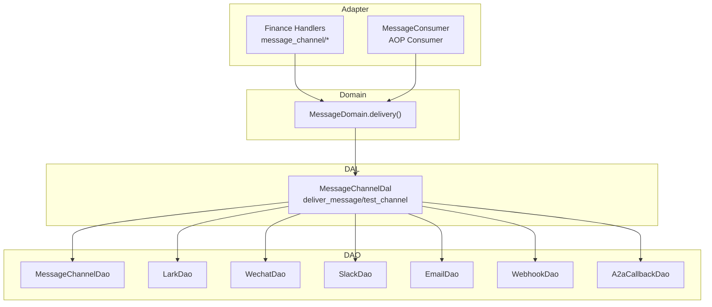
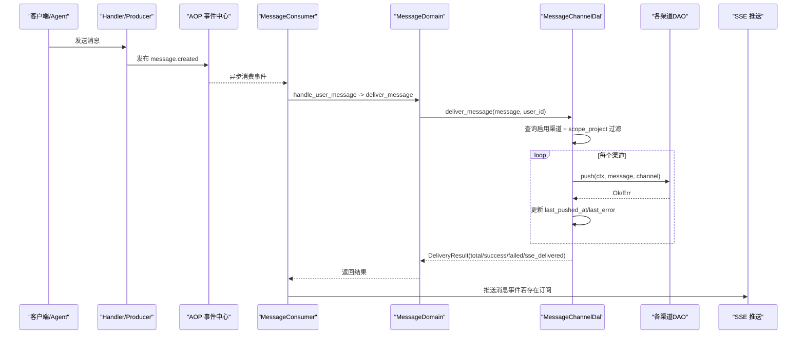
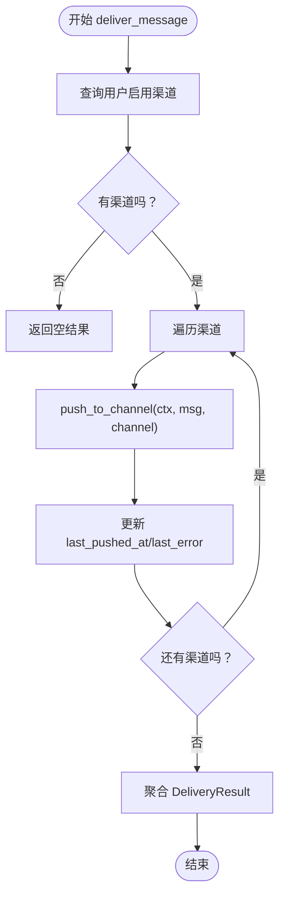
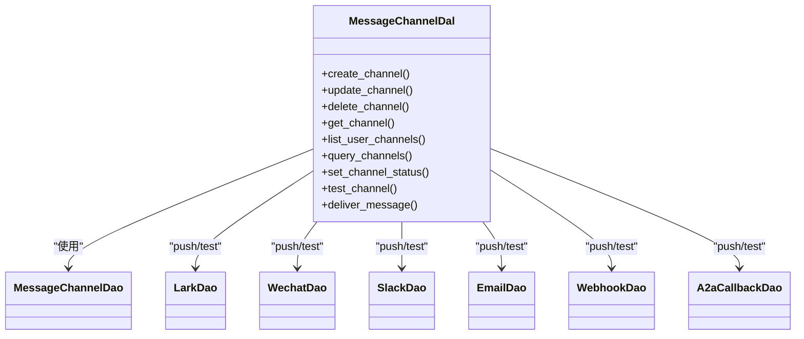

# 消息渠道管理

<cite>
**本文引用的文件**
- [message_channel_design.md](file://docs/message_channel_design.md)
- [message_channel.rs（枚举）](file://common/src/enums/message_channel.rs)
- [message_channel.rs（模型）](file://src/models/message_channel.rs)
- [message_channel.rs（DAL）](file://src/service/dal/message_channel.rs)
- [message_channel.rs（DAO 模块入口）](file://src/service/dao/message_channel/mod.rs)
- [webhook DAO](file://src/service/dao/webhook/mod.rs)
- [lark DAO](file://src/service/dao/lark/mod.rs)
- [wechat DAO](file://src/service/dao/wechat/mod.rs)
- [slack DAO](file://src/service/dao/slack/mod.rs)
- [email DAO](file://src/service/dao/email/mod.rs)
- [a2a_callback DAO](file://src/service/dao/a2a_callback/mod.rs)
- [message_channel API DTO](file://common/src/api/message_channel.rs)
- [message_channel 处理器模块](file://src/handlers/finance/message_channel/mod.rs)
- [message_consumer.rs](file://src/consumer/message.rs)
- [message_delivery_test.rs](file://tests/integration/message_delivery_test.rs)
</cite>

## 目录
1. [简介](#简介)
2. [项目结构](#项目结构)
3. [核心组件](#核心组件)
4. [架构总览](#架构总览)
5. [详细组件分析](#详细组件分析)
6. [依赖关系分析](#依赖关系分析)
7. [性能与可扩展性](#性能与可扩展性)
8. [故障排查指南](#故障排查指南)
9. [结论](#结论)
10. [附录：配置示例与最佳实践](#附录：配置示例与最佳实践)

## 简介
本文件面向“消息渠道管理”功能，覆盖多渠道消息发送的配置、管理与监控界面；说明支持的渠道类型（邮件、Slack、飞书、Webhook、A2A 回调等）、连接测试、消息模板配置、发送队列与投递状态跟踪、失败重试机制、送达报告生成、权限控制、消息过滤规则与批量发送能力。文档同时给出错误处理策略与性能优化建议，确保系统可靠与可扩展。

## 项目结构
消息渠道相关代码遵循严格四层单向调用：Adapter（HTTP Handler / AOP Producer）→ Domain → DAL → DAO。渠道配置与推送由 DAL 统一整合，DAO 按渠道独立实现，Domain 仅通过 DAL 暴露的公共方法编排业务。

图表来源
- [message_channel.rs（DAL）:62-126](file://src/service/dal/message_channel.rs#L62-L126)
- [message_channel.rs（DAL）:202-284](file://src/service/dal/message_channel.rs#L202-L284)
- [message_channel_design.md:424-474](file://docs/message_channel_design.md#L424-L474)

章节来源
- [message_channel_design.md:74-159](file://docs/message_channel_design.md#L74-L159)
- [message_channel.rs（DAL）:1-126](file://src/service/dal/message_channel.rs#L1-L126)

## 核心组件
- 渠道类型与状态
  - ChannelType：支持 Lark、Wechat、Slack、Email、Webhook、A2aCallback。
  - ChannelStatus：Active、Disabled、Deleted（软删除）。
- 渠道实体与配置
  - MessageChannelPo：持久化对象，包含 org_id、user_id、agent_id、channel_type、channel_name、webhook_url、access_token、secret、config_json、status、scope_project、last_pushed_at、last_error 等。
  - ChannelConfig：各渠道扩展配置（如飞书 App ID/Secret、SMTP、Slack Bot Token、Webhook Method/Headers/Body Template 等）。
- DAL 统一接口
  - create/update/delete/get/list/query/set_status/test_channel
  - deliver_message：查询用户可用渠道并按 scope_project 过滤后逐个推送，聚合结果 DeliveryResult。
- 消费者与队列
  - MessageConsumer：订阅 message.created 事件，按 to_role 分发；User 消息走 deliver_message；全部失败时返回错误触发 nack 重试。
- API 与 Handler
  - Finance 管理面路由：创建、查询、更新、删除、状态切换、连接测试。
  - 响应脱敏：不返回敏感字段，仅提供 has_access_token/has_secret/has_config_secret 布尔标记。

章节来源
- [message_channel.rs（枚举）:9-122](file://common/src/enums/message_channel.rs#L9-L122)
- [message_channel.rs（模型）:19-255](file://src/models/message_channel.rs#L19-L255)
- [message_channel.rs（DAL）:62-126](file://src/service/dal/message_channel.rs#L62-L126)
- [message_channel.rs（DAL）:226-284](file://src/service/dal/message_channel.rs#L226-L284)
- [message_channel.rs（DAL）:340-406](file://src/service/dal/message_channel.rs#L340-L406)
- [message_channel API DTO:9-315](file://common/src/api/message_channel.rs#L9-L315)
- [message_channel 处理器模块:1-22](file://src/handlers/finance/message_channel/mod.rs#L1-L22)
- [message_consumer.rs:64-141](file://src/consumer/message.rs#L64-L141)
- [message_consumer.rs:359-389](file://src/consumer/message.rs#L359-L389)

## 架构总览
消息从生产侧进入 AOP 事件中心，消费者消费 MESSAGE_CREATED 事件并调度到 Domain 层；Domain 调用 DAL 的分发逻辑，DAL 根据渠道类型匹配具体 DAO 完成推送，并记录成功/失败状态。SSE 作为实时通道同步推送给前端。

图表来源
- [message_consumer.rs:78-128](file://src/consumer/message.rs#L78-L128)
- [message_consumer.rs:359-389](file://src/consumer/message.rs#L359-L389)
- [message_channel.rs（DAL）:226-284](file://src/service/dal/message_channel.rs#L226-L284)

## 详细组件分析

### 渠道类型与状态
- ChannelType 提供 i32 转换与字符串表示，便于存储与展示。
- ChannelStatus 定义 Active/Disabled/Deleted，并通过领域方法限制非法迁移（例如 Deleted 不可通过状态更新产生）。

章节来源
- [message_channel.rs（枚举）:9-122](file://common/src/enums/message_channel.rs#L9-L122)
- [message_channel.rs（模型）:67-107](file://src/models/message_channel.rs#L67-L107)

### 渠道实体与配置
- MessageChannelPo 承载渠道基础信息与扩展配置（config_json），支持 agent_id 绑定与 scope_project 项目级范围控制。
- ChannelConfig 为各渠道提供细粒度配置项（飞书、微信、邮件、Slack、Webhook、额外扩展字段）。

章节来源
- [message_channel.rs（模型）:115-255](file://src/models/message_channel.rs#L115-L255)

### DAL 统一分发与推送
- test_channel：按渠道类型分派至对应 DAO 的连接测试。
- deliver_message：
  - 查询用户已启用渠道；
  - 按 scope_project 过滤（NULL 表示全局，非空则需与消息 project_id 一致）；
  - 逐个渠道调用 push_to_channel；
  - 更新 last_pushed_at/last_error；
  - 聚合 DeliveryResult（total/success/failed/details/sse_delivered）。

图表来源
- [message_channel.rs（DAL）:226-284](file://src/service/dal/message_channel.rs#L226-L284)
- [message_channel.rs（DAL）:289-335](file://src/service/dal/message_channel.rs#L289-L335)

章节来源
- [message_channel.rs（DAL）:202-284](file://src/service/dal/message_channel.rs#L202-L284)
- [message_channel.rs（DAL）:289-335](file://src/service/dal/message_channel.rs#L289-L335)

### 消费者与队列、重试机制
- MessageConsumer 订阅 message.created，按 to_role 分发：
  - Agent 消息：唤醒 Agent；
  - User 消息：调用 deliver_message；
  - System 消息：工具调用等。
- 重试策略：
  - 当所有渠道投递失败且无 SSE 推送时，返回错误以触发 nack 重试；
  - 否则视为成功，避免阻塞主流程。

章节来源
- [message_consumer.rs:64-141](file://src/consumer/message.rs#L64-L141)
- [message_consumer.rs:359-389](file://src/consumer/message.rs#L359-L389)

### 管理面 API 与权限
- 受保护路由：
  - POST /api/v1/finance/message-channels
  - GET /api/v1/finance/message-channels
  - GET /api/v1/finance/message-channels/{id}
  - PUT /api/v1/finance/message-channels/{id}
  - DELETE /api/v1/finance/message-channels/{id}
  - PUT /api/v1/finance/message-channels/{id}/status
  - POST /api/v1/finance/message-channels/{id}/test
- 权限控制：
  - 路由受认证中间件保护；
  - 请求上下文 RequestContext 携带组织/用户信息，用于多租户隔离与归属校验。
- 响应脱敏：
  - 列表与详情不返回 access_token/secret/config_json 明文，仅返回 has_* 布尔标记。

章节来源
- [message_channel_design.md:52-70](file://docs/message_channel_design.md#L52-L70)
- [message_channel API DTO:9-315](file://common/src/api/message_channel.rs#L9-L315)
- [message_channel 处理器模块:1-22](file://src/handlers/finance/message_channel/mod.rs#L1-L22)

### 渠道连接测试
- 通过 /test 路由触发 DAL::test_channel，按渠道类型调用对应 DAO 的连接测试方法。
- 当前实现中 Webhook 未实际发起 HTTP 请求（返回 unsupported_operation），其他渠道按各自实现执行。

章节来源
- [message_channel.rs（DAL）:202-222](file://src/service/dal/message_channel.rs#L202-L222)
- [message_channel_design.md:23-36](file://docs/message_channel_design.md#L23-L36)

### 消息模板与格式转换
- 各渠道在自身 DAO 层进行消息格式转换（如 Markdown → 飞书卡片），DAL 不感知具体格式。
- Webhook 支持 method/headers/body_template 等通用配置项，便于灵活适配。

章节来源
- [message_channel_design.md:155-159](file://docs/message_channel_design.md#L155-L159)
- [message_channel.rs（模型）:245-255](file://src/models/message_channel.rs#L245-L255)

### 发送队列与批量发送
- 队列：基于 AOP 事件中心，MessageConsumer 异步消费 message.created，并发度可配置。
- 批量发送：deliver_message 会遍历用户所有可用渠道逐一推送，并在结果中汇总统计；如需更大吞吐，可在上层对多个消息并行调用 deliver_message。

章节来源
- [message_consumer.rs:130-141](file://src/consumer/message.rs#L130-L141)
- [message_channel.rs（DAL）:226-284](file://src/service/dal/message_channel.rs#L226-L284)

### 投递状态跟踪与送达报告
- 每次推送成功后更新 last_pushed_at，失败更新 last_error；
- DeliveryResult 提供 total/success/failed/details 聚合指标，可用于报表与告警；
- SSE 推送计数 sse_delivered 反映实时触达情况。

章节来源
- [message_channel.rs（DAL）:315-335](file://src/service/dal/message_channel.rs#L315-L335)
- [message_channel.rs（DAL）:340-406](file://src/service/dal/message_channel.rs#L340-L406)

### 权限控制与消息过滤
- 多租户隔离：org_id 参与查询与写入；
- 项目级范围：scope_project 控制渠道是否接收特定项目的消息；
- 角色与身份：RequestContext 携带 caller_type/user_id/agent_id 等，用于审计与权限判断。

章节来源
- [message_channel.rs（模型）:121-146](file://src/models/message_channel.rs#L121-L146)
- [message_channel.rs（DAL）:243-256](file://src/service/dal/message_channel.rs#L243-L256)

## 依赖关系分析
- DAL 依赖多个 DAO，但 DAO 之间相互独立，无循环依赖；
- Domain 仅依赖 DAL 暴露的接口；
- Handler 仅做参数解析与编排，不直接访问 DAL/DAO；
- 新增渠道只需：
  - 新建 DAO 实现；
  - 在 DAL 的 match 中添加分支；
  - 在 API DTO 中补充必要字段（可选）。

图表来源
- [message_channel.rs（DAL）:62-142](file://src/service/dal/message_channel.rs#L62-L142)
- [message_channel.rs（DAL）:289-313](file://src/service/dal/message_channel.rs#L289-L313)

章节来源
- [message_channel_design.md:424-474](file://docs/message_channel_design.md#L424-L474)
- [message_channel.rs（DAL）:62-142](file://src/service/dal/message_channel.rs#L62-L142)

## 性能与可扩展性
- 并发消费：MessageConsumer 支持并发度与空队列休眠、错误重试间隔配置，适合高吞吐场景。
- 推送隔离：单个渠道失败不影响其他渠道与 SSE；聚合失败才触发重试。
- 可扩展性：纯 match 分发，新增渠道零侵入改动；DAO 完全独立，便于并行开发与测试。
- 建议：
  - 对高频渠道（如飞书）增加限流与退避策略；
  - 对 Webhook 等外部依赖增加超时与熔断；
  - 对 deliver_message 的上层调用进行批量化与背压控制。

[本节为通用指导，无需源码引用]

## 故障排查指南
- 常见问题定位
  - 渠道未生效：检查 status 是否为 Active，scope_project 是否与消息 project_id 匹配；
  - Webhook 未收到请求：当前通用 Webhook 尚未实现，会返回 unsupported_operation；待实现后需检查 URL 可达性与超时；
  - 投递失败：查看 last_error 与 DeliveryResult.details.error；
  - 无 SSE 推送：确认是否有 SSE 订阅连接。
- 集成测试参考
  - 零渠道边界：deliver_message 返回 Ok，total/success/failed/sse_delivered 全 0；
  - 无效 URL：不向上抛错，failed 计数正确；
  - Webhook 未实现：断言 failed=1 且 details 含错误信息。

章节来源
- [message_channel_design.md:23-36](file://docs/message_channel_design.md#L23-L36)
- [message_delivery_test.rs:653-730](file://tests/integration/message_delivery_test.rs#L653-L730)
- [message_delivery_test.rs:517-651](file://tests/integration/message_delivery_test.rs#L517-L651)

## 结论
消息渠道管理通过 DAL 统一分发与 DAO 独立实现的解耦设计，实现了多渠道消息推送的可扩展与易维护。结合 AOP 事件驱动的异步消费、严格的失败重试与聚合报告，系统在可靠性与性能上具备良好基础。后续可按需完善 Webhook 等渠道的实际推送实现，并引入限流、熔断与更丰富的监控指标。

[本节为总结，无需源码引用]

## 附录：配置示例与最佳实践
- 渠道配置要点
  - 飞书：填写 app_id/app_secret/encrypt_key/verification_token/open_id/user_name；
  - 微信：填写 app_id/app_secret/open_id；
  - 邮件：填写 smtp_host/port/username/password/from_address/to_address；
  - Slack：填写 bot_token/channel_id；
  - Webhook：填写 method/headers/body_template（当前未实现实际推送）。
- 最佳实践
  - 使用 scope_project 将渠道限定到项目范围，减少误推；
  - 定期巡检 last_error 与失败率，及时修复渠道配置；
  - 对关键渠道开启告警（如连续失败阈值）；
  - 在 Domain 层组合多个渠道时，注意幂等与去重策略。

章节来源
- [message_channel.rs（模型）:197-255](file://src/models/message_channel.rs#L197-L255)
- [message_channel_design.md:194-231](file://docs/message_channel_design.md#L194-L231)