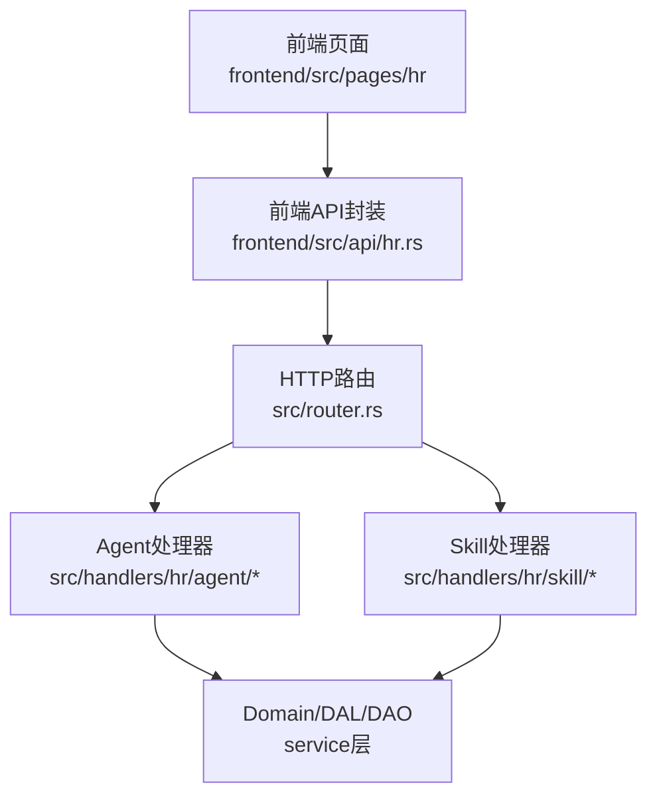
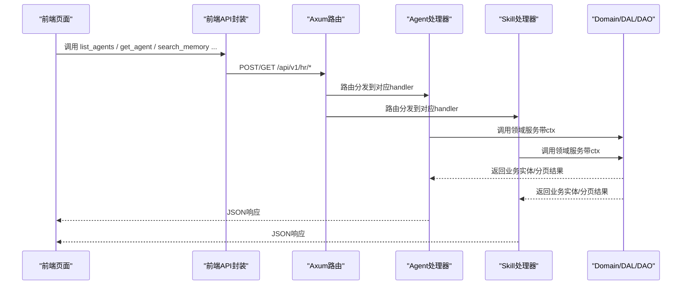
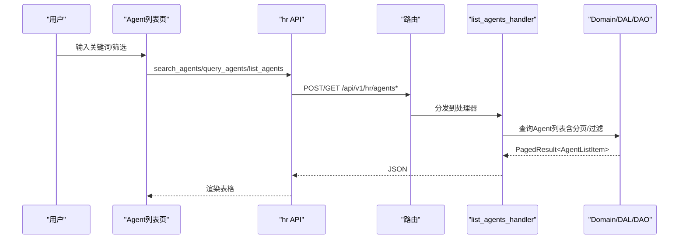
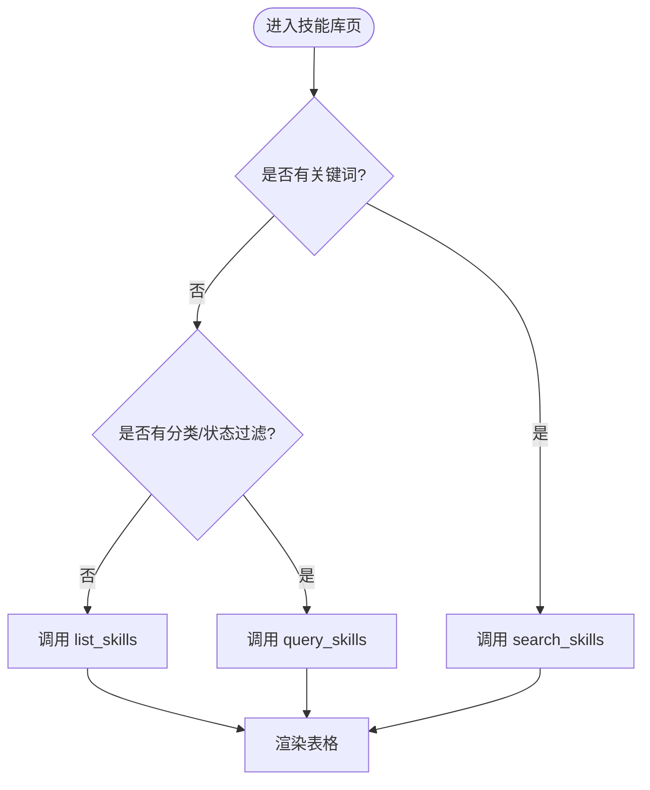
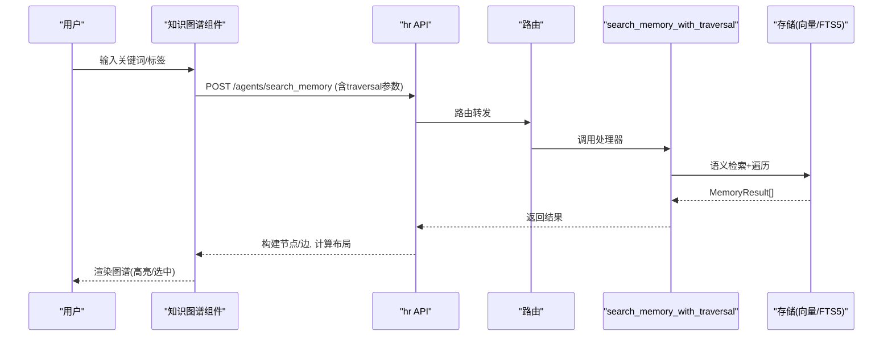
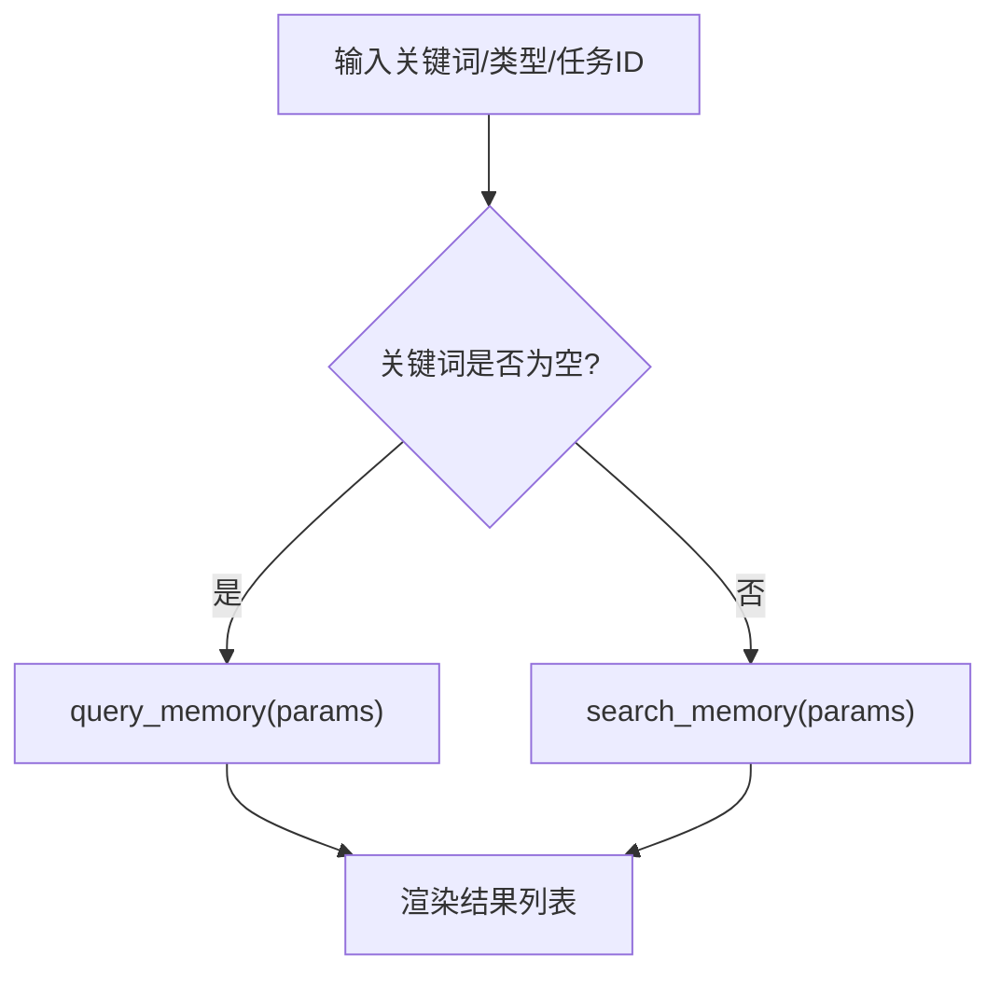
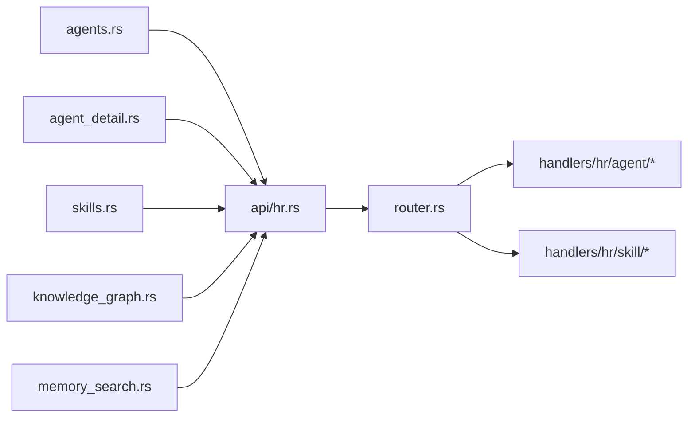

# HR 管理页面

<cite>
**本文引用的文件**
- [frontend/src/pages/hr/mod.rs](file://frontend/src/pages/hr/mod.rs)
- [frontend/src/api/hr.rs](file://frontend/src/api/hr.rs)
- [frontend/src/pages/hr/agents.rs](file://frontend/src/pages/hr/agents.rs)
- [frontend/src/pages/hr/agent_detail.rs](file://frontend/src/pages/hr/agent_detail.rs)
- [frontend/src/pages/hr/skills.rs](file://frontend/src/pages/hr/skills.rs)
- [frontend/src/pages/hr/knowledge_graph.rs](file://frontend/src/pages/hr/knowledge_graph.rs)
- [frontend/src/pages/hr/memory_search.rs](file://frontend/src/pages/hr/memory_search.rs)
- [src/handlers/hr/mod.rs](file://src/handlers/hr/mod.rs)
- [src/handlers/hr/agent/mod.rs](file://src/handlers/hr/agent/mod.rs)
- [src/handlers/hr/skill/mod.rs](file://src/handlers/hr/skill/mod.rs)
- [src/handlers/hr/agent/list_agents.rs](file://src/handlers/hr/agent/list_agents.rs)
- [src/handlers/hr/agent/get_agent.rs](file://src/handlers/hr/agent/get_agent.rs)
- [src/handlers/hr/skill/list_skills.rs](file://src/handlers/hr/skill/list_skills.rs)
- [src/router.rs](file://src/router.rs)
</cite>

## 目录
1. [简介](#简介)
2. [项目结构](#项目结构)
3. [核心组件](#核心组件)
4. [架构总览](#架构总览)
5. [详细组件分析](#详细组件分析)
6. [依赖关系分析](#依赖关系分析)
7. [性能考虑](#性能考虑)
8. [故障排查指南](#故障排查指南)
9. [结论](#结论)
10. [附录](#附录)

## 简介
本模块面向“人力资源”域的前端管理页面，覆盖 Agent 管理、技能管理、知识图谱可视化与记忆搜索四大能力。后端采用 Axum + SQLx（SQLite）+ LanceDB/HNSW 向量检索 + FTS5 全文检索；前端基于 Dioxus（WASM）+ Tailwind/DaisyUI。所有请求经路由层统一鉴权与上下文注入，Handler 调用 Domain → DAL → DAO 单向链路，保证分层清晰与可维护性。

## 项目结构
HR 管理页面由前后端协同构成：
- 前端页面位于 frontend/src/pages/hr，按功能拆分为 agents、agent_detail、skills、knowledge_graph、memory_search 等子模块，并通过 hr/mod.rs 聚合导出。
- 前端 API 封装在 frontend/src/api/hr.rs，统一调用 /api/v1/hr/* 接口。
- 后端 Handler 位于 src/handlers/hr，按 agent 与 skill 两大子域拆分，每个方法独立文件便于扩展与维护。
- 路由集中在 src/router.rs，将 /api/v1/hr/* 映射到具体 handler。

**图表来源**
- [src/router.rs:292-413](file://src/router.rs#L292-L413)
- [src/handlers/hr/agent/mod.rs:1-55](file://src/handlers/hr/agent/mod.rs#L1-L55)
- [src/handlers/hr/skill/mod.rs:1-36](file://src/handlers/hr/skill/mod.rs#L1-L36)

**章节来源**
- [frontend/src/pages/hr/mod.rs:1-8](file://frontend/src/pages/hr/mod.rs#L1-L8)
- [src/router.rs:292-413](file://src/router.rs#L292-L413)

## 核心组件
- Agent 列表页：支持分页、状态过滤、关键词搜索（防抖与竞态保护），创建本地/外部 Agent，删除确认。
- Agent 详情页：概览信息、工具包/技能包安装卸载、单个技能安装、状态切换、消息对话（SSE）、关系图数据加载、知识图谱入口。
- 技能库页：分页、分类/状态过滤、关键词搜索、创建/删除技能。
- 知识图谱页：推荐起点、语义检索+遍历、节点点击展开关联、Canvas/SVG 双渲染风格、搜索历史与高亮。
- 记忆搜索页：条件查询与语义检索双模式，结果展示与标签/摘要呈现。

**章节来源**
- [frontend/src/pages/hr/agents.rs:1-649](file://frontend/src/pages/hr/agents.rs#L1-L649)
- [frontend/src/pages/hr/agent_detail.rs:1-800](file://frontend/src/pages/hr/agent_detail.rs#L1-L800)
- [frontend/src/pages/hr/skills.rs:1-378](file://frontend/src/pages/hr/skills.rs#L1-L378)
- [frontend/src/pages/hr/knowledge_graph.rs:1-759](file://frontend/src/pages/hr/knowledge_graph.rs#L1-L759)
- [frontend/src/pages/hr/memory_search.rs:1-181](file://frontend/src/pages/hr/memory_search.rs#L1-L181)

## 架构总览
后端遵循四层单向调用：Adapter（HTTP Handler）→ Domain → DAL → DAO。Handler 通过宏注册为工具并生成 HTTP 路由，统一使用 RequestContext 传递用户与日志上下文。

**图表来源**
- [src/router.rs:292-413](file://src/router.rs#L292-L413)
- [src/handlers/hr/agent/list_agents.rs:1-62](file://src/handlers/hr/agent/list_agents.rs#L1-L62)
- [src/handlers/hr/agent/get_agent.rs:1-138](file://src/handlers/hr/agent/get_agent.rs#L1-L138)
- [src/handlers/hr/skill/list_skills.rs:1-41](file://src/handlers/hr/skill/list_skills.rs#L1-L41)

**章节来源**
- [src/router.rs:96-136](file://src/router.rs#L96-L136)
- [src/handlers/hr/agent/mod.rs:1-55](file://src/handlers/hr/agent/mod.rs#L1-L55)
- [src/handlers/hr/skill/mod.rs:1-36](file://src/handlers/hr/skill/mod.rs#L1-L36)

## 详细组件分析

### Agent 管理（列表、详情、状态）
- 列表页
  - 三场景切换：无关键词且无过滤 → list_agents；无关键词但有过滤 → query_agents；有关键词 → search_agents。
  - 搜索防抖与竞态保护：使用 search_request_id 丢弃过期请求结果，避免快速输入导致的数据错乱。
  - 模型提供商下拉选择：初始化时并行拉取 model providers，用于新建本地 Agent 的绑定。
- 详情页
  - 基本信息、能力、运行时配置、状态切换按钮（更新后刷新详情）。
  - 工具包/技能包：列出已安装、按 tag 安装/卸载；单个技能搜索安装与卸载。
  - 消息对话：发送消息（乐观用户消息 + SSE 实时接收），is_typing 超时保护。
  - 关系图数据：按 agent 的任务列表批量获取项目，避免 N+1。
- 后端
  - list_agents：排除 Deleted 状态，填充 runtime_state。
  - get_agent：可选统计、外部配置、已绑定工具 ID 列表。

**图表来源**
- [frontend/src/pages/hr/agents.rs:84-139](file://frontend/src/pages/hr/agents.rs#L84-L139)
- [src/router.rs:292-324](file://src/router.rs#L292-L324)
- [src/handlers/hr/agent/list_agents.rs:1-62](file://src/handlers/hr/agent/list_agents.rs#L1-L62)

**章节来源**
- [frontend/src/pages/hr/agents.rs:1-649](file://frontend/src/pages/hr/agents.rs#L1-L649)
- [frontend/src/pages/hr/agent_detail.rs:1-800](file://frontend/src/pages/hr/agent_detail.rs#L1-L800)
- [src/handlers/hr/agent/list_agents.rs:1-62](file://src/handlers/hr/agent/list_agents.rs#L1-L62)
- [src/handlers/hr/agent/get_agent.rs:1-138](file://src/handlers/hr/agent/get_agent.rs#L1-L138)

### 技能管理系统（浏览、安装卸载、版本控制）
- 技能库页
  - 三场景切换：list_skills / query_skills / search_skills，支持分类与状态过滤。
  - 创建技能弹窗：名称、描述、标签、分类、内容（写入 skill.md）。
- 详情页中的技能管理
  - 技能包：按 tag 安装/卸载，卸载支持是否删除副本参数。
  - 单个技能：搜索安装、卡片网格展示已安装技能，支持卸载。
- 后端
  - list_skills：默认排除 Expired，返回分页列表。

**图表来源**
- [frontend/src/pages/hr/skills.rs:42-105](file://frontend/src/pages/hr/skills.rs#L42-L105)
- [src/handlers/hr/skill/list_skills.rs:1-41](file://src/handlers/hr/skill/list_skills.rs#L1-L41)

**章节来源**
- [frontend/src/pages/hr/skills.rs:1-378](file://frontend/src/pages/hr/skills.rs#L1-L378)
- [frontend/src/pages/hr/agent_detail.rs:561-798](file://frontend/src/pages/hr/agent_detail.rs#L561-L798)
- [src/handlers/hr/skill/list_skills.rs:1-41](file://src/handlers/hr/skill/list_skills.rs#L1-L41)

### 知识图谱可视化（实体关系、节点交互、导航）
- 推荐起点：按关联度数 Top N 推荐，点击即展开。
- 语义检索+遍历：支持 traversal_depth/breadth/strategy，构建节点与边。
- 节点交互：点击节点展开关联，detail_map 限制大小防止内存增长；支持 Canvas（HUD）与 SVG 两种渲染风格。
- 搜索历史：记录最近 10 条，一键复用。

**图表来源**
- [frontend/src/pages/hr/knowledge_graph.rs:163-239](file://frontend/src/pages/hr/knowledge_graph.rs#L163-L239)
- [src/router.rs:401-412](file://src/router.rs#L401-L412)

**章节来源**
- [frontend/src/pages/hr/knowledge_graph.rs:1-759](file://frontend/src/pages/hr/knowledge_graph.rs#L1-L759)

### 记忆搜索（语义检索、结果展示、记忆管理）
- 双模式：空关键词走 query_memory（条件过滤）；有关键词走 search_memory（向量检索）。
- 结果展示：内容片段、摘要、标签、类型徽章、匹配分数。
- 任务过滤：可按 task_id 聚焦特定任务范围。

**图表来源**
- [frontend/src/pages/hr/memory_search.rs:19-75](file://frontend/src/pages/hr/memory_search.rs#L19-L75)

**章节来源**
- [frontend/src/pages/hr/memory_search.rs:1-181](file://frontend/src/pages/hr/memory_search.rs#L1-L181)

## 依赖关系分析
- 前端依赖
  - pages/hr/* 依赖 api/hr.rs 进行网络请求。
  - agent_detail 依赖 finance 域的 tool/tags 与 message SSE。
  - knowledge_graph 依赖 hr 的记忆搜索与推荐起点接口。
- 后端依赖
  - router.rs 将 /api/v1/hr/* 路由到 handlers/hr/agent 与 handlers/hr/skill。
  - 各 handler 调用 service 层 domain/dal/dao，严格单向调用。

**图表来源**
- [frontend/src/pages/hr/agents.rs:1-649](file://frontend/src/pages/hr/agents.rs#L1-L649)
- [frontend/src/pages/hr/agent_detail.rs:1-800](file://frontend/src/pages/hr/agent_detail.rs#L1-L800)
- [frontend/src/pages/hr/skills.rs:1-378](file://frontend/src/pages/hr/skills.rs#L1-L378)
- [frontend/src/pages/hr/knowledge_graph.rs:1-759](file://frontend/src/pages/hr/knowledge_graph.rs#L1-L759)
- [frontend/src/pages/hr/memory_search.rs:1-181](file://frontend/src/pages/hr/memory_search.rs#L1-L181)
- [src/router.rs:292-413](file://src/router.rs#L292-L413)

**章节来源**
- [src/router.rs:292-413](file://src/router.rs#L292-L413)

## 性能考虑
- 前端优化
  - 搜索防抖与竞态保护：agents 与 skills 列表页使用 search_request_id 丢弃过期结果，避免 race condition。
  - 聊天 is_typing 超时保护：防止 SSE 异常或 Agent 失败导致永久卡死。
  - 关系图 detail_map 容量限制：超过阈值清理无效条目，防止内存无限增长。
  - 批量数据加载：详情页按任务收集 project_ids 批量查询项目，消除 N+1。
- 后端优化
  - 列表接口默认排除无效状态（Deleted/Expired），减少无关数据。
  - 向量检索与 FTS5 结合：记忆搜索与知识图谱遍历兼顾精度与召回。
  - 统计查询按需加载：get_agent 支持 with_stats 与时间区间/粒度控制。

[本节为通用指导，不直接分析具体文件]

## 故障排查指南
- 搜索无结果或结果错乱
  - 检查是否启用防抖与 request_id 机制；确认未丢弃最新请求结果。
  - 核对关键词与过滤条件是否正确传递至后端。
- 聊天消息不更新
  - 检查 EventSource 初始化是否成功；确认 SSE 订阅路径与权限。
  - 查看 is_typing 超时逻辑是否被触发。
- 知识图谱节点不展开
  - 检查 click_request_id 是否生效；确认 detail_map 未超限。
  - 验证 traversal 参数与后端检索策略。
- 权限错误
  - 确认请求携带有效 JWT；受保护路由需通过 jwt_auth_middleware。

**章节来源**
- [frontend/src/pages/hr/agents.rs:73-139](file://frontend/src/pages/hr/agents.rs#L73-L139)
- [frontend/src/pages/hr/agent_detail.rs:238-279](file://frontend/src/pages/hr/agent_detail.rs#L238-L279)
- [frontend/src/pages/hr/knowledge_graph.rs:241-325](file://frontend/src/pages/hr/knowledge_graph.rs#L241-L325)
- [src/router.rs:96-136](file://src/router.rs#L96-L136)

## 结论
HR 管理页面以清晰的模块化组织实现了 Agent 全生命周期管理、技能体系化运营、知识图谱可视化与记忆检索一体化。前后端通过统一路由与 API 封装解耦，配合防抖、竞态保护、SSE 实时推送与向量检索，提供稳定流畅的管理体验。后续可在权限细化、缓存策略与图谱大规模渲染方面继续优化。

[本节为总结性内容，不直接分析具体文件]

## 附录
- 路由清单（HR 域）
  - Agent：列表/查询/搜索、详情、创建/更新/删除、状态更新、工具包/技能包安装卸载、记忆搜索与推荐起点。
  - Skill：列表/查询/搜索、标签、详情、文件读写、安装到 Agent。
- 关键实现参考
  - 列表页三场景切换与防抖：agents.rs、skills.rs
  - 详情页 SSE 与状态切换：agent_detail.rs
  - 知识图谱检索与渲染：knowledge_graph.rs
  - 记忆搜索双模式：memory_search.rs
  - 后端路由与处理器：router.rs、handlers/hr/*

**章节来源**
- [src/router.rs:292-413](file://src/router.rs#L292-L413)
- [frontend/src/pages/hr/agents.rs:1-649](file://frontend/src/pages/hr/agents.rs#L1-L649)
- [frontend/src/pages/hr/agent_detail.rs:1-800](file://frontend/src/pages/hr/agent_detail.rs#L1-L800)
- [frontend/src/pages/hr/skills.rs:1-378](file://frontend/src/pages/hr/skills.rs#L1-L378)
- [frontend/src/pages/hr/knowledge_graph.rs:1-759](file://frontend/src/pages/hr/knowledge_graph.rs#L1-L759)
- [frontend/src/pages/hr/memory_search.rs:1-181](file://frontend/src/pages/hr/memory_search.rs#L1-L181)