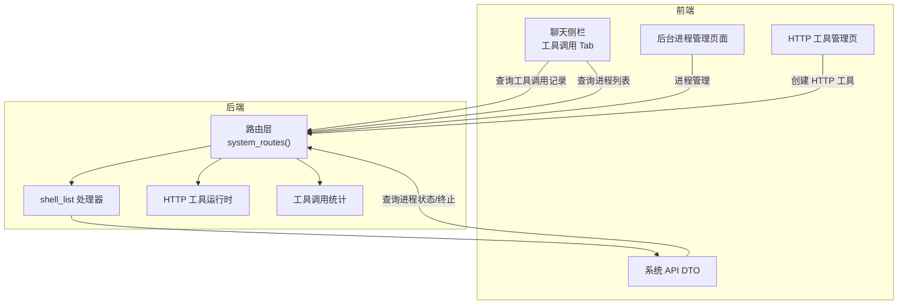
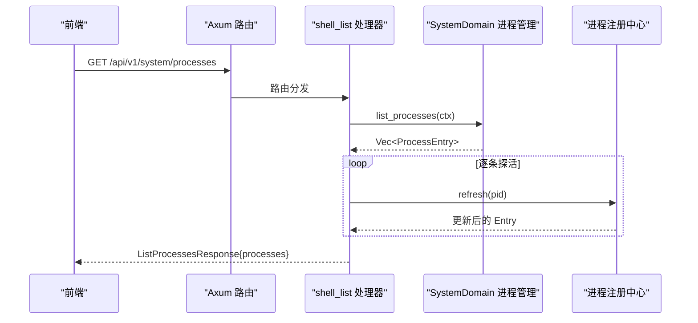
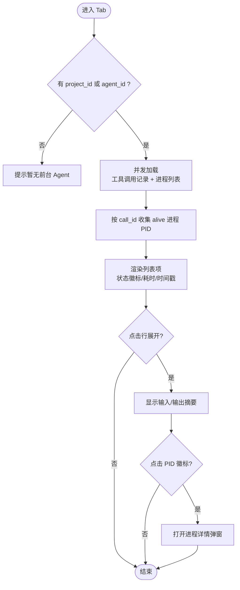
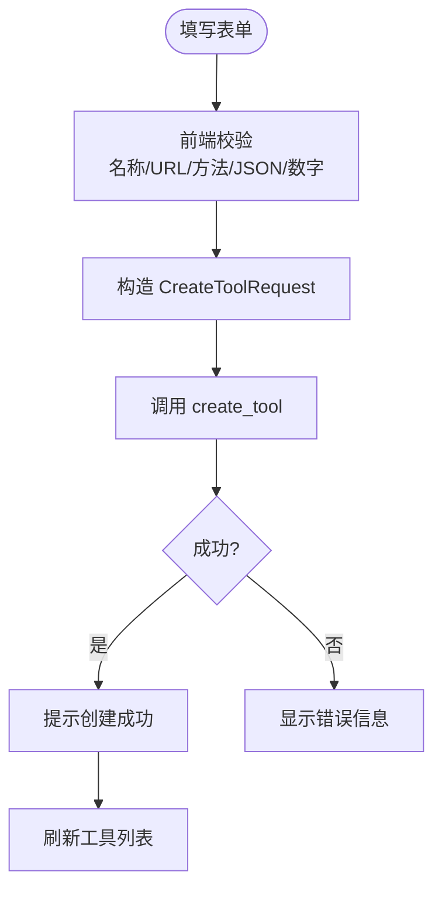
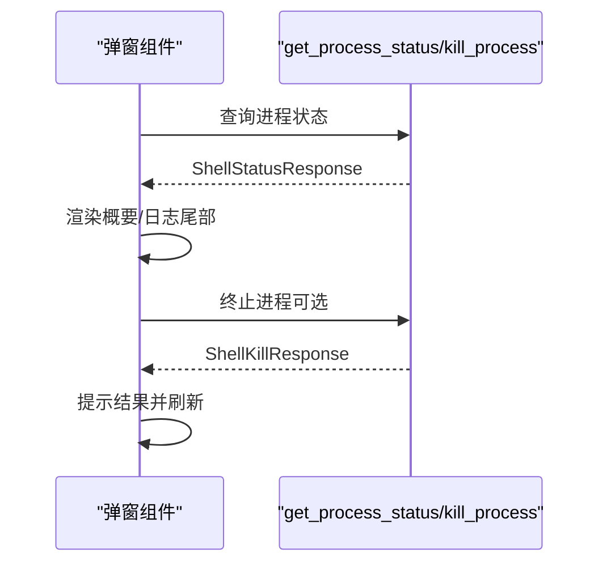
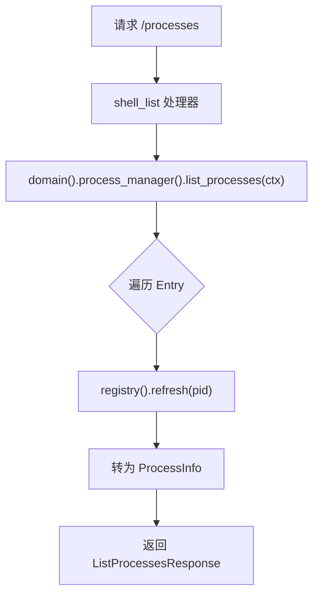
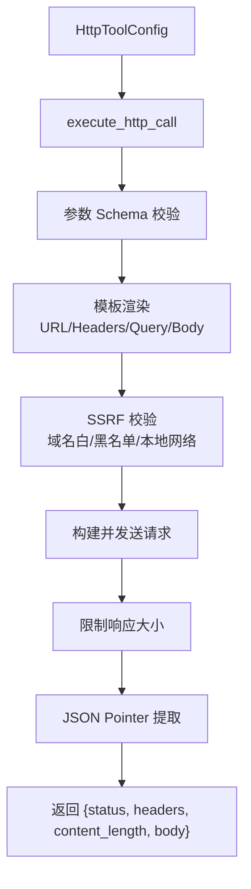
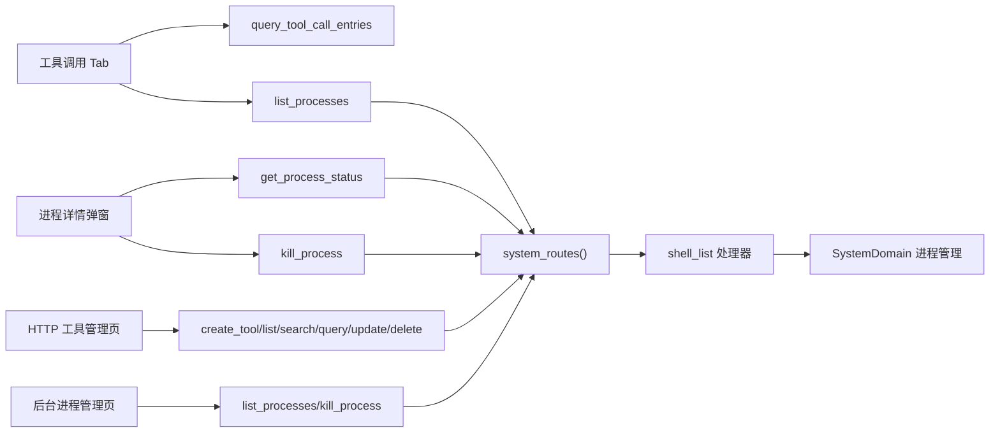

# 工具调用标签页

<cite>
**本文引用的文件**
- [frontend/src/components/chat/tool_calls_tab.rs](file://frontend/src/components/chat/tool_calls_tab.rs)
- [frontend/src/pages/finance/tools.rs](file://frontend/src/pages/finance/tools.rs)
- [frontend/src/components/create_http_tool.rs](file://frontend/src/components/create_http_tool.rs)
- [frontend/src/components/process_detail.rs](file://frontend/src/components/process_detail.rs)
- [frontend/src/pages/system/processes.rs](file://frontend/src/pages/system/processes.rs)
- [src/handlers/system/process/shell_list.rs](file://src/handlers/system/process/shell_list.rs)
- [common/src/api/system.rs](file://common/src/api/system.rs)
- [src/router.rs](file://src/router.rs)
- [src/pkg/tool_registry/http.rs](file://src/pkg/tool_registry/http.rs)
- [src/pkg/stats/tool_call.rs](file://src/pkg/stats/tool_call.rs)
- [frontend/src/components/chat/mod.rs](file://frontend/src/components/chat/mod.rs)
- [frontend/src/pages/mod.rs](file://frontend/src/pages/mod.rs)
- [frontend/src/layouts/navbar.rs](file://frontend/src/layouts/navbar.rs)
</cite>

## 更新摘要
**所做更改**
- 新增了 ChatSidePanel 工具调用标签页功能，支持项目模式和默认模式下的工具执行监控
- 增强了 HTTP 工具创建表单，提供更完整的配置选项和验证
- 添加了后台进程管理页面，支持进程列表、状态监控和操作控制
- 实现了进程详情共享组件，在多个界面间复用
- 完善了后端 shell_list 接口，支持双露（HTTP + LLM 工具）
- 集成了与进程管理系统的关联显示，支持运行中进程的实时监控

## 目录
1. [简介](#简介)
2. [项目结构](#项目结构)
3. [核心组件](#核心组件)
4. [架构总览](#架构总览)
5. [详细组件分析](#详细组件分析)
6. [依赖关系分析](#依赖关系分析)
7. [性能考虑](#性能考虑)
8. [故障排查指南](#故障排查指南)
9. [结论](#结论)
10. [附录](#附录)

## 简介
本章节聚焦"工具调用标签页"相关的前后端实现与交互闭环，涵盖：
- **新增功能**：聊天侧栏的"工具调用"Tab，展示最近工具调用记录并与运行中进程关联，支持项目模式和默认模式
- **增强功能**：HTTP 工具创建表单、后台进程管理页面、进程详情弹窗复用
- **后端支持**：后台进程列表接口（shell_list）双露（HTTP + LLM 工具）、进程状态与终止接口、HTTP 工具执行运行时与安全校验
- **数据流**：工具调用记录与运行中进程按 call_id 关联展示；SSE 自动刷新防抖；Agent scope 权限过滤

## 项目结构
围绕该功能的代码分布在前后端多个模块：
- **前端**
  - 聊天侧栏工具调用 Tab：展示最近工具调用并关联进行中的进程，支持项目模式和默认模式
  - HTTP 工具管理页：新增"创建 HTTP 工具"按钮与弹窗表单
  - 后台进程管理页面：进程列表、状态监控、操作控制
  - 进程详情共享组件：供列表页与聊天侧栏弹窗复用
- **后端**
  - 系统路由：注册 /processes 系列接口
  - shell_list 处理器：列出后台进程，逐条探活刷新 alive 状态
  - 公共 API DTO：进程信息、状态查询、终止请求响应等
  - HTTP 工具运行时：配置校验、模板渲染、SSRF 安全策略、参数 Schema 校验
  - 统计事件：工具调用指标落库

**图表来源**
- [src/router.rs:810-822](file://src/router.rs#L810-L822)
- [src/handlers/system/process/shell_list.rs:1-49](file://src/handlers/system/process/shell_list.rs#L1-L49)
- [common/src/api/system.rs:240-328](file://common/src/api/system.rs#L240-L328)
- [src/pkg/tool_registry/http.rs:41-220](file://src/pkg/tool_registry/http.rs#L41-L220)
- [src/pkg/stats/tool_call.rs:12-41](file://src/pkg/stats/tool_call.rs#L12-L41)

**章节来源**
- [src/router.rs:810-822](file://src/router.rs#L810-L822)
- [common/src/api/system.rs:240-328](file://common/src/api/system.rs#L240-L328)

## 核心组件
- **聊天侧栏"工具调用"Tab**：并行加载工具调用记录与进程列表，按 call_id 关联仍在运行的进程 PID，点击 PID 弹出进程详情，支持项目模式和默认模式
- **HTTP 工具创建表单**：对齐后端 CreateToolRequest 与 HttpToolConfig，支持方法白名单 GET/POST、URL 模板、头/查询/体模板、超时与响应大小限制、域名白黑名单、本地网络访问确认、参数 Schema
- **后台进程管理页面**：进程列表展示、状态监控、自动/手动刷新、进程终止操作
- **进程详情弹窗**：懒加载 shell_status，显示命令、call_id、日志尾部，支持刷新与终止进程
- **后端 shell_list 处理器**：通过 SystemDomain 获取进程条目，逐条 refresh 探活，返回 ProcessInfo 列表
- **HTTP 工具运行时**：解析配置、校验参数 Schema、渲染模板、构建请求、限制响应大小、JSON Pointer 提取、SSRF 防护
- **工具调用统计**：以 ToolCallEvent 记录调用次数、耗时、参数/结果大小、状态等指标

**章节来源**
- [frontend/src/components/chat/tool_calls_tab.rs:1-379](file://frontend/src/components/chat/tool_calls_tab.rs#L1-L379)
- [frontend/src/components/create_http_tool.rs:1-470](file://frontend/src/components/create_http_tool.rs#L1-L470)
- [frontend/src/pages/system/processes.rs:1-228](file://frontend/src/pages/system/processes.rs#L1-L228)
- [frontend/src/components/process_detail.rs:1-170](file://frontend/src/components/process_detail.rs#L1-L170)
- [src/handlers/system/process/shell_list.rs:1-144](file://src/handlers/system/process/shell_list.rs#L1-L144)
- [src/pkg/tool_registry/http.rs:41-240](file://src/pkg/tool_registry/http.rs#L41-L240)
- [src/pkg/stats/tool_call.rs:12-211](file://src/pkg/stats/tool_call.rs#L12-L211)

## 架构总览
遵循四层单向调用：Adapter（HTTP Handler/AOP Producer）→ Domain → DAL → DAO。本次功能主要涉及：
- Adapter：system 路由下的 shell_list/shell_status/shell_kill 处理器
- Domain：SystemDomain 的 ProcessManager（进程管理）
- 存储：进程注册中心（内存版）+ JSONL 工具调用 trace
- 前端：Dioxus 组件通过 API 客户端与后端交互

**图表来源**
- [src/router.rs:810-822](file://src/router.rs#L810-L822)
- [src/handlers/system/process/shell_list.rs:19-49](file://src/handlers/system/process/shell_list.rs#L19-L49)

**章节来源**
- [src/router.rs:810-822](file://src/router.rs#L810-L822)
- [src/handlers/system/process/shell_list.rs:19-49](file://src/handlers/system/process/shell_list.rs#L19-L49)

## 详细组件分析

### 聊天侧栏"工具调用"Tab（新增功能）
- **功能要点**
  - 根据 project_id 或 agent_id 查询工具调用记录（limit 30），避免 JSONL 扫描开销过大
  - 并行拉取进程列表，按 call_id 收集 alive 进程的 pid，形成 join 映射
  - 行展开显示 input/output 摘要（截断至固定字符数），失败时显示错误信息
  - SSE 自动刷新：refresh_tick 变化时防抖 2s，丢弃过期代际的结果
  - 点击 PID 徽标打开进程详情弹窗，复用 ProcessDetailContent
  - 支持项目模式和默认模式两种对话场景
- **关键流程**
  - 加载：并发请求工具调用记录与进程列表，使用 load_gen 防止竞态覆盖
  - 范围切换：project_id/agent_id 变化时重置展开状态并立即加载
  - 刷新：手动刷新按钮触发无防抖加载

**图表来源**
- [frontend/src/components/chat/tool_calls_tab.rs:84-293](file://frontend/src/components/chat/tool_calls_tab.rs#L84-L293)

**章节来源**
- [frontend/src/components/chat/tool_calls_tab.rs:1-379](file://frontend/src/components/chat/tool_calls_tab.rs#L1-L379)

### HTTP 工具创建表单（增强功能）
- **字段与校验**
  - 基础：name（必填）、description、tags（逗号分隔）
  - 配置：method（GET/POST）、url（必填模板）、headers/query/body（可选 JSON）、timeout_ms、response_max_bytes、allowed_status_codes、response_json_pointer、allowed_domains/blocked_domains、allow_local_network
  - parameters_schema：可选 JSON Schema，用于运行时参数校验
- **提交逻辑**
  - 前端 parse_optional_json / parse_comma_list / parse_optional_u64 等纯函数构造 CreateToolRequest
  - 调用 create_tool 接口，成功后刷新工具列表

**图表来源**
- [frontend/src/components/create_http_tool.rs:85-170](file://frontend/src/components/create_http_tool.rs#L85-L170)

**章节来源**
- [frontend/src/components/create_http_tool.rs:1-470](file://frontend/src/components/create_http_tool.rs#L1-L470)
- [frontend/src/pages/finance/tools.rs:114-123](file://frontend/src/pages/finance/tools.rs#L114-L123)

### 后台进程管理页面（新增功能）
- **功能特性**
  - 进程列表展示：PID、命令、状态、退出码、call_id、启动时间
  - 自动刷新：5秒轮询，可手动开关
  - 进程操作：查看详情、终止进程
  - 状态监控：运行中/已退出状态徽标显示
- **用户界面**
  - 顶部统计：运行中进程数量与总数
  - 表格视图：支持命令截断显示、call_id 截断
  - 操作按钮：详情查看、进程终止（带确认）

**章节来源**
- [frontend/src/pages/system/processes.rs:1-228](file://frontend/src/pages/system/processes.rs#L1-L228)

### 进程详情弹窗（共享组件）
- **数据来源**：shell_status（探活 + 日志尾部）
- **能力**：显示 PID、alive 状态、退出码、命令、启动时间、call_id、日志路径；支持刷新与终止进程
- **复用**：列表页与聊天侧栏弹窗共用同一组件，终止后回调 on_changed 触发父级重拉数据

**图表来源**
- [frontend/src/components/process_detail.rs:28-156](file://frontend/src/components/process_detail.rs#L28-L156)

**章节来源**
- [frontend/src/components/process_detail.rs:1-170](file://frontend/src/components/process_detail.rs#L1-L170)

### 后端 shell_list 处理器
- **职责**：列出后台进程，Agent 调用方仅可见自己启动的进程；逐条 refresh 探活，转换 ProcessInfo
- **权限**：由 RequestContext 决定 scope（用户 ctx 全量，Agent ctx 仅自身）
- **测试**：覆盖用户与 Agent 两种上下文场景

**图表来源**
- [src/handlers/system/process/shell_list.rs:19-49](file://src/handlers/system/process/shell_list.rs#L19-L49)

**章节来源**
- [src/handlers/system/process/shell_list.rs:1-144](file://src/handlers/system/process/shell_list.rs#L1-L144)

### HTTP 工具运行时（HttpCoreTool）
- **配置**：HttpToolConfig 定义方法、URL 模板、头/查询/体模板、超时、响应上限、允许状态码、JSON Pointer、域名白黑名单、本地网络访问开关
- **执行**：参数 Schema 校验 → 模板渲染 → SSRF 目标校验 → 构建请求 → 限制响应大小 → JSON Pointer 提取 → 返回结构化结果
- **安全**：禁止重定向、禁用代理、域名白/黑名单、本地网络需显式授权

**图表来源**
- [src/pkg/tool_registry/http.rs:41-220](file://src/pkg/tool_registry/http.rs#L41-L220)

**章节来源**
- [src/pkg/tool_registry/http.rs:41-240](file://src/pkg/tool_registry/http.rs#L41-L240)

### 工具调用统计
- **事件**：ToolCallEvent 记录 tool_id、tool_name、agent/project/task/org/user 维度、args/result 长度、duration_ms、status
- **存储**：独立表 tool_call_events，支持单条与批量插入

**章节来源**
- [src/pkg/stats/tool_call.rs:12-211](file://src/pkg/stats/tool_call.rs#L12-L211)

## 依赖关系分析
- **前端依赖**
  - 工具调用 Tab 依赖 API 客户端：query_tool_call_entries、list_processes
  - 进程详情弹窗依赖 get_process_status、kill_process
  - HTTP 工具管理页依赖 create_tool、list_tools、search_tools、query_tools、update_tool_status、delete_tool
  - 后台进程管理页依赖 list_processes、kill_process
- **后端依赖**
  - shell_list 处理器依赖 SystemDomain 进程管理与进程注册中心
  - HTTP 工具运行时依赖工具安全策略与 reqwest
  - 路由将 /processes 系列映射到对应处理器

**图表来源**
- [frontend/src/components/chat/tool_calls_tab.rs:12-16](file://frontend/src/components/chat/tool_calls_tab.rs#L12-L16)
- [frontend/src/components/process_detail.rs:8-12](file://frontend/src/components/process_detail.rs#L8-L12)
- [frontend/src/pages/finance/tools.rs:5-14](file://frontend/src/pages/finance/tools.rs#L5-L14)
- [frontend/src/pages/system/processes.rs:8-17](file://frontend/src/pages/system/processes.rs#L8-L17)
- [src/router.rs:810-822](file://src/router.rs#L810-L822)
- [src/handlers/system/process/shell_list.rs:19-49](file://src/handlers/system/process/shell_list.rs#L19-L49)

**章节来源**
- [frontend/src/components/chat/tool_calls_tab.rs:12-16](file://frontend/src/components/chat/tool_calls_tab.rs#L12-L16)
- [frontend/src/components/process_detail.rs:8-12](file://frontend/src/components/process_detail.rs#L8-L12)
- [frontend/src/pages/finance/tools.rs:5-14](file://frontend/src/pages/finance/tools.rs#L5-L14)
- [frontend/src/pages/system/processes.rs:8-17](file://frontend/src/pages/system/processes.rs#L8-L17)
- [src/router.rs:810-822](file://src/router.rs#L810-L822)
- [src/handlers/system/process/shell_list.rs:19-49](file://src/handlers/system/process/shell_list.rs#L19-L49)

## 性能考虑
- **工具调用记录限制**：ENTRY_LIMIT=30，控制 JSONL 扫描开销
- **防抖刷新**：SSE 消息触发时 sleep 2s，后到覆盖先到，减少重复请求
- **代际计数**：load_gen 丢弃过期请求结果，避免竞态导致的状态错乱
- **进程探活**：shell_list 对每个 Entry 调用 refresh，确保 alive 准确，但需注意高并发下多次 IO 的代价
- **HTTP 工具响应限制**：response_max_bytes 默认值与硬上限保护内存占用
- **自动刷新优化**：后台进程管理页面使用 5 秒轮询间隔，避免频繁请求

## 故障排查指南
- **工具调用记录为空**
  - 检查是否传入 project_id 或 agent_id；若无则不会查询
  - 查看 toast 错误提示，确认 query_tool_call_entries 是否成功
- **进程详情加载失败**
  - 检查 get_process_status 返回错误；确认 pid 有效且未被清理
- **终止进程失败**
  - 若进程已退出，kill 会返回 killed=false；提示"无需终止"
- **HTTP 工具创建失败**
  - 常见原因：名称/URL 为空、方法非 GET/POST、JSON 非法、数字非法、域名不在白名单或命中黑名单、未授权访问本地网络
- **工具调用统计缺失**
  - 确认 ToolCallEvent 写入成功；检查 tool_call_events 表是否存在及写入逻辑
- **进程列表不更新**
  - 检查自动刷新开关状态；确认网络连接正常

**章节来源**
- [frontend/src/components/chat/tool_calls_tab.rs:116-138](file://frontend/src/components/chat/tool_calls_tab.rs#L116-L138)
- [frontend/src/components/process_detail.rs:41-79](file://frontend/src/components/process_detail.rs#L41-L79)
- [frontend/src/components/create_http_tool.rs:85-170](file://frontend/src/components/create_http_tool.rs#L85-L170)
- [frontend/src/pages/system/processes.rs:57-65](file://frontend/src/pages/system/processes.rs#L57-L65)
- [src/pkg/stats/tool_call.rs:157-188](file://src/pkg/stats/tool_call.rs#L157-L188)

## 结论
本次改动补齐了工具调用与进程管理的体验闭环：
- **新增功能**：通过聊天侧栏"工具调用"Tab 直观展示执行轨迹，并与运行中进程联动，支持项目模式和默认模式
- **增强功能**：HTTP 工具创建表单提供完整配置与强校验，保障工具安全性与可维护性
- **后台管理**：后台进程管理页面提供统一的进程监控与操作界面
- **后端支持**：shell_list 双露接口统一进程管理能力，配合进程详情弹窗形成可观测、可操作的运维界面
- **数据基础**：通过统计事件与 JSONL trace，为后续分析与排障提供数据基础

## 附录
- **路由映射**
  - GET /api/v1/system/processes → shell_list_handler
  - GET /api/v1/system/processes/{pid} → shell_status_handler
  - POST /api/v1/system/processes/{pid}/kill → shell_kill_handler
- **关键 DTO**
  - ProcessInfo、ListProcessesRequest/Response、ShellStatusRequest/Response、ShellKillRequest/Response

**章节来源**
- [src/router.rs:810-822](file://src/router.rs#L810-L822)
- [common/src/api/system.rs:240-328](file://common/src/api/system.rs#L240-L328)