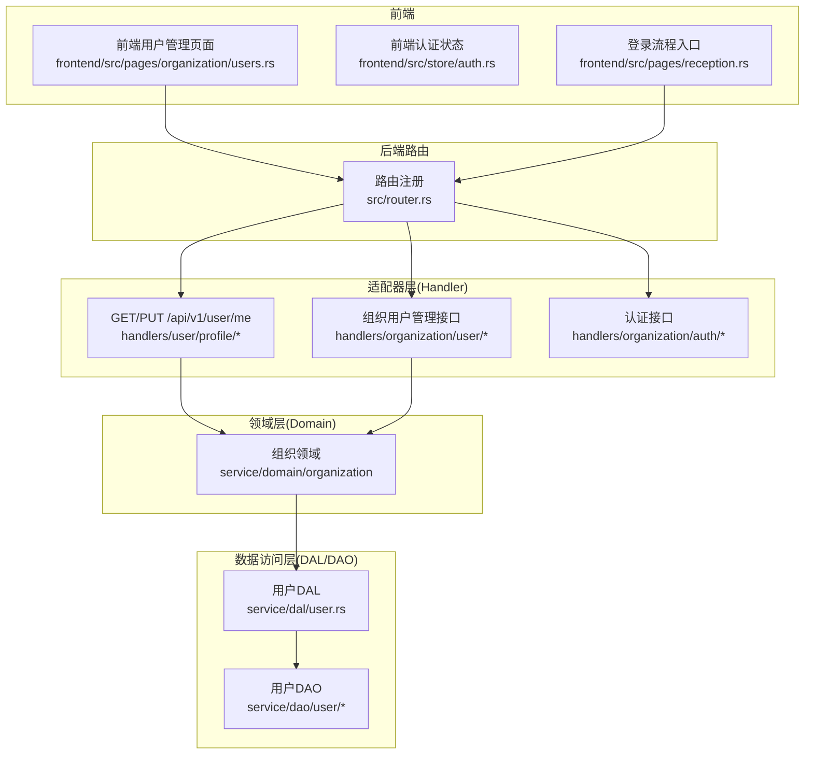
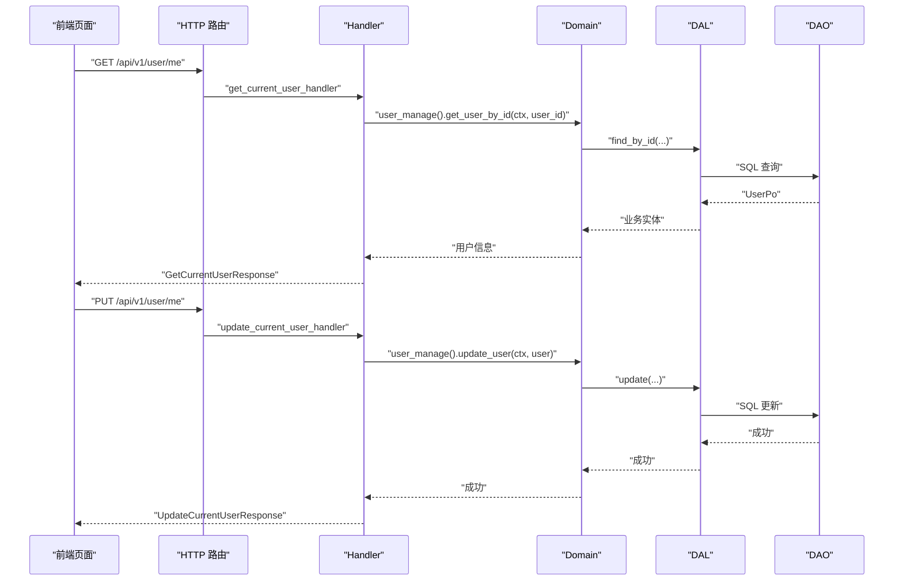
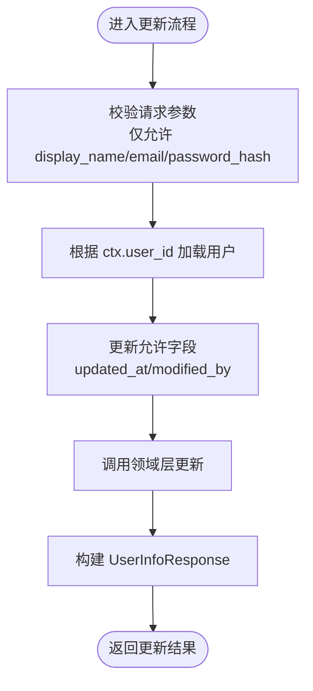
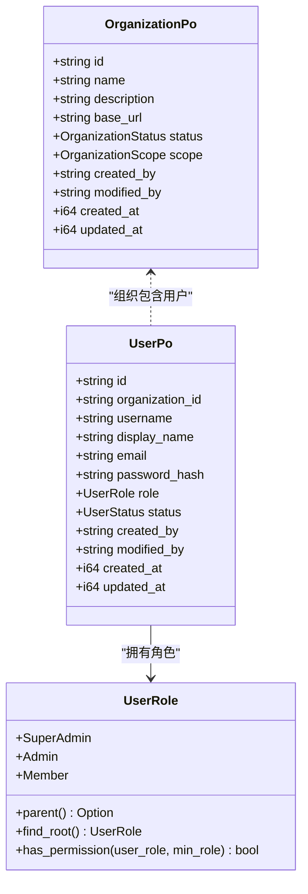
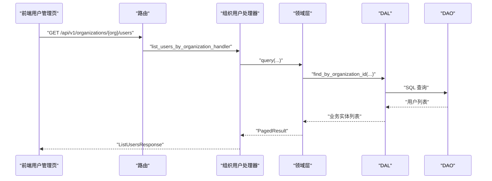
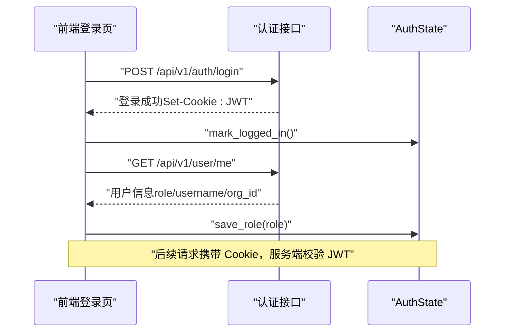
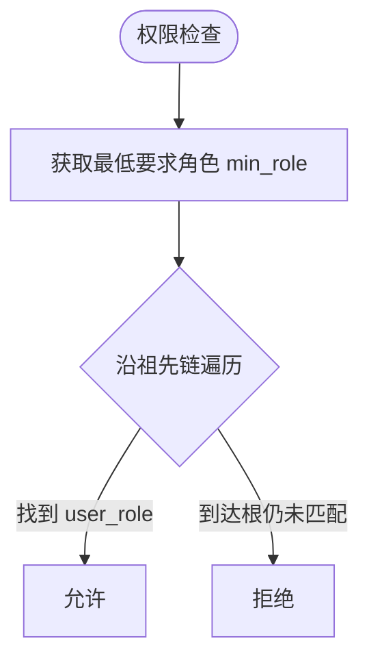
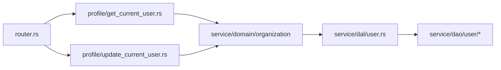

# 用户与组织页面

<cite>
**本文引用的文件**
- [src/handlers/user/mod.rs](file://src/handlers/user/mod.rs)
- [src/handlers/user/profile/get_current_user.rs](file://src/handlers/user/profile/get_current_user.rs)
- [src/handlers/user/profile/update_current_user.rs](file://src/handlers/user/profile/update_current_user.rs)
- [src/router.rs](file://src/router.rs)
- [src/handlers/organization/mod.rs](file://src/handlers/organization/mod.rs)
- [src/handlers/organization/user/mod.rs](file://src/handlers/organization/user/mod.rs)
- [src/handlers/organization/auth/mod.rs](file://src/handlers/organization/auth/mod.rs)
- [common/src/enums/user.rs](file://common/src/enums/user.rs)
- [src/models/user.rs](file://src/models/user.rs)
- [src/models/organization.rs](file://src/models/organization.rs)
- [frontend/src/pages/organization/users.rs](file://frontend/src/pages/organization/users.rs)
- [frontend/src/store/auth.rs](file://frontend/src/store/auth.rs)
- [frontend/src/pages/reception.rs](file://frontend/src/pages/reception.rs)
- [docs/superpowers/plans/2026-07-13-management-pages.md](file://docs/superpowers/plans/2026-07-13-management-pages.md)
</cite>

## 目录
1. [简介](#简介)
2. [项目结构](#项目结构)
3. [核心组件](#核心组件)
4. [架构总览](#架构总览)
5. [详细组件分析](#详细组件分析)
6. [依赖关系分析](#依赖关系分析)
7. [性能考虑](#性能考虑)
8. [故障排查指南](#故障排查指南)
9. [结论](#结论)
10. [附录](#附录)

## 简介
本模块聚焦“用户与组织”相关的前后端能力，覆盖：
- 用户个人资料管理：个人信息编辑、头像上传（预留扩展点）、密码修改、偏好设置（邮箱/显示名称等）
- 组织信息管理：组织配置（基础信息、外网访问地址）、成员管理、权限分配（基于角色继承）
- 用户列表功能：用户搜索/分页、角色管理、状态控制（启用/禁用）
- 认证与会话：登录/登出、JWT Cookie 会话、前端本地状态持久化
- 权限验证与角色继承：基于 UserRole 的层级权限模型
- 审计与合规：通过 AOP 事件与系统日志记录关键操作（本节给出接入方案）
- 单点登录集成、多因素认证、用户导入导出与批量操作：提供实现思路与对接位置

## 项目结构
该模块遵循四层单向调用：Adapter（HTTP Handler / 公开回调）→ Domain → DAL → DAO。用户与组织相关的 HTTP 路由集中在 router，Handler 位于 handlers/user 与 handlers/organization，领域逻辑在 service/domain/organization，数据访问在 service/dal 与 service/dao。

图表来源
- [src/router.rs:138-143](file://src/router.rs#L138-L143)
- [src/handlers/user/profile/get_current_user.rs:1-66](file://src/handlers/user/profile/get_current_user.rs#L1-L66)
- [src/handlers/user/profile/update_current_user.rs:1-91](file://src/handlers/user/profile/update_current_user.rs#L1-L91)
- [src/handlers/organization/user/mod.rs:1-17](file://src/handlers/organization/user/mod.rs#L1-L17)
- [src/handlers/organization/auth/mod.rs:1-5](file://src/handlers/organization/auth/mod.rs#L1-L5)

章节来源
- [src/router.rs:138-143](file://src/router.rs#L138-L143)
- [src/handlers/user/mod.rs:1-5](file://src/handlers/user/mod.rs#L1-L5)
- [src/handlers/organization/mod.rs:1-15](file://src/handlers/organization/mod.rs#L1-L15)

## 核心组件
- 用户资料接口
  - GET /api/v1/user/me：获取当前登录用户信息（用户名、显示名、邮箱、组织ID、角色、状态）
  - PUT /api/v1/user/me：更新当前用户信息（显示名、邮箱、密码哈希），仅允许修改自身字段
- 组织用户管理接口
  - 创建/删除/查询/更新组织内用户，支持按组织维度列出与筛选
- 认证与会话
  - 登录/登出接口（位于 organization/auth），使用 HttpOnly Cookie 承载 JWT，前端仅维护登录标志与角色用于 UI
- 角色与权限
  - 基于 UserRole 的层级权限模型，支持父角色查找与权限判定
- 数据模型
  - UserPo：用户持久化对象（含组织ID、用户名、显示名、邮箱、密码哈希、角色、状态、审计字段）
  - OrganizationPo：组织持久化对象（名称、描述、base_url、状态、范围、审计字段）

章节来源
- [src/handlers/user/profile/get_current_user.rs:1-66](file://src/handlers/user/profile/get_current_user.rs#L1-L66)
- [src/handlers/user/profile/update_current_user.rs:1-91](file://src/handlers/user/profile/update_current_user.rs#L1-L91)
- [src/handlers/organization/user/mod.rs:1-17](file://src/handlers/organization/user/mod.rs#L1-L17)
- [common/src/enums/user.rs:8-100](file://common/src/enums/user.rs#L8-L100)
- [src/models/user.rs:1-98](file://src/models/user.rs#L1-L98)
- [src/models/organization.rs:1-62](file://src/models/organization.rs#L1-L62)

## 架构总览
下图展示从前端到后端的完整调用链，包括认证、用户资料读取与更新、组织用户管理。

图表来源
- [src/router.rs:138-143](file://src/router.rs#L138-L143)
- [src/handlers/user/profile/get_current_user.rs:1-66](file://src/handlers/user/profile/get_current_user.rs#L1-L66)
- [src/handlers/user/profile/update_current_user.rs:1-91](file://src/handlers/user/profile/update_current_user.rs#L1-L91)

## 详细组件分析

### 用户资料管理（个人信息编辑、头像上传、密码修改、偏好设置）
- 个人信息读取
  - 从 RequestContext 提取当前用户 ID，调用领域层获取用户信息并转换为响应 DTO
- 个人信息更新
  - 仅允许更新显示名、邮箱、密码哈希；自动写入 updated_at 与 modified_by
  - 通过领域层 update_user 完成持久化
- 头像上传（扩展点）
  - 当前未实现专用头像接口；可在 profile 模块新增上传处理器，将图片存储至统一存储并更新用户头像 URL
- 偏好设置
  - 可复用 update_current_user 接口，扩展 preferences JSON 字段进行存储与读取

图表来源
- [src/handlers/user/profile/update_current_user.rs:1-91](file://src/handlers/user/profile/update_current_user.rs#L1-L91)

章节来源
- [src/handlers/user/profile/get_current_user.rs:1-66](file://src/handlers/user/profile/get_current_user.rs#L1-L66)
- [src/handlers/user/profile/update_current_user.rs:1-91](file://src/handlers/user/profile/update_current_user.rs#L1-L91)

### 组织信息管理（组织配置、成员管理、权限分配）
- 组织配置
  - OrganizationPo 包含 name、description、base_url、status、scope 等字段，可用于组织基本信息管理与外链生成
- 成员管理
  - 通过 organization/user 下的多个处理器实现创建、删除、查询、更新组织成员
- 权限分配
  - 基于 UserRole 的层级权限模型，支持父角色查找与权限判定；管理员及以上具备更高权限

图表来源
- [src/models/organization.rs:1-62](file://src/models/organization.rs#L1-L62)
- [src/models/user.rs:1-98](file://src/models/user.rs#L1-L98)
- [common/src/enums/user.rs:8-100](file://common/src/enums/user.rs#L8-L100)

章节来源
- [src/models/organization.rs:1-62](file://src/models/organization.rs#L1-L62)
- [src/models/user.rs:1-98](file://src/models/user.rs#L1-L98)
- [common/src/enums/user.rs:8-100](file://common/src/enums/user.rs#L8-L100)

### 用户列表功能（用户搜索、角色管理、状态控制）
- 前端用户管理页面
  - 展示用户列表（用户名、显示名、邮箱、角色），支持添加用户、删除用户
  - 角色映射：3=超级管理员，2=管理员，其他=成员（注意与后端枚举值对齐）
- 后端用户管理接口
  - 提供创建、删除、查询、更新组织用户的处理器集合
- 状态控制
  - 可通过更新用户状态为 Active/Disabled 实现启用/禁用

图表来源
- [src/handlers/organization/user/mod.rs:1-17](file://src/handlers/organization/user/mod.rs#L1-L17)
- [frontend/src/pages/organization/users.rs:1-44](file://frontend/src/pages/organization/users.rs#L1-L44)

章节来源
- [frontend/src/pages/organization/users.rs:1-44](file://frontend/src/pages/organization/users.rs#L1-L44)
- [src/handlers/organization/user/mod.rs:1-17](file://src/handlers/organization/user/mod.rs#L1-L17)

### 认证流程与会话管理
- 登录流程
  - 前端调用登录接口，成功后标记已登录并拉取当前用户信息以回填 role/username/org_id
  - 使用 HttpOnly Cookie 承载 JWT，前端不直接持有 token
- 会话状态
  - 前端 store/auth 维护登录标志与角色，刷新后可恢复
- 登出
  - 清除本地状态并重置内存中的 AuthState

图表来源
- [frontend/src/pages/reception.rs:98-122](file://frontend/src/pages/reception.rs#L98-L122)
- [frontend/src/store/auth.rs:1-93](file://frontend/src/store/auth.rs#L1-L93)

章节来源
- [frontend/src/pages/reception.rs:98-122](file://frontend/src/pages/reception.rs#L98-L122)
- [frontend/src/store/auth.rs:1-93](file://frontend/src/store/auth.rs#L1-L93)
- [src/handlers/organization/auth/mod.rs:1-5](file://src/handlers/organization/auth/mod.rs#L1-L5)

### 权限验证与角色继承机制
- 角色定义
  - SuperAdmin > Admin > Member，父角色拥有下级所有权限
- 权限判定
  - has_permission(user_role, min_role)：沿 min_role 向上遍历祖先链，若路径包含 user_role 则满足
- 应用
  - 管理员菜单显示、敏感操作授权均基于此模型

图表来源
- [common/src/enums/user.rs:8-100](file://common/src/enums/user.rs#L8-L100)

章节来源
- [common/src/enums/user.rs:8-100](file://common/src/enums/user.rs#L8-L100)

### 组织架构树形展示与用户关系映射
- 组织树
  - 当前 OrganizationPo 无父子关系字段；如需树形展示可扩展 parent_org_id 或采用扁平组织+视图层聚合
- 用户关系
  - 用户通过 organization_id 归属组织；可按组织维度列出用户并展示角色

章节来源
- [src/models/organization.rs:1-62](file://src/models/organization.rs#L1-L62)
- [src/models/user.rs:1-98](file://src/models/user.rs#L1-L98)

### 权限矩阵配置与审计日志记录
- 权限矩阵
  - 基于 UserRole 的层级矩阵即可满足多数场景；如需细粒度资源级权限，可在 Domain 层引入策略模式与资源标识
- 审计日志
  - 建议在关键操作（创建/更新/删除用户、修改密码、角色变更）中通过 AOP 埋点记录事件，便于追踪与合规报告

章节来源
- [common/src/enums/user.rs:8-100](file://common/src/enums/user.rs#L8-L100)

### 单点登录集成、多因素认证、用户导入导出与批量操作
- 单点登录（SSO）
  - 在认证处理器中集成第三方 OIDC/SAML 回调，签发 JWT 并设置 HttpOnly Cookie
- 多因素认证（MFA）
  - 在登录流程中增加二次验证步骤（如 TOTP），成功后再签发 JWT
- 用户导入导出
  - 参考系统 seed 的快照机制，可对用户数据进行导出/导入（注意敏感字段脱敏）
- 批量操作
  - 在组织用户处理器中提供批量更新/删除接口，结合事务保证一致性

章节来源
- [src/handlers/system/seed/mod.rs:581-609](file://src/handlers/system/seed/mod.rs#L581-L609)
- [src/handlers/system/seed/seed_handler_test.rs:186-233](file://src/handlers/system/seed/seed_handler_test.rs#L186-L233)

## 依赖关系分析
- 路由到处理器
  - router 将 /api/v1/user/me 绑定到 profile 处理器
- 处理器到领域
  - profile 处理器通过 organization::domain() 调用用户管理能力
- 领域到数据访问
  - 领域层委托 DAL 执行具体查询/更新，DAL 再调用 DAO 执行 SQL

图表来源
- [src/router.rs:138-143](file://src/router.rs#L138-L143)
- [src/handlers/user/profile/get_current_user.rs:1-66](file://src/handlers/user/profile/get_current_user.rs#L1-L66)
- [src/handlers/user/profile/update_current_user.rs:1-91](file://src/handlers/user/profile/update_current_user.rs#L1-L91)

章节来源
- [src/router.rs:138-143](file://src/router.rs#L138-L143)
- [src/handlers/user/profile/get_current_user.rs:1-66](file://src/handlers/user/profile/get_current_user.rs#L1-L66)
- [src/handlers/user/profile/update_current_user.rs:1-91](file://src/handlers/user/profile/update_current_user.rs#L1-L91)

## 性能考虑
- 查询优化
  - 用户列表建议使用分页查询，避免一次性加载大量数据
- 缓存策略
  - 对频繁读取的组织/用户元数据可引入短期缓存（如内存缓存），注意失效策略
- 并发安全
  - 更新用户信息时确保事务边界，避免竞态条件
- 前端体验
  - 列表加载使用 Loading/EmptyState，错误提示使用 ErrorAlert，提升用户体验

[本节为通用指导，无需特定文件引用]

## 故障排查指南
- 用户未登录
  - 检查 RequestContext 是否包含 user_id；确认 Cookie 是否正确传递
- 用户不存在
  - 检查用户 ID 是否存在于数据库；确认组织隔离是否正确
- 权限不足
  - 检查 UserRole 与所需最低角色的关系；必要时调整角色或权限策略
- 前端状态不同步
  - 登录后需调用 /api/v1/user/me 回填 role/username/org_id；确保 save_role 被调用

章节来源
- [src/handlers/user/profile/get_current_user.rs:1-66](file://src/handlers/user/profile/get_current_user.rs#L1-L66)
- [src/handlers/user/profile/update_current_user.rs:1-91](file://src/handlers/user/profile/update_current_user.rs#L1-L91)
- [frontend/src/pages/reception.rs:98-122](file://frontend/src/pages/reception.rs#L98-L122)
- [frontend/src/store/auth.rs:1-93](file://frontend/src/store/auth.rs#L1-L93)

## 结论
本模块围绕用户与组织提供了完整的资料管理、成员管理与认证能力，并通过 UserRole 的层级权限模型保障访问控制。前端与后端职责清晰，遵循四层单向调用原则。后续可在此基础上扩展头像上传、SSO/MFA、导入导出与批量操作，并结合 AOP 审计完善合规能力。

[本节为总结性内容，无需特定文件引用]

## 附录
- 前端计划文档指出 profile 保存按钮曾为占位实现，建议接通 update_current_user 接口并修复角色映射
- 角色映射需注意前后端一致：后端 UserRole 值为 0/1/2，前端展示映射应与之对齐

章节来源
- [docs/superpowers/plans/2026-07-13-management-pages.md:116-146](file://docs/superpowers/plans/2026-07-13-management-pages.md#L116-L146)
- [common/src/enums/user.rs:8-100](file://common/src/enums/user.rs#L8-L100)