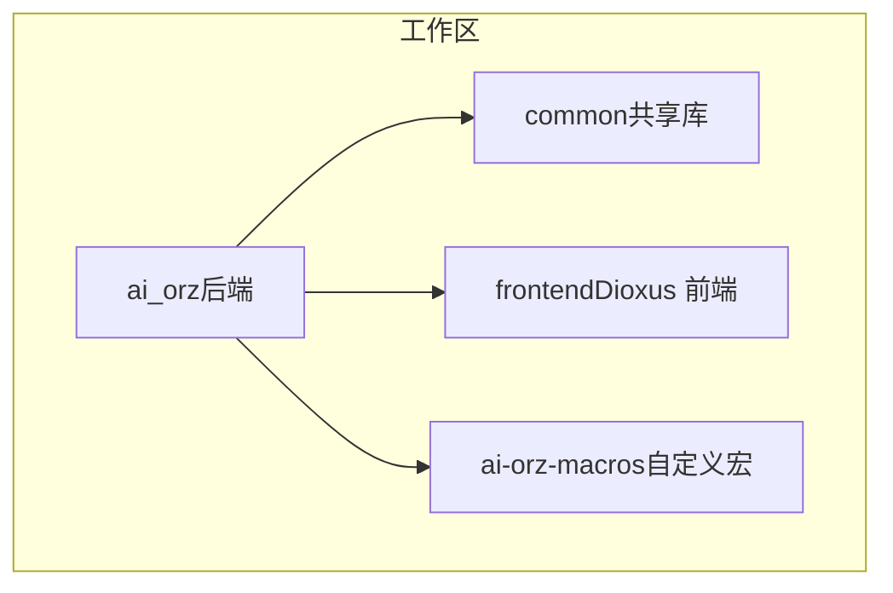
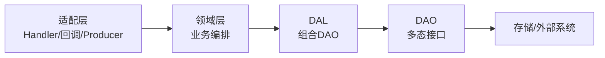
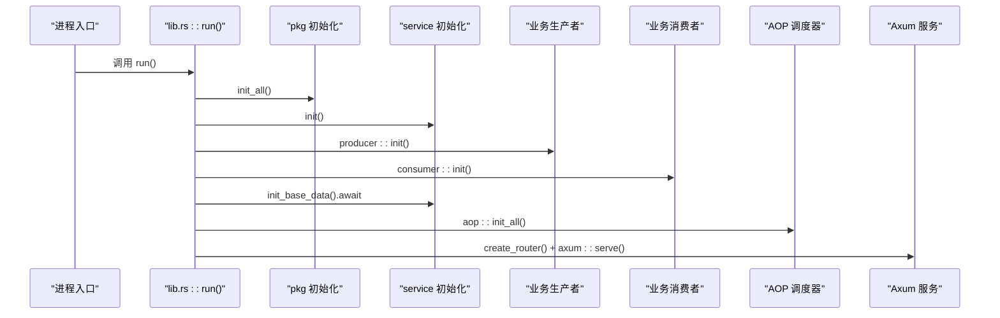
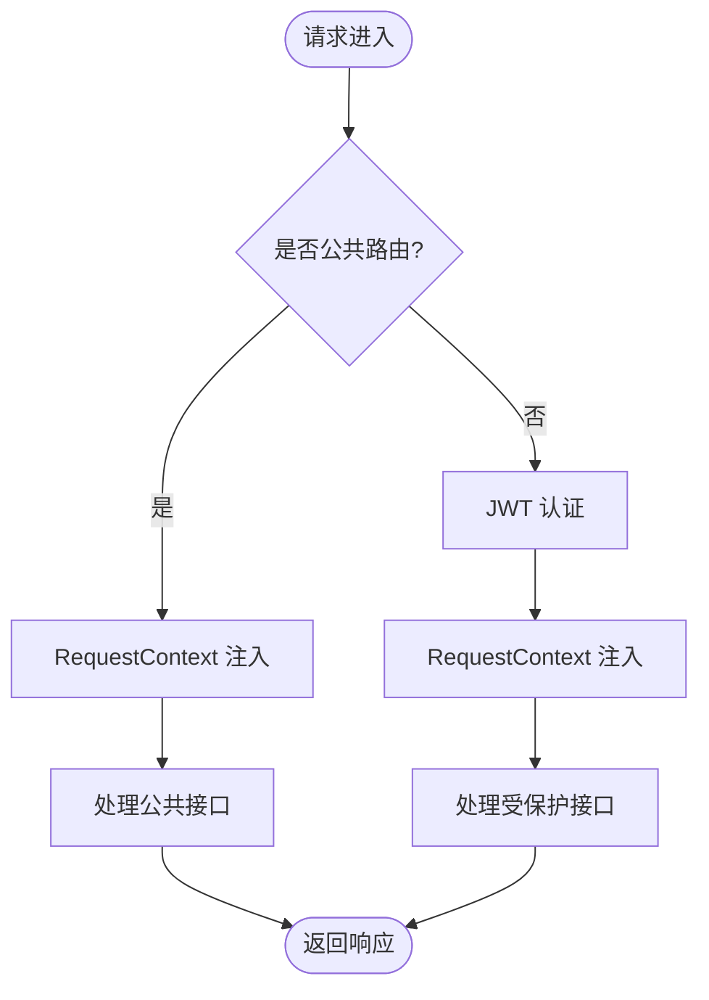
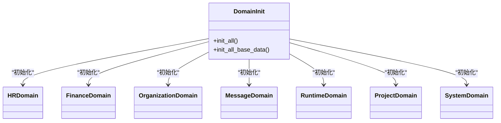
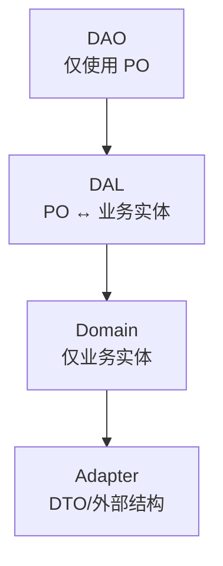
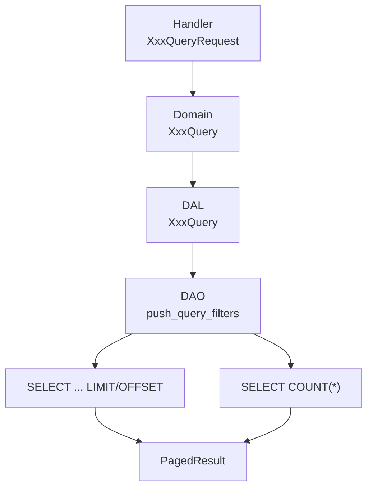
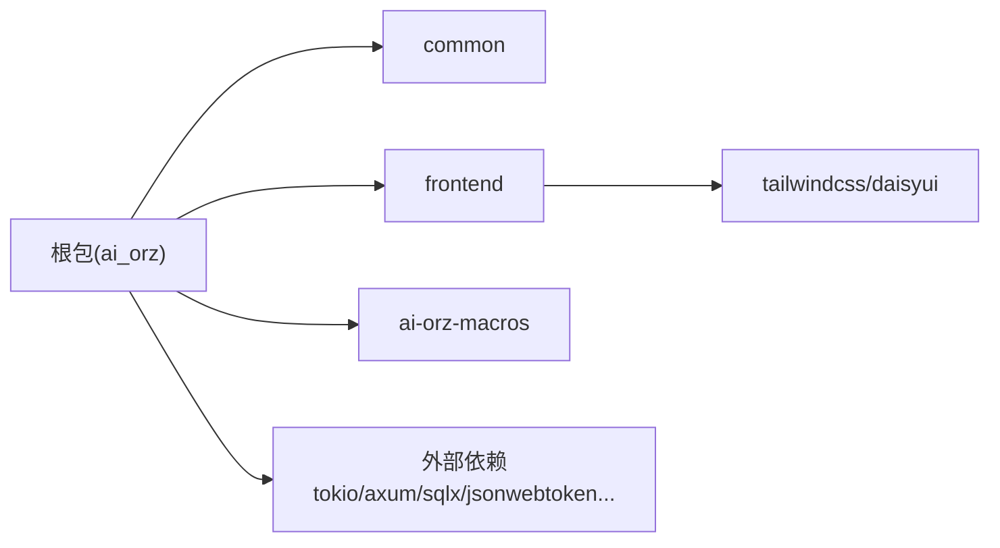

# 文档中心

<cite>
**本文引用的文件**
- [Cargo.toml](file://Cargo.toml)
- [src/main.rs](file://src/main.rs)
- [src/lib.rs](file://src/lib.rs)
- [src/router.rs](file://src/router.rs)
- [common/src/lib.rs](file://common/src/lib.rs)
- [common/src/api/mod.rs](file://common/src/api/mod.rs)
- [docs/ARCHITECTURE.md](file://docs/ARCHITECTURE.md)
- [AGENTS.md](file://AGENTS.md)
</cite>

## 目录
1. [简介](#简介)
2. [项目结构](#项目结构)
3. [核心组件](#核心组件)
4. [架构总览](#架构总览)
5. [详细组件分析](#详细组件分析)
6. [依赖关系分析](#依赖关系分析)
7. [性能与可维护性](#性能与可维护性)
8. [故障排查指南](#故障排查指南)
9. [结论](#结论)
10. [附录](#附录)

## 简介
本项目是一个全栈 Rust 多 Agent 协作框架，采用严格四层单向调用：适配层（HTTP Handler / 公开回调 Handler / AOP Producer）→ 领域层 → 业务数据访问层 → 数据访问对象层。后端基于 Axum + SQLx（SQLite），前端使用 Dioxus（WASM）+ Tailwind CSS v4 + DaisyUI v5；向量搜索默认 LanceDB，支持 HNSW/InMemory/SqliteVss 多后端降级；全文搜索使用 FTS5 + trigram 分词器。项目强调类型安全、测试覆盖率门槛与零容忍警告的 CI 质量门禁。

## 项目结构
仓库为三模块 workspace：根包（后端服务）、frontend（Dioxus 前端）、common（前后端共享 DTO/枚举/错误等）。根包内部按分层组织：models、handlers、service（dao/dal/domain）、middleware、consumer/producer、pkg（AOP/统计/存储/JWT/工具注册等）。路由按业务域划分，公共路由无需 JWT，受保护路由统一通过中间件注入 RequestContext 并校验 JWT。

图表来源
- [Cargo.toml:1-8](file://Cargo.toml#L1-L8)

章节来源
- [Cargo.toml:1-8](file://Cargo.toml#L1-L8)
- [docs/ARCHITECTURE.md:11-46](file://docs/ARCHITECTURE.md#L11-L46)

## 核心组件
- 应用启动与生命周期管理：两阶段初始化（同步单例注册 + 异步基础数据注入），随后启动 AOP 调度器与 HTTP 服务。
- 路由与中间件：公共路由与受保护路由分离，JWT 认证与 RequestContext 注入顺序严格保证。
- 领域与数据层：DAO/DAL/Domain 三层清晰职责边界，PO 不暴露到 Domain 及以上。
- 事件总线（AOP）：纯框架级事件生产-订阅-调度，支持同步/异步消费、轮询生产者、顺序保证。
- 存储与搜索：SQLite + SQLx 查询缓存，LanceDB/HNSW/InMemory/SqliteVss 向量存储，FTS5 全文检索。
- 统计与监控：DuckDB 持久化统计 + 运行时内存收集器，AOP 队列监控与健康指标聚合。

章节来源
- [src/lib.rs:114-175](file://src/lib.rs#L114-L175)
- [src/router.rs:12-136](file://src/router.rs#L12-L136)
- [docs/ARCHITECTURE.md:115-147](file://docs/ARCHITECTURE.md#L115-L147)
- [AGENTS.md:167-205](file://AGENTS.md#L167-L205)

## 架构总览
系统遵循严格的单向依赖与分层职责：
- 适配层：HTTP Handler、公开回调、AOP Producer，负责协议解析、鉴权、DTO↔Command 转换与编排。
- 领域层：组合多个 DAL 完成业务编排，产生内部事件，不感知 PO。
- DAL：组合 DAO，提供业务级数据操作，PO↔Entity 转换。
- DAO：单一数据源 CRUD 与外部出站调用，定义多态接口。

图表来源
- [docs/ARCHITECTURE.md:325-385](file://docs/ARCHITECTURE.md#L325-L385)
- [AGENTS.md:167-205](file://AGENTS.md#L167-L205)

## 详细组件分析

### 应用启动流程（两阶段初始化）
- 第一阶段（同步）：配置加载 → pkg 初始化（日志/存储/JWT/工具注册）→ service::init() 注册 DAO/DAL/Domain 单例。
- 第二阶段（异步）：producer/consumer 注册 → service::init_base_data() 幂等注入 DB 默认数据（目前为系统级 cron triggers）。
- 后续：安装 AOP 统计 Hook → aop::init_all() 启动调度器 → 创建路由并监听端口。

图表来源
- [src/lib.rs:114-175](file://src/lib.rs#L114-L175)
- [src/service/domain/mod.rs:23-42](file://src/service/domain/mod.rs#L23-L42)

章节来源
- [src/lib.rs:114-175](file://src/lib.rs#L114-L175)
- [AGENTS.md:887-913](file://AGENTS.md#L887-L913)

### 路由与中间件（认证与上下文注入）
- 公共路由：系统初始化、登录/登出、组织列表、健康检查、A2A 公开发现端点。
- 受保护路由：所有业务 API，统一通过 JWT 认证与 RequestContext 注入。
- 中间件顺序：外层先执行 JWT 认证，内层后执行 RequestContext 注入，确保请求上下文中包含用户身份。

图表来源
- [src/router.rs:12-136](file://src/router.rs#L12-L136)

章节来源
- [src/router.rs:12-136](file://src/router.rs#L12-L136)
- [docs/ARCHITECTURE.md:137-147](file://docs/ARCHITECTURE.md#L137-L147)

### 领域层编排与职责
- 领域划分：hr（智能体）、finance（模型提供商/消息渠道/MCP）、organization（组织/用户）、message（消息投递）、runtime（工具执行/记忆）、project（项目/任务/产物）、system（定时触发器/备份/日志/种子）。
- 编排原则：组合多个 DAL 完成业务流程，不直接访问 DAO；所有方法首参 ctx: RequestContext，跨层传递使用 ctx.clone()。
- 扩展点：每个 Domain 实现自己的 init_base_data 扩展点，用于幂等注入默认数据。

图表来源
- [src/service/domain/mod.rs:1-42](file://src/service/domain/mod.rs#L1-L42)

章节来源
- [src/service/domain/mod.rs:1-42](file://src/service/domain/mod.rs#L1-L42)
- [AGENTS.md:167-205](file://AGENTS.md#L167-L205)

### 数据层规范（PO 与业务实体分层）
- PO 仅在 DAO/DAL 内部使用，绝不暴露到 Domain 及以上。
- DAL 对外接口统一使用业务实体，写操作接收 &业务实体 引用，读操作返回业务实体。
- 软删除约定：status = 0 视为已删除，常规查询默认过滤。

图表来源
- [AGENTS.md:318-412](file://AGENTS.md#L318-L412)
- [docs/ARCHITECTURE.md:398-486](file://docs/ARCHITECTURE.md#L398-L486)

章节来源
- [AGENTS.md:318-412](file://AGENTS.md#L318-L412)
- [docs/ARCHITECTURE.md:398-486](file://docs/ARCHITECTURE.md#L398-L486)

### 分页与查询规范
- query 为核心查询能力，list 为语法糖（只接受分页参数，内部固定默认过滤与排序）。
- 统一分页参数 PaginationParams 与结果 PagedResult<T>，每层用 map 转换类型并保留 total。
- DAO 层抽取 push_query_filters 复用 COUNT 与 LIST 的 WHERE 条件。

图表来源
- [AGENTS.md:604-773](file://AGENTS.md#L604-L773)

章节来源
- [AGENTS.md:604-773](file://AGENTS.md#L604-L773)

### 向量与全文搜索
- 向量搜索：LanceDB 默认，支持 HNSW/InMemory/SqliteVss 多后端降级；所有支持向量索引的 PO 必须实现 Vectorizable trait。
- 全文搜索：FTS5 + trigram 分词器，支持中文全文搜索与 BM25 相关性排序。
- 混合搜索：关键词 + 向量语义 + 图谱关系三位一体，Hybrid/Vector/Keyword 三态匹配。

章节来源
- [AGENTS.md:518-601](file://AGENTS.md#L518-L601)
- [docs/ARCHITECTURE.md:503-537](file://docs/ARCHITECTURE.md#L503-L537)

## 依赖关系分析
- 工作区成员：根包、frontend、common、ai-orz-macros。
- 后端关键依赖：tokio、axum、sqlx（sqlite）、reqwest、jsonwebtoken、fastembed、lancedb、duckdb 等。
- 前端依赖：TailwindCSS、DaisyUI（样式），构建脚本由 package.json 管理。

图表来源
- [Cargo.toml:1-8](file://Cargo.toml#L1-L8)
- [Cargo.toml:17-71](file://Cargo.toml#L17-L71)

章节来源
- [Cargo.toml:1-8](file://Cargo.toml#L1-L8)
- [Cargo.toml:17-71](file://Cargo.toml#L17-L71)

## 性能与可维护性
- 启动优化：两阶段初始化避免阻塞，基础数据注入失败仅记 warn，保障服务快速可用。
- 并发模型：Tokio 任务调度，相同 order_key 顺序锁保证顺序，不同 key 并行处理。
- 存储策略：原始细节按天 markdown 追加写入，人类可读且迁移简单；索引与知识图谱存 SQLite。
- 测试隔离：每个测试独立数据库，互不干扰；集成测试 33 个覆盖 Auth/CRUD/消息/向量/A2A/Cron。
- 代码质量：clippy -D warnings 零容忍，cargo-llvm-cov 覆盖率门槛 PR 38% / main 45%。

章节来源
- [AGENTS.md:78-94](file://AGENTS.md#L78-L94)
- [docs/ARCHITECTURE.md:229-242](file://docs/ARCHITECTURE.md#L229-L242)
- [docs/ARCHITECTURE.md:562-577](file://docs/ARCHITECTURE.md#L562-L577)

## 故障排查指南
- 启动失败：检查 pkg 初始化（日志/存储/JWT/工具注册）与 service 初始化顺序；确认基础数据注入幂等逻辑。
- 认证问题：确认中间件顺序（JWT 在外层先执行，RequestContext 在内层后执行）；公共路由无需 JWT，受保护路由必须携带有效 token。
- 数据一致：软删除查询默认过滤 status = 0；需要历史/恢复时使用 query 方法绕过过滤。
- 向量搜索：无 Embedding Provider 时主流程应降级可用；确保 PO 实现 Vectorizable trait，collection 名通过 trait 获取。
- 事件总线：确认 producer/consumer 注册顺序，避免 publish 早于 consumer 注册导致事件丢失。

章节来源
- [src/router.rs:12-136](file://src/router.rs#L12-L136)
- [AGENTS.md:395-412](file://AGENTS.md#L395-L412)
- [AGENTS.md:518-601](file://AGENTS.md#L518-L601)
- [AGENTS.md:887-913](file://AGENTS.md#L887-L913)

## 结论
本项目以严格分层架构为基础，结合事件总线、向量/全文搜索、统计监控与高质量测试体系，构建了可扩展、可维护的多 Agent 协作框架。两阶段初始化与幂等基础数据注入保障了服务快速可用与稳定运行；统一的 DTO、分页、向量与日志规范提升了开发效率与代码一致性。

## 附录
- 技术栈版本：后端 Axum 0.8 + sqlx 0.8（SQLite）+ DuckDB；前端 Dioxus 0.7（WASM）+ Tailwind CSS v4 + DaisyUI v5；向量搜索 LanceDB 0.26 默认，支持多后端降级；全文搜索 FTS5 + trigram。
- 文档权威：AGENTS.md 为开发规范总览，docs/ARCHITECTURE.md 为最新架构说明；wiki 描述与 docs/ 冲突时以 docs/ 为准。

章节来源
- [AGENTS.md:11-17](file://AGENTS.md#L11-L17)
- [docs/ARCHITECTURE.md:503-537](file://docs/ARCHITECTURE.md#L503-L537)
- [AGENTS.md:98-118](file://AGENTS.md#L98-L118)