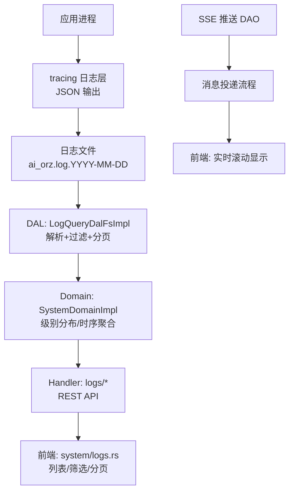
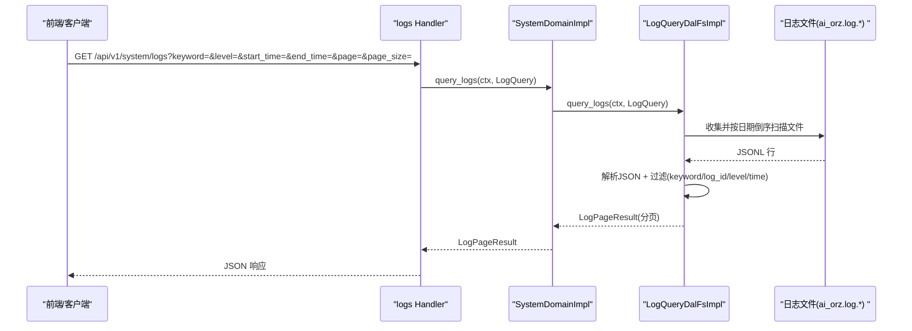
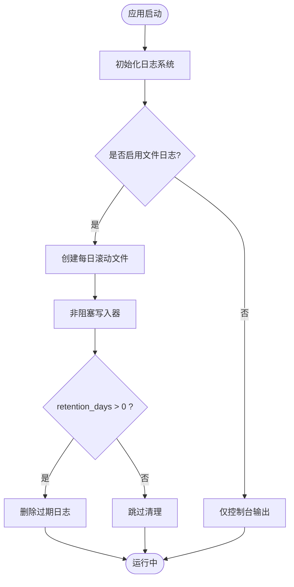
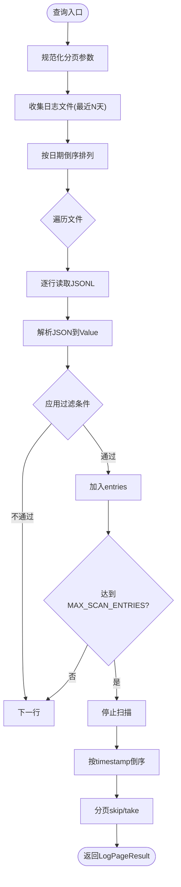
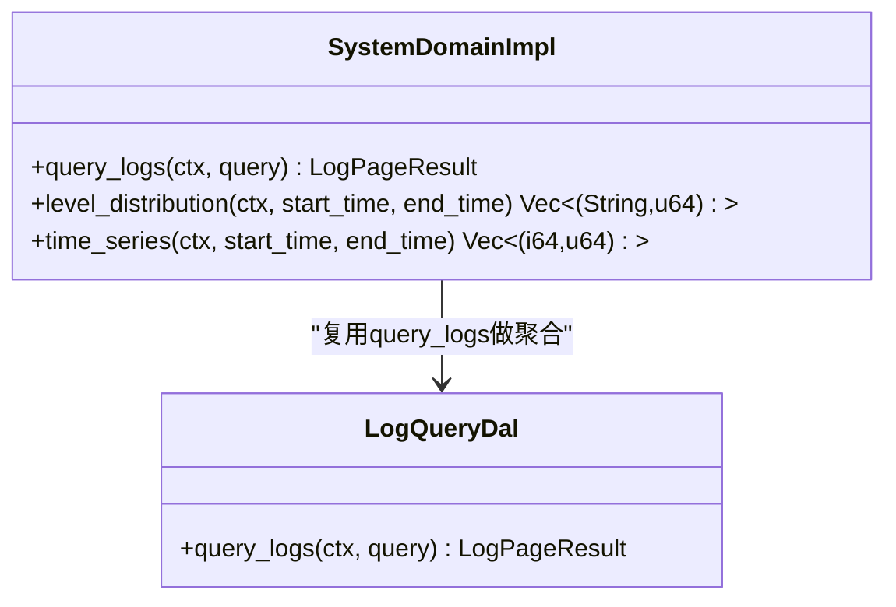
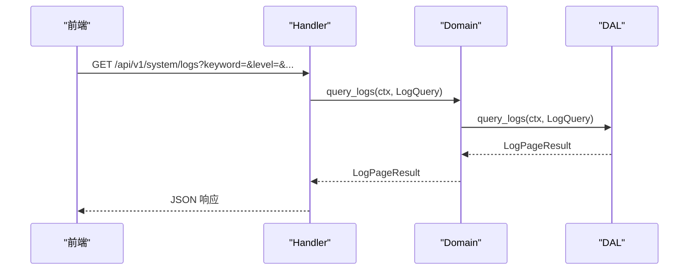
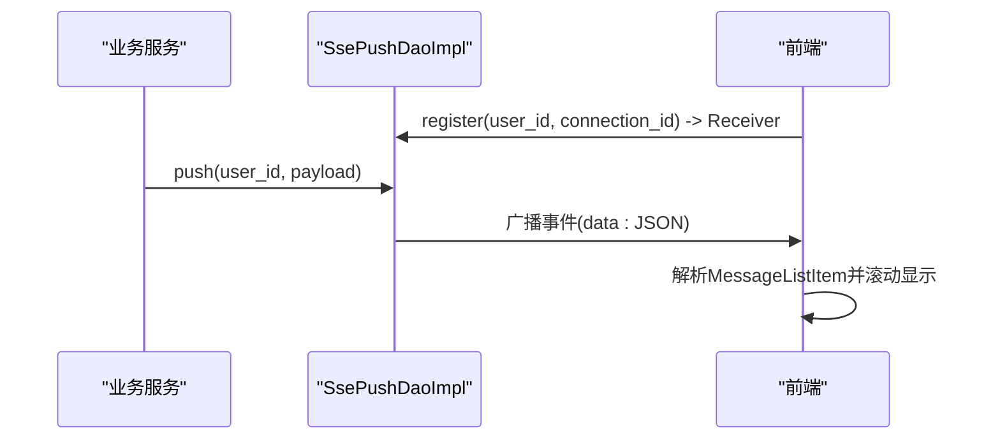
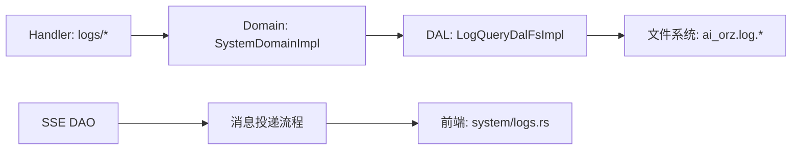

# 日志管理系统

<cite>
**本文引用的文件**   
- [src/pkg/logging.rs](file://src/pkg/logging.rs)
- [src/service/dal/log_query.rs](file://src/service/dal/log_query.rs)
- [common/src/api/log_stats.rs](file://common/src/api/log_stats.rs)
- [src/handlers/system/logs/query_logs.rs](file://src/handlers/system/logs/query_logs.rs)
- [src/handlers/system/logs/log_stats.rs](file://src/handlers/system/logs/log_stats.rs)
- [src/service/domain/system/mod.rs](file://src/service/domain/system/mod.rs)
- [src/service/dao/message_push.rs](file://src/service/dao/message_push.rs)
- [frontend/src/pages/system/logs.rs](file://frontend/src/pages/system/logs.rs)
- [tests/common/app.rs](file://tests/common/app.rs)
</cite>

## 目录
1. [简介](#简介)
2. [项目结构](#项目结构)
3. [核心组件](#核心组件)
4. [架构总览](#架构总览)
5. [详细组件分析](#详细组件分析)
6. [依赖关系分析](#依赖关系分析)
7. [性能考量](#性能考量)
8. [故障诊断指南](#故障诊断指南)
9. [结论](#结论)
10. [附录](#附录)

## 简介
本系统提供完整的日志管理能力，覆盖日志采集、结构化存储、查询过滤、统计聚合、实时推送与导出等能力。后端基于 Rust + Axum，使用 tracing-subscriber 输出 JSON 格式日志到按日滚动的文件；DAL 层实现从日志文件中解析并支持多条件过滤（关键词、log_id、级别、时间范围）与分页；Domain 层提供级别分布与时序聚合；Handler 暴露 REST API；前端 Dioxus 页面支持可视化展示与滚动加载；同时提供 SSE 实时消息通道用于实时流式展示。

## 项目结构
日志相关代码主要分布在以下位置：
- 采集与轮转：src/pkg/logging.rs
- 查询与解析：src/service/dal/log_query.rs
- API 定义：common/src/api/log_stats.rs
- HTTP Handler：src/handlers/system/logs/*
- Domain 聚合：src/service/domain/system/mod.rs
- 实时推送：src/service/dao/message_push.rs
- 前端展示：frontend/src/pages/system/logs.rs
- 测试工具：tests/common/app.rs

图表来源
- [src/pkg/logging.rs:23-124](file://src/pkg/logging.rs#L23-L124)
- [src/service/dal/log_query.rs:109-210](file://src/service/dal/log_query.rs#L109-L210)
- [src/service/domain/system/mod.rs:280-309](file://src/service/domain/system/mod.rs#L280-L309)
- [src/handlers/system/logs/query_logs.rs:13-28](file://src/handlers/system/logs/query_logs.rs#L13-L28)
- [src/handlers/system/logs/log_stats.rs:25-76](file://src/handlers/system/logs/log_stats.rs#L25-L76)
- [src/service/dao/message_push.rs:19-58](file://src/service/dao/message_push.rs#L19-L58)
- [frontend/src/pages/system/logs.rs:426-441](file://frontend/src/pages/system/logs.rs#L426-L441)

章节来源
- [src/pkg/logging.rs:23-124](file://src/pkg/logging.rs#L23-L124)
- [src/service/dal/log_query.rs:109-210](file://src/service/dal/log_query.rs#L109-L210)
- [src/handlers/system/logs/query_logs.rs:13-28](file://src/handlers/system/logs/query_logs.rs#L13-L28)
- [src/handlers/system/logs/log_stats.rs:25-76](file://src/handlers/system/logs/log_stats.rs#L25-L76)
- [src/service/domain/system/mod.rs:280-309](file://src/service/domain/system/mod.rs#L280-L309)
- [src/service/dao/message_push.rs:19-58](file://src/service/dao/message_push.rs#L19-L58)
- [frontend/src/pages/system/logs.rs:426-441](file://frontend/src/pages/system/logs.rs#L426-L441)

## 核心组件
- 日志采集与轮转：支持控制台与文件双写，按日滚动，可选 JSON 格式，启动时清理过期日志。
- 日志查询 DAL：读取 JSONL 日志文件，支持关键词、log_id、级别、时间范围过滤，返回分页结果。
- 统计聚合 Domain：在时间窗口内计算级别分布与小时级时序数据点。
- HTTP Handler：暴露查询与统计接口，受管理员角色保护。
- 实时推送：SSE 连接管理与消息广播，前端订阅后滚动显示。
- 前端展示：日志列表、级别徽章、点击 log_id 快速筛选、分页加载。

章节来源
- [src/pkg/logging.rs:23-124](file://src/pkg/logging.rs#L23-L124)
- [src/service/dal/log_query.rs:34-82](file://src/service/dal/log_query.rs#L34-L82)
- [src/service/domain/system/mod.rs:280-309](file://src/service/domain/system/mod.rs#L280-L309)
- [src/handlers/system/logs/query_logs.rs:13-28](file://src/handlers/system/logs/query_logs.rs#L13-L28)
- [src/handlers/system/logs/log_stats.rs:25-76](file://src/handlers/system/logs/log_stats.rs#L25-L76)
- [src/service/dao/message_push.rs:19-58](file://src/service/dao/message_push.rs#L19-L58)
- [frontend/src/pages/system/logs.rs:426-441](file://frontend/src/pages/system/logs.rs#L426-L441)

## 架构总览
日志系统遵循四层单向调用：Adapter（HTTP Handler / AOP Producer）→ Domain → DAL → DAO。日志写入由 tracing 层完成，DAL 负责从文件系统解析与过滤，Domain 进行聚合统计，Handler 对外暴露 API。

图表来源
- [src/handlers/system/logs/query_logs.rs:13-28](file://src/handlers/system/logs/query_logs.rs#L13-L28)
- [src/service/domain/system/mod.rs:280-309](file://src/service/domain/system/mod.rs#L280-L309)
- [src/service/dal/log_query.rs:109-210](file://src/service/dal/log_query.rs#L109-L210)

章节来源
- [src/handlers/system/logs/query_logs.rs:13-28](file://src/handlers/system/logs/query_logs.rs#L13-L28)
- [src/service/domain/system/mod.rs:280-309](file://src/service/domain/system/mod.rs#L280-L309)
- [src/service/dal/log_query.rs:109-210](file://src/service/dal/log_query.rs#L109-L210)

## 详细组件分析

### 日志采集与轮转
- 初始化：根据配置选择 JSON 或文本格式，设置 EnvFilter 控制级别，创建控制台与文件层。
- 文件轮转：使用 daily rolling 生成 ai_orz.log.YYYY-MM-DD 文件，非阻塞写入。
- 自动清理：启动时按 retention_days 删除超过保留期的日志文件。

图表来源
- [src/pkg/logging.rs:23-124](file://src/pkg/logging.rs#L23-L124)
- [src/pkg/logging.rs:126-158](file://src/pkg/logging.rs#L126-L158)

章节来源
- [src/pkg/logging.rs:23-124](file://src/pkg/logging.rs#L23-L124)
- [src/pkg/logging.rs:126-158](file://src/pkg/logging.rs#L126-L158)

### 日志查询与过滤（DAL）
- 数据结构：LogEntry（timestamp、level、message、log_id、user_id、operation、raw），LogQuery（keyword、log_id、level、start_time、end_time、page、page_size），LogPageResult（total、entries、page、page_size）。
- 过滤逻辑：
  - keyword：对 message 字段不区分大小写包含匹配
  - log_id：精确匹配 fields.log_id
  - level：不区分大小写匹配
  - time_range：解析 ISO8601/RFC3339 为 unix ms，比较 start/end
- 扫描策略：只扫描最近 MAX_SCAN_DAYS 天的日志文件，按文件名倒序优先扫描最新文件；单次查询最多收集 MAX_SCAN_ENTRIES 条记录防止内存溢出。
- 排序与分页：按 timestamp 倒序排序，skip/take 实现分页。

图表来源
- [src/service/dal/log_query.rs:109-210](file://src/service/dal/log_query.rs#L109-L210)
- [src/service/dal/log_query.rs:215-361](file://src/service/dal/log_query.rs#L215-L361)

章节来源
- [src/service/dal/log_query.rs:34-82](file://src/service/dal/log_query.rs#L34-L82)
- [src/service/dal/log_query.rs:109-210](file://src/service/dal/log_query.rs#L109-L210)
- [src/service/dal/log_query.rs:215-361](file://src/service/dal/log_query.rs#L215-L361)

### 统计聚合（Domain）
- 级别分布：在指定时间范围内拉取日志（上限 MAX_SCAN_ENTRIES），在 Rust 侧按 level 聚合计数。
- 时序数据：按小时桶统计日志数量，返回 interval_start 与 count。

图表来源
- [src/service/domain/system/mod.rs:280-309](file://src/service/domain/system/mod.rs#L280-L309)
- [src/service/dal/log_query.rs:109-210](file://src/service/dal/log_query.rs#L109-L210)

章节来源
- [src/service/domain/system/mod.rs:280-309](file://src/service/domain/system/mod.rs#L280-L309)

### HTTP 接口（Handler）
- 查询日志：GET /api/v1/system/logs，支持 keyword、log_id、level、start_time、end_time、page、page_size。
- 级别分布：GET /api/v1/system/logs/stats/level-distribution，默认最近 24 小时。
- 时序数据：GET /api/v1/system/logs/stats/time-series，默认最近 24 小时。
- 权限控制：路由层 require_role_middleware(UserRole::Admin) 确保仅管理员可访问。

图表来源
- [src/handlers/system/logs/query_logs.rs:13-28](file://src/handlers/system/logs/query_logs.rs#L13-L28)
- [src/handlers/system/logs/log_stats.rs:25-76](file://src/handlers/system/logs/log_stats.rs#L25-L76)
- [src/service/domain/system/mod.rs:280-309](file://src/service/domain/system/mod.rs#L280-L309)
- [src/service/dal/log_query.rs:109-210](file://src/service/dal/log_query.rs#L109-L210)

章节来源
- [src/handlers/system/logs/query_logs.rs:13-28](file://src/handlers/system/logs/query_logs.rs#L13-L28)
- [src/handlers/system/logs/log_stats.rs:25-76](file://src/handlers/system/logs/log_stats.rs#L25-L76)

### 实时日志流（SSE）
- SSE DAO：管理用户连接映射与广播通道，支持 push、register、unregister、connection_count。
- 消息投递：在业务消息投递流程中构造 SsePushPayload 并通过 DAL 推送到在线 SSE 连接。
- 前端：使用 MessageEvent 接收数据，累计流量并滚动显示。

图表来源
- [src/service/dao/message_push.rs:19-58](file://src/service/dao/message_push.rs#L19-L58)
- [tests/common/app.rs:199-263](file://tests/common/app.rs#L199-L263)
- [frontend/src/pages/system/logs.rs:426-441](file://frontend/src/pages/system/logs.rs#L426-L441)

章节来源
- [src/service/dao/message_push.rs:19-58](file://src/service/dao/message_push.rs#L19-L58)
- [tests/common/app.rs:199-263](file://tests/common/app.rs#L199-L263)
- [frontend/src/pages/system/logs.rs:426-441](file://frontend/src/pages/system/logs.rs#L426-L441)

### 前端日志展示
- 列表渲染：时间、级别徽章、Log ID（可点击按 log_id 查询）、原始内容。
- 交互：支持分页加载、级别筛选、关键词搜索、时间范围选择。
- 实时：通过 SSE 接收新消息并追加到列表，保持滚动到底部。

章节来源
- [frontend/src/pages/system/logs.rs:426-441](file://frontend/src/pages/system/logs.rs#L426-L441)

## 依赖关系分析
- Handler 依赖 Domain 的 LogQuery 接口，Domain 依赖 DAL 的 LogQueryDal 实现。
- DAL 直接操作文件系统，读取 JSONL 日志文件。
- SSE 推送 DAO 独立于日志查询，但可与消息投递流程集成，实现实时日志流。
- 前端依赖 Handler 提供的 REST API 与 SSE 端点进行展示与交互。

图表来源
- [src/handlers/system/logs/query_logs.rs:13-28](file://src/handlers/system/logs/query_logs.rs#L13-L28)
- [src/service/domain/system/mod.rs:280-309](file://src/service/domain/system/mod.rs#L280-L309)
- [src/service/dal/log_query.rs:109-210](file://src/service/dal/log_query.rs#L109-L210)
- [src/service/dao/message_push.rs:19-58](file://src/service/dao/message_push.rs#L19-L58)

章节来源
- [src/handlers/system/logs/query_logs.rs:13-28](file://src/handlers/system/logs/query_logs.rs#L13-L28)
- [src/service/domain/system/mod.rs:280-309](file://src/service/domain/system/mod.rs#L280-L309)
- [src/service/dal/log_query.rs:109-210](file://src/service/dal/log_query.rs#L109-L210)
- [src/service/dao/message_push.rs:19-58](file://src/service/dao/message_push.rs#L19-L58)

## 性能考量
- 扫描限制：单次查询最多收集 MAX_SCAN_ENTRIES（10000）条记录，避免内存溢出。
- 文件扫描范围：仅扫描最近 MAX_SCAN_DAYS（30）天的日志文件，减少 IO 压力。
- 非阻塞写入：使用 tracing_appender 的非阻塞写入器，降低日志写入对主线程的影响。
- 分页与排序：先收集再排序，适合中小规模日志量；若日志量极大，建议引入索引或外部存储优化。
- SSE 广播：使用 broadcast channel，注意消费者背压与连接数增长对内存的影响。

[本节为通用性能指导，无需特定文件引用]

## 故障诊断指南
- 日志文件缺失：检查日志目录是否存在、配置文件是否正确、是否启用了文件日志。
- 查询结果为空：确认时间范围、关键词、级别过滤条件是否正确；检查日志文件格式是否为标准 JSONL。
- 性能问题：增大 page_size 会导致更多内存占用；建议缩小时间范围或使用更精确的过滤条件。
- SSE 连接泄漏：确保客户端断开时正确注销连接；服务端应监控连接数并及时清理。
- 权限错误：日志接口需要管理员角色，确认请求已携带有效 JWT 且角色正确。

章节来源
- [src/pkg/logging.rs:23-124](file://src/pkg/logging.rs#L23-L124)
- [src/service/dal/log_query.rs:109-210](file://src/service/dal/log_query.rs#L109-L210)
- [src/service/dao/message_push.rs:19-58](file://src/service/dao/message_push.rs#L19-L58)

## 结论
本日志管理系统提供了从采集、存储、查询、统计到实时推送的完整能力。通过结构化 JSON 日志、多条件过滤、分页查询与聚合统计，满足日常运维与故障排查需求。SSE 实时推送增强了用户体验，便于实时监控。未来可扩展外部存储、索引优化、安全脱敏与审计追踪等功能。

[本节为总结性内容，无需特定文件引用]

## 附录
- API 参考：
  - GET /api/v1/system/logs：查询日志，支持 keyword、log_id、level、start_time、end_time、page、page_size
  - GET /api/v1/system/logs/stats/level-distribution：获取级别分布
  - GET /api/v1/system/logs/stats/time-series：获取时序数据
- 数据结构：
  - LogEntry：单条日志条目
  - LogQuery：查询参数
  - LogPageResult：分页结果
  - LogLevelDistributionItem/Response：级别分布 DTO
  - LogTimeSeriesPoint/Response：时序数据 DTO

章节来源
- [common/src/api/log_stats.rs:7-77](file://common/src/api/log_stats.rs#L7-L77)
- [src/service/dal/log_query.rs:34-82](file://src/service/dal/log_query.rs#L34-L82)
- [src/handlers/system/logs/query_logs.rs:13-28](file://src/handlers/system/logs/query_logs.rs#L13-L28)
- [src/handlers/system/logs/log_stats.rs:25-76](file://src/handlers/system/logs/log_stats.rs#L25-L76)