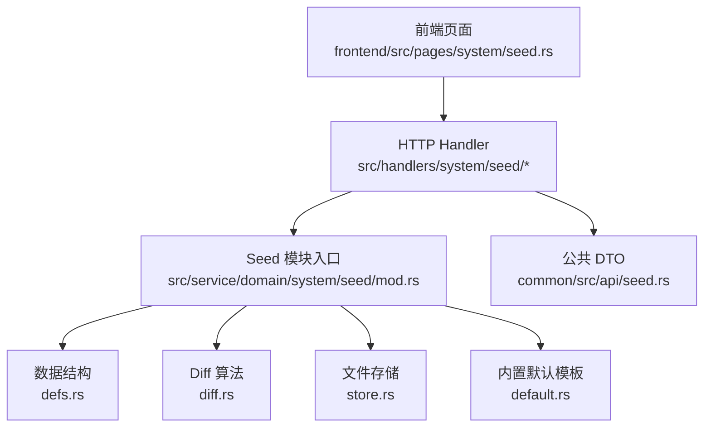
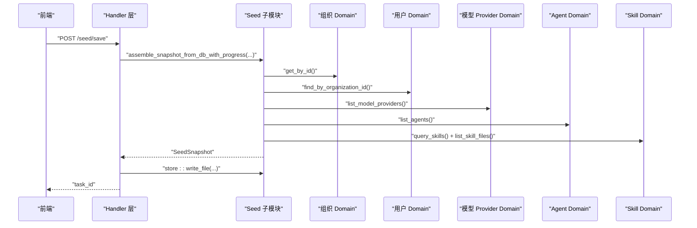
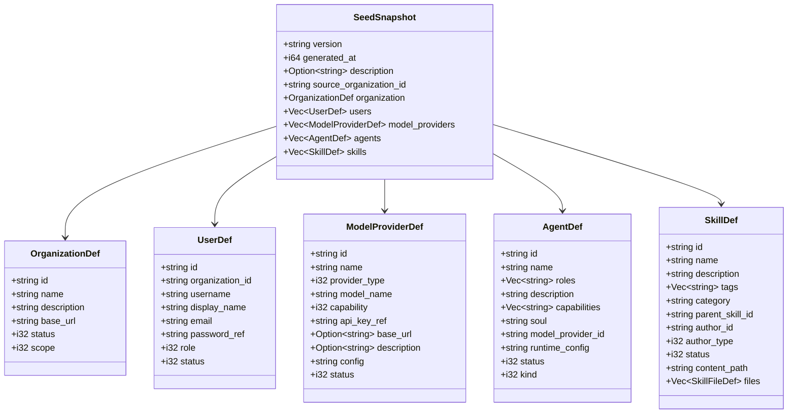
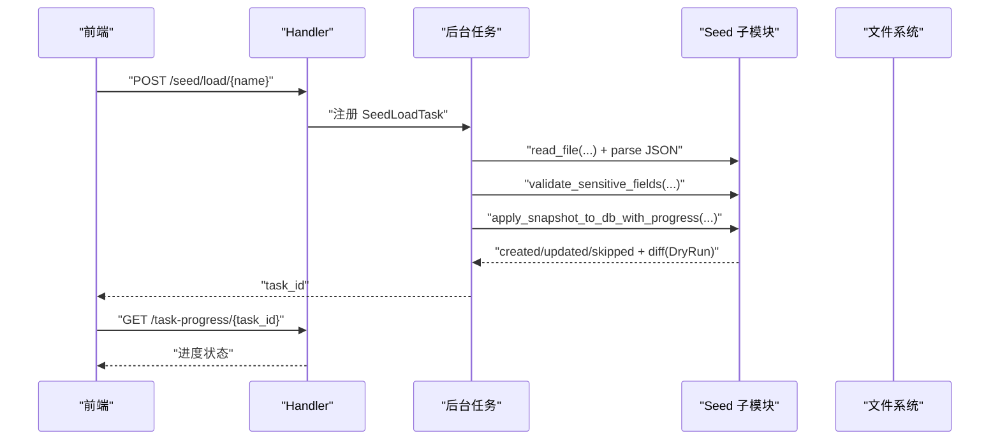
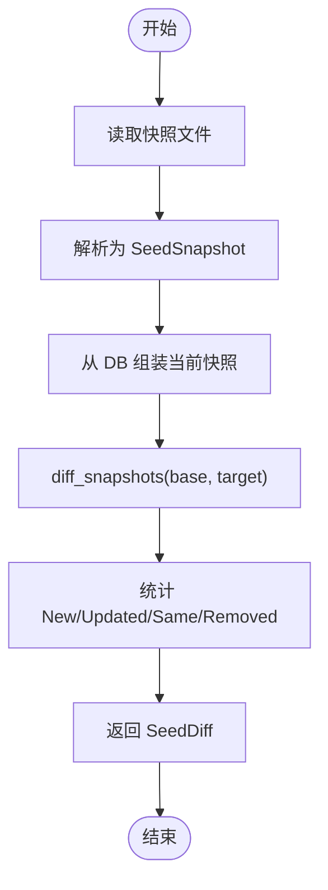
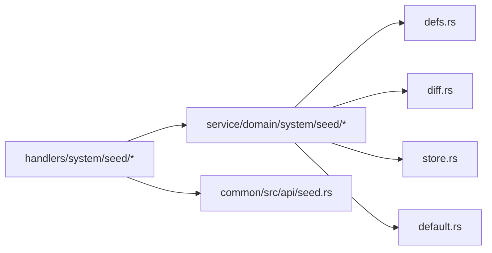

# 种子数据管理

<cite>
**本文引用的文件**
- [docs/design/seed-config-migration.md](file://docs/design/seed-config-migration.md)
- [common/src/api/seed.rs](file://common/src/api/seed.rs)
- [src/service/domain/system/seed/mod.rs](file://src/service/domain/system/seed/mod.rs)
- [src/service/domain/system/seed/defs.rs](file://src/service/domain/system/seed/defs.rs)
- [src/service/domain/system/seed/diff.rs](file://src/service/domain/system/seed/diff.rs)
- [src/service/domain/system/seed/store.rs](file://src/service/domain/system/seed/store.rs)
- [src/service/domain/system/seed/default.rs](file://src/service/domain/system/seed/default.rs)
- [src/handlers/system/seed/mod.rs](file://src/handlers/system/seed/mod.rs)
- [src/handlers/system/seed/save.rs](file://src/handlers/system/seed/save.rs)
- [src/handlers/system/seed/load.rs](file://src/handlers/system/seed/load.rs)
- [src/handlers/system/seed/diff.rs](file://src/handlers/system/seed/diff.rs)
- [src/handlers/system/seed/get_default.rs](file://src/handlers/system/seed/get_default.rs)
- [frontend/src/pages/system/seed.rs](file://frontend/src/pages/system/seed.rs)
</cite>

## 目录
1. [简介](#简介)
2. [项目结构](#项目结构)
3. [核心组件](#核心组件)
4. [架构总览](#架构总览)
5. [详细组件分析](#详细组件分析)
6. [依赖关系分析](#依赖关系分析)
7. [性能考虑](#性能考虑)
8. [故障排除指南](#故障排除指南)
9. [结论](#结论)
10. [附录](#附录)

## 简介
本文件面向“种子数据管理”能力，覆盖默认配置管理、数据版本控制、导入导出、差异对比、数据结构与验证、迁移策略、安全与最佳实践。该能力以“纯工具箱 + Handler 编排”的方式实现：种子子模块负责数据视图（快照结构、diff 算法、文件存储），Handler 层负责跨领域编排（调用组织、用户、模型 Provider、Agent、Skill 等 Domain）完成导出/导入；敏感字段通过占位符机制在导入时由管理员填写或继承当前值。

## 项目结构
种子数据管理由以下层次组成：
- API DTO 定义：位于 common 层，统一对外暴露请求/响应结构。
- 领域工具子模块：位于 system domain 下的 seed 子模块，提供快照结构、diff 算法、文件存储、内置默认模板。
- HTTP Handler：位于 handlers/system/seed，负责权限校验、任务注册、进度上报、跨领域编排。
- 前端页面：system/seed 页面提供列表、导出、导入、应用默认模板、差异对比等操作界面。

图表来源
- [frontend/src/pages/system/seed.rs:1-35](file://frontend/src/pages/system/seed.rs#L1-L35)
- [src/handlers/system/seed/mod.rs:1-30](file://src/handlers/system/seed/mod.rs#L1-L30)
- [src/service/domain/system/seed/mod.rs:1-16](file://src/service/domain/system/seed/mod.rs#L1-L16)
- [src/service/domain/system/seed/defs.rs:1-42](file://src/service/domain/system/seed/defs.rs#L1-L42)
- [src/service/domain/system/seed/diff.rs:1-38](file://src/service/domain/system/seed/diff.rs#L1-L38)
- [src/service/domain/system/seed/store.rs:1-27](file://src/service/domain/system/seed/store.rs#L1-L27)
- [src/service/domain/system/seed/default.rs:1-11](file://src/service/domain/system/seed/default.rs#L1-L11)
- [common/src/api/seed.rs:1-163](file://common/src/api/seed.rs#L1-L163)

章节来源
- [docs/design/seed-config-migration.md:1-85](file://docs/design/seed-config-migration.md#L1-L85)
- [src/service/domain/system/seed/mod.rs:1-16](file://src/service/domain/system/seed/mod.rs#L1-L16)

## 核心组件
- 公共 DTO：定义列出、读取、保存、加载、删除、差异对比、获取默认模板的请求/响应类型及导入策略枚举。
- 快照结构：包含版本、生成时间、源组织、组织、用户、模型 Provider、Agent、Skill 的定义集合。
- Diff 算法：支持文件 vs DB、DB vs 文件、文件 vs 文件的字段级差异计算，并统计新增/更新/相同/移除数量。
- 文件存储：seeds 目录的 CRUD，含文件名安全校验（防路径穿越）。
- 内置默认模板：编译期内嵌 default.json，提供开箱即用初始化能力。
- Handler 编排：导出/导入/差异对比/默认模板应用均通过后台异步任务执行，并提供进度轮询。

章节来源
- [common/src/api/seed.rs:1-163](file://common/src/api/seed.rs#L1-L163)
- [src/service/domain/system/seed/defs.rs:1-224](file://src/service/domain/system/seed/defs.rs#L1-L224)
- [src/service/domain/system/seed/diff.rs:1-255](file://src/service/domain/system/seed/diff.rs#L1-L255)
- [src/service/domain/system/seed/store.rs:1-118](file://src/service/domain/system/seed/store.rs#L1-L118)
- [src/service/domain/system/seed/default.rs:1-11](file://src/service/domain/system/seed/default.rs#L1-L11)
- [src/handlers/system/seed/mod.rs:1-675](file://src/handlers/system/seed/mod.rs#L1-L675)

## 架构总览
种子数据管理遵循“Adapter → Domain → DAL → DAO”单向调用原则，seed 子模块为纯工具箱，不调用其他 Domain；跨领域编排由 Handler 完成。

图表来源
- [src/handlers/system/seed/save.rs:123-171](file://src/handlers/system/seed/save.rs#L123-L171)
- [src/handlers/system/seed/mod.rs:273-409](file://src/handlers/system/seed/mod.rs#L273-L409)
- [src/service/domain/system/seed/store.rs:92-104](file://src/service/domain/system/seed/store.rs#L92-L104)

章节来源
- [docs/design/seed-config-migration.md:11-26](file://docs/design/seed-config-migration.md#L11-L26)
- [src/handlers/system/seed/mod.rs:1-10](file://src/handlers/system/seed/mod.rs#L1-L10)

## 详细组件分析

### 数据结构与版本控制
- SeedSnapshot：包含 version、generated_at、description、source_organization_id，以及 organization/users/model_providers/agents/skills 定义。
- 各实体定义（OrganizationDef/UserDef/ModelProviderDef/AgentDef/SkillDef）仅保留配置层字段，敏感字段使用占位符（PENDING_INPUT/INHERIT_CURRENT/RANDOM_GENERATE）。
- 版本常量 CURRENT_VERSION 用于快照格式演进兼容。

图表来源
- [src/service/domain/system/seed/defs.rs:16-147](file://src/service/domain/system/seed/defs.rs#L16-L147)

章节来源
- [src/service/domain/system/seed/defs.rs:16-42](file://src/service/domain/system/seed/defs.rs#L16-L42)
- [src/service/domain/system/seed/defs.rs:44-147](file://src/service/domain/system/seed/defs.rs#L44-L147)

### 数据导入导出流程
- 导出：Handler 创建后台任务，调用 assemble_snapshot_from_db_with_progress 组装快照，再写入 seeds 目录文件。
- 导入：Handler 创建后台任务，读取并解析快照，校验敏感字段，按策略应用到 DB（PreserveIds/RegenerateIds/DryRun/SkipExisting）。
- 默认模板应用：加载内置 default.json，直接调用 apply_snapshot_to_db。

图表来源
- [src/handlers/system/seed/load.rs:124-162](file://src/handlers/system/seed/load.rs#L124-L162)
- [src/handlers/system/seed/mod.rs:420-480](file://src/handlers/system/seed/mod.rs#L420-L480)
- [src/service/domain/system/seed/store.rs:77-104](file://src/service/domain/system/seed/store.rs#L77-L104)
- [src/service/domain/system/seed/diff.rs:171-201](file://src/service/domain/system/seed/diff.rs#L171-L201)

章节来源
- [src/handlers/system/seed/save.rs:123-171](file://src/handlers/system/seed/save.rs#L123-L171)
- [src/handlers/system/seed/load.rs:124-162](file://src/handlers/system/seed/load.rs#L124-L162)
- [src/handlers/system/seed/get_default.rs:1-16](file://src/handlers/system/seed/get_default.rs#L1-L16)

### 差异对比工具
- 支持三种比较模式：文件 vs DB、DB vs 文件、文件 vs 文件。
- 字段级变更通过递归序列化对象比较，输出 FieldChange 列表。
- 统计摘要包含 new_count/updated_count/same_count/removed_count。

图表来源
- [src/handlers/system/seed/diff.rs:15-31](file://src/handlers/system/seed/diff.rs#L15-L31)
- [src/service/domain/system/seed/diff.rs:9-38](file://src/service/domain/system/seed/diff.rs#L9-L38)
- [src/service/domain/system/seed/diff.rs:119-169](file://src/service/domain/system/seed/diff.rs#L119-L169)

章节来源
- [src/service/domain/system/seed/diff.rs:9-38](file://src/service/domain/system/seed/diff.rs#L9-L38)
- [src/service/domain/system/seed/diff.rs:119-169](file://src/service/domain/system/seed/diff.rs#L119-L169)

### 数据验证机制
- 敏感字段校验：validate_sensitive_fields 检查 PENDING_INPUT 是否已由前端传入 sensitive_values。
- 占位符解析：resolve_password/resolve_api_key 支持 PENDING_INPUT/INHERIT_CURRENT/RANDOM_GENERATE。
- 文件安全：validate_seed_filename 防止路径穿越攻击。

章节来源
- [src/service/domain/system/seed/diff.rs:171-255](file://src/service/domain/system/seed/diff.rs#L171-L255)
- [src/service/domain/system/seed/store.rs:14-27](file://src/service/domain/system/seed/store.rs#L14-L27)

### 数据迁移策略
- 导入策略：
  - PreserveIds：保留快照中的 ID（同组织恢复/回滚）。
  - RegenerateIds：生成新 ID（跨组织迁移）。
  - DryRun：仅预演，返回 diff 报告，不实际写入。
  - SkipExisting：跳过已存在实体。
- 增量更新：Handler 对每个实体先查询是否存在，再决定 create/update/skip。
- 版本升级：SeedSnapshot.version 用于未来 schema 演进兼容。

章节来源
- [common/src/api/seed.rs:70-114](file://common/src/api/seed.rs#L70-L114)
- [src/handlers/system/seed/mod.rs:411-480](file://src/handlers/system/seed/mod.rs#L411-L480)
- [src/service/domain/system/seed/defs.rs:16-42](file://src/service/domain/system/seed/defs.rs#L16-L42)

### 数据安全管理
- 敏感信息保护：password_hash/api_key 不导出，使用占位符；导入时需管理员提供或继承当前值。
- 访问权限控制：高危操作（load/apply-default/delete）需 SuperAdmin；普通 Admin 可执行查看/导出/diff。
- 操作审计：导入/导出/应用默认模板通过后台任务执行，任务进度与结果可追踪。

章节来源
- [src/handlers/system/seed/mod.rs:36-46](file://src/handlers/system/seed/mod.rs#L36-L46)
- [src/handlers/system/seed/load.rs:152-162](file://src/handlers/system/seed/load.rs#L152-L162)
- [src/handlers/system/seed/save.rs:161-171](file://src/handlers/system/seed/save.rs#L161-L171)
- [src/handlers/system/seed/apply_default.rs:1-69](file://src/handlers/system/seed/apply_default.rs#L1-L69)

### 最佳实践指南
- 配置管理：使用 save 导出当前配置到 seeds 目录，配合 git 提交进行版本管理。
- 版本控制：利用 SeedSnapshot.version 和 diff 报告跟踪变更。
- 团队协作：通过 DryRun 预览影响范围，确认后再执行真实导入；跨环境迁移使用 RegenerateIds。

章节来源
- [docs/design/seed-config-migration.md:51-56](file://docs/design/seed-config-migration.md#L51-L56)
- [src/handlers/system/seed/mod.rs:443-480](file://src/handlers/system/seed/mod.rs#L443-L480)

## 依赖关系分析
- Handler 依赖 seed 子模块的纯函数（diff、validate、resolve）与文件存储（store）。
- seed 子模块不依赖任何 DAL/Domain，保持无业务感知。
- 公共 DTO 位于 common 层，被前后端共享。

图表来源
- [src/handlers/system/seed/mod.rs:1-30](file://src/handlers/system/seed/mod.rs#L1-L30)
- [src/service/domain/system/seed/mod.rs:1-16](file://src/service/domain/system/seed/mod.rs#L1-L16)
- [common/src/api/seed.rs:1-163](file://common/src/api/seed.rs#L1-L163)

章节来源
- [docs/design/seed-config-migration.md:11-26](file://docs/design/seed-config-migration.md#L11-L26)

## 性能考虑
- 导出/导入均为后台异步任务，避免阻塞 HTTP 请求。
- 技能文件内容支持内嵌、引用编译期内嵌文件或运行时 HTTPS 抓取（限制 1MB，超时 30s）。
- 差异对比基于 JSON 序列化递归比较，适合配置规模较小的场景。

章节来源
- [src/handlers/system/seed/save.rs:17-78](file://src/handlers/system/seed/save.rs#L17-L78)
- [src/handlers/system/seed/load.rs:17-79](file://src/handlers/system/seed/load.rs#L17-L79)
- [src/handlers/system/seed/mod.rs:72-128](file://src/handlers/system/seed/mod.rs#L72-L128)

## 故障排除指南
- 缺少敏感字段：导入时报错提示缺少 user:{id}:password 或 model_provider:{id}:api_key，需在前端表单中填写后重试。
- 文件不存在：读取快照文件失败会返回 not_found，请确认文件名是否正确且存在于 seeds 目录。
- 权限不足：执行 load/apply-default/delete 需要 SuperAdmin 角色，否则返回 forbidden。
- 技能文件内容缺失：若 SkillFileDef 未指定 content/ref_path/url，将报错提示未指定内容来源。

章节来源
- [src/service/domain/system/seed/diff.rs:171-201](file://src/service/domain/system/seed/diff.rs#L171-L201)
- [src/service/domain/system/seed/store.rs:77-104](file://src/service/domain/system/seed/store.rs#L77-L104)
- [src/handlers/system/seed/mod.rs:36-46](file://src/handlers/system/seed/mod.rs#L36-L46)
- [src/handlers/system/seed/mod.rs:124-128](file://src/handlers/system/seed/mod.rs#L124-L128)

## 结论
种子数据管理通过“纯工具箱 + Handler 编排”实现了安全的配置导出/导入、差异对比与默认模板应用。其设计严格遵循分层架构，确保可测试性、职责清晰与复用性。结合后台任务与进度轮询，提供了良好的用户体验与运维可控性。

## 附录
- 常见数据类型：SeedSnapshot、OrganizationDef、UserDef、ModelProviderDef、AgentDef、SkillDef、SkillFileDef、SeedDiff、DiffEntry、FieldChange。
- 模板示例：内置 default.json 可通过 GET /seed/default 获取，或通过 POST /seed/apply-default 应用。
- 前端集成：system/seed 页面提供列表、导出、导入、应用默认模板、差异对比等操作，并通过 TaskProgress 组件轮询进度。

章节来源
- [src/service/domain/system/seed/defs.rs:16-224](file://src/service/domain/system/seed/defs.rs#L16-L224)
- [src/handlers/system/seed/get_default.rs:1-16](file://src/handlers/system/seed/get_default.rs#L1-L16)
- [frontend/src/pages/system/seed.rs:1-35](file://frontend/src/pages/system/seed.rs#L1-L35)