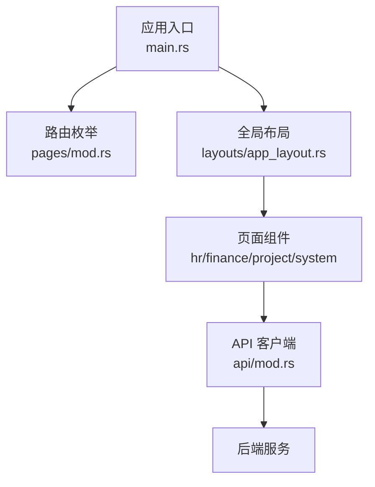
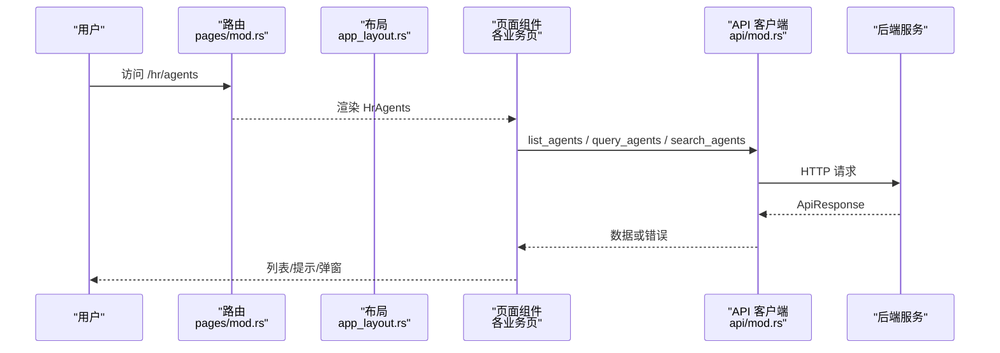
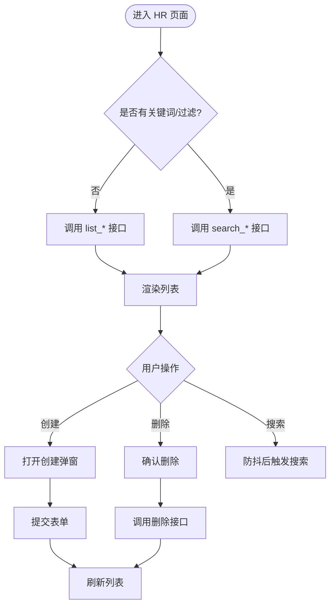
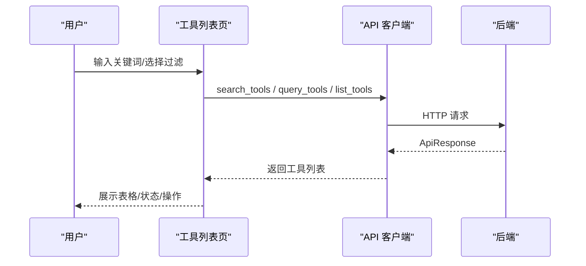
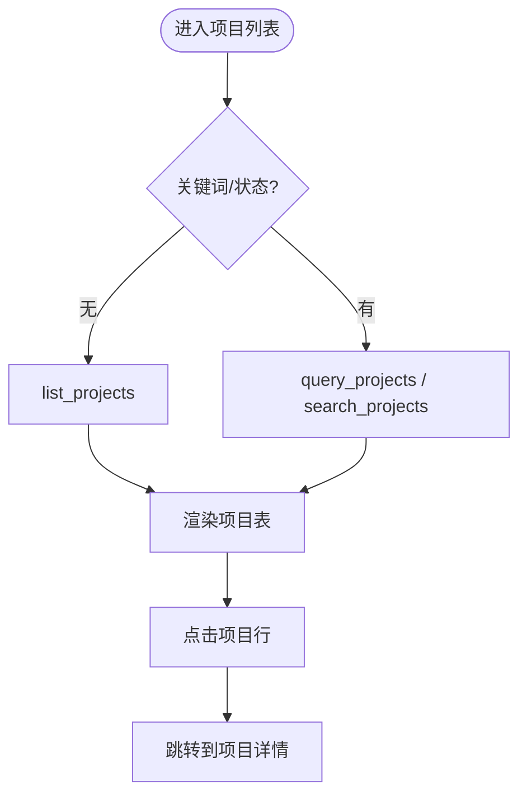
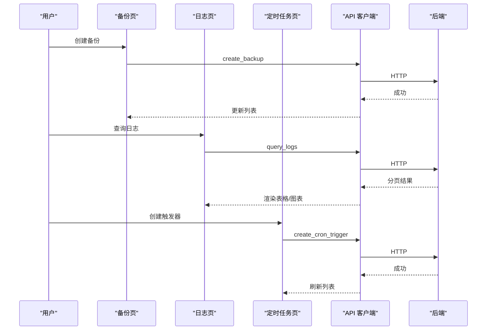
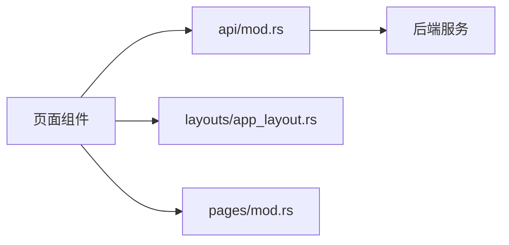

# 页面模块

<cite>
**本文引用的文件**
- [frontend/src/main.rs](file://frontend/src/main.rs)
- [frontend/src/pages/mod.rs](file://frontend/src/pages/mod.rs)
- [frontend/src/layouts/app_layout.rs](file://frontend/src/layouts/app_layout.rs)
- [frontend/src/api/mod.rs](file://frontend/src/api/mod.rs)
- [frontend/src/pages/hr/agents.rs](file://frontend/src/pages/hr/agents.rs)
- [frontend/src/pages/hr/skills.rs](file://frontend/src/pages/hr/skills.rs)
- [frontend/src/pages/hr/knowledge_graph.rs](file://frontend/src/pages/hr/knowledge_graph.rs)
- [frontend/src/pages/finance/tools.rs](file://frontend/src/pages/finance/tools.rs)
- [frontend/src/pages/project/projects.rs](file://frontend/src/pages/project/projects.rs)
- [frontend/src/pages/system/backup.rs](file://frontend/src/pages/system/backup.rs)
- [frontend/src/pages/system/logs.rs](file://frontend/src/pages/system/logs.rs)
- [frontend/src/pages/system/triggers.rs](file://frontend/src/pages/system/triggers.rs)
</cite>

## 目录
1. [简介](#简介)
2. [项目结构](#项目结构)
3. [核心组件](#核心组件)
4. [架构总览](#架构总览)
5. [详细组件分析](#详细组件分析)
6. [依赖分析](#依赖分析)
7. [性能考虑](#性能考虑)
8. [故障排查指南](#故障排查指南)
9. [结论](#结论)
10. [附录](#附录)

## 简介
本文件面向 AI Orz 前端应用，系统化梳理各业务域页面模块的实现与交互：HR 管理（Agent 管理、技能管理、知识图谱）、Finance 管理（工具管理、模型提供商、消息渠道等）、项目管理（项目 CRUD、任务管理、工件管理）、系统管理（备份恢复、日志查询、定时任务）。文档覆盖路由配置、数据获取策略、用户交互流程、状态同步机制、导航与权限控制、响应式布局适配，以及性能优化与用户体验改进建议。

## 项目结构
前端采用 Dioxus + Tailwind/DaisyUI 的模块化组织方式：
- 入口与全局上下文：应用启动、主题、Toast、移动端检测、路由挂载
- 路由定义：按业务域分组的全局路由枚举
- 布局与权限：统一 AppLayout 包裹内容区，并在进入时进行鉴权拦截
- API 客户端：统一的 HTTP 封装、错误处理、401 重定向、分页与查询串构造
- 页面模块：hr、finance、project、system 等子模块各自维护列表、详情、弹窗、筛选、搜索等

图表来源
- [frontend/src/main.rs:24-55](file://frontend/src/main.rs#L24-L55)
- [frontend/src/pages/mod.rs:56-154](file://frontend/src/pages/mod.rs#L56-L154)
- [frontend/src/layouts/app_layout.rs:8-27](file://frontend/src/layouts/app_layout.rs#L8-L27)
- [frontend/src/api/mod.rs:28-433](file://frontend/src/api/mod.rs#L28-L433)

章节来源
- [frontend/src/main.rs:24-55](file://frontend/src/main.rs#L24-L55)
- [frontend/src/pages/mod.rs:56-154](file://frontend/src/pages/mod.rs#L56-L154)
- [frontend/src/layouts/app_layout.rs:8-27](file://frontend/src/layouts/app_layout.rs#L8-L27)
- [frontend/src/api/mod.rs:28-433](file://frontend/src/api/mod.rs#L28-L433)

## 核心组件
- 路由与导航
  - 使用 Routable 宏集中声明所有页面路由，涵盖 HR、Finance、Project、System、User、Workspace 等
  - 通过 Link 在页面间跳转，支持带参路由（如 :id）
- 权限与布局
  - AppLayout 在进入时调用鉴权钩子，未登录则显示加载并阻止渲染受保护内容
  - 主布局包含顶部导航栏与内容区域，适配容器宽度与内边距
- API 客户端
  - 提供 GET/POST/PUT/DELETE、文本下载、Multipart 上传等通用方法
  - 统一解析 ApiResponse，处理 401 自动清理登录态并重定向到 /login
  - 提供分页 URL 与查询串构造工具，便于列表页组合查询参数

章节来源
- [frontend/src/pages/mod.rs:56-154](file://frontend/src/pages/mod.rs#L56-L154)
- [frontend/src/layouts/app_layout.rs:8-27](file://frontend/src/layouts/app_layout.rs#L8-L27)
- [frontend/src/api/mod.rs:28-433](file://frontend/src/api/mod.rs#L28-L433)

## 架构总览
前端以“路由 → 页面组件 → 状态信号 → API 调用 → 后端”为主线，结合 Toast 反馈与 Modal/ConfirmDialog 完成交互闭环。关键路径如下：

图表来源
- [frontend/src/pages/mod.rs:56-154](file://frontend/src/pages/mod.rs#L56-L154)
- [frontend/src/layouts/app_layout.rs:8-27](file://frontend/src/layouts/app_layout.rs#L8-L27)
- [frontend/src/api/mod.rs:28-433](file://frontend/src/api/mod.rs#L28-L433)

## 详细组件分析

### HR 管理页面
- Agent 管理
  - 功能：列表展示、创建本地/外部 Agent、删除确认、搜索与状态过滤
  - 数据策略：三场景切换（list/query/search），防抖输入与 request_id 丢弃过期结果
  - 交互：Modal 表单、ConfirmDialog 删除、Toast 反馈
  - 导航：点击行跳转到详情页
- 技能管理
  - 功能：列表、创建、删除、分类与状态过滤、搜索
  - 数据策略：同 Agent 管理，三场景切换与防抖
  - 交互：Modal 创建、标签与内容编辑、删除确认
- 知识图谱
  - 功能：搜索节点、推荐起点、展开关联、节点详情、Canvas/SVG 双渲染
  - 数据策略：search_memory_with_traversal，detail_map 缓存与大小限制，expand_layout 增量扩展
  - 交互：节点点击展开、搜索历史、风格切换、高亮与选中环
  - 导航：可选择特定 Agent 或全局视图

图表来源
- [frontend/src/pages/hr/agents.rs:84-149](file://frontend/src/pages/hr/agents.rs#L84-L149)
- [frontend/src/pages/hr/skills.rs:42-110](file://frontend/src/pages/hr/skills.rs#L42-L110)
- [frontend/src/pages/hr/knowledge_graph.rs:163-239](file://frontend/src/pages/hr/knowledge_graph.rs#L163-L239)

章节来源
- [frontend/src/pages/hr/agents.rs:84-149](file://frontend/src/pages/hr/agents.rs#L84-L149)
- [frontend/src/pages/hr/skills.rs:42-110](file://frontend/src/pages/hr/skills.rs#L42-L110)
- [frontend/src/pages/hr/knowledge_graph.rs:163-239](file://frontend/src/pages/hr/knowledge_graph.rs#L163-L239)

### Finance 管理页面
- 工具管理
  - 功能：列表、启用/禁用、删除、协议与状态过滤、搜索
  - 数据策略：三场景切换（list/query/search），防抖与 request_id 丢弃
  - 交互：ConfirmDialog 删除、状态切换按钮、Toast 反馈
  - 导航：点击名称跳转到工具详情
- 其他子页面（模型提供商、消息渠道、附件、MCP 服务器等）
  - 遵循相同的数据获取与交互模式：列表+筛选+搜索+详情+弹窗

图表来源
- [frontend/src/pages/finance/tools.rs:35-106](file://frontend/src/pages/finance/tools.rs#L35-L106)
- [frontend/src/api/mod.rs:87-174](file://frontend/src/api/mod.rs#L87-L174)

章节来源
- [frontend/src/pages/finance/tools.rs:35-106](file://frontend/src/pages/finance/tools.rs#L35-L106)

### 项目管理页面
- 项目列表
  - 功能：创建项目、状态过滤、搜索、任务数统计
  - 数据策略：三场景切换（list/query/search），防抖与 request_id 丢弃；并行加载各项目任务数
  - 交互：Modal 创建、清空筛选、Toast 反馈
  - 导航：点击项目名称跳转到项目详情
- 任务与工件
  - 遵循列表+详情+CRUD 的统一模式，配合路由参数传递 ID

图表来源
- [frontend/src/pages/project/projects.rs:34-93](file://frontend/src/pages/project/projects.rs#L34-L93)

章节来源
- [frontend/src/pages/project/projects.rs:34-93](file://frontend/src/pages/project/projects.rs#L34-L93)

### 系统管理页面
- 备份恢复
  - 功能：备份列表、创建备份、查看恢复脚本、复制脚本、删除备份
  - 数据策略：列表刷新、脚本获取、删除确认后刷新
  - 交互：Modal 展示脚本与警告、ConfirmDialog 删除、Toast 反馈
- 日志查询
  - 功能：关键词/Log ID/级别/时间范围过滤、分页、调用链追踪、原始 JSON 展开
  - 数据策略：首次默认查询第一页，统计图表（级别分布、24h 时序）独立加载
  - 交互：点击 Log ID 发起新查询、消息行展开/收起、翻页
- 定时任务
  - 功能：触发器列表、创建/编辑、暂停/恢复、删除、Payload 模板与自定义 JSON
  - 数据策略：列表加载、编辑时拉取详情、保存后刷新
  - 交互：Modal 表单、JSON 校验、Cron 预设、状态分布图

图表来源
- [frontend/src/pages/system/backup.rs:80-149](file://frontend/src/pages/system/backup.rs#L80-L149)
- [frontend/src/pages/system/logs.rs:94-182](file://frontend/src/pages/system/logs.rs#L94-L182)
- [frontend/src/pages/system/triggers.rs:168-292](file://frontend/src/pages/system/triggers.rs#L168-L292)

章节来源
- [frontend/src/pages/system/backup.rs:80-149](file://frontend/src/pages/system/backup.rs#L80-L149)
- [frontend/src/pages/system/logs.rs:94-182](file://frontend/src/pages/system/logs.rs#L94-L182)
- [frontend/src/pages/system/triggers.rs:168-292](file://frontend/src/pages/system/triggers.rs#L168-L292)

## 依赖分析
- 页面与 API 的耦合
  - 各页面通过 api 模块的函数调用后端接口，避免直接拼接 URL
  - 错误处理集中在 api 层，页面仅关注业务逻辑与 UI 状态
- 路由与页面
  - pages/mod.rs 集中声明路由，页面组件通过 Link 与 Route 枚举跳转
- 布局与权限
  - layouts/app_layout.rs 作为受保护页面的父级，统一鉴权与布局
- 状态与交互
  - 页面内部使用 Signal 管理列表、加载、弹窗、筛选等状态
  - 使用 Toast、Modal、ConfirmDialog 等通用组件提升一致性

图表来源
- [frontend/src/pages/mod.rs:56-154](file://frontend/src/pages/mod.rs#L56-L154)
- [frontend/src/layouts/app_layout.rs:8-27](file://frontend/src/layouts/app_layout.rs#L8-L27)
- [frontend/src/api/mod.rs:28-433](file://frontend/src/api/mod.rs#L28-L433)

章节来源
- [frontend/src/pages/mod.rs:56-154](file://frontend/src/pages/mod.rs#L56-L154)
- [frontend/src/layouts/app_layout.rs:8-27](file://frontend/src/layouts/app_layout.rs#L8-L27)
- [frontend/src/api/mod.rs:28-433](file://frontend/src/api/mod.rs#L28-L433)

## 性能考虑
- 搜索防抖与竞态保护
  - 多处实现 300ms 防抖与 search_request_id 机制，避免频繁请求与结果错乱
- 列表与详情分离
  - 列表页专注轻量查询，详情页按需拉取完整数据，减少首屏压力
- 图谱渲染优化
  - 知识图谱支持 Canvas 与 SVG 两种渲染，大数据量优先 Canvas；detail_map 限制大小防止内存增长
- 分页与懒加载
  - 日志查询默认分页，按需展开原始 JSON；项目列表并行加载任务数但控制并发
- 网络错误与超时
  - 统一错误处理与 401 重定向，避免无效重试；必要时增加重试与退避策略

[本节为通用指导，不直接分析具体文件]

## 故障排查指南
- 401 未授权
  - 现象：页面空白或跳转登录
  - 原因：Cookie 过期或 Token 失效
  - 处理：api 层自动清理登录态并跳转 /login；检查认证流程与 Cookie 设置
- 搜索无结果或结果错乱
  - 现象：输入关键词后列表不更新或显示旧数据
  - 原因：防抖未完成或竞态导致旧结果覆盖
  - 处理：确认 search_request_id 机制生效；检查异步任务生命周期
- 弹窗状态污染
  - 现象：关闭弹窗后残留上次填写内容
  - 原因：on_close 未重置表单状态
  - 处理：在 on_close 中重置所有表单字段与标志位
- 图谱内存增长
  - 现象：长时间浏览后卡顿
  - 原因：detail_map 无限增长
  - 处理：限制 map 大小并按当前节点集合清理

章节来源
- [frontend/src/api/mod.rs:37-45](file://frontend/src/api/mod.rs#L37-L45)
- [frontend/src/pages/hr/agents.rs:73-139](file://frontend/src/pages/hr/agents.rs#L73-L139)
- [frontend/src/pages/hr/skills.rs:31-105](file://frontend/src/pages/hr/skills.rs#L31-L105)
- [frontend/src/pages/hr/knowledge_graph.rs:278-290](file://frontend/src/pages/hr/knowledge_graph.rs#L278-L290)

## 结论
AI Orz 前端页面模块以清晰的路由与布局为基础，结合统一的 API 客户端与丰富的交互组件，实现了 HR、Finance、Project、System 等多业务域的完整管理能力。通过防抖、竞态保护、分页与渲染优化等手段，兼顾了用户体验与性能。后续可进一步引入更完善的错误重试、缓存策略与单元测试，以提升稳定性与可维护性。

[本节为总结，不直接分析具体文件]

## 附录
- 路由清单（节选）
  - HR：/hr/agents、/hr/agents/:id、/hr/skills、/hr/skills/:id、/hr/memory-search、/hr/knowledge-graph
  - Finance：/finance/model-providers、/finance/model-providers/:id、/finance/tools、/finance/tools/:id、/finance/tool-call-entries、/finance/message-channels、/finance/message-channels/:id、/finance/mcp-servers、/finance/mcp-servers/:id、/finance/attachments、/finance/attachments/:id
  - Project：/projects、/projects/:id、/projects/artifacts、/projects/artifacts/:id、/tasks、/tasks/:id
  - System：/system/triggers、/system/health、/system/logs、/system/backup、/system/aop、/system/seed、/system/tasks
- 常见交互模式
  - 列表页：筛选 + 搜索 + 分页 + 操作按钮（启用/禁用、删除）
  - 详情页：参数路由传 ID，按需加载详情
  - 弹窗：Modal 表单 + ConfirmDialog 确认 + Toast 反馈

章节来源
- [frontend/src/pages/mod.rs:56-154](file://frontend/src/pages/mod.rs#L56-L154)