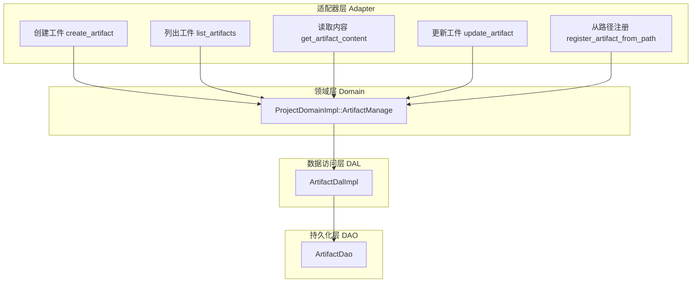
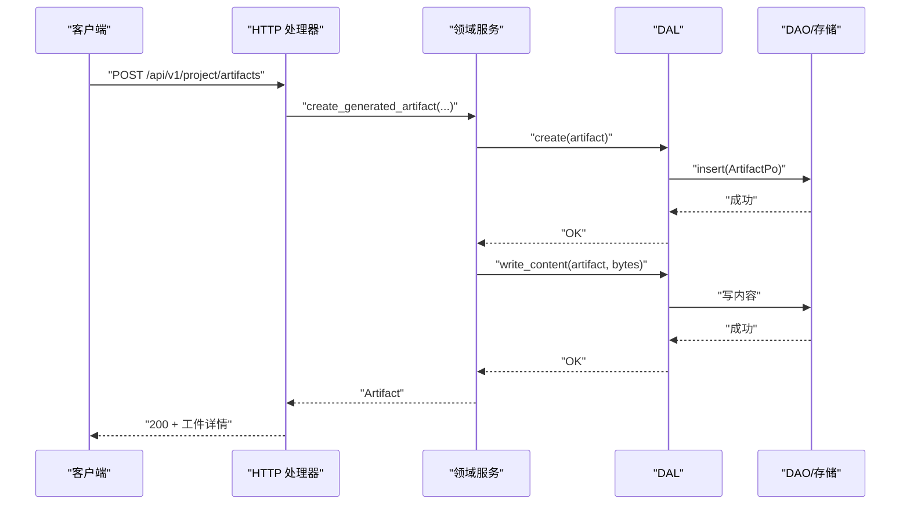
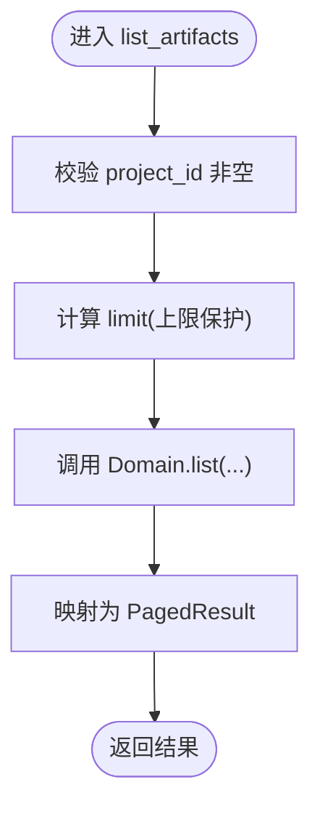
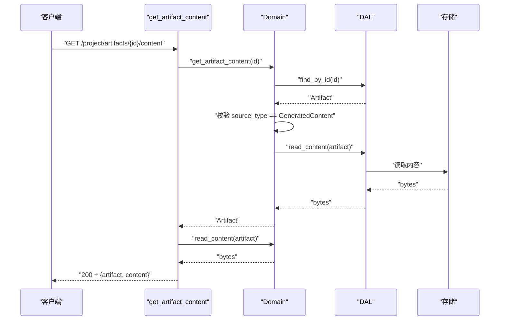
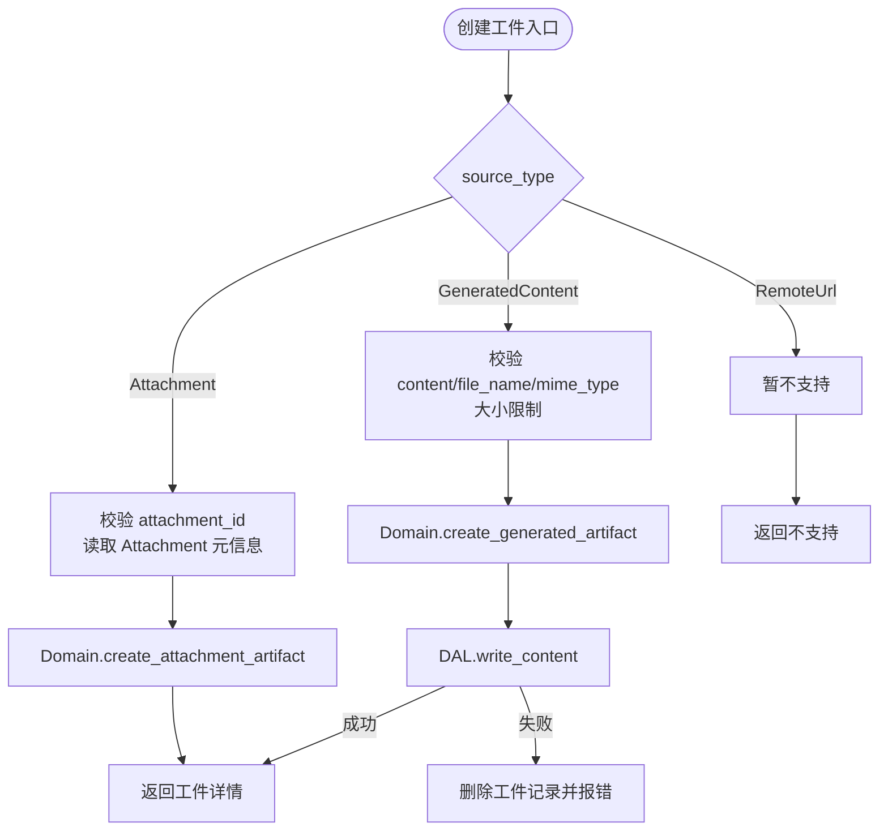
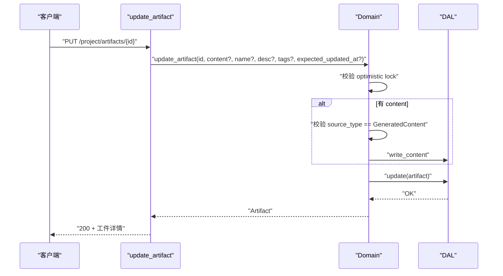
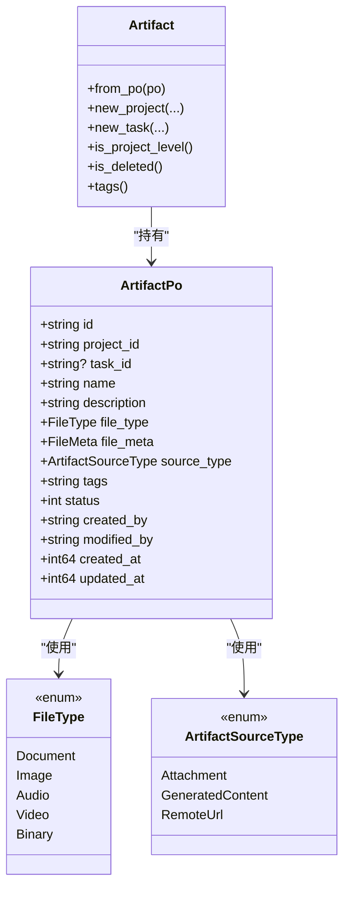
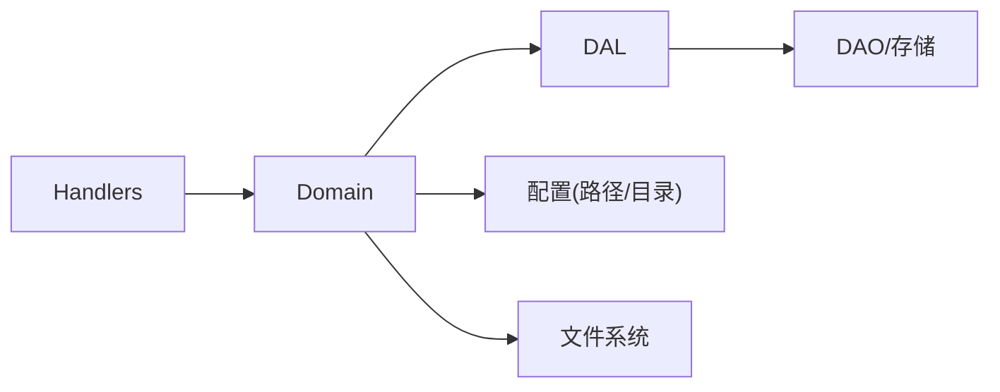

# 工件管理功能

<cite>
**本文引用的文件**
- [artifact.rs](file://src/models/artifact.rs)
- [artifact.rs（领域层）](file://src/service/domain/project/artifact.rs)
- [artifact.rs（DAL 层）](file://src/service/dal/artifact.rs)
- [mod.rs（处理器聚合）](file://src/handlers/project/artifact/mod.rs)
- [list_artifacts.rs](file://src/handlers/project/artifact/list_artifacts.rs)
- [get_artifact_content.rs](file://src/handlers/project/artifact/get_artifact_content.rs)
- [create_artifact.rs](file://src/handlers/project/artifact/create_artifact.rs)
- [update_artifact.rs](file://src/handlers/project/artifact/update_artifact.rs)
- [register_artifact_from_path.rs](file://src/handlers/project/artifact/register_artifact_from_path.rs)
- [artifact.rs（枚举：来源类型）](file://common/src/enums/artifact.rs)
- [file.rs（枚举：文件类型）](file://common/src/enums/file.rs)
</cite>

## 目录
1. [简介](#简介)
2. [项目结构](#项目结构)
3. [核心组件](#核心组件)
4. [架构总览](#架构总览)
5. [详细组件分析](#详细组件分析)
6. [依赖关系分析](#依赖关系分析)
7. [性能与扩展性](#性能与扩展性)
8. [故障排查指南](#故障排查指南)
9. [结论](#结论)
10. [附录](#附录)

## 简介
本章节面向“工件管理”能力，覆盖工件列表页的文件管理（上传、下载、预览、版本控制）、工件详情视图的内容展示（代码高亮、文档渲染、媒体预览），以及工件类型支持（代码/文档/图片/视频/二进制）和格式推断机制。同时记录版本历史追踪、变更对比、回滚与分支管理的现状与建议；并说明权限控制、访问日志、搜索索引与缓存策略在现有实现中的位置与可扩展点。最后给出模板系统、批量操作、导入导出与云存储集成的技术路线建议。

## 项目结构
工件管理采用严格四层单向调用：Adapter（HTTP Handler）→ Domain → DAL → DAO。Domain 负责业务校验与编排，DAL 封装数据访问接口，DAO 负责持久化。PO 仅在 DAL/DAO 内部使用，Domain 对外暴露业务实体 Artifact。

图表来源
- [mod.rs（处理器聚合）:1-24](file://src/handlers/project/artifact/mod.rs#L1-L24)
- [artifact.rs（领域层）:26-192](file://src/service/domain/project/artifact.rs#L26-L192)
- [artifact.rs（DAL 层）:36-91](file://src/service/dal/artifact.rs#L36-L91)

章节来源
- [mod.rs（处理器聚合）:1-24](file://src/handlers/project/artifact/mod.rs#L1-L24)
- [artifact.rs（领域层）:26-192](file://src/service/domain/project/artifact.rs#L26-L192)
- [artifact.rs（DAL 层）:36-91](file://src/service/dal/artifact.rs#L36-L91)

## 核心组件
- 工件模型与类型
  - 业务实体 Artifact 与持久化对象 ArtifactPo，包含项目/任务归属、名称、描述、文件类型、元数据、来源类型、标签、状态、审计字段等。
  - 文件类型 FileType：文档、图片、音频、视频、二进制。
  - 来源类型 ArtifactSourceType：附件引用、生成内容、远程 URL（预留）。
- 领域服务 ArtifactManage
  - 创建附件型工件、创建生成内容工件、按项目/任务查询、分页查询、删除、读取/写入生成内容、更新元数据与内容（乐观锁）。
- 数据访问层 ArtifactDal
  - 统一抽象 create/find_by_id/list_by_project/list_by_task/query/delete/update/read_content/write_content/count 等。
- HTTP 处理器
  - 创建、列出、获取内容、更新、从路径注册工件等端点，完成参数校验、权限校验、错误处理与响应转换。

章节来源
- [artifact.rs（模型）:17-192](file://src/models/artifact.rs#L17-L192)
- [artifact.rs（枚举：来源类型）:8-62](file://common/src/enums/artifact.rs#L8-L62)
- [file.rs（枚举：文件类型）:11-56](file://common/src/enums/file.rs#L11-L56)
- [artifact.rs（领域层）:26-487](file://src/service/domain/project/artifact.rs#L26-L487)
- [artifact.rs（DAL 层）:36-195](file://src/service/dal/artifact.rs#L36-L195)
- [create_artifact.rs:13-146](file://src/handlers/project/artifact/create_artifact.rs#L13-L146)
- [list_artifacts.rs:12-52](file://src/handlers/project/artifact/list_artifacts.rs#L12-L52)
- [get_artifact_content.rs:11-68](file://src/handlers/project/artifact/get_artifact_content.rs#L11-L68)
- [update_artifact.rs:9-54](file://src/handlers/project/artifact/update_artifact.rs#L9-L54)
- [register_artifact_from_path.rs:11-108](file://src/handlers/project/artifact/register_artifact_from_path.rs#L11-L108)

## 架构总览
工件管理遵循四层单向调用，Handler 仅做入参校验、权限上下文注入与响应映射；Domain 负责业务规则（如来源类型限制、乐观锁、路径安全校验）；DAL 提供稳定接口；DAO 负责 SQL/存储细节。

图表来源
- [create_artifact.rs:22-146](file://src/handlers/project/artifact/create_artifact.rs#L22-L146)
- [artifact.rs（领域层）:342-399](file://src/service/domain/project/artifact.rs#L342-L399)
- [artifact.rs（DAL 层）:101-105](file://src/service/dal/artifact.rs#L101-L105)

## 详细组件分析

### 工件列表与过滤
- 能力
  - 按项目列出工件，支持 task_id、file_type、source_type 过滤与分页。
  - 最大 limit 默认上限保护。
- 流程
  - Handler 校验 project_id，构造 ListArtifactsParams，调用 Domain.list，返回 PagedResult<ArtifactDetail>。
- 关键点
  - 权限由 Domain 内 validate_project_and_task 保证。
  - 分页参数通过 common::api::PaginationParams 传递。

图表来源
- [list_artifacts.rs:20-52](file://src/handlers/project/artifact/list_artifacts.rs#L20-L52)
- [artifact.rs（领域层）:167-192](file://src/service/domain/project/artifact.rs#L167-L192)

章节来源
- [list_artifacts.rs:12-52](file://src/handlers/project/artifact/list_artifacts.rs#L12-L52)
- [artifact.rs（领域层）:167-192](file://src/service/domain/project/artifact.rs#L167-L192)

### 工件详情与内容读取
- 能力
  - 获取工件元数据与文本内容（仅限 source_type = GeneratedContent）。
  - 读取时进行 UTF-8 校验，返回编码、大小、更新时间等。
- 流程
  - Handler.get_artifact_content → Domain.get_artifact_content → Domain.read_content → 组装响应。
- 关键点
  - 非 GeneratedContent 的工件禁止直接读取内容。
  - 权限校验基于项目归属。

图表来源
- [get_artifact_content.rs:19-68](file://src/handlers/project/artifact/get_artifact_content.rs#L19-L68)
- [artifact.rs（领域层）:224-271](file://src/service/domain/project/artifact.rs#L224-L271)
- [artifact.rs（DAL 层）:176-194](file://src/service/dal/artifact.rs#L176-L194)

章节来源
- [get_artifact_content.rs:11-68](file://src/handlers/project/artifact/get_artifact_content.rs#L11-L68)
- [artifact.rs（领域层）:224-271](file://src/service/domain/project/artifact.rs#L224-L271)

### 工件创建（附件引用与生成内容）
- 能力
  - 附件引用型：基于已有 attachment 创建工件，复用其 mime/size/path 信息。
  - 生成内容型：直接传入 content、file_name、mime_type、file_type，写入内容并落盘。
  - 从路径注册：将 agent 目录下文件复制到工件存储，自动推断 mime/type。
- 约束与安全
  - 生成内容大小限制（例如文本不超过 1MB）。
  - 路径安全校验：目标路径必须在 artifacts_dir 下；源路径必须在 agent_data_dir 下。
  - 失败回滚：写内容失败时删除已创建的工件记录。
- 流程
  - Handler.create_artifact → 根据 source_type 分派 → Domain.create_* → DAL.write_content → 返回详情。

图表来源
- [create_artifact.rs:22-146](file://src/handlers/project/artifact/create_artifact.rs#L22-L146)
- [artifact.rs（领域层）:28-125](file://src/service/domain/project/artifact.rs#L28-L125)
- [artifact.rs（领域层）:342-399](file://src/service/domain/project/artifact.rs#L342-L399)
- [register_artifact_from_path.rs:23-108](file://src/handlers/project/artifact/register_artifact_from_path.rs#L23-L108)

章节来源
- [create_artifact.rs:13-146](file://src/handlers/project/artifact/create_artifact.rs#L13-L146)
- [artifact.rs（领域层）:28-125](file://src/service/domain/project/artifact.rs#L28-L125)
- [artifact.rs（领域层）:342-399](file://src/service/domain/project/artifact.rs#L342-L399)
- [register_artifact_from_path.rs:11-108](file://src/handlers/project/artifact/register_artifact_from_path.rs#L11-L108)

### 工件更新与乐观锁
- 能力
  - 部分更新：name、description、tags、content（仅 GeneratedContent）。
  - 乐观锁：通过 expected_updated_at 防止并发覆盖。
- 流程
  - Handler.update_artifact → Domain.update_artifact → 校验来源类型与大小 → 写内容/更新元数据 → DAL.update。
- 关键点
  - 非 GeneratedContent 不允许更新 content。
  - 更新后刷新 updated_at 与 modified_by。

图表来源
- [update_artifact.rs:21-54](file://src/handlers/project/artifact/update_artifact.rs#L21-L54)
- [artifact.rs（领域层）:273-340](file://src/service/domain/project/artifact.rs#L273-L340)
- [artifact.rs（DAL 层）:171-174](file://src/service/dal/artifact.rs#L171-L174)

章节来源
- [update_artifact.rs:9-54](file://src/handlers/project/artifact/update_artifact.rs#L9-L54)
- [artifact.rs（领域层）:273-340](file://src/service/domain/project/artifact.rs#L273-L340)
- [artifact.rs（DAL 层）:171-174](file://src/service/dal/artifact.rs#L171-L174)

### 工件类型支持与格式推断
- 支持的工件类型
  - 文档、图片、音频、视频、二进制。
- 来源类型
  - 附件引用、生成内容、远程 URL（预留）。
- 格式推断
  - 从路径注册时，基于文件名推断 MIME 类型，再映射到 FileType。
  - 生成内容创建时可显式指定 mime_type 与 file_type。

图表来源
- [artifact.rs（模型）:17-192](file://src/models/artifact.rs#L17-L192)
- [artifact.rs（枚举：来源类型）:8-62](file://common/src/enums/artifact.rs#L8-L62)
- [file.rs（枚举：文件类型）:11-56](file://common/src/enums/file.rs#L11-L56)

章节来源
- [artifact.rs（模型）:17-192](file://src/models/artifact.rs#L17-L192)
- [artifact.rs（枚举：来源类型）:8-62](file://common/src/enums/artifact.rs#L8-L62)
- [file.rs（枚举：文件类型）:11-56](file://common/src/enums/file.rs#L11-L56)
- [register_artifact_from_path.rs:78-88](file://src/handlers/project/artifact/register_artifact_from_path.rs#L78-L88)

## 依赖关系分析
- 模块耦合
  - Handler 依赖 Domain 的 ArtifactManage 接口；Domain 依赖 DAL；DAL 依赖 DAO。
  - 类型定义集中在 common/enums 与 models，便于前后端共享契约。
- 外部依赖
  - 文件系统：用于生成内容落盘与路径复制。
  - 配置：artifacts_dir、agent_data_dir 等路径隔离。
- 潜在风险
  - 路径遍历防护已在多处实现，需保持严格。
  - 大文件写入与磁盘空间需监控。

图表来源
- [artifact.rs（领域层）:489-531](file://src/service/domain/project/artifact.rs#L489-L531)
- [register_artifact_from_path.rs:48-65](file://src/handlers/project/artifact/register_artifact_from_path.rs#L48-L65)

章节来源
- [artifact.rs（领域层）:489-531](file://src/service/domain/project/artifact.rs#L489-L531)
- [register_artifact_from_path.rs:48-65](file://src/handlers/project/artifact/register_artifact_from_path.rs#L48-L65)

## 性能与扩展性
- 当前特性
  - 列表查询支持分页与多维过滤（task/file/source）。
  - 生成内容读写走 DAL 抽象，便于后续接入对象存储或缓存。
- 优化建议
  - 列表页：对常用过滤条件建立数据库索引（project_id、task_id、file_type、source_type）。
  - 内容读取：对热读内容增加缓存（本地内存/Redis），注意失效策略（更新/删除时清理）。
  - 大文件：流式传输与分块上传，避免一次性加载到内存。
  - 并发更新：继续利用乐观锁，必要时引入版本号字段增强可观测性。
- 扩展点
  - 存储后端：在 DAL 层抽象 read/write_content，可替换为云存储（S3/OSS）或分布式文件系统。
  - 全文检索：结合 FTS5 对工件名/描述/内容进行索引，提升搜索体验。
  - 向量检索：对文档内容向量化，支持语义搜索（与 LanceDB/HNSW 集成）。

[本节为通用指导，不直接分析具体文件]

## 故障排查指南
- 常见错误
  - 缺少用户上下文：检查 RequestContext.uid 是否有效。
  - 项目/任务不存在或越权：Domain.validate_project_access 会拒绝非法访问。
  - 非 GeneratedContent 读取/更新内容：会被拒绝，需确认 source_type。
  - 文本内容过大：超过限制将被拒绝。
  - 路径越界：源路径不在 agent_data_dir 或目标路径不在 artifacts_dir 将被拒绝。
  - 乐观锁冲突：expected_updated_at 不一致时返回冲突，提示前端重新加载。
- 定位方法
  - 查看 Handler 的错误返回与日志。
  - 检查 Domain 的权限校验与来源类型校验逻辑。
  - 检查 DAL 的 write_content 是否成功，失败时会触发回滚。

章节来源
- [create_artifact.rs:22-146](file://src/handlers/project/artifact/create_artifact.rs#L22-L146)
- [get_artifact_content.rs:19-68](file://src/handlers/project/artifact/get_artifact_content.rs#L19-L68)
- [update_artifact.rs:21-54](file://src/handlers/project/artifact/update_artifact.rs#L21-L54)
- [artifact.rs（领域层）:224-340](file://src/service/domain/project/artifact.rs#L224-L340)
- [register_artifact_from_path.rs:23-108](file://src/handlers/project/artifact/register_artifact_from_path.rs#L23-L108)

## 结论
当前工件管理实现了完整的 CRUD、内容读写、来源类型控制、路径安全与乐观锁，满足大多数场景下的工件生命周期管理。未来可在存储后端抽象、缓存、全文/向量检索、版本历史与分支管理方面进一步增强，以支撑更复杂的协作与审计需求。

[本节为总结，不直接分析具体文件]

## 附录

### 工件列表页面功能建议
- 上传
  - 使用 create_artifact（生成内容）或 register_artifact_from_path（从路径注册）。
  - 支持拖拽与分片上传，服务端校验大小与类型。
- 下载
  - 使用 get_artifact_content 获取文本内容；二进制/媒体可通过存储直链或流式下载。
- 预览
  - 文本：UTF-8 校验后前端渲染；代码高亮按 mime_type 选择主题。
  - 图片/视频：根据 FileType 使用原生预览或播放器。
- 版本控制
  - 当前无独立版本表；可通过更新时的乐观锁与时间戳实现基础版本感知。
  - 建议：引入 artifact_version 表记录每次变更（diff、author、message），支持回滚与对比。

### 工件详情视图内容展示
- 代码高亮：根据 mime_type 选择语法高亮库（如 Prism/Highlight.js）。
- 文档渲染：Markdown/PDF 使用对应渲染器。
- 媒体预览：图片使用 img，视频使用 video，音频使用 audio。

### 工件类型与格式转换机制
- 类型：Document/Image/Audio/Video/Binary。
- 来源：Attachment/GeneratedContent/RemoteUrl（预留）。
- 推断：从文件名推断 MIME，再映射到 FileType；生成内容允许显式指定。

### 版本历史、变更对比、回滚与分支管理
- 现状：无独立版本表；更新通过乐观锁保护。
- 建议：
  - 版本表：记录 artifact_id、version、content_hash、metadata_diff、author、created_at。
  - 对比：基于 diff 算法（文本/代码）展示差异。
  - 回滚：创建新版本指向旧版本内容。
  - 分支：引入 branch/tag 概念，支持并行开发与合并。

### 权限控制、访问日志、搜索索引与缓存策略
- 权限：Domain 层基于项目归属校验，确保只有项目所有者可访问。
- 访问日志：建议在 Handler/DAL 层记录关键操作（创建/更新/删除/读取）至日志或审计表。
- 搜索索引：结合 FTS5 对工件名/描述/内容进行索引；向量检索可结合 LanceDB/HNSW。
- 缓存策略：对热点工件内容与列表结果加缓存，设置合理的 TTL 与失效策略。

### 工件模板系统、批量操作、导入导出与云存储集成
- 模板系统：定义模板元数据与默认内容，快速创建工件。
- 批量操作：批量创建/更新/删除，结合事务与幂等键保证一致性。
- 导入导出：支持 JSON/ZIP 打包导出工件集合；导入时校验类型与大小。
- 云存储集成：在 DAL 层抽象 read/write_content，对接 S3/OSS/MinIO；迁移时保留路径安全与校验。

[本节为规划与建议，不直接分析具体文件]