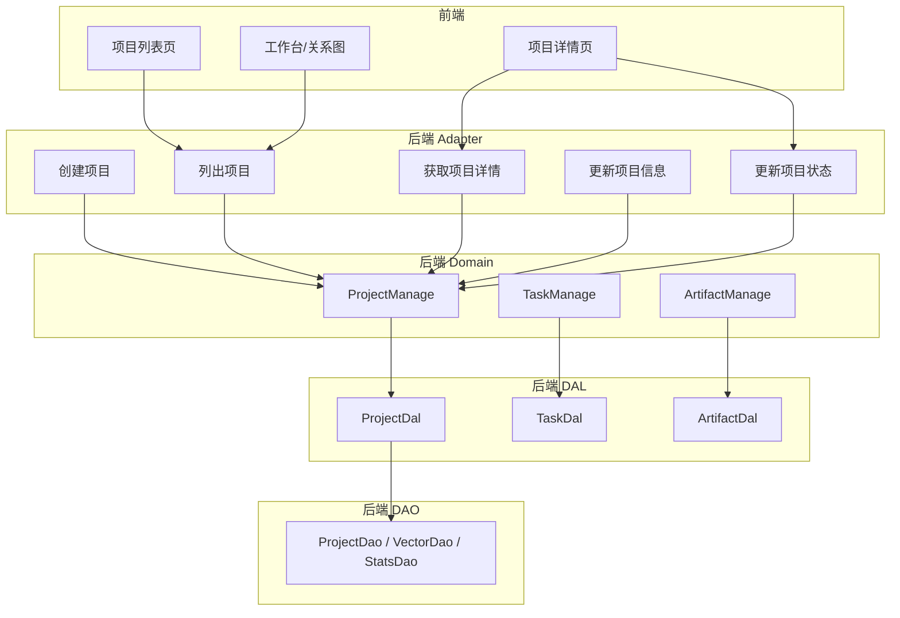
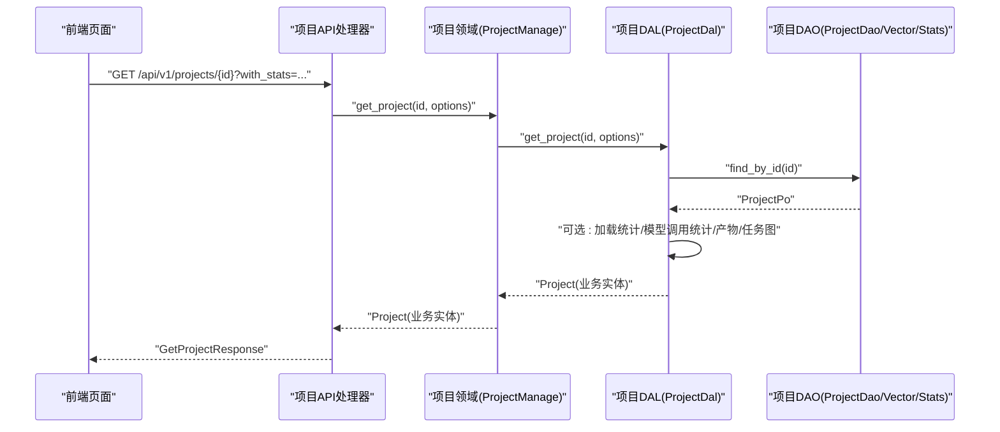
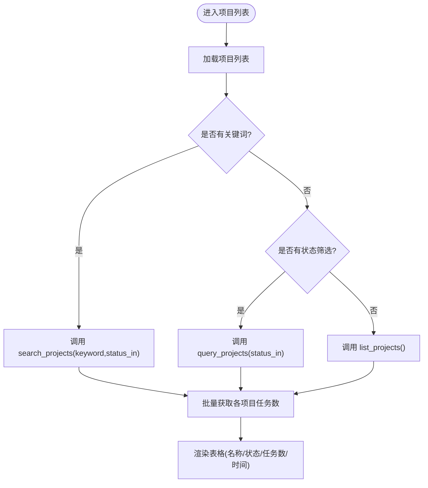
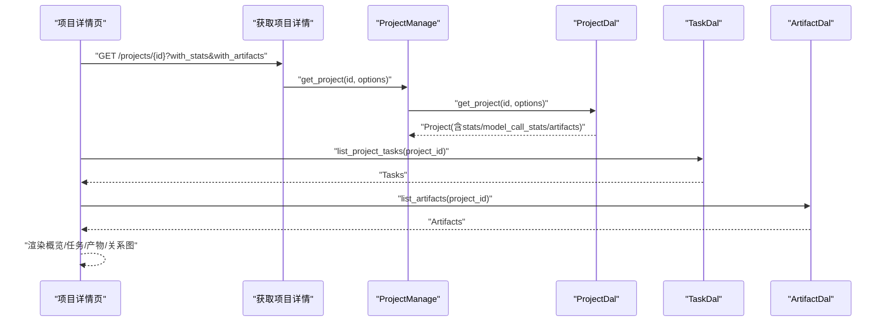
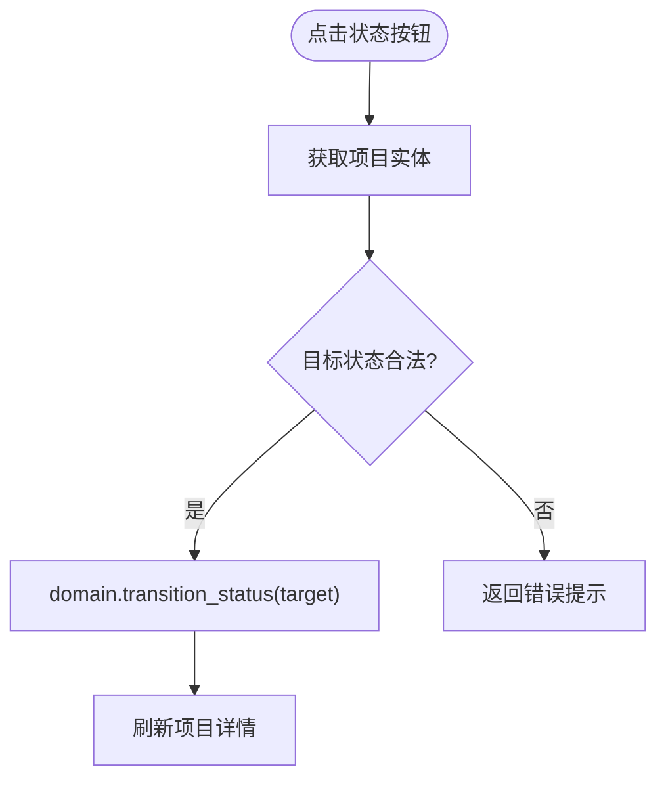
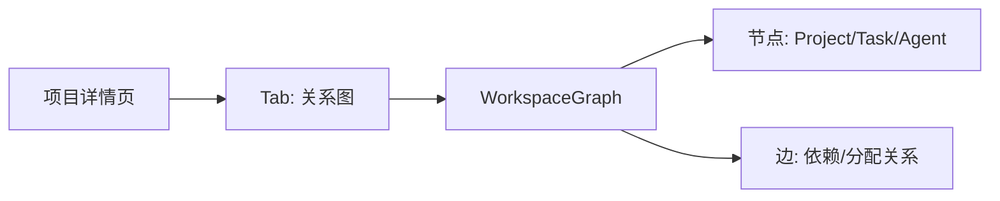
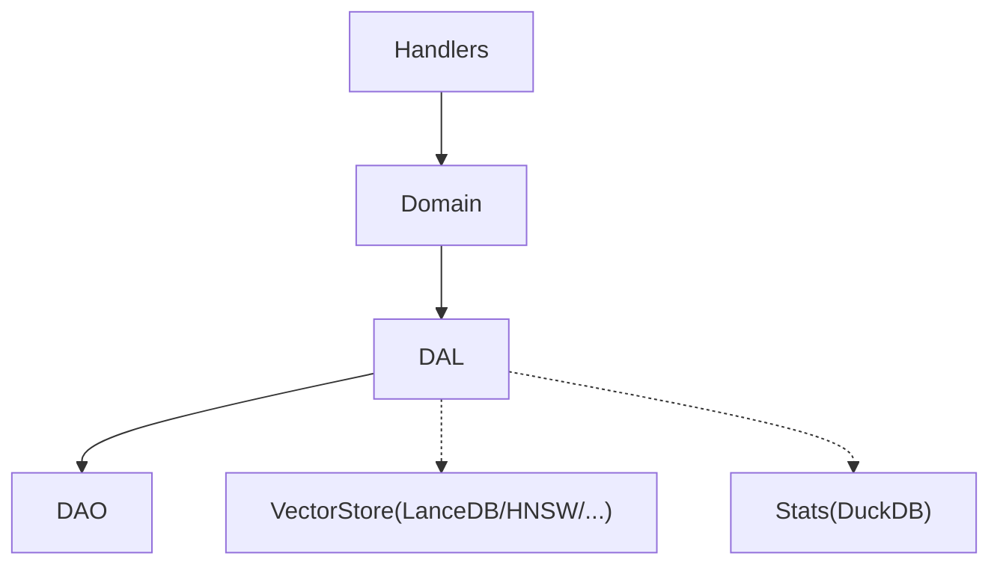

# 项目管理功能

<cite>
**本文引用的文件**
- [项目管理系统设计文档](file://docs/project_management_design.md)
- [项目设计文档](file://docs/project_design.md)
- [项目领域入口与接口定义](file://src/service/domain/project/mod.rs)
- [项目 DAL（含混合搜索、统计、向量索引）](file://src/service/dal/project.rs)
- [项目 DAO 接口（查询/搜索/统计/向量）](file://src/service/dao/project/mod.rs)
- [项目列表页前端实现](file://frontend/src/pages/project/projects.rs)
- [项目详情页前端实现](file://frontend/src/pages/project/project_detail.rs)
- [工作台 Canvas 关系图组件](file://frontend/src/components/workspace_graph.rs)
- [工作区页面（驾驶舱视图）](file://frontend/src/pages/workspace.rs)
- [项目状态工具函数](file://frontend/src/utils/status.rs)
- [项目管理 API Handler 模块入口](file://src/handlers/project/projects/mod.rs)
- [创建项目 Handler](file://src/handlers/project/projects/create_project.rs)
- [列出项目 Handler](file://src/handlers/project/projects/list_projects.rs)
- [获取项目详情 Handler](file://src/handlers/project/projects/get_project.rs)
- [更新项目基本信息 Handler](file://src/handlers/project/projects/update_project.rs)
- [更新项目状态 Handler](file://src/handlers/project/projects/update_project_status.rs)
</cite>

## 目录
1. [简介](#简介)
2. [项目结构](#项目结构)
3. [核心组件](#核心组件)
4. [架构总览](#架构总览)
5. [详细组件分析](#详细组件分析)
6. [依赖分析](#依赖分析)
7. [性能考虑](#性能考虑)
8. [故障排查指南](#故障排查指南)
9. [结论](#结论)
10. [附录](#附录)

## 简介
本文件面向“项目管理”能力，覆盖项目列表 CRUD、项目详情展示、状态管理、模板与批量操作、导出机制、看板布局与拖拽排序、实时数据更新与协作编辑、权限控制与成员管理、通知机制、工作流配置、自定义字段与标签系统。内容基于后端四层架构（Handler → Domain → DAL → DAO）与前端 Dioxus + Tailwind/DaisyUI 的实际实现进行说明，并给出关键流程图与时序图以辅助理解。

## 项目结构
本项目采用严格单向分层：Adapter（HTTP Handler）→ Domain → DAL → DAO；Domain 仅组合 DAL，不直接访问 DAO；DAL 对外返回业务实体（内部持有 PO），不在上层暴露 PO。项目相关代码主要分布在以下位置：
- 后端 API 层：src/handlers/project/projects/*
- 领域层：src/service/domain/project/*
- 数据访问层：src/service/dal/project.rs、src/service/dao/project/*
- 前端页面：frontend/src/pages/project/*、frontend/src/components/workspace_graph.rs、frontend/src/pages/workspace.rs

图表来源
- [项目领域入口与接口定义:91-226](file://src/service/domain/project/mod.rs#L91-L226)
- [项目 DAL（含混合搜索、统计、向量索引）:71-209](file://src/service/dal/project.rs#L71-L209)
- [项目 DAO 接口（查询/搜索/统计/向量）:12-147](file://src/service/dao/project/mod.rs#L12-L147)

章节来源
- [项目管理系统设计文档:11-37](file://docs/project_management_design.md#L11-L37)
- [项目设计文档:31-75](file://docs/project_design.md#L31-L75)

## 核心组件
- 项目列表页（CRUD 与筛选）
  - 支持创建项目、按关键词搜索、按状态筛选、分页加载、任务数统计。
  - 通过 list_projects、query_projects、search_projects 三个接口组合实现。
- 项目详情页（基本信息、关联任务、产物统计、活动日志）
  - 使用 get_project 附带 with_stats、with_model_call_stats、with_artifacts、with_progress_summary 等选项加载多维数据。
  - 提供任务列表、产物列表、关系图、状态管理（启动/完成/归档）。
- 领域层（Project/Task/Artifact 管理）
  - ProjectManage：创建、查询、搜索、统计、状态流转、基础信息更新。
  - TaskManage：创建、查询、搜索、统计、状态流转、进度更新。
  - ArtifactManage：创建（附件引用/生成内容）、查询、删除、内容读写。
- 数据访问层（DAL）
  - ProjectDal：封装 ProjectDao、向量索引维护、混合搜索（FTS5+向量）、统计聚合。
  - TaskDal/ArtifactDal：对应任务与产物的数据访问抽象。
- 数据持久化层（DAO）
  - ProjectDao：CRUD、分页、计数、全文检索（FTS5 BM25）。
  - ProjectVectorDao：向量索引 upsert/search/clear。
  - ProjectStatsDao：项目维度事件统计。

章节来源
- [项目领域入口与接口定义:91-226](file://src/service/domain/project/mod.rs#L91-L226)
- [项目 DAL（含混合搜索、统计、向量索引）:71-209](file://src/service/dal/project.rs#L71-L209)
- [项目 DAO 接口（查询/搜索/统计/向量）:12-147](file://src/service/dao/project/mod.rs#L12-L147)
- [项目列表页前端实现:1-283](file://frontend/src/pages/project/projects.rs#L1-L283)
- [项目详情页前端实现:1-800](file://frontend/src/pages/project/project_detail.rs#L1-L800)

## 架构总览
后端遵循 Handler → Domain → DAL → DAO 的单向调用链。Handler 只做参数校验与透传，Domain 负责业务规则（如状态流转、DAG 校验），DAL 负责数据访问与统计/向量索引维护，DAO 负责 SQL/存储细节。

图表来源
- [获取项目详情 Handler:21-53](file://src/handlers/project/projects/get_project.rs#L21-L53)
- [项目领域入口与接口定义:131-140](file://src/service/domain/project/mod.rs#L131-L140)
- [项目 DAL（含混合搜索、统计、向量索引）:281-319](file://src/service/dal/project.rs#L281-L319)

## 详细组件分析

### 项目列表页（创建、编辑、删除、搜索、筛选）
- 创建项目
  - 前端通过 create_project 提交名称、描述、优先级、标签、owner_agent_id（可选）。
  - 后端 create_project_handler 调用 domain().project_manage().create(...) 并返回详情。
- 列出项目
  - list_projects_handler 固定 root_user_id 为当前用户，排除已删除状态，支持分页。
- 搜索项目
  - search_projects_handler 调用 domain().project_manage().search(...)，支持关键词与状态过滤。
- 筛选项目
  - query_projects_handler 支持 status_in 等条件过滤，结合分页。
- 删除项目
  - 软删除通过状态流转至 Deleted（默认查询过滤），或归档至 Archived。
- 任务数统计
  - 前端在列表加载后对每个项目调用 list_project_tasks 统计任务数量，避免 N+1 查询。

图表来源
- [项目列表页前端实现:34-88](file://frontend/src/pages/project/projects.rs#L34-L88)
- [列出项目 Handler:20-43](file://src/handlers/project/projects/list_projects.rs#L20-L43)
- [项目领域入口与接口定义:160-179](file://src/service/domain/project/mod.rs#L160-L179)

章节来源
- [项目列表页前端实现:1-283](file://frontend/src/pages/project/projects.rs#L1-L283)
- [创建项目 Handler:10-46](file://src/handlers/project/projects/create_project.rs#L10-L46)
- [列出项目 Handler:11-43](file://src/handlers/project/projects/list_projects.rs#L11-L43)
- [项目领域入口与接口定义:111-179](file://src/service/domain/project/mod.rs#L111-L179)

### 项目详情视图（基本信息、关联任务、工件统计、活动日志）
- 基本信息
  - 名称、描述、状态、优先级、标签、创建时间。
- 关联任务
  - 通过 list_project_tasks 获取任务列表，支持开始/完成等操作。
- 工件统计
  - 通过 get_project(with_artifacts=true) 合并产物列表；支持新增/删除产物。
- 活动日志/统计
  - 通过 get_project(with_stats=true, with_model_call_stats=true) 加载项目事件统计与模型调用统计。
- 关系图
  - 使用 WorkspaceGraph 展示 Project ↔ Task ↔ Agent 的关系。

图表来源
- [获取项目详情 Handler:21-53](file://src/handlers/project/projects/get_project.rs#L21-L53)
- [项目领域入口与接口定义:131-140](file://src/service/domain/project/mod.rs#L131-L140)
- [项目 DAL（含混合搜索、统计、向量索引）:281-319](file://src/service/dal/project.rs#L281-L319)
- [项目详情页前端实现:68-129](file://frontend/src/pages/project/project_detail.rs#L68-L129)

章节来源
- [项目详情页前端实现:1-800](file://frontend/src/pages/project/project_detail.rs#L1-L800)
- [项目领域入口与接口定义:131-140](file://src/service/domain/project/mod.rs#L131-L140)
- [项目 DAL（含混合搜索、统计、向量索引）:281-319](file://src/service/dal/project.rs#L281-L319)

### 项目状态管理（进行中、已完成、已暂停/归档）
- 统一状态流转入口
  - update_project_status_handler 先获取项目实体，再调用 domain().project_manage().transition_status(ctx, &mut project, target_status)。
- 状态枚举
  - 项目状态包含 Active、InProgress、Completed、Archived、Deleted（软删除，默认查询过滤）。
- 前端按钮
  - 根据当前状态显示“启动/完成/归档”按钮，调用 update_project_status 并刷新详情。

图表来源
- [更新项目状态 Handler:21-42](file://src/handlers/project/projects/update_project_status.rs#L21-L42)
- [项目设计文档:31-43](file://docs/project_design.md#L31-L43)
- [项目详情页前端实现:131-216](file://frontend/src/pages/project/project_detail.rs#L131-L216)

章节来源
- [更新项目状态 Handler:1-43](file://src/handlers/project/projects/update_project_status.rs#L1-L43)
- [项目设计文档:31-43](file://docs/project_design.md#L31-L43)
- [项目详情页前端实现:131-216](file://frontend/src/pages/project/project_detail.rs#L131-L216)

### 项目模板系统、批量操作与导出机制
- 模板系统
  - 当前仓库未提供专用“项目模板”实体或 API；可通过执行计划（execution_plan）与标签（tags）表达模板化流程与分类。
- 批量操作
  - 列表页支持批量筛选（status_in）与分页；批量创建/更新需扩展 Domain/DAL 接口。
- 导出机制
  - 当前未见独立导出 API；可复用 list/query/search 接口导出数据集，结合前端导出逻辑实现。

章节来源
- [项目领域入口与接口定义:204-226](file://src/service/domain/project/mod.rs#L204-L226)
- [项目列表页前端实现:34-88](file://frontend/src/pages/project/projects.rs#L34-L88)

### 项目看板布局、拖拽排序、实时数据更新与协作编辑
- 看板布局
  - 项目详情页提供“关系图”Tab，使用 WorkspaceGraph 可视化 Project ↔ Task ↔ Agent 关系。
- 拖拽排序
  - 当前实现未包含看板拖拽排序；如需扩展可在 WorkspaceGraph 中增加拖拽交互与顺序持久化。
- 实时数据更新
  - 前端通过信号（Signal）与异步刷新实现局部更新（如任务状态变更后重新拉取任务列表）。
- 协作编辑
  - 当前未见多人实时协作机制；可通过消息通道与 SSE/WS 扩展实现。

图表来源
- [项目详情页前端实现:671-688](file://frontend/src/pages/project/project_detail.rs#L671-L688)
- [工作台 Canvas 关系图组件:278-629](file://frontend/src/components/workspace_graph.rs#L278-L629)

章节来源
- [项目详情页前端实现:671-688](file://frontend/src/pages/project/project_detail.rs#L671-L688)
- [工作台 Canvas 关系图组件:278-629](file://frontend/src/components/workspace_graph.rs#L278-L629)

### 权限控制、成员管理与通知机制
- 权限控制
  - 列表与查询默认按 root_user_id 过滤，确保用户只能看到自己的项目；系统级查询（如 InProgress 且 owner_agent_id 非空）用于调度场景。
- 成员管理
  - 项目归属 root_user_id；任务可分配给 Agent（assignee_type=1）或其他类型；详情页批量加载关联 Agent。
- 通知机制
  - 项目跟进与任务调度通知通过消息通道与 Cron Trigger 触发；详见 agent_loop_engine_plan 中的通知构建与响应规范。

章节来源
- [项目 DAL（含混合搜索、统计、向量索引）:124-130](file://src/service/dal/project.rs#L124-L130)
- [项目详情页前端实现:95-123](file://frontend/src/pages/project/project_detail.rs#L95-L123)
- [agent_loop_engine_plan:64-113](file://docs/agent_loop_engine_plan.md#L64-L113)

### 项目工作流配置、自定义字段与标签系统
- 工作流配置
  - 通过 execution_plan 与 execution_result 记录项目执行计划与结果；任务支持 dependencies（DAG）与 due_at。
- 自定义字段
  - 当前模型字段固定；可扩展 DAL/DAO 增加自定义字段映射。
- 标签系统
  - 项目与任务均支持 tags 字段，用于分类与筛选；前端以标签列表展示。

章节来源
- [项目领域入口与接口定义:204-226](file://src/service/domain/project/mod.rs#L204-L226)
- [项目领域入口与接口定义:249-332](file://src/service/domain/project/mod.rs#L249-L332)
- [项目列表页前端实现:136-196](file://frontend/src/pages/project/projects.rs#L136-L196)

## 依赖分析
- 组件耦合
  - Handler 仅依赖 Domain；Domain 仅依赖 DAL；DAL 依赖 DAO。
- 外部依赖
  - FTS5 全文检索、向量搜索（LanceDB/HNSW/InMemory/SqliteVss）、DuckDB 统计。
- 循环依赖
  - 无同层互调，严格单向调用。

图表来源
- [项目领域入口与接口定义:91-226](file://src/service/domain/project/mod.rs#L91-L226)
- [项目 DAL（含混合搜索、统计、向量索引）:71-209](file://src/service/dal/project.rs#L71-L209)
- [项目 DAO 接口（查询/搜索/统计/向量）:12-147](file://src/service/dao/project/mod.rs#L12-L147)

章节来源
- [项目管理系统设计文档:11-37](file://docs/project_management_design.md#L11-L37)

## 性能考虑
- 避免 N+1 查询
  - 列表页批量加载任务数；详情页批量加载关联 Agent。
- 混合搜索优化
  - FTS5 关键词 + 向量语义搜索，距离阈值过滤，结果去重与统一排序。
- 向量索引维护
  - 创建/更新时自动维护向量索引，失败降级不影响主流程；归档时清理索引。
- 统计聚合
  - 项目维度事件统计与模型调用统计按需加载，减少不必要开销。

章节来源
- [项目 DAL（含混合搜索、统计、向量索引）:225-274](file://src/service/dal/project.rs#L225-L274)
- [项目 DAL（含混合搜索、统计、向量索引）:490-703](file://src/service/dal/project.rs#L490-L703)
- [项目列表页前端实现:74-83](file://frontend/src/pages/project/projects.rs#L74-L83)
- [项目详情页前端实现:95-123](file://frontend/src/pages/project/project_detail.rs#L95-L123)

## 故障排查指南
- 项目不存在
  - get_project 若未找到返回 not_found；检查 ID 与权限。
- 状态流转失败
  - transition_status 校验目标状态合法性；检查当前状态与目标状态是否允许。
- 向量搜索降级
  - 向量搜索失败会降级到关键词搜索；检查 Embedding Provider 配置。
- 统计加载失败
  - 统计接口异常不影响主流程；检查 DuckDB 与事件表。

章节来源
- [获取项目详情 Handler:44-53](file://src/handlers/project/projects/get_project.rs#L44-L53)
- [更新项目状态 Handler:25-42](file://src/handlers/project/projects/update_project_status.rs#L25-L42)
- [项目 DAL（含混合搜索、统计、向量索引）:502-558](file://src/service/dal/project.rs#L502-L558)

## 结论
项目管理功能围绕 Project/Task/Artifact 三要素构建，采用严格分层与单一职责原则，提供完整的 CRUD、搜索、筛选、状态流转、统计与可视化能力。前端通过 Dioxus + Tailwind/DaisyUI 实现高效交互，后端通过 FTS5+向量混合搜索与统计聚合提升检索与分析能力。后续可扩展模板系统、批量操作、导出机制、看板拖拽与实时协作。

## 附录
- 项目状态文本与徽章样式
  - 前端 utils/status.rs 提供项目状态文本与徽章 class 映射。
- 工作台驾驶舱
  - workspace.rs 提供三栏布局与汇总状态条，Canvas 关系图展示运行时状态。

章节来源
- [项目状态工具函数:40-85](file://frontend/src/utils/status.rs#L40-L85)
- [工作区页面（驾驶舱视图）:20-60](file://frontend/src/pages/workspace.rs#L20-L60)