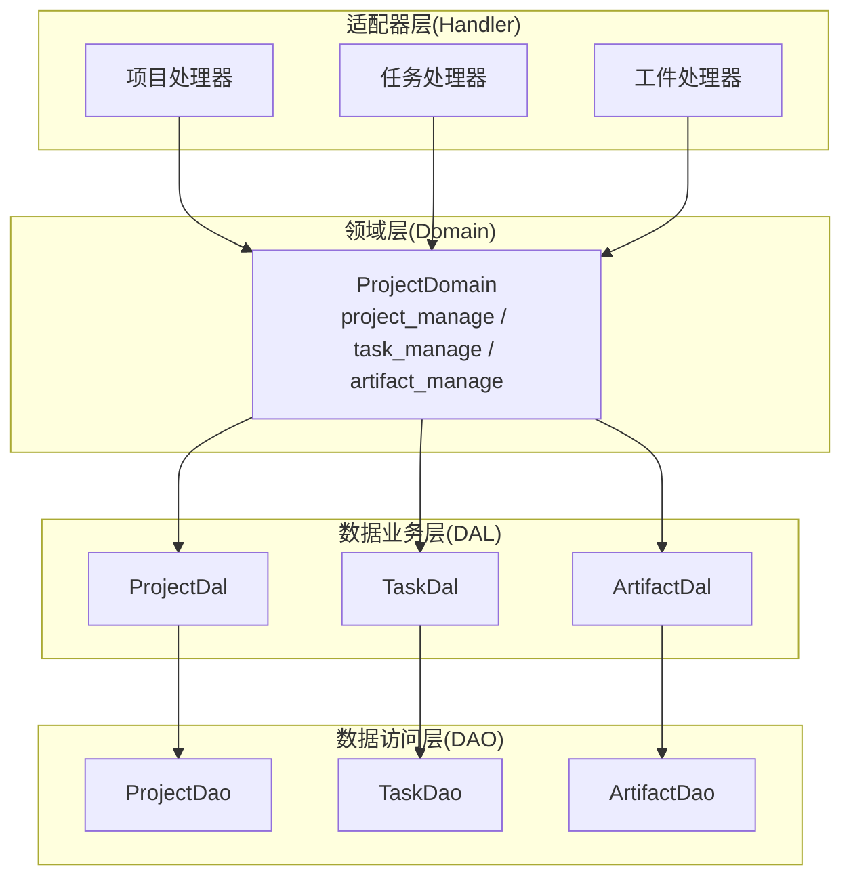
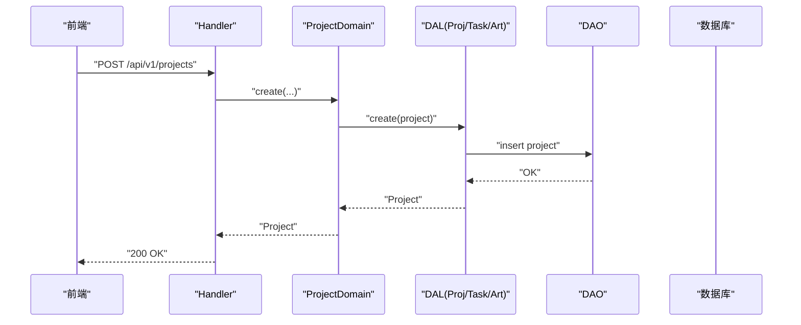
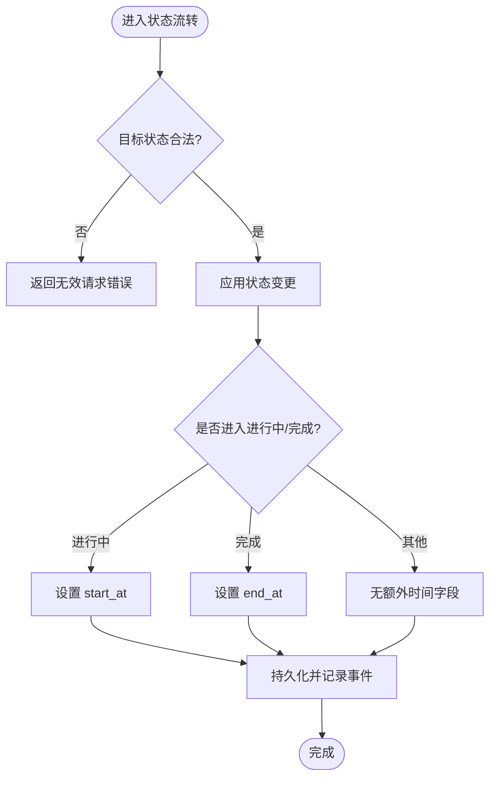
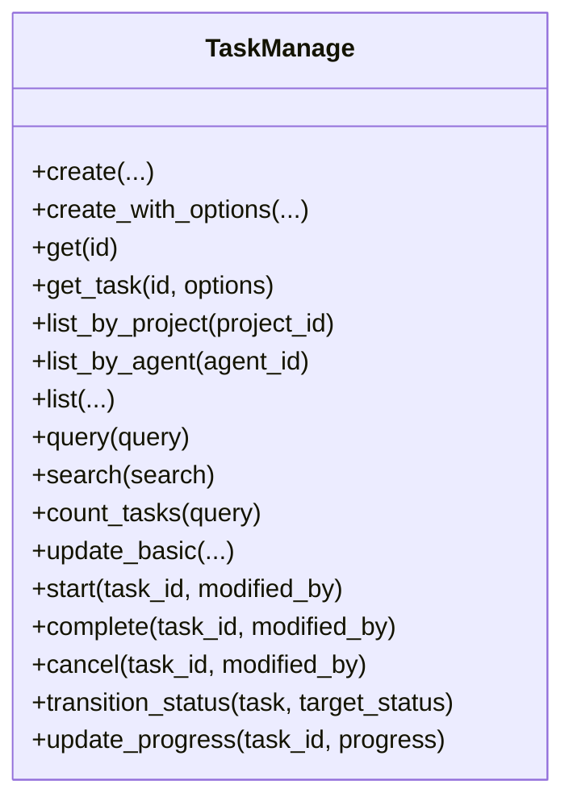
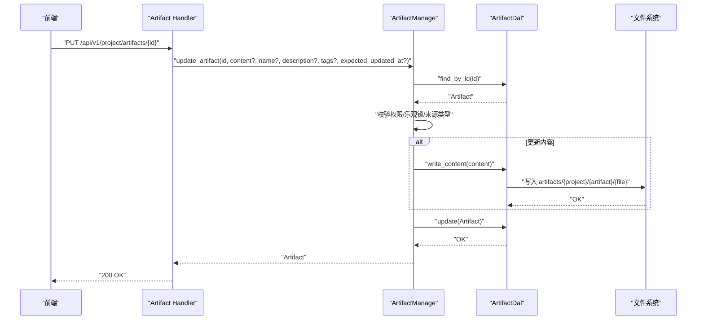
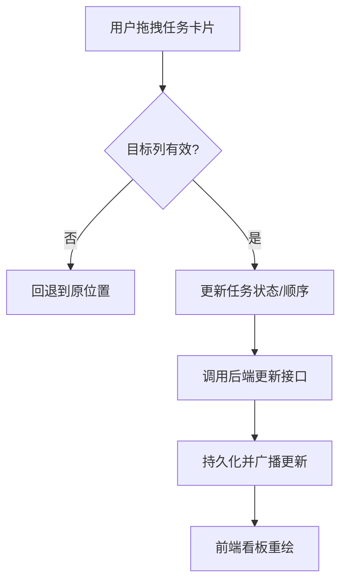
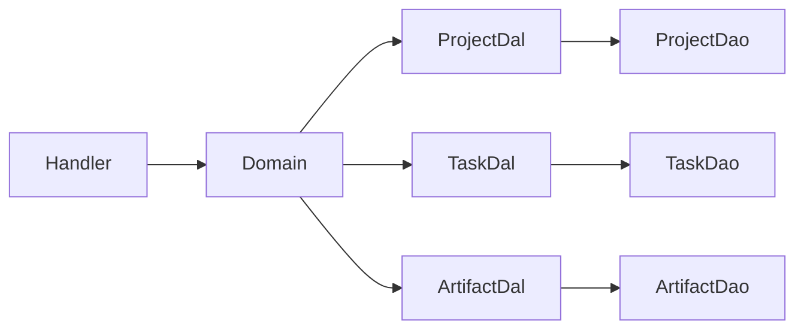

# 项目管理页面

<cite>
**本文引用的文件**
- [项目管理系统设计文档](file://docs/project_management_design.md)
- [领域入口与接口定义](file://src/service/domain/project/mod.rs)
- [任务业务实现](file://src/service/domain/project/task.rs)
- [产物业务实现](file://src/service/domain/project/artifact.rs)
- [项目状态枚举](file://common/src/enums/project.rs)
- [任务与指派类型枚举](file://common/src/enums/task.rs)
- [后端路由模块入口](file://src/handlers/project/mod.rs)
- [前端项目列表页](file://frontend/src/pages/project/projects.rs)
- [看板画布组件](file://frontend/src/components/kanban_canvas.rs)
</cite>

## 目录
1. [简介](#简介)
2. [项目结构](#项目结构)
3. [核心组件](#核心组件)
4. [架构总览](#架构总览)
5. [详细组件分析](#详细组件分析)
6. [依赖关系分析](#依赖关系分析)
7. [性能考量](#性能考量)
8. [故障排查指南](#故障排查指南)
9. [结论](#结论)
10. [附录](#附录)

## 简介
本模块为项目管理页面的全栈能力说明，覆盖项目 CRUD、任务管理（分配、进度、状态流转）、工件管理（代码文件、文档资源、版本控制）、项目详情视图（概览、关联关系、活动日志），以及看板布局、拖拽排序、实时进度更新与协作编辑等。同时记录工作流引擎、任务依赖解析、工件版本管理与变更历史追踪，并包含团队协作、权限控制、通知机制、模板、批量操作与导出能力的落地方案与扩展点。

## 项目结构
本项目采用严格四层单向调用：Adapter（HTTP Handler）→ Domain → DAL → DAO；Domain 层聚合 Project/Task/Artifact 三个子域，统一对外暴露管理能力；Handler 仅调用 Domain，不直接访问 DAL/DAO；DAL 负责 PO 与业务实体转换；DAO 专注持久化。

图表来源
- [领域入口与接口定义](file://src/service/domain/project/mod.rs)
- [后端路由模块入口](file://src/handlers/project/mod.rs)

章节来源
- [项目管理系统设计文档:1-10](file://docs/project_management_design.md#L1-L10)
- [领域入口与接口定义:63-105](file://src/service/domain/project/mod.rs#L63-L105)
- [后端路由模块入口:1-6](file://src/handlers/project/mod.rs#L1-L6)

## 核心组件
- 项目领域（Project Domain）
  - 统一管理项目、任务、工件的创建、查询、更新、删除与状态流转。
  - 提供统一的 transition_status 入口，确保状态机一致性与审计事件记录。
- 任务管理（Task Manage）
  - 支持创建、更新、开始/完成/取消、进度更新、按项目/指派者/状态查询与搜索。
  - 内置状态机校验，禁止非法流转；Cancelled 视为软删除，默认查询过滤。
- 工件管理（Artifact Manage）
  - 支持 Attachment 引用型与 GeneratedContent 文本内容创建、读取、部分更新与删除。
  - 严格的权限校验（root_user_id）与乐观锁（expected_updated_at）。
- 前端页面与可视化
  - 项目列表页支持筛选、搜索、创建项目与任务数统计。
  - 看板 Canvas 渲染多列泳道、优先级颜色编码、进度条与 HUD 风格背景。

章节来源
- [领域入口与接口定义:91-226](file://src/service/domain/project/mod.rs#L91-L226)
- [任务业务实现:18-114](file://src/service/domain/project/task.rs#L18-L114)
- [产物业务实现:26-125](file://src/service/domain/project/artifact.rs#L26-L125)
- [前端项目列表页:19-93](file://frontend/src/pages/project/projects.rs#L19-L93)
- [看板画布组件:19-56](file://frontend/src/components/kanban_canvas.rs#L19-L56)

## 架构总览
系统遵循“严格分层、单一职责、实体优先参数传递、避免 N+1 查询”的设计原则。所有跨层调用通过 RequestContext 传递上下文，使用 ctx.clone() 避免所有权问题。写操作接收实体，读操作接收 ID/参数，减少重复查询。

图表来源
- [领域入口与接口定义:111-129](file://src/service/domain/project/mod.rs#L111-L129)
- [项目管理系统设计文档:34-53](file://docs/project_management_design.md#L34-L53)

章节来源
- [项目管理系统设计文档:138-217](file://docs/project_management_design.md#L138-L217)
- [领域入口与接口定义:200-216](file://src/service/domain/project/mod.rs#L200-L216)

## 详细组件分析

### 项目 CRUD 与状态管理
- 项目创建：Handler 调用 Domain::project_manage().create(...)，生成项目实体并持久化。
- 项目查询：支持 list/query/search/count，query 用于条件过滤，search 用于语义相关性检索。
- 项目更新：update_basic 支持 name/description/priority/tags/execution_plan/execution_result 的部分更新。
- 项目状态流转：start/complete/archive 内部调用 transition_status，保证状态合法性与审计事件。

图表来源
- [任务业务实现:394-482](file://src/service/domain/project/task.rs#L394-L482)
- [领域入口与接口定义:184-226](file://src/service/domain/project/mod.rs#L184-L226)

章节来源
- [领域入口与接口定义:111-226](file://src/service/domain/project/mod.rs#L111-L226)
- [项目状态枚举:8-27](file://common/src/enums/project.rs#L8-L27)

### 任务管理（分配、进度跟踪、状态流转）
- 任务分配：创建时指定 assignee_type（User/Agent）与 assignee_id；支持按项目/指派者/状态查询。
- 进度跟踪：update_progress 更新 0-100 进度，并记录事件。
- 状态流转：transition_status 强制校验允许的状态转移；Cancelled 走专用取消流程，默认查询过滤已取消任务。

图表来源
- [领域入口与接口定义:228-359](file://src/service/domain/project/mod.rs#L228-L359)
- [任务业务实现:18-526](file://src/service/domain/project/task.rs#L18-L526)

章节来源
- [任务业务实现:21-114](file://src/service/domain/project/task.rs#L21-L114)
- [任务业务实现:227-392](file://src/service/domain/project/task.rs#L227-L392)
- [任务业务实现:394-526](file://src/service/domain/project/task.rs#L394-L526)
- [任务与指派类型枚举:8-27](file://common/src/enums/task.rs#L8-L27)
- [任务与指派类型枚举:61-87](file://common/src/enums/task.rs#L61-L87)

### 工件管理（代码文件、文档资源、版本控制）
- 工件来源：Attachment 引用型（Batch 3.1 已落地）与 GeneratedContent（预留与后续完善）。
- 创建：create_attachment_artifact / create_project_artifact / create_task_artifact / create_generated_artifact / create_generated_artifact_from_file。
- 读取：get/get_artifact_content/read_content，仅 GeneratedContent 支持直接内容读取。
- 更新：update_artifact 支持 content/name/description/tags 的部分更新，带乐观锁 expected_updated_at。
- 删除：delete 软删除。

图表来源
- [产物业务实现:273-340](file://src/service/domain/project/artifact.rs#L273-L340)
- [产物业务实现:342-486](file://src/service/domain/project/artifact.rs#L342-L486)
- [项目管理系统设计文档:332-407](file://docs/project_management_design.md#L332-L407)

章节来源
- [产物业务实现:26-125](file://src/service/domain/project/artifact.rs#L26-L125)
- [产物业务实现:127-222](file://src/service/domain/project/artifact.rs#L127-L222)
- [产物业务实现:224-340](file://src/service/domain/project/artifact.rs#L224-L340)
- [产物业务实现:342-486](file://src/service/domain/project/artifact.rs#L342-L486)
- [项目管理系统设计文档:73-107](file://docs/project_management_design.md#L73-L107)

### 项目详情视图（概览信息、关联关系、活动日志）
- 概览信息：项目基础字段、状态、任务数、工件数、进度百分比等通过 Domain 方法实时计算。
- 关联关系：Project → Tasks → Artifacts 单向持有链，便于详情聚合。
- 活动日志：任务与工件的关键操作均记录事件（创建、开始、完成、取消、进度更新、状态变更等）。

章节来源
- [项目管理系统设计文档:109-135](file://docs/project_management_design.md#L109-L135)
- [任务业务实现:88-108](file://src/service/domain/project/task.rs#L88-L108)
- [任务业务实现:294-315](file://src/service/domain/project/task.rs#L294-L315)
- [任务业务实现:335-356](file://src/service/domain/project/task.rs#L335-L356)
- [任务业务实现:371-392](file://src/service/domain/project/task.rs#L371-L392)
- [任务业务实现:461-480](file://src/service/domain/project/task.rs#L461-L480)
- [任务业务实现:503-523](file://src/service/domain/project/task.rs#L503-L523)

### 看板布局、任务拖拽排序、实时进度更新与协作编辑
- 看板布局：KanbanCanvas 渲染多列泳道，每列代表一个任务状态，卡片显示标题、优先级徽章与进度条。
- 拖拽排序：当前组件以展示为主，点击命中检测简化；可扩展基于 HTML5 Drag & Drop 或 Pointer Events 实现列内与列间拖拽。
- 实时进度更新：前端通过 update_progress 接口轮询或 SSE 推送更新任务进度，看板重绘刷新进度条。
- 协作编辑：工件内容更新使用乐观锁防止覆盖；可结合 SSE/WS 实现多人协同编辑提示与冲突解决。

图表来源
- [看板画布组件:19-56](file://frontend/src/components/kanban_canvas.rs#L19-L56)
- [看板画布组件:140-244](file://frontend/src/components/kanban_canvas.rs#L140-L244)
- [任务业务实现:484-526](file://src/service/domain/project/task.rs#L484-L526)

章节来源
- [看板画布组件:19-56](file://frontend/src/components/kanban_canvas.rs#L19-L56)
- [看板画布组件:140-244](file://frontend/src/components/kanban_canvas.rs#L140-L244)
- [任务业务实现:484-526](file://src/service/domain/project/task.rs#L484-L526)

### 项目工作流引擎、任务依赖关系解析、工件版本管理与变更历史追踪
- 工作流引擎：Project Domain 作为编排层，承载 Agent 思考循环与工具调用；任务状态机驱动流程推进。
- 任务依赖解析：支持 dependencies 字段存储依赖关系；可在 Domain 层实现 DAG 校验（环形检测）与拓扑排序。
- 工件版本管理：当前批次未引入独立 version 字段，可通过 name/description/tags 表达版本；后续可扩展强版本能力。
- 变更历史追踪：关键操作均记录事件（TaskEvent），可用于审计与回溯。

章节来源
- [项目管理系统设计文档:256-331](file://docs/project_management_design.md#L256-L331)
- [项目管理系统设计文档:501-533](file://docs/project_management_design.md#L501-L533)
- [任务业务实现:227-279](file://src/service/domain/project/task.rs#L227-L279)
- [任务业务实现:394-482](file://src/service/domain/project/task.rs#L394-L482)

### 团队协作、权限控制与通知机制
- 权限控制：Domain 层对工件访问进行 root_user_id 校验；任务/工件操作需具备项目访问权限。
- 通知机制：任务状态变更、进度更新等操作记录事件，可接入消息通道或 SSE 推送至前端。
- 协作编辑：工件内容更新使用乐观锁；可结合前端并发编辑策略（如 OT/CRDT）提升协作体验。

章节来源
- [产物业务实现:489-531](file://src/service/domain/project/artifact.rs#L489-L531)
- [任务业务实现:294-315](file://src/service/domain/project/task.rs#L294-L315)
- [任务业务实现:335-356](file://src/service/domain/project/task.rs#L335-L356)
- [任务业务实现:371-392](file://src/service/domain/project/task.rs#L371-L392)
- [任务业务实现:461-480](file://src/service/domain/project/task.rs#L461-L480)
- [任务业务实现:503-523](file://src/service/domain/project/task.rs#L503-L523)

### 项目模板、批量操作与导出功能
- 项目模板：可在 Domain 层提供模板化创建（预设名称、描述、标签、执行计划等），快速初始化项目。
- 批量操作：在 Domain/DAL 层提供批量更新状态、批量归档/恢复等方法，结合事务保证一致性。
- 导出功能：支持将项目任务、工件元数据导出为 CSV/JSON，便于离线分析与归档。

[本节为概念性说明，不直接分析具体文件]

## 依赖关系分析
- 组件耦合与内聚
  - Domain 层高内聚：ProjectDomainImpl 组合 ProjectDal/TaskDal/ArtifactDal，职责清晰。
  - Handler 低耦合：仅依赖 Domain，不感知 DAL/DAO 细节。
- 外部依赖与集成点
  - 数据库：SQLite（sqlx 离线查询缓存）。
  - 全文搜索：FTS5 + trigram。
  - 向量搜索：LanceDB 默认，支持降级。
- 潜在循环依赖
  - 严格单向调用避免循环；Domain 不调用 DAO，DAL 仅做转换。

图表来源
- [领域入口与接口定义:500-539](file://src/service/domain/project/mod.rs#L500-L539)
- [后端路由模块入口:1-6](file://src/handlers/project/mod.rs#L1-L6)

章节来源
- [领域入口与接口定义:500-539](file://src/service/domain/project/mod.rs#L500-L539)
- [项目管理系统设计文档:163-217](file://docs/project_management_design.md#L163-L217)

## 性能考量
- 避免 N+1 查询：写操作接收实体，读操作接收 ID/参数，减少重复查询。
- 分页与过滤：query/search 支持分页与完整过滤条件，降低数据传输量。
- 实时计算：项目统计数据通过方法实时计算，避免冗余统计结构体。
- 前端渲染：看板 Canvas 使用 requestAnimationFrame 优化绘制；按需重绘减少开销。

章节来源
- [项目管理系统设计文档:138-160](file://docs/project_management_design.md#L138-L160)
- [项目管理系统设计文档:124-135](file://docs/project_management_design.md#L124-L135)
- [看板画布组件:68-116](file://frontend/src/components/kanban_canvas.rs#L68-L116)

## 故障排查指南
- 常见错误
  - 非法状态流转：检查 current_status 与 target_status 是否在允许集合中。
  - 权限不足：确认 root_user_id 匹配与项目访问权限。
  - 乐观锁冲突：expected_updated_at 不匹配时返回冲突，提示重新加载。
  - 工件内容类型限制：仅 GeneratedContent 支持直接内容读取/更新。
- 调试建议
  - 查看事件记录（TaskEvent）定位状态变更与操作人。
  - 检查 DAL/DAO 返回实体与 PO 字段映射是否正确。
  - 前端网络请求与响应码，结合 toast 提示定位失败原因。

章节来源
- [任务业务实现:394-433](file://src/service/domain/project/task.rs#L394-L433)
- [产物业务实现:224-271](file://src/service/domain/project/artifact.rs#L224-L271)
- [产物业务实现:273-340](file://src/service/domain/project/artifact.rs#L273-L340)
- [前端项目列表页:95-125](file://frontend/src/pages/project/projects.rs#L95-L125)

## 结论
项目管理页面模块以严格分层架构为基础，实现了项目、任务、工件的全生命周期管理，并提供看板可视化、实时进度更新与协作编辑能力。通过统一的状态流转、权限校验与事件记录，确保了业务一致性与可追溯性。未来可进一步扩展任务依赖 DAG、工件版本管理与批量操作能力，以提升团队协作效率与管理灵活性。

## 附录
- API 参考
  - 项目：POST/GET/PUT /api/v1/projects，状态更新 /status。
  - 任务：POST/GET/PUT /api/v1/tasks，状态更新 /status，进度更新 /progress。
  - 工件：POST/GET/PUT/DELETE /api/v1/project/artifacts，内容读取 /content。
- 前端页面
  - 项目列表页：筛选、搜索、创建项目与任务数统计。
  - 看板组件：多列泳道、优先级颜色、进度条与 HUD 风格背景。

章节来源
- [项目管理系统设计文档:34-107](file://docs/project_management_design.md#L34-L107)
- [前端项目列表页:19-93](file://frontend/src/pages/project/projects.rs#L19-L93)
- [看板画布组件:19-56](file://frontend/src/components/kanban_canvas.rs#L19-L56)