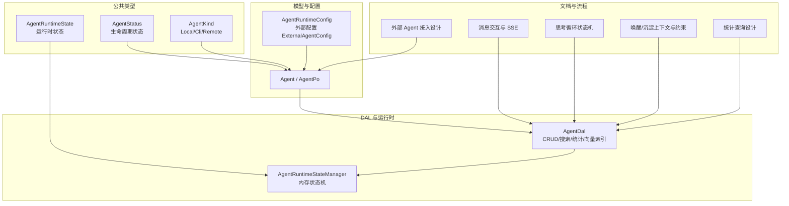
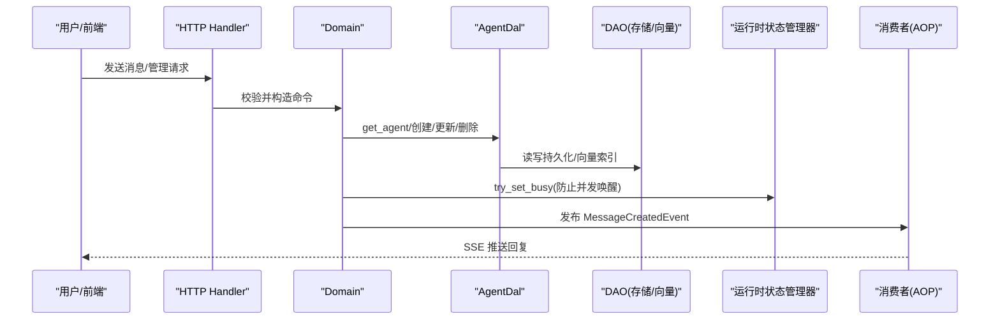
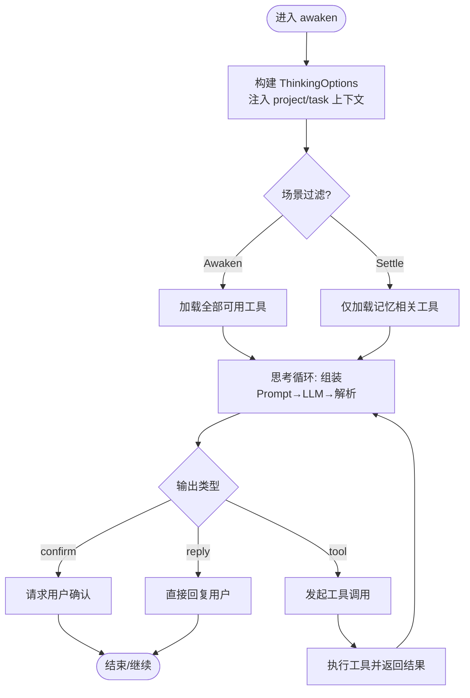
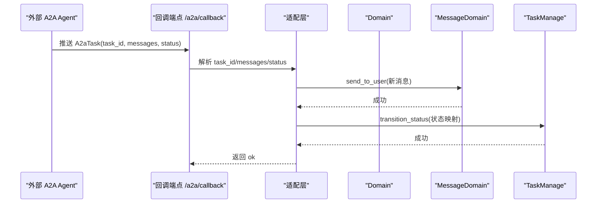
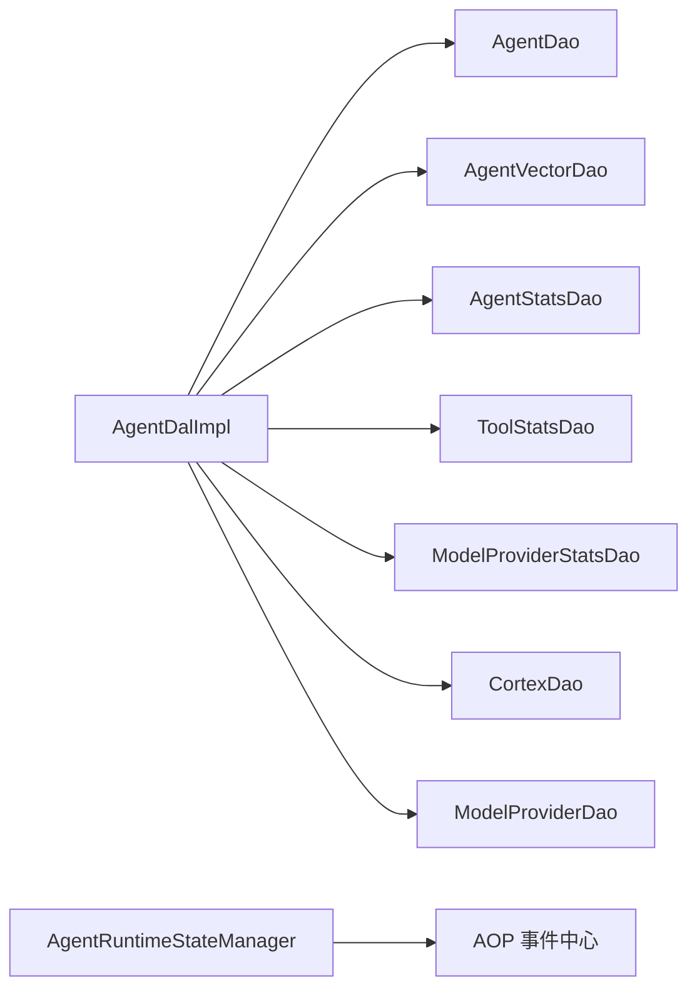

# AI Agent 管理

<cite>
**本文引用的文件**
- [agent.rs](file://common/src/enums/agent.rs)
- [agent_kind.rs](file://common/src/enums/agent_kind.rs)
- [agent.rs](file://src/models/agent.rs)
- [agent.rs](file://src/service/dal/agent.rs)
- [external_agent_design.md](file://docs/external_agent_design.md)
- [message_interaction_design.md](file://docs/message_interaction_design.md)
- [project_management_design.md](file://docs/project_management_design.md)
- [awaken_context_and_sleep_constraint.md](file://docs/superpowers/plans/2026-07-31-awaken-context-and-sleep-constraint.md)
- [stats_query_design.md](file://docs/stats_query_design.md)
- [agent_runtime_state.rs](file://src/pkg/agent_runtime_state.rs)
</cite>

## 目录
1. [简介](#简介)
2. [项目结构](#项目结构)
3. [核心组件](#核心组件)
4. [架构总览](#架构总览)
5. [详细组件分析](#详细组件分析)
6. [依赖关系分析](#依赖关系分析)
7. [性能考量](#性能考量)
8. [故障排查指南](#故障排查指南)
9. [结论](#结论)
10. [附录](#附录)

## 简介
本文件面向“AI Agent 管理”能力，系统性说明 Agent 的完整生命周期（创建、配置、启动、停止、监控、销毁）、状态机设计、唤醒机制、思考循环、记忆系统、技能与工具绑定、Agent 类型分类（内部/外部）、Agent 间通信与 A2A 协议集成，以及配置模板、技能包管理、工具绑定示例、性能监控、日志追踪与调试方法。内容基于仓库中的领域模型、DAL/DOMAIN 实现与相关设计文档整理而成。

## 项目结构
围绕 Agent 管理的代码主要分布在以下位置：
- 枚举与类型定义：common/src/enums/agent.rs、common/src/enums/agent_kind.rs
- 业务实体与运行时配置：src/models/agent.rs
- DAL 层（数据访问与装配）：src/service/dal/agent.rs
- 运行时状态管理：src/pkg/agent_runtime_state.rs
- 设计与流程文档：docs/external_agent_design.md、docs/message_interaction_design.md、docs/project_management_design.md、docs/superpowers/plans/2026-07-31-awaken-context-and-sleep-constraint.md、docs/stats_query_design.md



图表来源
- [agent.rs:8-78](file://common/src/enums/agent.rs#L8-L78)
- [agent_kind.rs:8-80](file://common/src/enums/agent_kind.rs#L8-L80)
- [agent.rs:15-167](file://src/models/agent.rs#L15-L167)
- [agent.rs:186-328](file://src/models/agent.rs#L186-L328)
- [agent.rs:330-553](file://src/models/agent.rs#L330-L553)
- [agent.rs:100-193](file://src/service/dal/agent.rs#L100-L193)
- [agent_runtime_state.rs:11-132](file://src/pkg/agent_runtime_state.rs#L11-L132)

章节来源
- [agent.rs:8-78](file://common/src/enums/agent.rs#L8-L78)
- [agent_kind.rs:8-80](file://common/src/enums/agent_kind.rs#L8-L80)
- [agent.rs:15-167](file://src/models/agent.rs#L15-L167)
- [agent.rs:186-328](file://src/models/agent.rs#L186-L328)
- [agent.rs:330-553](file://src/models/agent.rs#L330-L553)
- [agent.rs:100-193](file://src/service/dal/agent.rs#L100-L193)
- [agent_runtime_state.rs:11-132](file://src/pkg/agent_runtime_state.rs#L11-L132)

## 核心组件
- Agent 生命周期状态：Interviewing → PendingOnboard → Onboarded → PendingOffboard → Offboarded（含 Deleted 软删除）
- 运行时状态：Idle/Resting/Busy（纯内存，服务重启重置）
- Agent 类型：Local（本地 Brain+Tools）、Cli（子进程）、Remote（A2A 远程）
- 运行时配置：最大思考深度/轮次、思考间隔、单步工具调用上限、反思模式、用户确认、已安装工具包/技能包 tags、外部执行器配置（CLI/A2A）
- DAL：提供 CRUD、混合搜索（关键词+向量）、统计注入、向量索引重建、PromptBuilder 工厂等
- 运行时状态管理器：原子 try_set_busy 避免并发重复唤醒，发布状态变更事件

章节来源
- [agent.rs:8-78](file://common/src/enums/agent.rs#L8-L78)
- [agent_kind.rs:8-80](file://common/src/enums/agent_kind.rs#L8-L80)
- [agent.rs:15-167](file://src/models/agent.rs#L15-L167)
- [agent.rs:186-328](file://src/models/agent.rs#L186-L328)
- [agent.rs:100-193](file://src/service/dal/agent.rs#L100-L193)
- [agent_runtime_state.rs:31-132](file://src/pkg/agent_runtime_state.rs#L31-L132)

## 架构总览
Agent 管理采用分层架构：Handler → Domain → DAL → DAO；外部 Agent 通过 DAL 派生（Codex/A2a）与 DAO 抽象（Cortex/AgentRuntimeDao）解耦执行后端。消息交互通过 AOP 事件中心异步处理，SSE 实时推送。



图表来源
- [message_interaction_design.md:162-219](file://docs/message_interaction_design.md#L162-L219)
- [agent.rs:100-193](file://src/service/dal/agent.rs#L100-L193)
- [agent_runtime_state.rs:85-107](file://src/pkg/agent_runtime_state.rs#L85-L107)

章节来源
- [message_interaction_design.md:162-219](file://docs/message_interaction_design.md#L162-L219)
- [agent.rs:100-193](file://src/service/dal/agent.rs#L100-L193)
- [agent_runtime_state.rs:85-107](file://src/pkg/agent_runtime_state.rs#L85-L107)

## 详细组件分析

### Agent 生命周期与状态机
- 生命周期状态（持久化）：Interviewing/PendingOnboard/Onboarded/PendingOffboard/Offboarded/Deleted
- 运行时状态（内存）：Idle/Resting/Busy；Busy 时记录当前消息 ID；支持 try_set_busy 原子切换，避免并发重复唤醒
- 状态流转由 Domain 负责校验与持久化，列表/搜索可结合内存状态过滤

```mermaid
stateDiagram-v2
[*] --> Interviewing
Interviewing --> PendingOnboard : "确认入职"
PendingOnboard --> Onboarded : "初始化完成"
Onboarded --> PendingOffboard : "开始交接"
PendingOffboard --> Offboarded : "完成交接"
Onboarded --> Deleted : "软删除"
PendingOffboard --> Deleted : "软删除"
Note right of Onboarded : "运行时状态 : Idle/Resting/Busy"
```

图表来源
- [agent.rs:8-78](file://common/src/enums/agent.rs#L8-L78)
- [agent_runtime_state.rs:11-132](file://src/pkg/agent_runtime_state.rs#L11-L132)

章节来源
- [agent.rs:8-78](file://common/src/enums/agent.rs#L8-L78)
- [agent_runtime_state.rs:31-132](file://src/pkg/agent_runtime_state.rs#L31-L132)

### Agent 类型与执行后端
- Local：使用内置 Brain（Cortex/Rig），走 prompt + tools 推理链路
- Cli：通过子进程执行（如 Codex/Claude Code/Aider），参数包含命令、工作目录、环境变量、超时、prompt 模板
- Remote：通过 A2A 协议与远程 Agent 通信，包含 endpoint、agent_name、auth_token、timeout

```mermaid
classDiagram
class AgentPo {
+id
+name
+kind
+runtime_config
+get_external_config()
+get_cli_config()
+get_remote_config()
}
class ExternalAgentConfig {
<<enum>>
Cli{command,args,work_dir,env,timeout_secs,prompt_template}
Remote{endpoint,agent_name,auth_token,timeout_secs}
}
AgentPo --> ExternalAgentConfig : "持有"
```

图表来源
- [agent.rs:71-105](file://src/models/agent.rs#L71-L105)
- [agent.rs:502-553](file://src/models/agent.rs#L502-L553)

章节来源
- [agent.rs:71-105](file://src/models/agent.rs#L71-L105)
- [agent.rs:502-553](file://src/models/agent.rs#L502-L553)
- [external_agent_design.md:1-66](file://docs/external_agent_design.md#L1-L66)

### 唤醒机制与思考循环
- 唤醒入口：wake_agent_brain 按 kind 装配 Brain（Local 加载 model_provider+Cortex；外部为虚拟 Brain）
- 思考循环：组装 Prompt（上下文+历史）→ 调用 LLM → 解析输出 → 分支 reply/tool/confirm → 工具执行结果回灌 → 继续循环或退出
- 场景化约束：Awaken/Settle 场景下对 Auto/Manual 工具进行过滤，Settle 仅允许记忆相关工具，避免误发消息



图表来源
- [awaken_context_and_sleep_constraint.md:20-23](file://docs/superpowers/plans/2026-07-31-awaken-context-and-sleep-constraint.md#L20-L23)
- [awaken_context_and_sleep_constraint.md:343-431](file://docs/superpowers/plans/2026-07-31-awaken-context-and-sleep-constraint.md#L343-L431)
- [project_management_design.md:567-601](file://docs/project_management_design.md#L567-L601)

章节来源
- [awaken_context_and_sleep_constraint.md:20-23](file://docs/superpowers/plans/2026-07-31-awaken-context-and-sleep-constraint.md#L20-L23)
- [awaken_context_and_sleep_constraint.md:343-431](file://docs/superpowers/plans/2026-07-31-awaken-context-and-sleep-constraint.md#L343-L431)
- [project_management_design.md:567-601](file://docs/project_management_design.md#L567-L601)

### 记忆系统与沉淀（sleep_and_settle）
- Settle 场景：仅加载记忆相关 skill 与工具，生成待沉淀摘要，调用 builder.build_sleep_prompt 形成沉淀提示
- 双层过滤：Auto 工具在 wake_agent_brain 中过滤；Manual 工具在 sleep_and_settle 中过滤，确保沉淀过程不触发消息流程

章节来源
- [awaken_context_and_sleep_constraint.md:515-555](file://docs/superpowers/plans/2026-07-31-awaken-context-and-sleep-constraint.md#L515-L555)

### 技能与工具绑定
- 运行时配置包含 installed_tags（工具包 tag）与 installed_skill_packs（技能包 tag）
- DAL 提供 install_tool_pack/uninstall_tool_pack/list_installed_tool_packs 接口（幂等）
- 唤醒时根据 tags 自动注入对应工具到 Prompt（免绑定）

章节来源
- [agent.rs:15-167](file://src/models/agent.rs#L15-L167)
- [agent.rs:429-465](file://src/models/agent.rs#L429-L465)
- [mod.rs:206-247](file://src/service/domain/hr/mod.rs#L206-L247)

### A2A 协议集成与外部 Agent 通信
- 三类 Agent：Local/Cli/Remote；Brain 装配链路按 kind 分发
- 异步更新双通道：Push 回调（POST /a2a/callback/:task_id）与 Poll 轮询（每 30 秒）
- 适配层直接调用 Domain 方法，外部协议数据不入事件中心；消息去重通过 a2a_synced_msgs 计数



图表来源
- [external_agent_design.md:107-199](file://docs/external_agent_design.md#L107-L199)

章节来源
- [external_agent_design.md:107-199](file://docs/external_agent_design.md#L107-L199)

### 配置模板与示例
- AgentRuntimeConfig 默认值：max_thinking_depth=10、max_thinking_rounds=90、thinking_interval_ms=0、max_tool_calls_per_step=5、enable_reflection=false、require_user_confirm=true
- 外部配置：
  - CLI：command/args/work_dir/env/timeout_secs/prompt_template
  - Remote：endpoint/agent_name/auth_token/timeout_secs
- 工具包/技能包：通过 tags 管理，支持安装/卸载/查询

章节来源
- [agent.rs:15-167](file://src/models/agent.rs#L15-L167)
- [agent.rs:71-105](file://src/models/agent.rs#L71-L105)
- [agent.rs:429-465](file://src/models/agent.rs#L429-L465)

### 监控、日志与调试
- 统计指标：Agent 唤醒次数、模型调用统计、工具调用统计、时序聚合
- 事件埋点：AgentAwakeEvent、ModelCallEvent、ToolCallEvent
- 运行时状态：内存状态机 + AOP 事件发布（状态变更）
- 向量索引：自动 upsert，失败降级不影响主流程

章节来源
- [stats_query_design.md:195-451](file://docs/stats_query_design.md#L195-L451)
- [agent_runtime_state.rs:134-157](file://src/pkg/agent_runtime_state.rs#L134-L157)
- [agent.rs:244-312](file://src/service/dal/agent.rs#L244-L312)

## 依赖关系分析
- AgentDal 依赖多个 DAO：AgentDao、AgentVectorDao、AgentStatsDao、ToolStatsDao、ModelProviderStatsDao、CortexDao、ModelProviderDao
- 运行时状态管理器与 AOP 事件中心耦合，用于状态变更广播
- 外部 Agent 通过 DAL 派生与 DAO 抽象解耦，保持 Domain 通用性



图表来源
- [agent.rs:196-204](file://src/service/dal/agent.rs#L196-L204)
- [agent_runtime_state.rs:134-157](file://src/pkg/agent_runtime_state.rs#L134-L157)

章节来源
- [agent.rs:196-204](file://src/service/dal/agent.rs#L196-L204)
- [agent_runtime_state.rs:134-157](file://src/pkg/agent_runtime_state.rs#L134-L157)

## 性能考量
- 向量搜索降级：无 Embedding Provider 或写入失败时降级为关键词搜索，不影响主流程
- 统计查询失败降级：get_agent 中 stats 查询失败不阻塞加载，consumer 的 thinking_depth 检查跳过
- 并发控制：try_set_busy 原子切换 Busy，避免同一 Agent 被多次并发唤醒
- 批量操作：搜索时按 chunk 批量获取 Po，减少 N+1 查询

章节来源
- [agent.rs:244-312](file://src/service/dal/agent.rs#L244-L312)
- [agent.rs:373-405](file://src/service/dal/agent.rs#L373-L405)
- [agent_runtime_state.rs:85-107](file://src/pkg/agent_runtime_state.rs#L85-L107)
- [agent.rs:563-588](file://src/service/dal/agent.rs#L563-L588)

## 故障排查指南
- 无法唤醒 Agent：检查运行时状态是否为 Busy/Resting；确认 try_set_busy 是否成功
- 向量搜索不可用：查看是否有默认 Embedding Provider；关注 upsert_vector_index 的 warn 日志
- 统计缺失：确认 AgentAwakeEvent/ModelCallEvent/ToolCallEvent 是否正确记录；检查 stats 查询是否失败降级
- A2A 回调未生效：验证回调 URL、task_id 一致性、a2a_synced_msgs 去重计数；检查轮询任务是否运行

章节来源
- [agent_runtime_state.rs:85-107](file://src/pkg/agent_runtime_state.rs#L85-L107)
- [agent.rs:244-312](file://src/service/dal/agent.rs#L244-L312)
- [stats_query_design.md:416-451](file://docs/stats_query_design.md#L416-L451)
- [external_agent_design.md:107-199](file://docs/external_agent_design.md#L107-L199)

## 结论
本方案以清晰的 Agent 生命周期与运行时状态机为基础，结合 DAL 抽象与外部 Agent 解耦，实现了从创建、配置、唤醒、思考循环、记忆沉淀到销毁的全流程管理。通过 A2A 协议集成与 SSE 实时推送，提供了可扩展的 Agent 生态。统计与日志体系保障可观测性与可维护性，适合在生产环境中规模化部署与运维。

## 附录
- 关键概念速查
  - 生命周期状态：Interviewing → PendingOnboard → Onboarded → PendingOffboard → Offboarded/Deleted
  - 运行时状态：Idle/Resting/Busy（内存态）
  - Agent 类型：Local/Cli/Remote
  - 思考循环：Prompt→LLM→解析→reply/tool/confirm→循环
  - 沉淀模式：Settle 场景限制工具范围，专注记忆积累
  - A2A：Push 回调 + Poll 轮询，适配层直调 Domain
- 常用配置项
  - max_thinking_depth、max_thinking_rounds、thinking_interval_ms、max_tool_calls_per_step
  - enable_reflection、require_user_confirm
  - installed_tags、installed_skill_packs
  - ExternalAgentConfig（CLI/Remote）