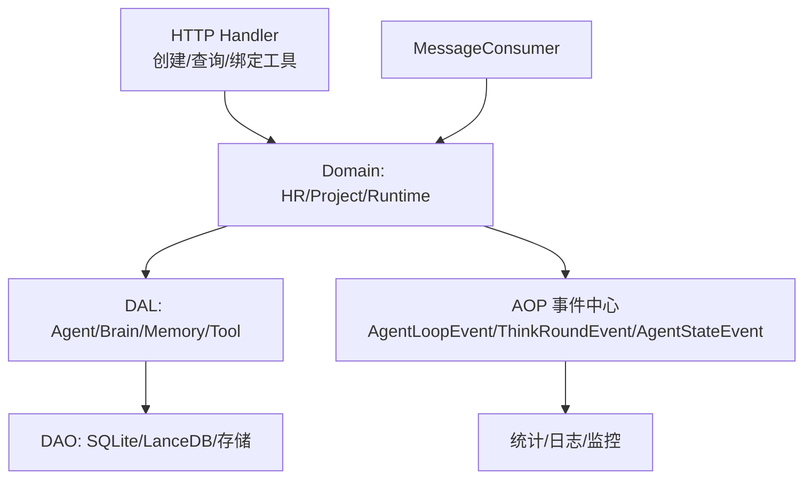
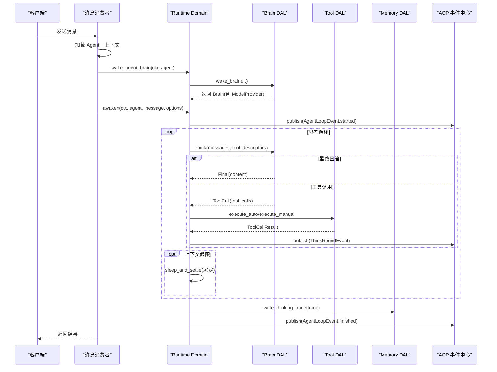
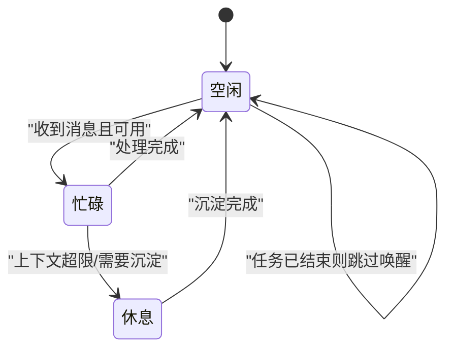
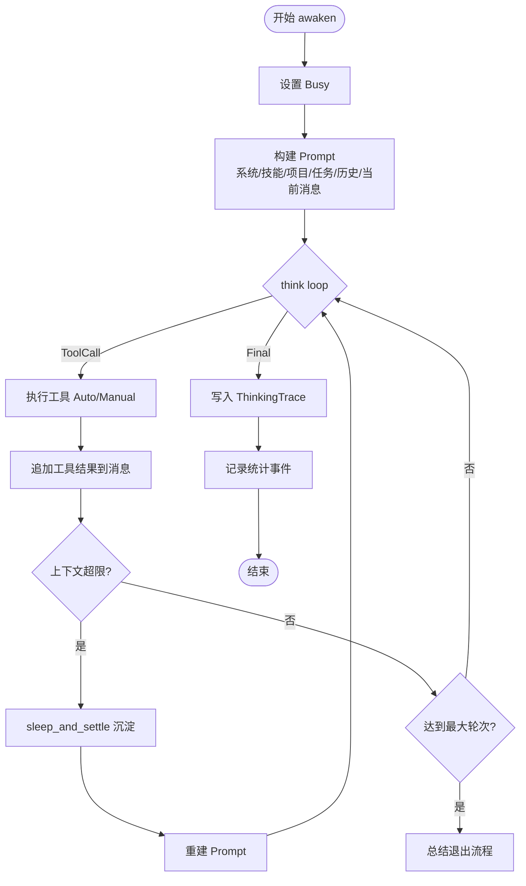
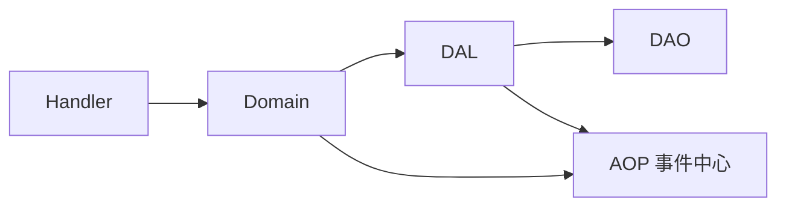
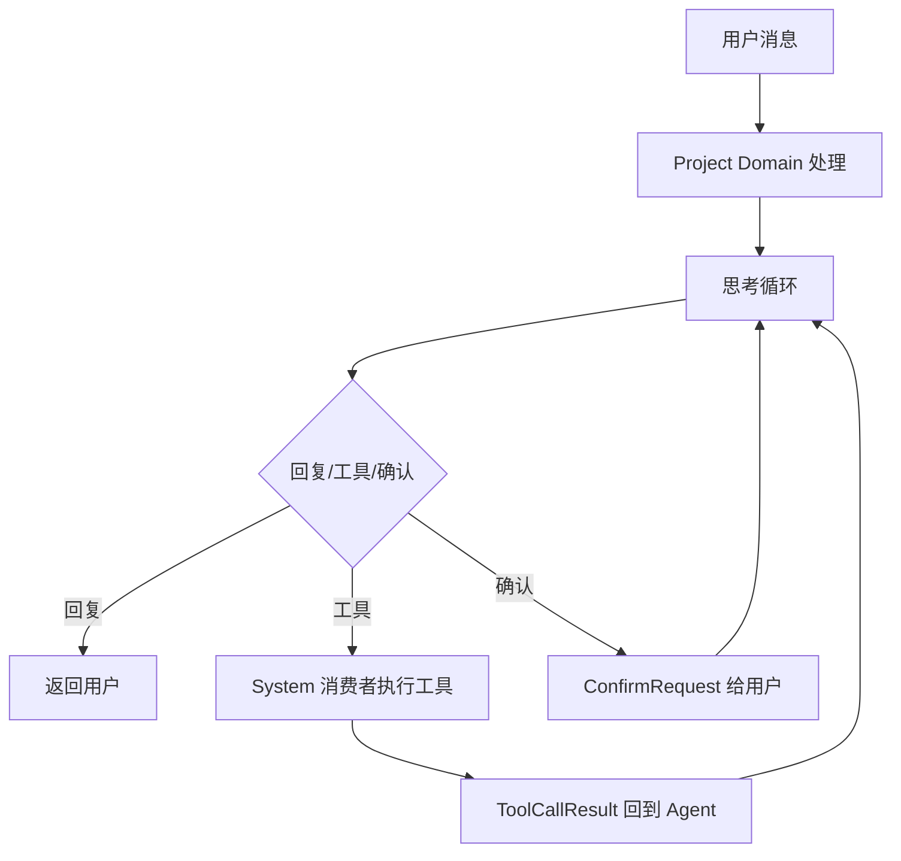

# Agent 生命周期管理

<cite>
**本文引用的文件**
- [src/service/domain/runtime/awakening.rs](file://src/service/domain/runtime/awakening.rs)
- [src/consumer/message.rs](file://src/consumer/message.rs)
- [src/pkg/agent_runtime_state.rs](file://src/pkg/agent_runtime_state.rs)
- [common/src/enums/agent.rs](file://common/src/enums/agent.rs)
- [src/models/agent.rs](file://src/models/agent.rs)
- [src/handlers/hr/agent/create_agent.rs](file://src/handlers/hr/agent/create_agent.rs)
- [src/handlers/hr/agent/create_external_agent.rs](file://src/handlers/hr/agent/create_external_agent.rs)
- [common/src/enums/agent_kind.rs](file://common/src/enums/agent_kind.rs)
- [common/src/api/tool.rs](file://common/src/api/tool.rs)
- [src/handlers/finance/tool/bind_tool_to_agent.rs](file://src/handlers/finance/tool/bind_tool_to_agent.rs)
- [docs/project_management_design.md](file://docs/project_management_design.md)
- [docs/message_interaction_design.md](file://docs/message_interaction_design.md)
- [docs/stats_query_design.md](file://docs/stats_query_design.md)
- [src/service/dao/agent/mod.rs](file://src/service/dao/agent/mod.rs)
</cite>

## 目录
1. [简介](#简介)
2. [项目结构](#项目结构)
3. [核心组件](#核心组件)
4. [架构总览](#架构总览)
5. [详细组件分析](#详细组件分析)
6. [依赖关系分析](#依赖关系分析)
7. [性能考虑](#性能考虑)
8. [故障排查指南](#故障排查指南)
9. [结论](#结论)
10. [附录](#附录)

## 简介
本文面向 Agent 的完整生命周期管理，覆盖创建、启动、运行、暂停、停止与销毁等阶段；详细说明状态机设计（空闲、思考、执行、休眠）及转换规则；解释唤醒机制如何触发思考循环，以及思考循环的执行流程；给出 Agent 配置参数（模型选择、提示词模板、工具绑定等）说明；提供 Agent CRUD API 示例，区分内部 Agent 与外部 Agent；并说明监控指标、日志记录与调试方法。

## 项目结构
Agent 生命周期贯穿适配层（Handler）、领域层（Runtime Domain）、数据访问层（DAL/DAO）与事件总线（AOP）。关键路径包括：
- 消息到达后由消费者加载 Agent 与上下文，必要时装配 Brain，再调用 Runtime Awakening 执行 awaken 思考循环。
- 思考循环支持多轮工具调用、上下文压缩沉淀、轮次上限控制与总结退出。
- 运行时状态通过内存管理器维护，用于并发控制与可观测性。

图表来源
- [src/consumer/message.rs:164-317](file://src/consumer/message.rs#L164-L317)
- [src/service/domain/runtime/awakening.rs:131-173](file://src/service/domain/runtime/awakening.rs#L131-L173)
- [src/pkg/agent_runtime_state.rs:1-174](file://src/pkg/agent_runtime_state.rs#L1-L174)

章节来源
- [src/consumer/message.rs:164-317](file://src/consumer/message.rs#L164-L317)
- [src/service/domain/runtime/awakening.rs:131-173](file://src/service/domain/runtime/awakening.rs#L131-L173)
- [src/pkg/agent_runtime_state.rs:1-174](file://src/pkg/agent_runtime_state.rs#L1-L174)

## 核心组件
- Agent 实体与持久化对象：包含运行时配置、类型（Local/Cli/Remote）、工具与技能集合、Brain 装配状态、统计数据注入点。
- 运行时状态管理器：纯内存全局单例，维护 Idle/Resting/Busy 三态，提供 try_set_busy 原子操作避免并发唤醒。
- 唤醒与思考循环：统一封装 think loop，支持超时、上下文压缩、轮次上限、工具自动/手动执行、总结退出。
- 配置与外部执行器：支持 CLI 子进程与 A2A 远程两种外部 Agent 配置，含命令、工作目录、环境变量、超时与提示词模板。
- 工具绑定：通过 Handler 将工具绑定到 Agent，供 think loop 在 function calling 时按名称匹配执行。

章节来源
- [src/models/agent.rs:15-184](file://src/models/agent.rs#L15-L184)
- [src/models/agent.rs:186-328](file://src/models/agent.rs#L186-L328)
- [src/models/agent.rs:330-553](file://src/models/agent.rs#L330-L553)
- [src/pkg/agent_runtime_state.rs:1-174](file://src/pkg/agent_runtime_state.rs#L1-L174)
- [src/service/domain/runtime/awakening.rs:16-147](file://src/service/domain/runtime/awakening.rs#L16-L147)
- [common/src/enums/agent_kind.rs:1-80](file://common/src/enums/agent_kind.rs#L1-L80)
- [src/handlers/finance/tool/bind_tool_to_agent.rs:1-38](file://src/handlers/finance/tool/bind_tool_to_agent.rs#L1-L38)

## 架构总览
下图展示从消息到达、Agent 装载、Brain 装配、awaken 思考循环、工具执行到记忆沉淀与统计记录的端到端流程。

图表来源
- [src/consumer/message.rs:164-317](file://src/consumer/message.rs#L164-L317)
- [src/service/domain/runtime/awakening.rs:415-748](file://src/service/domain/runtime/awakening.rs#L415-L748)
- [src/service/domain/runtime/awakening.rs:166-363](file://src/service/domain/runtime/awakening.rs#L166-L363)

## 详细组件分析

### 状态机与生命周期
- 持久化状态（AgentStatus）：面试中→待入职→已入职→待离职→已离职→已删除，用于 Agent 生命周期管理。
- 运行时状态（AgentRuntimeState）：空闲（Idle）、休息（Resting）、忙碌（Busy），纯内存，服务重启重置。
- 状态转换规则：
  - 收到消息且可用 → set_busy（或 try_set_busy 原子获取）
  - 进入沉淀/总结 → set_resting
  - 完成处理/沉淀结束 → set_idle
  - 任务已完成/取消/归档 → 直接释放 Busy，跳过唤醒

图表来源
- [common/src/enums/agent.rs:8-78](file://common/src/enums/agent.rs#L8-L78)
- [src/pkg/agent_runtime_state.rs:51-107](file://src/pkg/agent_runtime_state.rs#L51-L107)
- [src/consumer/message.rs:198-294](file://src/consumer/message.rs#L198-L294)

章节来源
- [common/src/enums/agent.rs:8-78](file://common/src/enums/agent.rs#L8-L78)
- [src/pkg/agent_runtime_state.rs:51-107](file://src/pkg/agent_runtime_state.rs#L51-L107)
- [src/consumer/message.rs:198-294](file://src/consumer/message.rs#L198-L294)

### 唤醒机制与思考循环
- 唤醒入口：awaken(ctx, agent, message, options)
  - 设置 Busy，发布 started 事件
  - 构建 Prompt（系统提示、技能、项目/任务上下文、历史短期记忆、当前消息）
  - 执行共享 think loop：
    - 超时保护（默认 300s）
    - 多轮迭代，每轮发布 ThinkRoundEvent
    - 工具调用分发（Auto/Manual），结果回写消息历史
    - 上下文压缩检测：超过阈值则中断，调用 sleep_and_settle 沉淀后重试
    - 轮次上限：达到 max_rounds 进入总结退出流程
  - 写入 ThinkingTrace，记录统计事件，发布 finished 事件
- 沉睡沉淀：sleep_and_settle(ctx, agent, pending_memories_summary, options, trace_ids)
  - 设置 Resting，读取近期记忆，构造沉淀 Prompt，执行 think，写 Trace，恢复 Idle

图表来源
- [src/service/domain/runtime/awakening.rs:166-363](file://src/service/domain/runtime/awakening.rs#L166-L363)
- [src/service/domain/runtime/awakening.rs:415-748](file://src/service/domain/runtime/awakening.rs#L415-L748)
- [src/service/domain/runtime/awakening.rs:750-800](file://src/service/domain/runtime/awakening.rs#L750-L800)

章节来源
- [src/service/domain/runtime/awakening.rs:166-363](file://src/service/domain/runtime/awakening.rs#L166-L363)
- [src/service/domain/runtime/awakening.rs:415-748](file://src/service/domain/runtime/awakening.rs#L415-L748)
- [src/service/domain/runtime/awakening.rs:750-800](file://src/service/domain/runtime/awakening.rs#L750-L800)

### 配置参数详解
- 运行时配置（AgentRuntimeConfig）：
  - 最大思考深度（跨消息累计工具调用数）
  - 单次唤醒最大思考轮次（跨压缩累计）
  - 思考间隔（毫秒）
  - 单步最大工具调用次数
  - 是否启用反思模式
  - 是否需要用户确认
  - 已安装工具包/技能包 tag
  - 外部 Agent 执行配置（CLI/A2A Remote）
- 外部 Agent 配置（ExternalAgentConfig）：
  - CLI：命令、参数、工作目录、环境变量、超时、自定义 prompt 模板
  - Remote：endpoint、agent_name、auth_token、timeout_secs
- 模型选择：通过 AgentPo.model_provider_id 关联 ModelProvider，awaken 时 enrich ctx 以携带 model_provider_id/model_name，便于统计与追踪。
- 提示词模板：CLI 外部 Agent 支持 prompt_template 占位符 {prompt}；本地 Agent 通过 PromptBuilder 组装系统/技能/项目/任务/历史/当前消息。
- 工具绑定：通过绑定接口将工具加入 Agent，think loop 根据工具名匹配执行。

章节来源
- [src/models/agent.rs:15-184](file://src/models/agent.rs#L15-L184)
- [src/models/agent.rs:330-553](file://src/models/agent.rs#L330-L553)
- [src/service/domain/runtime/awakening.rs:467-513](file://src/service/domain/runtime/awakening.rs#L467-L513)
- [common/src/enums/agent_kind.rs:1-80](file://common/src/enums/agent_kind.rs#L1-L80)
- [src/handlers/finance/tool/bind_tool_to_agent.rs:1-38](file://src/handlers/finance/tool/bind_tool_to_agent.rs#L1-L38)

### Agent CRUD API 示例
- 创建内部 Agent（Local）
  - 请求：POST /api/v1/agents
  - 行为：构造 AgentPo（含 model_provider_id），调用 Domain 创建，返回 ID、名称、描述、创建时间
  - 参考实现路径：[创建内部 Agent:1-60](file://src/handlers/hr/agent/create_agent.rs#L1-L60)
- 创建外部 Agent（Cli/Remote）
  - 请求：POST /api/v1/hr/agents/external
  - 行为：解析 kind，构造 ExternalAgentConfig，设置到 runtime_config，调用通用 create_agent
  - 参考实现路径：[创建外部 Agent:1-124](file://src/handlers/hr/agent/create_external_agent.rs#L1-L124)
- 工具绑定
  - 请求：POST /api/v1/agents/{agent_id}/tools/{tool_id}/bind
  - 行为：校验工具存在，更新 Agent 绑定关系
  - 参考实现路径：[绑定工具:1-38](file://src/handlers/finance/tool/bind_tool_to_agent.rs#L1-L38)
- 工具解绑与状态 DTO
  - 参考定义路径：[工具相关 DTO:296-330](file://common/src/api/tool.rs#L296-L330)

章节来源
- [src/handlers/hr/agent/create_agent.rs:1-60](file://src/handlers/hr/agent/create_agent.rs#L1-L60)
- [src/handlers/hr/agent/create_external_agent.rs:1-124](file://src/handlers/hr/agent/create_external_agent.rs#L1-L124)
- [src/handlers/finance/tool/bind_tool_to_agent.rs:1-38](file://src/handlers/finance/tool/bind_tool_to_agent.rs#L1-L38)
- [common/src/api/tool.rs:296-330](file://common/src/api/tool.rs#L296-L330)

### 监控指标、日志与调试
- 事件与指标
  - AgentLoopEvent：awaken 开始/结束，用于整体循环追踪
  - ThinkRoundEvent：每轮 think 输出，含模型用量与上下文信息
  - AgentAwakeEvent：每次唤醒统计（时长、状态、关联消息/任务/项目/组织/用户）
  - AgentStateEvent：运行时状态变更（idle/busy/resting）
- 统计查询
  - AgentStatsDao 提供唤醒次数、QPS、瞬时 QPS 等聚合查询
  - 参考路径：[统计查询设计:195-252](file://docs/stats_query_design.md#L195-L252)、[AgentStatsDao 实现:160-200](file://src/service/dao/agent/mod.rs#L160-L200)
- 日志与追踪
  - 使用 RequestContext.log_id 串联链路
  - 通过 AOP 同步转发事件，便于集中采集与可视化
- 调试建议
  - 关注 ContextOverflow 与 MaxRoundsExceeded 分支，检查模型上下文长度与轮次配置
  - 检查工具绑定是否正确，确保 think loop 能匹配到工具名
  - 观察 BusyGuard 与 try_set_busy 的使用，避免并发唤醒导致状态异常

章节来源
- [src/service/domain/runtime/awakening.rs:218-323](file://src/service/domain/runtime/awakening.rs#L218-L323)
- [src/service/domain/runtime/awakening.rs:624-739](file://src/service/domain/runtime/awakening.rs#L624-L739)
- [docs/stats_query_design.md:195-252](file://docs/stats_query_design.md#L195-L252)
- [src/service/dao/agent/mod.rs:160-200](file://src/service/dao/agent/mod.rs#L160-L200)

## 依赖关系分析
- 分层依赖方向：Handler → Domain → DAL → DAO，禁止跨层与同层互调
- 关键依赖链：
  - MessageConsumer → HR Domain（加载 Agent）→ Runtime Domain（awaken/sleep）→ Brain DAL（think/wake）→ Tool DAL（执行）→ Memory DAL（读写）
  - AOP 事件中心作为横切关注点，被各层用于统计与日志
- 潜在风险：
  - 并发唤醒：需使用 try_set_busy 避免同一 Agent 被重复唤醒
  - 上下文膨胀：需合理设置 recommended_context_length 与 max_rounds
  - 工具缺失：需确保绑定正确，否则 think loop 会报告工具未找到

图表来源
- [src/consumer/message.rs:164-317](file://src/consumer/message.rs#L164-L317)
- [src/service/domain/runtime/awakening.rs:166-363](file://src/service/domain/runtime/awakening.rs#L166-L363)

章节来源
- [src/consumer/message.rs:164-317](file://src/consumer/message.rs#L164-L317)
- [src/service/domain/runtime/awakening.rs:166-363](file://src/service/domain/runtime/awakening.rs#L166-L363)

## 性能考虑
- 上下文压缩：当 input_tokens 超过阈值（recommended_context_length 或 max_context_length*60%）时中断循环，沉淀后重试，避免 OOM 与延迟飙升
- 轮次限制：max_thinking_rounds 控制单次唤醒的最大思考轮次，防止无限循环
- 工具调用节流：thinking_interval_ms 可设置思考间隔，避免过快调用
- 统计开销：record_event 失败不阻塞业务，仅记录警告，保证主流程性能
- 内存状态：AgentRuntimeStateManager 为 DashMap 并发容器，try_set_busy 原子操作减少锁竞争

章节来源
- [src/service/domain/runtime/awakening.rs:182-197](file://src/service/domain/runtime/awakening.rs#L182-L197)
- [src/service/domain/runtime/awakening.rs:325-342](file://src/service/domain/runtime/awakening.rs#L325-L342)
- [src/models/agent.rs:21-68](file://src/models/agent.rs#L21-L68)
- [src/pkg/agent_runtime_state.rs:85-107](file://src/pkg/agent_runtime_state.rs#L85-L107)

## 故障排查指南
- Agent 无法唤醒
  - 检查任务状态是否为 Completed/Cancelled/Archived，若是则跳过唤醒
  - 检查 Agent 是否已装配 Brain，若未装配先调用 wake_agent_brain
  - 检查 try_set_busy 是否成功，避免 Busy/Resting 状态阻塞
- 思考循环卡住
  - 检查 max_thinking_rounds 与 recommended_context_length 配置
  - 查看 ThinkRoundEvent 与 AgentLoopEvent 日志，定位具体轮次与错误
- 工具调用失败
  - 确认工具已绑定到 Agent，且工具名匹配
  - 检查 control_mode（Auto/Manual）是否符合预期
- 上下文超限
  - 调整模型提供商的 recommended_context_length 或降低 max_rounds
  - 观察沉淀是否成功，必要时增加沉淀批次限制

章节来源
- [src/consumer/message.rs:198-294](file://src/consumer/message.rs#L198-L294)
- [src/service/domain/runtime/awakening.rs:325-342](file://src/service/domain/runtime/awakening.rs#L325-L342)
- [src/service/domain/runtime/awakening.rs:624-739](file://src/service/domain/runtime/awakening.rs#L624-L739)

## 结论
本方案通过清晰的状态机、统一的唤醒与思考循环、严格的上下文与轮次控制、完善的统计与日志体系，实现了 Agent 全生命周期的可靠管理与高效执行。结合内部 Agent 与外部 Agent 的统一抽象，既保证了灵活性，又确保了可观测性与可维护性。

## 附录
- 思考循环状态机（概念图）

[此图为概念性流程图，不直接映射具体源码文件]