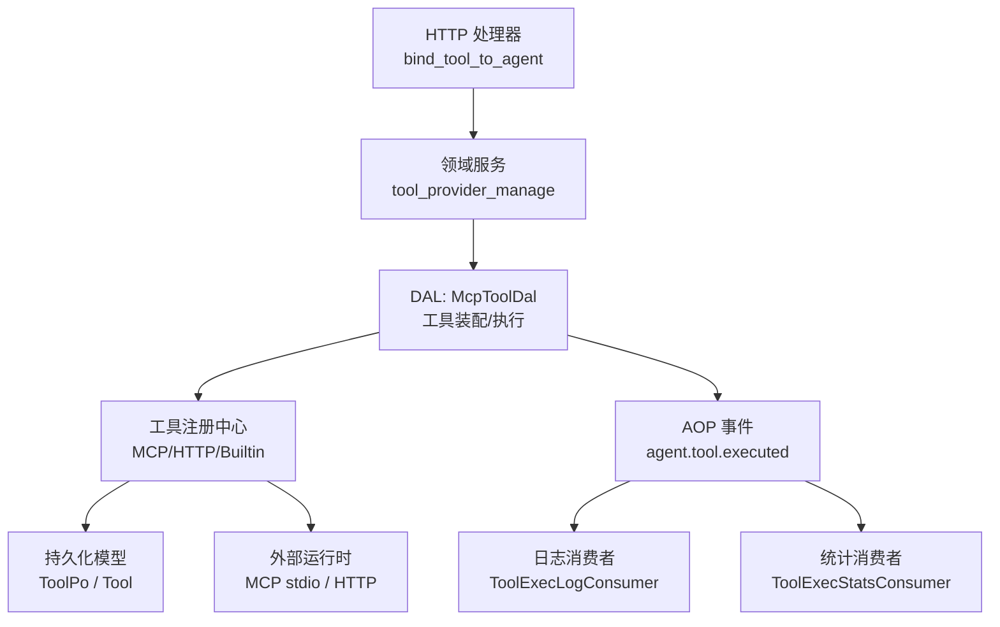
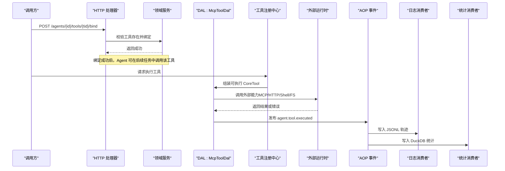
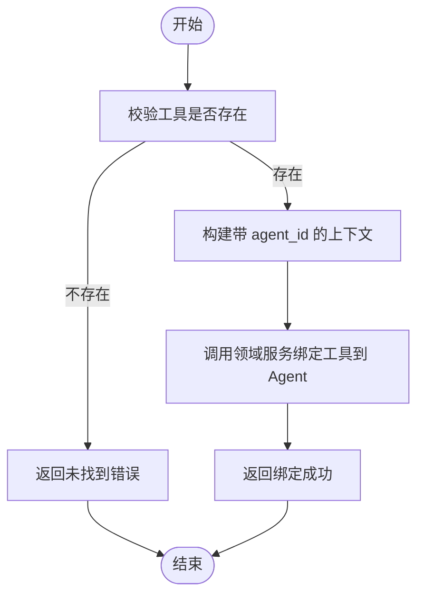
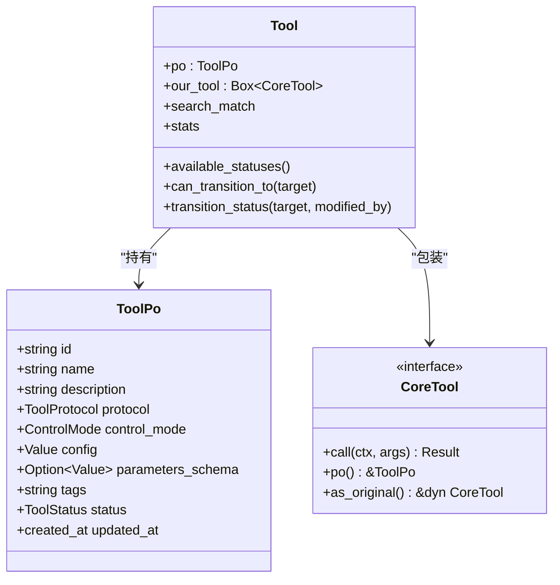
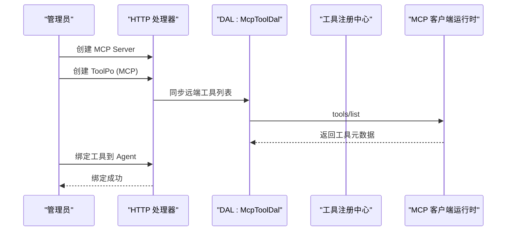
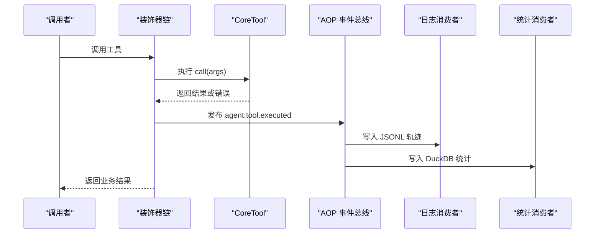
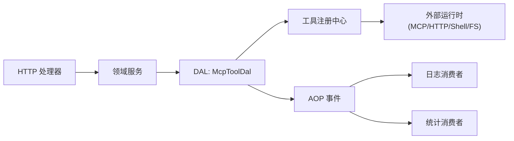

# 工具绑定管理

<cite>
**本文引用的文件**
- [bind_tool_to_agent.rs](file://src/handlers/finance/tool/bind_tool_to_agent.rs)
- [tool.rs](file://src/models/tool.rs)
- [mcp.rs](file://src/pkg/tool_registry/mcp.rs)
- [builtin.rs](file://src/pkg/tool_registry/builtin.rs)
- [http.rs](file://src/pkg/tool_registry/http.rs)
- [entry.rs](file://src/pkg/tool_tracing/entry.rs)
- [logger.rs](file://src/pkg/tool_tracing/logger.rs)
- [tool_exec_log_consumer.rs](file://src/consumer/tool_exec_log_consumer.rs)
- [tool_exec_stats_consumer.rs](file://src/consumer/tool_exec_stats_consumer.rs)
- [tool_call.rs](file://src/pkg/stats/tool_call.rs)
- [mcp_tool.rs](file://src/service/dal/mcp_tool.rs)
- [tool_provider_test.rs](file://src/service/domain/finance/tool_provider_test.rs)
</cite>

## 目录
1. [简介](#简介)
2. [项目结构](#项目结构)
3. [核心组件](#核心组件)
4. [架构总览](#架构总览)
5. [详细组件分析](#详细组件分析)
6. [依赖关系分析](#依赖关系分析)
7. [性能与监控](#性能与监控)
8. [故障排查指南](#故障排查指南)
9. [结论](#结论)
10. [附录](#附录)

## 简介
本文件面向 Agent 工具绑定管理，系统性说明“工具包的安装、卸载与管理”“工具与 Agent 的绑定与解绑”“工具配置（参数、权限、错误处理）”“内置工具与 MCP 工具的绑定示例”“工具执行的监控、日志记录与性能分析”。文档严格遵循四层单向调用：Adapter → Domain → DAL → DAO，并基于仓库现有实现进行说明。

## 项目结构
围绕工具绑定与执行的关键代码分布在以下位置：
- 适配器层（HTTP Handler）：提供绑定工具到 Agent 的接口
- 领域层（Domain/DAL）：负责工具元数据、MCP 工具装配与执行
- 工具注册中心（Registry）：内置工具、HTTP 工具、MCP 工具的工厂与可执行对象
- 追踪与统计：AOP 事件驱动的工具调用日志与指标落盘

**图示来源**
- [bind_tool_to_agent.rs:1-39](file://src/handlers/finance/tool/bind_tool_to_agent.rs#L1-L39)
- [mcp_tool.rs:72-115](file://src/service/dal/mcp_tool.rs#L72-L115)
- [mcp.rs:1-399](file://src/pkg/tool_registry/mcp.rs#L1-L399)
- [tool_exec_log_consumer.rs:1-53](file://src/consumer/tool_exec_log_consumer.rs#L1-L53)
- [tool_exec_stats_consumer.rs:1-73](file://src/consumer/tool_exec_stats_consumer.rs#L1-L73)

**章节来源**
- [bind_tool_to_agent.rs:1-39](file://src/handlers/finance/tool/bind_tool_to_agent.rs#L1-L39)
- [mcp_tool.rs:72-115](file://src/service/dal/mcp_tool.rs#L72-L115)

## 核心组件
- 工具实体与持久化对象
  - CoreTool：统一执行接口，封装 call/po/as_original
  - ToolPo：数据库持久化对象，包含协议、控制模式、配置、Schema、标签、状态等
  - Tool：管理面完整实体，聚合 PO 与可执行对象，支持状态迁移
- 工具注册中心
  - 内置工具工厂：BuiltinToolFactory，启动时注册 http_fetch、fs_read、fs_write、shell_exec
  - HTTP 工具：HttpToolConfig，固定 URL、方法、头/查询/体模板、SSRF 白名单/黑名单、超时与响应大小限制
  - MCP 工具：McpToolConfig，仅保存 server_id 与 tool_name；连接细节在 MCP Server 中管理
- 工具追踪与统计
  - ToolCallEntry/ToolCallStatus：结构化日志条目与状态
  - ToolCallLogger：按日 JSONL 持久化工具调用轨迹
  - ToolExecLogConsumer/ToolExecStatsConsumer：订阅 agent.tool.executed 事件，分别写入日志与 DuckDB 统计

**章节来源**
- [tool.rs:1-314](file://src/models/tool.rs#L1-L314)
- [builtin.rs:1-44](file://src/pkg/tool_registry/builtin.rs#L1-L44)
- [http.rs:35-73](file://src/pkg/tool_registry/http.rs#L35-L73)
- [mcp.rs:28-48](file://src/pkg/tool_registry/mcp.rs#L28-L48)
- [entry.rs:1-91](file://src/pkg/tool_tracing/entry.rs#L1-L91)
- [logger.rs:1-253](file://src/pkg/tool_tracing/logger.rs#L1-L253)

## 架构总览
工具绑定与执行的整体流程如下：
- 绑定阶段：HTTP 处理器校验工具存在，更新 RequestContext 的 agent_id，调用领域服务完成绑定
- 执行阶段：DAL 根据 ToolPo 与协议类型组装可执行 CoreTool（内置/HTTP/MCP），执行后通过 AOP 发布 agent.tool.executed 事件
- 观测阶段：日志消费者写 JSONL，统计消费者写 DuckDB，供前端与运维查询

**图示来源**
- [bind_tool_to_agent.rs:1-39](file://src/handlers/finance/tool/bind_tool_to_agent.rs#L1-L39)
- [mcp_tool.rs:72-115](file://src/service/dal/mcp_tool.rs#L72-L115)
- [tool_exec_log_consumer.rs:1-53](file://src/consumer/tool_exec_log_consumer.rs#L1-L53)
- [tool_exec_stats_consumer.rs:1-73](file://src/consumer/tool_exec_stats_consumer.rs#L1-L73)

## 详细组件分析

### 工具与 Agent 的绑定与解绑
- 绑定入口：POST /api/v1/agents/{agent_id}/tools/{tool_id}/bind
  - 处理器先校验工具是否存在，再构造带 agent_id 的 RequestContext，调用领域服务完成绑定
  - 绑定成功后，Agent 可在其工作流中调用该工具
- 解绑：当前仓库未提供显式解绑 API；如需解绑，可通过删除工具或禁用工具状态进行管理

**图示来源**
- [bind_tool_to_agent.rs:1-39](file://src/handlers/finance/tool/bind_tool_to_agent.rs#L1-L39)

**章节来源**
- [bind_tool_to_agent.rs:1-39](file://src/handlers/finance/tool/bind_tool_to_agent.rs#L1-L39)

### 工具包安装、卸载与管理
- 安装
  - 内置工具：启动时由注册中心自动注册，无需手动安装
  - HTTP 工具：通过管理接口创建 ToolPo，配置 method/url/headers/query/body/allowed_domains/blocked_domains/allow_local_network 等
  - MCP 工具：先创建 MCP Server，再创建 ToolPo，config 仅包含 server_id 与 tool_name
- 管理
  - 状态切换：Enabled/Disabled/Stale，受限于可用状态集
  - 控制模式：HTTP/MCP 默认 Manual，其他协议默认 Auto
  - 搜索与标签：支持向量化文本与标签筛选
- 卸载
  - 删除 ToolPo 或禁用状态即可停止使用；MCP 工具若远端消失会被标记为 Stale

**图示来源**
- [tool.rs:1-314](file://src/models/tool.rs#L1-L314)

**章节来源**
- [tool.rs:1-314](file://src/models/tool.rs#L1-L314)
- [tool_provider_test.rs:1-186](file://src/service/domain/finance/tool_provider_test.rs#L1-L186)

### 工具配置详解（参数、权限、错误处理）
- 内置工具
  - 通过 BuiltinToolFactory 定义默认 ToolPo，不可被用户修改或删除
  - 典型能力：http_fetch、fs_read、fs_write、shell_exec
- HTTP 工具
  - 固定 URL 模板与请求方法，禁止动态拼接任意 URL
  - SSRF 防护：allowed_domains/blocked_domains/allow_local_network
  - 安全限制：超时、响应最大字节数、允许的状态码、JSON Pointer 提取
  - 参数校验：基于 parameters_schema 的类型与枚举校验
- MCP 工具
  - ToolPo.config 仅保存 server_id 与 tool_name，不重复存储服务器凭据
  - 运行时从 MCP Server 读取连接信息，支持 stdio 传输（HTTP 流式暂未实现）
  - 工具元数据通过 tools/list 同步，失败或远端消失会进入 Stale
- 错误处理
  - 配置校验失败：在创建/更新时拒绝非法配置
  - 执行失败：统一转换为 ToolExecutionFailed 错误，便于上层处理
  - 脱敏：HTTP/MCP 工具 trace 的 input/output/error 默认脱敏，避免敏感信息泄露

**章节来源**
- [builtin.rs:1-44](file://src/pkg/tool_registry/builtin.rs#L1-L44)
- [http.rs:35-73](file://src/pkg/tool_registry/http.rs#L35-L73)
- [http.rs:257-420](file://src/pkg/tool_registry/http.rs#L257-L420)
- [mcp.rs:1-399](file://src/pkg/tool_registry/mcp.rs#L1-L399)
- [entry.rs:70-91](file://src/pkg/tool_tracing/entry.rs#L70-L91)

### 内置工具与 MCP 工具的绑定示例
- 内置工具
  - 启动时自动注册，无需额外绑定；Agent 可直接调用
- MCP 工具
  - 步骤一：创建 MCP Server（含命令、环境变量、超时等）
  - 步骤二：创建 ToolPo，protocol=Mcp，config={"server_id":"...","tool_name":"..."}
  - 步骤三：可选地通过 DAL 同步远端工具元数据
  - 步骤四：将工具绑定到 Agent（同通用绑定流程）

**图示来源**
- [mcp_tool.rs:72-115](file://src/service/dal/mcp_tool.rs#L72-L115)
- [mcp.rs:90-140](file://src/pkg/tool_registry/mcp.rs#L90-L140)
- [bind_tool_to_agent.rs:1-39](file://src/handlers/finance/tool/bind_tool_to_agent.rs#L1-L39)

**章节来源**
- [mcp_tool.rs:72-115](file://src/service/dal/mcp_tool.rs#L72-L115)
- [mcp.rs:90-140](file://src/pkg/tool_registry/mcp.rs#L90-L140)
- [bind_tool_to_agent.rs:1-39](file://src/handlers/finance/tool/bind_tool_to_agent.rs#L1-L39)

### 工具执行链路（含装饰器与 AOP）
- 执行入口：CoreTool.call
- 装饰器链：日志/统计/安全等装饰器包裹原始工具
- AOP 事件：执行完成后发布 agent.tool.executed，携带 ToolCallEntry
- 消费者：日志消费者写 JSONL，统计消费者写 DuckDB

**图示来源**
- [tool_exec_log_consumer.rs:1-53](file://src/consumer/tool_exec_log_consumer.rs#L1-L53)
- [tool_exec_stats_consumer.rs:1-73](file://src/consumer/tool_exec_stats_consumer.rs#L1-L73)
- [tool_call.rs:1-228](file://src/pkg/stats/tool_call.rs#L1-L228)

**章节来源**
- [tool_exec_log_consumer.rs:1-53](file://src/consumer/tool_exec_log_consumer.rs#L1-L53)
- [tool_exec_stats_consumer.rs:1-73](file://src/consumer/tool_exec_stats_consumer.rs#L1-L73)
- [tool_call.rs:1-228](file://src/pkg/stats/tool_call.rs#L1-L228)

## 依赖关系分析
- 耦合与内聚
  - 工具注册中心对协议实现高内聚，对外暴露统一的 CoreTool 接口
  - DAL 层屏蔽 MCP 运行时细节，向上提供 get_by_id/sync_from_server/call_tool
  - AOP 消费者与执行链路松耦合，通过事件解耦日志与统计
- 外部依赖
  - MCP：rmcp 库用于 stdio 通信，暂不支持 Streamable HTTP
  - 存储：DuckDB 用于统计，JSONL 用于轨迹
- 循环依赖
  - 未发现直接循环依赖；各层单向调用清晰

**图示来源**
- [mcp_tool.rs:72-115](file://src/service/dal/mcp_tool.rs#L72-L115)
- [tool_exec_log_consumer.rs:1-53](file://src/consumer/tool_exec_log_consumer.rs#L1-L53)
- [tool_exec_stats_consumer.rs:1-73](file://src/consumer/tool_exec_stats_consumer.rs#L1-L73)

**章节来源**
- [mcp_tool.rs:72-115](file://src/service/dal/mcp_tool.rs#L72-L115)

## 性能与监控
- 性能特性
  - MCP stdio 每次调用建立子进程会话，注意超时与关闭失败的处理
  - HTTP 工具支持超时与响应大小限制，防止资源耗尽
  - 内置工具路径受限，减少文件系统风险
- 监控与日志
  - JSONL 轨迹：按日分片，支持按 call_id/agent_id/project_id/task_id/tool_id/status/时间范围查询
  - 统计指标：DuckDB 表 tool_call_events，支持调用次数、耗时、参数/结果大小、成功率等
  - 脱敏策略：HTTP/MCP 工具 trace 的输入输出错误默认脱敏，降低敏感信息泄露风险

**章节来源**
- [logger.rs:1-253](file://src/pkg/tool_tracing/logger.rs#L1-L253)
- [tool_call.rs:1-228](file://src/pkg/stats/tool_call.rs#L1-L228)
- [entry.rs:70-91](file://src/pkg/tool_tracing/entry.rs#L70-L91)

## 故障排查指南
- 常见错误
  - 工具未找到：绑定前需确保工具存在
  - MCP 工具不可执行：缺少服务端或运行时未启用
  - MCP stdio 初始化超时：检查命令、PATH、环境变量与超时配置
  - HTTP 工具配置非法：URL/方法/模板/白名单/黑名单/超时/响应大小等校验失败
- 定位方法
  - 通过 ToolCallLogger 查询 JSONL 轨迹，确认输入输出与错误信息（已脱敏）
  - 通过 DuckDB 统计查看失败率与耗时分布
  - 检查 MCP Server 状态与工具同步结果

**章节来源**
- [mcp.rs:142-192](file://src/pkg/tool_registry/mcp.rs#L142-L192)
- [http.rs:376-392](file://src/pkg/tool_registry/http.rs#L376-L392)
- [logger.rs:105-140](file://src/pkg/tool_tracing/logger.rs#L105-L140)

## 结论
工具绑定管理以统一的 CoreTool 抽象为核心，结合注册中心与 DAL 层，实现对内置、HTTP、MCP 三类工具的标准化管理与执行。通过 AOP 事件驱动的日志与统计机制，系统具备完善的可观测性。建议在新增工具时优先复用安全与脱敏能力，并在配置阶段严格校验，以降低运行期风险。

## 附录
- 关键概念速查
  - 工具协议：Builtin/Http/Mcp
  - 控制模式：Auto/Manual
  - 工具状态：Enabled/Disabled/Stale
- 常用操作路径
  - 绑定工具到 Agent：POST /api/v1/agents/{agent_id}/tools/{tool_id}/bind
  - 同步 MCP 工具：通过 DAL 的 sync_from_server
  - 查询工具轨迹：ToolCallLogger::query_calls
  - 查询工具统计：DuckDB tool_call_events