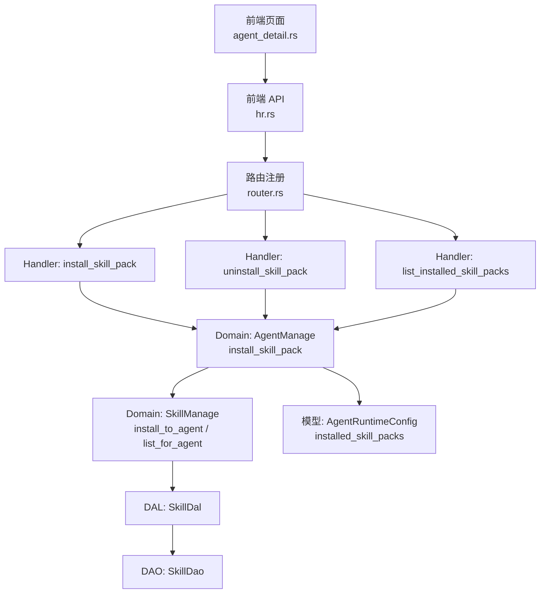
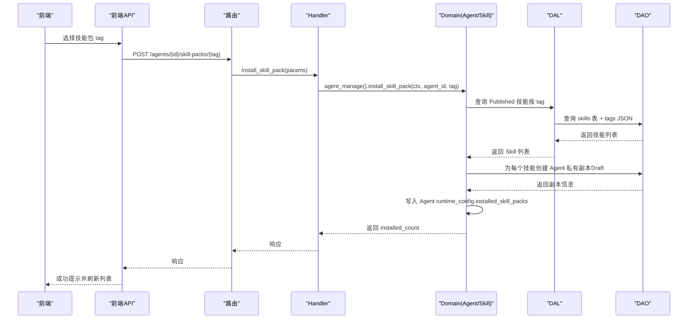
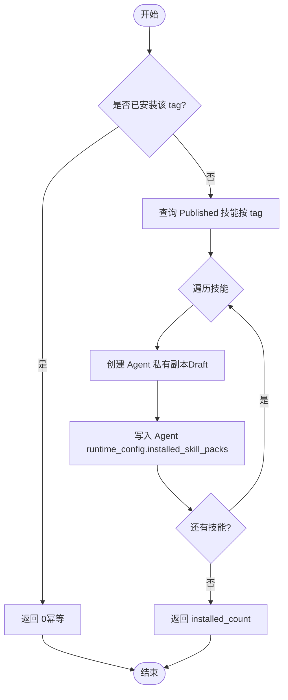
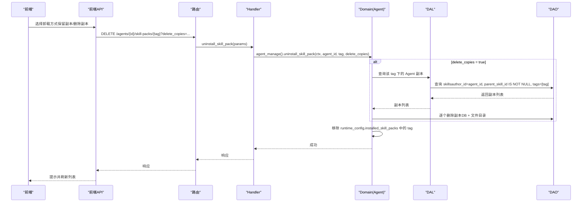
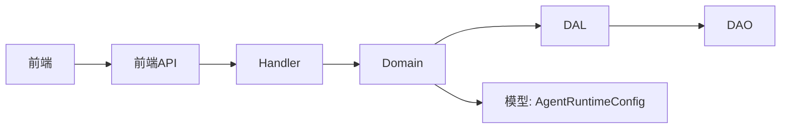

# 技能包管理

<cite>
**本文引用的文件**
- [skill_design.md](file://docs/skill_design.md)
- [install_skill_pack.rs](file://src/handlers/hr/agent/install_skill_pack.rs)
- [uninstall_skill_pack.rs](file://src/handlers/hr/agent/uninstall_skill_pack.rs)
- [list_installed_skill_packs.rs](file://src/handlers/hr/agent/list_installed_skill_packs.rs)
- [skill.rs (API DTO)](file://common/src/api/skill.rs)
- [agent.rs (模型)](file://src/models/agent.rs)
- [mod.rs (HR Domain 接口)](file://src/service/domain/hr/mod.rs)
- [skill.rs (Skill Domain 实现片段)](file://src/service/domain/hr/skill.rs)
- [router.rs](file://src/router.rs)
- [hr.rs (前端 API)](file://frontend/src/api/hr.rs)
- [agent_detail.rs (前端页面)](file://frontend/src/pages/hr/agent_detail.rs)
</cite>

## 目录
1. [简介](#简介)
2. [项目结构](#项目结构)
3. [核心组件](#核心组件)
4. [架构总览](#架构总览)
5. [详细组件分析](#详细组件分析)
6. [依赖关系分析](#依赖关系分析)
7. [性能与扩展性](#性能与扩展性)
8. [故障排查指南](#故障排查指南)
9. [结论](#结论)
10. [附录：开发指南与最佳实践](#附录：开发指南与最佳实践)

## 简介
本章节面向“Agent 技能包管理”的完整生命周期：概念、结构与安装机制；技能包的元数据定义、依赖关系与版本管理；安装、卸载与更新流程；技能包开发指南（技能定义、工具绑定、配置文件编写）；内置技能包使用示例与自定义技能包实践；以及安全检查与权限控制。

技能包是以 tag 为单位的“一组已发布技能”的聚合，通过按 tag 批量安装到 Agent，形成 Agent 私有副本并记录在运行时配置中，便于唤醒时自动注入。

## 项目结构
技能包相关能力横跨 Handler、Domain、DAL、DAO、模型与前后端 API：
- Handler 层：提供 HTTP 路由与参数校验，调用 Domain 完成业务编排
- Domain 层：封装安装/卸载/重新安装等业务流程，协调 Skill 与 Agent 状态
- DAL/DAO 层：负责技能元数据、文件读写与向量索引
- 模型层：Agent 运行时配置包含已安装技能包 tag 列表
- 前端：提供搜索下拉框、已装卡片网格、卸载确认对话框等交互

图表来源
- [install_skill_pack.rs:1-34](file://src/handlers/hr/agent/install_skill_pack.rs#L1-L34)
- [uninstall_skill_pack.rs:1-35](file://src/handlers/hr/agent/uninstall_skill_pack.rs#L1-L35)
- [list_installed_skill_packs.rs:1-29](file://src/handlers/hr/agent/list_installed_skill_packs.rs#L1-L29)
- [mod.rs (HR Domain 接口):249-291](file://src/service/domain/hr/mod.rs#L249-L291)
- [agent.rs:15-69](file://src/models/agent.rs#L15-L69)
- [router.rs:329-348](file://src/router.rs#L329-L348)

章节来源
- [skill_design.md:1-120](file://docs/skill_design.md#L1-L120)
- [router.rs:329-348](file://src/router.rs#L329-L348)

## 核心组件
- 技能包（Skill Pack）：以 tag 标识的一组已发布技能集合，支持按 tag 批量安装到 Agent
- 技能（Skill）：可复用的能力单元，具备元数据（名称、描述、标签、分类、作者、状态）、内容文件（skill.md 及附件）
- Agent 运行时配置：记录已安装的技能包 tag 列表，用于唤醒时自动注入
- 安装/卸载/重新安装：基于 tag 的幂等操作，支持删除副本或仅移除关联

章节来源
- [skill_design.md:1-120](file://docs/skill_design.md#L1-L120)
- [agent.rs:15-69](file://src/models/agent.rs#L15-L69)
- [mod.rs (HR Domain 接口):249-291](file://src/service/domain/hr/mod.rs#L249-L291)

## 架构总览
技能包管理的调用链遵循四层单向调用：Adapter（Handler）→ Domain → DAL → DAO，禁止跨层调用与同层互调。

图表来源
- [install_skill_pack.rs:1-34](file://src/handlers/hr/agent/install_skill_pack.rs#L1-L34)
- [mod.rs (HR Domain 接口):249-291](file://src/service/domain/hr/mod.rs#L249-L291)
- [skill_design.md:315-358](file://docs/skill_design.md#L315-L358)
- [agent.rs:15-69](file://src/models/agent.rs#L15-L69)

## 详细组件分析

### 技能包安装流程
- 入口：POST /api/v1/agents/{agent_id}/skill-packs/{tag}
- Handler 职责：接收请求，调用 Domain 安装
- Domain 职责：查询指定 tag 的已发布技能，批量安装到 Agent 目录，幂等处理（已安装则跳过），记录 tag 到 Agent 运行时配置
- DAL/DAO 职责：读取技能元数据与内容文件，复制为 Agent 私有副本（Draft），更新数据库与文件系统

图表来源
- [install_skill_pack.rs:1-34](file://src/handlers/hr/agent/install_skill_pack.rs#L1-L34)
- [mod.rs (HR Domain 接口):249-291](file://src/service/domain/hr/mod.rs#L249-L291)
- [skill_design.md:315-358](file://docs/skill_design.md#L315-L358)

章节来源
- [install_skill_pack.rs:1-34](file://src/handlers/hr/agent/install_skill_pack.rs#L1-L34)
- [mod.rs (HR Domain 接口):249-291](file://src/service/domain/hr/mod.rs#L249-L291)

### 技能包卸载流程
- 入口：DELETE /api/v1/agents/{agent_id}/skill-packs/{tag}?delete_copies={true|false}
- Handler 职责：解析 delete_copies 参数，调用 Domain 卸载
- Domain 职责：从 Agent 运行时配置移除 tag；当 delete_copies=true 时，删除该 tag 下所有 Agent 技能副本（DB + 文件目录）
- 安全提示：若副本已被用户修改，删除不可恢复

图表来源
- [uninstall_skill_pack.rs:1-35](file://src/handlers/hr/agent/uninstall_skill_pack.rs#L1-L35)
- [mod.rs (HR Domain 接口):249-291](file://src/service/domain/hr/mod.rs#L249-L291)
- [skill_design.md:315-358](file://docs/skill_design.md#L315-L358)

章节来源
- [uninstall_skill_pack.rs:1-35](file://src/handlers/hr/agent/uninstall_skill_pack.rs#L1-L35)
- [mod.rs (HR Domain 接口):249-291](file://src/service/domain/hr/mod.rs#L249-L291)

### 列出已安装技能包
- 入口：GET /api/v1/agents/{agent_id}/skill-packs
- Handler 职责：调用 Domain 获取 Agent 运行时配置中的 installed_skill_packs 列表
- 用途：前端展示已安装技能包 tag 列表

章节来源
- [list_installed_skill_packs.rs:1-29](file://src/handlers/hr/agent/list_installed_skill_packs.rs#L1-L29)
- [mod.rs (HR Domain 接口):249-291](file://src/service/domain/hr/mod.rs#L249-L291)

### 技能包元数据、依赖与版本管理
- 元数据：技能具备名称、描述、标签、分类、作者、状态、内容路径等字段；标签用于技能包聚合
- 依赖关系：当前实现以 tag 作为技能包聚合键，未显式声明技能间依赖；可通过标签组合表达弱依赖
- 版本管理：通过技能状态（Draft/Published/Expired）与更新时间戳体现；安装时复制最新 Published 版本；重新安装可覆盖已有副本

章节来源
- [skill_design.md:12-63](file://docs/skill_design.md#L12-L63)
- [skill.rs (API DTO):100-157](file://common/src/api/skill.rs#L100-L157)
- [mod.rs (HR Domain 接口):274-283](file://src/service/domain/hr/mod.rs#L274-L283)

### 安装、卸载与更新流程
- 安装：按 tag 批量安装 Published 技能为 Agent 私有副本，幂等
- 卸载：移除 tag 标记；可选同时删除副本
- 更新：重新安装同一 tag 会覆盖已有副本（更新文件与元数据）

章节来源
- [mod.rs (HR Domain 接口):249-291](file://src/service/domain/hr/mod.rs#L249-L291)
- [skill_design.md:315-358](file://docs/skill_design.md#L315-L358)

### 内置技能包使用示例
- 前端在 Agent 详情页提供“搜索技能包 tag”的下拉框，选择后调用安装接口
- 安装成功后刷新已安装列表，并以卡片网格展示

章节来源
- [agent_detail.rs:631-665](file://frontend/src/pages/hr/agent_detail.rs#L631-L665)
- [hr.rs:118-156](file://frontend/src/api/hr.rs#L118-L156)

### 自定义技能包开发实践
- 定义技能：创建 Skill，设置名称、描述、标签、分类、状态（建议先 Draft，再 Published）
- 绑定工具：将所需工具与技能关联（通过工具注册与绑定机制）
- 配置文件：编写 skill.md 主内容与附加文件，确保路径安全与 UTF-8 文本格式
- 发布与安装：将技能状态改为 Published，然后通过 tag 安装到目标 Agent

章节来源
- [skill_design.md:108-203](file://docs/skill_design.md#L108-L203)
- [skill_design.md:203-280](file://docs/skill_design.md#L203-L280)

### 安全检查与权限控制
- 路径安全：Skill 文件导入与编辑拒绝绝对路径、空路径、反斜杠、尾随斜杠目录目标，拒绝覆盖主文件 skill.md
- 归属校验：卸载单个技能副本需验证属于指定 Agent 且为安装副本（parent_skill_id 不为空）
- 权限边界：Handler 不直接访问 DAO/DAL，统一通过 Domain 编排；DAL 对外暴露业务实体，PO 限制在 DAO/DAL 内部

章节来源
- [skill_design.md:186-203](file://docs/skill_design.md#L186-L203)
- [skill.rs (Skill Domain 实现片段):153-184](file://src/service/domain/hr/skill.rs#L153-L184)
- [skill_design.md:671-704](file://docs/skill_design.md#L671-L704)

## 依赖关系分析
- Handler 依赖 Domain：安装/卸载/重新安装均通过 Domain 编排
- Domain 依赖 DAL/DAO：DAL 聚合 SkillDal，DAO 实现 SQLite 存储与文件操作
- 模型依赖：AgentRuntimeConfig 记录 installed_skill_packs，用于唤醒注入
- 前端依赖后端 API：通过 hr.rs 方法调用后端路由

图表来源
- [install_skill_pack.rs:1-34](file://src/handlers/hr/agent/install_skill_pack.rs#L1-L34)
- [mod.rs (HR Domain 接口):249-291](file://src/service/domain/hr/mod.rs#L249-L291)
- [agent.rs:15-69](file://src/models/agent.rs#L15-L69)
- [hr.rs:118-156](file://frontend/src/api/hr.rs#L118-L156)

章节来源
- [skill_design.md:671-704](file://docs/skill_design.md#L671-L704)

## 性能与扩展性
- 向量搜索：技能支持向量索引，提升语义检索效率
- 全文搜索：FTS5 + trigram 分词器，支持关键词匹配
- 降级策略：向量后端支持 LanceDB/HNSW/InMemory/SqliteVss 多实现切换
- 扩展点：Domain 层提供 init_base_data 扩展点，便于注入默认基础数据

章节来源
- [skill_design.md:461-491](file://docs/skill_design.md#L461-L491)
- [skill_design.md:621-670](file://docs/skill_design.md#L621-L670)

## 故障排查指南
- 安装失败：检查技能状态是否为 Published，tag 是否正确，Agent 是否有权限
- 卸载失败：确认 delete_copies 参数是否符合预期，副本是否存在
- 文件编辑失败：检查路径安全性与 UTF-8 编码，确认乐观锁 expected_updated_at 是否匹配
- 权限问题：确保 Handler 通过 Domain 编排，避免越权访问

章节来源
- [skill_design.md:186-203](file://docs/skill_design.md#L186-L203)
- [skill.rs (Skill Domain 实现片段):153-184](file://src/service/domain/hr/skill.rs#L153-L184)

## 结论
技能包管理以 tag 为核心，实现了按组安装、卸载与更新的完整生命周期。通过严格的分层架构与安全校验，确保了技能的可复用性与安全性。结合向量与全文搜索，提升了技能发现与使用效率。未来可扩展依赖声明与版本锁定机制，进一步增强技能包的稳定性与可维护性。

## 附录：开发指南与最佳实践
- 技能定义：明确名称、描述、标签、分类，优先 Draft 状态迭代
- 工具绑定：将工具与技能关联，确保功能完整性
- 配置文件：编写 skill.md 与附加文件，遵循路径安全规则
- 发布流程：测试通过后转为 Published，再通过 tag 安装到目标 Agent
- 权限与安全：严格校验归属与路径，避免越权与注入风险

章节来源
- [skill_design.md:108-203](file://docs/skill_design.md#L108-L203)
- [skill_design.md:203-280](file://docs/skill_design.md#L203-L280)