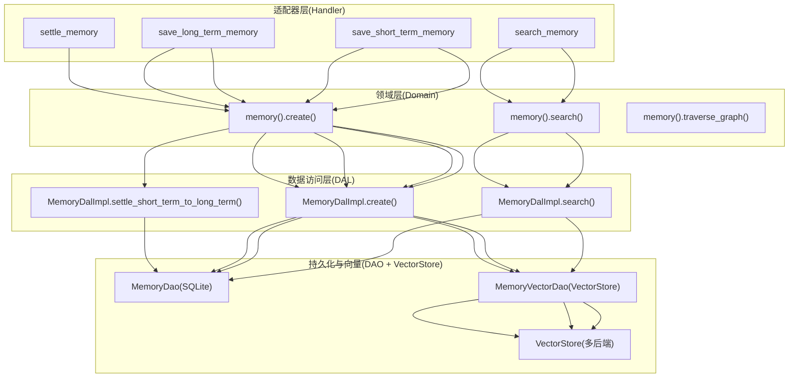
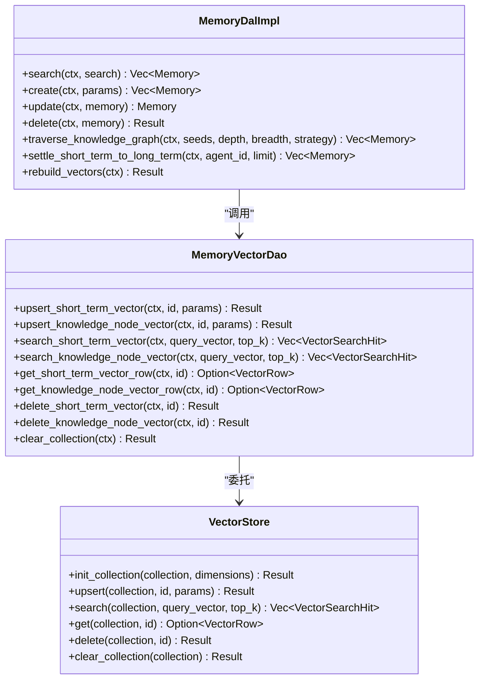
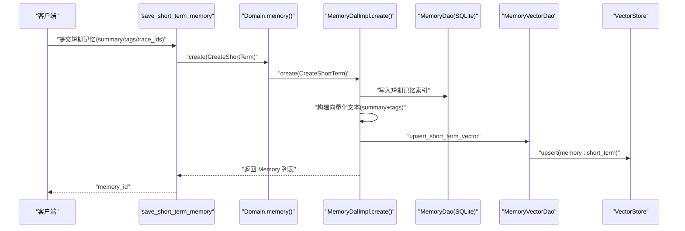
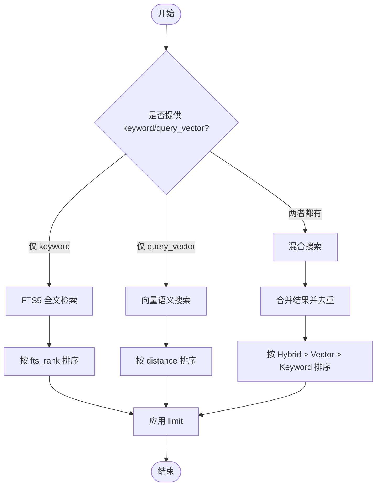
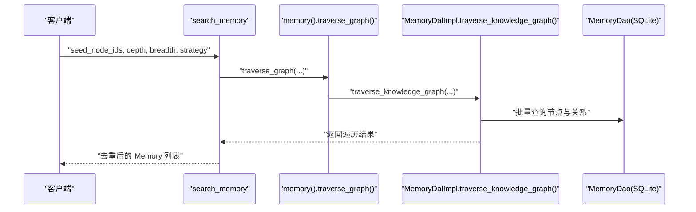
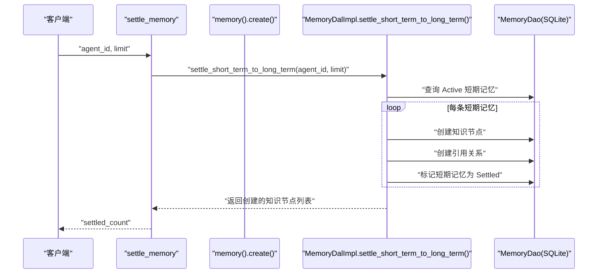
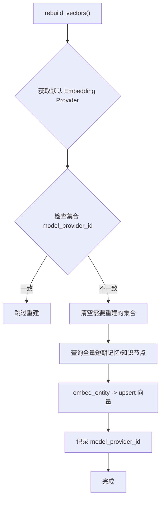
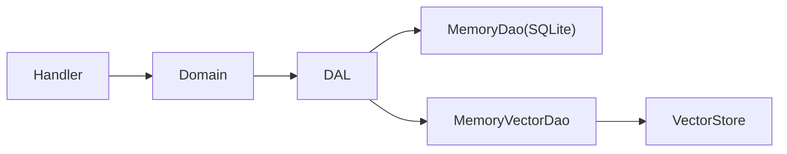

# 记忆系统管理

<cite>
**本文引用的文件**
- [src/service/dal/memory.rs](file://src/service/dal/memory.rs)
- [src/models/memory.rs](file://src/models/memory.rs)
- [common/src/enums/memory.rs](file://common/src/enums/memory.rs)
- [src/service/dao/memory/mod.rs](file://src/service/dao/memory/mod.rs)
- [src/service/dao/memory/vector.rs](file://src/service/dao/memory/vector.rs)
- [src/pkg/storage/vector.rs](file://src/pkg/storage/vector.rs)
- [src/handlers/hr/agent/search_memory.rs](file://src/handlers/hr/agent/search_memory.rs)
- [src/handlers/hr/agent/save_short_term_memory.rs](file://src/handlers/hr/agent/save_short_term_memory.rs)
- [src/handlers/hr/agent/save_long_term_memory.rs](file://src/handlers/hr/agent/save_long_term_memory.rs)
- [src/handlers/hr/agent/settle_memory.rs](file://src/handlers/hr/agent/settle_memory.rs)
- [tests/integration/memory_test.rs](file://tests/integration/memory_test.rs)
</cite>

## 目录
1. [简介](#简介)
2. [项目结构](#项目结构)
3. [核心组件](#核心组件)
4. [架构总览](#架构总览)
5. [详细组件分析](#详细组件分析)
6. [依赖关系分析](#依赖关系分析)
7. [性能考虑](#性能考虑)
8. [故障排查指南](#故障排查指南)
9. [结论](#结论)
10. [附录](#附录)

## 简介
本文件面向 Agent 记忆系统的管理与使用，聚焦短期记忆与长期知识节点的设计、创建、保存、检索与沉淀（Settle）机制；解释向量搜索在语义检索中的应用、存储结构与索引策略、以及监控与调试方法。文档遵循四层单向调用规范：Adapter（HTTP Handler / 公开回调 / AOP Producer）→ Domain → DAL → DAO，确保职责清晰、可维护性强。

## 项目结构
记忆系统涉及的关键路径与职责划分如下：
- Adapter 层（Handler）：对外暴露 HTTP 接口，负责参数校验、上下文提取与结果序列化。
- Domain 层：业务编排入口，统一对外能力（如 search、create、update、delete、traverse_graph）。
- DAL 层（MemoryDal）：跨 DAO 流程编排，包含混合搜索、向量化决策、图谱遍历、沉淀等。
- DAO 层：基础数据访问（SQLite）与向量索引访问（VectorStore 抽象），实现解耦与可替换后端。

图表来源
- [src/handlers/hr/agent/search_memory.rs:24-153](file://src/handlers/hr/agent/search_memory.rs#L24-L153)
- [src/handlers/hr/agent/save_short_term_memory.rs:19-56](file://src/handlers/hr/agent/save_short_term_memory.rs#L19-L56)
- [src/handlers/hr/agent/save_long_term_memory.rs:21-108](file://src/handlers/hr/agent/save_long_term_memory.rs#L21-L108)
- [src/handlers/hr/agent/settle_memory.rs:133-153](file://src/handlers/hr/agent/settle_memory.rs#L133-L153)
- [src/service/dal/memory.rs:190-276](file://src/service/dal/memory.rs#L190-L276)
- [src/service/dal/memory.rs:377-475](file://src/service/dal/memory.rs#L377-L475)
- [src/service/dal/memory.rs:578-652](file://src/service/dal/memory.rs#L578-L652)
- [src/service/dao/memory/vector.rs:37-147](file://src/service/dao/memory/vector.rs#L37-L147)
- [src/pkg/storage/vector.rs:23-74](file://src/pkg/storage/vector.rs#L23-L74)

章节来源
- [src/handlers/hr/agent/search_memory.rs:24-153](file://src/handlers/hr/agent/search_memory.rs#L24-L153)
- [src/handlers/hr/agent/save_short_term_memory.rs:19-56](file://src/handlers/hr/agent/save_short_term_memory.rs#L19-L56)
- [src/handlers/hr/agent/save_long_term_memory.rs:21-108](file://src/handlers/hr/agent/save_long_term_memory.rs#L21-L108)
- [src/handlers/hr/agent/settle_memory.rs:133-153](file://src/handlers/hr/agent/settle_memory.rs#L133-L153)
- [src/service/dal/memory.rs:190-276](file://src/service/dal/memory.rs#L190-L276)
- [src/service/dal/memory.rs:377-475](file://src/service/dal/memory.rs#L377-L475)
- [src/service/dal/memory.rs:578-652](file://src/service/dal/memory.rs#L578-L652)
- [src/service/dao/memory/vector.rs:37-147](file://src/service/dao/memory/vector.rs#L37-L147)
- [src/pkg/storage/vector.rs:23-74](file://src/pkg/storage/vector.rs#L23-L74)

## 核心组件
- 模型与枚举
  - MemoryTrace：原始思考闭环记录，写入每日 JSONL，不向量化。
  - ShortTermMemoryIndexPo：短期记忆索引，摘要+标签，支持全文与向量检索。
  - LongTermKnowledgeNodePo：长期知识节点，描述+摘要+标签，支持全文与向量检索。
  - KnowledgeReferencePo：知识节点对原始细节的引用定位。
  - MemoryStatus/MemoryType/KnowledgeRelationType：状态、类型与关系枚举。
- DAL（MemoryDalImpl）
  - 统一搜索：关键词（FTS5）+ 向量语义搜索，按匹配类型与距离排序。
  - 创建/更新/删除：ShortTerm/KnowledgeNode 自动向量化或级联清理。
  - 图谱遍历：BFS/DFS 从种子节点展开，返回相关节点与关系。
  - 沉淀：将 Active 短期记忆总结为长期知识节点并标记已沉淀。
  - 重建向量：根据当前 Embedding Provider 判断是否需要清空并重建集合。
- DAO（MemoryVectorDao + VectorStore）
  - 向量集合命名空间：memory:short_term、memory:knowledge_node。
  - 统一 upsert/search/get/delete/clear_collection，支持多后端（HNSW/SqliteVss/InMemory）。

章节来源
- [src/models/memory.rs:15-424](file://src/models/memory.rs#L15-L424)
- [common/src/enums/memory.rs:12-212](file://common/src/enums/memory.rs#L12-L212)
- [src/service/dal/memory.rs:72-177](file://src/service/dal/memory.rs#L72-L177)
- [src/service/dao/memory/mod.rs:45-558](file://src/service/dao/memory/mod.rs#L45-L558)
- [src/service/dao/memory/vector.rs:1-148](file://src/service/dao/memory/vector.rs#L1-L148)
- [src/pkg/storage/vector.rs:1-74](file://src/pkg/storage/vector.rs#L1-L74)

## 架构总览
记忆系统采用“业务实体 + 搜索匹配信息”的统一输出模型，DAL 层负责组合多种检索源并按优先级排序，DAO 层屏蔽底层存储差异，VectorStore 提供可插拔后端。

图表来源
- [src/service/dal/memory.rs:72-177](file://src/service/dal/memory.rs#L72-L177)
- [src/service/dao/memory/vector.rs:37-147](file://src/service/dao/memory/vector.rs#L37-L147)
- [src/pkg/storage/vector.rs:23-74](file://src/pkg/storage/vector.rs#L23-L74)

## 详细组件分析

### 短期记忆与长期知识节点设计
- 短期记忆（ShortTermMemoryIndexPo）
  - 字段：摘要、标签、trace_ids、状态等。
  - 向量化文本：summary + tags（展平为空格分隔文本）。
  - 集合命名：memory:short_term。
- 长期知识节点（LongTermKnowledgeNodePo）
  - 字段：节点名称、描述、类型、摘要、标签、是否发布等。
  - 向量化文本：node_description + summary + tags。
  - 集合命名：memory:knowledge_node。
- 关系与引用
  - KnowledgeNodeRelationPo：节点间关系（包含、依赖、因果等）。
  - KnowledgeReferencePo：知识节点到原始细节的定位（date_path + line_number）。

章节来源
- [src/models/memory.rs:158-320](file://src/models/memory.rs#L158-L320)
- [common/src/enums/memory.rs:96-182](file://common/src/enums/memory.rs#L96-L182)

### 记忆的创建、保存与更新
- 创建短期记忆
  - Handler 构造 ShortTermMemoryIndexPo，调用 DAL create(CreateShortTerm)。
  - DAL 写库后尝试向量化 summary+tags；失败降级为 warn。
- 创建长期知识节点
  - Handler 构造 LongTermKnowledgeNodePo，可选 relations。
  - DAL 写库后尝试向量化 node_description+summary+tags；失败降级为 warn。
- 更新
  - 仅支持 ShortTerm/KnowledgeNode，更新 SQLite 后重新向量化。
- 删除
  - ShortTerm：软删除索引 + 删除向量索引。
  - KnowledgeNode：级联删除关系与引用 + 删除向量索引。

图表来源
- [src/handlers/hr/agent/save_short_term_memory.rs:19-56](file://src/handlers/hr/agent/save_short_term_memory.rs#L19-L56)
- [src/service/dal/memory.rs:377-430](file://src/service/dal/memory.rs#L377-L430)
- [src/service/dao/memory/vector.rs:37-51](file://src/service/dao/memory/vector.rs#L37-L51)
- [src/pkg/storage/vector.rs:27-33](file://src/pkg/storage/vector.rs#L27-L33)

章节来源
- [src/handlers/hr/agent/save_short_term_memory.rs:19-56](file://src/handlers/hr/agent/save_short_term_memory.rs#L19-L56)
- [src/handlers/hr/agent/save_long_term_memory.rs:21-108](file://src/handlers/hr/agent/save_long_term_memory.rs#L21-L108)
- [src/service/dal/memory.rs:377-475](file://src/service/dal/memory.rs#L377-L475)

### 检索与混合搜索
- 统一搜索入参 MemorySearch
  - keyword：关键词（FTS5）。
  - query_vector：查询向量（DAL 填充）。
  - top_k：Top K。
  - vector_distance_threshold：距离阈值过滤。
  - filters：复用 MemoryQuery（agent_id、task_id、tags、limit、include_shared 等）。
- 搜索策略
  - 仅 keyword：走传统全文检索。
  - 仅 query_vector：走向量语义搜索。
  - 两者都有：混合搜索，合并结果并按 Hybrid > Vector > Keyword/None 排序。
- 结果排序
  - Hybrid/Vector 按向量距离升序。
  - Keyword 按 fts_rank 升序（BM25 越小越相关）。

图表来源
- [src/service/dao/memory/mod.rs:45-58](file://src/service/dao/memory/mod.rs#L45-L58)
- [src/service/dal/memory.rs:190-276](file://src/service/dal/memory.rs#L190-L276)

章节来源
- [src/service/dao/memory/mod.rs:45-58](file://src/service/dao/memory/mod.rs#L45-L58)
- [src/service/dal/memory.rs:190-276](file://src/service/dal/memory.rs#L190-L276)

### 知识图谱遍历
- 支持 BFS/DFS 两种策略。
- 从种子节点出发，限制最大深度与每层最大展开数。
- 返回遍历到的所有 Memory（KnowledgeNode 和 Relation）。

图表来源
- [src/handlers/hr/agent/search_memory.rs:67-121](file://src/handlers/hr/agent/search_memory.rs#L67-L121)
- [src/service/dal/memory.rs:518-576](file://src/service/dal/memory.rs#L518-L576)

章节来源
- [src/handlers/hr/agent/search_memory.rs:67-121](file://src/handlers/hr/agent/search_memory.rs#L67-L121)
- [src/service/dal/memory.rs:518-576](file://src/service/dal/memory.rs#L518-L576)

### 沉淀（Settle）机制
- 触发方式：Handler settle_memory 调用 load_and_settle。
- DAL 流程
  - 查询 Agent 的 Active 短期记忆（limit）。
  - 为每条短期记忆创建 LongTermKnowledgeNodePo（以 summary 作为节点描述）。
  - 创建引用关系（关联原始短期记忆）。
  - 将短期记忆状态标记为 Settled。
- 日志与统计：记录处理条数与成功沉淀数量。

图表来源
- [src/handlers/hr/agent/settle_memory.rs:133-153](file://src/handlers/hr/agent/settle_memory.rs#L133-L153)
- [src/service/dal/memory.rs:578-652](file://src/service/dal/memory.rs#L578-L652)

章节来源
- [src/handlers/hr/agent/settle_memory.rs:133-153](file://src/handlers/hr/agent/settle_memory.rs#L133-L153)
- [src/service/dal/memory.rs:578-652](file://src/service/dal/memory.rs#L578-L652)

### 向量搜索与优化
- 向量化文本
  - 短期记忆：summary + tags（展平）。
  - 知识节点：node_description + summary + tags。
- 向量存储后端
  - SqliteVssStore：基于 SQLite vss0 扩展，高效相似性搜索。
  - HnswStore：纯 Rust HNSW 索引，零系统依赖。
  - InMemory：内存模式，适合测试与轻量场景。
- 重建向量
  - 检查当前 Embedding Provider 与集合记录的 model_provider_id。
  - 不一致则清空集合，逐条 embed 并 upsert，最后记录 provider_id。

图表来源
- [src/service/dal/memory.rs:654-799](file://src/service/dal/memory.rs#L654-L799)
- [src/pkg/storage/vector.rs:59-74](file://src/pkg/storage/vector.rs#L59-L74)

章节来源
- [src/service/dal/memory.rs:654-799](file://src/service/dal/memory.rs#L654-L799)
- [src/pkg/storage/vector.rs:59-74](file://src/pkg/storage/vector.rs#L59-L74)

### API 使用示例
- 创建短期记忆
  - 接口：POST /api/v1/hr/agents/save_short_term_memory
  - 入参：summary、tags、trace_ids、task_id
  - 行为：写库 + 向量化 summary+tags
  - 参考路径：[save_short_term_memory:19-56](file://src/handlers/hr/agent/save_short_term_memory.rs#L19-L56)
- 创建长期知识节点
  - 接口：POST /api/v1/hr/agents/save_long_term_memory
  - 入参：node_name、node_description、node_type、summary、tags、relations
  - 行为：写库 + 向量化 node_description+summary+tags，可选创建关系
  - 参考路径：[save_long_term_memory:21-108](file://src/handlers/hr/agent/save_long_term_memory.rs#L21-L108)
- 搜索记忆
  - 接口：POST /api/v1/hr/agents/search_memory
  - 入参：query、memory_type、max_results、tags、task_id、agent_id、seed_node_ids、traversal_*
  - 行为：关键词/向量/混合搜索，支持图谱遍历
  - 参考路径：[search_memory:24-153](file://src/handlers/hr/agent/search_memory.rs#L24-L153)
- 查询记忆
  - 接口：POST /api/v1/hr/agents/query_memory
  - 入参：memory_type、agent_id、task_id、tags、limit 等
  - 行为：纯数据库查询（无向量）
  - 参考路径：[query_memory:21-40](file://src/handlers/hr/agent/query_memory.rs#L21-L40)
- 沉淀短期记忆
  - 接口：POST /api/v1/hr/agents/settle_memory
  - 入参：agent_id、limit
  - 行为：Active 短期记忆 → 知识节点 + 引用 + 标记 Settled
  - 参考路径：[settle_memory:133-153](file://src/handlers/hr/agent/settle_memory.rs#L133-L153)

章节来源
- [src/handlers/hr/agent/save_short_term_memory.rs:19-56](file://src/handlers/hr/agent/save_short_term_memory.rs#L19-L56)
- [src/handlers/hr/agent/save_long_term_memory.rs:21-108](file://src/handlers/hr/agent/save_long_term_memory.rs#L21-L108)
- [src/handlers/hr/agent/search_memory.rs:24-153](file://src/handlers/hr/agent/search_memory.rs#L24-L153)
- [src/handlers/hr/agent/query_memory.rs:21-40](file://src/handlers/hr/agent/query_memory.rs#L21-L40)
- [src/handlers/hr/agent/settle_memory.rs:133-153](file://src/handlers/hr/agent/settle_memory.rs#L133-L153)

## 依赖关系分析
- 模块耦合
  - Handler 依赖 Domain 能力，Domain 依赖 DAL，DAL 依赖 DAO 与 VectorStore。
  - VectorStore 抽象使 DAL/DAO 与具体后端解耦，便于切换与降级。
- 外部依赖
  - SQLite（FTS5）、DuckDB（统计）、LanceDB/HNSW/SqliteVss（向量）。
- 潜在循环依赖
  - 通过 Trait 与 Arc 单例避免直接循环；DAL 持有多个 DAO 的 Arc 引用。

图表来源
- [src/service/dal/memory.rs:41-68](file://src/service/dal/memory.rs#L41-L68)
- [src/service/dao/memory/vector.rs:13-28](file://src/service/dao/memory/vector.rs#L13-L28)
- [src/pkg/storage/vector.rs:23-74](file://src/pkg/storage/vector.rs#L23-L74)

章节来源
- [src/service/dal/memory.rs:41-68](file://src/service/dal/memory.rs#L41-L68)
- [src/service/dao/memory/vector.rs:13-28](file://src/service/dao/memory/vector.rs#L13-L28)
- [src/pkg/storage/vector.rs:23-74](file://src/pkg/storage/vector.rs#L23-L74)

## 性能考虑
- 混合搜索排序
  - Hybrid > Vector > Keyword，减少无关结果干扰。
- 向量重建
  - 仅在 model_provider_id 变化时重建，避免重复计算。
- 向后端降级
  - 向量失败仅 warn，不影响主流程；必要时回退到 FTS5。
- 图谱遍历
  - 限制 max_depth 与 max_breadth，防止爆炸式展开。
- 存储选择
  - HNSW 推荐用于高性能；SqliteVss 需系统依赖但集成简单；InMemory 用于测试。

## 故障排查指南
- 向量索引失败
  - 现象：向量化失败或 upsert 失败。
  - 排查：查看日志中的 vector_index 警告；确认 Embedding Provider 可用；必要时执行 rebuild_vectors。
  - 参考路径：[DAL 更新/删除向量索引:392-475](file://src/service/dal/memory.rs#L392-L475)
- 搜索结果为空
  - 现象：keyword 或 query_vector 为空导致无结果。
  - 排查：确认 MemorySearch.filters 是否正确设置；检查 include_shared 与 agent_id/task_id 过滤。
  - 参考路径：[DAL 搜索逻辑:190-276](file://src/service/dal/memory.rs#L190-L276)
- 沉淀未生效
  - 现象：短期记忆未转为知识节点。
  - 排查：确认短期记忆状态为 Active；检查 limit 与日志输出；验证引用关系是否创建。
  - 参考路径：[DAL 沉淀逻辑:578-652](file://src/service/dal/memory.rs#L578-L652)
- 集成测试验证
  - 使用 tests/integration/memory_test.rs 进行端到端验证（含向量语义搜索用例）。
  - 参考路径：[集成测试:179-219](file://tests/integration/memory_test.rs#L179-L219)

章节来源
- [src/service/dal/memory.rs:392-475](file://src/service/dal/memory.rs#L392-L475)
- [src/service/dal/memory.rs:190-276](file://src/service/dal/memory.rs#L190-L276)
- [src/service/dal/memory.rs:578-652](file://src/service/dal/memory.rs#L578-L652)
- [tests/integration/memory_test.rs:179-219](file://tests/integration/memory_test.rs#L179-L219)

## 结论
记忆系统通过 DAL 统一编排、DAO 解耦存储、VectorStore 可插拔后端，实现了短期记忆与长期知识节点的完整生命周期管理。混合搜索与图谱遍历提升了检索质量与可探索性；沉淀机制将活跃经验转化为结构化知识；重建与降级策略保障稳定性。建议在生产环境优先使用 HNSW 后端，并结合 FTS5 与向量阈值调优以获得最佳效果。

## 附录
- 监控与调试
  - 运行时统计：pkg/stats/runtime 提供内存统计收集器，适用于 AOP/SSE/Channel 等实时指标。
  - 持久化统计：pkg/stats 基于 DuckDB，支持复杂 SQL 查询。
  - 向量后端：SqliteVssStore/HnswStore/InMemory，可根据环境与性能需求切换。
- 最佳实践
  - 合理设置 top_k 与 vector_distance_threshold，平衡召回与精度。
  - 定期执行 rebuild_vectors，确保向量与当前 Embedding Provider 一致。
  - 图谱遍历时限制深度与广度，避免资源耗尽。