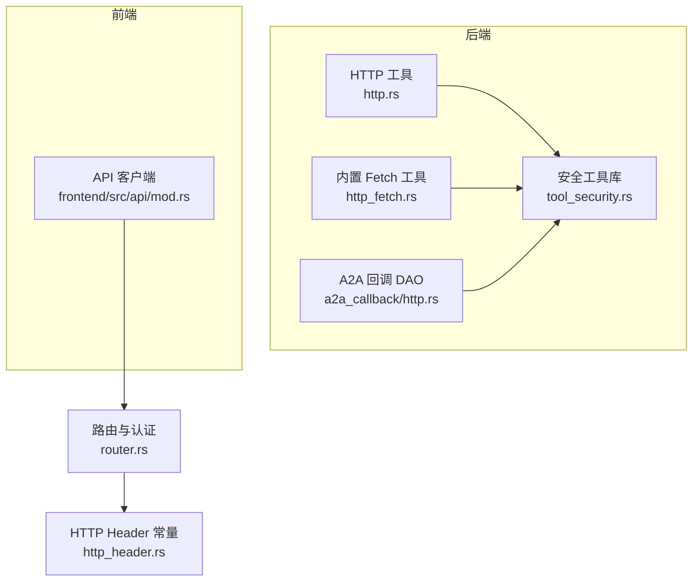
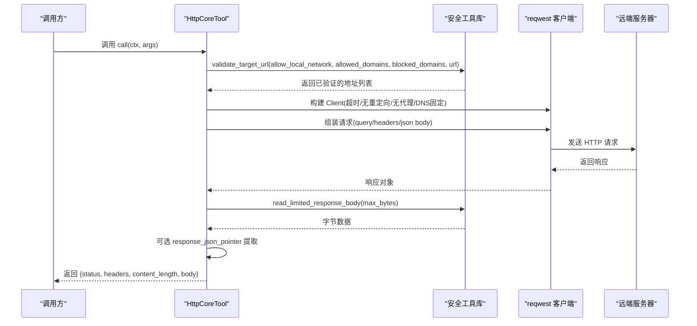
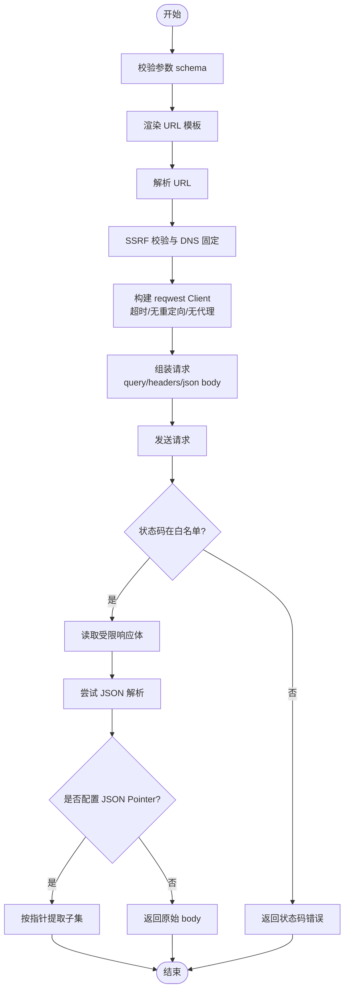
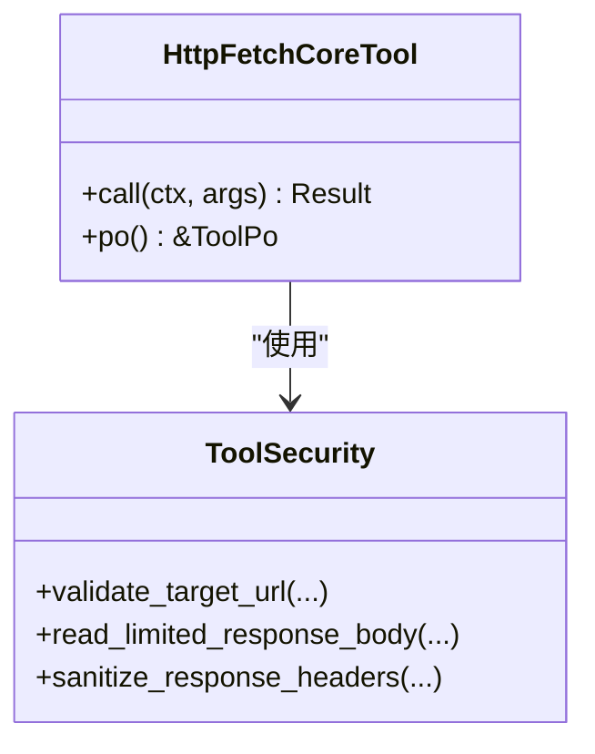
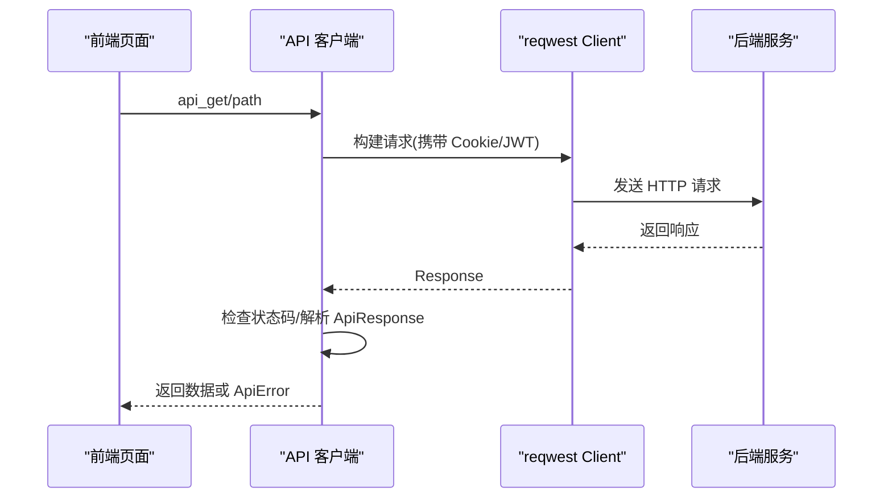
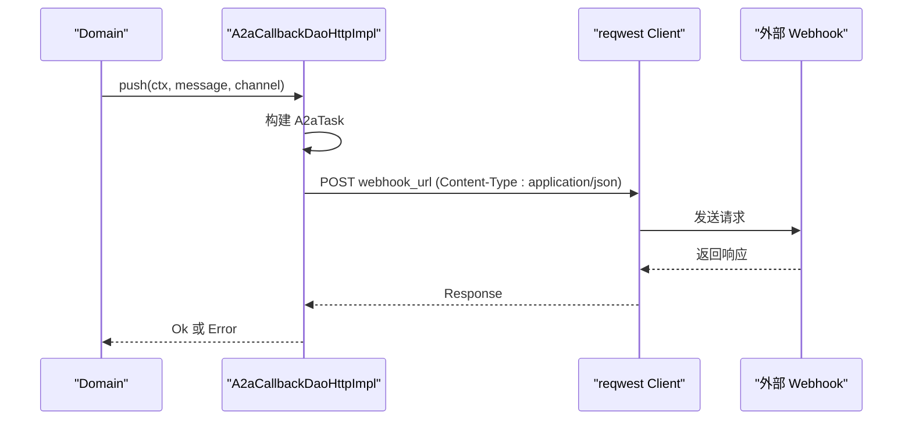
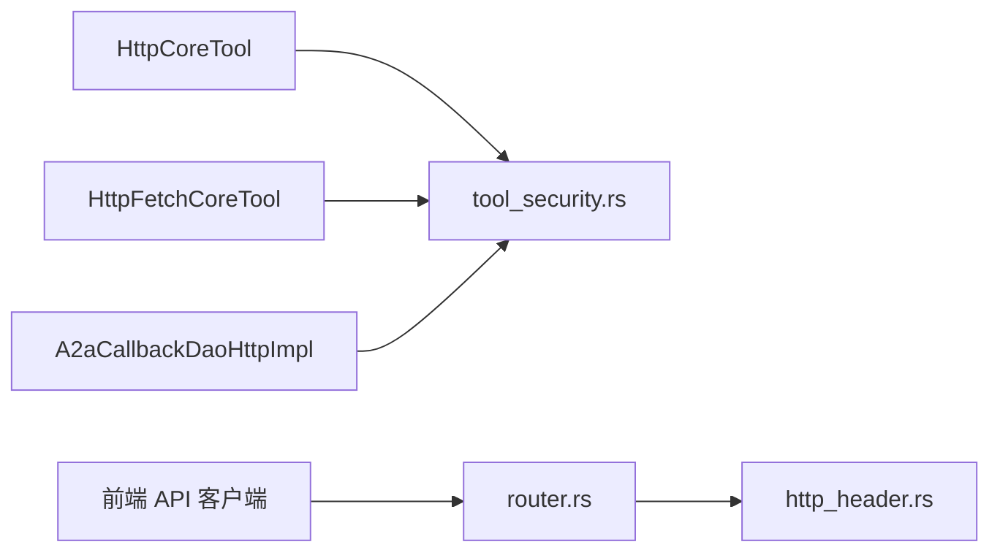

# HTTP 客户端工具

<cite>
**本文引用的文件**
- [src/pkg/tool_registry/http.rs](file://src/pkg/tool_registry/http.rs)
- [src/pkg/tool_registry/http_fetch.rs](file://src/pkg/tool_registry/http_fetch.rs)
- [src/pkg/tool_registry/tool_security.rs](file://src/pkg/tool_registry/tool_security.rs)
- [src/pkg/tool_registry/http_tests.rs](file://src/pkg/tool_registry/http_tests.rs)
- [frontend/src/api/mod.rs](file://frontend/src/api/mod.rs)
- [src/service/dao/a2a_callback/http.rs](file://src/service/dao/a2a_callback/http.rs)
- [common/src/constants/http_header.rs](file://common/src/constants/http_header.rs)
- [docs/request_context_design.md](file://docs/request_context_design.md)
- [src/router.rs](file://src/router.rs)
</cite>

## 目录
1. [简介](#简介)
2. [项目结构](#项目结构)
3. [核心组件](#核心组件)
4. [架构总览](#架构总览)
5. [详细组件分析](#详细组件分析)
6. [依赖关系分析](#依赖关系分析)
7. [性能考量](#性能考量)
8. [故障排查指南](#故障排查指南)
9. [结论](#结论)
10. [附录](#附录)

## 简介
本文件面向本项目中的“HTTP 客户端工具”能力，覆盖后端与前端两端的 HTTP 调用实现、安全策略、配置项、错误处理与性能优化。后端通过可配置的 HTTP 工具（数据库注册）和内置的 fetch 工具对外发起请求；前端提供统一的 API 客户端封装，支持 GET/POST/PUT/DELETE、表单上传、分页 URL 构建等。所有外部网络访问均受 SSRF 防护、域名白名单/黑名单、本地网络限制、响应大小限制、超时限制与重定向控制等约束。

## 项目结构
- 后端 HTTP 工具：
  - 协议级 HTTP 工具：从 ToolPo 配置驱动执行，支持模板化 URL/Headers/Query/Body、状态码白名单、JSON Pointer 提取、SSRF 校验与 DNS 固定。
  - 内置 HTTP Fetch 工具：仅允许 HTTPS 公共地址，默认拒绝本地网络，具备相同的安全与限制策略。
  - 安全工具库：统一提供 SSRF 检查、域名匹配、敏感头脱敏、响应体大小限制、URL 模板边界校验等。
- 前端 HTTP 客户端：
  - 统一封装 reqwest Client，提供 GET/POST/PUT/DELETE、文本获取、multipart 上传、分页 URL 构建、统一错误类型与 401 处理。
- A2A 回调 DAO：
  - 使用 reqwest 将内部消息转换为 A2A Task 并 POST 到外部 webhook，带超时与错误包装。
- 路由与认证：
  - 路由层定义公开与保护端点，JWT 中间件与 RequestContext 注入用户上下文。

**图表来源**
- [src/pkg/tool_registry/http.rs:126-220](file://src/pkg/tool_registry/http.rs#L126-L220)
- [src/pkg/tool_registry/http_fetch.rs:60-138](file://src/pkg/tool_registry/http_fetch.rs#L60-L138)
- [src/pkg/tool_registry/tool_security.rs:92-170](file://src/pkg/tool_registry/tool_security.rs#L92-L170)
- [src/service/dao/a2a_callback/http.rs:43-145](file://src/service/dao/a2a_callback/http.rs#L43-L145)
- [frontend/src/api/mod.rs:26-45](file://frontend/src/api/mod.rs#L26-L45)
- [src/router.rs:12-37](file://src/router.rs#L12-L37)
- [common/src/constants/http_header.rs:1-19](file://common/src/constants/http_header.rs#L1-L19)

**章节来源**
- [src/pkg/tool_registry/http.rs:126-220](file://src/pkg/tool_registry/http.rs#L126-L220)
- [src/pkg/tool_registry/http_fetch.rs:60-138](file://src/pkg/tool_registry/http_fetch.rs#L60-L138)
- [src/pkg/tool_registry/tool_security.rs:92-170](file://src/pkg/tool_registry/tool_security.rs#L92-L170)
- [src/service/dao/a2a_callback/http.rs:43-145](file://src/service/dao/a2a_callback/http.rs#L43-L145)
- [frontend/src/api/mod.rs:26-45](file://frontend/src/api/mod.rs#L26-L45)
- [src/router.rs:12-37](file://src/router.rs#L12-L37)
- [common/src/constants/http_header.rs:1-19](file://common/src/constants/http_header.rs#L1-L19)

## 核心组件
- 协议级 HTTP 工具（HttpCoreTool）
  - 从 ToolPo.config 解析 HttpToolConfig，支持 method/url/headers/query/body/timeout_ms/response_max_bytes/allowed_status_codes/response_json_pointer/allowed_domains/blocked_domains/allow_local_network。
  - 执行流程：参数校验 → 模板渲染 → 目标 URL 校验与 DNS 固定 → 构建 reqwest Client（禁用重定向、关闭代理、设置超时）→ 组装请求（query/headers/json body）→ 发送 → 校验状态码 → 读取受限响应体 → JSON Pointer 提取 → 返回结构化结果。
- 内置 HTTP Fetch 工具（HttpFetchCoreTool）
  - 仅接受 HTTPS URL，默认禁止本地网络，复用安全工具库进行 SSRF 防护与响应限制。
- 安全工具库（tool_security.rs）
  - 提供默认与硬上限的超时与响应大小、本地网络 IP/Host 判定、域名匹配、DNS 解析后地址校验、敏感头识别与脱敏、响应体流式读取限制、URL 模板边界校验与占位符校验。
- 前端 API 客户端
  - 单例 reqwest Client，统一构造请求、自动 401 处理、统一错误类型 ApiError、支持 multipart 上传与分页 URL 构建。
- A2A 回调 DAO
  - 将内部消息序列化为 A2A Task，POST 到外部 webhook，带超时与错误包装。

**章节来源**
- [src/pkg/tool_registry/http.rs:41-114](file://src/pkg/tool_registry/http.rs#L41-L114)
- [src/pkg/tool_registry/http.rs:126-220](file://src/pkg/tool_registry/http.rs#L126-L220)
- [src/pkg/tool_registry/http_fetch.rs:19-52](file://src/pkg/tool_registry/http_fetch.rs#L19-L52)
- [src/pkg/tool_registry/http_fetch.rs:60-138](file://src/pkg/tool_registry/http_fetch.rs#L60-L138)
- [src/pkg/tool_registry/tool_security.rs:8-15](file://src/pkg/tool_registry/tool_security.rs#L8-L15)
- [src/pkg/tool_registry/tool_security.rs:92-170](file://src/pkg/tool_registry/tool_security.rs#L92-L170)
- [src/pkg/tool_registry/tool_security.rs:172-231](file://src/pkg/tool_registry/tool_security.rs#L172-L231)
- [frontend/src/api/mod.rs:26-45](file://frontend/src/api/mod.rs#L26-L45)
- [frontend/src/api/mod.rs:87-174](file://frontend/src/api/mod.rs#L87-L174)
- [frontend/src/api/mod.rs:320-403](file://frontend/src/api/mod.rs#L320-L403)
- [src/service/dao/a2a_callback/http.rs:43-145](file://src/service/dao/a2a_callback/http.rs#L43-L145)

## 架构总览
后端 HTTP 工具以“配置驱动 + 安全前置校验”的方式组织：ToolPo 中存储 HttpToolConfig，运行时解析并执行；所有外部网络访问必须通过安全工具库的 SSRF 防护、域名策略与 DNS 固定。前端则通过统一客户端封装简化调用，集中处理认证、错误与上传。

**图表来源**
- [src/pkg/tool_registry/http.rs:126-220](file://src/pkg/tool_registry/http.rs#L126-L220)
- [src/pkg/tool_registry/tool_security.rs:92-170](file://src/pkg/tool_registry/tool_security.rs#L92-L170)
- [src/pkg/tool_registry/tool_security.rs:200-231](file://src/pkg/tool_registry/tool_security.rs#L200-L231)

**章节来源**
- [src/pkg/tool_registry/http.rs:126-220](file://src/pkg/tool_registry/http.rs#L126-L220)
- [src/pkg/tool_registry/tool_security.rs:92-170](file://src/pkg/tool_registry/tool_security.rs#L92-L170)

## 详细组件分析

### 后端 HTTP 工具（HttpCoreTool）
- 功能特性
  - 支持的 HTTP 方法：GET、POST（当前实现未包含 PUT/DELETE）。
  - 请求头配置：支持模板化 headers 对象，键名需为合法 HeaderName，值需为合法 HeaderValue。
  - 请求体序列化：POST 时支持 JSON 序列化 body。
  - 响应处理机制：读取受限响应体，尝试 JSON 解析，失败回退为字符串；支持 JSON Pointer 提取子集。
  - 连接池管理：每次调用创建独立 reqwest::Client（无连接复用），可通过外部工厂或上层缓存复用提升性能。
  - 超时配置：per-tool timeout_ms，默认与硬上限由安全库提供。
  - 重试策略：未实现自动重试；可通过上层逻辑实现。
  - 错误处理：网络错误、非法模板、非法头、状态码不在白名单、响应过大等均会返回错误。
  - 认证支持：通过 headers 模板注入 Authorization 等头部；不支持 Basic Auth 专用字段。
  - SSL/TLS 配置：基于系统信任链，未暴露自定义 CA/证书选项。
  - 代理设置：显式关闭代理 no_proxy()。
  - SSRF 防护：域名白名单/黑名单、本地网络限制、DNS 解析后地址校验、DNS 固定 resolve_to_addrs。
  - 重定向策略：默认不跟随重定向。

**图表来源**
- [src/pkg/tool_registry/http.rs:126-220](file://src/pkg/tool_registry/http.rs#L126-L220)
- [src/pkg/tool_registry/http.rs:222-228](file://src/pkg/tool_registry/http.rs#L222-L228)
- [src/pkg/tool_registry/http.rs:369-392](file://src/pkg/tool_registry/http.rs#L369-L392)
- [src/pkg/tool_registry/tool_security.rs:200-231](file://src/pkg/tool_registry/tool_security.rs#L200-L231)

**章节来源**
- [src/pkg/tool_registry/http.rs:41-114](file://src/pkg/tool_registry/http.rs#L41-L114)
- [src/pkg/tool_registry/http.rs:126-220](file://src/pkg/tool_registry/http.rs#L126-L220)
- [src/pkg/tool_registry/http.rs:222-228](file://src/pkg/tool_registry/http.rs#L222-L228)
- [src/pkg/tool_registry/http.rs:369-392](file://src/pkg/tool_registry/http.rs#L369-L392)
- [src/pkg/tool_registry/tool_security.rs:200-231](file://src/pkg/tool_registry/tool_security.rs#L200-L231)

### 内置 HTTP Fetch 工具（HttpFetchCoreTool）
- 功能特性
  - 仅支持 HTTPS URL，默认拒绝本地网络与私有 IP。
  - 使用安全工具库进行 SSRF 防护与响应限制。
  - 返回结构化结果：status、headers（敏感头脱敏）、content_length、body。

**图表来源**
- [src/pkg/tool_registry/http_fetch.rs:60-138](file://src/pkg/tool_registry/http_fetch.rs#L60-L138)
- [src/pkg/tool_registry/tool_security.rs:92-170](file://src/pkg/tool_registry/tool_security.rs#L92-L170)
- [src/pkg/tool_registry/tool_security.rs:172-231](file://src/pkg/tool_registry/tool_security.rs#L172-L231)

**章节来源**
- [src/pkg/tool_registry/http_fetch.rs:19-52](file://src/pkg/tool_registry/http_fetch.rs#L19-L52)
- [src/pkg/tool_registry/http_fetch.rs:60-138](file://src/pkg/tool_registry/http_fetch.rs#L60-L138)

### 前端 API 客户端
- 功能特性
  - 统一 Client 单例，减少连接开销。
  - 支持 GET/POST/PUT/DELETE、文本获取、multipart 上传。
  - 统一错误类型 ApiError，包含 http_status、error_code、message。
  - 401 处理：清除登录态并重定向至登录页。
  - 分页 URL 构建与 query string 构建工具函数。

**图表来源**
- [frontend/src/api/mod.rs:26-45](file://frontend/src/api/mod.rs#L26-L45)
- [frontend/src/api/mod.rs:87-174](file://frontend/src/api/mod.rs#L87-L174)
- [frontend/src/api/mod.rs:320-403](file://frontend/src/api/mod.rs#L320-L403)

**章节来源**
- [frontend/src/api/mod.rs:26-45](file://frontend/src/api/mod.rs#L26-L45)
- [frontend/src/api/mod.rs:87-174](file://frontend/src/api/mod.rs#L87-L174)
- [frontend/src/api/mod.rs:320-403](file://frontend/src/api/mod.rs#L320-L403)

### A2A 回调 DAO
- 功能特性
  - 将内部消息转换为 A2A Task，POST 到外部 webhook。
  - 超时与错误包装，非成功状态码返回错误。

**图表来源**
- [src/service/dao/a2a_callback/http.rs:43-145](file://src/service/dao/a2a_callback/http.rs#L43-L145)

**章节来源**
- [src/service/dao/a2a_callback/http.rs:43-145](file://src/service/dao/a2a_callback/http.rs#L43-L145)

## 依赖关系分析
- 后端 HTTP 工具依赖安全工具库进行 SSRF 防护、响应限制与头部脱敏。
- 前端 API 客户端依赖 reqwest 与 web_sys（WASM 环境），并通过路由层中间件完成认证与上下文注入。
- A2A 回调 DAO 依赖 reqwest 与业务领域模型转换。

**图表来源**
- [src/pkg/tool_registry/http.rs:126-220](file://src/pkg/tool_registry/http.rs#L126-L220)
- [src/pkg/tool_registry/http_fetch.rs:60-138](file://src/pkg/tool_registry/http_fetch.rs#L60-L138)
- [src/service/dao/a2a_callback/http.rs:43-145](file://src/service/dao/a2a_callback/http.rs#L43-L145)
- [frontend/src/api/mod.rs:26-45](file://frontend/src/api/mod.rs#L26-L45)
- [src/router.rs:12-37](file://src/router.rs#L12-L37)
- [common/src/constants/http_header.rs:1-19](file://common/src/constants/http_header.rs#L1-L19)

**章节来源**
- [src/pkg/tool_registry/http.rs:126-220](file://src/pkg/tool_registry/http.rs#L126-L220)
- [src/pkg/tool_registry/http_fetch.rs:60-138](file://src/pkg/tool_registry/http_fetch.rs#L60-L138)
- [src/service/dao/a2a_callback/http.rs:43-145](file://src/service/dao/a2a_callback/http.rs#L43-L145)
- [frontend/src/api/mod.rs:26-45](file://frontend/src/api/mod.rs#L26-L45)
- [src/router.rs:12-37](file://src/router.rs#L12-L37)
- [common/src/constants/http_header.rs:1-19](file://common/src/constants/http_header.rs#L1-L19)

## 性能考量
- 连接复用
  - 后端 HTTP 工具每次调用创建独立 Client，未启用连接池复用；若高频调用建议在上层缓存 Client 实例或使用连接池。
  - 前端使用 OnceLock 单例 Client，天然复用连接。
- 超时与响应限制
  - 默认超时与最大响应体大小由安全库提供，可按 per-tool 配置调整。
- 并发控制
  - 未内置限流；可在上层通过任务队列或信号量控制并发。
- 缓存策略
  - 未内置 HTTP 缓存；可在上层根据业务需求实现。
- 流式数据处理
  - 响应体按 chunk 读取并限制大小，适合大响应场景；如需流式处理，可在上层消费响应流。

[本节为通用指导，无需特定文件引用]

## 故障排查指南
- 网络异常
  - 现象：请求失败，错误信息包含“http request failed”。
  - 排查：检查 URL 模板是否正确、域名是否在白名单、本地网络是否允许、DNS 解析是否成功。
  - 参考：[src/pkg/tool_registry/http.rs:126-183](file://src/pkg/tool_registry/http.rs#L126-L183)、[src/pkg/tool_registry/tool_security.rs:92-170](file://src/pkg/tool_registry/tool_security.rs#L92-L170)
- 超时处理
  - 现象：请求超时，错误信息包含超时相关描述。
  - 排查：检查 per-tool timeout_ms 是否合理，确认默认与硬上限。
  - 参考：[src/pkg/tool_registry/http.rs:56-57](file://src/pkg/tool_registry/http.rs#L56-L57)、[src/pkg/tool_registry/tool_security.rs:8-15](file://src/pkg/tool_registry/tool_security.rs#L8-L15)
- 证书验证问题
  - 现象：HTTPS 连接失败，证书相关错误。
  - 排查：确认系统信任链正确，必要时在应用层配置 CA 或禁用验证（谨慎使用）。
  - 参考：[src/pkg/tool_registry/http.rs:149-157](file://src/pkg/tool_registry/http.rs#L149-L157)
- 重定向问题
  - 现象：收到 3xx 状态码，错误提示“unexpected http status code”。
  - 排查：确认是否允许重定向，当前默认不跟随。
  - 参考：[src/pkg/tool_registry/http.rs:151-152](file://src/pkg/tool_registry/http.rs#L151-L152)、[src/pkg/tool_registry/http_tests.rs:739-757](file://src/pkg/tool_registry/http_tests.rs#L739-L757)
- 响应过大
  - 现象：错误提示“http response too large”。
  - 排查：调整 response_max_bytes，确认服务端响应大小。
  - 参考：[src/pkg/tool_registry/tool_security.rs:200-231](file://src/pkg/tool_registry/tool_security.rs#L200-L231)
- 敏感信息泄露
  - 现象：错误信息中包含 URL、查询参数或头部值。
  - 排查：确认错误信息已脱敏，避免泄露敏感内容。
  - 参考：[src/pkg/tool_registry/http_tests.rs:910-1005](file://src/pkg/tool_registry/http_tests.rs#L910-L1005)、[src/pkg/tool_registry/tool_security.rs:172-198](file://src/pkg/tool_registry/tool_security.rs#L172-L198)

**章节来源**
- [src/pkg/tool_registry/http.rs:126-183](file://src/pkg/tool_registry/http.rs#L126-L183)
- [src/pkg/tool_registry/tool_security.rs:92-170](file://src/pkg/tool_registry/tool_security.rs#L92-L170)
- [src/pkg/tool_registry/http.rs:56-57](file://src/pkg/tool_registry/http.rs#L56-L57)
- [src/pkg/tool_registry/tool_security.rs:8-15](file://src/pkg/tool_registry/tool_security.rs#L8-L15)
- [src/pkg/tool_registry/http.rs:149-157](file://src/pkg/tool_registry/http.rs#L149-L157)
- [src/pkg/tool_registry/http.rs:151-152](file://src/pkg/tool_registry/http.rs#L151-L152)
- [src/pkg/tool_registry/http_tests.rs:739-757](file://src/pkg/tool_registry/http_tests.rs#L739-L757)
- [src/pkg/tool_registry/tool_security.rs:200-231](file://src/pkg/tool_registry/tool_security.rs#L200-L231)
- [src/pkg/tool_registry/http_tests.rs:910-1005](file://src/pkg/tool_registry/http_tests.rs#L910-L1005)
- [src/pkg/tool_registry/tool_security.rs:172-198](file://src/pkg/tool_registry/tool_security.rs#L172-L198)

## 结论
本项目的 HTTP 客户端工具在后端以“配置驱动 + 安全前置校验”为核心，提供安全的远程调用能力；前端提供统一的 API 客户端封装，简化调用与错误处理。通过 SSRF 防护、域名策略、响应限制与超时控制，确保外部调用的安全性与稳定性。建议在高频调用场景下复用 Client 以提升性能，并根据业务需求实现重试与缓存策略。

[本节为总结性内容，无需特定文件引用]

## 附录
- 代码示例路径
  - 后端 HTTP 工具调用：[src/pkg/tool_registry/http.rs:126-220](file://src/pkg/tool_registry/http.rs#L126-L220)
  - 内置 Fetch 工具调用：[src/pkg/tool_registry/http_fetch.rs:60-138](file://src/pkg/tool_registry/http_fetch.rs#L60-L138)
  - 前端 API 客户端调用：[frontend/src/api/mod.rs:87-174](file://frontend/src/api/mod.rs#L87-L174)
  - 前端 multipart 上传：[frontend/src/api/mod.rs:320-403](file://frontend/src/api/mod.rs#L320-L403)
  - A2A 回调 DAO 调用：[src/service/dao/a2a_callback/http.rs:43-145](file://src/service/dao/a2a_callback/http.rs#L43-L145)
- 配置项说明
  - HttpToolConfig 字段：method/url/headers/query/body/timeout_ms/response_max_bytes/allowed_status_codes/response_json_pointer/allowed_domains/blocked_domains/allow_local_network。
  - 默认与硬上限：DEFAULT_TIMEOUT_MS/HARD_TIMEOUT_MS、DEFAULT_RESPONSE_MAX_BYTES/HARD_RESPONSE_MAX_BYTES。
- 最佳实践
  - 使用域名白名单限制目标地址。
  - 对本地网络访问显式授权。
  - 合理设置超时与响应大小限制。
  - 避免在错误信息中泄露敏感内容。
  - 在前端复用 Client 以提升性能。

[本节为补充信息，无需特定文件引用]