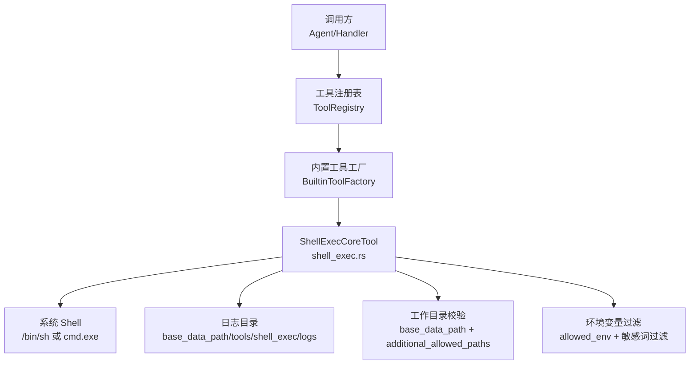
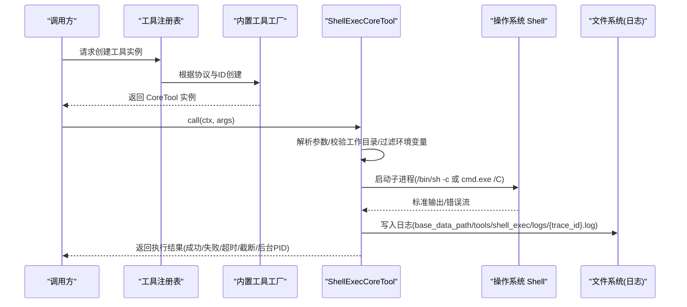
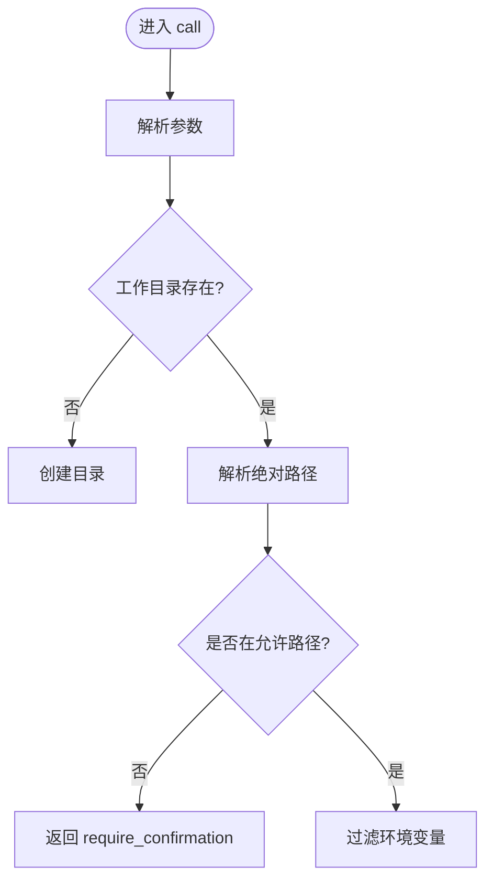
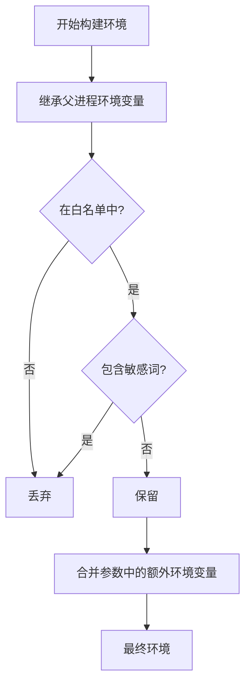
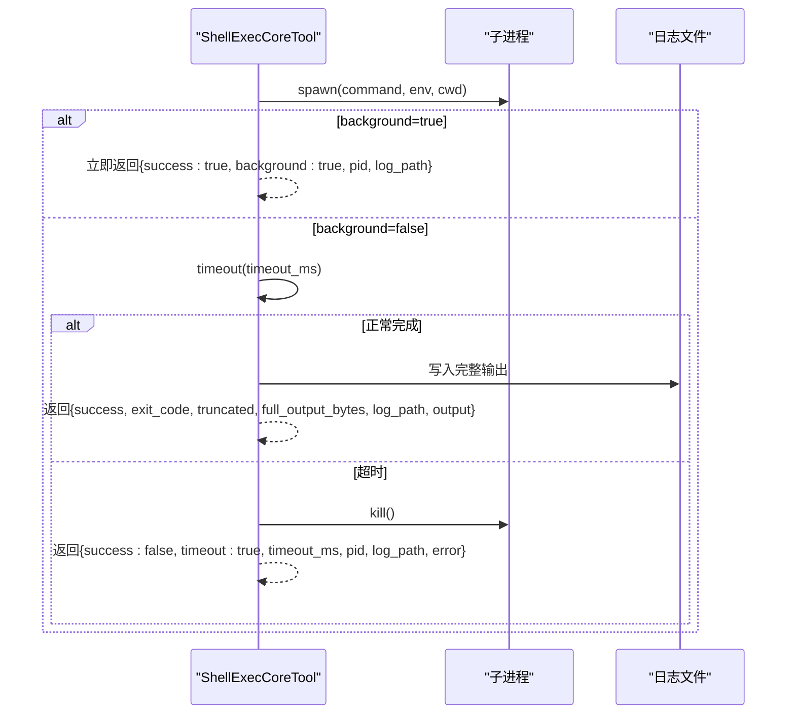
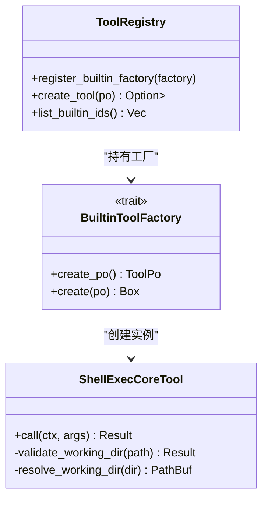

# Shell 执行工具

<cite>
**本文引用的文件**
- [src/pkg/tool_registry/shell_exec.rs](file://src/pkg/tool_registry/shell_exec.rs)
- [src/pkg/tool_registry/tool_security.rs](file://src/pkg/tool_registry/tool_security.rs)
- [src/pkg/tool_registry/mod.rs](file://src/pkg/tool_registry/mod.rs)
- [src/pkg/tool_registry/builtin.rs](file://src/pkg/tool_registry/builtin.rs)
- [src/config.rs](file://src/config.rs)
- [common/config/ai_orz.toml](file://common/config/ai_orz.toml)
- [src/pkg/tool_registry/shell_tests.rs](file://src/pkg/tool_registry/shell_tests.rs)
</cite>

## 目录
1. [简介](#简介)
2. [项目结构](#项目结构)
3. [核心组件](#核心组件)
4. [架构总览](#架构总览)
5. [详细组件分析](#详细组件分析)
6. [依赖关系分析](#依赖关系分析)
7. [性能考虑](#性能考虑)
8. [故障排查指南](#故障排查指南)
9. [结论](#结论)
10. [附录：使用示例与最佳实践](#附录使用示例与最佳实践)

## 简介
本文件为“Shell 执行工具”的完整技术文档，聚焦于命令执行、沙箱隔离、资源限制、异步执行、超时控制、进程监控与环境变量继承等能力。该工具以内置工具形式注册到全局工具注册表，通过统一的 CoreTool 接口被上层调用，支持同步等待与后台运行两种模式，并具备输出大小限制、工作目录白名单、环境变量白名单过滤等安全机制。

## 项目结构
Shell 执行工具位于工具注册表模块中，作为内置工具之一被统一注册与管理。其关键位置如下：
- 工具实现与参数定义：shell_exec.rs
- 安全工具函数（路径校验、敏感信息过滤）：tool_security.rs
- 工具注册表与工厂：mod.rs、builtin.rs
- 应用配置与基础数据路径：config.rs、common/config/ai_orz.toml
- 单元测试：shell_tests.rs

图表来源
- [src/pkg/tool_registry/mod.rs:29-108](file://src/pkg/tool_registry/mod.rs#L29-L108)
- [src/pkg/tool_registry/builtin.rs:26-43](file://src/pkg/tool_registry/builtin.rs#L26-L43)
- [src/pkg/tool_registry/shell_exec.rs:20-166](file://src/pkg/tool_registry/shell_exec.rs#L20-L166)

章节来源
- [src/pkg/tool_registry/mod.rs:29-108](file://src/pkg/tool_registry/mod.rs#L29-L108)
- [src/pkg/tool_registry/builtin.rs:26-43](file://src/pkg/tool_registry/builtin.rs#L26-L43)
- [src/pkg/tool_registry/shell_exec.rs:20-166](file://src/pkg/tool_registry/shell_exec.rs#L20-L166)

## 核心组件
- ShellExecConfig：工具配置项，包含默认超时、最大输出大小、额外允许路径、允许的环境变量名白名单。
- ShellExecParams：调用参数，包括命令、工作目录、超时、输出大小限制、是否后台运行、附加环境变量。
- ShellExecCoreTool：实现 CoreTool 接口，负责参数解析、工作目录校验、环境过滤、命令执行、超时控制、日志落盘与结果汇总。
- 工具注册：通过 BuiltinToolFactory 将 shell_exec 注册到全局 ToolRegistry，供上层按协议类型创建实例。

章节来源
- [src/pkg/tool_registry/shell_exec.rs:20-166](file://src/pkg/tool_registry/shell_exec.rs#L20-L166)
- [src/pkg/tool_registry/builtin.rs:26-43](file://src/pkg/tool_registry/builtin.rs#L26-L43)
- [src/pkg/tool_registry/mod.rs:29-108](file://src/pkg/tool_registry/mod.rs#L29-L108)

## 架构总览
Shell 执行工具遵循“适配器→领域→数据访问”的分层原则，本工具属于工具注册表层的内置实现，对外暴露统一的 CoreTool 接口，内部通过系统进程管理完成命令执行。

图表来源
- [src/pkg/tool_registry/shell_exec.rs:256-466](file://src/pkg/tool_registry/shell_exec.rs#L256-L466)
- [src/pkg/tool_registry/mod.rs:81-102](file://src/pkg/tool_registry/mod.rs#L81-L102)
- [src/pkg/tool_registry/builtin.rs:26-43](file://src/pkg/tool_registry/builtin.rs#L26-L43)

## 详细组件分析

### 命令参数解析与工作目录设置
- 参数解析：从 JSON 参数中解析 command、working_dir、timeout_ms、max_output_size_bytes、background、env。
- 工作目录解析：相对路径基于 base_data_path；绝对路径需满足白名单校验（base_data_path 或 additional_allowed_paths）。
- 目录不存在时自动创建。

图表来源
- [src/pkg/tool_registry/shell_exec.rs:168-207](file://src/pkg/tool_registry/shell_exec.rs#L168-L207)
- [src/pkg/tool_registry/shell_exec.rs:256-287](file://src/pkg/tool_registry/shell_exec.rs#L256-L287)

章节来源
- [src/pkg/tool_registry/shell_exec.rs:168-207](file://src/pkg/tool_registry/shell_exec.rs#L168-L207)
- [src/pkg/tool_registry/shell_exec.rs:256-287](file://src/pkg/tool_registry/shell_exec.rs#L256-L287)

### 环境变量继承与安全过滤
- 继承策略：仅继承 allowed_env 白名单中的环境变量。
- 敏感过滤：即使出现在白名单中，若键名包含敏感关键词（如 password、token、secret、api_key、aws_*、google_application_credentials、ssh_auth_sock、git_config、git_ssh 等），也会被过滤。
- 扩展环境变量：支持在参数 env 中追加键值对，合并到基础环境。

图表来源
- [src/pkg/tool_registry/shell_exec.rs:210-254](file://src/pkg/tool_registry/shell_exec.rs#L210-L254)

章节来源
- [src/pkg/tool_registry/shell_exec.rs:210-254](file://src/pkg/tool_registry/shell_exec.rs#L210-L254)

### 异步执行、超时控制与进程监控
- 后台模式：不等待进程结束，直接返回 PID 与日志路径，适合长任务。
- 同步模式：使用 tokio::time::timeout 进行超时控制；超时后终止子进程。
- 进程监控：记录 PID，并在错误/超时时尝试 kill 子进程。
- 输出处理：捕获 stdout/stderr，写入日志文件；超过 max_output_size_bytes 时截断响应并提示完整输出位置。

图表来源
- [src/pkg/tool_registry/shell_exec.rs:305-466](file://src/pkg/tool_registry/shell_exec.rs#L305-L466)

章节来源
- [src/pkg/tool_registry/shell_exec.rs:305-466](file://src/pkg/tool_registry/shell_exec.rs#L305-L466)

### 沙箱隔离机制与资源限制
- 工作目录沙箱：限制在执行 base_data_path 或 additional_allowed_paths 内，防止越权访问。
- 环境变量沙箱：仅继承白名单环境变量，并过滤敏感键。
- 输出大小限制：默认 10MB，可配置；超出则截断并保存完整日志。
- 超时限制：默认 300s，可配置；超时强制终止进程。
- 平台适配：Windows 使用 cmd.exe /C，Unix 使用 /bin/sh -c。

章节来源
- [src/pkg/tool_registry/shell_exec.rs:20-68](file://src/pkg/tool_registry/shell_exec.rs#L20-L68)
- [src/pkg/tool_registry/shell_exec.rs:168-207](file://src/pkg/tool_registry/shell_exec.rs#L168-L207)
- [src/pkg/tool_registry/shell_exec.rs:256-466](file://src/pkg/tool_registry/shell_exec.rs#L256-L466)

### 命令白名单控制
当前实现未提供“命令白名单”（仅允许特定命令）的直接开关。可通过以下策略间接实现：
- 在调用前对用户输入的命令进行严格校验（例如正则匹配允许的指令集合）。
- 结合工作目录白名单与环境变量白名单，降低风险面。
- 如需更细粒度控制，可在上层封装一层命令审批逻辑后再调用 shell_exec。

章节来源
- [src/pkg/tool_registry/shell_exec.rs:256-287](file://src/pkg/tool_registry/shell_exec.rs#L256-L287)

### 管道操作与 IO 处理
- 同步模式下，stdout 与 stderr 分别通过管道读取并合并到输出缓冲区。
- 后台模式下，stdout 与 stderr 均重定向到同一日志文件，便于后续查看。
- 输出写入采用异步写，避免阻塞主流程。

章节来源
- [src/pkg/tool_registry/shell_exec.rs:318-340](file://src/pkg/tool_registry/shell_exec.rs#L318-L340)
- [src/pkg/tool_registry/shell_exec.rs:368-417](file://src/pkg/tool_registry/shell_exec.rs#L368-L417)

## 依赖关系分析
- 工具注册表：ToolRegistry 维护内置工具工厂映射，按协议分发创建。
- 内置工具工厂：GENERIC_BUILTIN_TOOLS 包含 shell_exec 工厂，统一注册。
- 配置：base_data_path 来自应用配置，用于工作目录与日志路径。
- 安全工具：tool_security.rs 提供路径与敏感信息相关的安全函数，虽主要面向 HTTP/FS 工具，但其理念可复用到 Shell 工具。

图表来源
- [src/pkg/tool_registry/mod.rs:29-108](file://src/pkg/tool_registry/mod.rs#L29-L108)
- [src/pkg/tool_registry/builtin.rs:26-43](file://src/pkg/tool_registry/builtin.rs#L26-L43)
- [src/pkg/tool_registry/shell_exec.rs:151-166](file://src/pkg/tool_registry/shell_exec.rs#L151-L166)

章节来源
- [src/pkg/tool_registry/mod.rs:29-108](file://src/pkg/tool_registry/mod.rs#L29-L108)
- [src/pkg/tool_registry/builtin.rs:26-43](file://src/pkg/tool_registry/builtin.rs#L26-L43)
- [src/pkg/tool_registry/shell_exec.rs:151-166](file://src/pkg/tool_registry/shell_exec.rs#L151-L166)

## 性能考虑
- 超时与内存保护：通过默认超时与最大输出大小限制，避免长时间占用与内存膨胀。
- 后台模式：长任务建议后台运行，减少请求阻塞。
- 日志落盘：大输出写入磁盘，避免内存峰值过高。
- 进程池管理：当前实现为每次调用创建子进程；在高并发场景下可考虑复用进程或队列化执行以降低开销。
- 资源回收：超时或错误时主动 kill 子进程，避免僵尸进程。

[本节为通用性能建议，不直接分析具体文件]

## 故障排查指南
- 权限不足
  - 现象：无法创建目录或写入日志。
  - 排查：检查 base_data_path 及 tools/shell_exec/logs 目录权限；确保进程有写权限。
- 命令不存在
  - 现象：spawn 失败或退出码非零。
  - 排查：确认 PATH 已正确继承；检查命令是否存在于目标环境中。
- 资源耗尽
  - 现象：超时或输出过大导致响应缓慢。
  - 排查：调整 default_timeout_ms 与 default_max_output_size_bytes；使用后台模式并查看日志。
- 工作目录不在白名单
  - 现象：返回 require_confirmation。
  - 排查：将工作目录设置在 base_data_path 或 additional_allowed_paths 中。
- 环境变量泄露
  - 现象：敏感信息未传入或被过滤。
  - 排查：检查 allowed_env 白名单与敏感词过滤规则；必要时在上层显式注入必要变量。

章节来源
- [src/pkg/tool_registry/shell_exec.rs:168-207](file://src/pkg/tool_registry/shell_exec.rs#L168-L207)
- [src/pkg/tool_registry/shell_exec.rs:210-254](file://src/pkg/tool_registry/shell_exec.rs#L210-L254)
- [src/pkg/tool_registry/shell_exec.rs:305-466](file://src/pkg/tool_registry/shell_exec.rs#L305-L466)

## 结论
Shell 执行工具提供了安全的命令执行能力，涵盖参数解析、工作目录白名单、环境变量白名单与敏感过滤、超时与输出大小限制、后台模式与日志落盘等特性。通过工具注册表统一管理，易于扩展与维护。建议在业务侧结合命令白名单与审批流程，进一步提升安全性与可控性。

[本节为总结性内容，不直接分析具体文件]

## 附录：使用示例与最佳实践

### 系统信息查询
- 场景：查询系统基本信息（如 uname、systeminfo）。
- 要点：设置合理超时；输出可能较大，注意 max_output_size_bytes；建议使用后台模式并查看日志。

章节来源
- [src/pkg/tool_registry/shell_exec.rs:256-466](file://src/pkg/tool_registry/shell_exec.rs#L256-L466)

### 文件批处理
- 场景：批量复制/移动/转换文件。
- 要点：工作目录限定在项目根或额外允许路径；避免访问敏感文件；输出过大时查看日志。

章节来源
- [src/pkg/tool_registry/shell_exec.rs:168-207](file://src/pkg/tool_registry/shell_exec.rs#L168-L207)
- [src/pkg/tool_registry/shell_exec.rs:295-340](file://src/pkg/tool_registry/shell_exec.rs#L295-L340)

### 脚本执行
- 场景：执行预置脚本（如构建、测试、部署）。
- 要点：通过 env 注入必要变量；设置超时；后台运行并监控日志。

章节来源
- [src/pkg/tool_registry/shell_exec.rs:241-254](file://src/pkg/tool_registry/shell_exec.rs#L241-L254)
- [src/pkg/tool_registry/shell_exec.rs:305-466](file://src/pkg/tool_registry/shell_exec.rs#L305-L466)

### 管道操作
- 场景：组合多个命令并通过管道传递数据。
- 要点：在 Unix 环境下使用 /bin/sh -c 支持管道；注意输出大小限制与日志落盘。

章节来源
- [src/pkg/tool_registry/shell_exec.rs:473-484](file://src/pkg/tool_registry/shell_exec.rs#L473-L484)
- [src/pkg/tool_registry/shell_exec.rs:368-417](file://src/pkg/tool_registry/shell_exec.rs#L368-L417)

### 安全最佳实践
- 命令注入防护：在上层对用户输入进行严格校验，限制允许的命令集合与参数格式。
- 权限最小化：仅授予必要的文件系统与网络权限；工作目录限制在沙箱内。
- 敏感信息过滤：使用环境变量白名单与敏感词过滤；避免在日志中输出敏感数据。

章节来源
- [src/pkg/tool_registry/shell_exec.rs:210-254](file://src/pkg/tool_registry/shell_exec.rs#L210-L254)
- [src/pkg/tool_registry/shell_exec.rs:168-207](file://src/pkg/tool_registry/shell_exec.rs#L168-L207)

### 性能调优建议
- 进程池管理：在高并发场景下，考虑对 shell_exec 调用进行排队与复用，减少进程创建开销。
- 资源回收：确保超时与错误路径中 kill 子进程，避免资源泄漏。
- 错误恢复：对常见错误（命令不存在、权限不足）进行重试或降级处理。

[本节为通用性能建议，不直接分析具体文件]

### 单元测试参考
- 配置解析与默认值验证
- 环境变量过滤与合并
- 参数解析完整性

章节来源
- [src/pkg/tool_registry/shell_tests.rs:4-145](file://src/pkg/tool_registry/shell_tests.rs#L4-L145)