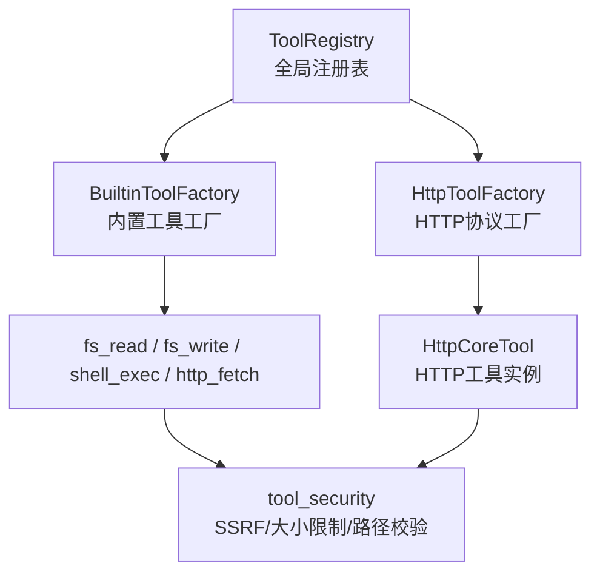
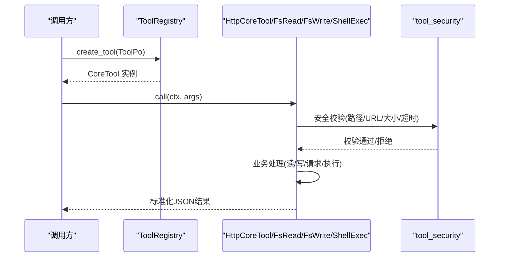
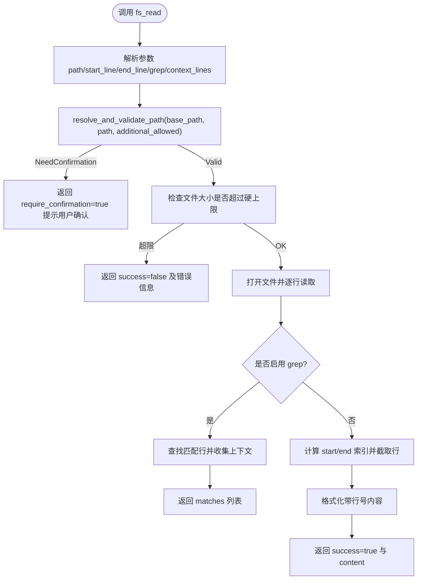
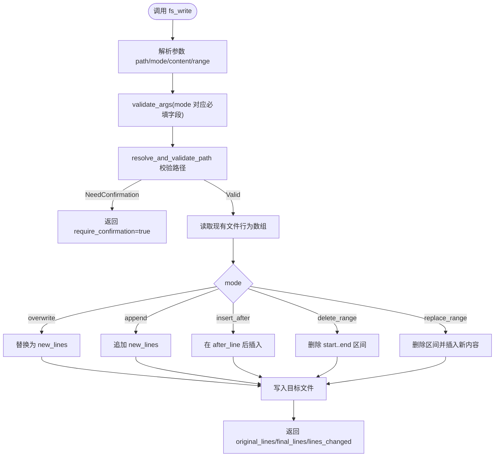
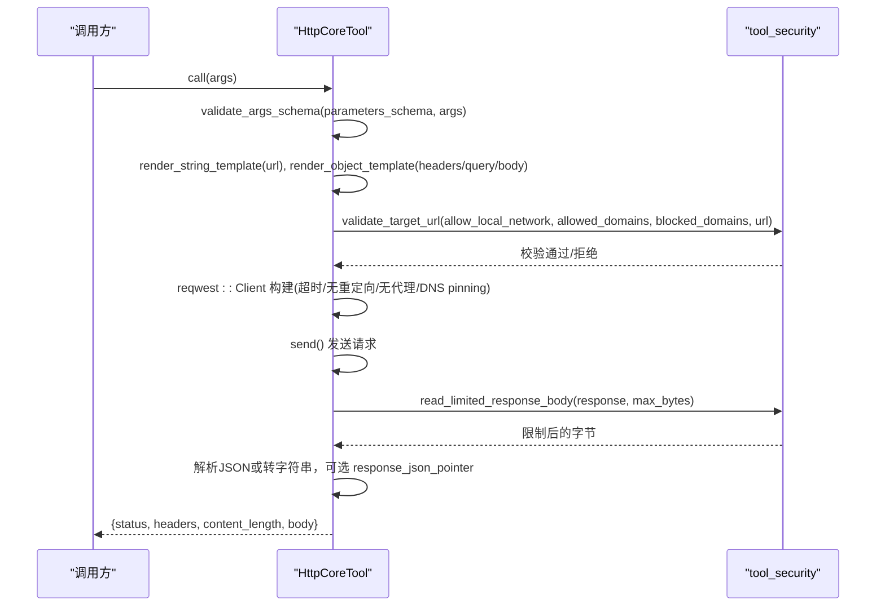
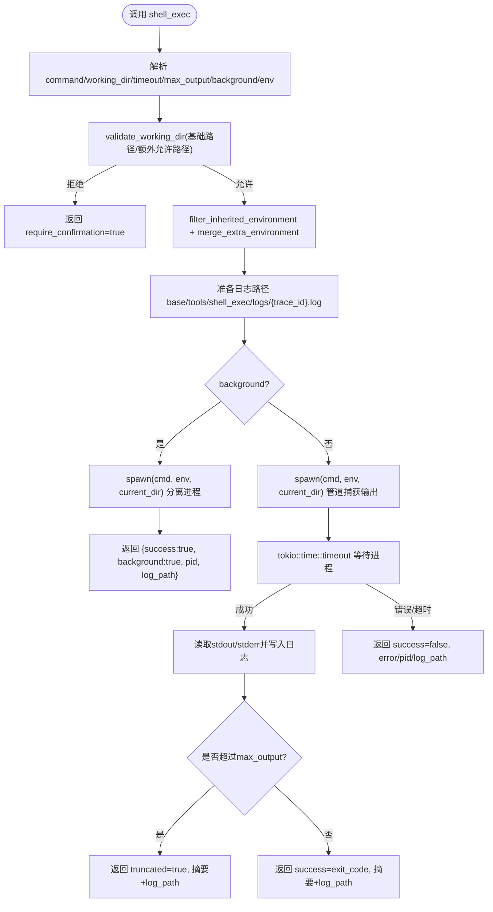
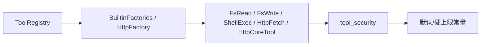

# 内置工具集

<cite>
**本文引用的文件**
- [src/pkg/tool_registry/mod.rs](file://src/pkg/tool_registry/mod.rs)
- [src/pkg/tool_registry/builtin.rs](file://src/pkg/tool_registry/builtin.rs)
- [src/pkg/tool_registry/fs_read.rs](file://src/pkg/tool_registry/fs_read.rs)
- [src/pkg/tool_registry/fs_write.rs](file://src/pkg/tool_registry/fs_write.rs)
- [src/pkg/tool_registry/http.rs](file://src/pkg/tool_registry/http.rs)
- [src/pkg/tool_registry/http_fetch.rs](file://src/pkg/tool_registry/http_fetch.rs)
- [src/pkg/tool_registry/shell_exec.rs](file://src/pkg/tool_registry/shell_exec.rs)
- [src/pkg/tool_registry/tool_security.rs](file://src/pkg/tool_registry/tool_security.rs)
- [src/pkg/tool_registry/fs_tests.rs](file://src/pkg/tool_registry/fs_tests.rs)
- [src/pkg/tool_registry/shell_tests.rs](file://src/pkg/tool_registry/shell_tests.rs)
- [docs/generic_builtin_tools_design.md](file://docs/generic_builtin_tools_design.md)
</cite>

## 目录
1. [简介](#简介)
2. [项目结构](#项目结构)
3. [核心组件](#核心组件)
4. [架构总览](#架构总览)
5. [详细组件分析](#详细组件分析)
6. [依赖关系分析](#依赖关系分析)
7. [性能与容量限制](#性能与容量限制)
8. [故障排查指南](#故障排查指南)
9. [结论](#结论)
10. [附录：参数、返回值与安全策略速查](#附录参数返回值与安全策略速查)

## 简介
本章节面向 Agent 运行时使用的“内置工具集”，覆盖三类能力：
- 文件系统工具（读/写）：在沙箱内安全地读取或编辑项目工作目录下的文本文件，支持范围读取、grep 匹配、原子写入模式。
- HTTP 客户端工具：提供两种形态——通用 HTTP 工具（数据库配置驱动）和内置 http_fetch（仅 GET、默认 HTTPS-only）。具备 SSRF 防护、域名白/黑名单、响应大小限制、超时控制等。
- Shell 执行工具：在受限工作目录下执行命令，支持同步等待与后台运行；输出可截断并落盘日志；环境变量白名单过滤；敏感信息脱敏。

所有工具遵循“默认拒绝风险操作”的安全原则，错误信息脱敏，避免泄露路径、网络地址与认证信息。

## 项目结构
内置工具位于 pkg/tool_registry 下，采用“协议级工厂 + 工具实例”的注册模式：
- 全局注册表维护各协议的工厂，按 ToolPo 动态创建可执行工具实例。
- 内置工具通过 BuiltinToolFactory 统一注册，启动时自动注入。
- 公共安全能力抽取到 tool_security.rs，供 HTTP、HTTP Fetch、文件工具复用。

图表来源
- [src/pkg/tool_registry/mod.rs:29-102](file://src/pkg/tool_registry/mod.rs#L29-L102)
- [src/pkg/tool_registry/builtin.rs:26-43](file://src/pkg/tool_registry/builtin.rs#L26-L43)
- [src/pkg/tool_registry/http.rs:23-39](file://src/pkg/tool_registry/http.rs#L23-L39)
- [src/pkg/tool_registry/tool_security.rs:8-15](file://src/pkg/tool_registry/tool_security.rs#L8-L15)

章节来源
- [src/pkg/tool_registry/mod.rs:1-132](file://src/pkg/tool_registry/mod.rs#L1-L132)
- [src/pkg/tool_registry/builtin.rs:1-44](file://src/pkg/tool_registry/builtin.rs#L1-L44)

## 核心组件
- 全局工具注册表：集中管理内置与协议级工具工厂，按 ToolPo 创建具体工具实例。
- 内置工具族：
  - fs_read：读取文件，支持行范围与 grep 匹配，返回带行号的内容或匹配上下文。
  - fs_write：多种原子写入模式（覆盖、追加、插入、删除区间、替换区间），变更统计。
  - http_fetch：仅 GET 的公网 HTTPS 抓取，严格 SSRF 防护与大小限制。
  - shell_exec：受控工作目录执行命令，支持同步/后台、超时、输出截断与日志落盘。
- HTTP 工具（数据库配置驱动）：以 ToolPo.config 描述 URL/方法/头/体/模板与限制，运行时渲染并执行请求。
- 公共安全模块：域名归一化、SSRF 检查、DNS pinning、响应大小限制、头部脱敏、路径校验与敏感文件名拦截。

章节来源
- [src/pkg/tool_registry/mod.rs:46-102](file://src/pkg/tool_registry/mod.rs#L46-L102)
- [src/pkg/tool_registry/fs_read.rs:15-123](file://src/pkg/tool_registry/fs_read.rs#L15-L123)
- [src/pkg/tool_registry/fs_write.rs:16-119](file://src/pkg/tool_registry/fs_write.rs#L16-L119)
- [src/pkg/tool_registry/http_fetch.rs:19-58](file://src/pkg/tool_registry/http_fetch.rs#L19-L58)
- [src/pkg/tool_registry/shell_exec.rs:20-87](file://src/pkg/tool_registry/shell_exec.rs#L20-L87)
- [src/pkg/tool_registry/http.rs:41-96](file://src/pkg/tool_registry/http.rs#L41-L96)
- [src/pkg/tool_registry/tool_security.rs:8-15](file://src/pkg/tool_registry/tool_security.rs#L8-L15)

## 架构总览
工具调用流程（以 HTTP 工具为例）：
- 上层通过 ToolRegistry 获取工具实例（由 ToolPo 决定协议类型）。
- 工具实例解析参数、执行安全校验、发起网络请求、限制响应大小、返回标准化结果。
- 所有外部 I/O 均经过 tool_security 的安全层。

图表来源
- [src/pkg/tool_registry/mod.rs:81-102](file://src/pkg/tool_registry/mod.rs#L81-L102)
- [src/pkg/tool_registry/http.rs:126-220](file://src/pkg/tool_registry/http.rs#L126-L220)
- [src/pkg/tool_registry/fs_read.rs:125-216](file://src/pkg/tool_registry/fs_read.rs#L125-L216)
- [src/pkg/tool_registry/fs_write.rs:121-275](file://src/pkg/tool_registry/fs_write.rs#L121-L275)
- [src/pkg/tool_registry/shell_exec.rs:256-471](file://src/pkg/tool_registry/shell_exec.rs#L256-L471)

## 详细组件分析

### 文件系统工具（fs_read / fs_write）
- 权限与路径
  - 基于 base_data_path 的沙箱，相对路径解析后 canonicalize，禁止符号链接。
  - 超出默认范围返回 require_confirmation，要求显式用户确认。
  - 敏感文件名直接拒绝（如 .env、私钥、隐藏文件等）。
- 大文件处理
  - 读取前检查文件大小，超过硬上限直接拒绝。
  - 使用缓冲流逐行读取，避免一次性加载大文件。
- 功能特性
  - read_file：支持 start_line/end_line 范围读取；支持 grep 匹配并返回上下文行。
  - write_file：支持 overwrite/append/insert_after/delete_range/replace_range 五种模式，返回 original_lines/final_lines/lines_changed。

图表来源
- [src/pkg/tool_registry/fs_read.rs:125-216](file://src/pkg/tool_registry/fs_read.rs#L125-L216)
- [src/pkg/tool_registry/tool_security.rs:335-419](file://src/pkg/tool_registry/tool_security.rs#L335-L419)

图表来源
- [src/pkg/tool_registry/fs_write.rs:121-275](file://src/pkg/tool_registry/fs_write.rs#L121-L275)
- [src/pkg/tool_registry/fs_write.rs:277-323](file://src/pkg/tool_registry/fs_write.rs#L277-L323)

章节来源
- [src/pkg/tool_registry/fs_read.rs:15-255](file://src/pkg/tool_registry/fs_read.rs#L15-L255)
- [src/pkg/tool_registry/fs_write.rs:16-427](file://src/pkg/tool_registry/fs_write.rs#L16-L427)
- [src/pkg/tool_registry/tool_security.rs:314-487](file://src/pkg/tool_registry/tool_security.rs#L314-L487)
- [src/pkg/tool_registry/fs_tests.rs:1-81](file://src/pkg/tool_registry/fs_tests.rs#L1-L81)

### HTTP 客户端工具（http / http_fetch）
- 通用 HTTP 工具（数据库配置驱动）
  - 配置项：method/url/headers/query/body/timeout_ms/response_max_bytes/allowed_status_codes/response_json_pointer/allowed_domains/blocked_domains/allow_local_network。
  - 模板渲染：url/headers/query/body 支持 {{args.key}} 占位符，键名固定且不允许包含敏感字符。
  - 安全策略：禁用重定向、禁用代理、DNS pinning、SSRF 防护、域名白/黑名单、本地网络需显式允许。
  - 响应处理：限制最大字节数，可选 JSON Pointer 提取子集，返回 status/headers/content_length/body。
- 内置 http_fetch
  - 仅 GET，默认仅允许 HTTPS，默认拒绝本地/私网地址。
  - 复用相同的安全与大小限制逻辑。

图表来源
- [src/pkg/tool_registry/http.rs:126-220](file://src/pkg/tool_registry/http.rs#L126-L220)
- [src/pkg/tool_registry/http.rs:230-302](file://src/pkg/tool_registry/http.rs#L230-L302)
- [src/pkg/tool_registry/http.rs:369-443](file://src/pkg/tool_registry/http.rs#L369-L443)
- [src/pkg/tool_registry/http.rs:561-589](file://src/pkg/tool_registry/http.rs#L561-L589)
- [src/pkg/tool_registry/tool_security.rs:92-170](file://src/pkg/tool_registry/tool_security.rs#L92-L170)
- [src/pkg/tool_registry/tool_security.rs:200-231](file://src/pkg/tool_registry/tool_security.rs#L200-L231)

章节来源
- [src/pkg/tool_registry/http.rs:1-599](file://src/pkg/tool_registry/http.rs#L1-L599)
- [src/pkg/tool_registry/http_fetch.rs:1-244](file://src/pkg/tool_registry/http_fetch.rs#L1-L244)
- [src/pkg/tool_registry/tool_security.rs:8-15](file://src/pkg/tool_registry/tool_security.rs#L8-L15)

### Shell 执行工具（shell_exec）
- 沙箱隔离
  - 工作目录必须位于 base_data_path 或其 additional_allowed_paths 范围内；绝对路径需校验前缀。
  - 环境变量白名单过滤，并屏蔽常见敏感变量（即使出现在白名单中也会被过滤）。
- 资源限制
  - 超时控制：默认 300s，可 per-call 覆盖。
  - 输出大小限制：默认 10MB，超过则截断并保存完整日志到 log_path。
- 执行模式
  - 同步：等待进程结束，捕获 stdout/stderr，写入日志文件，返回摘要。
  - 后台：立即返回 PID 与 log_path，不阻塞调用方。

图表来源
- [src/pkg/tool_registry/shell_exec.rs:256-471](file://src/pkg/tool_registry/shell_exec.rs#L256-L471)
- [src/pkg/tool_registry/shell_exec.rs:210-254](file://src/pkg/tool_registry/shell_exec.rs#L210-L254)

章节来源
- [src/pkg/tool_registry/shell_exec.rs:1-490](file://src/pkg/tool_registry/shell_exec.rs#L1-L490)
- [src/pkg/tool_registry/shell_tests.rs:1-145](file://src/pkg/tool_registry/shell_tests.rs#L1-L145)

## 依赖关系分析
- 工具注册与创建
  - ToolRegistry 根据 ToolPo.protocol 分发到不同工厂：Builtin/Mcp/Http。
  - 内置工具通过 GENERIC_BUILTIN_TOOLS 静态集合注册。
- 安全依赖
  - HTTP/HTTP Fetch/文件工具均依赖 tool_security 提供的 SSRF、域名匹配、大小限制、路径校验等能力。
- 配置与常量
  - HTTP 工具使用 DEFAULT_TIMEOUT_MS/HARD_TIMEOUT_MS/DEFAULT_RESPONSE_MAX_BYTES/HARD_RESPONSE_MAX_BYTES 作为默认与硬上限。

图表来源
- [src/pkg/tool_registry/mod.rs:29-102](file://src/pkg/tool_registry/mod.rs#L29-L102)
- [src/pkg/tool_registry/builtin.rs:26-43](file://src/pkg/tool_registry/builtin.rs#L26-L43)
- [src/pkg/tool_registry/http.rs:591-594](file://src/pkg/tool_registry/http.rs#L591-L594)
- [src/pkg/tool_registry/tool_security.rs:8-15](file://src/pkg/tool_registry/tool_security.rs#L8-L15)

章节来源
- [src/pkg/tool_registry/mod.rs:1-132](file://src/pkg/tool_registry/mod.rs#L1-L132)
- [src/pkg/tool_registry/builtin.rs:1-44](file://src/pkg/tool_registry/builtin.rs#L1-L44)
- [src/pkg/tool_registry/http.rs:591-594](file://src/pkg/tool_registry/http.rs#L591-L594)

## 性能与容量限制
- 文件读取
  - 硬上限：10MB，超过直接拒绝；使用缓冲流逐行读取，降低内存占用。
- HTTP 请求
  - 默认超时：30s；硬上限：10分钟。
  - 默认响应上限：1MB；硬上限：10MB；超过即中止读取并报错。
  - 禁用重定向与代理，DNS pinning 防止 DNS Rebinding。
- Shell 执行
  - 默认超时：300s；默认输出上限：10MB；超限时截断并保存完整日志。
- 建议
  - 对大文件优先使用 grep 或范围读取，减少传输与解析成本。
  - HTTP 工具设置合理的 allowed_status_codes 与 response_json_pointer，缩小响应体积。
  - Shell 任务尽量后台化，结合日志轮转与监控。

[本节为通用指导，不直接分析具体文件]

## 故障排查指南
- 文件访问被拒绝
  - 检查路径是否在 base_data_path 或 additional_allowed_paths 内；确认非敏感文件名；避免符号链接。
  - 若返回 require_confirmation=true，需在调用侧引导用户显式确认后再继续。
- HTTP 请求失败
  - 检查 method/url/headers/query/body 模板是否正确渲染；确认域名在白名单或未命中黑名单；确认 allow_local_network 配置。
  - 关注响应状态码是否在 allowed_status_codes 内；检查响应大小是否超过限制。
- Shell 执行异常
  - 检查工作目录是否允许；环境变量是否被过滤；命令是否存在；超时是否过短。
  - 查看 log_path 中的完整输出，判断是否为截断导致的信息缺失。

章节来源
- [src/pkg/tool_registry/fs_read.rs:125-216](file://src/pkg/tool_registry/fs_read.rs#L125-L216)
- [src/pkg/tool_registry/fs_write.rs:121-275](file://src/pkg/tool_registry/fs_write.rs#L121-L275)
- [src/pkg/tool_registry/http.rs:126-220](file://src/pkg/tool_registry/http.rs#L126-L220)
- [src/pkg/tool_registry/shell_exec.rs:256-471](file://src/pkg/tool_registry/shell_exec.rs#L256-L471)
- [src/pkg/tool_registry/tool_security.rs:314-487](file://src/pkg/tool_registry/tool_security.rs#L314-L487)

## 结论
内置工具集围绕“安全默认拒绝、最小权限、沙箱隔离”的原则实现，覆盖 Agent 常见的文件读写、HTTP 访问与系统命令执行需求。通过统一的注册机制与安全层，保证工具的可扩展性与一致性。建议在业务侧合理配置白名单、超时与大小限制，并结合日志与追踪进行问题定位与性能优化。

[本节为总结性内容，不直接分析具体文件]

## 附录：参数、返回值与安全策略速查

- fs_read
  - 参数：path（必填）、start_line、end_line、grep、context_lines。
  - 返回：整文件/范围读取返回 success/path/size_bytes/total_lines/content；grep 模式返回 matches 列表与 total_matches。
  - 安全：路径沙箱、敏感文件名拒绝、超大文件拒绝、越界需确认。
- fs_write
  - 参数：path（必填）、mode（枚举）、content（部分模式必填）、after_line、start_line、end_line。
  - 返回：success/path/mode/original_lines/final_lines/lines_changed。
  - 安全：路径沙箱、敏感文件名拒绝、越界需确认。
- http_fetch
  - 参数：url（必填，HTTPS-only）。
  - 返回：status/headers/content_length/body。
  - 安全：SSRF 防护、默认拒绝本地/私网、禁用重定向与代理、响应大小限制。
- shell_exec
  - 参数：command（必填）、working_dir、timeout_ms、max_output_size_bytes、background、env。
  - 返回：success/exit_code/truncated/full_output_bytes/log_path/output 或 background/pid/log_path。
  - 安全：工作目录限制、环境变量白名单与敏感过滤、超时与输出上限。
- HTTP 工具（数据库配置驱动）
  - 配置：method/url/headers/query/body/timeout_ms/response_max_bytes/allowed_status_codes/response_json_pointer/allowed_domains/blocked_domains/allow_local_network。
  - 返回：status/headers/content_length/body。
  - 安全：模板校验、SSRF 防护、域名白/黑名单、本地网络需显式允许、响应大小限制。

章节来源
- [src/pkg/tool_registry/fs_read.rs:23-99](file://src/pkg/tool_registry/fs_read.rs#L23-L99)
- [src/pkg/tool_registry/fs_write.rs:24-96](file://src/pkg/tool_registry/fs_write.rs#L24-L96)
- [src/pkg/tool_registry/http_fetch.rs:23-47](file://src/pkg/tool_registry/http_fetch.rs#L23-L47)
- [src/pkg/tool_registry/shell_exec.rs:70-144](file://src/pkg/tool_registry/shell_exec.rs#L70-L144)
- [src/pkg/tool_registry/http.rs:41-96](file://src/pkg/tool_registry/http.rs#L41-L96)
- [docs/generic_builtin_tools_design.md:29-232](file://docs/generic_builtin_tools_design.md#L29-L232)