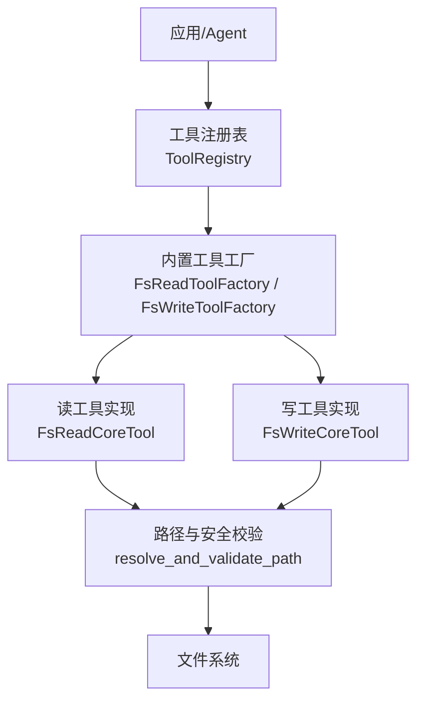
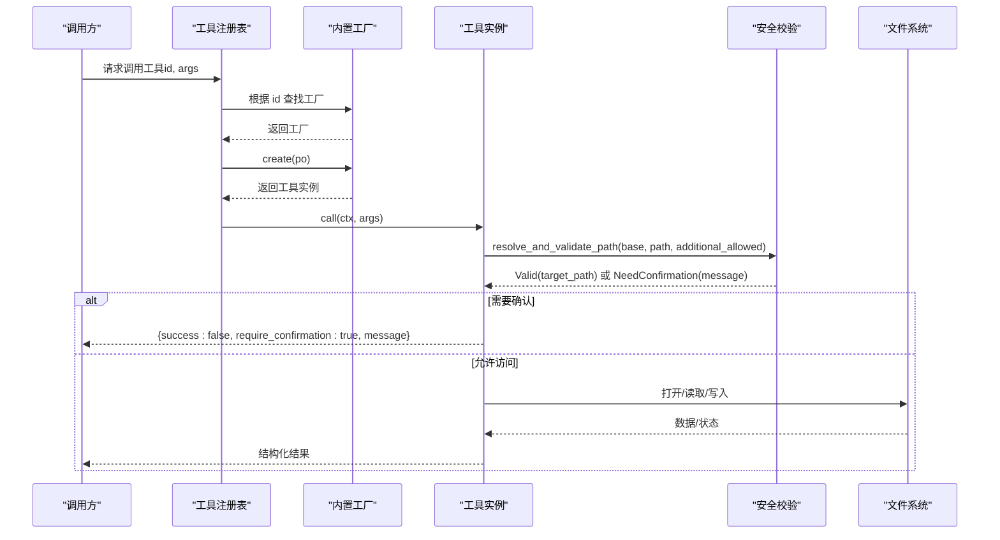
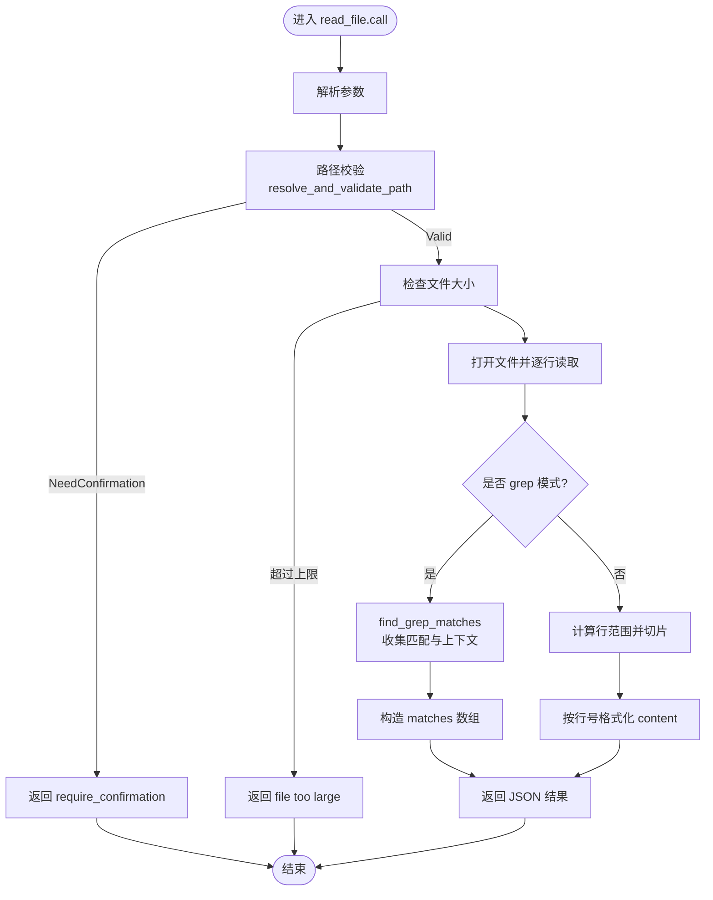
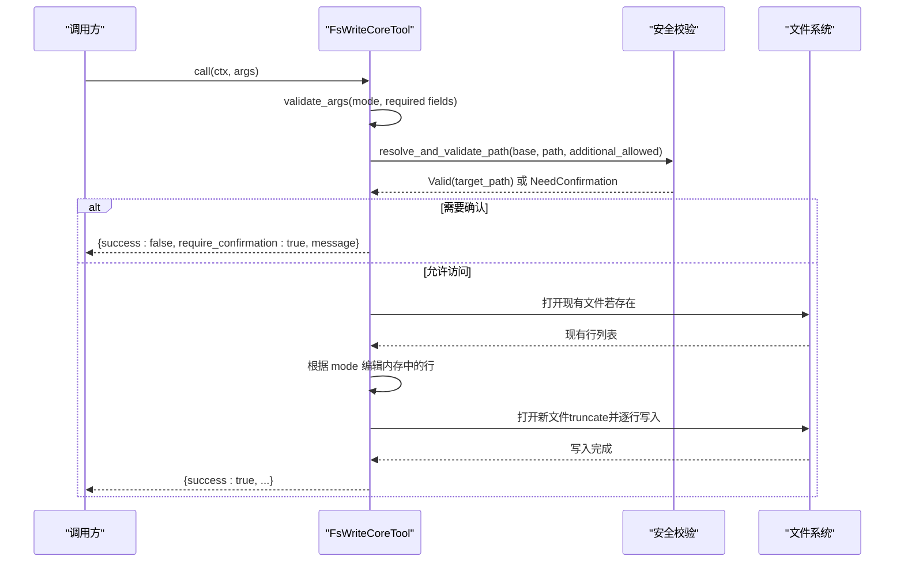
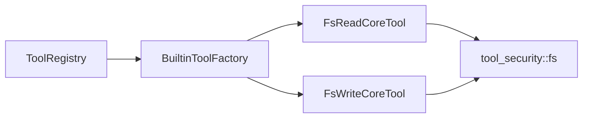

# 文件系统工具

<cite>
**本文引用的文件**
- [fs_read.rs](file://src/pkg/tool_registry/fs_read.rs)
- [fs_write.rs](file://src/pkg/tool_registry/fs_write.rs)
- [tool_security.rs](file://src/pkg/tool_registry/tool_security.rs)
- [mod.rs（工具注册表）](file://src/pkg/tool_registry/mod.rs)
- [builtin.rs（内置工具注册）](file://src/pkg/tool_registry/builtin.rs)
- [fs_tests.rs](file://src/pkg/tool_registry/fs_tests.rs)
- [generic_builtin_tools_design.md](file://docs/generic_builtin_tools_design.md)
</cite>

## 目录
1. [简介](#简介)
2. [项目结构](#项目结构)
3. [核心组件](#核心组件)
4. [架构总览](#架构总览)
5. [详细组件分析](#详细组件分析)
6. [依赖关系分析](#依赖关系分析)
7. [性能与容量限制](#性能与容量限制)
8. [故障排查指南](#故障排查指南)
9. [结论](#结论)
10. [附录：使用示例与最佳实践](#附录使用示例与最佳实践)

## 简介
本文件系统工具提供两个内置工具：read_file（读取）与 write_file（写入），用于在受控沙箱内安全地访问项目/工作区内的文件。它们支持：
- read_file：整文件读取、按行范围读取、grep 模式匹配并返回上下文行
- write_file：覆盖、追加、插入、删除范围、替换范围等原子写入模式
- 安全机制：路径白名单校验、敏感文件名拦截、符号链接拒绝、越界路径需用户确认
- 错误处理：统一结构化返回，包含 success/error/message 字段，便于上层调用方处理

这些工具属于 pkg 层通用基础设施工具，无业务感知，遵循“Adapter → Domain → DAL → DAO”的单向调用原则，不直接暴露 PO 到上层。

## 项目结构
文件系统工具位于工具注册表模块下，由内置工厂创建实例，并通过全局注册表对外提供服务。关键文件职责如下：
- fs_read.rs：实现 read_file 工具的参数解析、路径校验、大小限制、行范围与 grep 匹配、结果格式化
- fs_write.rs：实现 write_file 工具的多种写入模式、参数校验、原子性写入流程
- tool_security.rs：提供路径解析与安全校验、敏感文件名检测、错误信息脱敏等公共能力
- mod.rs：工具注册表，维护内置工具工厂集合，提供创建工具实例的能力
- builtin.rs：集中声明内置工具工厂列表，并在启动时注册
- fs_tests.rs：针对路径校验与敏感文件名的单元测试
- generic_builtin_tools_design.md：对 read_file/write_file 的参数 Schema、返回格式、权限规则的设计说明

图表来源
- [mod.rs（工具注册表）:29-102](file://src/pkg/tool_registry/mod.rs#L29-L102)
- [builtin.rs:26-43](file://src/pkg/tool_registry/builtin.rs#L26-L43)
- [fs_read.rs:50-122](file://src/pkg/tool_registry/fs_read.rs#L50-L122)
- [fs_write.rs:44-119](file://src/pkg/tool_registry/fs_write.rs#L44-L119)
- [tool_security.rs:314-419](file://src/pkg/tool_registry/tool_security.rs#L314-L419)

章节来源
- [mod.rs（工具注册表）:29-102](file://src/pkg/tool_registry/mod.rs#L29-L102)
- [builtin.rs:26-43](file://src/pkg/tool_registry/builtin.rs#L26-L43)

## 核心组件
- read_file（fs_read）
  - 参数：path、start_line、end_line、grep、context_lines
  - 功能：全量或范围读取；grep 模式匹配并返回匹配行及上下文；带行号格式化输出
  - 安全：路径校验、大小限制（硬上限）、敏感文件名拦截、符号链接拒绝
  - 返回：成功时包含 path、size_bytes、total_lines、content；grep 模式返回 matches 数组
- write_file（fs_write）
  - 参数：path、mode、content、after_line、start_line、end_line
  - 功能：overwrite/append/insert_after/delete_range/replace_range 五种模式
  - 安全：路径校验、敏感文件名拦截、符号链接拒绝；写入前读取现有内容，内存中编辑后一次性写出
  - 返回：成功时包含 path、mode、original_lines、final_lines、lines_changed

章节来源
- [fs_read.rs:23-48](file://src/pkg/tool_registry/fs_read.rs#L23-L48)
- [fs_read.rs:125-216](file://src/pkg/tool_registry/fs_read.rs#L125-L216)
- [fs_write.rs:24-38](file://src/pkg/tool_registry/fs_write.rs#L24-L38)
- [fs_write.rs:121-275](file://src/pkg/tool_registry/fs_write.rs#L121-L275)

## 架构总览
文件系统工具通过工具注册表统一管理，启动时由内置工厂注册到全局注册表。调用时，注册表根据 ToolPo 协议类型分发到对应工厂创建实例并执行 call。读写操作均经过统一的安全校验模块，确保路径合法、不在敏感范围、非符号链接。

图表来源
- [mod.rs（工具注册表）:81-102](file://src/pkg/tool_registry/mod.rs#L81-L102)
- [fs_read.rs:125-216](file://src/pkg/tool_registry/fs_read.rs#L125-L216)
- [fs_write.rs:121-275](file://src/pkg/tool_registry/fs_write.rs#L121-L275)
- [tool_security.rs:314-419](file://src/pkg/tool_registry/tool_security.rs#L314-L419)

## 详细组件分析

### read_file 工具
- 参数定义
  - path：必填，相对项目/工作区根的路径
  - start_line/end_line：可选，1-indexed 的行范围
  - grep：可选，子串匹配模式（当前为字符串包含匹配）
  - context_lines：可选，grep 匹配的上下文行数，默认 2
- 返回值格式
  - 普通读取：{ success, path, size_bytes, total_lines, content }
  - grep 模式：{ success, path, query, total_matches, matches[] }，每个 match 包含 line_number、content、context_before、context_after
- 错误处理
  - 参数解析失败：返回 invalid arguments 错误
  - 路径校验失败：返回 access denied 或 require_confirmation
  - 文件大小超限：返回 file too large
  - IO 异常：返回 open/read 错误，消息经脱敏处理
- 安全机制
  - 路径解析与校验：基于 base_data_path 与 additional_allowed_paths 进行白名单校验
  - 敏感文件名拦截：如 .env、.pem、私钥、密码、token 等关键字
  - 符号链接拒绝：防止绕过沙箱
  - 大小限制：硬上限 10MB，避免大文件导致内存压力
- 行范围与 grep
  - 行范围：将 1-indexed 转换为 0-indexed 切片，边界钳制保证有效区间
  - grep：遍历所有行，匹配则收集前后上下文行，并以行号+内容格式返回

图表来源
- [fs_read.rs:125-216](file://src/pkg/tool_registry/fs_read.rs#L125-L216)
- [fs_read.rs:218-254](file://src/pkg/tool_registry/fs_read.rs#L218-L254)
- [tool_security.rs:314-419](file://src/pkg/tool_registry/tool_security.rs#L314-L419)

章节来源
- [fs_read.rs:23-48](file://src/pkg/tool_registry/fs_read.rs#L23-L48)
- [fs_read.rs:125-216](file://src/pkg/tool_registry/fs_read.rs#L125-L216)
- [fs_read.rs:218-254](file://src/pkg/tool_registry/fs_read.rs#L218-L254)
- [tool_security.rs:314-419](file://src/pkg/tool_registry/tool_security.rs#L314-L419)

### write_file 工具
- 参数定义
  - path：必填，相对项目/工作区根的路径
  - mode：必填，枚举值 overwrite/append/insert_after/delete_range/replace_range
  - content：按需必填（overwrite/append/insert_after/replace_range）
  - after_line：insert_after 必填，1-indexed
  - start_line/end_line：delete_range/replace_range 必填，1-indexed，end_line 含尾
- 返回值格式
  - 成功：{ success, path, mode, original_lines, final_lines, lines_changed }
  - 失败：{ success, error }
- 原子性与一致性
  - 先读取现有文件到内存，进行编辑（追加/插入/删除/替换），再一次性写出并 flush
  - 若写入过程中出现 IO 错误，已修改的内存状态不会落盘，保持原文件或空文件一致
- 并发安全
  - 工具实例无共享可变状态，call 方法仅操作本地变量与文件系统
  - 同一进程内并发写入同一文件存在竞争风险，建议上层加锁或串行化
- 安全机制
  - 路径校验与敏感文件名拦截、符号链接拒绝
  - 写入目标必须落在 base_data_path 或 additional_allowed_paths 范围内

图表来源
- [fs_write.rs:121-275](file://src/pkg/tool_registry/fs_write.rs#L121-L275)
- [fs_write.rs:277-323](file://src/pkg/tool_registry/fs_write.rs#L277-L323)
- [tool_security.rs:314-419](file://src/pkg/tool_registry/tool_security.rs#L314-L419)

章节来源
- [fs_write.rs:24-38](file://src/pkg/tool_registry/fs_write.rs#L24-L38)
- [fs_write.rs:121-275](file://src/pkg/tool_registry/fs_write.rs#L121-L275)
- [fs_write.rs:277-323](file://src/pkg/tool_registry/fs_write.rs#L277-L323)
- [tool_security.rs:314-419](file://src/pkg/tool_registry/tool_security.rs#L314-L419)

### 路径与安全校验
- 路径解析
  - 若 user_path 为绝对路径直接使用，否则拼接 base_path
  - 若文件存在则 canonicalize，不存在则 canonicalize 父目录并附加文件名
  - 校验最终路径是否在 base_path 或 additional_allowed_paths 范围内
- 敏感文件名
  - 包含 .env/.pem/.key/.p12/.pfx/id_rsa/password/secret/token/credential/auth 等关键字即拒绝
  - 以点开头的隐藏文件也拒绝
- 符号链接
  - 检测到符号链接直接拒绝访问
- 错误脱敏
  - 错误消息去除绝对路径前缀，仅保留最后一段，避免泄露系统路径

章节来源
- [tool_security.rs:314-487](file://src/pkg/tool_registry/tool_security.rs#L314-L487)
- [fs_tests.rs:12-80](file://src/pkg/tool_registry/fs_tests.rs#L12-L80)

## 依赖关系分析
- 工具注册表依赖内置工厂，内置工厂负责创建具体工具实例
- 读写工具依赖安全校验模块进行路径与权限控制
- 工具描述与参数 Schema 由设计文档统一规范，保证前端与后端契约一致

图表来源
- [mod.rs（工具注册表）:29-102](file://src/pkg/tool_registry/mod.rs#L29-L102)
- [builtin.rs:26-43](file://src/pkg/tool_registry/builtin.rs#L26-L43)
- [fs_read.rs:50-122](file://src/pkg/tool_registry/fs_read.rs#L50-L122)
- [fs_write.rs:44-119](file://src/pkg/tool_registry/fs_write.rs#L44-L119)
- [tool_security.rs:314-419](file://src/pkg/tool_registry/tool_security.rs#L314-L419)

章节来源
- [mod.rs（工具注册表）:29-102](file://src/pkg/tool_registry/mod.rs#L29-L102)
- [builtin.rs:26-43](file://src/pkg/tool_registry/builtin.rs#L26-L43)

## 性能与容量限制
- 读取大小限制
  - 硬上限 10MB，超过直接拒绝，避免内存占用过高
- 行范围与 grep
  - 行范围读取通过切片减少不必要的数据拷贝
  - grep 模式遍历全部行，适合中小规模日志分析；超大文件建议结合分页或外部工具
- 写入策略
  - 内存中编辑后一次性写出，减少多次 IO；flush 确保落盘
- 并发建议
  - 工具实例无共享状态，但同一文件的并发写入可能产生竞争；建议在调用侧加锁或队列化

[本节提供通用指导，无需特定文件引用]

## 故障排查指南
- 常见错误与定位
  - 参数无效：检查 path、mode、content、line 参数是否符合要求
  - 路径越界：确认 base_data_path 与 additional_allowed_paths 配置是否正确
  - 敏感文件：检查文件名是否命中敏感关键字或被识别为隐藏文件
  - 符号链接：确认目标不是符号链接
  - 文件过大：read_file 超过 10MB 将被拒绝，考虑分批或流式处理
  - IO 错误：检查文件是否存在、权限是否足够；错误消息已脱敏，关注最后一段
- 调试步骤
  - 打印工具返回的 success/error/message 字段
  - 对于 require_confirmation 场景，确认 Agent 是否询问用户并获得显式同意
  - 使用 fs_tests 中的用例思路验证路径解析与敏感文件名判断逻辑

章节来源
- [fs_read.rs:125-216](file://src/pkg/tool_registry/fs_read.rs#L125-L216)
- [fs_write.rs:121-275](file://src/pkg/tool_registry/fs_write.rs#L121-L275)
- [tool_security.rs:314-487](file://src/pkg/tool_registry/tool_security.rs#L314-L487)
- [fs_tests.rs:12-80](file://src/pkg/tool_registry/fs_tests.rs#L12-L80)

## 结论
文件系统工具提供了安全、可控且易用的文件读写能力，适用于日志分析、配置文件读取、批量文件操作等场景。通过严格的路径校验、敏感文件拦截、大小限制与原子写入，保障了系统的稳定性与安全性。上层调用应遵循参数约束与安全规则，并结合实际业务需求选择合适的读取模式与写入模式。

[本节为总结，无需特定文件引用]

## 附录：使用示例与最佳实践
- 日志分析
  - 使用 grep 模式快速定位错误行，设置合适的 context_lines 查看上下文
  - 对超大日志文件，建议分段读取或使用外部工具预处理
- 配置文件读取
  - 使用行范围读取关键段落，减少不必要的数据传输
  - 注意配置文件所在目录需在 base_data_path 或 additional_allowed_paths 范围内
- 批量文件操作
  - 使用 write_file 的 replace_range 或 delete_range 进行批量更新
  - 对同一文件的并发写入，建议在调用侧加锁或串行化，避免竞争
- 安全与合规
  - 避免访问敏感文件与隐藏文件
  - 对越界路径，务必获得用户显式确认后继续
- 参考设计文档
  - 参数 Schema 与返回格式详见设计文档

章节来源
- [generic_builtin_tools_design.md:43-170](file://docs/generic_builtin_tools_design.md#L43-L170)