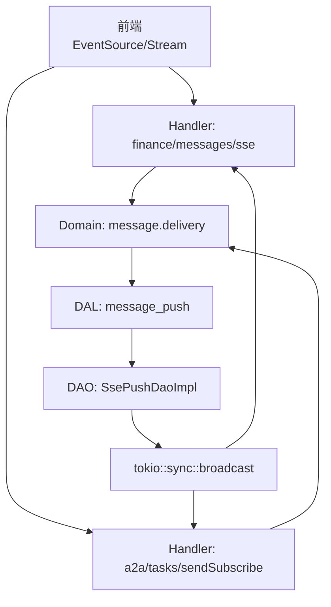
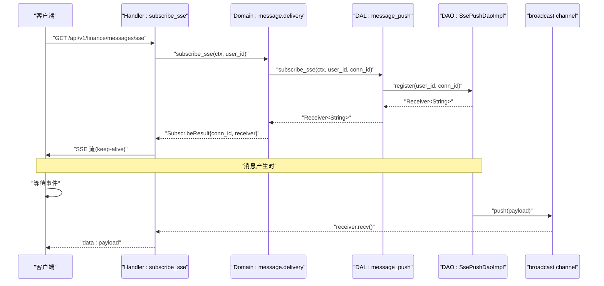
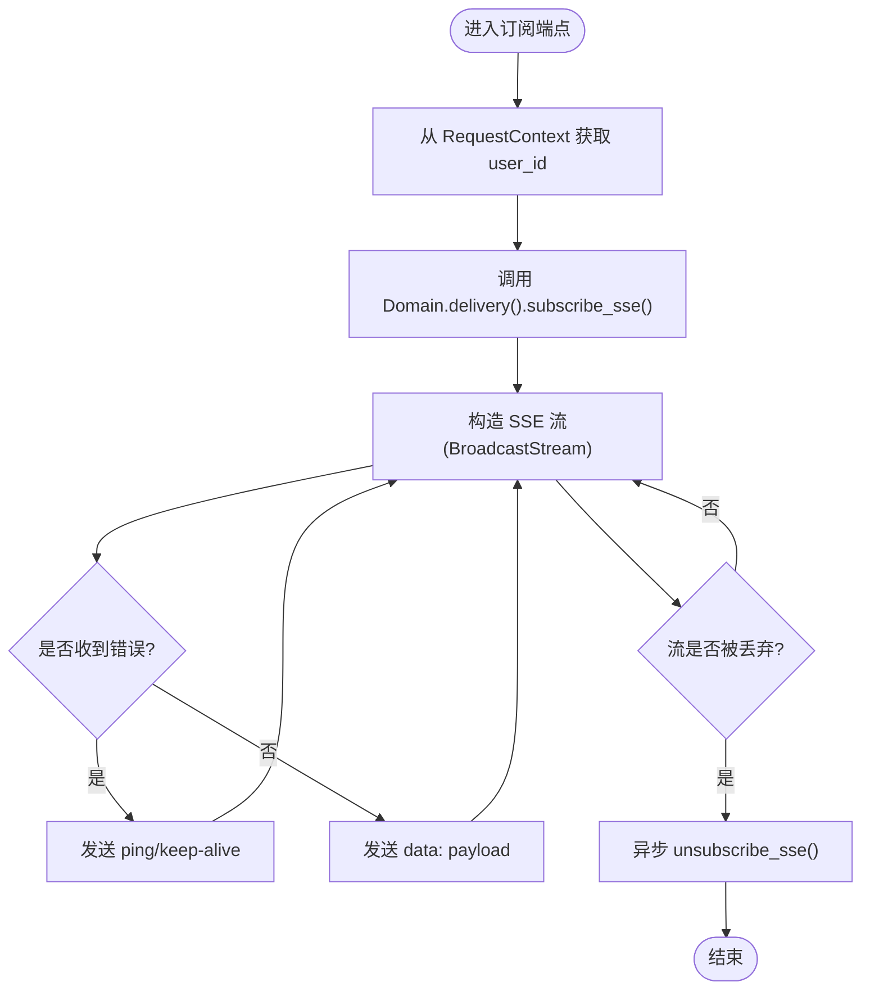
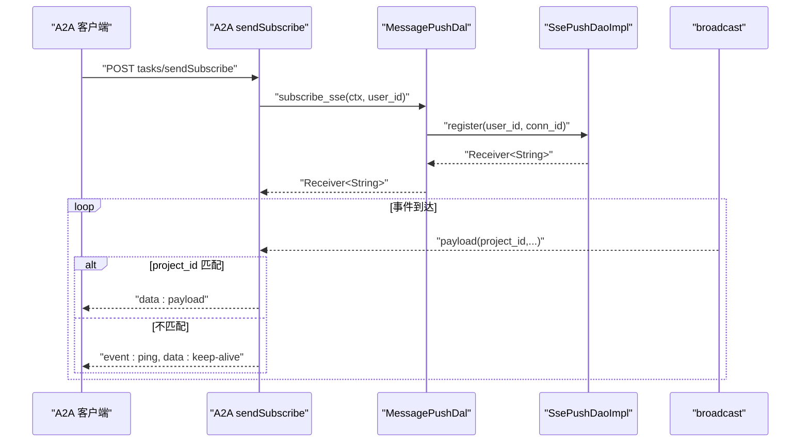
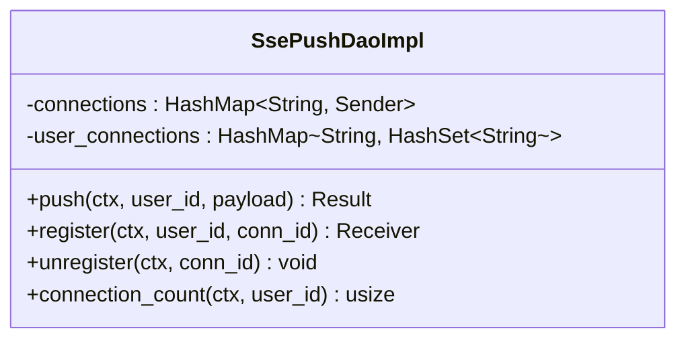
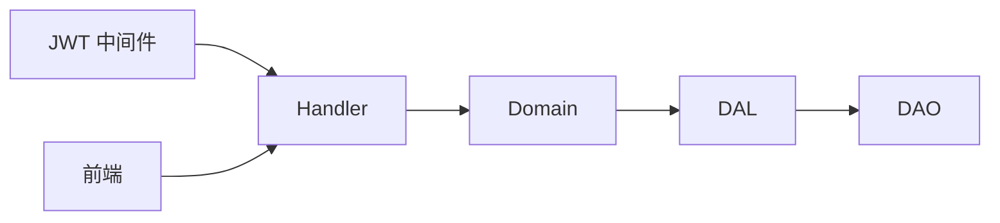

# 实时推送

<cite>
**本文引用的文件**
- [subscribe_sse.rs](file://src/handlers/finance/message/subscribe_sse.rs)
- [message_push DAL](file://src/service/dal/message_push.rs)
- [message_push DAO](file://src/service/dao/message_push.rs)
- [send_subscribe A2A](file://src/handlers/a2a/send_subscribe.rs)
- [JWT 认证中间件](file://src/middleware/jwt_auth.rs)
- [SSE 测试工具](file://tests/common/app.rs)
- [前端工作区 SSE 处理](file://frontend/src/pages/workspace.rs)
- [SSE 实现计划文档](file://docs/superpowers/plans/2026-07-14-sse-message-push.md)
</cite>

## 目录
1. [简介](#简介)
2. [项目结构](#项目结构)
3. [核心组件](#核心组件)
4. [架构总览](#架构总览)
5. [详细组件分析](#详细组件分析)
6. [依赖关系分析](#依赖关系分析)
7. [性能与可靠性](#性能与可靠性)
8. [故障排查指南](#故障排查指南)
9. [结论](#结论)
10. [附录：集成示例与最佳实践](#附录：集成示例与最佳实践)

## 简介
本章节面向“基于 SSE（Server-Sent Events）的实时消息推送”能力，系统说明连接建立、订阅管理、事件流处理、断线清理、消息投递路径、鉴权与权限控制、以及可扩展性与监控指标。该能力以 Axum SSE 为核心，结合 tokio::sync::broadcast 实现用户级广播通道，将 SSE 作为消息投递渠道之一，无缝融入现有 deliver_message 流程。

## 项目结构
SSE 相关代码分布在 Handler、DAL、DAO 三层，遵循单向调用：Handler → Domain → DAL → DAO。其中：
- Handler 层提供 SSE 订阅端点与 A2A 流式任务订阅端点
- DAL 层负责消息加工与序列化
- DAO 层维护连接映射与广播通道
- JWT 中间件完成身份认证并注入 RequestContext
- 前端通过 EventSource 或原生 fetch + stream 消费 SSE 事件

图表来源
- [subscribe_sse.rs:53-92](file://src/handlers/finance/message/subscribe_sse.rs#L53-L92)
- [send_subscribe A2A:36-101](file://src/handlers/a2a/send_subscribe.rs#L36-L101)
- [message_push DAL:41-114](file://src/service/dal/message_push.rs#L41-L114)
- [message_push DAO:40-136](file://src/service/dao/message_push.rs#L40-L136)

章节来源
- [subscribe_sse.rs:1-93](file://src/handlers/finance/message/subscribe_sse.rs#L1-L93)
- [message_push DAL:1-163](file://src/service/dal/message_push.rs#L1-L163)
- [message_push DAO:1-173](file://src/service/dao/message_push.rs#L1-L173)
- [send_subscribe A2A:1-101](file://src/handlers/a2a/send_subscribe.rs#L1-L101)
- [JWT 认证中间件:1-156](file://src/middleware/jwt_auth.rs#L1-L156)
- [SSE 测试工具:199-263](file://tests/common/app.rs#L199-L263)
- [前端工作区 SSE 处理:387-415](file://frontend/src/pages/workspace.rs#L387-L415)
- [SSE 实现计划文档:1-721](file://docs/superpowers/plans/2026-07-14-sse-message-push.md#L1-L721)

## 核心组件
- SSE 订阅端点（finance/messages/sse）
  - 从 RequestContext 中获取当前用户 ID（由 JWT 中间件注入）
  - 订阅用户级 broadcast channel，返回 SSE 流
  - 使用 keep-alive 维持长连接
  - 在流被丢弃时自动注销连接，避免内存泄漏
- A2A 流式任务订阅端点（tasks/sendSubscribe）
  - 复用同一用户级 broadcast channel
  - 按 project_id 过滤事件，非匹配事件发送 ping/keep-alive
- 消息推送 DAL
  - 将业务消息序列化为统一 payload
  - 委托 DAO 进行广播推送
- SSE 推送 DAO
  - 维护 connection_id -> sender 映射
  - 维护 user_id -> connection_ids 映射
  - 提供 push/register/unregister/connection_count 接口
- 认证与权限
  - JWT 中间件支持 Cookie/Bearer 双模式
  - 请求上下文携带用户信息，用于权限判断与路由隔离

章节来源
- [subscribe_sse.rs:53-92](file://src/handlers/finance/message/subscribe_sse.rs#L53-L92)
- [send_subscribe A2A:36-101](file://src/handlers/a2a/send_subscribe.rs#L36-L101)
- [message_push DAL:41-114](file://src/service/dal/message_push.rs#L41-L114)
- [message_push DAO:20-136](file://src/service/dao/message_push.rs#L20-L136)
- [JWT 认证中间件:25-87](file://src/middleware/jwt_auth.rs#L25-L87)

## 架构总览
SSE 推送整体流程如下：
- 客户端通过浏览器 EventSource 或后端测试工具发起 GET /api/v1/finance/messages/sse
- JWT 中间件校验 token，提取用户信息并写入请求头，后续中间件构建 RequestContext
- Handler 调用 Domain.delivery().subscribe_sse()，DAO 注册连接并返回 receiver
- 服务端将 receiver 包装为 SSE 流，持续向客户端推送消息
- 当任意消息产生时，deliver_message 会调用 DAL.push_to_sse()，DAL 序列化后交由 DAO.push() 广播到所有订阅者
- 客户端断开或服务关闭时，CleanupStream Drop 触发异步注销连接，释放资源

图表来源
- [subscribe_sse.rs:53-92](file://src/handlers/finance/message/subscribe_sse.rs#L53-L92)
- [message_push DAL:86-114](file://src/service/dal/message_push.rs#L86-L114)
- [message_push DAO:88-136](file://src/service/dao/message_push.rs#L88-L136)
- [send_subscribe A2A:62-101](file://src/handlers/a2a/send_subscribe.rs#L62-L101)

## 详细组件分析

### SSE 订阅端点（finance/messages/sse）
- 功能要点
  - 从 RequestContext 获取 user_id（由 JWT 中间件注入）
  - 调用 Domain.delivery().subscribe_sse() 获取 receiver
  - 将 receiver 转为 SSE 流，错误接收时发送 ping/keep-alive
  - 使用 keep_alive 保持连接活跃
  - 使用 CleanupStream 包装流，Drop 时异步注销连接，防止内存泄漏
- 关键实现位置
  - 订阅与流构造：[subscribe_sse.rs:53-92](file://src/handlers/finance/message/subscribe_sse.rs#L53-L92)
  - 连接清理逻辑：[subscribe_sse.rs:17-50](file://src/handlers/finance/message/subscribe_sse.rs#L17-L50)

图表来源
- [subscribe_sse.rs:53-92](file://src/handlers/finance/message/subscribe_sse.rs#L53-L92)
- [subscribe_sse.rs:17-50](file://src/handlers/finance/message/subscribe_sse.rs#L17-L50)

章节来源
- [subscribe_sse.rs:1-93](file://src/handlers/finance/message/subscribe_sse.rs#L1-L93)

### A2A 流式任务订阅端点（tasks/sendSubscribe）
- 功能要点
  - 复用用户级 broadcast channel，与消息推送共享基础设施
  - 解析 payload 中的 project_id，仅推送与当前任务匹配的事件
  - 非匹配事件发送 ping/keep-alive，保持连接活跃
- 关键实现位置
  - 订阅与过滤：[send_subscribe A2A:62-101](file://src/handlers/a2a/send_subscribe.rs#L62-L101)

图表来源
- [send_subscribe A2A:36-101](file://src/handlers/a2a/send_subscribe.rs#L36-L101)
- [message_push DAL:86-114](file://src/service/dal/message_push.rs#L86-L114)
- [message_push DAO:88-136](file://src/service/dao/message_push.rs#L88-L136)

章节来源
- [send_subscribe A2A:1-101](file://src/handlers/a2a/send_subscribe.rs#L1-L101)

### 消息推送 DAL（序列化与转发）
- 职责
  - 将业务消息序列化为统一 payload（包含 message_id、project_id、task_id、from/to、content、created_at 等）
  - 调用 DAO.push() 进行广播
  - 提供 subscribe/unsubscribe/connection_count 接口
- 关键实现位置
  - 结构与接口：[message_push DAL:12-59](file://src/service/dal/message_push.rs#L12-L59)
  - 实现与单例：[message_push DAL:61-114](file://src/service/dal/message_push.rs#L61-L114)

章节来源
- [message_push DAL:1-163](file://src/service/dal/message_push.rs#L1-L163)

### SSE 推送 DAO（连接管理与广播）
- 职责
  - 维护 connections: connection_id -> broadcast::Sender
  - 维护 user_connections: user_id -> HashSet<connection_id>
  - register：创建 channel，记录映射
  - push：遍历用户的所有连接，尝试发送
  - unregister：移除连接并从用户集合中删除
  - connection_count：统计用户连接数
- 关键实现位置
  - 数据结构与接口：[message_push DAO:12-38](file://src/service/dao/message_push.rs#L12-L38)
  - 实现细节：[message_push DAO:40-136](file://src/service/dao/message_push.rs#L40-L136)

图表来源
- [message_push DAO:40-136](file://src/service/dao/message_push.rs#L40-L136)

章节来源
- [message_push DAO:1-173](file://src/service/dao/message_push.rs#L1-L173)

### 认证与权限控制
- JWT 中间件支持 Cookie 与 Bearer 双模式
- 验证通过后，将用户信息写入请求头，供后续中间件构建 RequestContext
- SSE 订阅端点直接从 RequestContext 获取 user_id，无需显式路径参数传递
- 关键实现位置
  - 认证流程与响应策略：[JWT 认证中间件:25-87](file://src/middleware/jwt_auth.rs#L25-L87)
  - 未认证响应策略：[JWT 认证中间件:139-156](file://src/middleware/jwt_auth.rs#L139-L156)

章节来源
- [JWT 认证中间件:1-156](file://src/middleware/jwt_auth.rs#L1-L156)

### 前端集成与消息过滤
- 前端通过 EventSource 或原生流处理 SSE 事件
- 对收到的消息进行 JSON 反序列化，并按 project_id/agent_id 过滤
- 累计消息流量（按分钟桶），淘汰旧数据，控制内存占用
- 关键实现位置
  - 事件处理与过滤：[前端工作区 SSE 处理:387-415](file://frontend/src/pages/workspace.rs#L387-L415)

章节来源
- [前端工作区 SSE 处理:387-415](file://frontend/src/pages/workspace.rs#L387-L415)

## 依赖关系分析
- Handler 依赖 Domain.delivery() 进行订阅与推送协调
- Domain 依赖 DAL 进行消息序列化与转发
- DAL 依赖 DAO 进行连接管理与广播
- 认证中间件位于最外层，确保 RequestContext 可用
- 前端通过标准 SSE 协议消费事件，无需额外 SDK

图表来源
- [subscribe_sse.rs:53-92](file://src/handlers/finance/message/subscribe_sse.rs#L53-L92)
- [message_push DAL:61-114](file://src/service/dal/message_push.rs#L61-L114)
- [message_push DAO:40-136](file://src/service/dao/message_push.rs#L40-L136)
- [JWT 认证中间件:25-87](file://src/middleware/jwt_auth.rs#L25-L87)

章节来源
- [subscribe_sse.rs:1-93](file://src/handlers/finance/message/subscribe_sse.rs#L1-L93)
- [message_push DAL:1-163](file://src/service/dal/message_push.rs#L1-L163)
- [message_push DAO:1-173](file://src/service/dao/message_push.rs#L1-L173)
- [JWT 认证中间件:1-156](file://src/middleware/jwt_auth.rs#L1-L156)

## 性能与可靠性
- 连接生命周期管理
  - 使用 CleanupStream 在流丢弃时自动注销连接，避免内存泄漏
  - 参考修复说明：[subscribe_sse.rs:17-50](file://src/handlers/finance/message/subscribe_sse.rs#L17-L50)
- 心跳与保活
  - 使用 keep_alive 定期发送空事件，维持连接活跃
  - 参考实现：[subscribe_sse.rs:87-92](file://src/handlers/finance/message/subscribe_sse.rs#L87-L92)
- 消息去重与过滤
  - 前端按 project_id/agent_id 过滤，减少无关事件处理
  - A2A 端点在服务器侧按 project_id 过滤，非匹配事件发送 ping
  - 参考实现：[send_subscribe A2A:85-101](file://src/handlers/a2a/send_subscribe.rs#L85-L101)、[前端工作区 SSE 处理:387-415](file://frontend/src/pages/workspace.rs#L387-L415)
- 批量推送
  - 通过用户级 broadcast channel，一次消息可推送给多个连接
  - 参考实现：[message_push DAO:62-86](file://src/service/dao/message_push.rs#L62-L86)
- 连接数限制与扩展
  - 当前为进程内广播，适合单机；多实例需引入外部消息总线（如 Redis Pub/Sub）
  - 可通过 connection_count 指标监控连接规模
  - 参考实现：[message_push DAO:123-130](file://src/service/dao/message_push.rs#L123-L130)
- 可靠性保证
  - 使用 tokio::sync::broadcast，容量有限，若消费者滞后可能丢消息
  - 建议在业务层增加重试与幂等处理（例如基于 message_id 的去重）
  - 参考实现：[message_push DAL:73-84](file://src/service/dal/message_push.rs#L73-L84)

章节来源
- [subscribe_sse.rs:17-92](file://src/handlers/finance/message/subscribe_sse.rs#L17-L92)
- [send_subscribe A2A:85-101](file://src/handlers/a2a/send_subscribe.rs#L85-L101)
- [message_push DAL:73-84](file://src/service/dal/message_push.rs#L73-L84)
- [message_push DAO:62-130](file://src/service/dao/message_push.rs#L62-L130)
- [前端工作区 SSE 处理:387-415](file://frontend/src/pages/workspace.rs#L387-L415)

## 故障排查指南
- 常见问题
  - 连接未清理导致内存增长：检查 CleanupStream 是否正确包装流，确认 Drop 触发注销
    - 参考：[subscribe_sse.rs:17-50](file://src/handlers/finance/message/subscribe_sse.rs#L17-L50)
  - 事件丢失或延迟：检查 broadcast 容量与消费者处理速度，必要时增大容量或优化消费逻辑
    - 参考：[message_push DAO:88-106](file://src/service/dao/message_push.rs#L88-L106)
  - 认证失败：检查 JWT 中间件配置与 Cookie/Bearer 设置
    - 参考：[JWT 认证中间件:25-87](file://src/middleware/jwt_auth.rs#L25-L87)
- 诊断工具
  - 使用测试工具收集 SSE 事件，验证端到端链路
    - 参考：[SSE 测试工具:199-263](file://tests/common/app.rs#L199-L263)
  - 监控连接数与推送成功率，结合日志定位问题
    - 参考：[message_push DAO:123-130](file://src/service/dao/message_push.rs#L123-L130)

章节来源
- [subscribe_sse.rs:17-50](file://src/handlers/finance/message/subscribe_sse.rs#L17-L50)
- [message_push DAO:88-130](file://src/service/dao/message_push.rs#L88-L130)
- [JWT 认证中间件:25-87](file://src/middleware/jwt_auth.rs#L25-L87)
- [SSE 测试工具:199-263](file://tests/common/app.rs#L199-L263)

## 结论
本项目实现了基于 SSE 的实时消息推送机制，采用 Handler → Domain → DAL → DAO 的清晰分层，利用 tokio::sync::broadcast 实现用户级广播，并通过 CleanupStream 保障连接生命周期管理。认证与权限控制由 JWT 中间件统一处理，前端可按项目维度过滤事件。当前方案适用于单机场景，水平扩展需引入外部消息总线。建议在生产环境加强连接监控、消息去重与重试机制，以提升可靠性与可观测性。

## 附录：集成示例与最佳实践
- SSE 客户端集成
  - 浏览器：使用 EventSource 连接 /api/v1/finance/messages/sse，自动携带 Cookie
  - 后端测试：使用测试工具连接并收集事件，便于集成测试
  - 参考：[SSE 测试工具:199-263](file://tests/common/app.rs#L199-L263)
- 消息过滤
  - 前端按 project_id/agent_id 过滤，减少无关事件处理
  - 参考：[前端工作区 SSE 处理:387-415](file://frontend/src/pages/workspace.rs#L387-L415)
- 批量推送
  - 通过用户级 broadcast channel，一次消息推送给多个连接
  - 参考：[message_push DAO:62-86](file://src/service/dao/message_push.rs#L62-L86)
- 性能优化
  - 合理设置 broadcast 容量，避免消费者滞后导致丢消息
  - 使用 keep_alive 维持连接，降低网络中断概率
  - 参考：[subscribe_sse.rs:87-92](file://src/handlers/finance/message/subscribe_sse.rs#L87-L92)
- 安全与权限
  - 使用 JWT 中间件进行认证，确保 RequestContext 可用
  - 参考：[JWT 认证中间件:25-87](file://src/middleware/jwt_auth.rs#L25-L87)
- 水平扩展与负载均衡
  - 当前为进程内广播，多实例需引入外部消息总线（如 Redis Pub/Sub）
  - 通过 connection_count 指标监控连接规模
  - 参考：[message_push DAO:123-130](file://src/service/dao/message_push.rs#L123-L130)

章节来源
- [SSE 测试工具:199-263](file://tests/common/app.rs#L199-L263)
- [前端工作区 SSE 处理:387-415](file://frontend/src/pages/workspace.rs#L387-L415)
- [message_push DAO:62-130](file://src/service/dao/message_push.rs#L62-L130)
- [subscribe_sse.rs:87-92](file://src/handlers/finance/message/subscribe_sse.rs#L87-L92)
- [JWT 认证中间件:25-87](file://src/middleware/jwt_auth.rs#L25-L87)