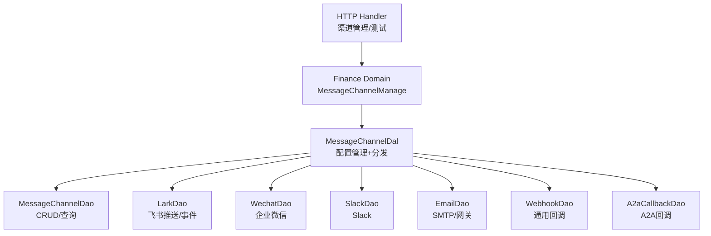
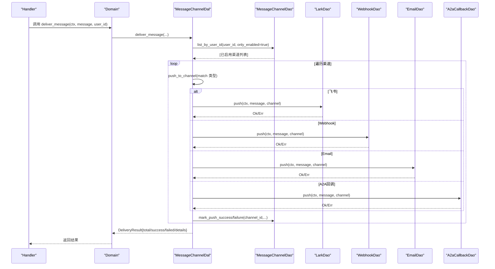
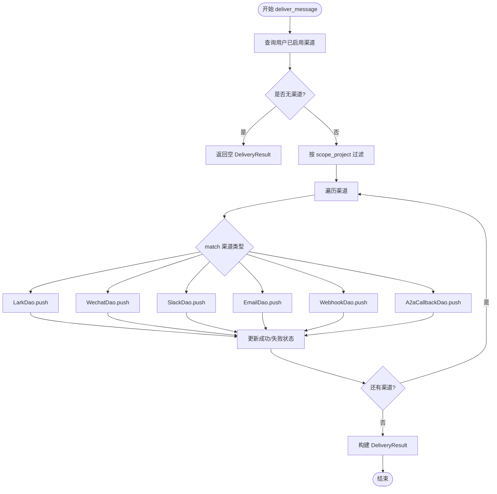
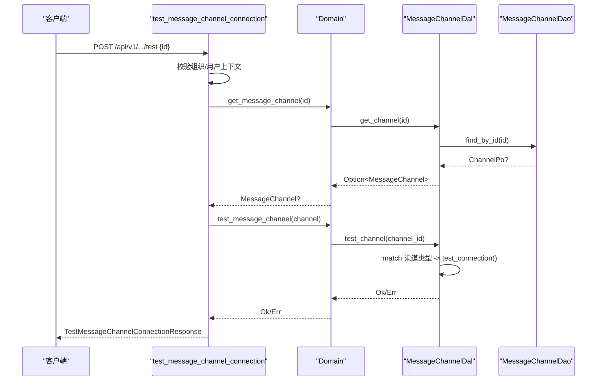
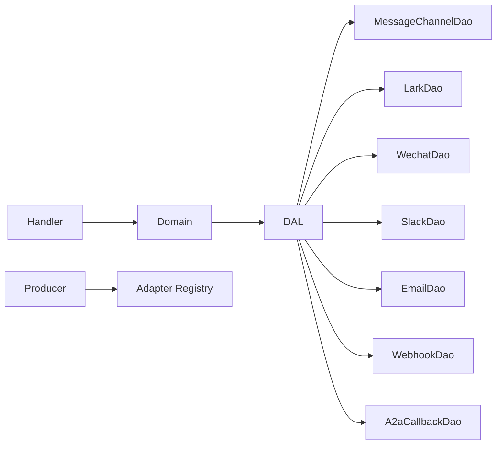

# 消息渠道管理

<cite>
**本文引用的文件**
- [message_channel_design.md](file://docs/message_channel_design.md)
- [enums/message_channel.rs](file://common/src/enums/message_channel.rs)
- [models/message_channel.rs](file://src/models/message_channel.rs)
- [dal/message_channel.rs](file://src/service/dal/message_channel.rs)
- [domain/finance/message_channel.rs](file://src/service/domain/finance/message_channel.rs)
- [handlers/finance/message_channel/test_message_channel_connection.rs](file://src/handlers/finance/message_channel/test_message_channel_connection.rs)
- [dao/lark/mod.rs](file://src/service/dao/lark/mod.rs)
- [dao/webhook/mod.rs](file://src/service/dao/webhook/mod.rs)
- [dao/email/mod.rs](file://src/service/dao/email/mod.rs)
- [producer/message_channel.rs](file://src/producer/message_channel.rs)
- [pkg/stats/mod.rs](file://src/pkg/stats/mod.rs)
- [testing_guidelines.md](file://docs/testing_guidelines.md)
</cite>

## 目录
1. [简介](#简介)
2. [项目结构](#项目结构)
3. [核心组件](#核心组件)
4. [架构总览](#架构总览)
5. [详细组件分析](#详细组件分析)
6. [依赖关系分析](#依赖关系分析)
7. [性能与并发](#性能与并发)
8. [故障排查指南](#故障排查指南)
9. [结论](#结论)
10. [附录：配置模板与示例](#附录：配置模板与示例)

## 简介
本文件面向“消息渠道管理”能力，覆盖多渠道（HTTP、WebSocket、SSE、邮件等）的创建、配置、管理与监控。重点说明：
- 渠道类型与状态模型
- DAL 统一分发与 DAO 独立实现
- 连接测试、错误聚合与失败隔离
- SSE 推送集成与订阅端点
- 多渠道路由、消息分发与结果聚合
- 安全认证、访问控制与流量限制建议
- 热插拔、动态配置与版本兼容性策略
- 性能监控、错误统计与告警通知机制

## 项目结构
消息渠道管理遵循严格四层单向调用：Adapter（Handler/回调）→ Domain → DAL → DAO。渠道配置与推送分别由 DAL 统一管理，DAO 按渠道独立实现；Domain 仅暴露业务编排接口，Handler 只做参数校验与 DTO 组装。

**图表来源**
- [dal/message_channel.rs:60-126](file://src/service/dal/message_channel.rs#L60-L126)
- [dal/message_channel.rs:130-142](file://src/service/dal/message_channel.rs#L130-L142)
- [dal/message_channel.rs:202-222](file://src/service/dal/message_channel.rs#L202-L222)
- [dal/message_channel.rs:299-313](file://src/service/dal/message_channel.rs#L299-L313)

**章节来源**
- [message_channel_design.md:235-320](file://docs/message_channel_design.md#L235-L320)
- [dal/message_channel.rs:1-126](file://src/service/dal/message_channel.rs#L1-L126)

## 核心组件
- 渠道类型与状态枚举：定义支持的渠道类型与生命周期状态，提供字符串化与序列化能力。
- 渠道实体与持久化对象：封装渠道配置、范围、状态迁移与时间戳。
- DAL 统一入口：集中处理渠道 CRUD、状态切换、连接测试与消息分发。
- 各渠道 DAO：各自负责协议细节（HTTP/WebSocket/SMTP/A2A），对外暴露 push/test_connection。
- Handler 管理面：提供创建、查询、更新、删除、状态切换与连接测试 API。
- 生产者与适配器：启动/停止外部渠道适配器（如飞书 WebSocket 事件监听）。

**章节来源**
- [enums/message_channel.rs:9-28](file://common/src/enums/message_channel.rs#L9-L28)
- [enums/message_channel.rs:82-122](file://common/src/enums/message_channel.rs#L82-L122)
- [models/message_channel.rs:19-113](file://src/models/message_channel.rs#L19-L113)
- [models/message_channel.rs:115-195](file://src/models/message_channel.rs#L115-L195)
- [dal/message_channel.rs:60-126](file://src/service/dal/message_channel.rs#L60-L126)
- [domain/finance/message_channel.rs:11-72](file://src/service/domain/finance/message_channel.rs#L11-L72)
- [handlers/finance/message_channel/test_message_channel_connection.rs:1-57](file://src/handlers/finance/message_channel/test_message_channel_connection.rs#L1-L57)
- [producer/message_channel.rs:93-115](file://src/producer/message_channel.rs#L93-L115)

## 架构总览
DAL 通过纯 match 将消息分发到具体渠道 DAO，失败不阻断其他渠道；同时记录成功/失败并更新渠道最后推送时间与错误信息。SSE 作为内置推送通道，与外部渠道并行工作。

**图表来源**
- [dal/message_channel.rs:226-284](file://src/service/dal/message_channel.rs#L226-L284)
- [dal/message_channel.rs:299-335](file://src/service/dal/message_channel.rs#L299-L335)

## 详细组件分析

### 渠道类型与状态
- ChannelType：支持 Lark、Wechat、Slack、Email、Webhook、A2aCallback。
- ChannelStatus：Deleted、Active、Disabled，并提供状态迁移规则与可用目标集合。

**章节来源**
- [enums/message_channel.rs:9-28](file://common/src/enums/message_channel.rs#L9-L28)
- [enums/message_channel.rs:82-122](file://common/src/enums/message_channel.rs#L82-L122)
- [models/message_channel.rs:67-107](file://src/models/message_channel.rs#L67-L107)

### 渠道实体与配置
- MessageChannelPo：包含组织/用户/Agent 绑定、渠道类型、名称、webhook_url、access_token、secret、config_json、scope_project、last_pushed_at、last_error 等。
- ChannelConfig：按渠道分组的扩展配置（飞书、微信、邮件、Slack、Webhook、extra）。

**章节来源**
- [models/message_channel.rs:115-195](file://src/models/message_channel.rs#L115-L195)
- [models/message_channel.rs:197-255](file://src/models/message_channel.rs#L197-L255)

### DAL 统一分发与连接测试
- 配置管理：create/update/delete/get/list/query/status。
- 连接测试：根据渠道类型匹配对应 DAO 的 test_connection。
- 消息分发：查询用户已启用渠道，按 scope_project 过滤后逐个推送，记录详情并更新状态。

**图表来源**
- [dal/message_channel.rs:226-284](file://src/service/dal/message_channel.rs#L226-L284)
- [dal/message_channel.rs:299-335](file://src/service/dal/message_channel.rs#L299-L335)

**章节来源**
- [dal/message_channel.rs:60-126](file://src/service/dal/message_channel.rs#L60-L126)
- [dal/message_channel.rs:202-222](file://src/service/dal/message_channel.rs#L202-L222)
- [dal/message_channel.rs:226-284](file://src/service/dal/message_channel.rs#L226-L284)
- [dal/message_channel.rs:299-335](file://src/service/dal/message_channel.rs#L299-L335)

### 各渠道 DAO 职责
- 飞书（LarkDao）：出站消息推送、入站事件监听（WebSocket）、凭证获取与测试。
- 通用 Webhook（WebhookDao）：HTTP 回调推送与连接测试。
- 邮件（EmailDao）：SMTP/邮件网关推送与连接测试。
- 其他渠道（Wechat/Slack/A2aCallback）：类似 push/test_connection 约定。

**章节来源**
- [dao/lark/mod.rs:1-82](file://src/service/dao/lark/mod.rs#L1-L82)
- [dao/webhook/mod.rs:1-48](file://src/service/dao/webhook/mod.rs#L1-L48)
- [dao/email/mod.rs:1-47](file://src/service/dao/email/mod.rs#L1-L47)

### Handler 管理面与连接测试
- 管理面路由：创建、查询、更新、删除、状态切换、测试连接。
- 连接测试流程：解析请求上下文与权限 → 获取渠道 → 调用 Domain → 返回测试结果。

**图表来源**
- [handlers/finance/message_channel/test_message_channel_connection.rs:17-56](file://src/handlers/finance/message_channel/test_message_channel_connection.rs#L17-L56)
- [dal/message_channel.rs:202-222](file://src/service/dal/message_channel.rs#L202-L222)

**章节来源**
- [handlers/finance/message_channel/test_message_channel_connection.rs:1-57](file://src/handlers/finance/message_channel/test_message_channel_connection.rs#L1-L57)
- [domain/finance/message_channel.rs:11-72](file://src/service/domain/finance/message_channel.rs#L11-L72)

### SSE 推送集成
- SSE 作为内置推送通道，与外部渠道并行；消费者在消息处理后调用 deliver_message，内部可结合 SSE 推送。
- 订阅端点：GET /api/v1/finance/messages/sse/{user_id}，建立流式响应。
- 集成测试覆盖 SSE 连通性与端到端内容验证。

**章节来源**
- [testing_guidelines.md:479-491](file://docs/testing_guidelines.md#L479-L491)
- [message_channel_design.md:23-36](file://docs/message_channel_design.md#L23-L36)

### 多渠道路由、消息分发与聚合
- 路由规则：按用户维度查询已启用渠道，并按 scope_project 进行项目级过滤。
- 分发策略：顺序遍历、逐个推送、失败隔离；每个渠道结果写入 details。
- 聚合指标：DeliveryResult.total/success/failed/sse_delivered 汇总统计。

**章节来源**
- [dal/message_channel.rs:226-284](file://src/service/dal/message_channel.rs#L226-L284)
- [dal/message_channel.rs:340-391](file://src/service/dal/message_channel.rs#L340-L391)

## 依赖关系分析
- 单向依赖：Handler → Domain → DAL → DAO；DAL 内聚所有渠道 DAO，避免跨层耦合。
- 渠道 DAO 之间相互独立，新增渠道只需在 DAL 的 match 中增加分支。
- 生产者/适配器：消息渠道生产者负责注册与启停外部适配器（如飞书事件监听）。

**图表来源**
- [dal/message_channel.rs:130-142](file://src/service/dal/message_channel.rs#L130-L142)
- [producer/message_channel.rs:93-115](file://src/producer/message_channel.rs#L93-L115)

**章节来源**
- [dal/message_channel.rs:130-142](file://src/service/dal/message_channel.rs#L130-L142)
- [producer/message_channel.rs:93-115](file://src/producer/message_channel.rs#L93-L115)

## 性能与并发
- 并发推送：DAL 对每个渠道顺序执行 push，但可在上层使用异步任务并发推送以提升吞吐（设计文档中建议使用 tokio::spawn 异步执行）。
- 失败隔离：单个渠道失败不影响其他渠道与主流程，错误信息聚合至 details。
- SSE 推送：基于广播通道，适合多订阅者场景；注意背压与丢帧处理。
- 统计与监控：使用 stats 模块记录运行时指标，便于观测渠道健康度与延迟分布。

**章节来源**
- [message_channel_design.md:401-407](file://docs/message_channel_design.md#L401-L407)
- [dal/message_channel.rs:226-284](file://src/service/dal/message_channel.rs#L226-L284)
- [pkg/stats/mod.rs:1-57](file://src/pkg/stats/mod.rs#L1-L57)

## 故障排查指南
- 连接测试失败：检查渠道配置（token、secret、URL、SMTP 参数），调用 /test 接口定位具体错误。
- 推送失败聚合：查看 DeliveryResult.details 中的 error 字段，确认是否为 unsupported_operation 或网络不可达。
- SSE 订阅异常：确认订阅端点返回 200，检查后端广播通道与消费者是否正确调用 deliver_message。
- 日志与统计：结合 stats 模块与系统日志，定位慢调用与错误热点。

**章节来源**
- [dal/message_channel.rs:202-222](file://src/service/dal/message_channel.rs#L202-L222)
- [dal/message_channel.rs:315-335](file://src/service/dal/message_channel.rs#L315-L335)
- [testing_guidelines.md:479-491](file://docs/testing_guidelines.md#L479-L491)
- [pkg/stats/mod.rs:152-171](file://src/pkg/stats/mod.rs#L152-L171)

## 结论
消息渠道管理以 DAL 为统一入口，采用纯 match 分发到独立 DAO，实现高内聚低耦合与编译期安全。通过连接测试、失败聚合与 SSE 推送，形成完整的渠道生命周期管理能力。配合 stats 监控与集成测试，保障多渠道稳定运行与持续演进。

## 附录：配置模板与示例
- 渠道配置模板（ChannelConfig）：
  - 飞书：lark_app_id、lark_app_secret、lark_encrypt_key、lark_verification_token、lark_open_id、lark_user_name
  - 微信：wechat_app_id、wechat_app_secret、wechat_open_id
  - 邮件：email_smtp_host、email_smtp_port、email_username、email_password、email_from_address、email_to_address
  - Slack：slack_bot_token、slack_channel_id
  - Webhook：webhook_method、webhook_headers、webhook_body_template
  - 扩展：extra

- 连接测试示例：
  - 调用 POST /api/v1/.../test，传入渠道 ID，返回 success/error。

- 多渠道路由示例：
  - 用户全局渠道（scope_project=NULL）接收所有项目消息；项目级渠道仅接收指定项目消息。

- 故障转移与降级：
  - 某渠道失败不影响其他渠道；可结合重试队列与告警策略实现自动恢复。

**章节来源**
- [models/message_channel.rs:197-255](file://src/models/message_channel.rs#L197-L255)
- [handlers/finance/message_channel/test_message_channel_connection.rs:17-56](file://src/handlers/finance/message_channel/test_message_channel_connection.rs#L17-L56)
- [dal/message_channel.rs:243-256](file://src/service/dal/message_channel.rs#L243-L256)