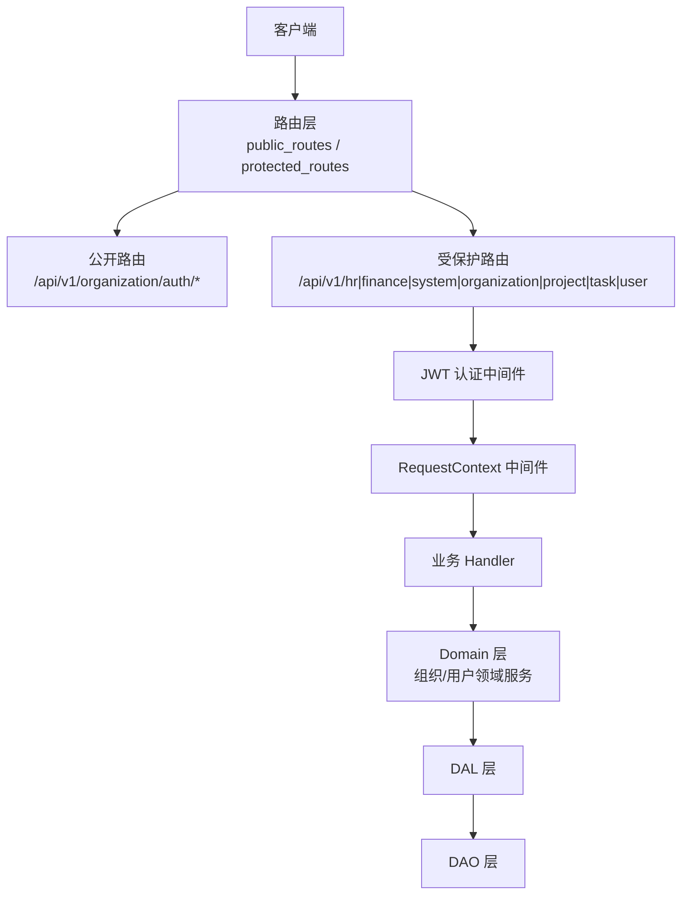
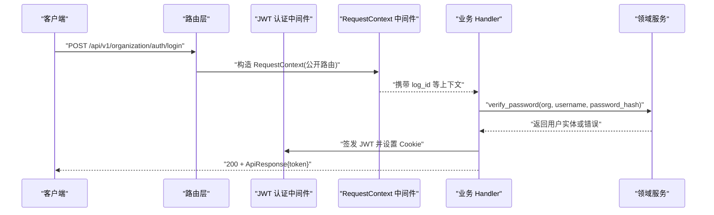
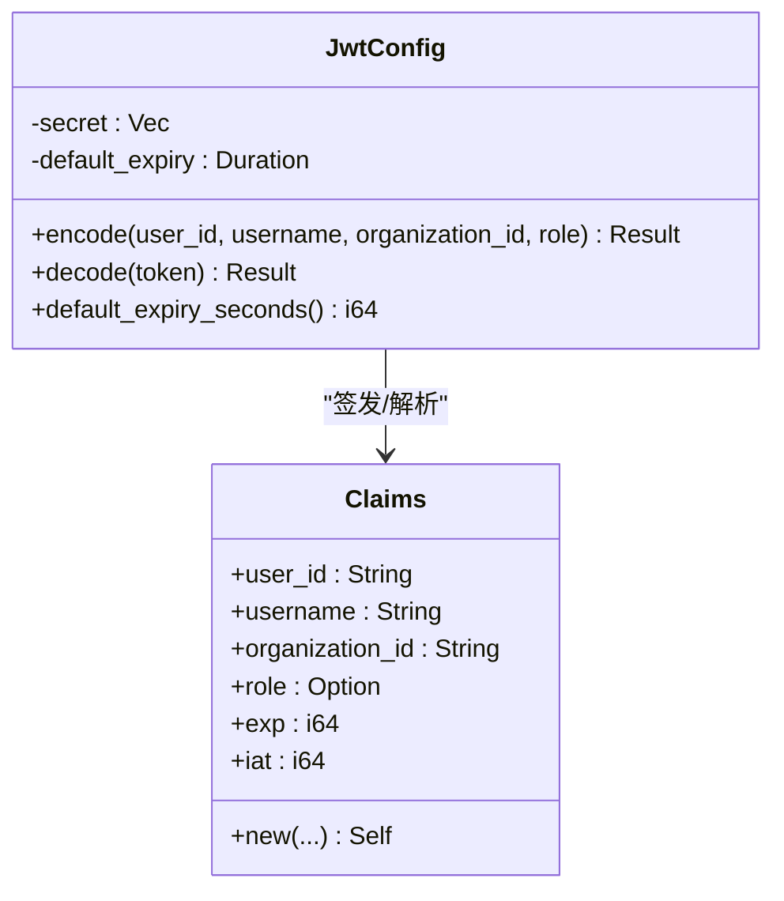
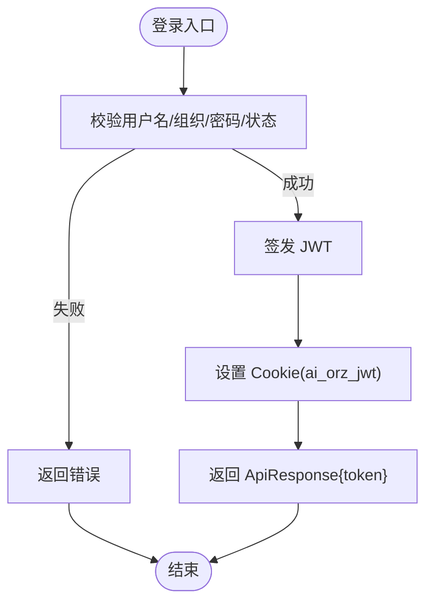
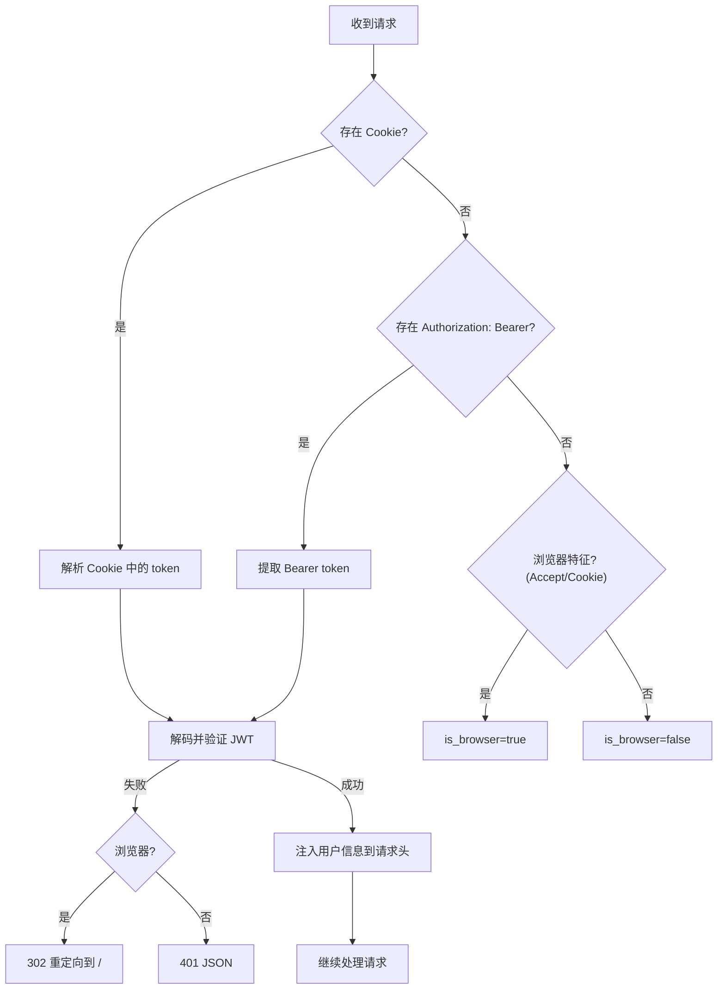
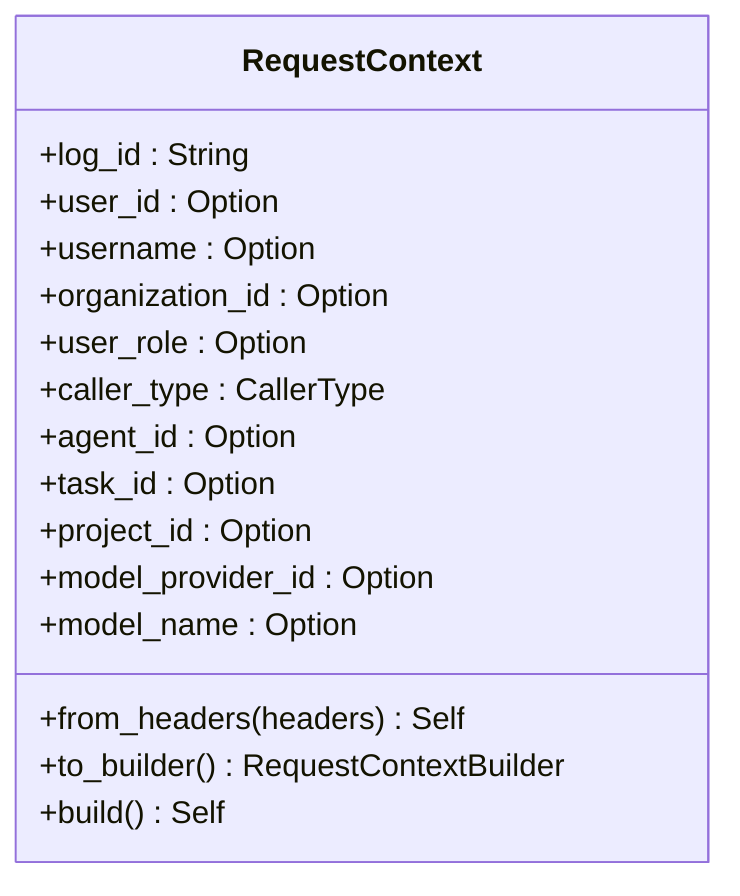
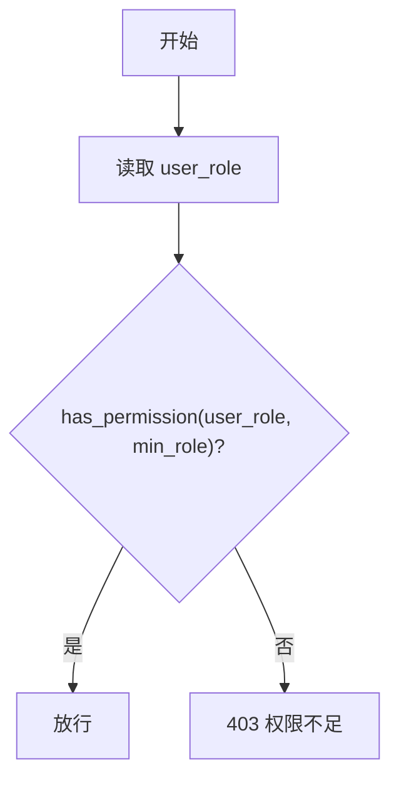
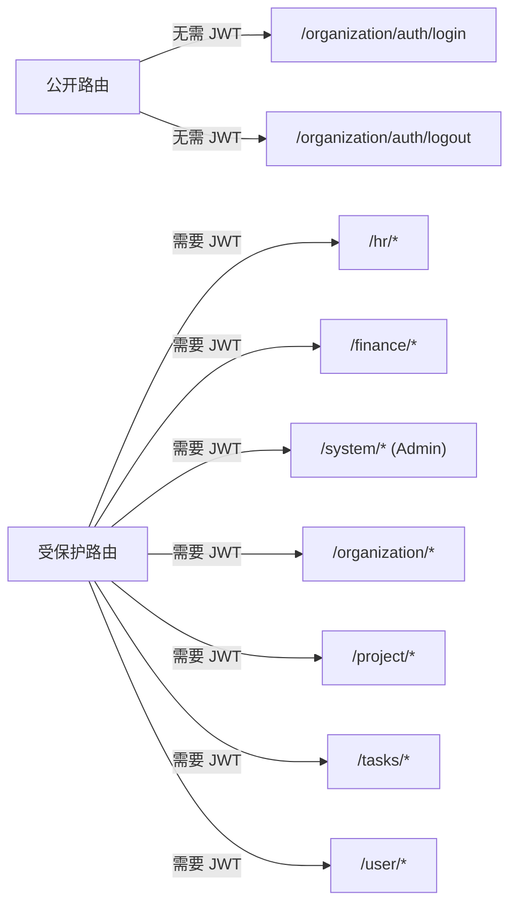
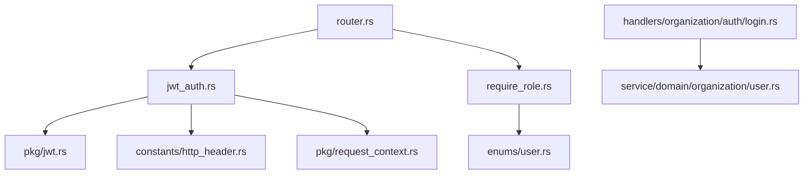

# 用户认证与授权

<cite>
**本文引用的文件**
- [src/router.rs](file://src/router.rs)
- [src/middleware/jwt_auth.rs](file://src/middleware/jwt_auth.rs)
- [src/middleware/require_role.rs](file://src/middleware/require_role.rs)
- [src/pkg/jwt.rs](file://src/pkg/jwt.rs)
- [src/pkg/request_context.rs](file://src/pkg/request_context.rs)
- [common/src/api/auth.rs](file://common/src/api/auth.rs)
- [common/src/enums/user.rs](file://common/src/enums/user.rs)
- [common/src/constants/http_header.rs](file://common/src/constants/http_header.rs)
- [src/handlers/organization/auth/login.rs](file://src/handlers/organization/auth/login.rs)
- [src/handlers/organization/auth/logout.rs](file://src/handlers/organization/auth/logout.rs)
- [src/service/domain/organization/user.rs](file://src/service/domain/organization/user.rs)
</cite>

## 目录
1. [简介](#简介)
2. [项目结构](#项目结构)
3. [核心组件](#核心组件)
4. [架构总览](#架构总览)
5. [详细组件分析](#详细组件分析)
6. [依赖关系分析](#依赖关系分析)
7. [性能与安全考量](#性能与安全考量)
8. [故障排查指南](#故障排查指南)
9. [结论](#结论)
10. [附录：API 接口文档](#附录api-接口文档)

## 简介
本章节面向“用户认证与授权”能力，系统性说明 JWT 令牌认证、登录登出流程、会话管理、密码校验存储、RBAC 权限模型、角色继承、权限验证中间件工作原理，以及多租户环境下的认证隔离机制与安全最佳实践。文档同时提供完整的认证流程图、JWT 令牌结构说明、权限检查逻辑与 API 接口规范（请求参数、响应格式、错误处理示例）。

## 项目结构
认证与授权相关代码按四层单向调用组织：Adapter（HTTP Handler）→ Domain → DAL → DAO；认证相关的核心实现位于 middleware、pkg、handlers、service/domain 等模块。路由层将公开路由与受保护路由分离，并通过中间件链完成认证与上下文构建。



图表来源
- [src/router.rs:12-136](file://src/router.rs#L12-L136)
- [src/middleware/jwt_auth.rs:25-87](file://src/middleware/jwt_auth.rs#L25-L87)
- [src/pkg/request_context.rs:295-356](file://src/pkg/request_context.rs#L295-L356)

章节来源
- [src/router.rs:12-136](file://src/router.rs#L12-L136)

## 核心组件
- JWT 工具模块：负责 Claims 定义、签发与验签、全局配置单例。
- JWT 认证中间件：双模式提取 token（Cookie/Bearer），验证后将用户信息注入请求头，供后续 RequestContext 使用。
- RequestContext：贯穿请求生命周期的不可变上下文，承载用户身份、组织维度、调用方类型等。
- 角色权限中间件：基于并查集的角色继承体系，判断当前用户是否满足最低角色要求。
- 登录/登出 Handler：登录时校验用户并签发 JWT Cookie；登出时清除 Cookie。
- 领域服务：验证用户名、组织归属、密码哈希与用户状态。

章节来源
- [src/pkg/jwt.rs:11-136](file://src/pkg/jwt.rs#L11-L136)
- [src/middleware/jwt_auth.rs:25-87](file://src/middleware/jwt_auth.rs#L25-L87)
- [src/pkg/request_context.rs:23-61](file://src/pkg/request_context.rs#L23-L61)
- [src/middleware/require_role.rs:1-39](file://src/middleware/require_role.rs#L1-L39)
- [src/handlers/organization/auth/login.rs:18-69](file://src/handlers/organization/auth/login.rs#L18-L69)
- [src/handlers/organization/auth/logout.rs:15-40](file://src/handlers/organization/auth/logout.rs#L15-L40)
- [src/service/domain/organization/user.rs:85-123](file://src/service/domain/organization/user.rs#L85-L123)

## 架构总览
认证与授权在 Axum 路由中以“洋葱模型”中间件链执行：外层先进行 JWT 认证，内层再构建 RequestContext，随后进入具体 Handler。系统管理路由整体要求 Admin 权限，敏感操作在 Handler 内部二次校验 SuperAdmin。



图表来源
- [src/router.rs:61-94](file://src/router.rs#L61-L94)
- [src/handlers/organization/auth/login.rs:18-69](file://src/handlers/organization/auth/login.rs#L18-L69)
- [src/service/domain/organization/user.rs:85-123](file://src/service/domain/organization/user.rs#L85-L123)

## 详细组件分析

### JWT 令牌与签名
- Claims 包含用户 ID、用户名、组织 ID、角色数值、签发时间与过期时间。
- 使用 HS256 算法与全局密钥进行签名与验签。
- 全局配置通过 OnceLock 初始化，提供 encode/decode 便捷方法。



图表来源
- [src/pkg/jwt.rs:11-106](file://src/pkg/jwt.rs#L11-L106)

章节来源
- [src/pkg/jwt.rs:11-136](file://src/pkg/jwt.rs#L11-L136)

### 登录流程
- 公开路由接受登录请求，不强制 JWT。
- 领域服务校验用户名、组织归属、密码哈希与用户状态。
- 成功后签发 JWT，并以 HttpOnly Cookie 形式下发，同时返回 token 给 API 调用方。



图表来源
- [src/handlers/organization/auth/login.rs:18-69](file://src/handlers/organization/auth/login.rs#L18-L69)
- [src/service/domain/organization/user.rs:85-123](file://src/service/domain/organization/user.rs#L85-L123)

章节来源
- [src/handlers/organization/auth/login.rs:18-69](file://src/handlers/organization/auth/login.rs#L18-L69)
- [src/service/domain/organization/user.rs:85-123](file://src/service/domain/organization/user.rs#L85-L123)

### 登出流程
- 通过设置同名 Cookie 且最大生存时间为 0 来清除会话。
- 返回统一成功响应。

```mermaid
sequenceDiagram
participant C as "客户端"
participant H as "登出 Handler"
C->>H : "POST /api/v1/organization/auth/logout"
H-->>C : "SET-Cookie : ai_orz_jwt=; max-age=0"
H-->>C : "200 ApiResponse{success : true}"
```

图表来源
- [src/handlers/organization/auth/logout.rs:15-40](file://src/handlers/organization/auth/logout.rs#L15-L40)

章节来源
- [src/handlers/organization/auth/logout.rs:15-40](file://src/handlers/organization/auth/logout.rs#L15-L40)

### 认证中间件（双模式）
- 优先从 Cookie 提取 token（浏览器场景），否则从 Authorization: Bearer 提取（API 工具/脚本）。
- 验证失败：浏览器请求重定向到登录页，API 请求返回 401 JSON。
- 验证通过后，将 user_id、username、organization_id、user_role、caller_type 注入请求头，供 RequestContext 使用。



图表来源
- [src/middleware/jwt_auth.rs:25-87](file://src/middleware/jwt_auth.rs#L25-L87)
- [src/middleware/jwt_auth.rs:89-156](file://src/middleware/jwt_auth.rs#L89-L156)

章节来源
- [src/middleware/jwt_auth.rs:25-156](file://src/middleware/jwt_auth.rs#L25-L156)

### RequestContext 构建与传播
- 从请求头提取 log_id、user_id、username、organization_id、user_role、caller_type。
- 构建不可变的 RequestContext，并在后续链路中透传。
- caller_type 默认 User，支持 System/Agent 场景。



图表来源
- [src/pkg/request_context.rs:23-61](file://src/pkg/request_context.rs#L23-L61)
- [src/pkg/request_context.rs:295-356](file://src/pkg/request_context.rs#L295-L356)

章节来源
- [src/pkg/request_context.rs:295-356](file://src/pkg/request_context.rs#L295-L356)

### RBAC 权限模型与角色继承
- 角色枚举：SuperAdmin、Admin、Member。
- 继承关系：Member → Admin → SuperAdmin（根）。上级拥有下级所有权限。
- has_permission 从 min_role 向上遍历祖先链，若路径包含 user_role 则通过。
- require_role_middleware 读取 RequestContext 中的 user_role，判断是否满足最小角色要求。



图表来源
- [common/src/enums/user.rs:8-100](file://common/src/enums/user.rs#L8-L100)
- [src/middleware/require_role.rs:16-39](file://src/middleware/require_role.rs#L16-L39)

章节来源
- [common/src/enums/user.rs:8-100](file://common/src/enums/user.rs#L8-L100)
- [src/middleware/require_role.rs:16-39](file://src/middleware/require_role.rs#L16-L39)

### 路由与中间件装配
- 公开路由：系统初始化、登录/登出、组织列表查询。
- 受保护路由：HR、Finance、System、Organization、Project、Task、User。
- System 路由组整体要求 Admin 权限；高危操作在 Handler 内部二次校验 SuperAdmin。
- 中间件顺序：jwt_auth（外层）→ request_context（内层）。



图表来源
- [src/router.rs:61-136](file://src/router.rs#L61-L136)

章节来源
- [src/router.rs:61-136](file://src/router.rs#L61-L136)

## 依赖关系分析
- 路由层依赖中间件与 Handler。
- 登录 Handler 依赖领域服务进行用户校验。
- 认证中间件依赖 JWT 工具模块与 HTTP Header 常量。
- RequestContext 依赖 Header 常量与 CallerType 枚举。
- 权限中间件依赖 UserRole 枚举的权限判定方法。



图表来源
- [src/router.rs:1-136](file://src/router.rs#L1-L136)
- [src/middleware/jwt_auth.rs:1-156](file://src/middleware/jwt_auth.rs#L1-L156)
- [src/middleware/require_role.rs:1-39](file://src/middleware/require_role.rs#L1-L39)
- [src/pkg/jwt.rs:1-136](file://src/pkg/jwt.rs#L1-L136)
- [common/src/constants/http_header.rs:1-20](file://common/src/constants/http_header.rs#L1-L20)
- [common/src/enums/user.rs:1-100](file://common/src/enums/user.rs#L1-L100)
- [src/pkg/request_context.rs:295-356](file://src/pkg/request_context.rs#L295-L356)
- [src/handlers/organization/auth/login.rs:18-69](file://src/handlers/organization/auth/login.rs#L18-L69)
- [src/service/domain/organization/user.rs:85-123](file://src/service/domain/organization/user.rs#L85-L123)

章节来源
- [src/router.rs:1-136](file://src/router.rs#L1-L136)
- [src/middleware/jwt_auth.rs:1-156](file://src/middleware/jwt_auth.rs#L1-L156)
- [src/middleware/require_role.rs:1-39](file://src/middleware/require_role.rs#L1-L39)
- [src/pkg/jwt.rs:1-136](file://src/pkg/jwt.rs#L1-L136)
- [common/src/constants/http_header.rs:1-20](file://common/src/constants/http_header.rs#L1-L20)
- [common/src/enums/user.rs:1-100](file://common/src/enums/user.rs#L1-L100)
- [src/pkg/request_context.rs:295-356](file://src/pkg/request_context.rs#L295-L356)
- [src/handlers/organization/auth/login.rs:18-69](file://src/handlers/organization/auth/login.rs#L18-L69)
- [src/service/domain/organization/user.rs:85-123](file://src/service/domain/organization/user.rs#L85-L123)

## 性能与安全考量
- 性能
  - JWT 验签为轻量级对称加密（HS256），开销低。
  - Cookie 模式避免每次请求重复鉴权头部解析，适合浏览器场景。
  - RequestContext 不可变设计减少拷贝与竞争条件。
- 安全
  - Cookie 设置为 HttpOnly，降低 XSS 窃取风险。
  - 登录时校验组织归属，防止跨组织越权。
  - 密码以哈希形式比较，避免明文传输与存储。
  - 系统管理路由整体要求 Admin，高危操作二次校验 SuperAdmin。
  - 建议生产环境启用 HTTPS 并将 Cookie secure 标志设为 true。

[本节为通用指导，不直接分析具体文件]

## 故障排查指南
- 未认证
  - 浏览器请求：302 重定向到登录页。
  - API 请求：401 JSON，提示“未认证或认证已过期”。
- 权限不足
  - 403 JSON，提示“权限不足”，检查 user_role 与所需最小角色。
- 登录失败
  - 检查用户名、组织 ID、密码哈希是否匹配，用户状态是否为 Active。
- 上下文缺失
  - 确认中间件顺序：jwt_auth 必须在 request_context 之前（外层）。
  - 检查请求头是否包含必要字段（USER_ID、USERNAME、ORGANIZATION_ID、USER_ROLE、CALLER_TYPE）。

章节来源
- [src/middleware/jwt_auth.rs:139-156](file://src/middleware/jwt_auth.rs#L139-L156)
- [src/middleware/require_role.rs:20-39](file://src/middleware/require_role.rs#L20-L39)
- [src/service/domain/organization/user.rs:85-123](file://src/service/domain/organization/user.rs#L85-L123)
- [src/pkg/request_context.rs:295-356](file://src/pkg/request_context.rs#L295-L356)

## 结论
本项目采用基于 JWT 的双模式认证与基于角色继承的 RBAC 权限控制，结合 RequestContext 贯穿请求生命周期，实现了清晰、可扩展且安全的认证与授权体系。公开路由与受保护路由分离，关键管理路由具备强权限约束，配合 Cookie 与会话管理，满足多租户与多端访问需求。

[本节为总结性内容，不直接分析具体文件]

## 附录：API 接口文档

### 登录
- 方法：POST
- 路径：/api/v1/organization/auth/login
- 请求体（LoginRequest）
  - username: 字符串
  - password_hash: 字符串（前端已哈希）
  - organization_id: 字符串
- 响应（LoginResponse）
  - user_id: 字符串
  - username: 字符串
  - organization_id: 字符串
  - token: 字符串（JWT）
- 行为
  - 成功：设置 Cookie（ai_orz_jwt），返回 ApiResponse 成功。
  - 失败：返回 ApiResponse 错误（如“用户名或密码错误”、“用户已被禁用”）。

章节来源
- [common/src/api/auth.rs:5-27](file://common/src/api/auth.rs#L5-L27)
- [src/handlers/organization/auth/login.rs:18-69](file://src/handlers/organization/auth/login.rs#L18-L69)
- [src/service/domain/organization/user.rs:85-123](file://src/service/domain/organization/user.rs#L85-L123)

### 登出
- 方法：POST
- 路径：/api/v1/organization/auth/logout
- 请求体：空
- 响应（LogoutResponse）
  - success: 布尔
- 行为
  - 成功：清除 Cookie（max_age=0），返回 ApiResponse 成功。

章节来源
- [common/src/api/auth.rs:29-39](file://common/src/api/auth.rs#L29-L39)
- [src/handlers/organization/auth/logout.rs:15-40](file://src/handlers/organization/auth/logout.rs#L15-L40)

### 受保护路由示例
- 系统管理：/api/v1/system/*（需 Admin）
- 组织管理：/api/v1/organization/*（需认证）
- 项目管理：/api/v1/projects/*（需认证）
- 任务管理：/api/v1/tasks/*（需认证）
- 用户资料：/api/v1/user/me（需认证）

章节来源
- [src/router.rs:96-136](file://src/router.rs#L96-L136)

### 错误处理示例
- 401 未认证：JSON 响应，消息“未认证或认证已过期”。
- 403 权限不足：JSON 响应，消息“权限不足”。
- 登录失败：JSON 响应，消息“用户名或密码错误”或“用户已被禁用”。

章节来源
- [src/middleware/jwt_auth.rs:139-156](file://src/middleware/jwt_auth.rs#L139-L156)
- [src/middleware/require_role.rs:20-39](file://src/middleware/require_role.rs#L20-L39)
- [src/service/domain/organization/user.rs:85-123](file://src/service/domain/organization/user.rs#L85-L123)

### 多租户认证隔离与安全最佳实践
- 隔离机制
  - 登录时校验 organization_id 与用户所属组织一致。
  - JWT Claims 中包含 organization_id，后续 RequestContext 可据此进行数据隔离。
- 最佳实践
  - 生产环境启用 HTTPS，并将 Cookie secure 标志设为 true。
  - 合理设置 JWT 过期时间，定期轮换密钥。
  - 对系统管理路由实施强权限控制，高危操作二次校验 SuperAdmin。
  - 避免在日志中输出敏感信息（如密码、token）。

章节来源
- [src/service/domain/organization/user.rs:85-123](file://src/service/domain/organization/user.rs#L85-L123)
- [src/pkg/jwt.rs:11-106](file://src/pkg/jwt.rs#L11-L106)
- [src/router.rs:110-116](file://src/router.rs#L110-L116)