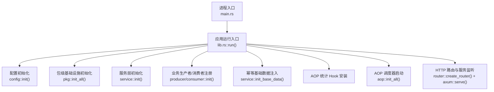
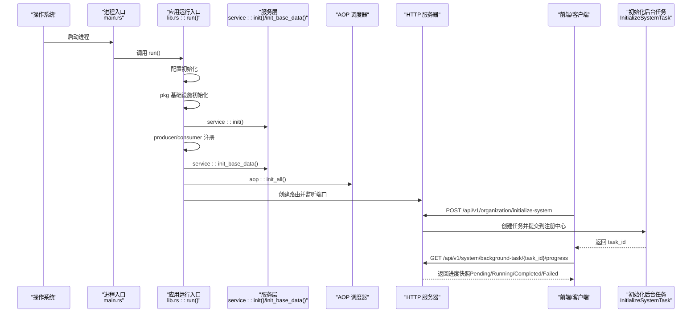
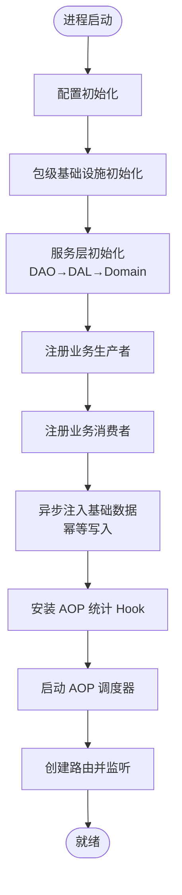
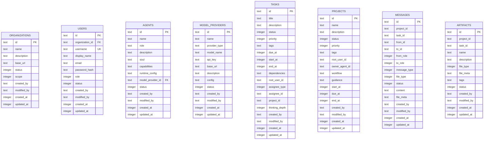
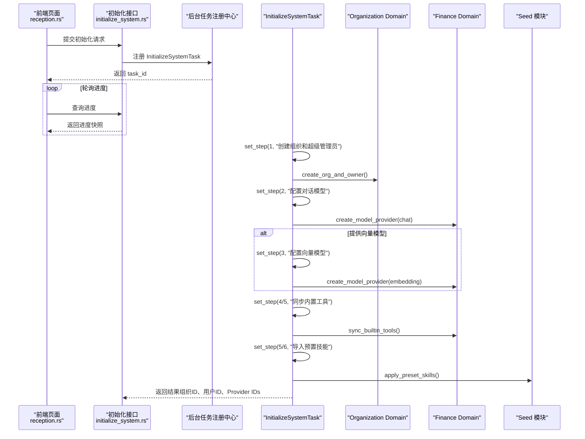

# 系统初始化

<cite>
**本文引用的文件**
- [main.rs](file://src/main.rs)
- [lib.rs](file://src/lib.rs)
- [service/mod.rs](file://src/service/mod.rs)
- [initialize_system.rs](file://src/handlers/organization/initialize_system.rs)
- [health.rs](file://src/handlers/health.rs)
- [health_metrics.rs](file://src/handlers/system/health_metrics.rs)
- [20260420000000_initial.sql](file://migrations/20260420000000_initial.sql)
- [seed_handler_test.rs](file://src/handlers/system/seed/seed_handler_test.rs)
- [system_cron_triggers_test.rs](file://tests/integration/system_cron_triggers_test.rs)
- [reception.rs](file://frontend/src/pages/reception.rs)
</cite>

## 目录
1. [简介](#简介)
2. [项目结构](#项目结构)
3. [核心组件](#核心组件)
4. [架构总览](#架构总览)
5. [详细组件分析](#详细组件分析)
6. [依赖关系分析](#依赖关系分析)
7. [性能考虑](#性能考虑)
8. [故障排查指南](#故障排查指南)
9. [结论](#结论)
10. [附录](#附录)

## 简介
本文件面向“系统首次启动与初始化”的完整生命周期，覆盖以下内容：
- 进程启动、配置加载、服务层注册、AOP 调度器启动等两阶段初始化流程
- 数据库迁移与表结构创建（基于 SQL 迁移）
- 默认数据填充与管理员账户创建（通过后台任务异步执行）
- 初始化过程中的依赖检查、版本兼容性验证、数据迁移执行策略
- 错误处理机制与回滚策略建议
- 初始化配置项与环境变量说明
- 生产环境部署注意事项、数据备份恢复流程、系统健康检查机制

## 项目结构
系统采用四层单向调用：Adapter（HTTP Handler / AOP Producer）→ Domain → DAL → DAO。初始化入口位于应用主函数，随后按序完成配置、包级基础设施、服务层单例注册、业务生产者/消费者注册、幂等基础数据注入、AOP 调度器启动，最后启动 HTTP 服务器。

图表来源
- [lib.rs:114-172](file://src/lib.rs#L114-L172)
- [service/mod.rs:6-23](file://src/service/mod.rs#L6-L23)

章节来源
- [lib.rs:114-172](file://src/lib.rs#L114-L172)
- [service/mod.rs:6-23](file://src/service/mod.rs#L6-L23)

## 核心组件
- 进程与应用启动：主函数仅委托给库入口 run，避免重复编译；run 中完成配置、基础设施、服务层、AOP、HTTP 服务器的顺序初始化。
- 服务层初始化：DAO/DAL/Domain 三层依次初始化，保证依赖顺序正确。
- 幂等基础数据注入：在进程启动后异步执行，失败不阻塞启动，确保系统可降级运行。
- 初始化后台任务：首次初始化组织、超级管理员、对话模型提供商、可选向量模型提供商、内置工具同步、预置技能导入，全部以异步任务形式执行并支持进度查询。
- 健康检查：提供轻量健康接口与指标聚合接口，用于外部探针与前端监控。

章节来源
- [lib.rs:114-172](file://src/lib.rs#L114-L172)
- [service/mod.rs:6-23](file://src/service/mod.rs#L6-L23)
- [initialize_system.rs:24-284](file://src/handlers/organization/initialize_system.rs#L24-L284)
- [health.rs:1-16](file://src/handlers/health.rs#L1-L16)
- [health_metrics.rs:28-62](file://src/handlers/system/health_metrics.rs#L28-L62)

## 架构总览
下图展示从进程启动到首次初始化完成的端到端时序，包括后台任务的提交与进度轮询。

图表来源
- [lib.rs:114-172](file://src/lib.rs#L114-L172)
- [initialize_system.rs:227-284](file://src/handlers/organization/initialize_system.rs#L227-L284)

## 详细组件分析

### 进程启动与两阶段初始化
- 第一阶段（同步）：配置加载、包级基础设施初始化、服务层单例注册、业务生产者/消费者注册。
- 第二阶段（异步）：各 Domain 的幂等基础数据注入（如系统级 Cron Trigger），失败仅记录日志，不阻塞启动。
- 随后安装 AOP 统计 Hook，启动 AOP 调度器，创建 HTTP 路由并监听端口。

图表来源
- [lib.rs:114-172](file://src/lib.rs#L114-L172)
- [service/mod.rs:6-23](file://src/service/mod.rs#L6-L23)

章节来源
- [lib.rs:114-172](file://src/lib.rs#L114-L172)
- [service/mod.rs:6-23](file://src/service/mod.rs#L6-L23)

### 数据库迁移与表结构
- 使用 SQL 迁移脚本管理数据库结构演进，首个迁移文件包含组织、用户、Agent、模型服务商、任务、项目、消息、工件等核心表结构。
- 运行时通过 DAL/DAO 层访问数据库，所有写操作均经过领域层封装，PO 对象仅在 DAO/DAL 内部使用。

图表来源
- [20260420000000_initial.sql:9-200](file://migrations/20260420000000_initial.sql#L9-L200)

章节来源
- [20260420000000_initial.sql:9-200](file://migrations/20260420000000_initial.sql#L9-L200)

### 首次初始化流程（后台任务）
首次初始化由 HTTP 接口触发，创建一个自包含进度的后台任务，分步执行：
- Step 1：创建组织与超级管理员
- Step 2：创建对话模型提供商
- Step 3（可选）：创建向量模型提供商
- Step 4/5：同步内置工具到数据库
- Step 5/6：导入预置技能（来自内嵌模板）

图表来源
- [initialize_system.rs:24-224](file://src/handlers/organization/initialize_system.rs#L24-L224)
- [reception.rs:207-232](file://frontend/src/pages/reception.rs#L207-L232)

章节来源
- [initialize_system.rs:24-224](file://src/handlers/organization/initialize_system.rs#L24-L224)
- [reception.rs:207-232](file://frontend/src/pages/reception.rs#L207-L232)

### 默认数据填充与管理员账户创建
- 管理员账户：在创建组织的同时创建超级管理员用户，角色为 SuperAdmin。
- 默认 Provider：对话模型提供商必选；向量模型提供商可选。
- 内置工具与技能：初始化过程中会同步内置工具并导入预置技能，确保 Agent 具备开箱即用的能力。

章节来源
- [initialize_system.rs:138-224](file://src/handlers/organization/initialize_system.rs#L138-L224)

### 依赖检查、版本兼容性与数据迁移
- 依赖检查：服务层初始化时按 DAO→DAL→Domain 顺序注册，确保依赖可用；AOP 生产者/消费者在基础数据注入前注册，避免事件丢失。
- 版本兼容性：种子快照包含版本号字段，导入/导出时使用版本校验；默认模板通过内嵌 JSON 提供稳定基线。
- 数据迁移：SQL 迁移脚本定义表结构演进；集成测试表明系统级 Cron Trigger 在 init_base_data 之后确保存在，体现幂等性。

章节来源
- [service/mod.rs:6-23](file://src/service/mod.rs#L6-L23)
- [system_cron_triggers_test.rs:1-31](file://tests/integration/system_cron_triggers_test.rs#L1-31)
- [seed_handler_test.rs:46-73](file://src/handlers/system/seed/seed_handler_test.rs#L46-L73)

### 错误处理与回滚策略
- 错误传播：后台任务在每一步更新进度状态，失败时标记 Failed 并记录错误信息；HTTP 层统一返回结构化错误。
- 幂等性：基础数据注入与系统级 Cron Trigger 确保多次执行不会产生重复数据。
- 回滚建议：
  - 对关键步骤（如创建组织/用户/Provider）使用事务包裹，失败时回滚。
  - 对批量导入（如预置技能）采用分批提交与失败重试，必要时保留中间状态以便断点续跑。
  - 对外部依赖（如模型 API）增加超时与熔断，避免长时间阻塞。

章节来源
- [initialize_system.rs:66-131](file://src/handlers/organization/initialize_system.rs#L66-L131)
- [system_cron_triggers_test.rs:1-31](file://tests/integration/system_cron_triggers_test.rs#L1-31)

### 配置选项与环境变量
- 前端静态资源目录：可通过环境变量 FRONTEND_DIST_DIR 覆盖配置中的路径。
- 服务器监听地址：从配置读取，便于在不同环境灵活绑定。
- 其他配置项：数据库连接、存储路径、AOP 队列参数等由配置模块集中管理，具体键值请参考配置模块实现。

章节来源
- [lib.rs:156-172](file://src/lib.rs#L156-L172)

### 生产环境部署注意事项
- 启动顺序：确保数据库迁移已执行，服务层与 AOP 调度器正常启动后再暴露 HTTP 接口。
- 权限与安全：初始化接口应限制为受控入口（如仅允许特定网络或认证），避免未授权初始化。
- 资源与容量：合理设置 AOP 队列大小与 Worker 数量，避免背压导致初始化延迟。
- 可观测性：启用健康检查与指标采集，结合前端监控面板观察初始化进度与系统健康。

[本节为通用指导，不直接分析具体文件]

### 数据备份与恢复流程
- 备份：基于 SQLite 的数据文件进行冷备或热备（需确保一致性），或使用系统提供的备份接口（若存在）。
- 恢复：停止服务后替换数据库文件，重启服务；或通过种子快照导入恢复配置与基础数据。
- 敏感字段：导入快照时敏感字段（密码、API Key）必须单独提供，不会随快照导出。

[本节为通用指导，不直接分析具体文件]

### 系统健康检查机制
- 轻量健康接口：返回服务状态与版本信息，适合 Kubernetes Liveness/Readiness Probe。
- 指标聚合接口：聚合 AOP 队列深度、Agent 数量、运行时长等指标，供前端仪表盘展示。

章节来源
- [health.rs:1-16](file://src/handlers/health.rs#L1-L16)
- [health_metrics.rs:28-62](file://src/handlers/system/health_metrics.rs#L28-L62)

## 依赖关系分析
服务层初始化严格遵循单向依赖：DAO 最先初始化，DAL 依赖 DAO，Domain 依赖 DAL。此顺序确保后续业务逻辑调用时依赖可用。

图表来源
- [service/mod.rs:6-23](file://src/service/mod.rs#L6-L23)

章节来源
- [service/mod.rs:6-23](file://src/service/mod.rs#L6-L23)

## 性能考虑
- 异步初始化：将需要 DB IO 的基础数据注入放在异步阶段，避免阻塞启动。
- 幂等写入：确保多次执行不会产生额外开销或重复数据。
- 队列与并发：合理配置 AOP 队列与消费者数量，避免初始化期间事件积压。
- 外部依赖：对模型 API 调用增加超时与重试策略，防止初始化长时间挂起。

[本节为通用指导，不直接分析具体文件]

## 故障排查指南
- 初始化失败：查看后台任务进度中的 error 字段，定位失败步骤；检查对应 Domain 的日志与数据库状态。
- 健康检查异常：确认服务是否成功监听端口，检查 AOP 调度器与队列状态。
- 数据不一致：使用种子快照进行差异对比（DryRun），再决定是否应用变更。

章节来源
- [initialize_system.rs:227-284](file://src/handlers/organization/initialize_system.rs#L227-L284)
- [health.rs:1-16](file://src/handlers/health.rs#L1-L16)
- [health_metrics.rs:28-62](file://src/handlers/system/health_metrics.rs#L28-L62)

## 结论
系统初始化采用两阶段设计：同步阶段完成基础设施与服务层注册，异步阶段执行幂等基础数据注入。首次初始化通过后台任务异步执行，提供细粒度进度与错误信息，便于前端展示与运维监控。配合 SQL 迁移、种子快照与健康检查，形成完整的初始化与可观测体系。生产环境部署时应关注权限控制、资源容量与可观测性，确保稳定可靠。

[本节为总结，不直接分析具体文件]

## 附录
- 数据库迁移文件：migrations/20260420000000_initial.sql 定义了核心表结构。
- 集成测试：tests/integration/system_cron_triggers_test.rs 验证系统级 Cron Trigger 的幂等性与存在性。
- 前端交互：frontend/src/pages/reception.rs 演示了初始化任务的提交与进度轮询。

章节来源
- [20260420000000_initial.sql:9-200](file://migrations/20260420000000_initial.sql#L9-L200)
- [system_cron_triggers_test.rs:1-31](file://tests/integration/system_cron_triggers_test.rs#L1-31)
- [reception.rs:207-232](file://frontend/src/pages/reception.rs#L207-L232)