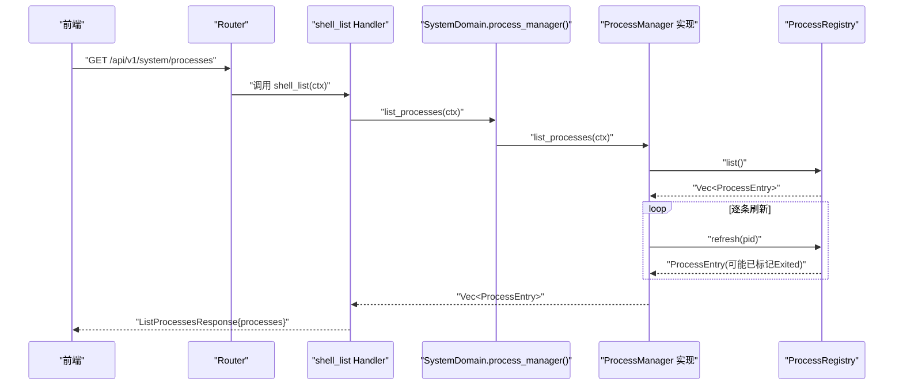
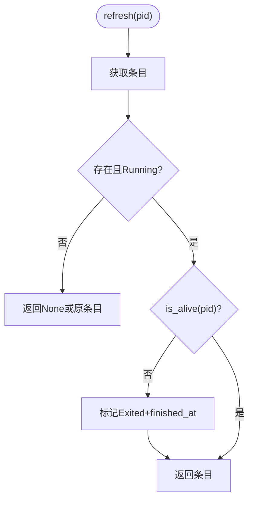
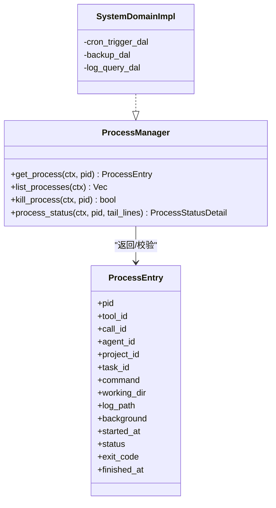
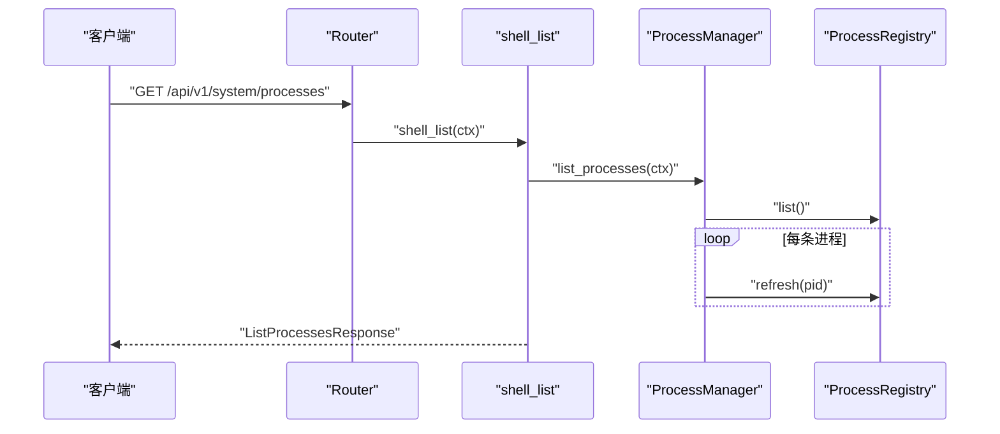
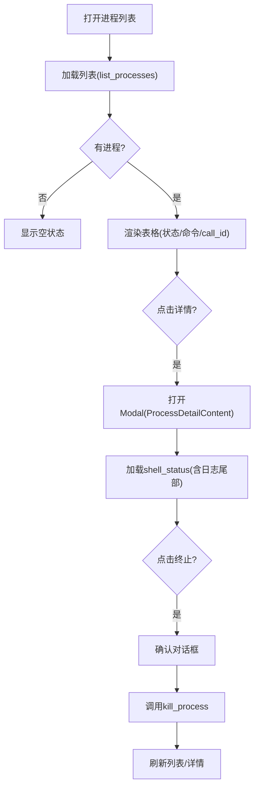
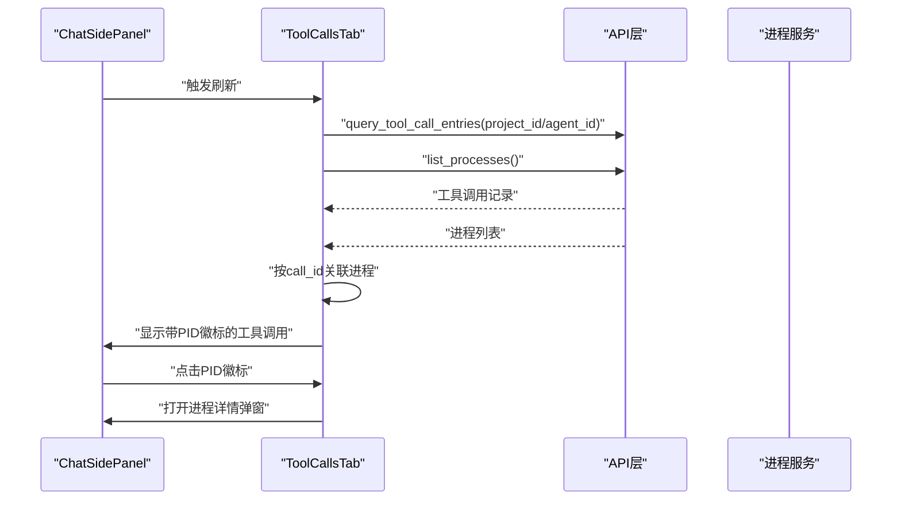
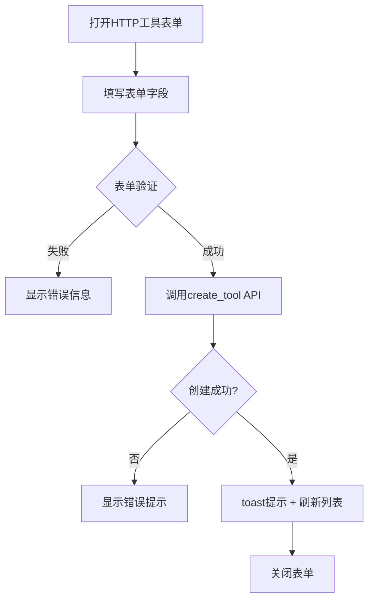
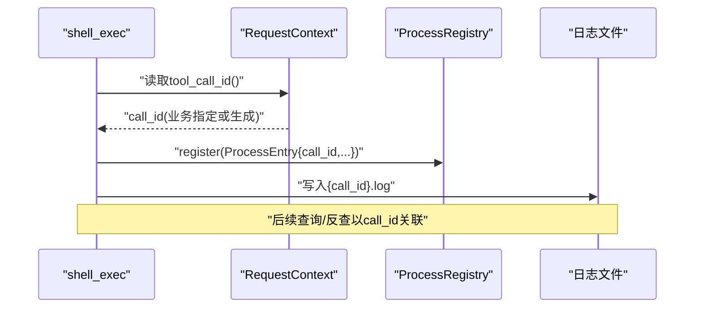
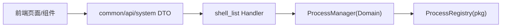

# 后台进程管理系统

<cite>
**本文引用的文件**
- [src/pkg/process/mod.rs](file://src/pkg/process/mod.rs)
- [common/src/api/system.rs](file://common/src/api/system.rs)
- [src/handlers/system/process/shell_list.rs](file://src/handlers/system/process/shell_list.rs)
- [src/service/domain/system/mod.rs](file://src/service/domain/system/mod.rs)
- [src/service/domain/system/process.rs](file://src/service/domain/system/process.rs)
- [frontend/src/pages/system/processes.rs](file://frontend/src/pages/system/processes.rs)
- [frontend/src/components/process_detail.rs](file://frontend/src/components/process_detail.rs)
- [frontend/src/components/chat/tool_calls_tab.rs](file://frontend/src/components/chat/tool_calls_tab.rs)
- [frontend/src/components/create_http_tool.rs](file://frontend/src/components/create_http_tool.rs)
- [src/router.rs](file://src/router.rs)
- [src/pkg/request_context.rs](file://src/pkg/request_context.rs)
- [src/pkg/tool_registry/shell_exec.rs](file://src/pkg/tool_registry/shell_exec.rs)
- [frontend/src/api/system.rs](file://frontend/src/api/system.rs)
</cite>

## 更新摘要
**变更内容**
- shell_list 处理器新增双暴露（HTTP + LLM 工具）
- 进程管理页面增强：列表视图、模态详情、自动/手动刷新功能
- ChatSidePanel 工具调用 Tab 集成：实时进程监控与 call_id 关联
- HTTP 工具创建表单：前端新增 HTTP 工具创建功能
- 前端组件复用：进程详情组件在多个场景共享使用

## 目录
1. [简介](#简介)
2. [项目结构](#项目结构)
3. [核心组件](#核心组件)
4. [架构总览](#架构总览)
5. [详细组件分析](#详细组件分析)
6. [依赖关系分析](#依赖关系分析)
7. [性能与资源管理](#性能与资源管理)
8. [故障排除指南](#故障排除指南)
9. [结论](#结论)
10. [附录：API 与数据模型](#附录api-与数据模型)

## 简介
本系统为多 Agent 协作框架中的"统一后台进程管理"能力，围绕 shell_exec 工具启动的后台子进程提供注册、探活、终止、日志尾部读取与可视化管理能力。其设计遵循四层单向调用（Adapter → Domain → DAL → DAO），进程注册中心位于 pkg 层（无业务感知），权限边界在 SystemDomain 的 ProcessManager 实现中完成（Agent scope 校验）。

**最新更新**：系统现已支持 shell_list 双暴露（HTTP + LLM 工具）、完整的进程管理页面（列表 + 弹窗详情）、自动/手动刷新机制，以及与 ChatSidePanel 工具调用 Tab 的深度集成，形成从创建到观测再到干预的完整闭环体验。

## 项目结构
- 后端
  - pkg/process：内存版进程注册中心，提供进程条目、状态、探活/终止原语与日志尾部读取。
  - service/domain/system：SystemDomain 暴露 process_manager()，ProcessManager trait 定义 get/list/kill/status 等能力，并在 SystemDomainImpl 中实现 Agent scope 校验。
  - handlers/system/process：shell_list handler，双露为 HTTP 与 LLM 工具，调用 domain().process_manager().list_processes(ctx) 并逐条 refresh 后返回。
  - router：system nest 下新增 /processes 路由，排在 /processes/{pid} 前避免遮蔽。
  - common/api/system：进程管理相关 DTO（ListProcessesRequest/Response、ProcessInfo、ShellStatusRequest/Response、ShellKillRequest/Response）。
  - pkg/request_context：新增 tool_call_id 字段，作为 call_id 单一事实源注入链路。
- 前端
  - pages/system/processes：后台进程管理列表页，支持自动刷新、手动刷新、终止操作与详情弹窗。
  - components/process_detail：共享进程详情组件，数据来源 shell_status，支持刷新与终止。
  - components/chat/tool_calls_tab：工具调用记录展示，与后台进程按 call_id 关联，支持实时进程监控。
  - components/create_http_tool：HTTP 工具创建表单，对齐后端 CreateToolRequest + HttpToolConfig。
  - chat 侧栏工具调用 Tab：复用进程详情弹窗，按 call_id 关联进行中的进程。

```mermaid
graph TB
subgraph "前端"
FE_LIST["系统管理-进程列表"]
FE_DETAIL["进程详情弹窗"]
FE_CHAT_TAB["聊天侧栏-工具调用Tab"]
FE_HTTP_FORM["HTTP工具创建表单"]
end
subgraph "后端 Adapter"
H_LIST["shell_list handler"]
ROUTER["router system nest"]
end
subgraph "后端 Domain"
DM_SYS["SystemDomain.process_manager()"]
PM_IMPL["ProcessManager 实现"]
end
subgraph "后端 pkg"
REG["ProcessRegistry(内存)"]
CTX["RequestContext(tool_call_id)"]
end
FE_LIST --> |GET /api/v1/system/processes| ROUTER
FE_CHAT_TAB --> |GET /api/v1/system/processes/{pid}| ROUTER
FE_HTTP_FORM --> |POST /api/v1/finance/tools| ROUTER
ROUTER --> H_LIST
H_LIST --> DM_SYS
DM_SYS --> PM_IMPL
PM_IMPL --> REG
H_LIST -.-> CTX
```

**图表来源**
- [src/router.rs:809-824](file://src/router.rs#L809-L824)
- [src/handlers/system/process/shell_list.rs:10-49](file://src/handlers/system/process/shell_list.rs#L10-L49)
- [src/service/domain/system/mod.rs:114-125](file://src/service/domain/system/mod.rs#L114-L125)
- [src/service/domain/system/process.rs:37-89](file://src/service/domain/system/process.rs#L37-L89)
- [src/pkg/process/mod.rs:57-124](file://src/pkg/process/mod.rs#L57-L124)
- [src/pkg/request_context.rs:22-65](file://src/pkg/request_context.rs#L22-L65)

**章节来源**
- [src/router.rs:809-824](file://src/router.rs#L809-L824)
- [src/handlers/system/process/shell_list.rs:10-49](file://src/handlers/system/process/shell_list.rs#L10-L49)
- [src/service/domain/system/mod.rs:114-125](file://src/service/domain/system/mod.rs#L114-L125)
- [src/service/domain/system/process.rs:37-89](file://src/service/domain/system/process.rs#L37-L89)
- [src/pkg/process/mod.rs:57-124](file://src/pkg/process/mod.rs#L57-L124)
- [src/pkg/request_context.rs:22-65](file://src/pkg/request_context.rs#L22-L65)

## 核心组件
- 进程注册中心（pkg/process）
  - 进程条目 ProcessEntry：包含 pid、tool_id、call_id、agent_id、project_id、task_id、command、working_dir、log_path、background、started_at、status、exit_code、finished_at。
  - 进程状态 ProcessStatus：Running / Exited。
  - 注册中心 ProcessRegistry：register/get/list/mark_exited/refresh/remove；is_alive/terminate 平台适配；tail_log 读取日志尾部。
- 进程管理 Domain（service/domain/system/process）
  - ProcessManager trait：get_process/list_processes/kill_process/process_status。
  - Scope 校验：Agent 仅可见/可操作自己启动的进程；人类用户/管理面放行。
- Handler（handlers/system/process/shell_list）
  - 双露：HTTP GET /api/v1/system/processes 与 LLM 工具 shell_list。
  - 行为：调用 domain().process_manager().list_processes(ctx)，逐条 refresh 后转 ProcessInfo。
- API DTO（common/api/system）
  - ListProcessesRequest/Response、ProcessInfo、ShellStatusRequest/Response、ShellKillRequest/Response。
- 前端页面与组件
  - 列表页：自动/手动刷新、终止、详情弹窗。
  - 详情组件：调用 shell_status，展示状态、命令、call_id、日志尾部，支持刷新与终止。
  - 工具调用 Tab：并行查询工具调用记录与进程列表，按 call_id 关联显示运行中进程。
  - HTTP 工具表单：完整的 HTTP 工具创建界面，支持 JSON 配置验证。

**章节来源**
- [src/pkg/process/mod.rs:15-124](file://src/pkg/process/mod.rs#L15-L124)
- [src/service/domain/system/process.rs:13-89](file://src/service/domain/system/process.rs#L13-L89)
- [src/handlers/system/process/shell_list.rs:10-49](file://src/handlers/system/process/shell_list.rs#L10-L49)
- [common/src/api/system.rs:240-328](file://common/src/api/system.rs#L240-L328)
- [frontend/src/pages/system/processes.rs:33-203](file://frontend/src/pages/system/processes.rs#L33-L203)
- [frontend/src/components/process_detail.rs:28-156](file://frontend/src/components/process_detail.rs#L28-L156)
- [frontend/src/components/chat/tool_calls_tab.rs:78-293](file://frontend/src/components/chat/tool_calls_tab.rs#L78-L293)
- [frontend/src/components/create_http_tool.rs:144-200](file://frontend/src/components/create_http_tool.rs#L144-L200)

## 架构总览
系统采用分层架构与职责分离：
- Adapter 层（Handler）负责 HTTP 路由与参数解析，委托 Domain。
- Domain 层（SystemDomain.ProcessManager）封装业务规则（如 Agent scope 校验）、协调 pkg 基础设施。
- pkg 层（ProcessRegistry）提供无业务感知的进程注册与生命周期原语。
- 前端通过 RESTful 接口与共享组件实现一致的用户体验。

**最新更新**：shell_list 处理器现支持双暴露模式，既可作为 HTTP 接口被前端调用，也可作为 LLM 工具被 Agent 直接调用，增强了系统的灵活性和可扩展性。



**图表来源**
- [src/router.rs:809-824](file://src/router.rs#L809-L824)
- [src/handlers/system/process/shell_list.rs:19-49](file://src/handlers/system/process/shell_list.rs#L19-L49)
- [src/service/domain/system/mod.rs:114-125](file://src/service/domain/system/mod.rs#L114-L125)
- [src/service/domain/system/process.rs:46-56](file://src/service/domain/system/process.rs#L46-L56)
- [src/pkg/process/mod.rs:86-118](file://src/pkg/process/mod.rs#L86-L118)

## 详细组件分析

### 进程注册中心（pkg/process）
- 数据结构
  - ProcessEntry：承载进程全量元信息，包括 call_id（来自 ctx.tool_call_id，缺失回退 log_id）、agent_id（用于 scope 校验）、project_id/task_id（上下文关联）。
  - ProcessStatus：Running/Exited。
- 核心方法
  - register/get/list：增删查，list 按 started_at/pid 排序。
  - mark_exited：设置状态为 Exited，记录 exit_code 与 finished_at。
  - refresh：探活 Running→Exited 转换，更新 finished_at。
  - is_alive/terminate：Unix 使用 kill(pid,0)/SIGKILL，非 Unix 返回不支持。
  - tail_log：读取日志尾部 n 行，不存在或失败返回空串。
- 复杂度与性能
  - list 时间复杂度 O(n log n)（排序），n 为当前进程数；通常较小。
  - refresh 每次调用会尝试探测进程存活，适合列表与详情场景按需调用。



**图表来源**
- [src/pkg/process/mod.rs:103-118](file://src/pkg/process/mod.rs#L103-L118)
- [src/pkg/process/mod.rs:138-174](file://src/pkg/process/mod.rs#L138-L174)

**章节来源**
- [src/pkg/process/mod.rs:15-174](file://src/pkg/process/mod.rs#L15-L174)

### 进程管理 Domain（service/domain/system/process）
- Scope 校验
  - Agent 调用方必须与 entry.agent_id 匹配，否则拒绝访问。
  - 人类用户/管理面无 agent_id，放行。
- 方法语义
  - get_process：先 refresh，再 scope 校验。
  - list_processes：过滤 Agent 可见范围。
  - kill_process：若已退出返回 false；否则发送 SIGKILL 并标记 Exited。
  - process_status：refresh + 读取日志尾部（默认 20，上限 500）。
- 错误处理
  - not_found：未找到进程。
  - forbidden：Agent 越权。



**图表来源**
- [src/service/domain/system/mod.rs:224-249](file://src/service/domain/system/mod.rs#L224-L249)
- [src/service/domain/system/process.rs:20-89](file://src/service/domain/system/process.rs#L20-L89)
- [src/pkg/process/mod.rs:24-55](file://src/pkg/process/mod.rs#L24-L55)

**章节来源**
- [src/service/domain/system/process.rs:20-89](file://src/service/domain/system/process.rs#L20-L89)
- [src/service/domain/system/mod.rs:224-249](file://src/service/domain/system/mod.rs#L224-L249)

### Handler 与路由（handlers/system/process/shell_list 与 router）
- shell_list handler
  - 双露：HTTP 与 LLM 工具（tags=shell）。
  - 流程：domain().process_manager().list_processes(ctx) → 逐条 refresh → 转为 ProcessInfo。
- 路由
  - system nest 下 GET /processes 指向 shell_list_handler，排在 /processes/{pid} 前避免遮蔽。



**图表来源**
- [src/handlers/system/process/shell_list.rs:10-49](file://src/handlers/system/process/shell_list.rs#L10-L49)
- [src/router.rs:809-824](file://src/router.rs#L809-L824)

**章节来源**
- [src/handlers/system/process/shell_list.rs:10-49](file://src/handlers/system/process/shell_list.rs#L10-L49)
- [src/router.rs:809-824](file://src/router.rs#L809-L824)

### 前端页面与组件（pages/system/processes 与 components/process_detail）
- 列表页
  - 自动刷新（5s 轮询）、手动刷新、终止按钮、详情弹窗。
  - 显示运行中计数、命令截断、call_id 截断、状态徽标。
- 详情组件
  - 懒加载 shell_status（含日志尾部），支持刷新与终止确认。
  - 复用 Modal，列表页与聊天侧栏弹窗共用。



**图表来源**
- [frontend/src/pages/system/processes.rs:33-203](file://frontend/src/pages/system/processes.rs#L33-L203)
- [frontend/src/components/process_detail.rs:28-156](file://frontend/src/components/process_detail.rs#L28-L156)

**章节来源**
- [frontend/src/pages/system/processes.rs:33-203](file://frontend/src/pages/system/processes.rs#L33-L203)
- [frontend/src/components/process_detail.rs:28-156](file://frontend/src/components/process_detail.rs#L28-L156)

### ChatSidePanel 工具调用 Tab 集成
**新增功能**：ChatSidePanel 工具调用 Tab 现已支持与后台进程的深度集成，实现实时进程监控。

- 数据关联：并行查询工具调用记录与进程列表，按 `entry.call_id == process.call_id` 关联出进行中的进程。
- 实时显示：仅显示 alive=true 的进程，点击 PID 徽标弹出进程详情弹窗。
- 防抖刷新：集成现有 refresh_tick 防抖刷新链路与手动刷新功能。
- 两种对话模式：项目对话按 project_id 查，默认对话按前台 agent_id 查。



**图表来源**
- [frontend/src/components/chat/tool_calls_tab.rs:101-139](file://frontend/src/components/chat/tool_calls_tab.rs#L101-L139)
- [frontend/src/components/chat/tool_calls_tab.rs:200-275](file://frontend/src/components/chat/tool_calls_tab.rs#L200-L275)

**章节来源**
- [frontend/src/components/chat/tool_calls_tab.rs:78-293](file://frontend/src/components/chat/tool_calls_tab.rs#L78-L293)

### HTTP 工具创建表单
**新增功能**：前端新增完整的 HTTP 工具创建表单，补齐前端体验闭环。

- 表单字段：对齐 CreateToolRequest + HttpToolConfig，包含基础信息、HTTP 配置、安全设置等。
- 输入验证：JSON 文本域提交前解析校验，必填字段验证，方法白名单限制（仅 GET/POST）。
- 用户体验：成功后 toast 提示 + 刷新列表，校验失败行内提示。
- 纯函数测试：validate 函数拆分为可测的独立单元。



**图表来源**
- [frontend/src/components/create_http_tool.rs:85-142](file://frontend/src/components/create_http_tool.rs#L85-L142)
- [frontend/src/components/create_http_tool.rs:164-188](file://frontend/src/components/create_http_tool.rs#L164-L188)

**章节来源**
- [frontend/src/components/create_http_tool.rs:1-200](file://frontend/src/components/create_http_tool.rs#L1-200)

### shell_exec 工具与 call_id 单一事实源
- shell_exec
  - 支持同步等待与后台运行；输出超过阈值时截断并落盘日志；环境变量白名单过滤；工作目录沙箱。
  - 后台模式立即返回 pid 与 log_path，不阻塞。
- call_id 单一事实源
  - RequestContext 新增 tool_call_id，ToolCallDao::execute 单点生成/复用；shell_exec 使用 ctx.tool_call_id() 命名日志文件并写入 ProcessEntry.call_id；返回 JSON 携带 call_id，满足执行日志带 PID 的反查需求。



**图表来源**
- [src/pkg/tool_registry/shell_exec.rs:1-34](file://src/pkg/tool_registry/shell_exec.rs#L1-L34)
- [src/pkg/request_context.rs:22-65](file://src/pkg/request_context.rs#L22-L65)
- [src/pkg/process/mod.rs:24-55](file://src/pkg/process/mod.rs#L24-L55)

**章节来源**
- [src/pkg/tool_registry/shell_exec.rs:1-34](file://src/pkg/tool_registry/shell_exec.rs#L1-L34)
- [src/pkg/request_context.rs:22-65](file://src/pkg/request_context.rs#L22-L65)
- [src/pkg/process/mod.rs:24-55](file://src/pkg/process/mod.rs#L24-L55)

## 依赖关系分析
- 模块耦合
  - Handler 依赖 Domain（单向），Domain 依赖 pkg（无业务感知），符合分层约束。
  - 前端通过 API DTO 与后端解耦，组件复用降低重复开发。
- 外部依赖
  - Unix 平台使用 libc 进行进程探测与终止；非 Unix 平台返回不支持。
  - 日志文件 IO 用于 tail_log 与 shell_exec 输出落盘。
- 潜在循环依赖
  - 未发现循环依赖；pkg 层无业务感知，Domain 层仅依赖 pkg 提供的原语。



**图表来源**
- [src/handlers/system/process/shell_list.rs:10-49](file://src/handlers/system/process/shell_list.rs#L10-L49)
- [src/service/domain/system/process.rs:37-89](file://src/service/domain/system/process.rs#L37-L89)
- [src/pkg/process/mod.rs:57-124](file://src/pkg/process/mod.rs#L57-L124)
- [common/src/api/system.rs:240-328](file://common/src/api/system.rs#L240-L328)

**章节来源**
- [src/handlers/system/process/shell_list.rs:10-49](file://src/handlers/system/process/shell_list.rs#L10-L49)
- [src/service/domain/system/process.rs:37-89](file://src/service/domain/system/process.rs#L37-L89)
- [src/pkg/process/mod.rs:57-124](file://src/pkg/process/mod.rs#L57-L124)
- [common/src/api/system.rs:240-328](file://common/src/api/system.rs#L240-L328)

## 性能与资源管理
- 列表刷新策略
  - 前端自动刷新间隔 5s，避免频繁请求；手动刷新用于即时反馈。
  - 后端逐条 refresh 仅在列表返回前执行一次，减少额外开销。
- 日志读取
  - tail_log 仅读取尾部 n 行，限制内存占用；shell_status 默认 20 行，上限 500。
- 进程生命周期
  - 内存注册中心在服务重启后条目丢失，审计线索保留在 ToolCallEntry JSONL metadata。
  - 非 Unix 平台 terminate 不支持，需考虑跨平台兼容。
- 安全与隔离
  - Agent scope 校验防止越权；shell_exec 工作目录沙箱与环境变量白名单保障执行安全。
- **新增优化**：ChatSidePanel 工具调用 Tab 采用防抖刷新机制（2s），避免频繁请求；进程详情组件懒加载，减少初始渲染开销。

## 故障排除指南
- 进程不可见
  - Agent 调用方仅可见自己启动的进程；检查 ctx.agent_id 与 entry.agent_id 是否匹配。
- 终止失败
  - 非 Unix 平台 terminate 不支持；进程已退出时 kill 返回 false。
- 日志为空
  - 日志文件不存在或读取失败返回空串；检查 shell_exec 输出重定向路径。
- 路由遮蔽
  - 确保 GET /processes 排在 /processes/{pid} 前，避免被路径参数捕获。
- **新增问题**：
  - 工具调用 Tab 无数据：检查 project_id 或 agent_id 是否正确传递；确认 refresh_tick 是否正常触发。
  - HTTP 工具创建失败：检查 URL 模板格式、JSON 配置合法性、方法是否在白名单内。

**章节来源**
- [src/service/domain/system/process.rs:20-31](file://src/service/domain/system/process.rs#L20-L31)
- [src/pkg/process/mod.rs:156-174](file://src/pkg/process/mod.rs#L156-L174)
- [src/pkg/process/mod.rs:126-134](file://src/pkg/process/mod.rs#L126-L134)
- [src/router.rs:809-824](file://src/router.rs#L809-L824)

## 结论
统一后台进程管理系统通过 pkg/process 注册中心与 SystemDomain.ProcessManager 实现了进程生命周期的集中管理与权限控制，结合 shell_exec 的双模式执行与日志落盘，提供了完整的可观测性与干预能力。

**最新更新**：系统现已具备完整的前端体验闭环，包括 HTTP 工具创建表单、进程管理页面（列表 + 弹窗详情）、ChatSidePanel 工具调用 Tab 集成，以及 shell_list 双暴露机制。这些增强功能形成了从工具创建、进程监控到干预管理的完整工作流，大幅提升了用户体验和系统可用性。

call_id 单一事实源贯穿执行链路，便于审计与反查。整体设计遵循分层架构与无业务感知的 pkg 层原则，具备良好的扩展性与可维护性。

## 附录：API 与数据模型
- 列出后台进程
  - 方法：GET /api/v1/system/processes
  - 请求：ListProcessesRequest（无参，scope 由 ctx 决定）
  - 响应：ListProcessesResponse{processes: Vec<ProcessInfo>}
- 查询进程状态
  - 方法：GET /api/v1/system/processes/{pid}
  - 请求：ShellStatusRequest{pid, tail_lines?}
  - 响应：ShellStatusResponse{pid, alive, exit_code, started_at, command, log_path, call_id, log_tail}
- 终止进程
  - 方法：DELETE /api/v1/system/processes/{pid}
  - 请求：ShellKillRequest{pid}
  - 响应：ShellKillResponse{pid, killed}

**章节来源**
- [common/src/api/system.rs:240-328](file://common/src/api/system.rs#L240-L328)