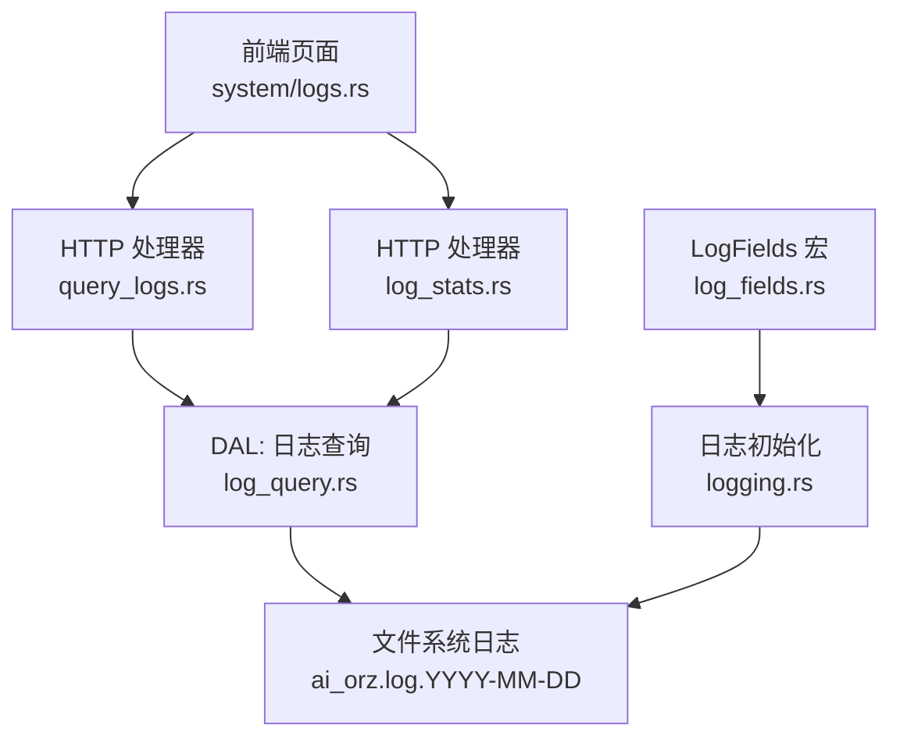
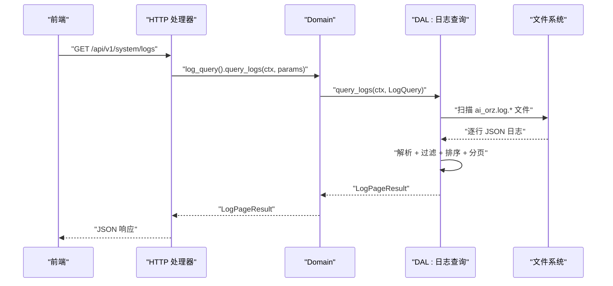
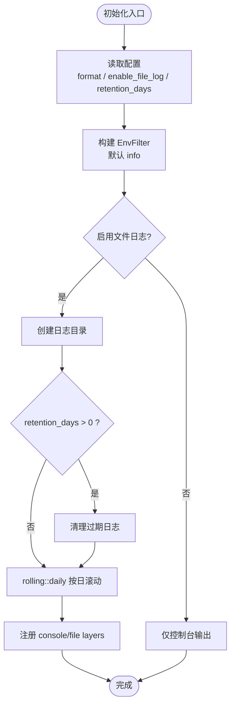
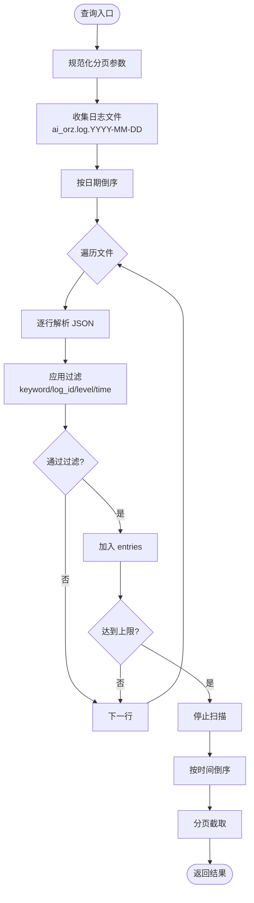
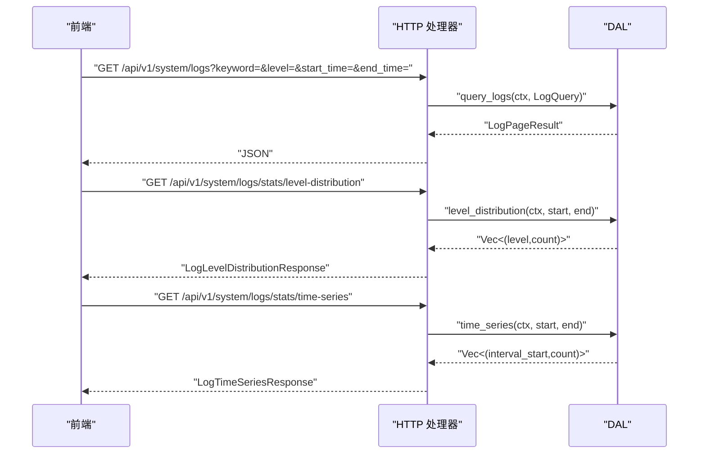
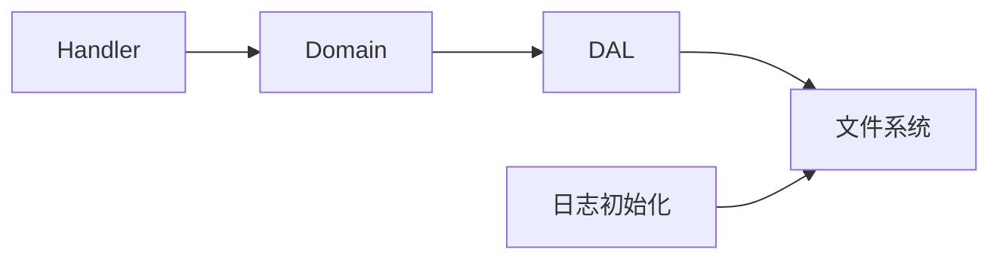

# 日志管理系统

<cite>
**本文引用的文件**
- [logging_design.md](file://docs/design/logging_design.md)
- [logging.rs](file://src/pkg/logging.rs)
- [log_fields.rs](file://ai-orz-macros/src/log_fields.rs)
- [query_logs.rs](file://src/handlers/system/logs/query_logs.rs)
- [log_stats.rs](file://src/handlers/system/logs/log_stats.rs)
- [log_query.rs](file://src/service/dal/log_query.rs)
- [log_stats.rs(common api)](file://common/src/api/log_stats.rs)
- [logs.rs(frontend)](file://frontend/src/pages/system/logs.rs)
</cite>

## 更新摘要
**所做更改**
- 更新了日志查询处理器的代码格式和一致性改进
- 改进了DAL层的代码结构和错误处理
- 优化了HTTP接口参数处理和响应序列化
- 增强了前端日志展示和交互体验
- 保持了所有现有功能的完整性

## 目录
1. [简介](#简介)
2. [项目结构](#项目结构)
3. [核心组件](#核心组件)
4. [架构总览](#架构总览)
5. [详细组件分析](#详细组件分析)
6. [依赖关系分析](#依赖关系分析)
7. [性能考量](#性能考量)
8. [故障排查指南](#故障排查指南)
9. [结论](#结论)
10. [附录](#附录)

## 简介
本系统提供基于 tracing 的结构化日志采集、按日滚动存储、在线查询与统计分析能力。支持：
- 结构化日志收集：统一宏封装，自动注入请求上下文字段（如 log_id、user_id、operation 等），输出 JSON 或文本格式。
- 日志存储与轮转：按天生成日志文件，支持保留天数清理；默认仅本地文件落盘，便于后续离线分析。
- 日志查询与分析：提供 HTTP 接口，支持关键词、log_id、级别、时间范围过滤与分页；提供级别分布与时序统计。
- 安全与权限：日志查询与统计接口受管理员角色保护；敏感信息通过上下文字段脱敏策略控制（由业务层在 RequestContext 中管理）。
- 监控告警与趋势：当前实现为"最近 24 小时"的级别分布与时序聚合，可作为基础告警输入；AOP 实时统计模块另见 AOP 文档。

## 项目结构
日志相关代码分布在以下层次：
- Adapter（HTTP Handler）：暴露日志查询与统计接口，负责参数校验与返回结果序列化。
- Domain/DAL：读取本地 JSONL 日志文件，执行过滤、排序与分页。
- pkg（基础设施）：日志初始化、按日滚动、JSON/文本输出、旧日志清理。
- macros：过程宏自动生成 LogFields trait 实现，将 RequestContext 标注字段注入 tracing span。
- frontend：Dioxus 页面调用后端接口，展示日志列表、级别分布与时序图表。

**图示来源**
- [logging.rs:29-124](file://src/pkg/logging.rs#L29-L124)
- [log_query.rs:120-210](file://src/service/dal/log_query.rs#L120-L210)
- [query_logs.rs:13-28](file://src/handlers/system/logs/query_logs.rs#L13-L28)
- [log_stats.rs:25-76](file://src/handlers/system/logs/log_stats.rs#L25-L76)
- [log_fields.rs:50-125](file://ai-orz-macros/src/log_fields.rs#L50-L125)

**章节来源**
- [logging.rs:29-124](file://src/pkg/logging.rs#L29-L124)
- [log_query.rs:120-210](file://src/service/dal/log_query.rs#L120-L210)
- [query_logs.rs:13-28](file://src/handlers/system/logs/query_logs.rs#L13-L28)
- [log_stats.rs:25-76](file://src/handlers/system/logs/log_stats.rs#L25-L76)
- [log_fields.rs:50-125](file://ai-orz-macros/src/log_fields.rs#L50-L125)

## 核心组件
- 日志初始化与输出层（pkg/logging.rs）
  - 支持控制台与文件双输出，文件按日滚动，支持 JSON/文本格式。
  - 支持环境变量过滤日志级别，默认 info。
  - 启动时根据配置清理超过保留期的旧日志。
- 日志查询 DAL（service/dal/log_query.rs）
  - 扫描 logs 目录下 ai_orz.log.YYYY-MM-DD 文件，解析 JSON 行。
  - 支持 keyword（不区分大小写）、log_id（精确匹配）、level（大小写不敏感）、start_time/end_time（毫秒时间戳）过滤。
  - 限制单次扫描条目数与扫描天数，防止内存与 IO 压力过大。
  - 返回分页结果，按时间倒序。
- HTTP 处理器（handlers/system/logs）
  - query_logs：查询应用日志，返回分页结果。
  - log_stats：返回级别分布与时序数据，默认最近 24 小时。
- 宏与上下文注入（ai-orz-macros/log_fields.rs）
  - 通过 #[derive(LogFields)] 自动生成 create_log_span，将 RequestContext 中标注字段注入 span。
  - 支持 String、Option<String>、Option<T> 等类型格式化。
- 前端页面（frontend/pages/system/logs.rs）
  - 调用后端接口，展示日志列表、级别徽章、时间戳、log_id 可点击跳转筛选。
  - 展示级别分布饼图与时序折线图。

**章节来源**
- [logging.rs:29-124](file://src/pkg/logging.rs#L29-L124)
- [log_query.rs:34-82](file://src/service/dal/log_query.rs#L34-L82)
- [log_query.rs:120-210](file://src/service/dal/log_query.rs#L120-L210)
- [log_query.rs:263-361](file://src/service/dal/log_query.rs#L263-L361)
- [query_logs.rs:13-28](file://src/handlers/system/logs/query_logs.rs#L13-L28)
- [log_stats.rs:25-76](file://src/handlers/system/logs/log_stats.rs#L25-L76)
- [log_fields.rs:50-125](file://ai-orz-macros/src/log_fields.rs#L50-L125)
- [logs.rs(frontend):1-33](file://frontend/src/pages/system/logs.rs#L1-L33)

## 架构总览
日志系统遵循四层单向调用：Adapter → Domain → DAL → DAO（此处无外部数据库，DAL 直接操作文件系统）。日志写入由 tracing-subscriber 完成，DAL 读取 JSONL 文件进行查询与统计。

**图示来源**
- [query_logs.rs:13-28](file://src/handlers/system/logs/query_logs.rs#L13-L28)
- [log_query.rs:120-210](file://src/service/dal/log_query.rs#L120-L210)

**章节来源**
- [query_logs.rs:13-28](file://src/handlers/system/logs/query_logs.rs#L13-L28)
- [log_query.rs:120-210](file://src/service/dal/log_query.rs#L120-L210)

## 详细组件分析

### 日志采集与输出（pkg/logging.rs）
- 初始化流程
  - 从配置读取日志格式（json/text）、是否启用文件日志、保留天数。
  - 构建 EnvFilter 过滤层，默认 info。
  - 若启用文件日志：创建日志目录，按日滚动 rolling::daily，非阻塞 Writer，注册 console/file layer。
  - 若未启用文件日志：仅控制台输出。
  - 启动时清理超过 retention_days 的旧日志文件。
- 关键特性
  - 支持 JSON 格式输出，包含 target、filename、line_number。
  - 全局持有 WorkerGuard，确保进程退出前 flush 所有日志。
  - 日志路径来自配置，支持自定义数据目录。

**图示来源**
- [logging.rs:29-124](file://src/pkg/logging.rs#L29-L124)
- [logging.rs:126-158](file://src/pkg/logging.rs#L126-L158)

**章节来源**
- [logging.rs:29-124](file://src/pkg/logging.rs#L29-L124)
- [logging.rs:126-158](file://src/pkg/logging.rs#L126-L158)

### 日志查询与过滤（service/dal/log_query.rs）
- 数据结构
  - LogEntry：timestamp、level、message、log_id、user_id、operation、raw。
  - LogQuery：keyword、log_id、level、start_time、end_time、page、page_size。
  - LogPageResult：total、entries、page、page_size。
- 查询流程
  - 规范化分页参数（page/page_size 默认值）。
  - 收集日志文件并倒序排列（最新优先）。
  - 预处理过滤条件（keyword 小写、level 大写）。
  - 逐行解析 JSON，应用过滤（keyword、log_id、level、时间范围）。
  - 排序后分页返回。
- 约束与保护
  - MAX_SCAN_ENTRIES=10000，防止内存溢出。
  - MAX_SCAN_DAYS=30，仅扫描最近 30 天文件。
  - 非法 timestamp 在启用时间过滤时被丢弃。

**图示来源**
- [log_query.rs:120-210](file://src/service/dal/log_query.rs#L120-L210)
- [log_query.rs:263-361](file://src/service/dal/log_query.rs#L263-L361)

**章节来源**
- [log_query.rs:120-210](file://src/service/dal/log_query.rs#L120-L210)
- [log_query.rs:263-361](file://src/service/dal/log_query.rs#L263-L361)

### HTTP 接口与前端展示
- 查询接口
  - GET /api/v1/system/logs：支持 keyword、log_id、level、start_time、end_time、page、page_size。
  - 返回 LogPageResult。
- 统计接口
  - GET /api/v1/system/logs/stats/level-distribution：返回级别分布（默认最近 24 小时）。
  - GET /api/v1/system/logs/stats/time-series：返回时序点（默认最近 24 小时）。
- 前端
  - 展示日志列表、级别徽章、时间戳。
  - 支持点击 log_id 快速筛选。
  - 展示级别分布与时序图表。

**图示来源**
- [query_logs.rs:13-28](file://src/handlers/system/logs/query_logs.rs#L13-L28)
- [log_stats.rs:25-76](file://src/handlers/system/logs/log_stats.rs#L25-L76)
- [log_query.rs:120-210](file://src/service/dal/log_query.rs#L120-L210)

**章节来源**
- [query_logs.rs:13-28](file://src/handlers/system/logs/query_logs.rs#L13-L28)
- [log_stats.rs:25-76](file://src/handlers/system/logs/log_stats.rs#L25-L76)
- [log_stats.rs(common api):7-77](file://common/src/api/log_stats.rs#L7-L77)
- [logs.rs(frontend):1-33](file://frontend/src/pages/system/logs.rs#L1-L33)

### 日志级别配置与轮转策略
- 级别配置
  - 通过环境变量设置过滤级别，默认 info。
  - 支持 INFO/WARN/ERROR/DEBUG/TRACE。
- 轮转策略
  - 按日滚动：每天新建一个日志文件，文件名 ai_orz.log.YYYY-MM-DD。
  - 非阻塞写入：使用 tracing_appender non_blocking writer。
- 保留策略
  - 启动时清理超过 retention_days 的旧日志文件。
  - 查询时仅扫描最近 MAX_SCAN_DAYS=30 天的文件。

**章节来源**
- [logging.rs:29-124](file://src/pkg/logging.rs#L29-L124)
- [logging.rs:126-158](file://src/pkg/logging.rs#L126-L158)
- [log_query.rs:112-118](file://src/service/dal/log_query.rs#L112-L118)

### 日志导出、归档与压缩
- 导出
  - 通过 HTTP 接口获取分页结果，前端可下载 JSON。
- 归档与压缩
  - 当前未实现自动归档与压缩；建议结合操作系统 cron 或外部工具对 ai_orz.log.* 进行归档与压缩。
  - 可通过保留策略控制磁盘占用。

[本节为通用建议，不直接分析具体文件]

### 日志监控告警、异常检测与趋势分析
- 监控
  - 级别分布与时序接口可用于基础监控看板。
- 告警
  - 可基于 ERROR 级别数量阈值触发告警（需外部系统集成）。
- 异常检测
  - 可结合错误消息关键字进行简单规则检测。
- 趋势分析
  - 时序数据用于观察日志量变化趋势。

[本节为通用建议，不直接分析具体文件]

### 日志安全、敏感信息脱敏与访问权限控制
- 访问权限
  - 日志查询与统计接口受管理员角色保护（路由层 require_role_middleware）。
- 敏感信息脱敏
  - 通过 RequestContext 中的字段控制日志内容；业务层应避免在 message 中记录敏感信息。
  - 可使用结构化字段记录必要标识，避免明文敏感数据。

**章节来源**
- [query_logs.rs:1-4](file://src/handlers/system/logs/query_logs.rs#L1-L4)
- [logging_design.md:106-127](file://docs/design/logging_design.md#L106-L127)

### 常用日志查询场景与最佳实践
- 场景示例
  - 按 log_id 追踪一次请求：传入 log_id 精确匹配。
  - 查找某时间段内的错误：设置 level=ERROR，start_time/end_time 指定范围。
  - 搜索特定关键词：keyword 不区分大小写。
- 最佳实践
  - 使用带上下文模式记录日志，确保 log_id 存在。
  - operation 使用动词+名词命名，便于检索。
  - 避免在 message 中记录敏感信息，使用结构化字段。

**章节来源**
- [logging_design.md:63-127](file://docs/design/logging_design.md#L63-L127)
- [log_query.rs:263-361](file://src/service/dal/log_query.rs#L263-L361)

## 依赖关系分析
- 组件耦合
  - Handler 依赖 Domain，Domain 依赖 DAL，DAL 直接操作文件系统。
  - 日志初始化与查询解耦：初始化负责写入，查询负责读取。
- 外部依赖
  - tracing、tracing-subscriber、tracing-appender 用于日志输出与滚动。
  - serde_json 用于解析 JSONL。
  - chrono 用于时间处理。
- 潜在循环依赖
  - 无循环依赖；DAL 不依赖上层模块。

**图示来源**
- [query_logs.rs:13-28](file://src/handlers/system/logs/query_logs.rs#L13-L28)
- [log_query.rs:120-210](file://src/service/dal/log_query.rs#L120-L210)
- [logging.rs:29-124](file://src/pkg/logging.rs#L29-L124)

**章节来源**
- [query_logs.rs:13-28](file://src/handlers/system/logs/query_logs.rs#L13-L28)
- [log_query.rs:120-210](file://src/service/dal/log_query.rs#L120-L210)
- [logging.rs:29-124](file://src/pkg/logging.rs#L29-L124)

## 性能考量
- 扫描限制
  - 单次查询最多收集 10000 条匹配记录，防止内存溢出。
  - 仅扫描最近 30 天日志文件，减少 IO 压力。
- 过滤优化
  - 关键词过滤在小写后进行，避免重复转换。
  - 级别过滤先转换为大写，提升匹配效率。
- 时间解析
  - 仅在启用时间过滤时解析 timestamp，减少开销。
- 文件滚动
  - 按日滚动避免单文件过大，便于管理与清理。

**章节来源**
- [log_query.rs:112-118](file://src/service/dal/log_query.rs#L112-L118)
- [log_query.rs:147-194](file://src/service/dal/log_query.rs#L147-L194)
- [log_query.rs:330-361](file://src/service/dal/log_query.rs#L330-L361)

## 故障排查指南
- 常见问题
  - 日志文件不存在：检查配置 log_dir 是否正确，确认日志目录已创建。
  - 查询结果为空：检查 keyword、log_id、level、时间范围是否合理。
  - 时间过滤无效：确认 timestamp 为 RFC3339 格式，否则会被丢弃。
- 调试步骤
  - 查看日志目录是否存在 ai_orz.log.* 文件。
  - 检查环境变量 RUST_LOG 或等效过滤配置。
  - 使用 log_id 精确匹配定位问题。
- 恢复措施
  - 调整保留天数，避免磁盘占满。
  - 增加 page_size 或缩小时间范围以提升查询速度。

**章节来源**
- [log_query.rs:132-141](file://src/service/dal/log_query.rs#L132-L141)
- [log_query.rs:330-361](file://src/service/dal/log_query.rs#L330-L361)
- [logging.rs:36-50](file://src/pkg/logging.rs#L36-L50)

## 结论
本日志系统以 tracing 为基础，提供结构化日志采集、按日滚动存储、在线查询与统计分析能力。通过严格的过滤与限制机制，保障查询性能与稳定性。结合前端可视化，可满足日常运维与排障需求。未来可扩展归档、压缩、告警集成等功能。

[本节为总结性内容，不直接分析具体文件]

## 附录
- 配置项参考
  - logging.format：json/text
  - logging.enable_file_log：是否启用文件日志
  - logging.retention_days：保留天数
  - log_dir：日志目录路径
- 接口参考
  - GET /api/v1/system/logs：查询日志
  - GET /api/v1/system/logs/stats/level-distribution：级别分布
  - GET /api/v1/system/logs/stats/time-series：时序数据

**章节来源**
- [logging.rs:29-124](file://src/pkg/logging.rs#L29-L124)
- [log_stats.rs(common api):7-77](file://common/src/api/log_stats.rs#L7-L77)