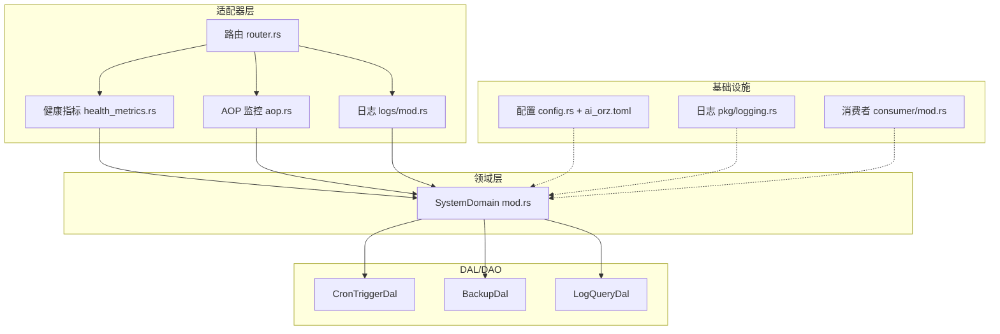
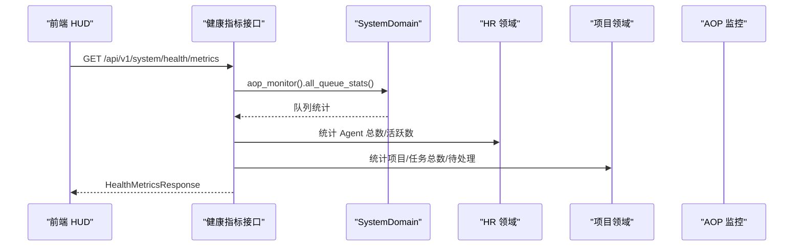
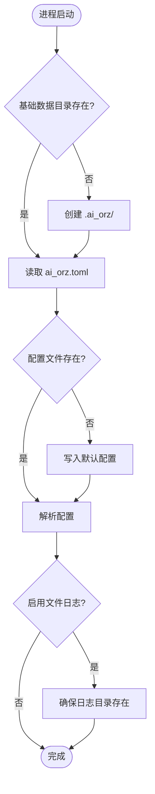
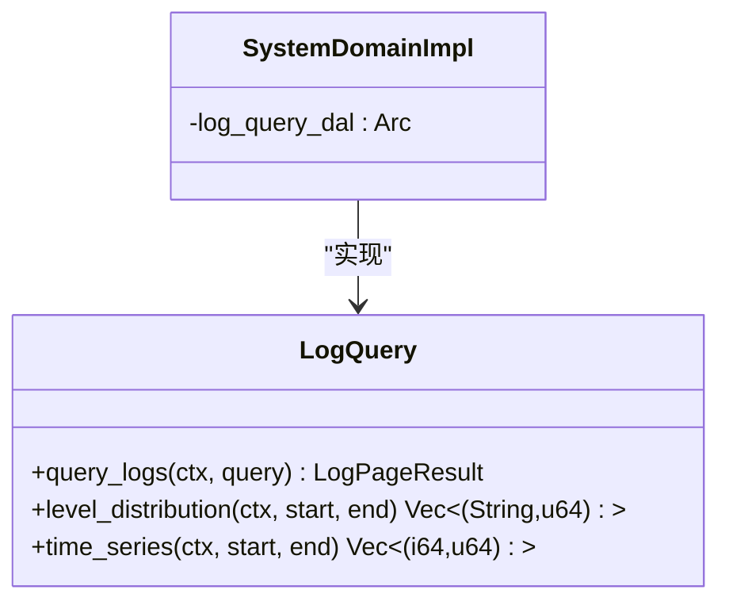
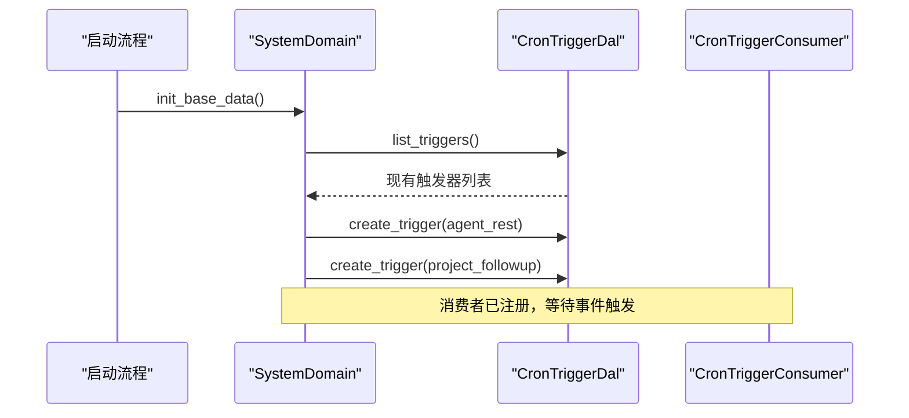
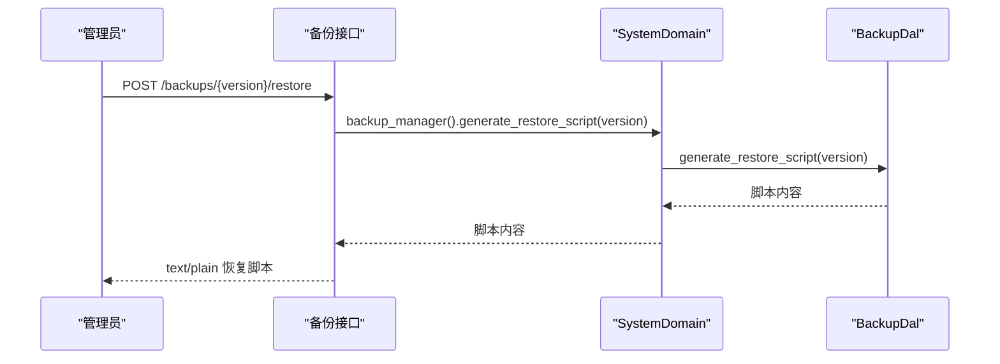
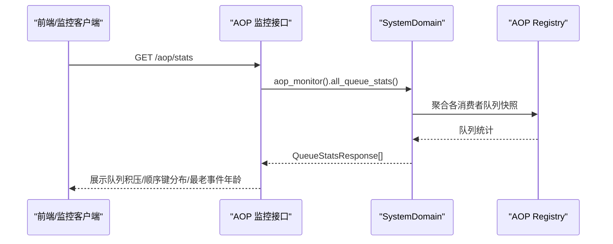
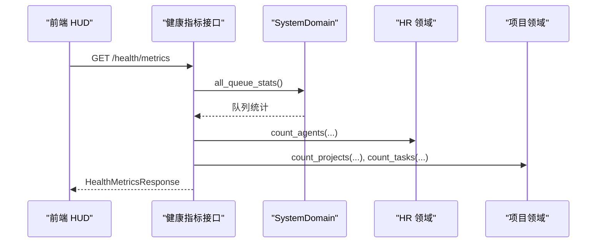
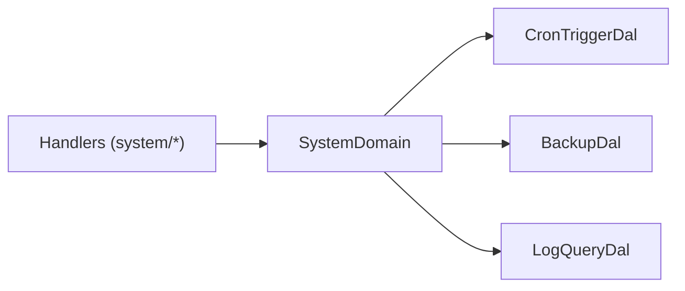

# 系统管理

<cite>
**本文引用的文件**
- [src/config.rs](file://src/config.rs)
- [common/config/ai_orz.toml](file://common/config/ai_orz.toml)
- [src/pkg/logging.rs](file://src/pkg/logging.rs)
- [src/service/domain/system/mod.rs](file://src/service/domain/system/mod.rs)
- [src/handlers/system/mod.rs](file://src/handlers/system/mod.rs)
- [src/handlers/system/health_metrics.rs](file://src/handlers/system/health_metrics.rs)
- [src/handlers/system/aop.rs](file://src/handlers/system/aop.rs)
- [src/handlers/system/logs/mod.rs](file://src/handlers/system/logs/mod.rs)
- [src/router.rs](file://src/router.rs)
- [src/consumer/mod.rs](file://src/consumer/mod.rs)
- [src/models/mcp_server.rs](file://src/models/mcp_server.rs)
- [frontend/src/pages/system/health.rs](file://frontend/src/pages/system/health.rs)
</cite>

## 目录
1. [简介](#简介)
2. [项目结构](#项目结构)
3. [核心组件](#核心组件)
4. [架构总览](#架构总览)
5. [详细组件分析](#详细组件分析)
6. [依赖关系分析](#依赖关系分析)
7. [性能考量](#性能考量)
8. [故障排查指南](#故障排查指南)
9. [结论](#结论)
10. [附录](#附录)

## 简介
本章节面向系统管理员与运维工程师，系统性说明 AI Orz 的系统管理能力：配置与环境变量、监控与健康检查、日志与统计、定时任务调度、备份恢复、AOP 事件中心与指标采集、告警与错误追踪、调试工具、扩展点与插件集成、以及高可用部署与灾难恢复策略。文档严格遵循四层单向调用（Adapter → Domain → DAL → DAO）与 pkg 无业务感知原则，所有能力通过 System 领域统一对外暴露。

## 项目结构
系统管理相关代码主要分布在以下位置：
- 配置与环境：应用配置加载、默认配置生成、环境变量覆盖
- 日志与审计：控制台与文件日志、按日滚动、JSON 输出、保留清理
- 系统领域：SystemDomain 聚合 CronManager、BackupManager、LogQuery、AopMonitor、AopStats
- HTTP 接口：健康指标、AOP 队列监控、日志查询与统计、种子配置迁移
- 消费者与调度：AOP 消费者注册、定时触发器消费
- 前端仪表盘：健康监控 HUD 页面轮询刷新

图表来源
- [src/router.rs:637-708](file://src/router.rs#L637-L708)
- [src/handlers/system/health_metrics.rs:1-135](file://src/handlers/system/health_metrics.rs#L1-L135)
- [src/handlers/system/aop.rs:1-145](file://src/handlers/system/aop.rs#L1-L145)
- [src/handlers/system/logs/mod.rs:1-6](file://src/handlers/system/logs/mod.rs#L1-L6)
- [src/service/domain/system/mod.rs:1-416](file://src/service/domain/system/mod.rs#L1-L416)
- [src/config.rs:1-78](file://src/config.rs#L1-L78)
- [common/config/ai_orz.toml:1-43](file://common/config/ai_orz.toml#L1-L43)
- [src/pkg/logging.rs:1-172](file://src/pkg/logging.rs#L1-L172)
- [src/consumer/mod.rs:1-42](file://src/consumer/mod.rs#L1-L42)

章节来源
- [src/router.rs:637-708](file://src/router.rs#L637-L708)
- [src/handlers/system/mod.rs:1-13](file://src/handlers/system/mod.rs#L1-L13)
- [src/service/domain/system/mod.rs:1-416](file://src/service/domain/system/mod.rs#L1-L416)
- [src/config.rs:1-78](file://src/config.rs#L1-L78)
- [common/config/ai_orz.toml:1-43](file://common/config/ai_orz.toml#L1-L43)
- [src/pkg/logging.rs:1-172](file://src/pkg/logging.rs#L1-L172)
- [src/consumer/mod.rs:1-42](file://src/consumer/mod.rs#L1-L42)

## 核心组件
- 配置与环境变量管理
  - 应用配置单例化，首次运行自动从嵌入的默认配置生成到基础数据目录；支持环境变量覆盖关键项（如 JWT 密钥与过期时间）。
  - 日志目录与基础数据目录在启动时确保存在。
- 日志系统
  - 同时输出到控制台与按日滚动的日志文件；支持 JSON/文本格式；可配置保留天数并自动清理旧日志。
- 系统领域（SystemDomain）
  - 统一提供 CronManager（定时任务）、BackupManager（备份/恢复脚本）、LogQuery（日志查询与统计）、AopMonitor（AOP 队列监控）、AopStats（AOP 指标统计）。
  - 第二阶段异步初始化系统级默认定时任务（agent_rest 每 4 小时、project_followup 每 1 小时），幂等安全。
- AOP 事件中心与消费者
  - 启动阶段注册消息、定时触发器、工具执行日志/统计、Agent 循环、思考轮次、任务事件等消费者。
- 健康指标与前端 HUD
  - 聚合后端在线状态、AOP 队列积压、活跃 Agent/项目比例、待处理任务数、运行时长；前端每 10 秒轮询刷新。

章节来源
- [src/config.rs:1-78](file://src/config.rs#L1-L78)
- [common/config/ai_orz.toml:1-43](file://common/config/ai_orz.toml#L1-L43)
- [src/pkg/logging.rs:1-172](file://src/pkg/logging.rs#L1-L172)
- [src/service/domain/system/mod.rs:1-416](file://src/service/domain/system/mod.rs#L1-L416)
- [src/consumer/mod.rs:1-42](file://src/consumer/mod.rs#L1-L42)
- [frontend/src/pages/system/health.rs:1-97](file://frontend/src/pages/system/health.rs#L1-L97)

## 架构总览
系统管理采用“适配器→领域→DAL→DAO”的单向调用链，SystemDomain 作为管理能力的聚合入口，HTTP Handler 仅做参数校验与编排，具体逻辑下沉至 DAL/DAO。AOP 事件贯穿工具执行、消息投递、定时触发等场景，消费者负责持久化与统计。

图表来源
- [src/handlers/system/health_metrics.rs:1-135](file://src/handlers/system/health_metrics.rs#L1-L135)
- [src/service/domain/system/mod.rs:1-416](file://src/service/domain/system/mod.rs#L1-L416)

## 详细组件分析

### 配置与环境变量管理
- 配置加载流程
  - 首次运行检测基础数据目录，若不存在则创建；若配置文件不存在，从嵌入的默认配置写出。
  - 读取 TOML 配置并解析，确保日志目录存在（当启用文件日志时）。
- 环境变量覆盖
  - 支持通过环境变量覆盖 JWT 密钥与过期时间等敏感配置项。
- 默认配置项
  - 服务器监听地址、SQLite 数据库文件名、前端静态目录、日志开关与目录、A2A 协议开关、JWT 相关项。

图表来源
- [src/config.rs:1-78](file://src/config.rs#L1-L78)
- [common/config/ai_orz.toml:1-43](file://common/config/ai_orz.toml#L1-L43)

章节来源
- [src/config.rs:1-78](file://src/config.rs#L1-L78)
- [common/config/ai_orz.toml:1-43](file://common/config/ai_orz.toml#L1-L43)

### 日志管理与统计
- 日志输出
  - 控制台与文件双写；按日滚动；支持 JSON/文本格式；过滤级别由环境变量控制。
- 日志清理
  - 根据保留天数删除超过期限的日志文件。
- 日志查询与统计
  - 通过 LogQuery 提供分页查询、级别分布、时序聚合（小时桶）。

图表来源
- [src/service/domain/system/mod.rs:151-170](file://src/service/domain/system/mod.rs#L151-L170)
- [src/service/domain/system/mod.rs:280-342](file://src/service/domain/system/mod.rs#L280-L342)

章节来源
- [src/pkg/logging.rs:1-172](file://src/pkg/logging.rs#L1-L172)
- [src/service/domain/system/mod.rs:151-170](file://src/service/domain/system/mod.rs#L151-L170)
- [src/service/domain/system/mod.rs:280-342](file://src/service/domain/system/mod.rs#L280-L342)

### 定时任务调度（Cron 触发器）
- 系统级默认任务
  - 启动后幂等注入两条系统级定时任务：agent_rest（每 4 小时）与 project_followup（每 1 小时），通过 payload 去重避免重复创建。
- 生命周期管理
  - 提供创建、查询、更新、删除、暂停、恢复、到期扫描与执行标记等能力。
- 消费者
  - 定时触发器消费者在 AOP 消费者注册阶段被注册，统一由事件中心驱动。

图表来源
- [src/service/domain/system/mod.rs:34-46](file://src/service/domain/system/mod.rs#L34-L46)
- [src/service/domain/system/mod.rs:358-416](file://src/service/domain/system/mod.rs#L358-L416)
- [src/consumer/mod.rs:16-37](file://src/consumer/mod.rs#L16-L37)

章节来源
- [src/service/domain/system/mod.rs:116-141](file://src/service/domain/system/mod.rs#L116-L141)
- [src/service/domain/system/mod.rs:206-259](file://src/service/domain/system/mod.rs#L206-L259)
- [src/service/domain/system/mod.rs:358-416](file://src/service/domain/system/mod.rs#L358-L416)
- [src/consumer/mod.rs:16-37](file://src/consumer/mod.rs#L16-L37)

### 备份与恢复
- 备份管理
  - 提供创建备份、列出备份、删除备份、生成恢复脚本等能力。
- 恢复脚本
  - 返回纯文本 bash 脚本，便于离线执行恢复；接口受权限保护（SuperAdmin）。
- 路由
  - 备份列表、删除、恢复脚本下载均通过 system_routes 注册。

图表来源
- [src/handlers/system/backup/restore_backup.rs:1-35](file://src/handlers/system/backup/restore_backup.rs#L1-L35)
- [src/service/domain/system/mod.rs:143-149](file://src/service/domain/system/mod.rs#L143-L149)
- [src/service/domain/system/mod.rs:261-278](file://src/service/domain/system/mod.rs#L261-L278)
- [src/router.rs:637-646](file://src/router.rs#L637-L646)

章节来源
- [src/service/domain/system/mod.rs:143-149](file://src/service/domain/system/mod.rs#L143-L149)
- [src/service/domain/system/mod.rs:261-278](file://src/service/domain/system/mod.rs#L261-L278)
- [src/router.rs:637-646](file://src/router.rs#L637-L646)

### AOP 事件系统与监控
- 事件中心与消费者
  - 启动时注册消息、定时触发器、工具执行日志/统计、Agent 循环、思考轮次、任务事件等消费者。
- 队列监控
  - 提供所有队列统计、指定消费者队列统计、事件列表查询、事件详情查看。
- 指标统计
  - 提供概览、时序（滑动窗口 60 分钟，按分钟桶）、分布（按维度分组）等统计接口。

图表来源
- [src/consumer/mod.rs:16-37](file://src/consumer/mod.rs#L16-L37)
- [src/handlers/system/aop.rs:1-145](file://src/handlers/system/aop.rs#L1-L145)
- [src/service/domain/system/mod.rs:172-204](file://src/service/domain/system/mod.rs#L172-L204)
- [src/router.rs:661-690](file://src/router.rs#L661-L690)

章节来源
- [src/consumer/mod.rs:16-37](file://src/consumer/mod.rs#L16-L37)
- [src/handlers/system/aop.rs:1-145](file://src/handlers/system/aop.rs#L1-L145)
- [src/service/domain/system/mod.rs:172-204](file://src/service/domain/system/mod.rs#L172-L204)
- [src/router.rs:661-690](file://src/router.rs#L661-L690)

### 健康检查与前端 HUD
- 健康指标聚合
  - 后端在线、AOP 队列积压/进行中、活跃 Agent/项目比例、待处理任务数、运行时长。
- 前端轮询
  - 页面初始加载后每 10 秒轮询一次，失败时通过 Toast 提示。

图表来源
- [src/handlers/system/health_metrics.rs:1-135](file://src/handlers/system/health_metrics.rs#L1-L135)
- [frontend/src/pages/system/health.rs:1-97](file://frontend/src/pages/system/health.rs#L1-L97)

章节来源
- [src/handlers/system/health_metrics.rs:1-135](file://src/handlers/system/health_metrics.rs#L1-L135)
- [frontend/src/pages/system/health.rs:1-97](file://frontend/src/pages/system/health.rs#L1-L97)

### 系统配置管理、环境变量与动态更新示例
- 配置来源优先级
  - 环境变量 > 外部配置文件（.ai_orz/ai_orz.toml）> 嵌入默认配置。
- 常见配置项
  - 服务器监听地址、数据库文件名、前端静态目录、日志开关与目录、A2A 协议开关、JWT 密钥与过期时间。
- 动态更新建议
  - 对于运行时频繁变更的配置，可通过环境变量热重载或结合进程管理器（如 systemd reload）平滑重启；敏感项（如 JWT 密钥）应配合密钥轮换流程。

章节来源
- [src/config.rs:1-78](file://src/config.rs#L1-L78)
- [common/config/ai_orz.toml:1-43](file://common/config/ai_orz.toml#L1-L43)

### 告警机制、错误追踪与调试工具
- 告警与错误
  - 使用统一的错误模型与错误码；HTTP 层将错误映射为合适的状态码；日志中记录上下文信息。
- 错误追踪
  - 工具调用链路记录 call_id、tool_id、输入/输出脱敏、耗时、状态；必要时附加 caller_location 辅助定位。
- 调试工具
  - 日志查询与统计接口用于快速定位问题；AOP 事件详情可查看事件摘要与负载预览；健康指标用于快速发现异常。

章节来源
- [src/service/dao/tool_call/impl.rs:118-154](file://src/service/dao/tool_call/impl.rs#L118-L154)
- [common/src/api/tool.rs:398-429](file://common/src/api/tool.rs#L398-L429)
- [src/handlers/system/logs/mod.rs:1-6](file://src/handlers/system/logs/mod.rs#L1-L6)

### 扩展点、插件管理与第三方服务集成
- 扩展点
  - SystemDomain 提供 background_task_registry 通用后台任务注册中心，便于接入自定义周期任务。
  - AOP 事件中心允许新增生产者/消费者以扩展系统行为。
- 插件/第三方集成
  - MCP Server 配置支持命令、参数、环境变量、超时、响应大小限制等；对外暴露的管理视图会对敏感字段进行脱敏。

章节来源
- [src/service/domain/system/mod.rs:102-114](file://src/service/domain/system/mod.rs#L102-L114)
- [src/models/mcp_server.rs:125-172](file://src/models/mcp_server.rs#L125-L172)

### 高可用部署、负载均衡与灾难恢复
- 高可用与负载均衡
  - 多实例部署时，建议前置负载均衡器（如 Nginx/Traefik）分发请求；每个实例独立维护本地日志与 SQLite 数据，或使用共享存储/主从数据库方案。
- 灾难恢复
  - 使用备份接口生成恢复脚本，在目标环境执行；恢复前需停止写入并校验脚本；恢复后可通过健康指标与日志统计验证服务状态。
- 数据一致性
  - 基于 SQLite 的单实例场景下，应避免多进程并发写同一数据库；跨实例场景建议使用外部数据库或分布式存储替代。

章节来源
- [src/handlers/system/backup/restore_backup.rs:1-35](file://src/handlers/system/backup/restore_backup.rs#L1-L35)
- [src/handlers/system/health_metrics.rs:1-135](file://src/handlers/system/health_metrics.rs#L1-L135)

## 依赖关系分析
SystemDomain 依赖多个 DAL 抽象，Handler 仅依赖 Domain 接口，保持松耦合与可测试性。

图表来源
- [src/service/domain/system/mod.rs:1-416](file://src/service/domain/system/mod.rs#L1-L416)

章节来源
- [src/service/domain/system/mod.rs:1-416](file://src/service/domain/system/mod.rs#L1-L416)

## 性能考量
- 健康指标聚合
  - 单次请求聚合多个域统计，减少前端并发请求；对计数类操作尽量使用 DAO 层 COUNT 查询。
- 日志统计
  - 级别分布与时序聚合通过一次性拉取时间范围内日志并在内存聚合，设置上限防止大窗口扫描。
- AOP 队列监控
  - 队列统计为内存快照，查询开销低；事件列表支持分页与过滤，限制最大 limit。
- 配置与日志
  - 文件日志按日滚动并支持保留清理，避免磁盘占用过大；JSON 格式便于集中式日志分析。

[本节为通用性能指导，不直接分析具体文件]

## 故障排查指南
- 健康检查失败
  - 检查后端是否可响应；查看 AOP 队列积压与 oldest_event_age_secs；确认 Agent/项目/任务计数是否正常。
- 日志无法写入
  - 检查日志目录是否存在与权限；确认启用文件日志与保留天数配置；查看是否有清理误删。
- 定时任务未执行
  - 检查触发器是否启用、下次执行时间是否正确；查看消费者是否已注册；核对 payload 中的 action 是否与消费者解析一致。
- 备份恢复失败
  - 校验版本是否存在；确认恢复脚本执行环境与权限；恢复后通过健康指标与日志统计验证。

章节来源
- [src/handlers/system/health_metrics.rs:1-135](file://src/handlers/system/health_metrics.rs#L1-L135)
- [src/pkg/logging.rs:1-172](file://src/pkg/logging.rs#L1-L172)
- [src/service/domain/system/mod.rs:358-416](file://src/service/domain/system/mod.rs#L358-L416)
- [src/handlers/system/backup/restore_backup.rs:1-35](file://src/handlers/system/backup/restore_backup.rs#L1-L35)

## 结论
AI Orz 的系统管理能力围绕 SystemDomain 构建，提供配置、日志、监控、定时任务、备份恢复、AOP 事件与指标、健康检查等完整运维能力。通过清晰的层次划分与可扩展的事件中心，既保证了系统的稳定性与可观测性，也为后续扩展与集成预留了良好空间。建议在生产环境中结合负载均衡、外部日志收集与备份策略，形成完整的运维闭环。

[本节为总结，不直接分析具体文件]

## 附录
- 常用管理接口一览（部分）
  - 健康指标：GET /api/v1/system/health/metrics
  - AOP 队列监控：GET /api/v1/system/aop/stats、/aop/{consumer}/stats、/aop/{consumer}/events、/aop/{consumer}/events/{event_id}
  - 日志查询与统计：GET /api/v1/system/logs、/logs/stats/level-distribution、/logs/stats/time-series
  - 备份与恢复：GET/POST/DELETE /api/v1/system/backups/*
  - 种子配置迁移：/api/v1/system/seed/*

章节来源
- [src/router.rs:637-708](file://src/router.rs#L637-L708)